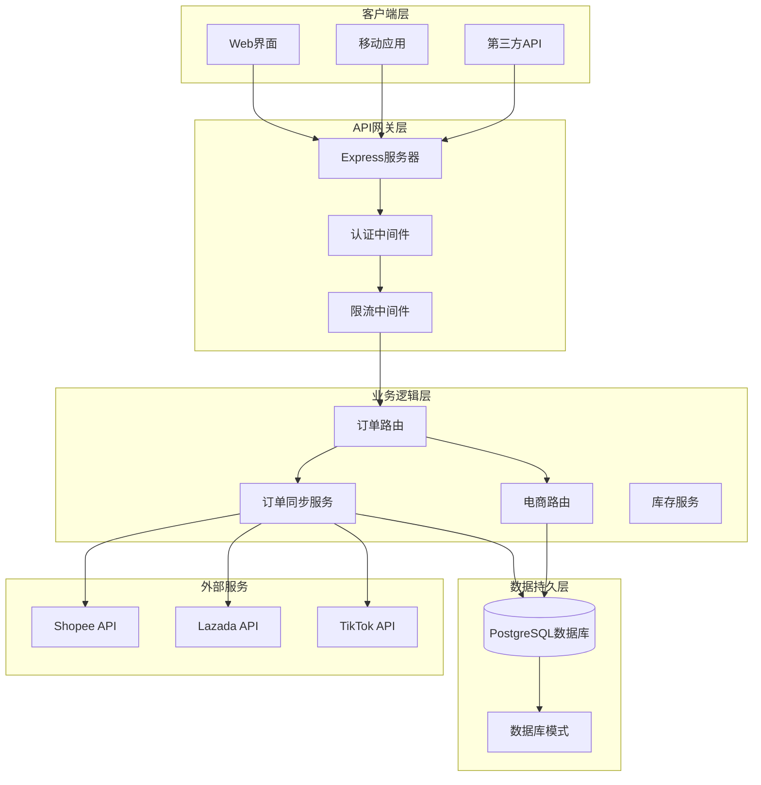
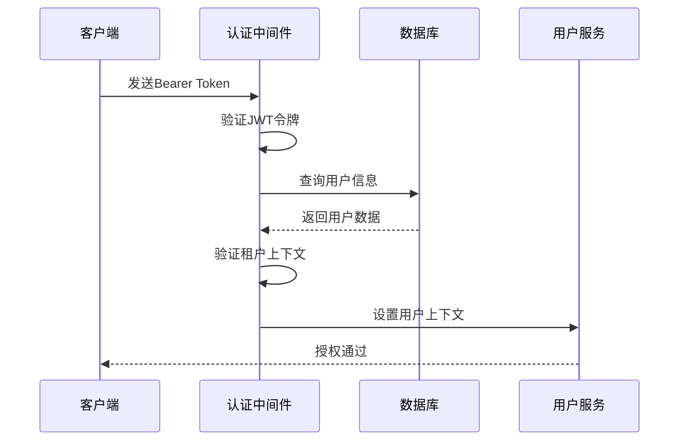
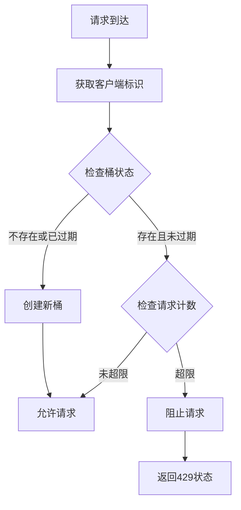
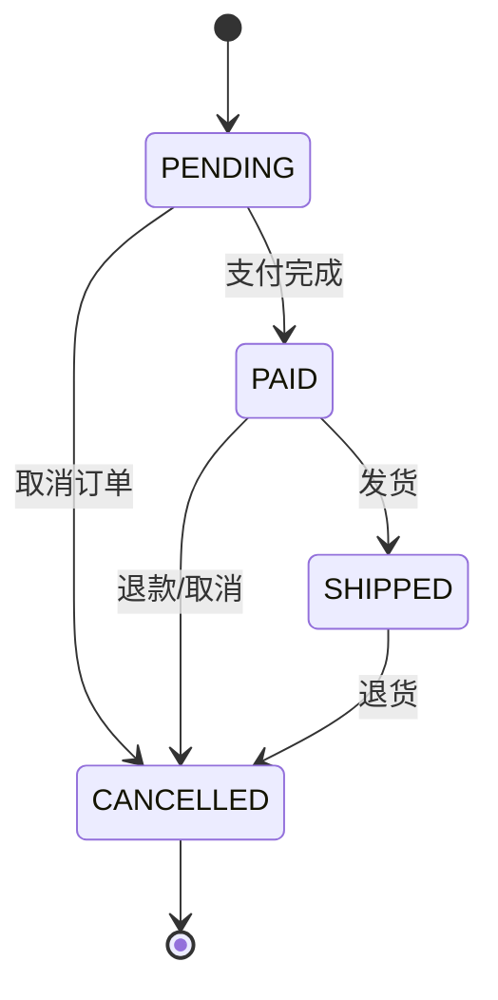
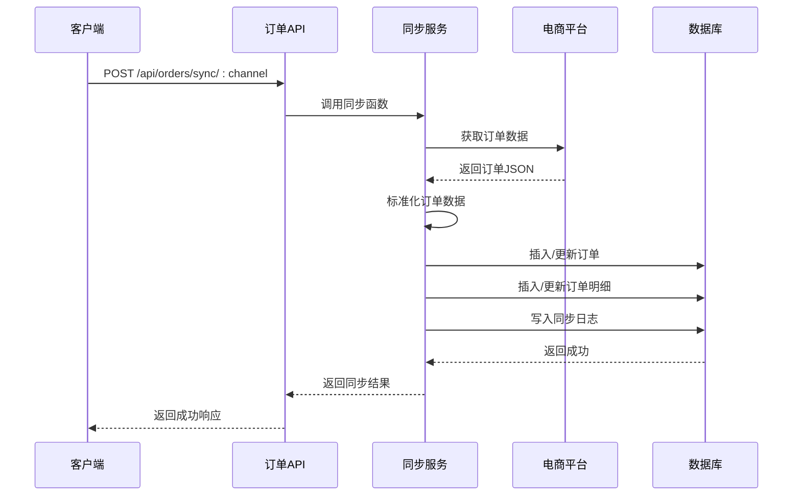
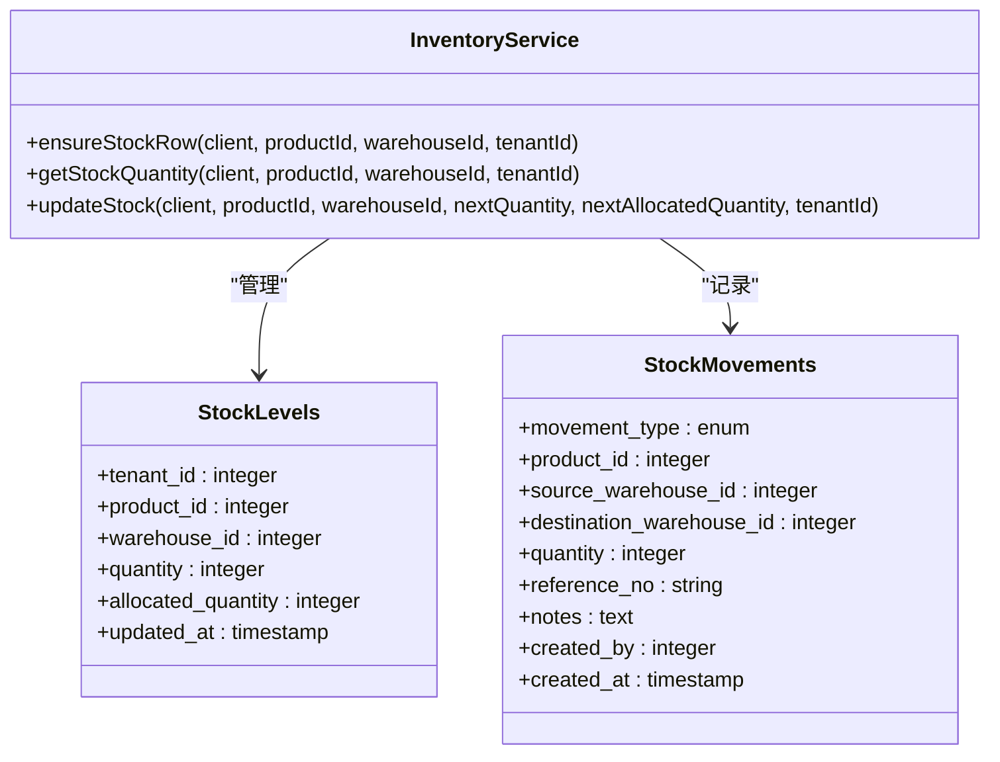
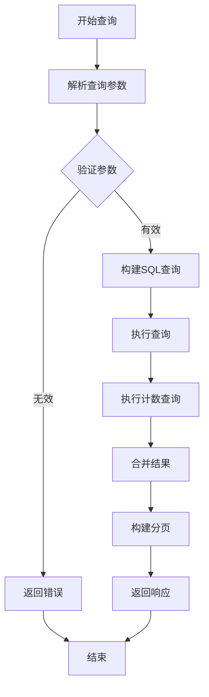
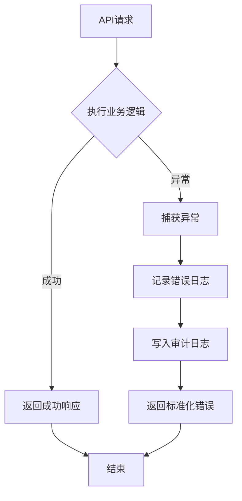

# 订单管理API

<cite>
**本文档引用的文件**
- [orderRoutes.js](file://server/src/routes/orderRoutes.js)
- [orderSyncService.js](file://server/src/services/orderSyncService.js)
- [marketplaceRoutes.js](file://server/src/routes/marketplaceRoutes.js)
- [schema.sql](file://server/database/schema.sql)
- [auth.js](file://server/src/middleware/auth.js)
- [rateLimit.js](file://server/src/middleware/rateLimit.js)
- [pagination.js](file://server/src/utils/pagination.js)
- [auditTrail.js](file://server/src/middleware/auditTrail.js)
- [auditLog.js](file://server/src/utils/auditLog.js)
- [app.js](file://server/src/app.js)
- [package.json](file://server/package.json)
</cite>

## 目录
1. [项目概述](#项目概述)
2. [系统架构](#系统架构)
3. [核心组件](#核心组件)
4. [订单CRUD操作](#订单crud操作)
5. [订单状态管理](#订单状态管理)
6. [订单与库存关联](#订单与库存关联)
7. [查询筛选与分页](#查询筛选与分页)
8. [业务规则与异常处理](#业务规则与异常处理)
9. [性能优化建议](#性能优化建议)
10. [故障排除指南](#故障排除指南)
11. [总结](#总结)

## 项目概述

订单管理API是库存管理系统的核心模块，负责处理来自电商平台的订单数据。该系统支持Shopee、Lazada和TikTok三个主流电商平台的订单同步，提供完整的订单生命周期管理功能。

### 主要功能特性
- **多平台订单同步**：自动从电商平台拉取订单数据
- **订单状态管理**：实时跟踪订单状态流转
- **库存关联**：订单与库存系统的无缝对接
- **权限控制**：基于角色的访问控制机制
- **审计日志**：完整的操作审计和追踪
- **错误监控**：全面的错误日志和监控

## 系统架构



**图表来源**
- [app.js:26-80](file://server/src/app.js#L26-L80)
- [orderRoutes.js:1-124](file://server/src/routes/orderRoutes.js#L1-L124)
- [marketplaceRoutes.js:1-685](file://server/src/routes/marketplaceRoutes.js#L1-L685)

## 核心组件

### 认证与授权中间件

系统采用JWT令牌认证机制，确保API调用的安全性：



**图表来源**
- [auth.js:5-61](file://server/src/middleware/auth.js#L5-L61)

### 限流机制

系统实现了智能限流，防止API滥用：



**图表来源**
- [rateLimit.js:9-35](file://server/src/middleware/rateLimit.js#L9-L35)

## 订单CRUD操作

### 订单列表查询

订单列表查询支持多种筛选条件和分页功能：

**API端点**: `GET /api/orders`

**查询参数**:
- `channel`: 电商平台渠道 (shopee, lazada, tiktok)
- `status`: 订单状态 (PENDING, PAID, SHIPPED, CANCELLED)
- `search`: 搜索关键词 (订单号或买家姓名)
- `page`: 页码 (默认1)
- `pageSize`: 每页数量 (默认10, 最大100)

**响应结构**:
```javascript
{
  "items": [
    {
      "id": 1,
      "external_order_id": "ORD001",
      "order_status": "PENDING",
      "buyer_name": "张三",
      "item_count": 2,
      "order_created_at": "2024-01-15T10:30:00Z",
      "synced_at": "2024-01-15T10:35:00Z"
    }
  ],
  "pagination": {
    "total": 150,
    "page": 1,
    "pageSize": 10,
    "totalPages": 15
  }
}
```

**图表来源**
- [orderRoutes.js:33-88](file://server/src/routes/orderRoutes.js#L33-L88)

### 订单详情查询

**API端点**: `GET /api/orders/:id`

**功能特性**:
- 支持租户隔离的数据访问
- 自动关联订单商品明细
- 商品信息与产品SKU映射

**响应结构**:
```javascript
{
  "id": 1,
  "external_order_id": "ORD001",
  "order_status": "PENDING",
  "buyer_name": "张三",
  "total_amount": 299.00,
  "currency": "USD",
  "items": [
    {
      "id": 1,
      "external_item_id": "ITEM001",
      "product_name": "商品名称",
      "product_sku": "SKU001",
      "quantity": 2,
      "unit_price": 149.50
    }
  ]
}
```

**图表来源**
- [orderRoutes.js:90-121](file://server/src/routes/orderRoutes.js#L90-L121)

## 订单状态管理

### 支持的订单状态

系统支持以下订单状态：

| 状态 | 描述 | 用途 |
|------|------|------|
| PENDING | 待处理 | 新订单创建 |
| PAID | 已支付 | 支付确认 |
| SHIPPED | 已发货 | 物流发货 |
| CANCELLED | 已取消 | 订单取消 |

### 状态流转控制



**图表来源**
- [orderSyncService.js:8-16](file://server/src/services/orderSyncService.js#L8-L16)

### 订单同步流程



**图表来源**
- [orderSyncService.js:19-123](file://server/src/services/orderSyncService.js#L19-L123)

## 订单与库存关联

### 库存管理服务

系统提供了统一的库存管理服务，确保订单与库存的一致性：



**图表来源**
- [inventoryService.js:1-46](file://server/src/utils/inventoryService.js#L1-L46)

### 库存分配策略

系统支持两种库存分配模式：

1. **预留模式 (RESERVE)**: 占用库存但不减少可用库存
2. **释放模式 (RELEASE)**: 释放已占用的库存

**库存一致性保证**:
- 使用数据库事务确保操作原子性
- 实现库存负数保护机制
- 提供库存超卖检测

## 查询筛选与分页

### 分页参数处理

系统实现了统一的分页参数处理机制：

**分页参数**:
- `page`: 页码 (最小1)
- `pageSize`: 每页大小 (1-100之间)

**分页计算**:
```javascript
// 计算偏移量
offset = (page - 1) * pageSize

// 构建分页响应
pagination = {
  total: totalCount,
  page: currentPage,
  pageSize: pageSize,
  totalPages: Math.ceil(totalCount / pageSize)
}
```

**图表来源**
- [pagination.js:2-27](file://server/src/utils/pagination.js#L2-L27)

### 高级查询功能

订单查询支持多种筛选条件：



**图表来源**
- [orderRoutes.js:33-88](file://server/src/routes/orderRoutes.js#L33-L88)

## 业务规则与异常处理

### 认证与授权规则

系统实施了严格的访问控制：

**角色权限矩阵**:
- ADMIN: 完全访问权限
- MANAGER: 读取和基本管理权限  
- STAFF: 仅读取权限

**租户隔离**:
- 所有API请求都强制要求有效的租户上下文
- 数据访问严格限制在当前租户范围内
- 防止跨租户数据泄露

### 异常处理策略



**图表来源**
- [orderRoutes.js:85-87](file://server/src/routes/orderRoutes.js#L85-L87)

### 错误响应格式

系统提供统一的错误响应格式：

```javascript
{
  "success": false,
  "error": {
    "code": "ERROR_CODE",
    "message": "错误描述",
    "details": {
      // 具体错误详情
    }
  }
}
```

## 性能优化建议

### 数据库优化

1. **索引优化**
   - 为常用查询字段建立适当索引
   - 优化订单状态和渠道的查询性能

2. **查询优化**
   - 使用LIMIT和OFFSET实现高效分页
   - 避免N+1查询问题
   - 使用EXPLAIN ANALYZE分析慢查询

3. **连接池管理**
   - 合理配置数据库连接池大小
   - 实施连接超时和重试机制

### 缓存策略

1. **热点数据缓存**
   - 缓存常用的订单状态映射
   - 缓存电商平台配置信息

2. **响应缓存**
   - 对静态查询结果实施缓存
   - 使用ETag实现条件请求

### 异步处理

1. **批量操作**
   - 支持批量订单同步
   - 异步处理耗时操作

2. **队列系统**
   - 实施消息队列处理后台任务
   - 实现任务重试和死信队列

## 故障排除指南

### 常见问题诊断

**认证失败**:
- 检查JWT令牌是否过期
- 验证用户角色权限
- 确认租户上下文有效性

**API限流**:
- 检查请求频率是否超过限制
- 实施指数退避重试策略
- 监控限流指标

**数据库连接问题**:
- 检查连接池配置
- 验证数据库服务状态
- 监控连接数使用情况

### 日志分析

系统提供了多层次的日志记录：

1. **访问日志**: 记录所有API请求
2. **审计日志**: 记录重要业务操作
3. **错误日志**: 记录系统错误和异常
4. **性能日志**: 记录慢查询和性能指标

### 监控指标

建议监控以下关键指标：
- API响应时间
- 请求成功率
- 错误率
- 数据库连接使用率
- 缓存命中率

## 总结

订单管理API提供了完整的企业级订单处理解决方案，具有以下特点：

**技术优势**:
- 基于Express.js的高性能Web框架
- 完善的认证授权机制
- 智能限流和错误处理
- 全面的审计日志系统

**业务价值**:
- 支持多电商平台订单统一管理
- 实现实时库存同步和一致性保证
- 提供灵活的查询和筛选功能
- 确保数据安全和合规性

**扩展性**:
- 模块化设计便于功能扩展
- 支持新的电商平台接入
- 可配置的业务规则引擎
- 灵活的权限和角色管理

该系统为企业提供了可靠的订单管理基础设施，支持业务的持续发展和扩展需求。