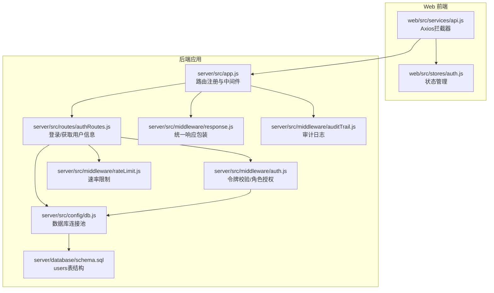
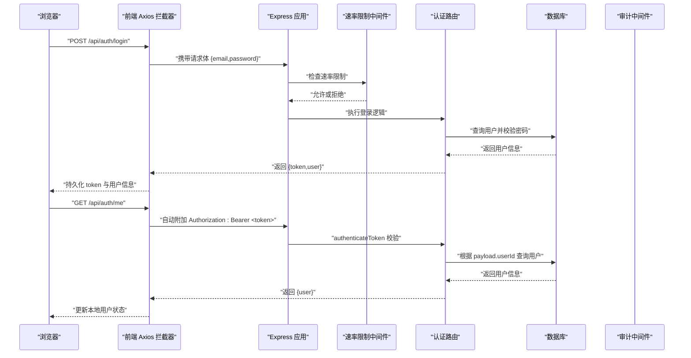
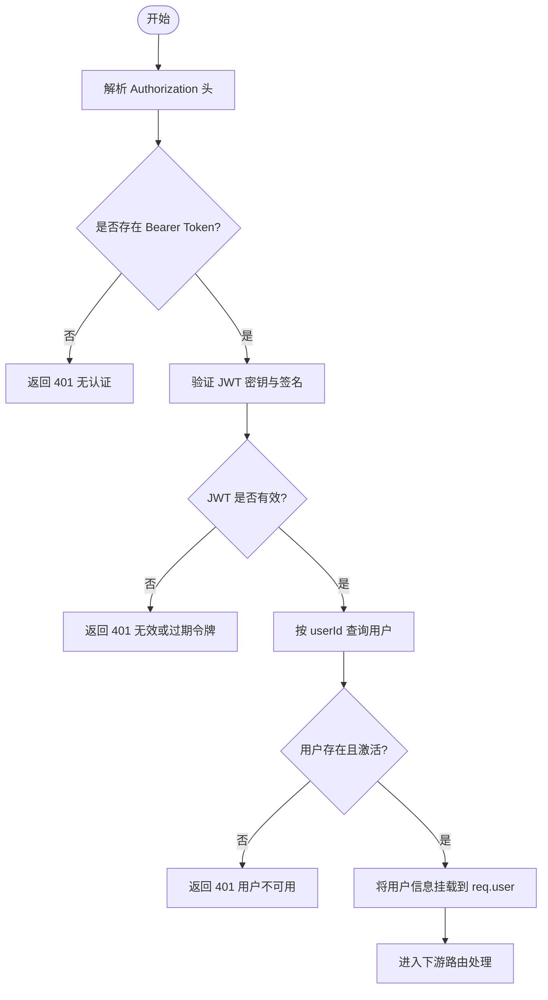
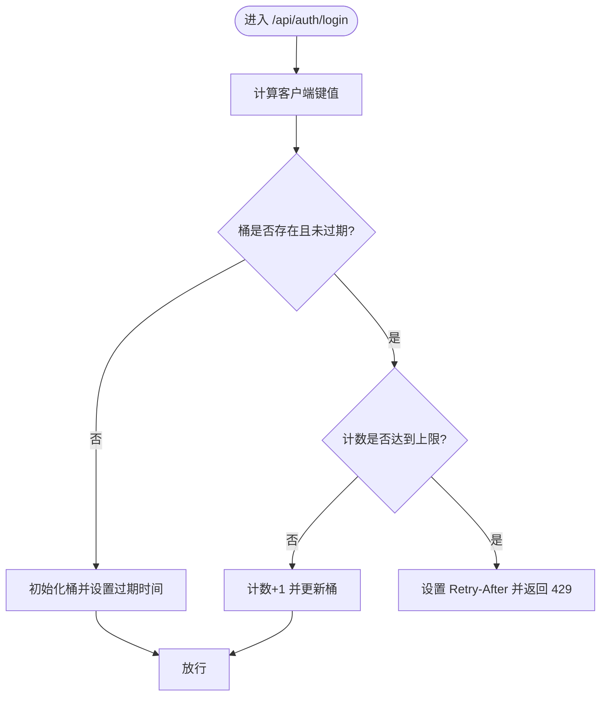
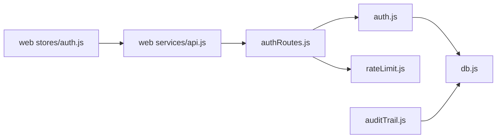

# 认证与授权API

<cite>
**本文引用的文件**
- [server/src/routes/authRoutes.js](file://server/src/routes/authRoutes.js)
- [server/src/middleware/auth.js](file://server/src/middleware/auth.js)
- [server/src/middleware/rateLimit.js](file://server/src/middleware/rateLimit.js)
- [server/src/middleware/response.js](file://server/src/middleware/response.js)
- [server/src/middleware/auditTrail.js](file://server/src/middleware/auditTrail.js)
- [server/src/config/db.js](file://server/src/config/db.js)
- [server/src/app.js](file://server/src/app.js)
- [server/database/schema.sql](file://server/database/schema.sql)
- [web/src/stores/auth.js](file://web/src/stores/auth.js)
- [web/src/services/api.js](file://web/src/services/api.js)
- [postman/inventory_system_backend.postman_collection.json](file://postman/inventory_system_backend.postman_collection.json)
</cite>

## 目录
1. [简介](#简介)
2. [项目结构](#项目结构)
3. [核心组件](#核心组件)
4. [架构总览](#架构总览)
5. [详细组件分析](#详细组件分析)
6. [依赖关系分析](#依赖关系分析)
7. [性能考量](#性能考量)
8. [故障排查指南](#故障排查指南)
9. [结论](#结论)
10. [附录](#附录)

## 简介
本文件面向认证与授权API，重点覆盖以下内容：
- JWT令牌生成、验证与刷新机制的实现原理与使用方法
- 用户登录API的HTTP方法、URL模式、请求/响应格式与认证方式
- 登录速率限制策略与安全考虑
- 用户信息获取API的功能与参数
- 错误处理策略、安全最佳实践与性能优化建议
- 实际代码示例与常见用例演示（通过源码路径引用）

## 项目结构
后端采用Express应用，路由集中于 /api/auth，认证中间件负责令牌解析与校验，速率限制中间件用于保护登录接口，审计中间件记录关键操作。

图表来源
- [server/src/app.js:39](file://server/src/app.js#L39)
- [server/src/routes/authRoutes.js:17-69](file://server/src/routes/authRoutes.js#L17-L69)
- [server/src/middleware/auth.js:5-29](file://server/src/middleware/auth.js#L5-L29)
- [server/src/middleware/rateLimit.js:9-35](file://server/src/middleware/rateLimit.js#L9-L35)
- [server/src/middleware/response.js:3-57](file://server/src/middleware/response.js#L3-L57)
- [server/src/middleware/auditTrail.js:47-79](file://server/src/middleware/auditTrail.js#L47-L79)
- [server/src/config/db.js:15-24](file://server/src/config/db.js#L15-L24)
- [server/database/schema.sql:2-11](file://server/database/schema.sql#L2-L11)

章节来源
- [server/src/app.js:39](file://server/src/app.js#L39)
- [server/src/routes/authRoutes.js:17-69](file://server/src/routes/authRoutes.js#L17-L69)

## 核心组件
- 路由层：提供 /api/auth/login（POST）与 /api/auth/me（GET）
- 中间件层：令牌校验 authenticateToken、角色授权 authorizeRoles、速率限制 createRateLimiter、统一响应 responseMiddleware、审计审计 auditTrail
- 数据层：PostgreSQL 连接池与 users 表结构
- 前端集成：Axios 拦截器自动注入 Authorization 头；Pinia Store 持久化 token 与用户信息

章节来源
- [server/src/routes/authRoutes.js:17-69](file://server/src/routes/authRoutes.js#L17-L69)
- [server/src/middleware/auth.js:5-29](file://server/src/middleware/auth.js#L5-L29)
- [server/src/middleware/rateLimit.js:9-35](file://server/src/middleware/rateLimit.js#L9-L35)
- [server/src/middleware/response.js:3-57](file://server/src/middleware/response.js#L3-L57)
- [server/src/middleware/auditTrail.js:47-79](file://server/src/middleware/auditTrail.js#L47-L79)
- [server/src/config/db.js:15-24](file://server/src/config/db.js#L15-L24)
- [server/database/schema.sql:2-11](file://server/database/schema.sql#L2-L11)
- [web/src/services/api.js:8-24](file://web/src/services/api.js#L8-L24)
- [web/src/stores/auth.js:20-78](file://web/src/stores/auth.js#L20-L78)

## 架构总览
下图展示从浏览器到后端的关键交互流程，包括登录、令牌校验与审计记录。

图表来源
- [server/src/routes/authRoutes.js:17-69](file://server/src/routes/authRoutes.js#L17-L69)
- [server/src/middleware/auth.js:5-29](file://server/src/middleware/auth.js#L5-L29)
- [server/src/middleware/rateLimit.js:9-35](file://server/src/middleware/rateLimit.js#L9-L35)
- [server/src/middleware/auditTrail.js:47-79](file://server/src/middleware/auditTrail.js#L47-L79)
- [server/src/config/db.js:15-24](file://server/src/config/db.js#L15-L24)
- [web/src/services/api.js:8-24](file://web/src/services/api.js#L8-L24)

## 详细组件分析

### 登录API（POST /api/auth/login）
- HTTP方法与URL：POST /api/auth/login
- 请求体字段
  - email: 字符串，必填
  - password: 字符串，必填
- 成功响应字段
  - token: 字符串，JWT
  - user: 对象，包含 id、full_name、email、role、preferred_currency
- 认证方式
  - 登录成功后返回的 token 可在后续请求中通过 Authorization: Bearer <token> 使用
- 安全与速率限制
  - 使用 createRateLimiter 创建登录速率限制（默认窗口1分钟最多10次），防止暴力破解
- 审计
  - 登录成功且状态码小于400时，审计中间件记录 LOGIN 类型的审计日志

章节来源
- [server/src/routes/authRoutes.js:17-69](file://server/src/routes/authRoutes.js#L17-L69)
- [server/src/middleware/rateLimit.js:9-35](file://server/src/middleware/rateLimit.js#L9-L35)
- [server/src/middleware/auditTrail.js:21-28](file://server/src/middleware/auditTrail.js#L21-L28)
- [web/src/services/api.js:8-24](file://web/src/services/api.js#L8-L24)

### 获取当前用户API（GET /api/auth/me）
- HTTP方法与URL：GET /api/auth/me
- 请求头
  - Authorization: Bearer <token>
- 成功响应字段
  - user: 当前用户对象（来自已认证的 req.user）
- 认证方式
  - 需要有效的 JWT 令牌，由 authenticateToken 中间件校验
- 前端使用
  - 前端 Axios 在拦截器中自动附加 Authorization 头
  - Pinia Store 提供 fetchMe 方法用于刷新本地用户状态

章节来源
- [server/src/routes/authRoutes.js:67-69](file://server/src/routes/authRoutes.js#L67-L69)
- [server/src/middleware/auth.js:5-29](file://server/src/middleware/auth.js#L5-L29)
- [web/src/services/api.js:8-24](file://web/src/services/api.js#L8-L24)
- [web/src/stores/auth.js:60-78](file://web/src/stores/auth.js#L60-L78)

### JWT 令牌生成、验证与刷新机制
- 生成
  - 登录成功后使用对称密钥（JWT_SECRET）签发 JWT，有效期为8小时
- 验证
  - authenticateToken 从 Authorization 头提取 Bearer token 并验证有效性
  - 验证通过后再次查询数据库确认用户存在且处于激活状态
- 刷新
  - 当前实现未提供独立的“刷新令牌”接口；建议采用短期访问令牌（如8小时）+ 刷新令牌（短期）的方案，或在客户端到期后引导重新登录

图表来源
- [server/src/middleware/auth.js:5-29](file://server/src/middleware/auth.js#L5-L29)
- [server/src/config/db.js:15-24](file://server/src/config/db.js#L15-L24)

章节来源
- [server/src/routes/authRoutes.js:41-43](file://server/src/routes/authRoutes.js#L41-L43)
- [server/src/middleware/auth.js:5-29](file://server/src/middleware/auth.js#L5-L29)

### 速率限制策略（登录接口）
- 规则
  - 窗口大小：1分钟
  - 最大请求数：10次
  - 命名空间：auth-login
- 超限处理
  - 设置 Retry-After 响应头
  - 返回 429 Too Many Requests；若存在 res.fail 则使用统一失败格式

图表来源
- [server/src/middleware/rateLimit.js:9-35](file://server/src/middleware/rateLimit.js#L9-L35)

章节来源
- [server/src/routes/authRoutes.js:10-14](file://server/src/routes/authRoutes.js#L10-L14)
- [server/src/middleware/rateLimit.js:9-35](file://server/src/middleware/rateLimit.js#L9-L35)

### 统一响应与错误处理
- 统一包装
  - 所有响应通过 responseMiddleware 包装为 {success,data,requestId} 或 {success,false,code,message,details,requestId}
- 错误兜底
  - 全局错误中间件将异常转换为统一错误响应，避免泄露内部堆栈

章节来源
- [server/src/middleware/response.js:3-57](file://server/src/middleware/response.js#L3-L57)
- [server/src/app.js:55-62](file://server/src/app.js#L55-L62)

### 审计日志
- 登录审计
  - 登录成功且状态码<400时，记录 LOGIN 类型审计日志，包含用户上下文与请求体脱敏
- 其他写操作
  - 对 POST/PUT/PATCH/DELETE 且状态码<400 的请求，推断实体类型与动作并记录

章节来源
- [server/src/middleware/auditTrail.js:14-79](file://server/src/middleware/auditTrail.js#L14-L79)

### 前端集成要点
- Axios 拦截器
  - 自动附加 Authorization: Bearer <token>，支持 x-cost-access-token、x-ui-locale 等自定义头部
- Pinia Store
  - 持久化 token 与用户信息至 localStorage
  - 提供 login 与 fetchMe 方法，登录成功后自动刷新货币偏好与通知状态

章节来源
- [web/src/services/api.js:8-24](file://web/src/services/api.js#L8-L24)
- [web/src/stores/auth.js:20-78](file://web/src/stores/auth.js#L20-L78)

## 依赖关系分析
- 路由依赖中间件：authRoutes 依赖 authenticateToken 与 createRateLimiter
- 中间件依赖数据层：authenticateToken 与 auditTrail 依赖数据库查询
- 前端依赖后端：Axios 拦截器依赖本地存储中的 token

图表来源
- [server/src/routes/authRoutes.js:5-6](file://server/src/routes/authRoutes.js#L5-L6)
- [server/src/middleware/auth.js:1-2](file://server/src/middleware/auth.js#L1-L2)
- [server/src/middleware/rateLimit.js:1-1](file://server/src/middleware/rateLimit.js#L1-L1)
- [server/src/middleware/auditTrail.js:1-2](file://server/src/middleware/auditTrail.js#L1-L2)
- [server/src/config/db.js:1-2](file://server/src/config/db.js#L1-L2)
- [web/src/services/api.js:1-5](file://web/src/services/api.js#L1-L5)
- [web/src/stores/auth.js:1-6](file://web/src/stores/auth.js#L1-L6)

## 性能考量
- 数据库连接
  - 使用连接池与 SSL 条件启用，生产环境建议开启 SSL 并合理设置超时
- 响应封装
  - 统一响应减少前端判断成本，但需注意避免过度嵌套
- 速率限制
  - 登录接口默认1分钟10次，可根据部署环境调整窗口与阈值
- 前端缓存
  - 建议在内存中缓存用户信息，仅在刷新页面或首次加载时调用 /auth/me

章节来源
- [server/src/config/db.js:15-24](file://server/src/config/db.js#L15-L24)
- [server/src/middleware/response.js:3-57](file://server/src/middleware/response.js#L3-L57)
- [server/src/middleware/rateLimit.js:9-35](file://server/src/middleware/rateLimit.js#L9-L35)
- [web/src/stores/auth.js:60-78](file://web/src/stores/auth.js#L60-L78)

## 故障排查指南
- 401 Authentication token is required
  - 检查前端是否正确设置 Authorization 头
  - 参考：[server/src/middleware/auth.js:9-11](file://server/src/middleware/auth.js#L9-L11)
- 401 Invalid or expired token
  - 检查 JWT_SECRET 是否一致、令牌是否过期
  - 参考：[server/src/middleware/auth.js:26-28](file://server/src/middleware/auth.js#L26-L28)
- 401 Invalid email or password
  - 检查邮箱是否存在、用户是否激活、密码哈希是否匹配
  - 参考：[server/src/routes/authRoutes.js:31-39](file://server/src/routes/authRoutes.js#L31-L39)
- 429 Too many requests
  - 登录过于频繁，等待重试时间后重试
  - 参考：[server/src/middleware/rateLimit.js:23-29](file://server/src/middleware/rateLimit.js#L23-L29)
- 500 Internal server error
  - 查看统一错误响应中的 requestId，定位日志
  - 参考：[server/src/app.js:55-62](file://server/src/app.js#L55-L62)

章节来源
- [server/src/middleware/auth.js:9-28](file://server/src/middleware/auth.js#L9-L28)
- [server/src/routes/authRoutes.js:31-39](file://server/src/routes/authRoutes.js#L31-L39)
- [server/src/middleware/rateLimit.js:23-29](file://server/src/middleware/rateLimit.js#L23-L29)
- [server/src/app.js:55-62](file://server/src/app.js#L55-L62)

## 结论
本系统基于对称密钥 JWT 实现认证，结合速率限制与审计日志保障安全性，并通过前端拦截器与状态管理简化令牌使用。当前未提供独立刷新令牌接口，建议在后续版本引入刷新令牌或缩短访问令牌有效期以提升安全性。

## 附录

### API 定义与示例（路径引用）
- 登录
  - 方法与URL：POST /api/auth/login
  - 请求体：{ email, password }
  - 成功响应：{ token, user }
  - 示例集合条目：[登录请求:52-64](file://postman/inventory_system_backend.postman_collection.json#L52-L64)
- 获取当前用户
  - 方法与URL：GET /api/auth/me
  - 请求头：Authorization: Bearer <token>
  - 成功响应：{ user }
  - 示例集合条目：[获取用户信息请求:68-76](file://postman/inventory_system_backend.postman_collection.json#L68-L76)

章节来源
- [postman/inventory_system_backend.postman_collection.json:52-76](file://postman/inventory_system_backend.postman_collection.json#L52-L76)

### 数据模型（users 表）
- 关键字段
  - id、full_name、email、password_hash、role、is_active、preferred_currency
- 角色枚举：ADMIN、MANAGER、STAFF
- 索引与约束：email 唯一、role 枚举校验、preferred_currency 默认值

章节来源
- [server/database/schema.sql:2-11](file://server/database/schema.sql#L2-L11)