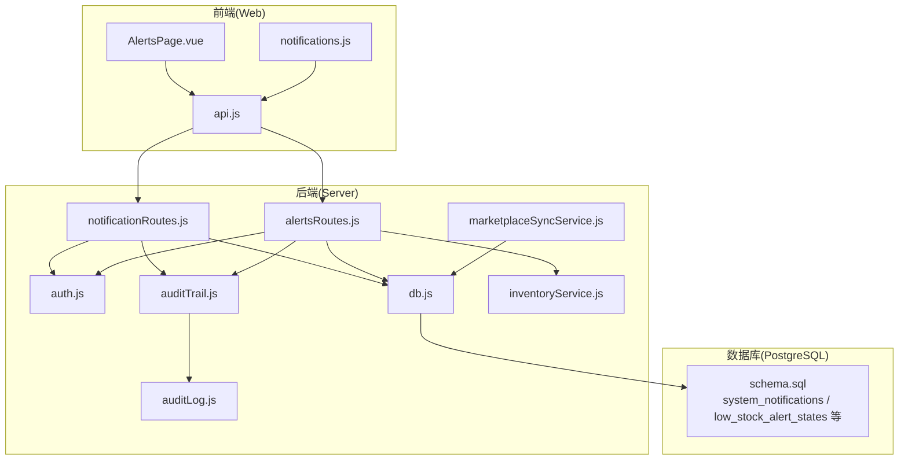
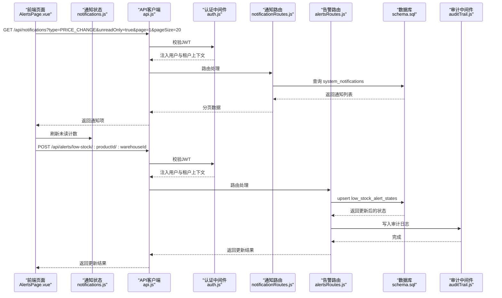
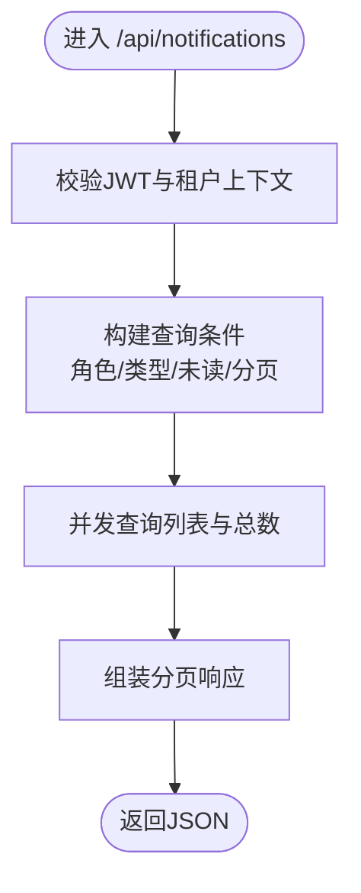
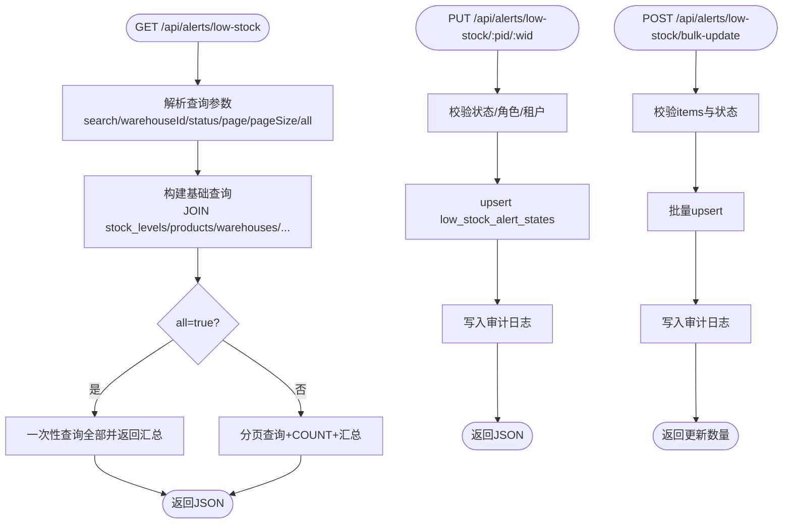
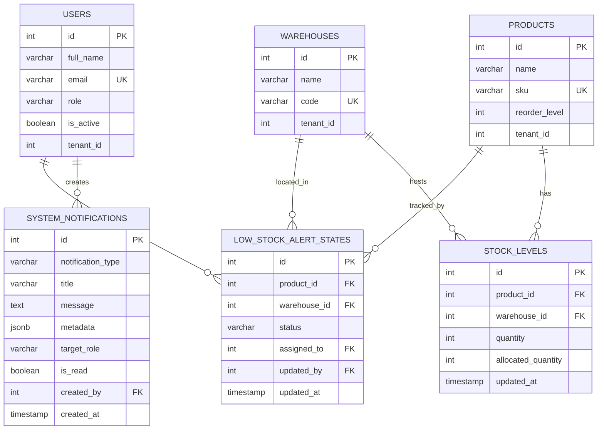
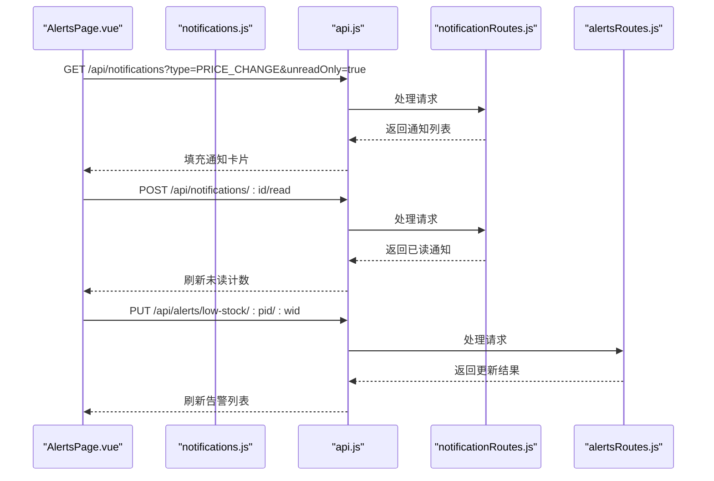
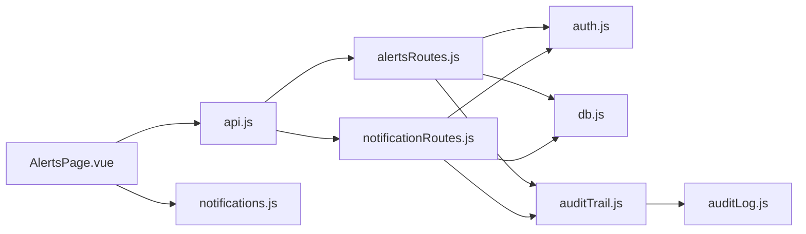

# 通知与告警API

<cite>
**本文引用的文件**   
- [notificationRoutes.js](file://server/src/routes/notificationRoutes.js)
- [alertsRoutes.js](file://server/src/routes/alertsRoutes.js)
- [schema.sql](file://server/database/schema.sql)
- [auth.js](file://server/src/middleware/auth.js)
- [auditTrail.js](file://server/src/middleware/auditTrail.js)
- [auditLog.js](file://server/src/utils/auditLog.js)
- [db.js](file://server/src/config/db.js)
- [rateLimit.js](file://server/src/middleware/rateLimit.js)
- [inventoryService.js](file://server/src/utils/inventoryService.js)
- [marketplaceSyncService.js](file://server/src/services/marketplaceSyncService.js)
- [api.js](file://web/src/services/api.js)
- [notifications.js](file://web/src/stores/notifications.js)
- [AlertsPage.vue](file://web/src/pages/AlertsPage.vue)
- [package.json](file://package.json)
- [README.md](file://README.md)
</cite>

## 目录
1. [简介](#简介)
2. [项目结构](#项目结构)
3. [核心组件](#核心组件)
4. [架构总览](#架构总览)
5. [详细组件分析](#详细组件分析)
6. [依赖关系分析](#依赖关系分析)
7. [性能考量](#性能考量)
8. [故障排查指南](#故障排查指南)
9. [结论](#结论)
10. [附录](#附录)

## 简介
本文件系统性地文档化库存系统的“通知与告警API”。内容覆盖：
- 系统通知发送与消费（站内信）机制
- 库存告警规则与API接口（低库存告警）
- 告警事件的触发条件与处理流程
- 通知模板与个性化配置建议
- 性能优化与可靠性保障
- 实际代码示例路径与告警配置最佳实践

## 项目结构
后端采用 Express + PostgreSQL 架构，前端为 Vue 3 单页应用。通知与告警功能由后端路由与数据库表支撑，前端通过统一 API 客户端调用。

图表来源
- [notificationRoutes.js:1-91](file://server/src/routes/notificationRoutes.js#L1-L91)
- [alertsRoutes.js:1-311](file://server/src/routes/alertsRoutes.js#L1-L311)
- [auth.js:1-87](file://server/src/middleware/auth.js#L1-L87)
- [auditTrail.js:1-86](file://server/src/middleware/auditTrail.js#L1-L86)
- [auditLog.js:1-40](file://server/src/utils/auditLog.js#L1-L40)
- [db.js:1-29](file://server/src/config/db.js#L1-L29)
- [schema.sql:1-447](file://server/database/schema.sql#L1-L447)
- [marketplaceSyncService.js:1-159](file://server/src/services/marketplaceSyncService.js#L1-L159)
- [inventoryService.js:1-46](file://server/src/utils/inventoryService.js#L1-L46)
- [api.js:1-45](file://web/src/services/api.js#L1-L45)
- [notifications.js:1-52](file://web/src/stores/notifications.js#L1-L52)
- [AlertsPage.vue:1-723](file://web/src/pages/AlertsPage.vue#L1-L723)

章节来源
- [README.md:1-105](file://README.md#L1-L105)
- [package.json:1-20](file://package.json#L1-L20)

## 核心组件
- 通知路由（站内信）
  - 支持分页查询通知列表、按类型过滤、仅未读过滤
  - 支持将单条通知标记为已读
- 告警路由（低库存告警）
  - 查询低库存告警（支持搜索、仓库过滤、状态过滤、分页）
  - 更新单个或批量低库存告警状态、负责人与备注
  - 内部维护低库存告警状态表，关联产品、仓库与用户
- 数据模型
  - system_notifications：系统通知（站内信）
  - low_stock_alert_states：低库存告警状态
- 安全与审计
  - JWT 认证与角色授权中间件
  - 审计日志中间件与审计日志表
- 数据库连接
  - 自适应 SSL 连接策略
- 前端集成
  - 统一 API 客户端拦截器
  - 通知状态管理与页面联动

章节来源
- [notificationRoutes.js:16-88](file://server/src/routes/notificationRoutes.js#L16-L88)
- [alertsRoutes.js:87-308](file://server/src/routes/alertsRoutes.js#L87-L308)
- [schema.sql:290-388](file://server/database/schema.sql#L290-L388)
- [auth.js:5-80](file://server/src/middleware/auth.js#L5-L80)
- [auditTrail.js:47-81](file://server/src/middleware/auditTrail.js#L47-L81)
- [auditLog.js:1-35](file://server/src/utils/auditLog.js#L1-L35)
- [db.js:17-28](file://server/src/config/db.js#L17-L28)
- [api.js:8-24](file://web/src/services/api.js#L8-L24)
- [notifications.js:13-31](file://web/src/stores/notifications.js#L13-L31)
- [AlertsPage.vue:113-135](file://web/src/pages/AlertsPage.vue#L113-L135)

## 架构总览
通知与告警API的调用链路如下：

图表来源
- [AlertsPage.vue:113-135](file://web/src/pages/AlertsPage.vue#L113-L135)
- [notifications.js:13-31](file://web/src/stores/notifications.js#L13-L31)
- [api.js:8-24](file://web/src/services/api.js#L8-L24)
- [auth.js:5-61](file://server/src/middleware/auth.js#L5-L61)
- [notificationRoutes.js:16-88](file://server/src/routes/notificationRoutes.js#L16-L88)
- [alertsRoutes.js:207-251](file://server/src/routes/alertsRoutes.js#L207-L251)
- [auditTrail.js:47-81](file://server/src/middleware/auditTrail.js#L47-L81)
- [schema.sql:290-388](file://server/database/schema.sql#L290-L388)

## 详细组件分析

### 通知路由（站内信）
- 功能要点
  - 列表查询：支持按目标角色、通知类型、是否仅未读进行过滤；分页返回
  - 标记已读：将指定通知标记为已读，并写入审计上下文
- 关键参数
  - 查询参数：type、unreadOnly、page、pageSize
  - 路径参数：id（用于标记已读）
- 安全与隔离
  - 使用认证中间件确保用户有效
  - 租户隔离：所有查询与更新均绑定 tenant_id
- 审计
  - 标记已读时设置审计上下文，便于追踪

图表来源
- [notificationRoutes.js:16-58](file://server/src/routes/notificationRoutes.js#L16-L58)
- [auth.js:5-61](file://server/src/middleware/auth.js#L5-L61)

章节来源
- [notificationRoutes.js:16-88](file://server/src/routes/notificationRoutes.js#L16-L88)
- [schema.sql:378-388](file://server/database/schema.sql#L378-L388)

### 告警路由（低库存告警）
- 功能要点
  - 查询低库存告警：基于库存水平与补货线计算缺口，支持多维过滤与汇总统计
  - 更新告警：单个或批量更新状态、负责人与备注
  - 审计：更新与批量更新均写入审计日志
- 触发条件
  - 当库存量小于等于产品的补货线时，即触发低库存告警
- 关键参数
  - 查询参数：search、warehouseId、status、page、pageSize、all
  - 请求体：status、assignedTo、notes
  - 路径参数：productId、warehouseId
- 数据一致性
  - 使用 upsert 保证同一产品+仓库的告警状态唯一
  - 更新时校验产品与仓库属于当前租户，防止跨租户写入

图表来源
- [alertsRoutes.js:87-205](file://server/src/routes/alertsRoutes.js#L87-L205)
- [alertsRoutes.js:207-251](file://server/src/routes/alertsRoutes.js#L207-L251)
- [alertsRoutes.js:253-308](file://server/src/routes/alertsRoutes.js#L253-L308)
- [schema.sql:290-300](file://server/database/schema.sql#L290-L300)

章节来源
- [alertsRoutes.js:87-308](file://server/src/routes/alertsRoutes.js#L87-L308)
- [schema.sql:290-300](file://server/database/schema.sql#L290-L300)

### 数据模型与关系

图表来源
- [schema.sql:2-54](file://server/database/schema.sql#L2-L54)
- [schema.sql:125-133](file://server/database/schema.sql#L125-L133)
- [schema.sql:290-300](file://server/database/schema.sql#L290-L300)
- [schema.sql:378-388](file://server/database/schema.sql#L378-L388)

章节来源
- [schema.sql:290-388](file://server/database/schema.sql#L290-L388)

### 前端集成与用户体验
- 通知中心
  - 仅加载未读通知，提升交互效率
  - 支持标记已读并实时更新未读计数
- 告警中心
  - 支持筛选（搜索、仓库、状态）、分页与汇总
  - 支持批量更新状态与负责人
  - 提供撤销批量操作能力

图表来源
- [AlertsPage.vue:113-135](file://web/src/pages/AlertsPage.vue#L113-L135)
- [AlertsPage.vue:158-169](file://web/src/pages/AlertsPage.vue#L158-L169)
- [notifications.js:13-31](file://web/src/stores/notifications.js#L13-L31)
- [api.js:8-24](file://web/src/services/api.js#L8-L24)

章节来源
- [AlertsPage.vue:113-169](file://web/src/pages/AlertsPage.vue#L113-L169)
- [notifications.js:13-31](file://web/src/stores/notifications.js#L13-L31)
- [api.js:8-24](file://web/src/services/api.js#L8-L24)

## 依赖关系分析
- 组件耦合
  - 路由层依赖认证中间件与数据库连接
  - 审计中间件贯穿关键写操作，确保可追溯
  - 前端通过统一 API 客户端与后端交互
- 外部依赖
  - PostgreSQL 连接池与索引优化
  - 可选的市场渠道库存同步（不影响通知与告警）

图表来源
- [alertsRoutes.js:1-10](file://server/src/routes/alertsRoutes.js#L1-L10)
- [notificationRoutes.js:1-10](file://server/src/routes/notificationRoutes.js#L1-L10)
- [auth.js:1-10](file://server/src/middleware/auth.js#L1-L10)
- [auditTrail.js:1-10](file://server/src/middleware/auditTrail.js#L1-L10)
- [auditLog.js:1-10](file://server/src/utils/auditLog.js#L1-L10)
- [db.js:1-10](file://server/src/config/db.js#L1-L10)
- [AlertsPage.vue:1-20](file://web/src/pages/AlertsPage.vue#L1-L20)
- [api.js:1-20](file://web/src/services/api.js#L1-L20)
- [notifications.js:1-20](file://web/src/stores/notifications.js#L1-L20)

章节来源
- [alertsRoutes.js:1-10](file://server/src/routes/alertsRoutes.js#L1-L10)
- [notificationRoutes.js:1-10](file://server/src/routes/notificationRoutes.js#L1-L10)
- [auth.js:1-10](file://server/src/middleware/auth.js#L1-L10)
- [auditTrail.js:1-10](file://server/src/middleware/auditTrail.js#L1-L10)
- [auditLog.js:1-10](file://server/src/utils/auditLog.js#L1-L10)
- [db.js:1-10](file://server/src/config/db.js#L1-L10)
- [AlertsPage.vue:1-20](file://web/src/pages/AlertsPage.vue#L1-L20)
- [api.js:1-20](file://web/src/services/api.js#L1-L20)
- [notifications.js:1-20](file://web/src/stores/notifications.js#L1-L20)

## 性能考量
- 查询优化
  - 低库存告警查询使用 JOIN 与 LATERAL 子查询，建议在相关列建立索引以降低扫描成本
  - 列表查询采用 LIMIT/OFFSET 分页，结合 COUNT 并行查询提升响应速度
- 连接与SSL
  - 数据库连接根据连接串与环境变量自动选择 SSL，减少不必要的 TLS 开销
- 并发与限流
  - 审计日志异步写入，避免阻塞主流程
  - 可在路由层引入限流中间件，防止突发流量导致数据库压力过大
- 前端体验
  - 通知默认仅加载未读，减少渲染与网络负载
  - 批量操作提供撤销能力，降低误操作带来的重复请求

章节来源
- [alertsRoutes.js:143-195](file://server/src/routes/alertsRoutes.js#L143-L195)
- [db.js:17-28](file://server/src/config/db.js#L17-L28)
- [rateLimit.js:9-35](file://server/src/middleware/rateLimit.js#L9-L35)
- [notifications.js:13-25](file://web/src/stores/notifications.js#L13-L25)

## 故障排查指南
- 认证失败
  - 检查请求头是否包含有效的 Bearer Token
  - 确认用户存在且租户状态为 ACTIVE
- 权限不足
  - 确认用户角色满足路由授权要求（ADMIN/MANAGER/STAFF）
- 跨租户访问
  - 更新告警时需校验产品与仓库属于当前租户，否则返回 404
- 审计追踪
  - 关键写操作会生成审计日志，可通过审计日志表定位异常行为
- 数据库连接
  - 检查 DATABASE_URL 与 SSL 相关环境变量配置

章节来源
- [auth.js:5-61](file://server/src/middleware/auth.js#L5-L61)
- [auth.js:63-80](file://server/src/middleware/auth.js#L63-L80)
- [alertsRoutes.js:222-228](file://server/src/routes/alertsRoutes.js#L222-L228)
- [auditTrail.js:47-81](file://server/src/middleware/auditTrail.js#L47-L81)
- [auditLog.js:1-35](file://server/src/utils/auditLog.js#L1-L35)
- [db.js:3-15](file://server/src/config/db.js#L3-L15)

## 结论
本通知与告警API以清晰的路由职责、完善的租户隔离与审计机制为基础，结合前端高效的分页与未读优先策略，实现了低库存告警与站内信通知的稳定运行。通过索引优化、连接策略与可选限流，系统具备良好的扩展性与可靠性。

## 附录

### API 接口定义（通知与告警）
- 获取通知列表
  - 方法与路径：GET /api/notifications
  - 查询参数：
    - type：通知类型（如 PRICE_CHANGE）
    - unreadOnly：是否仅未读（true/false）
    - page/pageSize：分页
  - 返回：items、pagination
- 标记通知为已读
  - 方法与路径：POST /api/notifications/:id/read
  - 返回：被标记的通知对象
- 查询低库存告警
  - 方法与路径：GET /api/alerts/low-stock
  - 查询参数：
    - search：模糊搜索（产品名/SKU/仓库/分类）
    - warehouseId：仓库ID
    - status：OPEN/READ/IGNORED/all
    - page/pageSize：分页
    - all：true 时一次性返回全部并带汇总
  - 返回：items、pagination、summary
- 更新低库存告警
  - 方法与路径：PUT /api/alerts/low-stock/:productId/:warehouseId
  - 请求体：status、assignedTo、notes
  - 返回：更新后的告警状态
- 批量更新低库存告警
  - 方法与路径：POST /api/alerts/low-stock/bulk-update
  - 请求体：items[]（每项含 productId、warehouseId、status、assignedTo、notes），以及可选的全局 status/assignedTo/notes
  - 返回：updated 数量

章节来源
- [notificationRoutes.js:16-88](file://server/src/routes/notificationRoutes.js#L16-L88)
- [alertsRoutes.js:87-308](file://server/src/routes/alertsRoutes.js#L87-L308)

### 通知模板与个性化配置
- 通知模板
  - 建议在 system_notifications 表中使用 metadata 字段存储动态参数（如产品名、仓库名、缺口数量等），以便前端渲染
- 个性化
  - 支持按 target_role 进行目标角色过滤
  - 前端可按未读优先展示，减少信息噪音

章节来源
- [schema.sql:378-388](file://server/database/schema.sql#L378-L388)
- [notificationRoutes.js:16-58](file://server/src/routes/notificationRoutes.js#L16-L58)
- [AlertsPage.vue:141-156](file://web/src/pages/AlertsPage.vue#L141-L156)

### 告警配置最佳实践
- 触发条件
  - 将库存量与补货线的关系作为唯一触发条件，避免重复告警
- 状态管理
  - OPEN/READ/IGNORED 三态明确职责流转
- 负责人分配
  - 仅 ADMIN/MANAGER 可指派负责人
- 审计与回溯
  - 所有更新与批量更新均写入审计日志，保留操作轨迹
- 性能
  - 对高频查询字段建立索引，合理使用分页与 COUNT 并行查询

章节来源
- [alertsRoutes.js:207-251](file://server/src/routes/alertsRoutes.js#L207-L251)
- [alertsRoutes.js:253-308](file://server/src/routes/alertsRoutes.js#L253-L308)
- [auditTrail.js:47-81](file://server/src/middleware/auditTrail.js#L47-L81)
- [schema.sql:410-447](file://server/database/schema.sql#L410-L447)