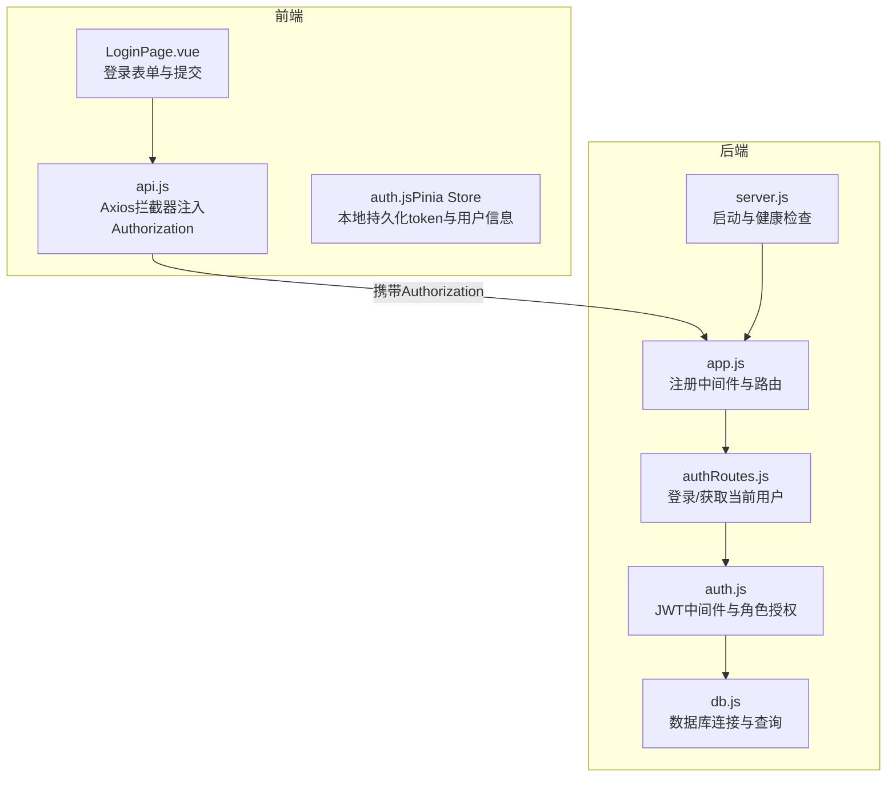
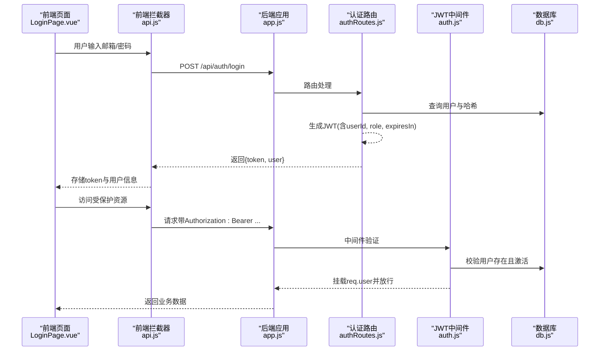
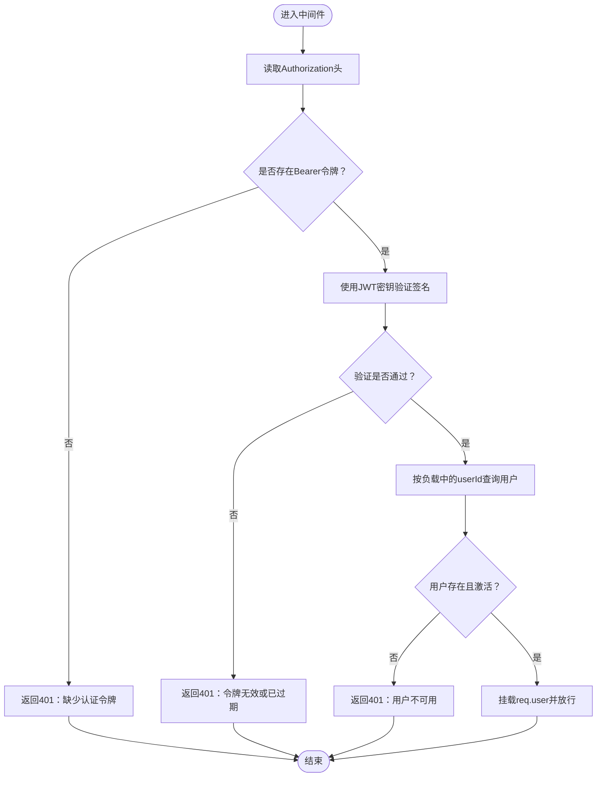
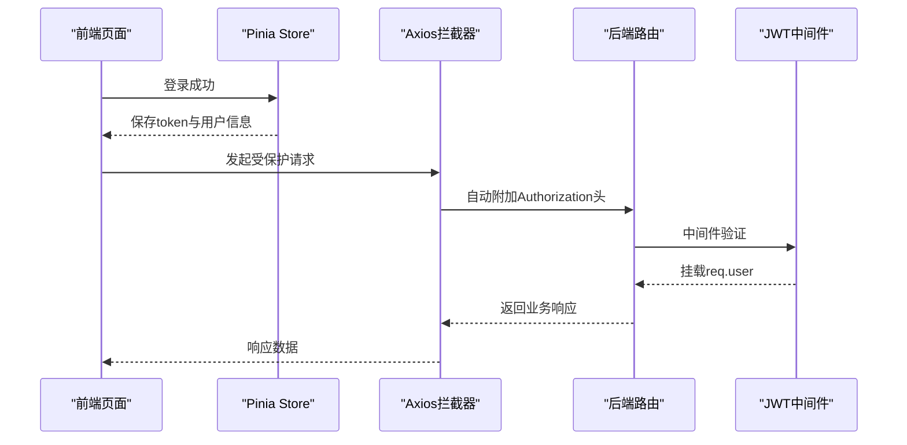
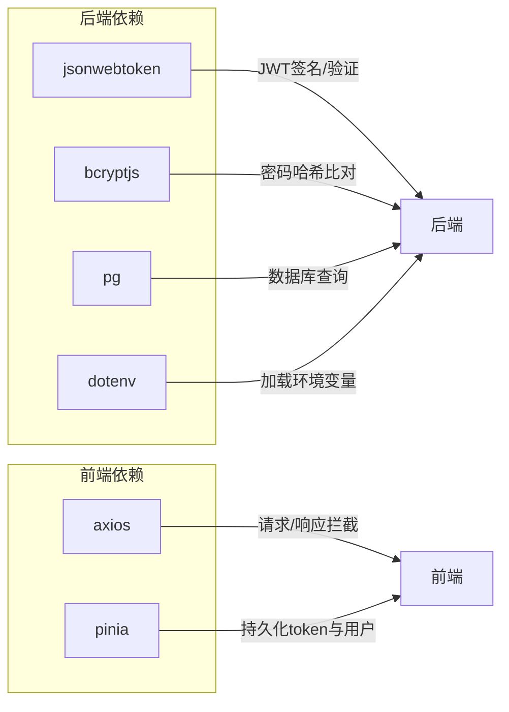

# JWT认证机制

<cite>
**本文引用的文件**
- [auth.js](file://server/src/middleware/auth.js)
- [authRoutes.js](file://server/src/routes/authRoutes.js)
- [db.js](file://server/src/config/db.js)
- [app.js](file://server/src/app.js)
- [server.js](file://server/src/server.js)
- [auth.js（前端）](file://web/src/stores/auth.js)
- [api.js（前端）](file://web/src/services/api.js)
- [LoginPage.vue（前端）](file://web/src/pages/LoginPage.vue)
- [package.json（后端）](file://server/package.json)
- [package-lock.json（后端依赖）](file://server/package-lock.json)
</cite>

## 目录
1. [简介](#简介)
2. [项目结构](#项目结构)
3. [核心组件](#核心组件)
4. [架构总览](#架构总览)
5. [详细组件分析](#详细组件分析)
6. [依赖关系分析](#依赖关系分析)
7. [性能考量](#性能考量)
8. [故障排除指南](#故障排除指南)
9. [结论](#结论)
10. [附录](#附录)

## 简介
本文件系统性阐述本项目的JWT认证机制，覆盖令牌生成与签名、密钥管理、过期时间设置、中间件验证流程、用户信息提取、角色授权、前后端分离应用模式、刷新策略建议、安全最佳实践、错误处理与调试方法。目标是帮助开发者快速理解并正确集成与维护JWT认证。

## 项目结构
后端采用Express + PostgreSQL，前端采用Vue 3 + Pinia + Axios。JWT认证相关代码集中在后端中间件与路由层，前端通过Axios拦截器自动携带令牌。

图表来源
- [app.js:1-65](file://server/src/app.js#L1-L65)
- [authRoutes.js:1-72](file://server/src/routes/authRoutes.js#L1-L72)
- [auth.js:1-46](file://server/src/middleware/auth.js#L1-L46)
- [db.js:1-25](file://server/src/config/db.js#L1-L25)
- [server.js:1-28](file://server/src/server.js#L1-L28)
- [api.js:1-45](file://web/src/services/api.js#L1-L45)
- [auth.js（前端）:1-90](file://web/src/stores/auth.js#L1-L90)
- [LoginPage.vue（前端）:1-136](file://web/src/pages/LoginPage.vue#L1-L136)

章节来源
- [app.js:1-65](file://server/src/app.js#L1-L65)
- [authRoutes.js:1-72](file://server/src/routes/authRoutes.js#L1-L72)
- [auth.js:1-46](file://server/src/middleware/auth.js#L1-L46)
- [db.js:1-25](file://server/src/config/db.js#L1-L25)
- [server.js:1-28](file://server/src/server.js#L1-L28)
- [api.js:1-45](file://web/src/services/api.js#L1-L45)
- [auth.js（前端）:1-90](file://web/src/stores/auth.js#L1-L90)
- [LoginPage.vue（前端）:1-136](file://web/src/pages/LoginPage.vue#L1-L136)

## 核心组件
- 后端JWT中间件：负责从Authorization头解析Bearer令牌、验证签名、查询用户并挂载到请求对象。
- 登录路由：校验凭据、生成JWT、记录审计上下文、返回token与用户信息。
- 数据库适配：统一连接池与查询封装。
- 前端拦截器：自动为每个请求附加Authorization头；Pinia Store持久化token与用户信息。
- 角色授权中间件：基于用户角色进行访问控制。

章节来源
- [auth.js:1-46](file://server/src/middleware/auth.js#L1-L46)
- [authRoutes.js:1-72](file://server/src/routes/authRoutes.js#L1-L72)
- [db.js:1-25](file://server/src/config/db.js#L1-L25)
- [api.js:1-45](file://web/src/services/api.js#L1-L45)
- [auth.js（前端）:1-90](file://web/src/stores/auth.js#L1-L90)

## 架构总览
下图展示JWT认证在登录与后续请求中的端到端流程。

图表来源
- [authRoutes.js:17-64](file://server/src/routes/authRoutes.js#L17-L64)
- [auth.js:5-29](file://server/src/middleware/auth.js#L5-L29)
- [db.js:13-24](file://server/src/config/db.js#L13-L24)
- [api.js:8-24](file://web/src/services/api.js#L8-L24)
- [auth.js（前端）:44-78](file://web/src/stores/auth.js#L44-L78)
- [LoginPage.vue:41-50](file://web/src/pages/LoginPage.vue#L41-L50)

## 详细组件分析

### JWT生成与签名
- 生成场景：登录成功后，后端使用对称密钥对包含用户标识与角色的负载进行签名，并设置过期时间。
- 关键点：
  - 负载字段：包含用户ID与角色，便于中间件快速识别与授权。
  - 密钥来源：使用环境变量作为对称密钥。
  - 过期时间：设置为8小时，降低长期暴露风险。
  - 审计记录：登录成功时写入审计上下文，便于追踪。

章节来源
- [authRoutes.js:41-43](file://server/src/routes/authRoutes.js#L41-L43)
- [authRoutes.js:45-49](file://server/src/routes/authRoutes.js#L45-L49)

### 密钥管理与环境变量
- 密钥使用：后端通过环境变量加载JWT密钥，用于签名与验证。
- 安全建议：
  - 使用强随机字符串作为密钥，长度足够（建议至少256位）。
  - 在不同环境（开发/生产）使用独立密钥。
  - 严格限制密钥访问权限，避免泄露至版本库或日志。

章节来源
- [auth.js:14](file://server/src/middleware/auth.js#L14)
- [authRoutes.js:41-43](file://server/src/routes/authRoutes.js#L41-L43)

### 过期时间设置
- 当前策略：登录成功签发的令牌有效期为8小时。
- 配置位置：登录路由中设置expiresIn参数。
- 建议：
  - 对高敏感操作可考虑更短有效期（如1小时），结合刷新策略。
  - 前端可在接近过期时主动刷新，提升用户体验。

章节来源
- [authRoutes.js:41-43](file://server/src/routes/authRoutes.js#L41-L43)

### authenticateToken中间件实现原理
- Authorization头解析：从请求头中提取Bearer令牌，若缺失则返回未认证。
- 令牌验证：使用对称密钥验证签名，捕获无效或过期错误并返回未认证。
- 用户信息提取：验证通过后根据负载中的用户ID查询数据库，确保用户存在且处于激活状态，然后将用户信息挂载到req.user供后续路由使用。
- 放行与错误处理：验证成功后进入下一个中间件/路由；失败返回401。

图表来源
- [auth.js:5-29](file://server/src/middleware/auth.js#L5-L29)
- [db.js:15-18](file://server/src/config/db.js#L15-L18)

章节来源
- [auth.js:5-29](file://server/src/middleware/auth.js#L5-L29)

### 角色授权中间件authorizeRoles
- 功能：基于用户角色进行访问控制，仅允许具备指定角色的用户继续执行。
- 实现要点：比较req.user.role与允许的角色集合，不匹配则返回403。

章节来源
- [auth.js:32-40](file://server/src/middleware/auth.js#L32-L40)

### 前后端分离中的应用模式
- 登录流程：
  - 前端提交邮箱/密码到后端登录接口。
  - 后端校验成功后返回JWT与用户信息。
  - 前端将token与用户信息存入本地存储与状态管理。
- 请求流程：
  - 前端Axios拦截器自动在每个请求头添加Authorization: Bearer token。
  - 后端中间件解析并验证令牌，成功后放行业务路由。
- 刷新登录态：
  - 前端在页面刷新时调用“获取当前用户”接口，恢复登录态。

图表来源
- [auth.js（前端）:28-41](file://web/src/stores/auth.js#L28-L41)
- [api.js:8-24](file://web/src/services/api.js#L8-L24)
- [authRoutes.js:67-69](file://server/src/routes/authRoutes.js#L67-L69)
- [auth.js:5-29](file://server/src/middleware/auth.js#L5-L29)

章节来源
- [auth.js（前端）:19-90](file://web/src/stores/auth.js#L19-L90)
- [api.js:1-45](file://web/src/services/api.js#L1-L45)
- [authRoutes.js:17-64](file://server/src/routes/authRoutes.js#L17-L64)
- [authRoutes.js:67-69](file://server/src/routes/authRoutes.js#L67-L69)
- [auth.js:5-29](file://server/src/middleware/auth.js#L5-L29)

### 令牌刷新策略与安全考虑
- 当前实现：
  - 登录时签发8小时有效期的令牌。
  - 前端通过“获取当前用户”接口恢复登录态。
- 推荐策略（建议实施）：
  - 引入短期访问令牌（如1小时）与长期刷新令牌（如7天）的双令牌模型。
  - 访问令牌过期时，使用刷新令牌换取新的访问令牌。
  - 刷新令牌单独存储与传输，限制刷新频率与来源。
  - 引入黑名单/撤销列表（Redis）以支持即时吊销。
  - 严格HTTPS与SameSite Cookie策略（如采用Cookie承载刷新令牌）。
- 安全最佳实践：
  - 使用强随机密钥并定期轮换。
  - 限制令牌有效期，遵循最小权限原则。
  - 对关键操作二次校验（如二次确认）。
  - 审计所有登录与关键操作。

章节来源
- [authRoutes.js:41-43](file://server/src/routes/authRoutes.js#L41-L43)
- [authRoutes.js:67-69](file://server/src/routes/authRoutes.js#L67-L69)

### 错误处理机制
- 未提供令牌：返回401，提示需要认证令牌。
- 令牌无效或过期：返回401，提示令牌无效或已过期。
- 用户不存在或未激活：返回401，提示用户不可用。
- 其他登录异常：返回500，提示登录失败。
- 前端统一错误处理：Axios拦截器将后端错误消息透传到UI。

章节来源
- [auth.js:9-28](file://server/src/middleware/auth.js#L9-L28)
- [authRoutes.js:20-63](file://server/src/routes/authRoutes.js#L20-L63)
- [api.js:36-42](file://web/src/services/api.js#L36-L42)

## 依赖关系分析
- 后端依赖：
  - jsonwebtoken：JWT生成与验证。
  - bcryptjs：密码哈希比对。
  - pg：PostgreSQL连接池与查询。
  - dotenv：加载环境变量。
- 前端依赖：
  - axios：HTTP客户端与拦截器。
  - pinia：状态管理（持久化token与用户信息）。

图表来源
- [package.json（后端）:15-25](file://server/package.json#L15-L25)
- [package-lock.json:958-979](file://server/package-lock.json#L958-L979)
- [api.js:1-45](file://web/src/services/api.js#L1-L45)
- [auth.js（前端）:1-90](file://web/src/stores/auth.js#L1-L90)

章节来源
- [package.json（后端）:15-25](file://server/package.json#L15-L25)
- [package-lock.json:958-979](file://server/package-lock.json#L958-L979)
- [api.js:1-45](file://web/src/services/api.js#L1-L45)
- [auth.js（前端）:1-90](file://web/src/stores/auth.js#L1-L90)

## 性能考量
- JWT验证为内存计算，开销极低，主要瓶颈在数据库查询与网络延迟。
- 建议：
  - 缓存活跃用户信息（如使用Redis）减少数据库查询次数。
  - 控制令牌数量与查询频率，避免频繁用户校验。
  - 合理设置过期时间，平衡安全性与性能。

## 故障排除指南
- 常见问题与排查步骤：
  - 401 缺少令牌：检查前端是否正确存储与发送Authorization头。
  - 401 令牌无效或过期：确认后端密钥一致、时间同步、令牌未被篡改。
  - 401 用户不可用：检查用户是否仍存在于数据库且处于激活状态。
  - 登录失败：检查数据库连接、用户是否存在、密码哈希是否匹配。
  - 启动失败：检查数据库连接超时与环境变量配置。
- 调试建议：
  - 打开后端日志（Morgan）观察请求路径与状态码。
  - 使用Postman或curl验证登录与受保护接口。
  - 前端检查localStorage中token是否正确写入与更新。

章节来源
- [auth.js:9-28](file://server/src/middleware/auth.js#L9-L28)
- [authRoutes.js:20-63](file://server/src/routes/authRoutes.js#L20-L63)
- [server.js:13-25](file://server/src/server.js#L13-L25)
- [api.js:8-24](file://web/src/services/api.js#L8-L24)
- [auth.js（前端）:28-41](file://web/src/stores/auth.js#L28-L41)

## 结论
本项目采用简洁可靠的JWT认证方案：登录时签发短期令牌，中间件统一验证并挂载用户信息，前端自动携带令牌访问受保护资源。建议在现有基础上引入双令牌模型与黑名单机制，进一步提升安全性与可运维性。

## 附录

### 令牌配置示例（后端）
- 密钥：通过环境变量加载，用于对称签名与验证。
- 过期时间：登录时设置为8小时。
- 审计：登录成功时写入审计上下文。

章节来源
- [authRoutes.js:41-43](file://server/src/routes/authRoutes.js#L41-L43)
- [authRoutes.js:45-49](file://server/src/routes/authRoutes.js#L45-L49)

### 前端令牌使用示例
- 存储：登录成功后将token与用户信息写入localStorage与Pinia Store。
- 请求：Axios拦截器自动附加Authorization头。
- 刷新：页面刷新时调用“获取当前用户”接口恢复登录态。

章节来源
- [auth.js（前端）:28-41](file://web/src/stores/auth.js#L28-L41)
- [api.js:8-24](file://web/src/services/api.js#L8-L24)
- [authRoutes.js:67-69](file://server/src/routes/authRoutes.js#L67-L69)