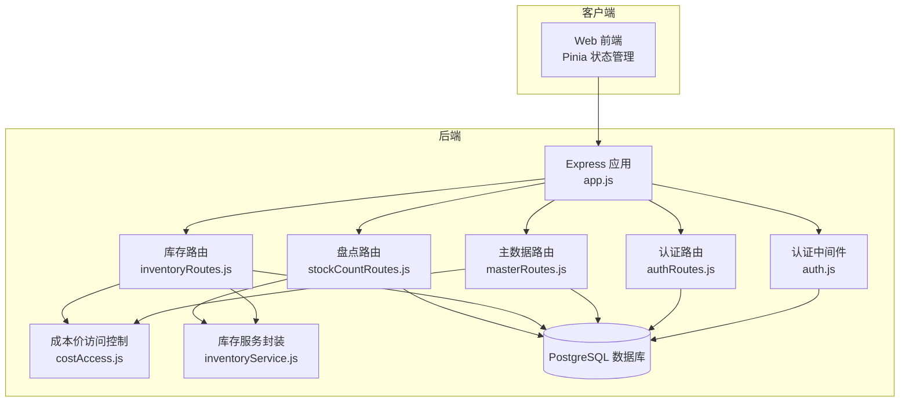
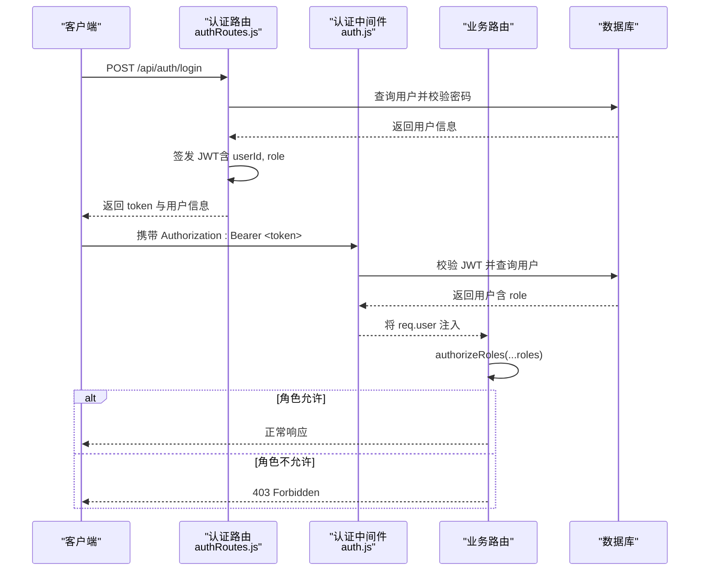
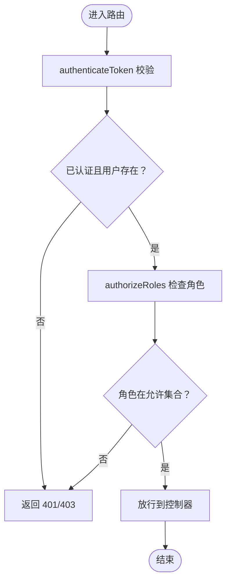
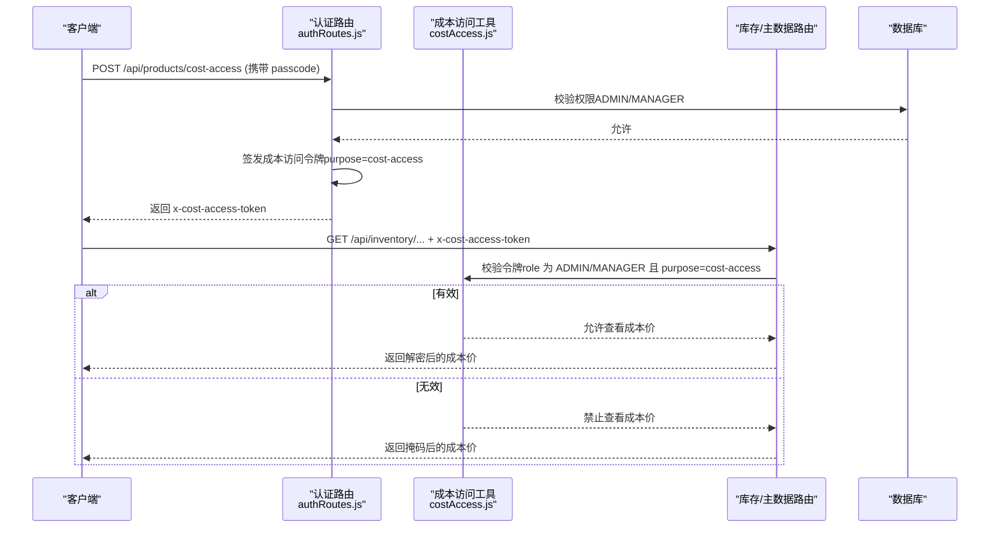
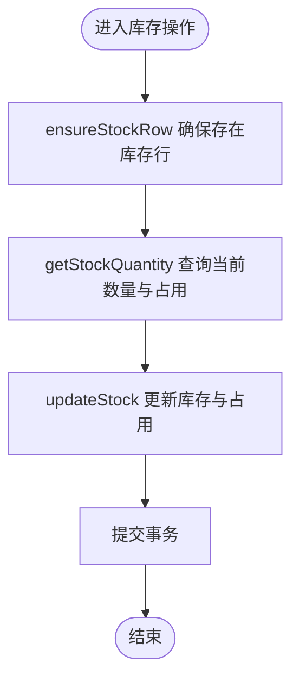
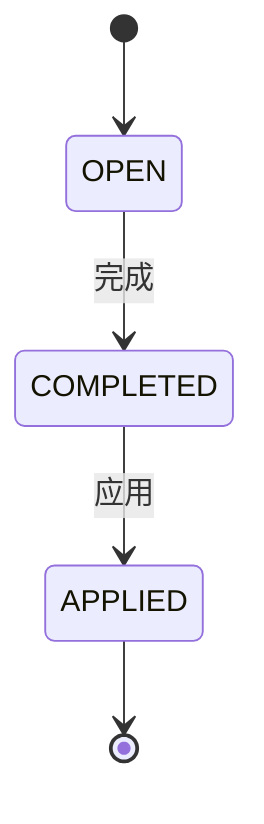
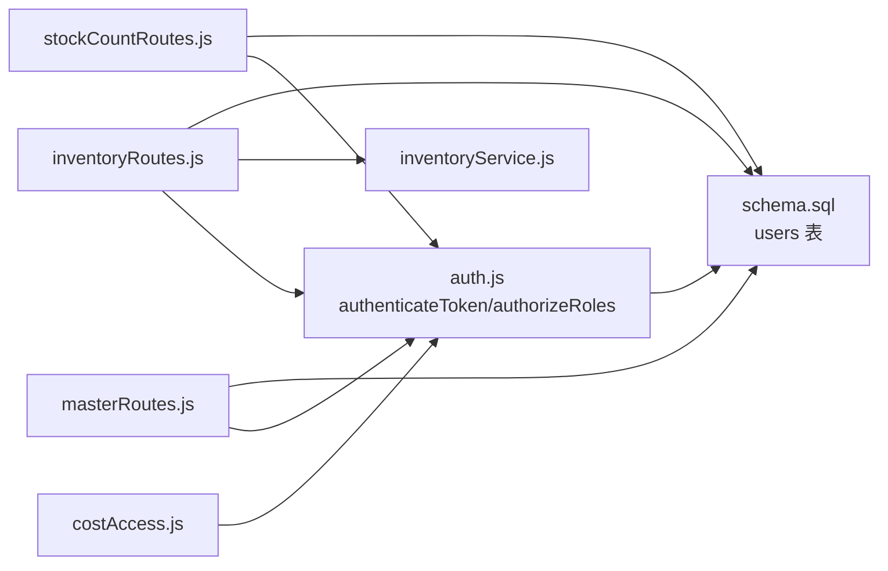

# 基于角色的访问控制

<cite>
**本文引用的文件**
- [server/src/middleware/auth.js](file://server/src/middleware/auth.js)
- [server/src/routes/authRoutes.js](file://server/src/routes/authRoutes.js)
- [server/src/routes/masterRoutes.js](file://server/src/routes/masterRoutes.js)
- [server/src/routes/inventoryRoutes.js](file://server/src/routes/inventoryRoutes.js)
- [server/src/routes/stockCountRoutes.js](file://server/src/routes/stockCountRoutes.js)
- [server/src/utils/costAccess.js](file://server/src/utils/costAccess.js)
- [server/src/utils/inventoryService.js](file://server/src/utils/inventoryService.js)
- [server/src/app.js](file://server/src/app.js)
- [server/database/schema.sql](file://server/database/schema.sql)
- [web/src/constants/accessGuide.js](file://web/src/constants/accessGuide.js)
- [web/src/pages/AccessGuidePage.vue](file://web/src/pages/AccessGuidePage.vue)
- [postman/inventory_system_backend.postman_collection.json](file://postman/inventory_system_backend.postman_collection.json)
</cite>

## 目录
1. [简介](#简介)
2. [项目结构](#项目结构)
3. [核心组件](#核心组件)
4. [架构总览](#架构总览)
5. [详细组件分析](#详细组件分析)
6. [依赖关系分析](#依赖关系分析)
7. [性能考量](#性能考量)
8. [故障排查指南](#故障排查指南)
9. [结论](#结论)
10. [附录](#附录)

## 简介
本文件系统性阐述本库存管理系统的基于角色的访问控制（RBAC）实现，重点围绕 authorizeRoles 中间件的设计与使用、角色定义与权限矩阵、访问控制列表（ACL）策略、角色继承与权限组合机制、成本价访问令牌（Cost Access Token）等安全边界进行深入解析。文档同时提供角色配置示例、权限检查流程图、最佳实践与扩展建议，帮助开发者与运维人员快速理解并安全地定制权限体系。

## 项目结构
后端采用 Express + PostgreSQL 架构，权限控制集中在中间件层与路由层：
- 认证与授权中间件：JWT 校验、角色授权
- 路由层：按模块划分（认证、主数据、库存、盘点、审计等），在关键端点使用 authorizeRoles 进行角色级访问控制
- 工具层：成本价访问控制、库存事务封装
- 数据层：用户表含角色字段，配合审计日志记录操作轨迹

图表来源
- [server/src/app.js:1-65](file://server/src/app.js#L1-L65)
- [server/src/middleware/auth.js:1-46](file://server/src/middleware/auth.js#L1-L46)
- [server/src/utils/costAccess.js:1-32](file://server/src/utils/costAccess.js#L1-L32)
- [server/src/routes/authRoutes.js:1-72](file://server/src/routes/authRoutes.js#L1-L72)
- [server/src/routes/masterRoutes.js:1-800](file://server/src/routes/masterRoutes.js#L1-L800)
- [server/src/routes/inventoryRoutes.js:1-493](file://server/src/routes/inventoryRoutes.js#L1-L493)
- [server/src/routes/stockCountRoutes.js:1-434](file://server/src/routes/stockCountRoutes.js#L1-L434)
- [server/src/utils/inventoryService.js:1-45](file://server/src/utils/inventoryService.js#L1-L45)

章节来源
- [server/src/app.js:1-65](file://server/src/app.js#L1-L65)

## 核心组件
- 认证中间件 authenticateToken：从 Authorization 头部提取 Bearer Token，验证后将用户信息挂载到 req.user
- 授权中间件 authorizeRoles：基于用户角色数组进行白名单式访问控制
- 成本价访问控制 canViewCost / getCostAccessToken：通过自定义请求头携带的 JWT 实现“二次授权”，仅 ADMIN/MANAGER 可签发与使用
- 路由层角色策略：在关键端点（如用户管理、主数据维护、库存出入库、盘点应用）使用 authorizeRoles 指定允许的角色集合

章节来源
- [server/src/middleware/auth.js:1-46](file://server/src/middleware/auth.js#L1-L46)
- [server/src/utils/costAccess.js:1-32](file://server/src/utils/costAccess.js#L1-L32)
- [server/src/routes/masterRoutes.js:492-661](file://server/src/routes/masterRoutes.js#L492-L661)
- [server/src/routes/inventoryRoutes.js:405-415](file://server/src/routes/inventoryRoutes.js#L405-L415)
- [server/src/routes/stockCountRoutes.js:326](file://server/src/routes/stockCountRoutes.js#L326)

## 架构总览
RBAC 在本系统中的落地路径如下：
- 登录阶段：前端提交邮箱+密码，后端查询用户并比对哈希，签发包含 userId 与 role 的 JWT
- 请求阶段：中间件 authenticateToken 验证 JWT 并加载用户；随后各路由根据 authorizeRoles 决定是否放行
- 特权场景：成本价访问通过独立的 x-cost-access-token 头部进行二次授权，确保敏感数据最小暴露面

图表来源
- [server/src/routes/authRoutes.js:17-64](file://server/src/routes/authRoutes.js#L17-L64)
- [server/src/middleware/auth.js:5-29](file://server/src/middleware/auth.js#L5-L29)
- [server/src/middleware/auth.js:32-40](file://server/src/middleware/auth.js#L32-L40)

## 详细组件分析

### authorizeRoles 中间件
- 设计要点
  - 以“白名单”方式限定可访问角色集合
  - 与 authenticateToken 串联，前置校验用户身份
  - 支持多角色传参，形成“角色并集”的权限组合
- 使用模式
  - 在路由定义处直接调用 authorizeRoles('ADMIN', 'MANAGER', 'STAFF') 形成 ACL
  - 对需要更高权限的操作（如删除用户、应用盘点）仅开放给 ADMIN 或 MANAGER
- 安全边界
  - 未登录或角色不在白名单即 403
  - 与审计中间件结合，记录失败与成功的操作上下文

图表来源
- [server/src/middleware/auth.js:32-40](file://server/src/middleware/auth.js#L32-L40)
- [server/src/routes/inventoryRoutes.js:405-415](file://server/src/routes/inventoryRoutes.js#L405-L415)

章节来源
- [server/src/middleware/auth.js:31-40](file://server/src/middleware/auth.js#L31-L40)

### 角色定义与权限矩阵
- 角色枚举
  - ADMIN：系统管理员
  - MANAGER：运营经理
  - STAFF：一线员工
- 权限矩阵（节选）
  - 用户管理：仅 ADMIN 可创建/更新/删除用户
  - 主数据维护：ADMIN/MANAGER 可增删改分类、仓库、产品
  - 库存操作：ADMIN/MANAGER/STAFF 可执行入库、出库、分配；调拨需 ADMIN/MANAGER
  - 盘点应用：仅 ADMIN/MANAGER 可将盘点结果应用到库存
  - 成本价访问：需 ADMIN/MANAGER 提供成本访问令牌，且仅在特定接口生效

章节来源
- [server/src/routes/masterRoutes.js:492-661](file://server/src/routes/masterRoutes.js#L492-L661)
- [server/src/routes/inventoryRoutes.js:405-415](file://server/src/routes/inventoryRoutes.js#L405-L415)
- [server/src/routes/stockCountRoutes.js:326](file://server/src/routes/stockCountRoutes.js#L326)
- [web/src/constants/accessGuide.js:1-75](file://web/src/constants/accessGuide.js#L1-L75)

### 成本价访问控制（Cost Access Token）
- 目标
  - 将成本价等敏感字段在默认情况下隐藏，仅在具备“成本访问令牌”时才显示
- 机制
  - ADMIN/MANAGER 可通过专用接口生成成本访问令牌（JWT，purpose=cost-access）
  - 前端在后续请求中携带 x-cost-access-token 头部
  - 后端中间件校验令牌合法性与目的，决定是否解密成本价字段
- 安全边界
  - 令牌与用户绑定（userId 必须一致）
  - 令牌用途必须为 cost-access
  - 仅 ADMIN/MANAGER 可签发与使用
  - 令牌过期时间应短，降低泄露风险

图表来源
- [server/src/utils/costAccess.js:5-27](file://server/src/utils/costAccess.js#L5-L27)
- [server/src/routes/inventoryRoutes.js:23](file://server/src/routes/inventoryRoutes.js#L23)
- [postman/inventory_system_backend.postman_collection.json:90-131](file://postman/inventory_system_backend.postman_collection.json#L90-L131)

章节来源
- [server/src/utils/costAccess.js:1-32](file://server/src/utils/costAccess.js#L1-L32)
- [server/src/routes/inventoryRoutes.js:17-151](file://server/src/routes/inventoryRoutes.js#L17-L151)
- [postman/inventory_system_backend.postman_collection.json:90-131](file://postman/inventory_system_backend.postman_collection.json#L90-L131)

### 库存事务与权限组合
- 事务封装
  - 通过 inventoryService.js 统一封装库存行确保、查询与更新，避免多路由重复事务逻辑
- 权限组合
  - 入库/出库/分配：ADMIN/MANAGER/STAFF
  - 调拨：ADMIN/MANAGER
  - 通过 authorizeRoles 的“并集”组合实现“多角色可操作”的权限模型

图表来源
- [server/src/utils/inventoryService.js:2-38](file://server/src/utils/inventoryService.js#L2-L38)
- [server/src/routes/inventoryRoutes.js:229-403](file://server/src/routes/inventoryRoutes.js#L229-L403)

章节来源
- [server/src/utils/inventoryService.js:1-45](file://server/src/utils/inventoryService.js#L1-L45)
- [server/src/routes/inventoryRoutes.js:229-493](file://server/src/routes/inventoryRoutes.js#L229-L493)

### 盘点流程与角色职责
- 流程
  - 创建：任意有权限者可发起（OPEN 状态）
  - 录入：OPEN 状态下可编辑条目
  - 完成：OPEN 状态下可标记完成（COMPLETED）
  - 应用：仅 ADMIN/MANAGER 可将差异应用到库存并生成出入库流水
- 角色分工
  - STAFF/Manager 可参与盘点执行
  - Manager/Admin 负责审核与应用

图表来源
- [server/src/routes/stockCountRoutes.js:326-431](file://server/src/routes/stockCountRoutes.js#L326-L431)

章节来源
- [server/src/routes/stockCountRoutes.js:1-434](file://server/src/routes/stockCountRoutes.js#L1-L434)

### 角色配置示例与前端展示
- 前端角色说明常量 roleGuide：集中定义角色标题、摘要与权限清单
- 页面 AccessGuidePage.vue 展示当前用户的角色高亮，便于培训与交接

章节来源
- [web/src/constants/accessGuide.js:1-75](file://web/src/constants/accessGuide.js#L1-L75)
- [web/src/pages/AccessGuidePage.vue:1-68](file://web/src/pages/AccessGuidePage.vue#L1-L68)

## 依赖关系分析
- 中间件依赖
  - authenticateToken 依赖数据库查询用户信息
  - authorizeRoles 依赖 req.user.role
  - costAccess 依赖 JWT 校验与自定义头部
- 路由依赖
  - masterRoutes、inventoryRoutes、stockCountRoutes 依赖 authenticateToken 与 authorizeRoles
  - inventoryRoutes 依赖 inventoryService 进行事务封装
- 数据层依赖
  - users 表 role 字段约束为 ADMIN/MANAGER/STAFF
  - 审计日志记录操作上下文，辅助 RBAC 合规审计

图表来源
- [server/src/middleware/auth.js:1-46](file://server/src/middleware/auth.js#L1-L46)
- [server/src/utils/costAccess.js:1-32](file://server/src/utils/costAccess.js#L1-L32)
- [server/src/routes/inventoryRoutes.js:1-493](file://server/src/routes/inventoryRoutes.js#L1-L493)
- [server/src/routes/masterRoutes.js:1-800](file://server/src/routes/masterRoutes.js#L1-L800)
- [server/src/routes/stockCountRoutes.js:1-434](file://server/src/routes/stockCountRoutes.js#L1-L434)
- [server/src/utils/inventoryService.js:1-45](file://server/src/utils/inventoryService.js#L1-L45)
- [server/database/schema.sql:2-11](file://server/database/schema.sql#L2-L11)

章节来源
- [server/database/schema.sql:2-11](file://server/database/schema.sql#L2-L11)

## 性能考量
- 分页与索引
  - 多数列表接口采用分页参数与数据库索引，避免全量拉取
  - schema.sql 中为关键表建立索引，提升查询性能
- 事务批处理
  - 库存出入库与盘点应用采用事务批量处理，减少锁竞争与往返开销
- 缓存与最小暴露
  - 成本价默认隐藏，仅在必要时解密，降低敏感数据传输与缓存风险

章节来源
- [server/src/routes/inventoryRoutes.js:17-151](file://server/src/routes/inventoryRoutes.js#L17-L151)
- [server/src/routes/masterRoutes.js:1150-1200](file://server/src/routes/masterRoutes.js#L1150-L1200)
- [server/database/schema.sql:385-420](file://server/database/schema.sql#L385-L420)

## 故障排查指南
- 401 未认证
  - 检查 Authorization 头是否为 Bearer Token
  - 确认 JWT 未过期，服务器环境变量 JWT_SECRET 是否正确
- 403 权限不足
  - 确认用户角色是否在 authorizeRoles(...) 白名单内
  - 检查路由是否正确挂载 authenticateToken 与 authorizeRoles
- 成本价不可见
  - 确认 ADMIN/MANAGER 已签发成本访问令牌
  - 检查请求头 x-cost-access-token 是否携带且合法
  - 确认 purpose=cost-access 且 userId 与当前用户一致
- 审计与溯源
  - 审计中间件会记录操作上下文，结合审计日志定位问题

章节来源
- [server/src/middleware/auth.js:5-29](file://server/src/middleware/auth.js#L5-L29)
- [server/src/middleware/auth.js:32-40](file://server/src/middleware/auth.js#L32-L40)
- [server/src/utils/costAccess.js:5-27](file://server/src/utils/costAccess.js#L5-L27)
- [server/src/middleware/auditTrail.js:14-79](file://server/src/middleware/auditTrail.js#L14-L79)

## 结论
本系统以 authenticateToken + authorizeRoles 为核心，辅以成本价访问令牌与严格的路由级 ACL，构建了清晰、可审计、可扩展的 RBAC 体系。通过角色并集组合与最小权限原则，既满足日常运营需求，又严格控制敏感数据的暴露面。建议在生产环境中强化令牌轮换、审计留痕与异常告警，持续优化权限矩阵与角色职责。

## 附录

### 角色与权限对照表（摘要）
- ADMIN
  - 用户管理、主数据维护、库存调整审批、盘点应用、审计查看
- MANAGER
  - 日常运营、库存监控、出入库与调拨执行、盘点应用、审计查看
- STAFF
  - 前线出入库与盘点录入、库存与提醒查看、权限说明

章节来源
- [web/src/constants/accessGuide.js:1-75](file://web/src/constants/accessGuide.js#L1-L75)

### 扩展与自定义建议
- 新增角色
  - 在数据库 users 表的 role 字段枚举中新增值，并在路由中通过 authorizeRoles(...) 引入
- 权限细化
  - 引入“动作级权限”（如 CREATE/READ/UPDATE/DELETE），在 authorizeRoles 基础上叠加细粒度校验
- 审计增强
  - 在中间件层统一记录用户、角色、IP、UA、请求体摘要，便于合规审计
- 令牌安全
  - 成本访问令牌设置短期有效期，支持撤销与轮换；在网关层增加速率限制与 WAF