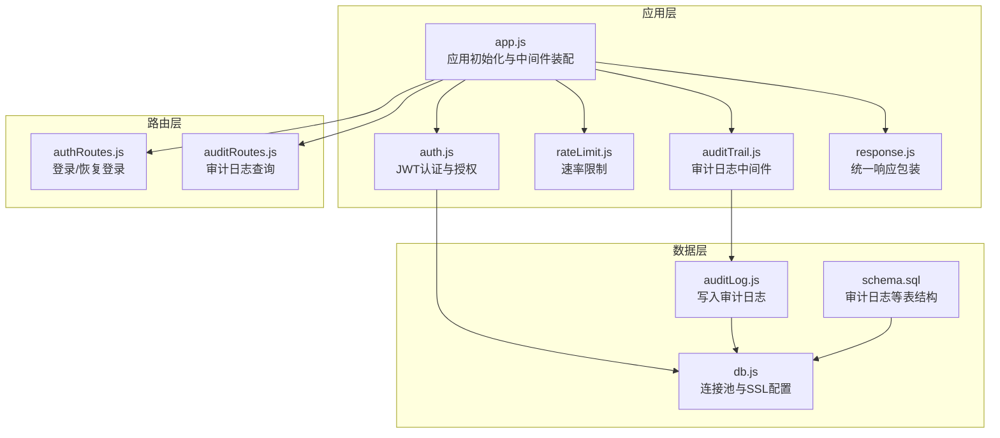
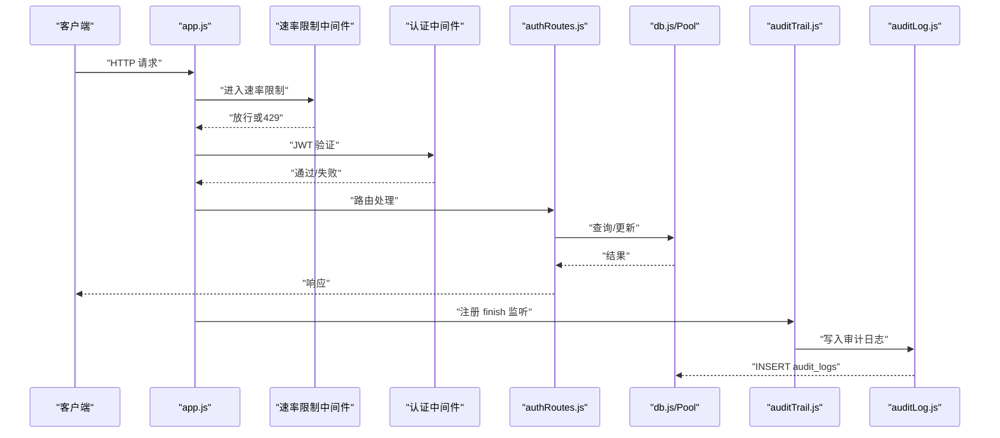
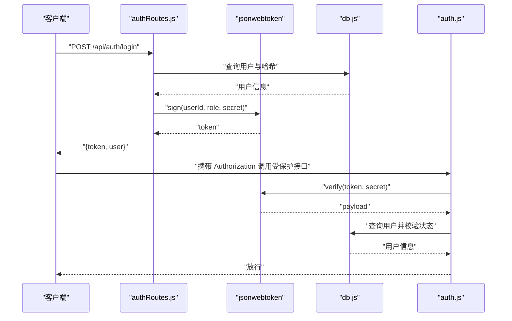
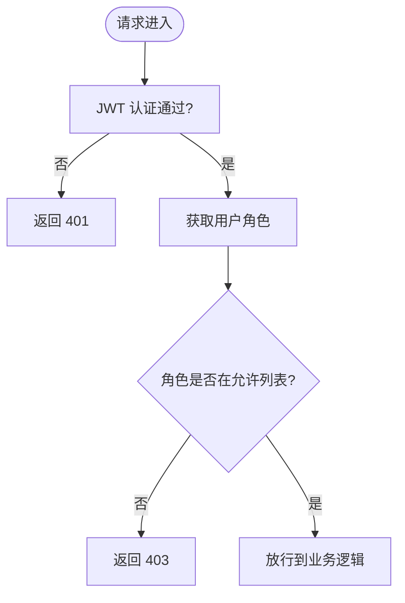
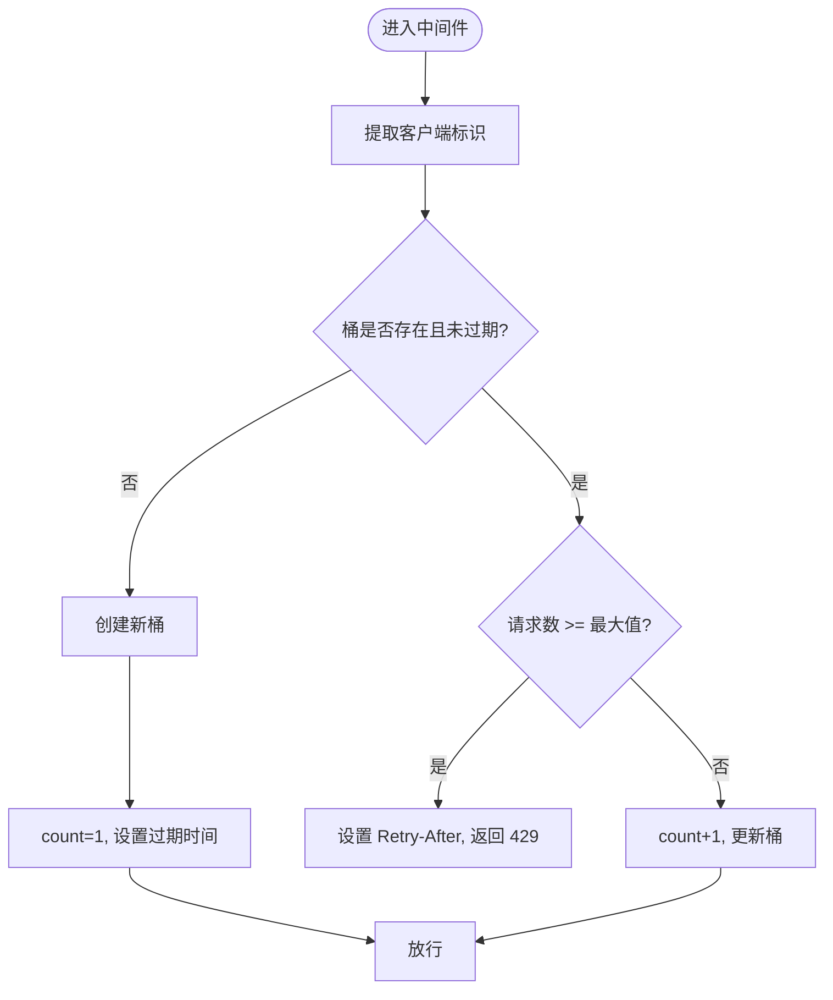
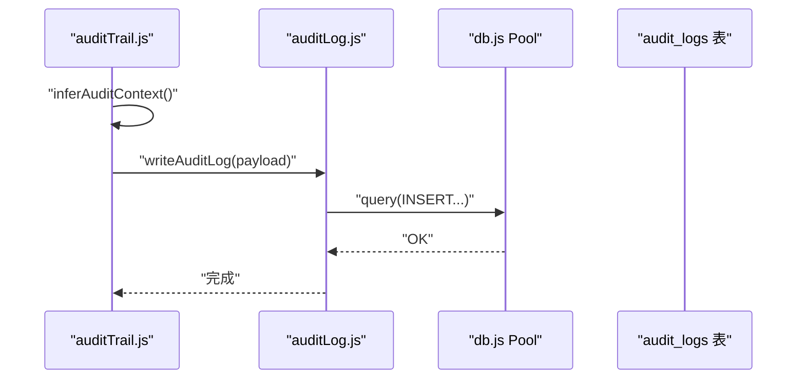
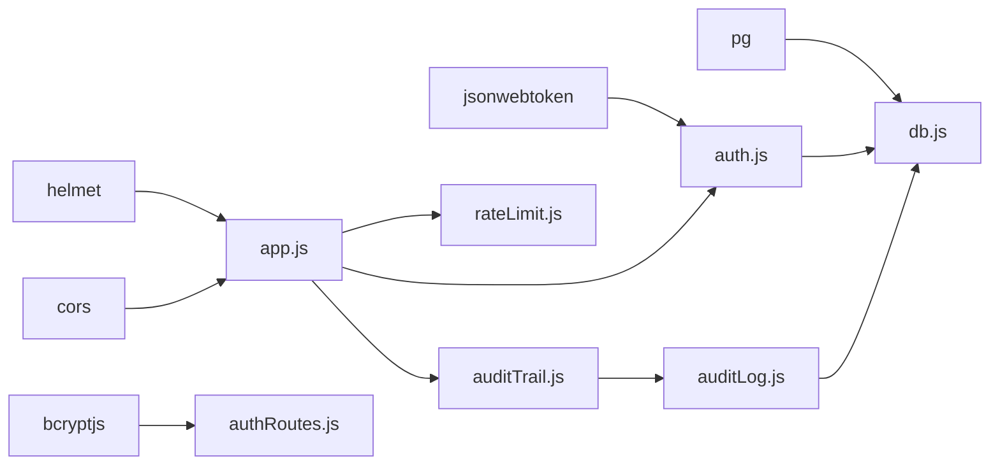

# 安全设计

<cite>
**本文引用的文件**
- [server/src/app.js](file://server/src/app.js)
- [server/src/config/db.js](file://server/src/config/db.js)
- [server/src/middleware/auth.js](file://server/src/middleware/auth.js)
- [server/src/middleware/rateLimit.js](file://server/src/middleware/rateLimit.js)
- [server/src/middleware/auditTrail.js](file://server/src/middleware/auditTrail.js)
- [server/src/middleware/response.js](file://server/src/middleware/response.js)
- [server/src/routes/authRoutes.js](file://server/src/routes/authRoutes.js)
- [server/src/routes/auditRoutes.js](file://server/src/routes/auditRoutes.js)
- [server/src/utils/auditLog.js](file://server/src/utils/auditLog.js)
- [server/database/schema.sql](file://server/database/schema.sql)
- [server/src/server.js](file://server/src/server.js)
- [server/package.json](file://server/package.json)
</cite>

## 目录
1. [简介](#简介)
2. [项目结构](#项目结构)
3. [核心组件](#核心组件)
4. [架构总览](#架构总览)
5. [详细组件分析](#详细组件分析)
6. [依赖关系分析](#依赖关系分析)
7. [性能与安全特性](#性能与安全特性)
8. [故障排查指南](#故障排查指南)
9. [结论](#结论)
10. [附录](#附录)

## 简介
本文件为库存管理系统的安全设计文档，聚焦后端服务的安全架构与防护措施。内容覆盖认证与会话（JWT）、基于角色的访问控制（RBAC）、数据验证与输入清理、API安全（速率限制、请求验证、CORS）、审计日志、密码安全策略、以及会话与CSRF相关建议。同时提供威胁模型、最佳实践、安全配置指南与漏洞修复流程，帮助在生产环境中持续提升系统安全性。

## 项目结构
后端采用 Express 应用，通过中间件统一注入安全能力，并按功能模块划分路由。数据库连接池支持 SSL 连接配置，审计日志表结构完整，便于安全事件追踪与合规审计。

**图表来源**
- [server/src/app.js:27-33](file://server/src/app.js#L27-L33)
- [server/src/middleware/auth.js:1-46](file://server/src/middleware/auth.js#L1-L46)
- [server/src/middleware/rateLimit.js:1-40](file://server/src/middleware/rateLimit.js#L1-L40)
- [server/src/middleware/auditTrail.js:1-84](file://server/src/middleware/auditTrail.js#L1-L84)
- [server/src/middleware/response.js:1-62](file://server/src/middleware/response.js#L1-L62)
- [server/src/routes/authRoutes.js:17-69](file://server/src/routes/authRoutes.js#L17-L69)
- [server/src/routes/auditRoutes.js:15-107](file://server/src/routes/auditRoutes.js#L15-L107)
- [server/src/config/db.js:13-19](file://server/src/config/db.js#L13-L19)
- [server/database/schema.sql:275-288](file://server/database/schema.sql#L275-L288)
- [server/src/utils/auditLog.js:1-38](file://server/src/utils/auditLog.js#L1-L38)

**章节来源**
- [server/src/app.js:27-33](file://server/src/app.js#L27-L33)
- [server/src/config/db.js:13-19](file://server/src/config/db.js#L13-L19)
- [server/database/schema.sql:275-288](file://server/database/schema.sql#L275-L288)

## 核心组件
- 认证与会话（JWT）
  - 使用对称密钥签发与验证令牌；登录成功后返回短期令牌，前端保存在状态管理中；提供“恢复登录态”接口以减少重复登录。
- 基于角色的访问控制（RBAC）
  - 中间件根据用户角色进行授权，管理员与经理可访问审计日志等敏感接口。
- 速率限制
  - 按客户端 IP 与命名空间统计请求频次，超过阈值返回 429 并设置 Retry-After 头。
- 审计日志
  - 自动记录关键操作、方法、路径、状态码与请求体（敏感字段脱敏），支持查询过滤与分页。
- 统一响应包装
  - 规范化错误与成功响应格式，便于前端处理与日志追踪。
- 数据库连接与安全
  - 连接池支持 SSL，依据环境与连接字符串自动启用，降低传输风险。

**章节来源**
- [server/src/middleware/auth.js:5-29](file://server/src/middleware/auth.js#L5-L29)
- [server/src/routes/authRoutes.js:17-69](file://server/src/routes/authRoutes.js#L17-L69)
- [server/src/middleware/auth.js:32-40](file://server/src/middleware/auth.js#L32-L40)
- [server/src/middleware/rateLimit.js:9-35](file://server/src/middleware/rateLimit.js#L9-L35)
- [server/src/middleware/auditTrail.js:47-79](file://server/src/middleware/auditTrail.js#L47-L79)
- [server/src/middleware/response.js:36-54](file://server/src/middleware/response.js#L36-L54)
- [server/src/config/db.js:3-11](file://server/src/config/db.js#L3-L11)

## 架构总览
下图展示从请求进入应用到数据库写入审计日志的整体流程，突出安全中间件与审计链路。

**图表来源**
- [server/src/app.js:27-33](file://server/src/app.js#L27-L33)
- [server/src/middleware/rateLimit.js:9-35](file://server/src/middleware/rateLimit.js#L9-L35)
- [server/src/middleware/auth.js:5-29](file://server/src/middleware/auth.js#L5-L29)
- [server/src/routes/authRoutes.js:17-69](file://server/src/routes/authRoutes.js#L17-L69)
- [server/src/middleware/auditTrail.js:47-79](file://server/src/middleware/auditTrail.js#L47-L79)
- [server/src/utils/auditLog.js:1-38](file://server/src/utils/auditLog.js#L1-L38)
- [server/src/config/db.js:13-19](file://server/src/config/db.js#L13-L19)

## 详细组件分析

### JWT 认证机制
- 令牌生成
  - 登录成功后使用对称密钥签发 JWT，设置较短有效期，降低泄露风险。
- 令牌验证
  - 中间件从 Authorization 头解析 Bearer 令牌，验证签名与过期时间；查询用户并检查账户状态。
- 刷新策略
  - 当前未实现专用刷新令牌流程，建议引入短期访问令牌与长期刷新令牌，配合黑名单与滑动过期策略，提升安全性。

**图表来源**
- [server/src/routes/authRoutes.js:41-43](file://server/src/routes/authRoutes.js#L41-L43)
- [server/src/middleware/auth.js:13-28](file://server/src/middleware/auth.js#L13-L28)
- [server/src/config/db.js:15-19](file://server/src/config/db.js#L15-L19)

**章节来源**
- [server/src/routes/authRoutes.js:17-69](file://server/src/routes/authRoutes.js#L17-L69)
- [server/src/middleware/auth.js:5-29](file://server/src/middleware/auth.js#L5-L29)

### RBAC 设计与实现
- 角色定义
  - 用户表包含角色字段，枚举值覆盖管理员、经理、员工等。
- 授权中间件
  - 提供基于角色的授权函数，仅允许指定角色访问特定资源。
- 实际应用
  - 审计日志查询接口要求 ADMIN 或 MANAGER 角色，确保敏感数据访问受控。

**图表来源**
- [server/src/middleware/auth.js:32-40](file://server/src/middleware/auth.js#L32-L40)
- [server/src/routes/auditRoutes.js:8-9](file://server/src/routes/auditRoutes.js#L8-L9)
- [server/database/schema.sql:2-11](file://server/database/schema.sql#L2-L11)

**章节来源**
- [server/src/middleware/auth.js:32-40](file://server/src/middleware/auth.js#L32-L40)
- [server/src/routes/auditRoutes.js:8-9](file://server/src/routes/auditRoutes.js#L8-L9)
- [server/database/schema.sql:2-11](file://server/database/schema.sql#L2-L11)

### 速率限制与请求验证
- 速率限制
  - 基于命名空间与客户端 IP 的滑动窗口计数器，超限返回 429 并设置 Retry-After。
- 登录接口保护
  - 登录路由单独配置速率限制，降低暴力破解风险。
- 请求验证
  - 登录接口显式校验必填字段；统一响应中间件对错误进行标准化包装。

**图表来源**
- [server/src/middleware/rateLimit.js:3-35](file://server/src/middleware/rateLimit.js#L3-L35)
- [server/src/routes/authRoutes.js:10-14](file://server/src/routes/authRoutes.js#L10-L14)

**章节来源**
- [server/src/middleware/rateLimit.js:9-35](file://server/src/middleware/rateLimit.js#L9-L35)
- [server/src/routes/authRoutes.js:10-14](file://server/src/routes/authRoutes.js#L10-L14)
- [server/src/middleware/response.js:14-27](file://server/src/middleware/response.js#L14-L27)

### 审计日志系统
- 自动化
  - 在响应完成时自动推断上下文、记录操作者、方法、路径、状态码与请求体（敏感字段脱敏）。
- 结构化存储
  - 审计日志表包含用户标识、角色、动作类型、实体类型、元数据（JSONB）等字段，便于检索与分析。
- 查询接口
  - 支持按时间、动作、实体类型、关键词等条件过滤，支持加载全部或分页查询。

**图表来源**
- [server/src/middleware/auditTrail.js:47-79](file://server/src/middleware/auditTrail.js#L47-L79)
- [server/src/utils/auditLog.js:1-38](file://server/src/utils/auditLog.js#L1-L38)
- [server/database/schema.sql:275-288](file://server/database/schema.sql#L275-L288)

**章节来源**
- [server/src/middleware/auditTrail.js:4-12](file://server/src/middleware/auditTrail.js#L4-L12)
- [server/src/middleware/auditTrail.js:14-45](file://server/src/middleware/auditTrail.js#L14-L45)
- [server/src/middleware/auditTrail.js:47-79](file://server/src/middleware/auditTrail.js#L47-L79)
- [server/src/utils/auditLog.js:1-38](file://server/src/utils/auditLog.js#L1-L38)
- [server/src/routes/auditRoutes.js:15-107](file://server/src/routes/auditRoutes.js#L15-L107)
- [server/database/schema.sql:275-288](file://server/database/schema.sql#L275-L288)

### 密码安全策略
- 存储
  - 使用强哈希算法存储密码，登录时比对哈希值。
- 强度
  - 建议在业务层增加密码强度规则（长度、复杂度、历史重复等），当前路由未强制校验强度。
- 传输
  - 登录接口通过 HTTPS 传输，结合数据库连接池 SSL 配置，降低中间人风险。

**章节来源**
- [server/src/routes/authRoutes.js:35](file://server/src/routes/authRoutes.js#L35)
- [server/src/config/db.js:3-11](file://server/src/config/db.js#L3-L11)

### CORS 配置与会话/CSRF
- CORS
  - 默认启用跨域中间件，未设置白名单与凭据策略，建议在生产中明确 Origin 白名单并谨慎配置 credentials。
- 会话与 CSRF
  - 采用无状态 JWT，不涉及服务端会话；CSRF 防护建议在前端 SPA 中通过 SameSite Cookie、CSRF Token 或自定义头部策略配合使用。

**章节来源**
- [server/src/app.js:28-29](file://server/src/app.js#L28-L29)

## 依赖关系分析
- 安全相关依赖
  - helmet：设置安全 HTTP 头。
  - cors：跨域支持。
  - bcryptjs：密码哈希。
  - jsonwebtoken：JWT 签发与验证。
  - pg：PostgreSQL 连接池。
- 中间件耦合
  - 审计中间件依赖数据库连接池与审计工具；认证中间件依赖数据库查询与 JWT 库；速率限制中间件独立但需考虑缓存一致性。

**图表来源**
- [server/src/app.js:28-33](file://server/src/app.js#L28-L33)
- [server/src/middleware/auth.js:1-2](file://server/src/middleware/auth.js#L1-L2)
- [server/src/routes/authRoutes.js:2-3](file://server/src/routes/authRoutes.js#L2-L3)
- [server/src/config/db.js:15-19](file://server/src/config/db.js#L15-L19)
- [server/package.json:15-24](file://server/package.json#L15-L24)

**章节来源**
- [server/package.json:15-24](file://server/package.json#L15-L24)

## 性能与安全特性
- 性能
  - 速率限制为内存级计数，适合单实例部署；多实例需共享存储或集中限流。
  - 审计日志写入为同步 I/O，建议在高并发场景引入异步队列或批量写入。
- 安全
  - JWT 对称密钥简单易用，建议在多租户或多实例场景使用非对称密钥与密钥轮换。
  - 审计日志脱敏策略完善，建议对敏感字段建立更细粒度的脱敏规则。

[本节为通用讨论，无需列出具体文件来源]

## 故障排查指南
- 认证失败
  - 检查 Authorization 头格式与令牌签名密钥；确认用户存在且处于激活状态。
- 429 限流
  - 查看 Retry-After 头；调整命名空间或阈值；必要时迁移至分布式缓存。
- 审计日志缺失
  - 确认响应已完成触发 finish 事件；检查数据库连接与写入异常；核对脱敏逻辑是否误删字段。
- 启动失败
  - 数据库连接超时或不可达，检查连接串与网络；查看启动超时配置。

**章节来源**
- [server/src/middleware/auth.js:9-28](file://server/src/middleware/auth.js#L9-L28)
- [server/src/middleware/rateLimit.js:23-29](file://server/src/middleware/rateLimit.js#L23-L29)
- [server/src/middleware/auditTrail.js:47-79](file://server/src/middleware/auditTrail.js#L47-L79)
- [server/src/server.js:18-24](file://server/src/server.js#L18-L24)

## 结论
本系统在认证、授权、审计与传输安全方面具备基础能力，建议在生产环境中进一步完善：引入无状态 CSRF 防护、优化 CORS 配置、增强密码强度策略、实施 JWT 密钥轮换与审计日志异步化，以及加强速率限制的分布式一致性与可观测性。

[本节为总结性内容，无需列出具体文件来源]

## 附录

### 安全最佳实践清单
- 认证
  - 使用 HTTPS 与安全传输；短期访问令牌 + 长效刷新令牌；定期轮换密钥。
- 授权
  - 最小权限原则；角色与资源解耦；定期审查权限矩阵。
- 输入与输出
  - 参数化查询防 SQL 注入；输入长度与格式校验；输出编码防 XSS。
- API 安全
  - 明确 CORS 白名单；速率限制与熔断；请求体大小限制；错误信息最小化披露。
- 审计与监控
  - 全量操作审计；敏感字段脱敏；告警与日志留存；定期审计报告。

[本节为通用指导，无需列出具体文件来源]

### 威胁模型与缓解
- 常见威胁
  - 令牌泄露、暴力破解、越权访问、会话劫持、日志污染。
- 缓解措施
  - 引入刷新令牌与黑名单；速率限制与验证码；RBAC 与审计；TLS 与安全头。

[本节为概念性内容，无需列出具体文件来源]

### 安全配置指南
- 环境变量
  - 数据库连接串与 SSL；JWT 密钥；速率限制窗口与阈值；CORS 白名单。
- 数据库
  - 启用 SSL；限制连接数与超时；审计日志表索引优化。
- 应用
  - Helmet 安全头；CORS 白名单；统一错误响应；审计中间件顺序靠前。

**章节来源**
- [server/src/config/db.js:3-11](file://server/src/config/db.js#L3-L11)
- [server/src/app.js:28-33](file://server/src/app.js#L28-L33)
- [server/src/middleware/rateLimit.js:9](file://server/src/middleware/rateLimit.js#L9)

### 漏洞修复流程
- 发现与评估
  - 安全扫描与渗透测试；分类严重级别。
- 修复与验证
  - 修复补丁；单元与集成测试；灰度发布。
- 监控与复盘
  - 审计日志与告警；修复效果验证；流程改进。

[本节为通用流程，无需列出具体文件来源]