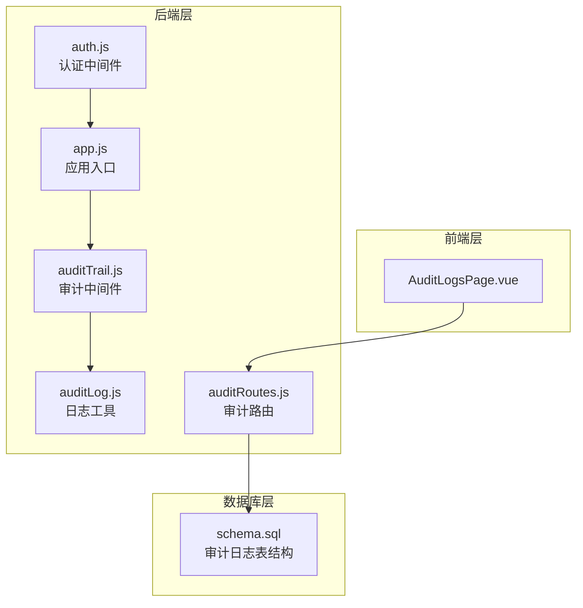
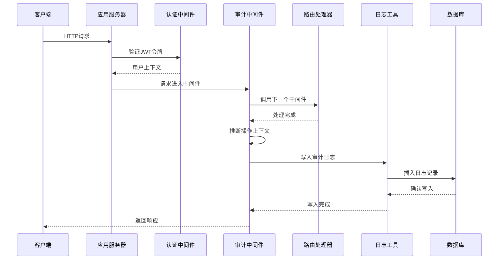
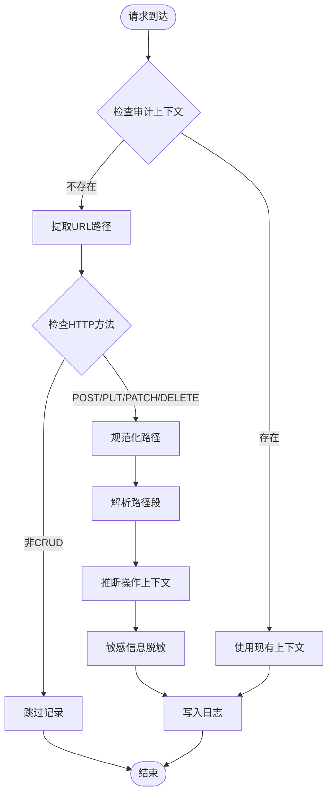
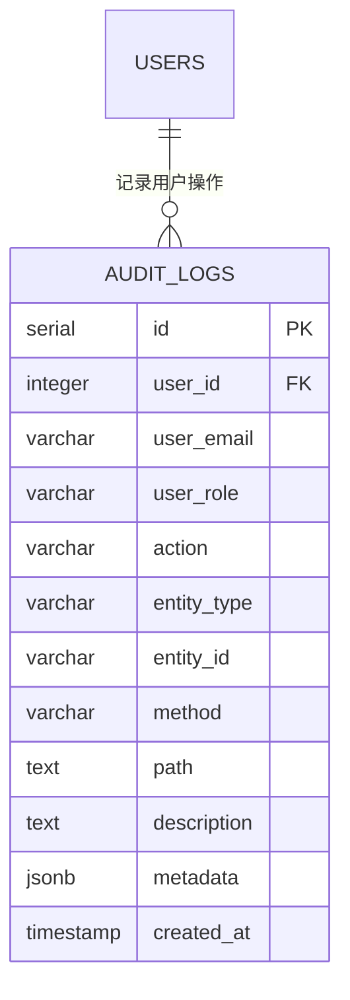
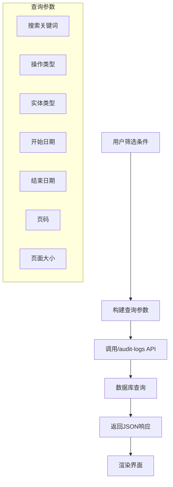
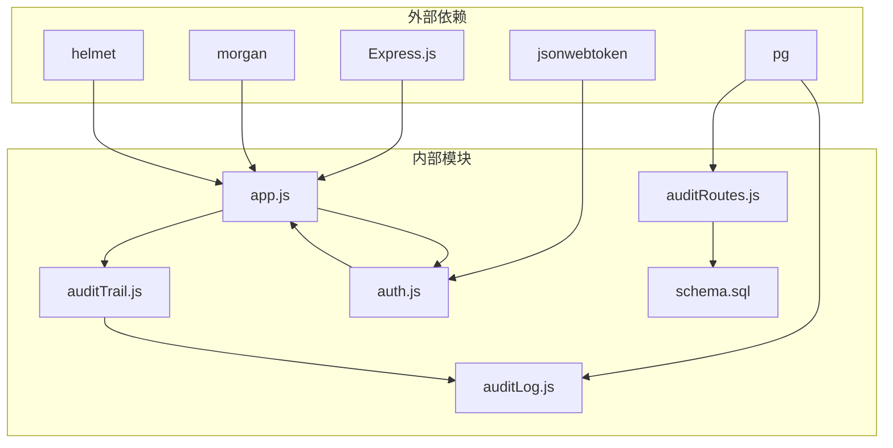

# 审计日志系统

<cite>
**本文档引用的文件**
- [auditTrail.js](file://server/src/middleware/auditTrail.js)
- [auditLog.js](file://server/src/utils/auditLog.js)
- [auditRoutes.js](file://server/src/routes/auditRoutes.js)
- [AuditLogsPage.vue](file://web/src/pages/AuditLogsPage.vue)
- [schema.sql](file://server/database/schema.sql)
- [auth.js](file://server/src/middleware/auth.js)
- [app.js](file://server/src/app.js)
- [settingsRoutes.js](file://server/src/routes/settingsRoutes.js)
- [pagination.js](file://server/src/utils/pagination.js)
</cite>

## 目录
1. [简介](#简介)
2. [项目结构](#项目结构)
3. [核心组件](#核心组件)
4. [架构概览](#架构概览)
5. [详细组件分析](#详细组件分析)
6. [依赖关系分析](#依赖关系分析)
7. [性能考量](#性能考量)
8. [故障排除指南](#故障排除指南)
9. [结论](#结论)
10. [附录](#附录)

## 简介
本系统实现了完整的审计日志功能，通过中间件自动捕获用户操作，标准化日志格式，并提供可视化界面进行查询、筛选和导出。审计日志覆盖用户登录、数据修改、系统配置变更等多种操作类型，支持按时间、用户、实体类型、操作动作等多维度过滤，并具备隐私保护和合规要求。

## 项目结构
审计日志系统主要分布在以下模块中：
- **后端中间件层**：审计中间件负责拦截HTTP请求，提取上下文信息并生成审计日志
- **日志工具层**：提供统一的日志写入接口，确保数据一致性
- **路由层**：提供审计日志的查询接口，支持分页和复杂查询
- **前端展示层**：提供可视化的审计日志管理界面
- **数据库层**：定义审计日志表结构和索引优化



**图表来源**
- [auditTrail.js:1-86](file://server/src/middleware/auditTrail.js#L1-L86)
- [auditLog.js:1-40](file://server/src/utils/auditLog.js#L1-L40)
- [auditRoutes.js:1-113](file://server/src/routes/auditRoutes.js#L1-L113)
- [AuditLogsPage.vue:1-457](file://web/src/pages/AuditLogsPage.vue#L1-L457)
- [schema.sql:275-288](file://server/database/schema.sql#L275-L288)

**章节来源**
- [app.js:1-91](file://server/src/app.js#L1-L91)
- [auditTrail.js:1-86](file://server/src/middleware/auditTrail.js#L1-L86)
- [auditRoutes.js:1-113](file://server/src/routes/auditRoutes.js#L1-L113)

## 核心组件
审计日志系统由四个核心组件构成：

### 1. 审计中间件 (auditTrail.js)
- 自动拦截HTTP请求，提取操作上下文
- 标准化日志格式，包含用户信息、操作类型、实体信息
- 支持敏感信息过滤，如密码字段脱敏
- 异步写入数据库，不影响请求响应

### 2. 日志工具 (auditLog.js)
- 提供统一的数据库写入接口
- 使用JSONB字段存储元数据，支持复杂结构
- 参数化查询，防止SQL注入攻击
- 错误处理和日志记录

### 3. 审计路由 (auditRoutes.js)
- 提供RESTful API查询审计日志
- 支持全文搜索和多条件过滤
- 分页查询优化，支持大数据量场景
- 租户隔离，确保数据安全

### 4. 前端界面 (AuditLogsPage.vue)
- 可视化审计日志展示界面
- 支持多种筛选条件和预设配置
- 导出功能，支持CSV、JSON、PDF格式
- 用户友好的交互体验

**章节来源**
- [auditTrail.js:47-81](file://server/src/middleware/auditTrail.js#L47-L81)
- [auditLog.js:1-40](file://server/src/utils/auditLog.js#L1-L40)
- [auditRoutes.js:16-110](file://server/src/routes/auditRoutes.js#L16-L110)
- [AuditLogsPage.vue:10-48](file://web/src/pages/AuditLogsPage.vue#L10-L48)

## 架构概览
审计日志系统采用中间件模式，在请求生命周期的关键节点自动捕获操作信息。



**图表来源**
- [app.js:57-58](file://server/src/app.js#L57-L58)
- [auditTrail.js:47-81](file://server/src/middleware/auditTrail.js#L47-L81)
- [auditLog.js:1-35](file://server/src/utils/auditLog.js#L1-L35)

## 详细组件分析

### 审计中间件设计与实现
审计中间件采用被动监听模式，在响应完成后触发日志记录。

#### 上下文推断机制
中间件根据URL路径和HTTP方法自动推断操作类型：



**图表来源**
- [auditTrail.js:14-45](file://server/src/middleware/auditTrail.js#L14-L45)
- [auditTrail.js:4-12](file://server/src/middleware/auditTrail.js#L4-L12)

#### 敏感信息过滤
中间件内置敏感信息过滤机制，确保日志安全性：

| 敏感字段 | 处理方式 | 示例输出 |
|---------|---------|---------|
| password | 替换为[REDACTED] | [REDACTED] |
| password_confirmation | 替换为[REDACTED] | [REDACTED] |
| old_password | 替换为[REDACTED] | [REDACTED] |

**章节来源**
- [auditTrail.js:4-12](file://server/src/middleware/auditTrail.js#L4-L12)
- [auditTrail.js:58-78](file://server/src/middleware/auditTrail.js#L58-L78)

### 日志数据结构与字段定义
审计日志采用标准化的数据结构，确保信息完整性和查询效率。



**图表来源**
- [schema.sql:275-288](file://server/database/schema.sql#L275-L288)

#### 字段详细说明

| 字段名 | 类型 | 必填 | 描述 | 示例值 |
|--------|------|------|------|--------|
| id | serial | 是 | 主键标识 | 12345 |
| user_id | integer | 否 | 操作用户ID | 1001 |
| user_email | varchar(150) | 否 | 用户邮箱 | user@example.com |
| user_role | varchar(20) | 否 | 用户角色 | ADMIN |
| action | varchar(80) | 是 | 操作动作代码 | PRODUCTS_CREATE |
| entity_type | varchar(80) | 是 | 实体类型 | PRODUCTS |
| entity_id | varchar(120) | 否 | 实体ID | PRD-001 |
| method | varchar(10) | 是 | HTTP方法 | POST |
| path | text | 是 | 请求路径 | /api/products |
| description | text | 否 | 操作描述 | 创建产品 |
| metadata | jsonb | 是 | 元数据JSON | {...} |
| created_at | timestamp | 是 | 创建时间 | 2024-01-15 10:30:00 |

**章节来源**
- [schema.sql:275-288](file://server/database/schema.sql#L275-L288)
- [auditLog.js:4-35](file://server/src/utils/auditLog.js#L4-L35)

### 不同类型的操作日志
系统支持多种操作类型的日志记录，每种类型都有特定的格式和用途。

#### 用户登录日志
- **动作代码**: LOGIN
- **实体类型**: AUTH
- **描述**: 用户登录系统
- **元数据**: 包含登录状态、IP地址、用户代理等

#### 数据修改日志
系统根据URL路径自动推断数据操作类型：

| HTTP方法 | 实体类型 | 动作代码示例 | 描述 |
|----------|----------|-------------|------|
| POST | PRODUCTS | PRODUCTS_CREATE | 创建产品 |
| PUT | PRODUCTS | PRODUCTS_UPDATE | 更新产品 |
| PATCH | PRODUCTS | PRODUCTS_UPDATE | 部分更新产品 |
| DELETE | PRODUCTS | PRODUCTS_DELETE | 删除产品 |
| POST | STOCK_COUNT | STOCK_COUNT_CREATE | 创建盘点单 |
| PUT | ALERT | ALERT_UPDATE | 更新提醒设置 |

#### 系统配置变更日志
- **动作代码**: SETTINGS_UPDATE
- **实体类型**: SETTINGS 或 USER_PREFERENCES
- **描述**: 系统设置或用户偏好变更
- **元数据**: 包含变更前后的配置值对比

**章节来源**
- [auditTrail.js:21-28](file://server/src/middleware/auditTrail.js#L21-L28)
- [auditTrail.js:39-44](file://server/src/middleware/auditTrail.js#L39-L44)
- [settingsRoutes.js:85-91](file://server/src/routes/settingsRoutes.js#L85-L91)

### 查询方式与过滤机制
审计日志提供灵活的查询接口，支持多种过滤条件和排序方式。

#### 前端查询接口
前端通过RESTful API获取审计日志数据：



**图表来源**
- [AuditLogsPage.vue:54-84](file://web/src/pages/AuditLogsPage.vue#L54-L84)
- [auditRoutes.js:16-23](file://server/src/routes/auditRoutes.js#L16-L23)

#### 后端查询实现
后端路由提供完整的查询功能：

| 查询条件 | 参数名 | 类型 | 说明 |
|----------|--------|------|------|
| 搜索关键词 | search | string | 支持用户邮箱、动作、实体类型、路径、描述模糊匹配 |
| 操作类型 | action | string | 单个或多个操作类型过滤 |
| 实体类型 | entityType | string | 单个或多个实体类型过滤 |
| 开始日期 | startDate | date | 日期范围起始 |
| 结束日期 | endDate | date | 日期范围结束 |
| 分页 | page/pageSize | number | 分页参数，默认10条 |

**章节来源**
- [auditRoutes.js:16-110](file://server/src/routes/auditRoutes.js#L16-L110)
- [AuditLogsPage.vue:165-266](file://web/src/pages/AuditLogsPage.vue#L165-L266)

### 日志安全考虑与隐私保护
系统在设计时充分考虑了安全性和隐私保护要求。

#### 敏感信息保护
- **密码字段脱敏**: 所有包含password关键字的字段都会被替换为[REDACTED]
- **最小化原则**: 仅记录必要的操作信息，避免收集个人敏感数据
- **访问控制**: 仅授权用户可访问审计日志

#### 数据隔离
- **租户隔离**: 每条日志都关联租户ID，确保数据完全隔离
- **权限控制**: 仅管理员和经理可查看审计日志
- **索引优化**: 为租户ID建立专用索引，提升查询性能

#### 合规要求
- **数据保留**: 符合相关法规要求的数据保留期限
- **审计完整性**: 确保日志不可篡改和删除
- **隐私保护**: 遵循GDPR等隐私保护法规

**章节来源**
- [auditTrail.js:4-12](file://server/src/middleware/auditTrail.js#L4-L12)
- [auth.js:8-11](file://server/src/middleware/auth.js#L8-L11)
- [auth.js:64-72](file://server/src/middleware/auth.js#L64-L72)

## 依赖关系分析



**图表来源**
- [app.js:1-91](file://server/src/app.js#L1-L91)
- [auditTrail.js:1-2](file://server/src/middleware/auditTrail.js#L1-L2)
- [auditLog.js:1](file://server/src/utils/auditLog.js#L1)
- [auditRoutes.js:1-2](file://server/src/routes/auditRoutes.js#L1-L2)

### 关键依赖关系
1. **中间件链**: 审计中间件位于认证中间件之后，确保用户上下文可用
2. **数据库连接**: 日志工具通过连接池执行数据库操作
3. **路由集成**: 审计路由独立部署，不依赖业务路由
4. **前端集成**: 前端界面通过标准API接口访问审计数据

**章节来源**
- [app.js:57-79](file://server/src/app.js#L57-L79)
- [auditTrail.js:1-2](file://server/src/middleware/auditTrail.js#L1-L2)
- [auditRoutes.js:1-113](file://server/src/routes/auditRoutes.js#L1-L113)

## 性能考量
审计日志系统在设计时充分考虑了性能优化，确保高并发场景下的稳定运行。

### 数据库优化策略
- **索引优化**: 为常用查询字段建立索引，包括user_id、created_at、entity_type等
- **分区策略**: 对历史数据进行分区存储，提升查询性能
- **连接池**: 使用连接池管理数据库连接，避免频繁创建销毁
- **批量写入**: 异步写入机制，不影响请求响应时间

### 查询性能优化
- **分页查询**: 默认分页大小限制在1-100之间，防止大查询影响性能
- **条件过滤**: 支持多条件组合过滤，减少不必要的数据传输
- **缓存策略**: 对热门查询结果进行缓存，降低数据库压力

### 前端性能优化
- **虚拟滚动**: 大数据量时使用虚拟滚动技术，提升界面响应速度
- **懒加载**: 图片和详细信息采用懒加载方式
- **本地存储**: 筛选条件和预设配置存储在本地，减少网络请求

**章节来源**
- [pagination.js:1-28](file://server/src/utils/pagination.js#L1-L28)
- [auditRoutes.js:70-101](file://server/src/routes/auditRoutes.js#L70-L101)
- [AuditLogsPage.vue:106-154](file://web/src/pages/AuditLogsPage.vue#L106-L154)

## 故障排除指南

### 常见问题与解决方案

#### 审计日志未记录
**可能原因**:
- 审计中间件未正确配置
- 请求方法不符合记录条件
- 状态码大于等于400

**解决步骤**:
1. 检查中间件是否正确注册
2. 验证请求方法是否为CRUD操作
3. 查看响应状态码是否正常

#### 日志数据缺失
**可能原因**:
- 数据库连接异常
- SQL语句执行失败
- 权限不足

**解决步骤**:
1. 检查数据库连接状态
2. 查看数据库日志
3. 验证用户权限

#### 查询性能问题
**可能原因**:
- 缺少必要索引
- 查询条件过于宽泛
- 数据量过大

**解决步骤**:
1. 添加适当的数据库索引
2. 优化查询条件
3. 考虑数据归档策略

**章节来源**
- [auditTrail.js:58-78](file://server/src/middleware/auditTrail.js#L58-L78)
- [auditLog.js:1-35](file://server/src/utils/auditLog.js#L1-L35)
- [auditRoutes.js:107-109](file://server/src/routes/auditRoutes.js#L107-L109)

### 监控告警配置建议
建议配置以下监控指标：

#### 关键指标
- **日志写入成功率**: 目标≥99.9%
- **查询响应时间**: P95≤2秒
- **数据库连接数**: 动态调整，避免峰值过高
- **磁盘空间使用率**: 预留充足空间

#### 告警阈值
- **日志写入失败**: 连续5分钟内失败次数超过阈值
- **查询超时**: 单次查询时间超过30秒
- **数据库连接池耗尽**: 连接池使用率持续高于90%
- **磁盘空间不足**: 剩余空间低于10%

## 结论
审计日志系统通过中间件模式实现了自动化、标准化的日志记录，提供了完善的安全保护和查询功能。系统设计充分考虑了性能优化和扩展性，能够满足企业级应用的审计需求。通过合理的权限控制、数据隔离和隐私保护措施，确保了系统的合规性和安全性。

## 附录

### API参考文档

#### 获取审计日志列表
**请求**: GET /api/audit-logs
**认证**: 需要JWT令牌
**权限**: ADMIN, MANAGER

**查询参数**:
- search: string - 搜索关键词
- action: string - 操作类型
- entityType: string - 实体类型
- startDate: date - 开始日期
- endDate: date - 结束日期
- page: number - 页码，默认1
- pageSize: number - 页面大小，默认10，最大100

**响应**:
```json
{
  "items": [
    {
      "id": 1,
      "user_id": 1001,
      "user_email": "admin@example.com",
      "user_role": "ADMIN",
      "action": "LOGIN",
      "entity_type": "AUTH",
      "entity_id": null,
      "method": "POST",
      "path": "/api/auth/login",
      "description": "User logged in",
      "metadata": {},
      "created_at": "2024-01-15T10:30:00Z"
    }
  ],
  "pagination": {
    "total": 1,
    "page": 1,
    "pageSize": 10,
    "totalPages": 1
  }
}
```

### 日志分析工具推荐
1. **ELK Stack**: Elasticsearch + Logstash + Kibana
2. **Grafana**: 数据可视化和监控
3. **Prometheus**: 指标收集和告警
4. **Splunk**: 企业级日志分析平台

### 合规性检查清单
- [ ] 数据最小化原则
- [ ] 用户同意和透明度
- [ ] 数据安全和加密
- [ ] 访问控制和身份验证
- [ ] 数据保留和删除
- [ ] 审计跟踪完整性
- [ ] 员工培训和意识
- [ ] 定期安全评估