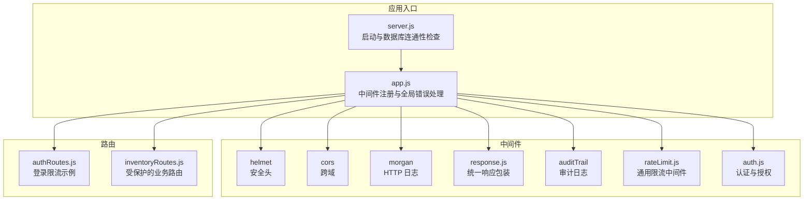
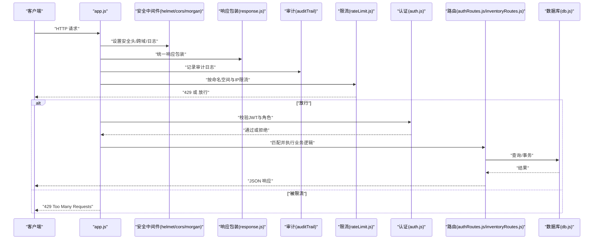
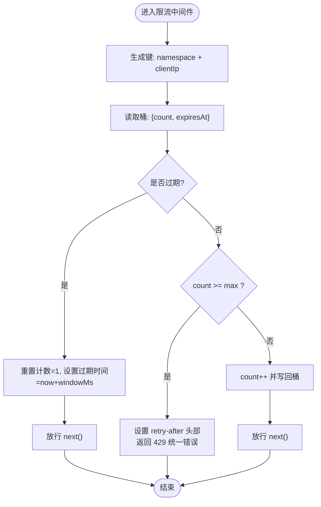
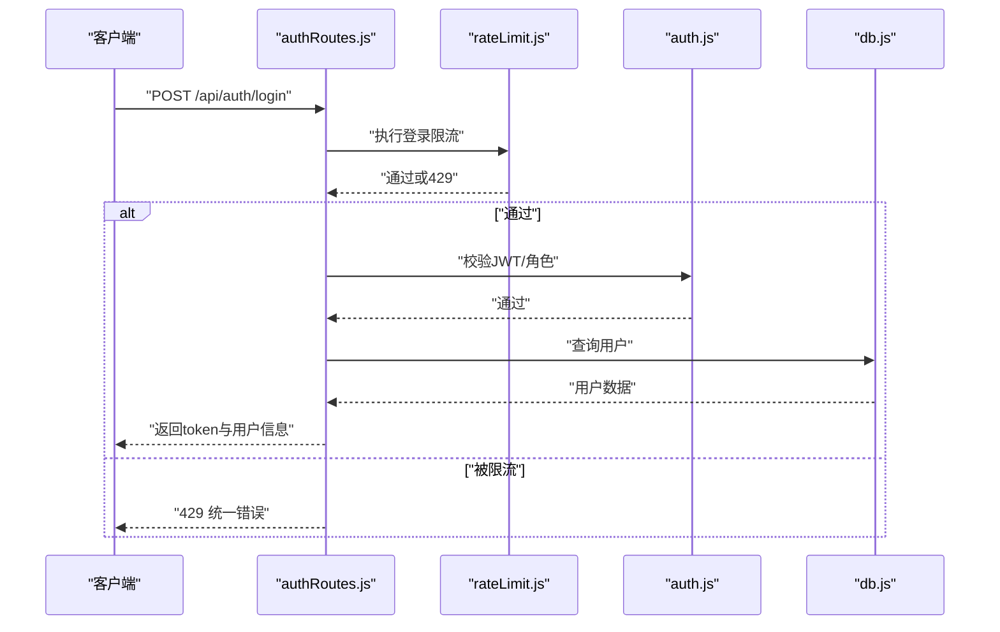
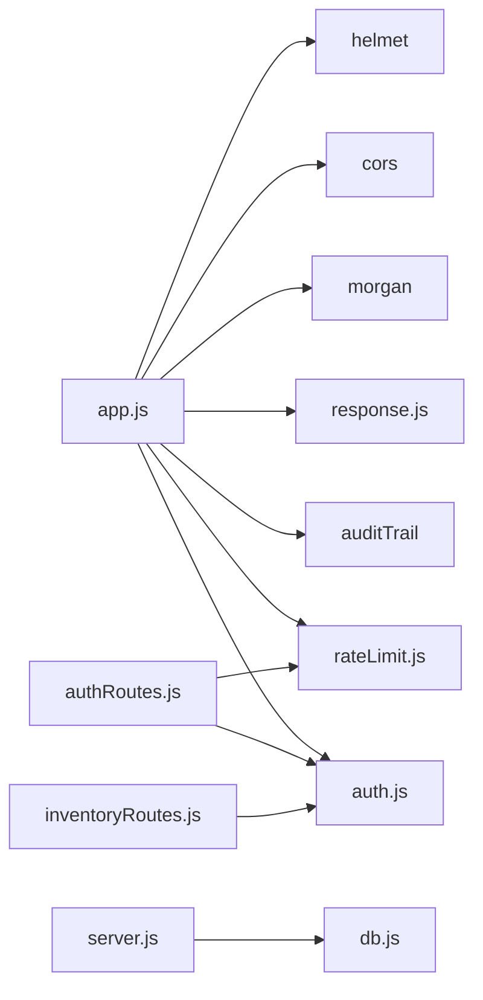

# 速率限制与防护

<cite>
**本文引用的文件**
- [rateLimit.js](file://server/src/middleware/rateLimit.js)
- [response.js](file://server/src/middleware/response.js)
- [auth.js](file://server/src/middleware/auth.js)
- [authRoutes.js](file://server/src/routes/authRoutes.js)
- [inventoryRoutes.js](file://server/src/routes/inventoryRoutes.js)
- [app.js](file://server/src/app.js)
- [server.js](file://server/src/server.js)
- [db.js](file://server/src/config/db.js)
- [package.json](file://server/package.json)
- [middleware.test.js](file://server/test/middleware.test.js)
- [.env.example](file://server/.env.example)
</cite>

## 目录
1. [简介](#简介)
2. [项目结构](#项目结构)
3. [核心组件](#核心组件)
4. [架构总览](#架构总览)
5. [详细组件分析](#详细组件分析)
6. [依赖关系分析](#依赖关系分析)
7. [性能考量](#性能考量)
8. [故障排查指南](#故障排查指南)
9. [结论](#结论)
10. [附录](#附录)

## 简介
本文件聚焦于系统的速率限制与API防护机制，围绕内置的通用限流中间件展开，说明其实现原理、策略类型（全局限流、按IP限制、按用户限制）、防暴力破解与DDoS缓解思路、配置参数、阈值设定、异常处理与性能优化建议，并给出监控指标与策略调优方法。为便于非技术读者理解，文档采用由浅入深的方式组织内容。

## 项目结构
系统基于 Express 构建，安全与防护相关的关键位置如下：
- 中间件层：安全头、跨域、日志、响应包装、审计、认证、限流等
- 路由层：按功能划分的REST端点，部分端点应用了限流策略
- 配置层：数据库连接池、SSL策略、启动超时控制
- 测试层：对响应包装与限流行为进行验证

**图表来源**
- [server.js:1-28](file://server/src/server.js#L1-L28)
- [app.js:1-65](file://server/src/app.js#L1-L65)
- [response.js:1-62](file://server/src/middleware/response.js#L1-L62)
- [auth.js:1-46](file://server/src/middleware/auth.js#L1-L46)
- [rateLimit.js:1-40](file://server/src/middleware/rateLimit.js#L1-L40)
- [authRoutes.js:1-72](file://server/src/routes/authRoutes.js#L1-L72)
- [inventoryRoutes.js:1-493](file://server/src/routes/inventoryRoutes.js#L1-L493)

**章节来源**
- [app.js:1-65](file://server/src/app.js#L1-L65)
- [server.js:1-28](file://server/src/server.js#L1-L28)

## 核心组件
- 通用限流中间件：提供基于时间窗口与计数器的滑动桶式限流，支持命名空间隔离与重试时间提示
- 响应包装中间件：统一成功/失败响应格式，注入请求ID，便于追踪与审计
- 认证中间件：基于JWT的令牌校验与角色授权
- 登录路由：在敏感端点应用独立的限流策略，降低暴力破解风险
- 数据库连接：连接池与SSL策略，以及启动阶段的连通性超时控制

**章节来源**
- [rateLimit.js:1-40](file://server/src/middleware/rateLimit.js#L1-L40)
- [response.js:1-62](file://server/src/middleware/response.js#L1-L62)
- [auth.js:1-46](file://server/src/middleware/auth.js#L1-L46)
- [authRoutes.js:1-72](file://server/src/routes/authRoutes.js#L1-L72)
- [db.js:1-25](file://server/src/config/db.js#L1-L25)

## 架构总览
下图展示了从客户端请求进入，到限流、认证、业务处理与响应返回的整体流程，以及关键防护点（安全头、日志、审计、限流）的位置。

**图表来源**
- [app.js:1-65](file://server/src/app.js#L1-L65)
- [response.js:1-62](file://server/src/middleware/response.js#L1-L62)
- [rateLimit.js:1-40](file://server/src/middleware/rateLimit.js#L1-L40)
- [auth.js:1-46](file://server/src/middleware/auth.js#L1-L46)
- [authRoutes.js:1-72](file://server/src/routes/authRoutes.js#L1-L72)
- [inventoryRoutes.js:1-493](file://server/src/routes/inventoryRoutes.js#L1-L493)
- [db.js:1-25](file://server/src/config/db.js#L1-L25)

## 详细组件分析

### 通用限流中间件（rateLimit.js）
- 实现原理
  - 使用内存Map作为“桶”存储每个键的计数与过期时间
  - 键生成规则：namespace:clientIp，其中clientIp来自请求头或IP字段，支持代理场景
  - 滑动时间窗：每次请求更新计数与过期时间；过期则重置计数
  - 达到阈值时设置“retry-after”头部，返回统一失败响应（优先使用响应包装中间件的fail方法）
- 关键参数
  - windowMs：时间窗口（毫秒），默认60秒
  - max：窗口内最大请求数，默认30次
  - namespace：命名空间，用于隔离不同端点或策略
- 异常处理
  - 当超过阈值时返回429状态码与统一错误结构，包含重试秒数
  - 未超过阈值则继续链路

**图表来源**
- [rateLimit.js:9-35](file://server/src/middleware/rateLimit.js#L9-L35)

**章节来源**
- [rateLimit.js:1-40](file://server/src/middleware/rateLimit.js#L1-L40)
- [middleware.test.js:37-50](file://server/test/middleware.test.js#L37-L50)

### 响应包装中间件（response.js）
- 功能要点
  - 注入请求ID到响应头与响应体
  - 将所有响应包裹为统一结构：成功/失败、错误码、消息、详情、请求ID
  - 提供success/fail便捷方法，便于控制器使用
- 与限流的协作
  - 限流在触发429时，优先使用res.fail输出统一错误结构，包含错误码与重试秒数

**章节来源**
- [response.js:1-62](file://server/src/middleware/response.js#L1-L62)
- [rateLimit.js:26-28](file://server/src/middleware/rateLimit.js#L26-L28)

### 认证中间件（auth.js）
- 功能要点
  - 校验Authorization头中的JWT令牌，解析用户信息并挂载到req.user
  - 角色授权中间件，按需限制端点访问
- 与限流的关系
  - 登录端点单独应用限流策略，降低暴力破解风险
  - 其他受保护路由在通过认证后才进入业务处理

**章节来源**
- [auth.js:1-46](file://server/src/middleware/auth.js#L1-L46)
- [authRoutes.js:10-14](file://server/src/routes/authRoutes.js#L10-L14)

### 登录路由（authRoutes.js）
- 限流策略
  - 在POST /api/auth/login上应用独立的限流器，命名空间为“auth-login”，窗口60秒，最大10次
- 业务流程
  - 校验邮箱与密码
  - 查询用户并校验账户状态与密码
  - 成功后签发JWT并返回用户信息
  - 失败或异常返回统一错误结构

**图表来源**
- [authRoutes.js:10-14](file://server/src/routes/authRoutes.js#L10-L14)
- [authRoutes.js:17-64](file://server/src/routes/authRoutes.js#L17-L64)
- [rateLimit.js:9-35](file://server/src/middleware/rateLimit.js#L9-L35)
- [auth.js:5-29](file://server/src/middleware/auth.js#L5-L29)
- [db.js:13-24](file://server/src/config/db.js#L13-L24)

**章节来源**
- [authRoutes.js:1-72](file://server/src/routes/authRoutes.js#L1-L72)

### 受保护的业务路由（inventoryRoutes.js）
- 认证前置
  - 所有业务路由均通过authenticateToken中间件，确保只有已认证用户可访问
- 限流策略
  - 当前未在通用业务路由上显式应用限流中间件，但可在路由级按需添加
- 业务特性
  - 提供库存查询、交易流水、出入库与调拨等操作，内部使用连接池与事务

**章节来源**
- [inventoryRoutes.js:1-493](file://server/src/routes/inventoryRoutes.js#L1-L493)
- [auth.js:5-29](file://server/src/middleware/auth.js#L5-L29)

### 启动与数据库连接（server.js, db.js）
- 启动流程
  - 服务器启动后尝试与数据库建立连通性，超时则关闭并退出进程
- 数据库连接
  - 连接池配置，自动根据URL与环境变量决定是否启用SSL
  - 支持自定义连接超时

**章节来源**
- [server.js:13-25](file://server/src/server.js#L13-L25)
- [db.js:13-19](file://server/src/config/db.js#L13-L19)

## 依赖关系分析
- 中间件依赖
  - app.js注册了安全头、跨域、日志、响应包装、审计、限流与认证中间件
  - 限流依赖响应包装中间件提供的fail方法输出统一错误
- 路由依赖
  - 登录路由依赖限流与认证中间件
  - 业务路由依赖认证中间件
- 外部依赖
  - Express、helmet、cors、morgan、jsonwebtoken、bcryptjs、pg等

**图表来源**
- [app.js:1-65](file://server/src/app.js#L1-L65)
- [rateLimit.js:1-40](file://server/src/middleware/rateLimit.js#L1-L40)
- [response.js:1-62](file://server/src/middleware/response.js#L1-L62)
- [auth.js:1-46](file://server/src/middleware/auth.js#L1-L46)
- [authRoutes.js:1-72](file://server/src/routes/authRoutes.js#L1-L72)
- [inventoryRoutes.js:1-493](file://server/src/routes/inventoryRoutes.js#L1-L493)
- [server.js:1-28](file://server/src/server.js#L1-L28)
- [db.js:1-25](file://server/src/config/db.js#L1-L25)

**章节来源**
- [package.json:15-29](file://server/package.json#L15-L29)

## 性能考量
- 内存存储的限流桶
  - 优点：实现简单、延迟低
  - 风险：单实例部署时，重启会清空计数；多实例部署时无法共享状态
  - 建议：生产环境使用Redis等外部存储，实现分布式共享
- 时间窗口与阈值
  - 窗口越短、阈值越小，越能抑制突发流量；但可能误伤正常用户
  - 建议：以端点为单位分别评估，登录端点更严格，普通查询端点更宽松
- 命名空间隔离
  - 不同端点使用不同namespace，避免相互干扰
- 重试提示
  - 通过“retry-after”头提示客户端等待时间，有助于削峰与缓解DDoS
- 日志与审计
  - morgan与审计中间件有助于定位异常请求模式，辅助限流策略优化

[本节为通用性能建议，不直接分析具体文件]

## 故障排查指南
- 429 Too Many Requests
  - 现象：响应体包含统一错误结构，带错误码与重试秒数
  - 排查：确认命名空间、窗口与阈值设置；检查客户端是否在短时间内重复请求
  - 参考路径：[rateLimit.js:23-29](file://server/src/middleware/rateLimit.js#L23-L29)
- 响应格式异常
  - 现象：非统一结构的错误响应
  - 排查：确保使用响应包装中间件，或使用res.fail/res.success
  - 参考路径：[response.js:9-54](file://server/src/middleware/response.js#L9-L54)
- 登录频繁失败
  - 现象：登录接口快速返回429
  - 排查：检查登录限流配置与客户端IP是否被限流
  - 参考路径：[authRoutes.js:10-14](file://server/src/routes/authRoutes.js#L10-L14)
- 启动数据库连接失败
  - 现象：启动阶段超时并退出
  - 排查：检查DATABASE_URL、网络连通性与SSL配置
  - 参考路径：[server.js:18-24](file://server/src/server.js#L18-L24)，[db.js:13-19](file://server/src/config/db.js#L13-L19)

**章节来源**
- [rateLimit.js:23-29](file://server/src/middleware/rateLimit.js#L23-L29)
- [response.js:9-54](file://server/src/middleware/response.js#L9-L54)
- [authRoutes.js:10-14](file://server/src/routes/authRoutes.js#L10-L14)
- [server.js:18-24](file://server/src/server.js#L18-L24)
- [db.js:13-19](file://server/src/config/db.js#L13-L19)

## 结论
本系统通过通用限流中间件实现了基础的请求频率控制，并在登录端点应用了独立的严格策略，有效降低了暴力破解风险。结合安全头、日志、审计与认证机制，形成了较为完整的API防护体系。建议在生产环境中引入分布式缓存以支撑多实例部署，并针对不同端点制定差异化限流策略，同时完善监控与告警，持续优化阈值与窗口参数。

[本节为总结性内容，不直接分析具体文件]

## 附录

### 速率限制策略类型与适用场景
- 全局限流
  - 使用默认namespace，适用于对整体请求量进行约束
- IP维度限制
  - 通过不同的namespace区分不同IP，适用于需要按来源IP精细化控制的场景
- 用户维度限制
  - 可扩展在限流键中加入userId，实现按用户粒度的限流
- API端点特定限制
  - 在路由层为敏感端点（如登录）单独配置限流器，窗口与阈值更严格

[本节为概念性说明，不直接分析具体文件]

### 阈值与窗口设置建议
- 登录端点
  - 窗口：1分钟；阈值：10次
  - 原因：降低暴力破解成功率，兼顾正常用户输入体验
- 普通查询端点
  - 窗口：1分钟；阈值：30~60次
  - 原因：允许正常批量查询，避免误伤
- 写操作端点
  - 窗口：1分钟；阈值：10~20次
  - 原因：保护高成本写操作，防止滥用

[本节为通用建议，不直接分析具体文件]

### 配置参数说明
- rateLimit.createRateLimiter
  - windowMs：时间窗口（毫秒），默认60000
  - max：窗口内最大请求数，默认30
  - namespace：命名空间，用于隔离不同策略，默认"default"
- 登录限流
  - 命名空间："auth-login"
  - 窗口：60000
  - 阈值：10
- 环境变量
  - PORT：服务端口，默认4000
  - DATABASE_URL：数据库连接串
  - JWT_SECRET：JWT密钥

**章节来源**
- [rateLimit.js:9-35](file://server/src/middleware/rateLimit.js#L9-L35)
- [authRoutes.js:10-14](file://server/src/routes/authRoutes.js#L10-L14)
- [.env.example:1-4](file://server/.env.example#L1-L4)

### 监控指标与告警
- 指标
  - 每端点每分钟请求数
  - 每分钟429次数
  - 每分钟平均响应时间
  - 每分钟错误率（含429）
- 告警
  - 429占比超过阈值时告警
  - 某IP或某用户触发限流次数异常上升
  - 端点RT异常升高

[本节为通用建议，不直接分析具体文件]

### 策略调优方法
- 分层限流
  - 先做IP级粗粒度限流，再做端点级细粒度限流
- 自适应阈值
  - 基于历史流量与业务高峰时段动态调整阈值
- 降级与熔断
  - 对高风险端点在异常情况下临时收紧阈值或临时禁用
- 多实例协同
  - 使用Redis等外部存储共享限流状态，避免多实例互相绕过

[本节为通用建议，不直接分析具体文件]