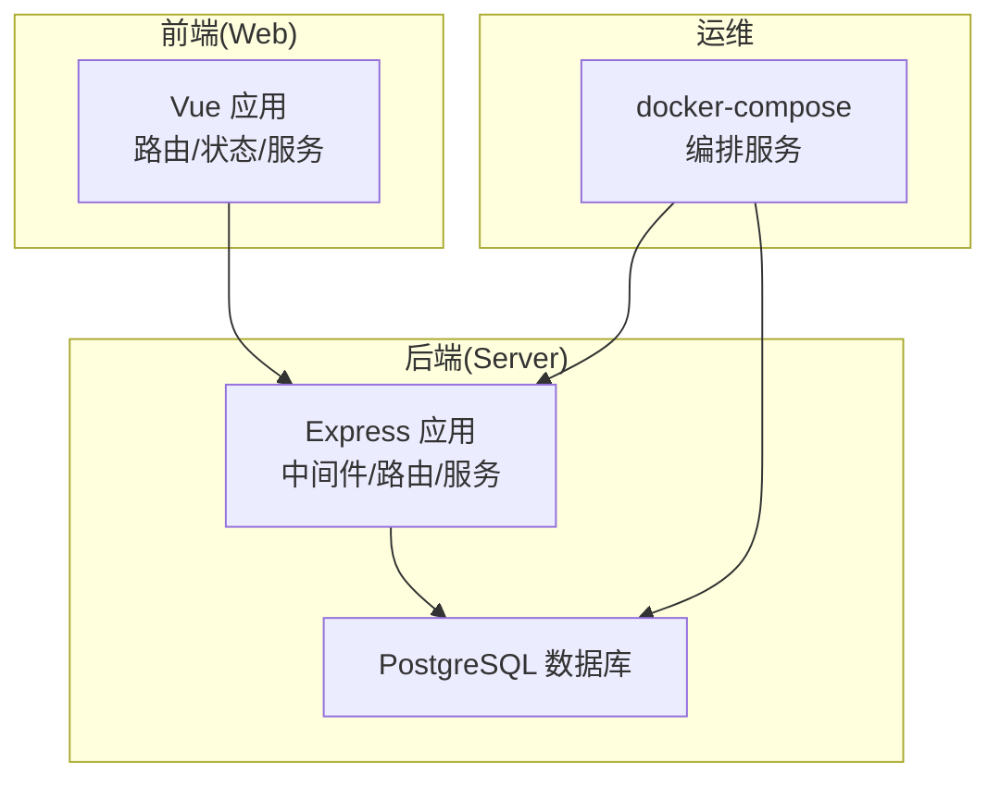
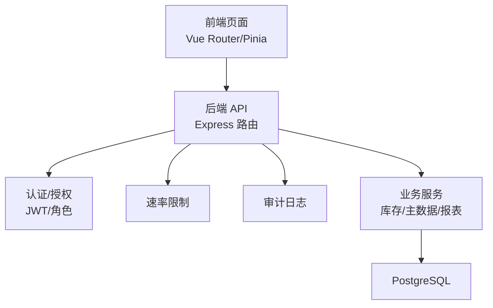
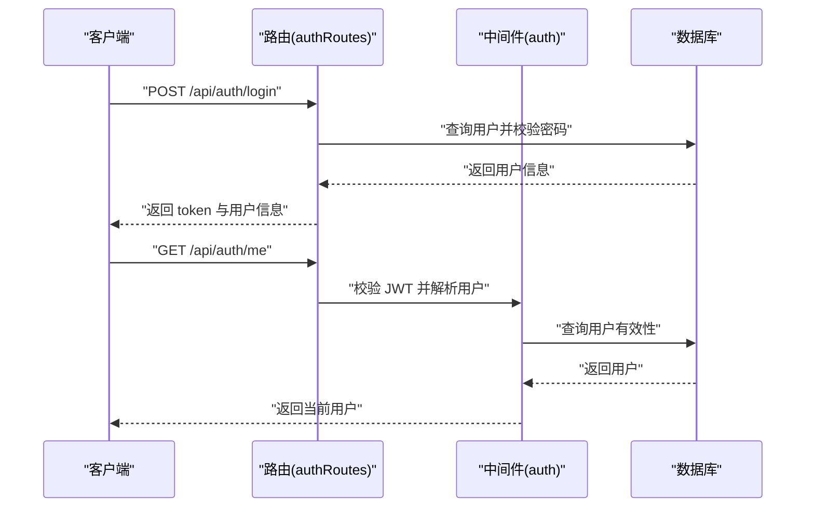
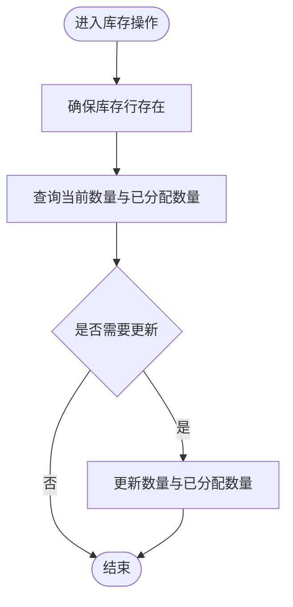
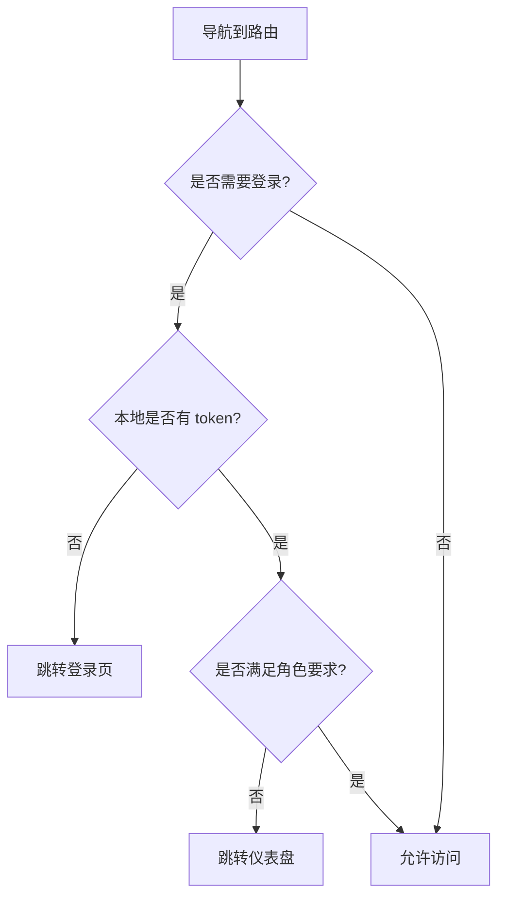
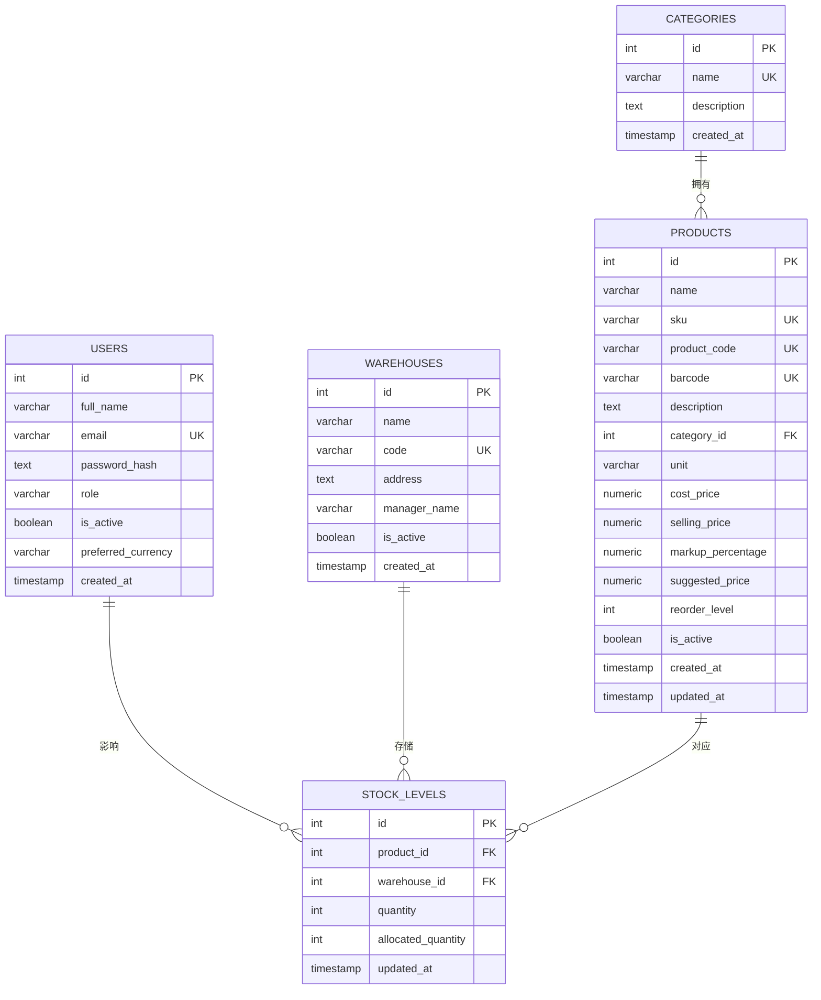
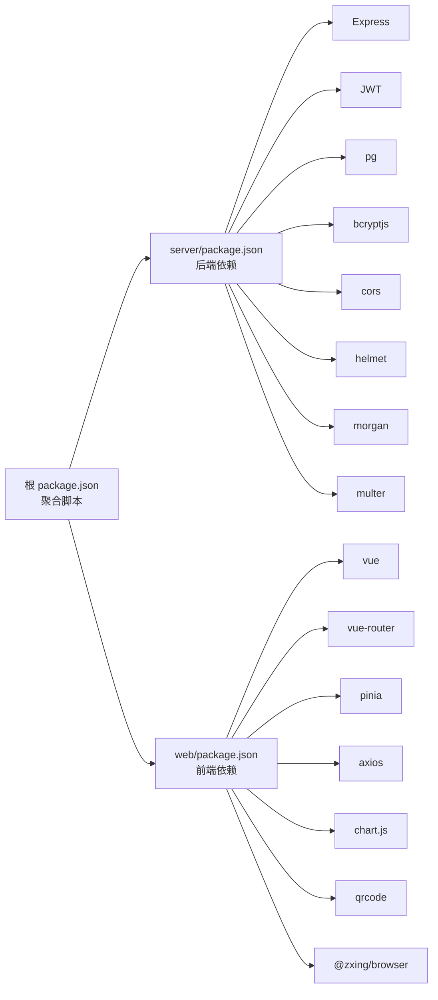

# 开发指南

<cite>
**本文引用的文件**
- [README.md](file://README.md)
- [POSTMAN_BACKEND_GUIDE.md](file://POSTMAN_BACKEND_GUIDE.md)
- [package.json](file://package.json)
- [docker-compose.yml](file://docker-compose.yml)
- [server/src/app.js](file://server/src/app.js)
- [server/src/server.js](file://server/src/server.js)
- [server/src/config/db.js](file://server/src/config/db.js)
- [server/src/middleware/auth.js](file://server/src/middleware/auth.js)
- [server/src/routes/authRoutes.js](file://server/src/routes/authRoutes.js)
- [server/src/utils/inventoryService.js](file://server/src/utils/inventoryService.js)
- [server/test/integration.test.js](file://server/test/integration.test.js)
- [server/database/schema.sql](file://server/database/schema.sql)
- [web/src/main.js](file://web/src/main.js)
- [web/src/services/api.js](file://web/src/services/api.js)
- [web/src/router/index.js](file://web/src/router/index.js)
- [postman/inventory_system_backend.postman_collection.json](file://postman/inventory_system_backend.postman_collection.json)
- [postman/inventory_system_local.postman_environment.json](file://postman/inventory_system_local.postman_environment.json)
</cite>

## 目录
1. [简介](#简介)
2. [项目结构](#项目结构)
3. [核心组件](#核心组件)
4. [架构总览](#架构总览)
5. [详细组件分析](#详细组件分析)
6. [依赖关系分析](#依赖关系分析)
7. [性能考虑](#性能考虑)
8. [故障排查指南](#故障排查指南)
9. [结论](#结论)
10. [附录](#附录)

## 简介
本开发指南面向库存管理系统的开发与协作，覆盖代码规范、命名约定、最佳实践、开发环境配置与调试、Git 工作流与分支策略、代码评审标准、Postman API 测试集合使用、新功能开发流程、常见问题与性能优化建议，以及团队协作工具与知识分享机制。目标是帮助团队在统一规范下高效交付高质量功能。

## 项目结构
项目采用前后端分离架构：
- 后端：基于 Node.js + Express 的 API 服务，使用 PostgreSQL 存储，提供认证、主数据、库存、报表、审计日志、库存盘点等模块。
- 前端：基于 Vue 3 + Pinia + Vue Router 的仪表盘应用，通过 Axios 统一拦截器调用后端 API。
- 测试：集成测试使用 Node 内置测试框架与 supertest，支持数据库测试开关。
- 运维：提供 docker-compose 编排，一键启动数据库、API 与前端静态资源服务。

图表来源
- [server/src/app.js:1-67](file://server/src/app.js#L1-L67)
- [server/src/server.js:1-28](file://server/src/server.js#L1-L28)
- [docker-compose.yml:1-57](file://docker-compose.yml#L1-L57)

章节来源
- [README.md:22-29](file://README.md#L22-L29)
- [package.json:6-12](file://package.json#L6-L12)
- [docker-compose.yml:1-57](file://docker-compose.yml#L1-L57)

## 核心组件
- 应用入口与路由
  - 后端应用入口集中注册中间件、路由与全局错误处理，提供健康检查端点。
  - 前端应用入口统一挂载状态管理与路由。
- 中间件与安全
  - 安全头、跨域、日志、响应包装、审计日志、速率限制、JWT 认证与角色授权。
- 数据库连接
  - 使用连接池，按连接串与环境自动判断是否启用 SSL，支持超时配置。
- 业务工具
  - 库存服务封装通用的库存行确保、查询与更新逻辑，便于事务一致性。
- 测试
  - 集成测试覆盖供应商与产品关联、成本价变更与通知等场景，支持数据库测试开关。

章节来源
- [server/src/app.js:26-67](file://server/src/app.js#L26-L67)
- [web/src/main.js:1-14](file://web/src/main.js#L1-L14)
- [server/src/config/db.js:13-25](file://server/src/config/db.js#L13-L25)
- [server/src/utils/inventoryService.js:1-45](file://server/src/utils/inventoryService.js#L1-L45)
- [server/test/integration.test.js:1-162](file://server/test/integration.test.js#L1-L162)

## 架构总览
系统采用分层架构：
- 表现层：Vue 前端负责页面与交互；Nginx 提供静态资源服务（容器化部署）。
- 应用层：Express 路由与控制器处理请求，中间件完成鉴权、限流、审计与响应包装。
- 服务层：业务服务复用工具类（如库存服务），保证一致性与可测试性。
- 数据层：PostgreSQL 存储用户、主数据、库存、订单、同步日志等实体。

图表来源
- [server/src/app.js:28-56](file://server/src/app.js#L28-L56)
- [server/src/middleware/auth.js:1-46](file://server/src/middleware/auth.js#L1-L46)
- [server/src/utils/inventoryService.js:1-45](file://server/src/utils/inventoryService.js#L1-L45)
- [server/database/schema.sql:1-200](file://server/database/schema.sql#L1-L200)

## 详细组件分析

### 认证与授权组件
- 功能要点
  - 登录接口：校验邮箱与密码，签发 JWT；失败进行速率限制。
  - 用户信息：刷新登录态时恢复当前用户信息。
  - 角色授权：基于角色的访问控制中间件，保护受控路由。
- 错误处理
  - 缺少令牌、令牌无效或过期、用户不存在或非激活状态均返回明确错误码与消息。
- 审计
  - 登录成功后记录审计用户上下文，便于后续审计日志追踪。

图表来源
- [server/src/routes/authRoutes.js:17-69](file://server/src/routes/authRoutes.js#L17-L69)
- [server/src/middleware/auth.js:5-29](file://server/src/middleware/auth.js#L5-L29)

章节来源
- [server/src/routes/authRoutes.js:1-72](file://server/src/routes/authRoutes.js#L1-L72)
- [server/src/middleware/auth.js:1-46](file://server/src/middleware/auth.js#L1-L46)

### 库存服务组件
- 功能要点
  - 确保存在库存行：在插入时避免冲突，保证每产品-仓库组合存在库存记录。
  - 查询库存：返回可用数量与已分配数量。
  - 更新库存：原子更新数量与更新时间戳。
- 事务一致性
  - 以上操作在业务事务中调用，避免并发导致的数据不一致。

图表来源
- [server/src/utils/inventoryService.js:2-38](file://server/src/utils/inventoryService.js#L2-L38)

章节来源
- [server/src/utils/inventoryService.js:1-45](file://server/src/utils/inventoryService.js#L1-L45)

### 前端应用与路由
- 应用入口
  - 创建 Vue 实例，挂载 Pinia 与路由，统一初始化。
- 路由守卫
  - 登录态校验、访客模式限制、角色白名单校验，未满足条件跳转至登录或仪表盘。
- API 服务
  - 统一设置基础 URL，自动注入 Authorization 与成本访问令牌，统一封装响应与错误处理。

图表来源
- [web/src/router/index.js:188-206](file://web/src/router/index.js#L188-L206)

章节来源
- [web/src/main.js:1-14](file://web/src/main.js#L1-L14)
- [web/src/router/index.js:1-209](file://web/src/router/index.js#L1-L209)
- [web/src/services/api.js:1-45](file://web/src/services/api.js#L1-L45)

### 数据库模型概览
- 关键表
  - 用户、分类、仓库、产品、产品图片、产品组合项、产品定价规则、库存、市场同步相关表等。
- 设计要点
  - 外键约束保证引用完整性；唯一索引保障关键字段唯一性；默认值与校验约束提升数据质量。
- 初始化
  - 通过 schema.sql 与 seed.sql 初始化结构与基础数据；docker-compose 自动执行。

图表来源
- [server/database/schema.sql:2-133](file://server/database/schema.sql#L2-L133)

章节来源
- [server/database/schema.sql:1-200](file://server/database/schema.sql#L1-L200)

## 依赖关系分析
- 后端依赖
  - Express、CORS、Helmet、Morgan、JWT、Bcrypt、Multer、Morgan、PG 连接池等。
- 前端依赖
  - Vue 3、Vue Router、Pinia、Axios、Chart.js、QRCode、二维码扫描等。
- 测试依赖
  - Node 内置测试框架、supertest、bcrypt。
- 运维依赖
  - docker-compose、Nginx（容器化前端）、PostgreSQL。

图表来源
- [package.json:1-20](file://package.json#L1-L20)
- [server/package.json:15-29](file://server/package.json#L15-L29)
- [web/package.json:12-32](file://web/package.json#L12-L32)

章节来源
- [package.json:1-20](file://package.json#L1-L20)
- [server/package.json:1-31](file://server/package.json#L1-L31)
- [web/package.json:1-34](file://web/package.json#L1-L34)

## 性能考虑
- 数据库连接与超时
  - 使用连接池并根据环境自动选择 SSL；启动阶段对数据库连接增加超时保护，避免长时间阻塞启动。
- 请求体大小与解析
  - 后端 JSON 解析设置合理上限，避免过大请求导致内存压力。
- 前端请求拦截
  - 统一注入令牌与成本访问令牌，减少重复逻辑；响应拦截统一提取 data，降低前端处理复杂度。
- 分页与搜索
  - API 提供分页与搜索参数，避免一次性加载大列表；报表导出支持全量导出选项。
- 速率限制
  - 对登录等敏感接口进行速率限制，降低暴力破解风险并保护后端资源。

章节来源
- [server/src/server.js:6-25](file://server/src/server.js#L6-L25)
- [server/src/config/db.js:15-19](file://server/src/config/db.js#L15-L19)
- [server/src/app.js:31-32](file://server/src/app.js#L31-L32)
- [web/src/services/api.js:8-24](file://web/src/services/api.js#L8-L24)

## 故障排查指南
- 启动顺序与连通性
  - 确认数据库已就绪并通过健康检查；后端健康检查端点可用于快速验证；前端访问登录页确认前后端连通。
- 登录与认证
  - 使用测试账户登录，若失败检查 JWT 密钥、数据库连接与用户状态；登录成功后检查前端是否正确保存 token。
- API 调试
  - 使用 Postman 集合与环境变量快速验证认证、成本解锁、商品与库存接口；关注响应中的 success 字段与错误消息。
- 集成测试
  - 通过集成测试验证供应商与产品关联、成本价变更与通知等流程；注意数据库测试开关与清理逻辑。
- 容器化部署
  - 使用 docker-compose 启动，查看服务日志定位问题；必要时重置数据库卷后重建。

章节来源
- [README.md:66-105](file://README.md#L66-L105)
- [POSTMAN_BACKEND_GUIDE.md:1-302](file://POSTMAN_BACKEND_GUIDE.md#L1-L302)
- [server/test/integration.test.js:38-160](file://server/test/integration.test.js#L38-L160)

## 结论
本指南提供了从环境搭建、代码规范、中间件与路由设计、数据库模型、前端路由与拦截器、测试与运维到故障排查的完整开发路径。建议团队在日常开发中严格遵循本文档的规范与流程，持续完善测试与文档，确保系统稳定演进与知识沉淀。

## 附录

### 开发环境配置与调试
- 本地开发
  - 创建数据库并执行 schema 与 seed；启动后端与前端；或使用根脚本同时启动。
  - 健康检查：后端健康端点；前端登录页提示后端正常即连通。
- Docker 本地部署
  - 使用 docker-compose 启动数据库、API 与前端；访问前端与后端健康端点验证。
- 环境变量
  - 数据库连接串、JWT 密钥、第三方平台同步端点与令牌等需在环境变量中配置。

章节来源
- [README.md:31-54](file://README.md#L31-L54)
- [README.md:73-105](file://README.md#L73-L105)
- [docker-compose.yml:22-53](file://docker-compose.yml#L22-L53)

### Git 工作流、分支策略与代码评审
- 分支策略
  - 主分支：保护分支，仅允许通过评审合并。
  - 开发分支：feature/* 用于新功能开发，release/* 用于发布准备，hotfix/* 用于紧急修复。
- 提交规范
  - 类型前缀：feat、fix、docs、style、refactor、test、chore；配合简要描述与关联 Issue。
- 代码评审
  - 至少一名 reviewer 通过；关注安全性（认证/授权/速率限制）、健壮性（错误处理/超时）、可维护性（命名/注释/拆分）与测试覆盖。
- 合并与发布
  - 通过 CI/CD 自动化构建与部署；发布前执行集成测试与健康检查。

[本节为通用实践建议，无需特定文件引用]

### Postman API 测试集合与用例管理
- 集合与环境
  - 使用提供的集合与本地环境，预设基础 URL、token、成本访问令牌等变量。
- 快速测试流程
  - 登录获取 token；解锁成本访问；验证商品与库存接口；执行增删改查与报表导出。
- 变更与回归
  - 新增接口后补充用例；接口变更时同步更新集合与断言。

章节来源
- [POSTMAN_BACKEND_GUIDE.md:1-302](file://POSTMAN_BACKEND_GUIDE.md#L1-L302)
- [postman/inventory_system_backend.postman_collection.json](file://postman/inventory_system_backend.postman_collection.json)
- [postman/inventory_system_local.postman_environment.json](file://postman/inventory_system_local.postman_environment.json)

### 新功能开发流程（从需求到测试）
- 需求分析
  - 明确业务目标、用户角色、边界与约束；评估对现有模块的影响。
- 技术设计
  - 设计数据模型变更（如有）、新增路由与控制器、中间件与工具类；编写单元/集成测试用例。
- 实现
  - 遵循命名约定与代码规范；优先保证安全与错误处理；保持小步提交。
- 测试验证
  - 单元测试 + 集成测试；使用 Postman 验证端到端流程；关注性能与兼容性。
- 文档与评审
  - 更新 API 文档与数据库迁移说明；通过代码评审；知识分享与回顾。

[本节为通用流程建议，无需特定文件引用]

### 团队协作工具、文档维护与知识分享
- 协作工具
  - 版本控制（Git）、任务看板（Issue/Project）、即时沟通与代码评审平台。
- 文档维护
  - API 文档、架构图、数据库字典、测试用例与故障排查手册；随代码同步更新。
- 知识分享
  - 定期技术分享、评审总结、新人引导与最佳实践沉淀。

[本节为通用协作建议，无需特定文件引用]