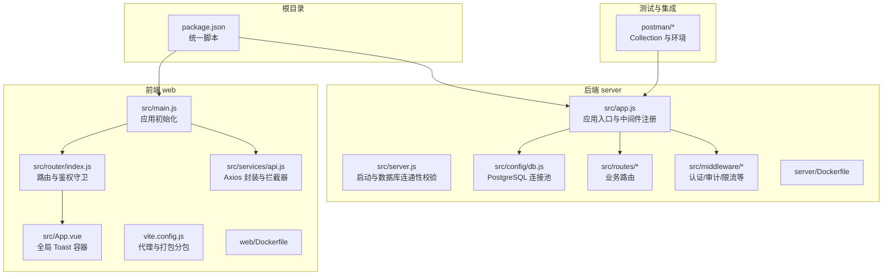
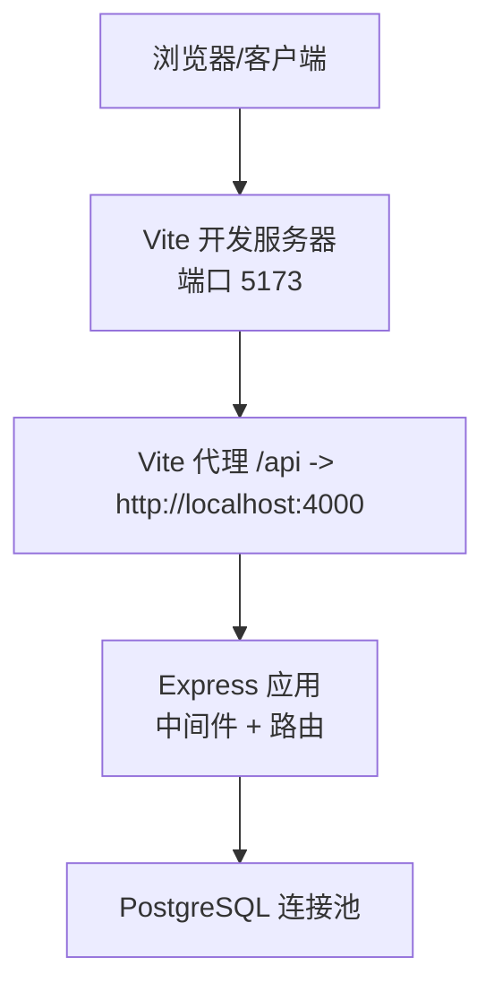
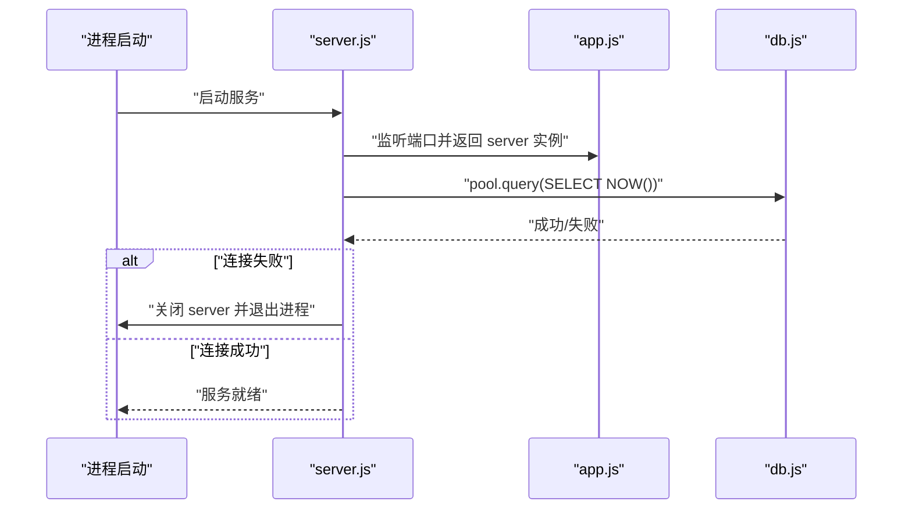
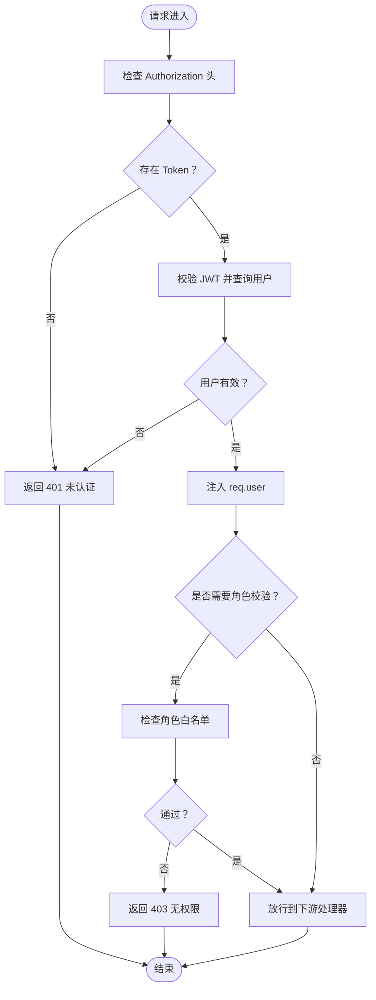
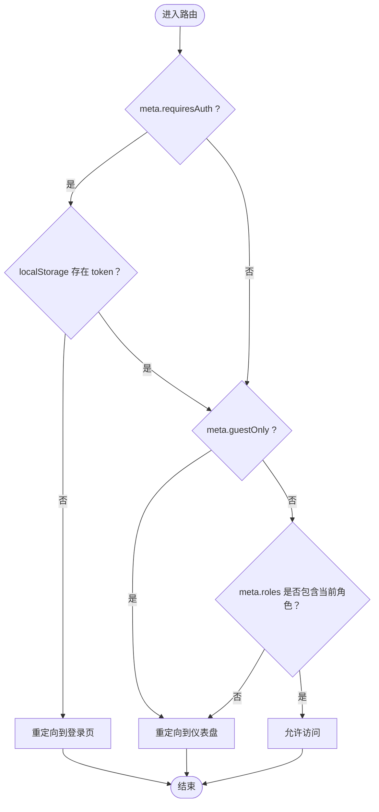
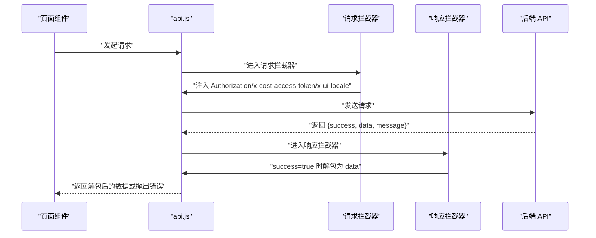
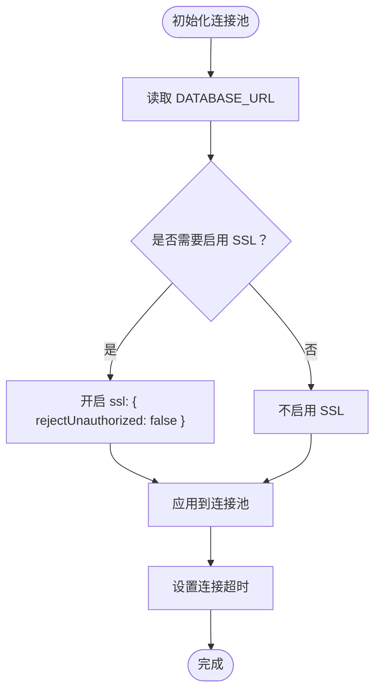
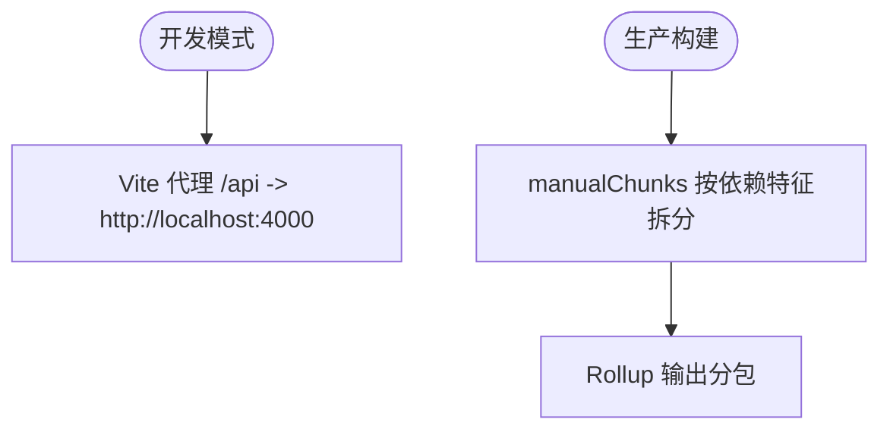
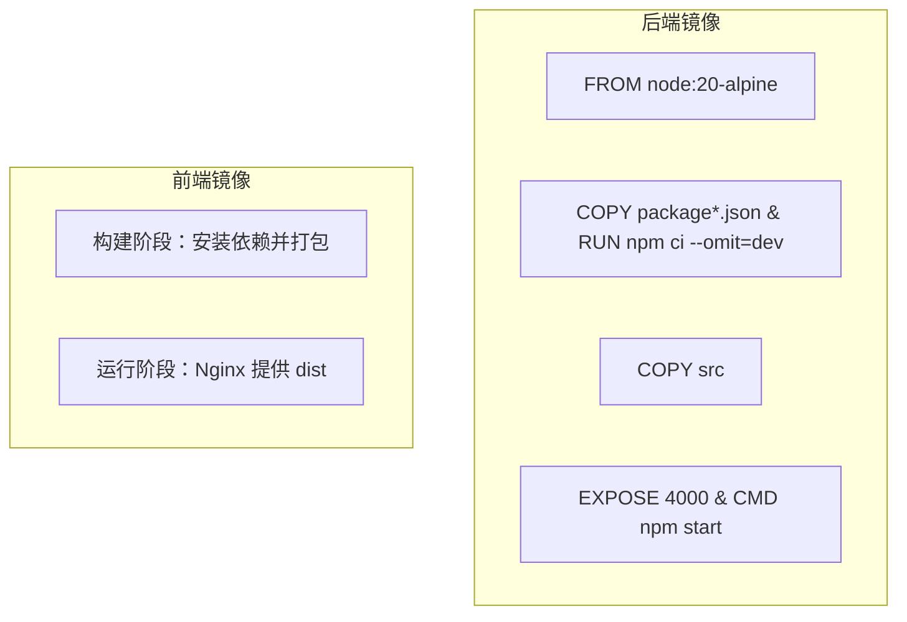
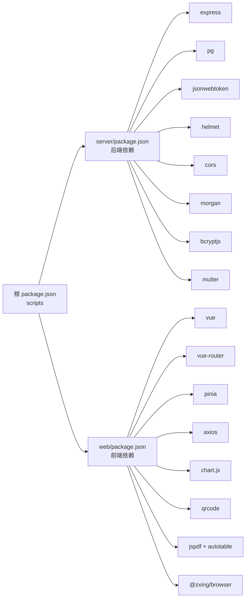

# 开发指南

<cite>
**本文引用的文件**
- [README.md](file://README.md)
- [package.json](file://package.json)
- [server/package.json](file://server/package.json)
- [web/package.json](file://web/package.json)
- [server/src/app.js](file://server/src/app.js)
- [server/src/server.js](file://server/src/server.js)
- [server/src/config/db.js](file://server/src/config/db.js)
- [server/src/middleware/auth.js](file://server/src/middleware/auth.js)
- [server/src/routes/authRoutes.js](file://server/src/routes/authRoutes.js)
- [web/src/main.js](file://web/src/main.js)
- [web/src/App.vue](file://web/src/App.vue)
- [web/src/router/index.js](file://web/src/router/index.js)
- [web/src/services/api.js](file://web/src/services/api.js)
- [web/vite.config.js](file://web/vite.config.js)
- [server/Dockerfile](file://server/Dockerfile)
- [web/Dockerfile](file://web/Dockerfile)
- [postman/inventory_system_backend.postman_collection.json](file://postman/inventory_system_backend.postman_collection.json)
- [POSTMAN_BACKEND_GUIDE.md](file://POSTMAN_BACKEND_GUIDE.md)
</cite>

## 目录
1. [简介](#简介)
2. [项目结构](#项目结构)
3. [核心组件](#核心组件)
4. [架构总览](#架构总览)
5. [详细组件分析](#详细组件分析)
6. [依赖关系分析](#依赖关系分析)
7. [性能考虑](#性能考虑)
8. [故障排除指南](#故障排除指南)
9. [结论](#结论)
10. [附录](#附录)

## 简介
本开发指南面向参与库存管理系统的开发者，提供从代码规范、开发流程、架构设计、调试与工具配置、代码审查与质量标准、文档与注释规范、贡献与协作流程，到本地环境配置与常见问题排查的完整实践指引。系统采用前后端分离架构：前端基于 Vue 3 + Pinia + Vue Router，后端基于 Node.js + Express + PostgreSQL；通过统一的中间件与响应格式，确保安全、可观测与一致的用户体验。

## 项目结构
项目采用“根目录聚合 + 双子应用”的组织方式：
- 根目录提供统一脚本与编排（如并发启动前后端、构建与部署）。
- server 子目录：Express API 服务，包含路由、中间件、数据库连接与服务层。
- web 子目录：Vue 3 前端应用，包含页面、组件、状态管理、路由与工具函数。
- postman：提供后端 API 测试集合与环境变量，便于联调与回归测试。
- docker-compose：提供本地一键启动数据库、后端 API 与前端 Nginx 的编排。

图表来源
- [server/src/app.js:1-65](file://server/src/app.js#L1-L65)
- [server/src/server.js:1-28](file://server/src/server.js#L1-L28)
- [server/src/config/db.js:1-25](file://server/src/config/db.js#L1-L25)
- [web/src/main.js:1-14](file://web/src/main.js#L1-L14)
- [web/src/App.vue:1-9](file://web/src/App.vue#L1-L9)
- [web/src/router/index.js:1-202](file://web/src/router/index.js#L1-L202)
- [web/src/services/api.js:1-45](file://web/src/services/api.js#L1-L45)
- [web/vite.config.js:1-46](file://web/vite.config.js#L1-L46)
- [postman/inventory_system_backend.postman_collection.json:1-585](file://postman/inventory_system_backend.postman_collection.json#L1-L585)

章节来源
- [README.md:22-29](file://README.md#L22-L29)
- [package.json:6-12](file://package.json#L6-L12)

## 核心组件
- 应用入口与中间件
  - 后端在应用入口集中注册安全头、跨域、日志、统一响应与审计中间件，并按前缀挂载各业务路由。
  - 前端在入口统一挂载状态管理与路由，并在根组件挂载全局提示容器。
- 认证与授权
  - 后端通过 JWT 校验与角色授权中间件保护路由；前端通过 Axios 拦截器自动注入认证与成本访问令牌。
- 数据库连接
  - 使用 PostgreSQL 连接池，支持根据连接串与环境自动启用 SSL，以及连接超时配置。
- 路由与导航
  - 前端路由采用按需加载与元信息驱动的鉴权守卫，支持访客模式、登录态校验与角色白名单。
- 构建与代理
  - Vite 提供开发代理至后端 API，生产构建按依赖特征进行手动分包优化。
- Docker 化
  - 分别对后端与前端提供最小镜像构建，后端以只读运行时依赖，前端以 Nginx 托管静态资源。

章节来源
- [server/src/app.js:27-54](file://server/src/app.js#L27-L54)
- [web/src/main.js:7-13](file://web/src/main.js#L7-L13)
- [web/src/App.vue:5-8](file://web/src/App.vue#L5-L8)
- [server/src/config/db.js:13-19](file://server/src/config/db.js#L13-L19)
- [web/src/router/index.js:181-199](file://web/src/router/index.js#L181-L199)
- [web/vite.config.js:8-16](file://web/vite.config.js#L8-L16)
- [server/Dockerfile:1-13](file://server/Dockerfile#L1-L13)
- [web/Dockerfile:1-19](file://web/Dockerfile#L1-L19)

## 架构总览
系统采用典型的前后端分离架构，前端通过 Axios 与后端 API 交互，后端通过中间件处理安全、审计与统一响应，数据库通过连接池提供稳定访问。

图表来源
- [web/vite.config.js:8-16](file://web/vite.config.js#L8-L16)
- [server/src/app.js:27-54](file://server/src/app.js#L27-L54)
- [server/src/config/db.js:13-19](file://server/src/config/db.js#L13-L19)

## 详细组件分析

### 后端应用与启动流程
- 中间件链路：安全头、跨域、JSON 解析、统一响应、日志、审计。
- 路由挂载：按模块前缀挂载，统一健康检查接口。
- 启动校验：启动时对数据库进行连通性校验，失败则优雅退出。

图表来源
- [server/src/server.js:13-25](file://server/src/server.js#L13-L25)
- [server/src/app.js:35-37](file://server/src/app.js#L35-L37)
- [server/src/config/db.js:15-19](file://server/src/config/db.js#L15-L19)

章节来源
- [server/src/app.js:27-62](file://server/src/app.js#L27-L62)
- [server/src/server.js:6-25](file://server/src/server.js#L6-L25)

### 认证与授权中间件
- 认证：从 Authorization 头解析 Bearer Token，验证通过后将用户信息注入请求对象。
- 授权：基于角色白名单进行访问控制。
- 登录路由：带登录频率限制，返回 JWT 与用户信息。

图表来源
- [server/src/middleware/auth.js:5-29](file://server/src/middleware/auth.js#L5-L29)
- [server/src/middleware/auth.js:32-40](file://server/src/middleware/auth.js#L32-L40)
- [server/src/routes/authRoutes.js:17-64](file://server/src/routes/authRoutes.js#L17-L64)

章节来源
- [server/src/middleware/auth.js:1-46](file://server/src/middleware/auth.js#L1-L46)
- [server/src/routes/authRoutes.js:1-72](file://server/src/routes/authRoutes.js#L1-L72)

### 前端路由与鉴权守卫
- 路由元信息：requiresAuth、guestOnly、roles 等控制访问。
- 守卫逻辑：优先判断登录态，再校验角色白名单，最后放行。
- 页面级懒加载：提升首屏性能。

图表来源
- [web/src/router/index.js:181-199](file://web/src/router/index.js#L181-L199)

章节来源
- [web/src/router/index.js:1-202](file://web/src/router/index.js#L1-L202)

### 前端 API 封装与拦截器
- 自动注入：请求拦截器自动附加 Authorization 与成本访问令牌、语言头。
- 统一解包：响应拦截器将 success:true 的响应体解包为 data。
- 错误透传：将后端返回的 message 透传到前端错误对象，便于 UI 展示。

图表来源
- [web/src/services/api.js:8-42](file://web/src/services/api.js#L8-L42)

章节来源
- [web/src/services/api.js:1-45](file://web/src/services/api.js#L1-L45)

### 数据库连接与 SSL 策略
- 连接串来源：DATABASE_URL 环境变量。
- SSL 判定：根据连接串关键字、PGSSLMODE 环境、NODE_ENV 等综合判断。
- 超时配置：支持连接超时毫秒数自定义。

图表来源
- [server/src/config/db.js:3-11](file://server/src/config/db.js#L3-L11)
- [server/src/config/db.js:15-19](file://server/src/config/db.js#L15-L19)

章节来源
- [server/src/config/db.js:1-25](file://server/src/config/db.js#L1-L25)

### 构建与分包策略
- 代理：开发服务器将 /api 代理到后端服务，避免跨域。
- 分包：针对图表、PDF、扫码与核心框架依赖进行手动分包，优化缓存与加载性能。

图表来源
- [web/vite.config.js:8-16](file://web/vite.config.js#L8-L16)
- [web/vite.config.js:20-42](file://web/vite.config.js#L20-L42)

章节来源
- [web/vite.config.js:1-46](file://web/vite.config.js#L1-L46)

### Docker 化部署
- 后端镜像：基于 Node 20 Alpine，仅安装运行时依赖，拷贝源码与 CMD 启动。
- 前端镜像：双阶段构建，第一阶段安装依赖并打包，第二阶段使用 Nginx 提供静态资源。

图表来源
- [server/Dockerfile:1-13](file://server/Dockerfile#L1-L13)
- [web/Dockerfile:1-19](file://web/Dockerfile#L1-L19)

章节来源
- [server/Dockerfile:1-13](file://server/Dockerfile#L1-L13)
- [web/Dockerfile:1-19](file://web/Dockerfile#L1-L19)

## 依赖关系分析
- 根脚本：通过 concurrently 并发启动前后端，简化本地开发体验。
- 前端依赖：Vue 3、Pinia、Vue Router、Axios、Chart.js、QRCode、JSZip 等。
- 后端依赖：Express、pg、helmet、cors、morgan、bcryptjs、jsonwebtoken、multer 等。
- 开发依赖：Vite、TailwindCSS、Wrangler、Cloudflare 插件等。

图表来源
- [package.json:6-12](file://package.json#L6-L12)
- [server/package.json:15-29](file://server/package.json#L15-L29)
- [web/package.json:12-32](file://web/package.json#L12-L32)

章节来源
- [package.json:1-20](file://package.json#L1-L20)
- [server/package.json:1-31](file://server/package.json#L1-L31)
- [web/package.json:1-34](file://web/package.json#L1-L34)

## 性能考虑
- 前端分包：通过 manualChunks 将大体积依赖拆分为独立 chunk，提升缓存命中率与并行加载效率。
- 请求拦截：统一注入头部减少重复代码，降低网络往返开销。
- 数据库连接：合理设置连接超时与 SSL 策略，避免长连接阻塞。
- 代理与热更新：Vite 代理与 HMR 在开发阶段显著提升迭代速度。

章节来源
- [web/vite.config.js:17-45](file://web/vite.config.js#L17-L45)
- [server/src/config/db.js:18-19](file://server/src/config/db.js#L18-L19)

## 故障排除指南
- 启动顺序与连通性
  - 确认数据库已启动并执行 schema 与 seed。
  - 后端健康检查地址：http://localhost:4000/api/health。
  - 前端访问地址：http://localhost:5173/login。
- Docker 本地部署
  - 使用 docker compose 启动后，前端访问 http://localhost:8080，后端健康检查 http://localhost:4000/api/health。
  - 如需重置数据库，执行停止并删除卷后重新启动。
- 认证与权限
  - 登录后需设置 Authorization 头；解锁成本后需设置 x-cost-access-token。
  - 若出现 401/403，请检查 token 是否过期、角色是否匹配。
- API 调试
  - 使用 Postman Collection 与环境变量快速验证登录、成本解锁与主数据/库存/报表等接口。
- 日志与审计
  - 后端默认输出访问日志；审计中间件记录关键操作，便于定位问题。

章节来源
- [README.md:66-105](file://README.md#L66-L105)
- [POSTMAN_BACKEND_GUIDE.md:1-302](file://POSTMAN_BACKEND_GUIDE.md#L1-L302)
- [postman/inventory_system_backend.postman_collection.json:7-77](file://postman/inventory_system_backend.postman_collection.json#L7-L77)

## 结论
本指南提供了从架构理解、模块职责、开发流程到调试与运维的全链路实践建议。遵循本文档的规范与流程，可显著提升开发效率、代码质量与团队协作一致性。

## 附录

### 代码规范与编码标准
- JavaScript/Vue.js
  - 使用语义化命名，组件与页面采用 PascalCase，文件名与导出保持一致。
  - 组件内逻辑尽量保持纯函数式与可测试性，复杂逻辑迁移至工具函数或服务层。
  - 响应拦截器统一解包与错误透传，避免在页面中分散处理。
- Node.js
  - 中间件职责单一，严格区分安全、审计、限流与业务处理。
  - 路由层仅做参数校验与转发，业务逻辑下沉至服务层或工具函数。
  - 数据库连接池参数按环境调整，避免硬编码。

章节来源
- [web/src/services/api.js:26-42](file://web/src/services/api.js#L26-L42)
- [server/src/app.js:27-33](file://server/src/app.js#L27-L33)
- [server/src/config/db.js:15-19](file://server/src/config/db.js#L15-L19)

### 开发流程与 Git 工作流
- 分支策略
  - main：发布分支，受保护。
  - develop：集成分支，合并前需通过 CI 与测试。
  - feature/*：功能开发分支，基于 develop 创建，完成后合并回 develop。
  - hotfix/*：紧急修复分支，基于 main 创建，修复后同时合并回 main 与 develop。
- 提交规范
  - 类型限定：feat、fix、docs、style、refactor、perf、test、chore、revert。
  - 格式：type(scope): subject；subject 首字母小写，不以句号结尾。
- 合并与审查
  - Pull Request 需至少一名 reviewer 通过，CI 通过后方可合并。
  - 合并前确保变更通过单元/集成测试。

[本节为通用流程建议，无需特定文件引用]

### 项目结构与模块化设计原则
- 前端
  - 页面按功能划分，组件复用化，状态集中管理，路由懒加载。
- 后端
  - 按领域划分路由与中间件，统一响应格式，审计与限流中间件可插拔。
- 共享
  - 通过 Axios 封装统一请求与响应处理，避免重复代码。

章节来源
- [web/src/router/index.js:28-173](file://web/src/router/index.js#L28-L173)
- [server/src/app.js:9-24](file://server/src/app.js#L9-L24)
- [web/src/services/api.js:3-5](file://web/src/services/api.js#L3-L5)

### 调试技巧与开发工具配置
- 前端
  - Vite 代理：开发时将 /api 代理到后端，便于联调。
  - 分包策略：针对图表、PDF、扫码与核心框架依赖进行分包，优化加载。
- 后端
  - nodemon：开发时自动重启，提升迭代效率。
  - morgan：输出访问日志，便于排查。
- Docker
  - 本地一键启动数据库、后端与前端，便于隔离环境验证。

章节来源
- [web/vite.config.js:8-16](file://web/vite.config.js#L8-L16)
- [web/vite.config.js:20-42](file://web/vite.config.js#L20-L42)
- [server/package.json:7-9](file://server/package.json#L7-L9)
- [README.md:73-105](file://README.md#L73-L105)

### 代码审查流程与质量标准
- 审查清单
  - 功能正确性、边界条件与异常处理。
  - 安全性：认证、授权、输入校验、敏感信息脱敏。
  - 性能：分包、缓存、数据库查询与索引。
  - 可维护性：命名、注释、模块化与测试覆盖。
- 质量门禁
  - 通过 Lint 与测试，确保提交质量。

[本节为通用流程建议，无需特定文件引用]

### 文档编写规范与注释标准
- README 与指南
  - 使用清晰标题层级，步骤编号明确，截图与链接结合。
- 代码注释
  - 函数/方法：说明用途、入参、返回值与异常。
  - 关键逻辑：简述背景与约束，必要时给出参考链接。
- API 文档
  - 与 Postman 集合保持同步，确保示例与实际接口一致。

章节来源
- [POSTMAN_BACKEND_GUIDE.md:1-302](file://POSTMAN_BACKEND_GUIDE.md#L1-L302)
- [postman/inventory_system_backend.postman_collection.json:1-585](file://postman/inventory_system_backend.postman_collection.json#L1-L585)

### 贡献指南与开源协作流程
- 提交与 PR
  - 基于 feature/* 分支提交，PR 描述清晰目标与变更点。
- 讨论与评审
  - 评审过程中及时响应反馈，必要时补充测试与文档。
- 版本与发布
  - 通过标签与变更日志管理版本，遵循语义化版本。

[本节为通用流程建议，无需特定文件引用]

### 本地开发环境配置与调试方法
- 环境准备
  - 创建 PostgreSQL 数据库并执行 schema 与 seed。
  - 复制 .env 示例并配置数据库连接串与密钥。
- 启动方式
  - 根目录脚本：npm run dev 同时启动前后端。
  - 单独启动：分别在 server 与 web 目录执行对应脚本。
- 调试要点
  - 健康检查：确认后端可用后再访问前端。
  - 认证：登录后在前端存储 token，成本解锁后存储成本访问令牌。
  - 审计：关注审计日志与中间件行为，定位异常操作。

章节来源
- [README.md:33-53](file://README.md#L33-L53)
- [README.md:66-71](file://README.md#L66-L71)

### 常见开发问题与解决方案
- 登录失败
  - 检查数据库是否已执行 schema 与 seed。
  - 确认后端服务健康与前端代理配置。
- 成本价格不可见
  - 需要先进行成本解锁，获取成本访问令牌并设置到请求头。
- 权限不足
  - 确认用户角色与路由 meta.roles 的匹配关系。
- Docker 启动异常
  - 查看容器日志，确认端口占用与卷挂载。

章节来源
- [README.md:66-105](file://README.md#L66-L105)
- [POSTMAN_BACKEND_GUIDE.md:6-11](file://POSTMAN_BACKEND_GUIDE.md#L6-L11)

### Postman API 测试集合使用方法
- 环境变量
  - base_url、token、cost_access_token、product_id、warehouse_id、stock_count_id 等。
- 快速流程
  - 登录获取 token → 成本解锁获取成本访问令牌 → 列表/详情/增删改查验证。
- 建议
  - 使用预请求脚本生成时间戳变量，配合集合中的变量自动注入。

章节来源
- [POSTMAN_BACKEND_GUIDE.md:12-25](file://POSTMAN_BACKEND_GUIDE.md#L12-L25)
- [postman/inventory_system_backend.postman_collection.json:7-77](file://postman/inventory_system_backend.postman_collection.json#L7-L77)
- [postman/inventory_system_backend.postman_collection.json:570-582](file://postman/inventory_system_backend.postman_collection.json#L570-L582)