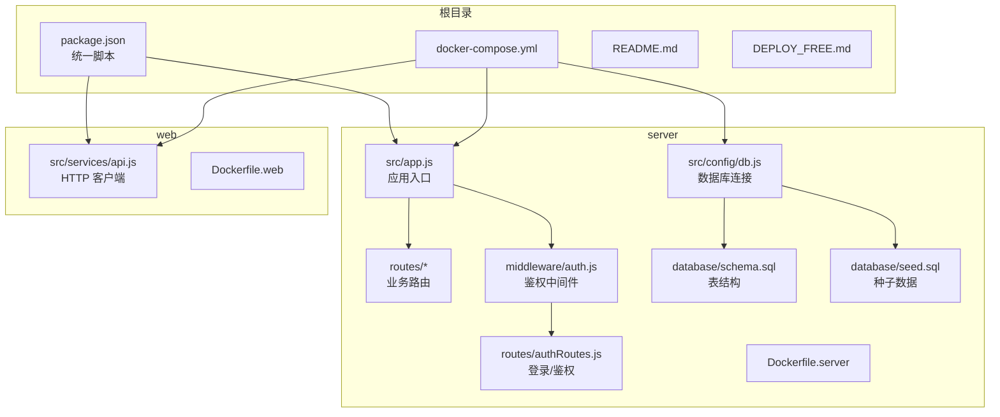
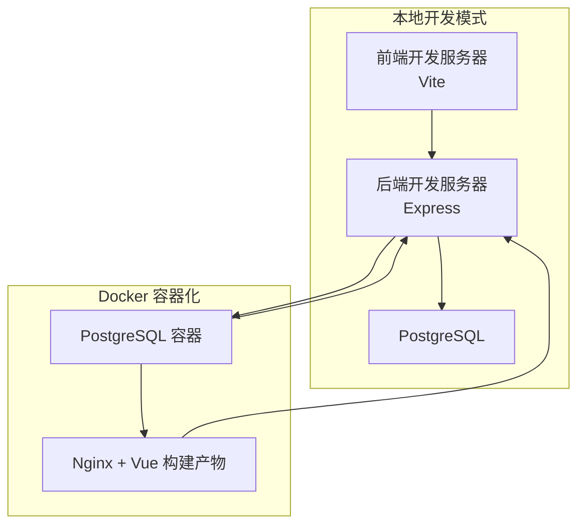
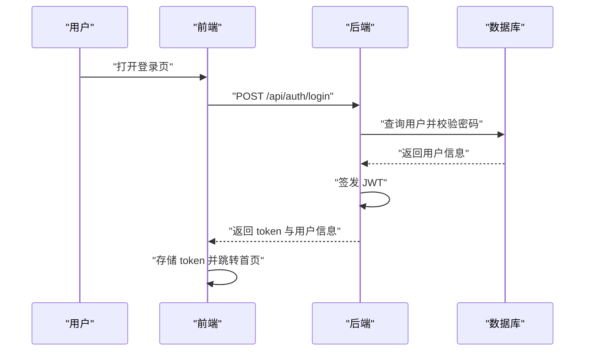
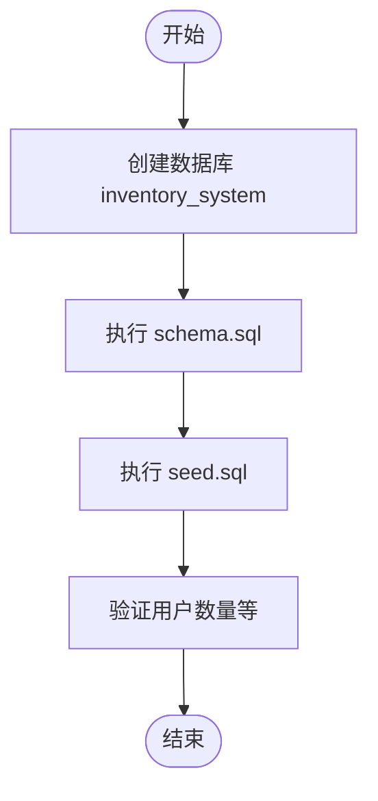
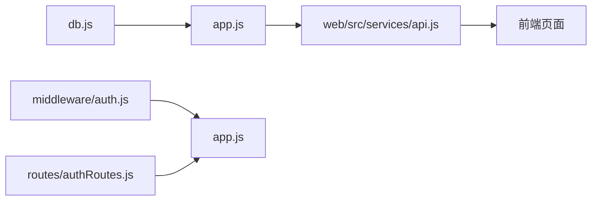

# 快速开始

<cite>
**本文引用的文件**
- [README.md](file://README.md)
- [package.json](file://package.json)
- [docker-compose.yml](file://docker-compose.yml)
- [server/src/app.js](file://server/src/app.js)
- [server/src/config/db.js](file://server/src/config/db.js)
- [server/src/routes/authRoutes.js](file://server/src/routes/authRoutes.js)
- [server/src/middleware/auth.js](file://server/src/middleware/auth.js)
- [server/database/schema.sql](file://server/database/schema.sql)
- [server/database/seed.sql](file://server/database/seed.sql)
- [server/Dockerfile](file://server/Dockerfile)
- [web/Dockerfile](file://web/Dockerfile)
- [web/src/services/api.js](file://web/src/services/api.js)
- [DEPLOY_FREE.md](file://DEPLOY_FREE.md)
</cite>

## 目录
1. [简介](#简介)
2. [项目结构](#项目结构)
3. [核心组件](#核心组件)
4. [架构总览](#架构总览)
5. [详细组件分析](#详细组件分析)
6. [依赖关系分析](#依赖关系分析)
7. [性能考虑](#性能考虑)
8. [故障排除指南](#故障排除指南)
9. [结论](#结论)
10. [附录](#附录)

## 简介
本指南面向首次接触库存管理系统的用户，帮助你在最短时间内完成环境准备、数据库初始化、前后端服务启动与基础验证。系统采用全栈技术栈：后端为 Node.js + Express + PostgreSQL；前端为 Vue 3 + Tailwind CSS。支持本地开发、Docker 容器化部署以及免费云平台部署。

## 项目结构
项目分为三个主要部分：
- server：Express API 服务与数据库脚本
- web：Vue 3 前端应用
- 根目录：统一脚本、Compose 编排与部署文档

图表来源
- [package.json:1-20](file://package.json#L1-L20)
- [docker-compose.yml:1-57](file://docker-compose.yml#L1-L57)
- [server/src/app.js:1-65](file://server/src/app.js#L1-L65)
- [server/src/config/db.js:1-25](file://server/src/config/db.js#L1-L25)
- [server/src/routes/authRoutes.js:1-72](file://server/src/routes/authRoutes.js#L1-L72)
- [server/src/middleware/auth.js:1-46](file://server/src/middleware/auth.js#L1-L46)
- [server/database/schema.sql:1-420](file://server/database/schema.sql#L1-L420)
- [server/database/seed.sql:1-114](file://server/database/seed.sql#L1-L114)
- [server/Dockerfile:1-13](file://server/Dockerfile#L1-L13)
- [web/Dockerfile:1-19](file://web/Dockerfile#L1-L19)
- [web/src/services/api.js:1-45](file://web/src/services/api.js#L1-L45)

章节来源
- [README.md:22-29](file://README.md#L22-L29)
- [package.json:6-12](file://package.json#L6-L12)

## 核心组件
- 应用入口与路由注册：后端通过集中式入口注册所有业务路由，并提供健康检查端点。
- 数据库连接：基于连接字符串动态判断是否启用 SSL，支持超时配置。
- 鉴权与权限：基于 JWT 的登录流程与角色授权中间件。
- 前端 API 客户端：统一封装请求拦截器，自动注入认证与国际化头。
- 数据初始化：通过 SQL 脚本创建表结构与初始数据。

章节来源
- [server/src/app.js:25-54](file://server/src/app.js#L25-L54)
- [server/src/config/db.js:13-24](file://server/src/config/db.js#L13-L24)
- [server/src/routes/authRoutes.js:17-64](file://server/src/routes/authRoutes.js#L17-L64)
- [server/src/middleware/auth.js:5-29](file://server/src/middleware/auth.js#L5-L29)
- [web/src/services/api.js:8-24](file://web/src/services/api.js#L8-L24)
- [server/database/schema.sql:1-420](file://server/database/schema.sql#L1-L420)
- [server/database/seed.sql:1-114](file://server/database/seed.sql#L1-L114)

## 架构总览
下图展示本地开发与 Docker 三种运行模式下的交互关系：

图表来源
- [docker-compose.yml:1-57](file://docker-compose.yml#L1-L57)
- [server/src/app.js:35-37](file://server/src/app.js#L35-L37)
- [web/Dockerfile:1-19](file://web/Dockerfile#L1-L19)
- [server/Dockerfile:1-13](file://server/Dockerfile#L1-L13)

## 详细组件分析

### 本地开发环境准备
- 数据库准备
  - 创建数据库：使用任意 PostgreSQL 客户端创建名为 inventory_system 的数据库。
  - 执行脚本：依次运行 schema.sql 与 seed.sql 完成表结构与初始数据初始化。
- 环境变量
  - 复制示例环境文件至 server/.env 并按需调整 DATABASE_URL。
  - 设置 JWT_SECRET（建议使用强随机字符串）。
- 启动服务
  - 使用统一脚本同时启动前后端：npm run dev
  - 或分别进入 server 与 web 目录执行各自开发脚本。

预期输出
- 前端访问：http://localhost:5173/login
- 后端健康检查：http://localhost:4000/api/health
- 登录页提示“后端服务正常，可直接登录”表示前后端连通。

章节来源
- [README.md:31-54](file://README.md#L31-L54)
- [README.md:66-72](file://README.md#L66-L72)
- [package.json:6-12](file://package.json#L6-L12)

### Docker 容器化部署（本地）
- 启动
  - docker compose up -d --build
- 访问
  - 前端：http://localhost:8080
  - 后端健康检查：http://localhost:4000/api/health
- 停止与重置
  - docker compose down
  - docker compose down -v && docker compose up -d --build

说明
- Compose 中已自动挂载 schema.sql 与 seed.sql 至初始化目录，容器启动时自动执行。
- 数据卷持久化：inventory_db_data

章节来源
- [README.md:73-105](file://README.md#L73-L105)
- [docker-compose.yml:1-57](file://docker-compose.yml#L1-L57)

### 生产环境部署（免费方案）
- 数据库：Neon Postgres（免费版）
- API：Render Web Service（免费版）
- 前端：Cloudflare Pages（免费版）

步骤概览
- 在 Neon 创建项目并复制 DATABASE_URL（务必保留私密性）。
- 在 Render 创建 Web Service，设置根目录为 server，配置环境变量（PORT、DATABASE_URL、JWT_SECRET、NODE_ENV 等），构建与启动命令按文档填写。
- 在 Cloudflare Pages 创建 Pages 项目，根目录为 web，设置 VITE_API_URL 指向 Render API，构建命令与输出目录按文档填写。
- 首次部署后，在本地或 CI 中对数据库执行 schema.sql 与 seed.sql 初始化。
- 部署完成后，使用测试账户登录并验证功能。

章节来源
- [DEPLOY_FREE.md:1-293](file://DEPLOY_FREE.md#L1-L293)

### 登录与鉴权流程

图表来源
- [server/src/routes/authRoutes.js:17-64](file://server/src/routes/authRoutes.js#L17-L64)
- [server/src/middleware/auth.js:5-29](file://server/src/middleware/auth.js#L5-L29)
- [web/src/services/api.js:8-24](file://web/src/services/api.js#L8-L24)

### 数据库初始化流程

图表来源
- [server/database/schema.sql:1-420](file://server/database/schema.sql#L1-L420)
- [server/database/seed.sql:1-114](file://server/database/seed.sql#L1-L114)

## 依赖关系分析
- 后端依赖
  - 连接池与 SSL：基于连接字符串动态判断 SSL，支持超时参数。
  - 路由注册：集中式入口按模块注册各业务路由。
  - 鉴权中间件：统一校验 JWT 并注入用户信息。
- 前端依赖
  - Axios 封装：自动注入 Authorization 与成本系统访问令牌、语言头。
  - 路由与页面：按功能模块组织页面与路由。

图表来源
- [server/src/config/db.js:13-24](file://server/src/config/db.js#L13-L24)
- [server/src/app.js:25-54](file://server/src/app.js#L25-L54)
- [server/src/middleware/auth.js:5-29](file://server/src/middleware/auth.js#L5-L29)
- [server/src/routes/authRoutes.js:17-64](file://server/src/routes/authRoutes.js#L17-L64)
- [web/src/services/api.js:8-24](file://web/src/services/api.js#L8-L24)

章节来源
- [server/src/config/db.js:13-24](file://server/src/config/db.js#L13-L24)
- [server/src/app.js:25-54](file://server/src/app.js#L25-L54)
- [web/src/services/api.js:8-24](file://web/src/services/api.js#L8-L24)

## 性能考虑
- 数据库连接
  - 连接字符串中可根据需要开启 SSL，生产环境默认启用。
  - 可通过环境变量设置连接超时时间，避免长时间阻塞。
- 前端静态资源
  - Docker 方案使用 Nginx 提供静态资源，减少 Node 服务压力。
- API 限流
  - 登录接口具备速率限制，防止暴力破解。

章节来源
- [server/src/config/db.js:3-11](file://server/src/config/db.js#L3-L11)
- [server/src/config/db.js:18-19](file://server/src/config/db.js#L18-L19)
- [server/src/routes/authRoutes.js:10-14](file://server/src/routes/authRoutes.js#L10-L14)
- [web/Dockerfile:11-19](file://web/Dockerfile#L11-L19)

## 故障排除指南
- 后端无法连接数据库
  - 确认 DATABASE_URL 正确，生产环境或包含 sslmode=require。
  - 检查网络连通与容器健康状态。
- 前后端未连通
  - 先确认后端健康检查 http://localhost:4000/api/health 返回正常。
  - 再确认前端 http://localhost:5173/login 页面提示“后端服务正常，可直接登录”。
- 登录失败
  - 检查 JWT_SECRET 是否一致（变更会导致旧 token 失效）。
  - 确认用户存在且处于激活状态。
- 前端 404 或 500
  - 确认 API 地址与路由正确（VITE_API_URL 指向后端 API）。
  - 在首次部署后执行数据库初始化脚本。
- Docker 重置数据库
  - docker compose down -v 清理数据卷后重新 up。

章节来源
- [README.md:66-72](file://README.md#L66-L72)
- [server/src/config/db.js:3-11](file://server/src/config/db.js#L3-L11)
- [server/src/routes/authRoutes.js:31-39](file://server/src/routes/authRoutes.js#L31-L39)
- [DEPLOY_FREE.md:261-286](file://DEPLOY_FREE.md#L261-L286)
- [README.md:97-105](file://README.md#L97-L105)

## 结论
通过本指南，你可以快速完成从数据库初始化到前后端服务启动的全流程，并掌握 Docker 与免费云平台的部署方法。遇到问题时，可依据故障排除章节逐项排查。建议在首次登录后尽快修改默认测试账户密码以提升安全性。

## 附录

### 测试账户与登录验证
- 管理员：admin@inventory.local / Admin@123
- 仓管：manager@inventory.local / Manager@123
- 员工：staff@inventory.local / Staff@123
- 测试：test@inventory.local / Test@123456

登录验证步骤
- 访问前端登录页：http://localhost:5173/login
- 输入任一测试邮箱与对应密码
- 成功后进入仪表盘，验证菜单可见性与部分功能可用性

章节来源
- [README.md:55-64](file://README.md#L55-L64)