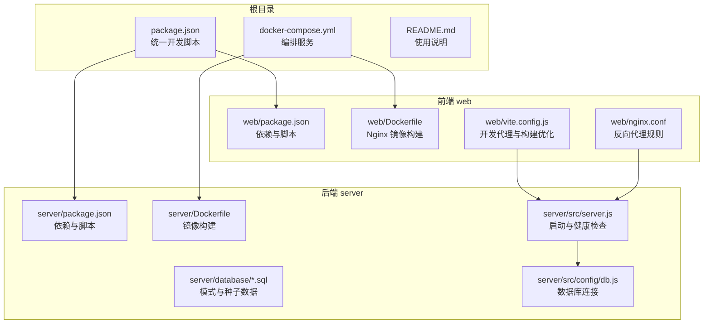
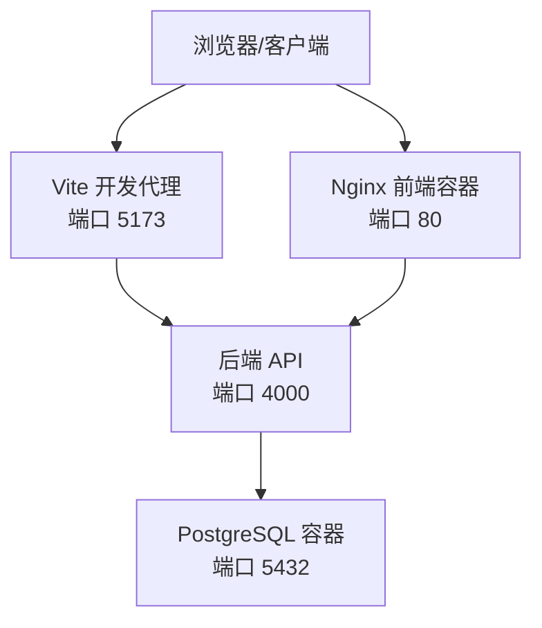
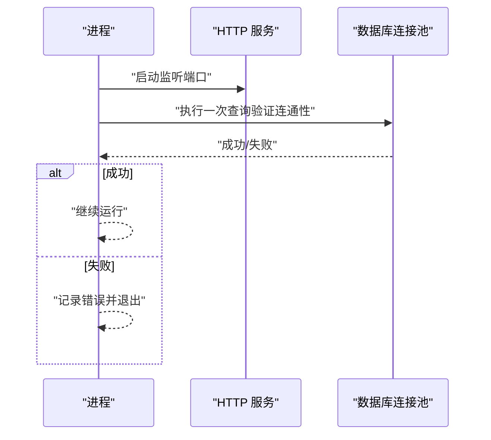
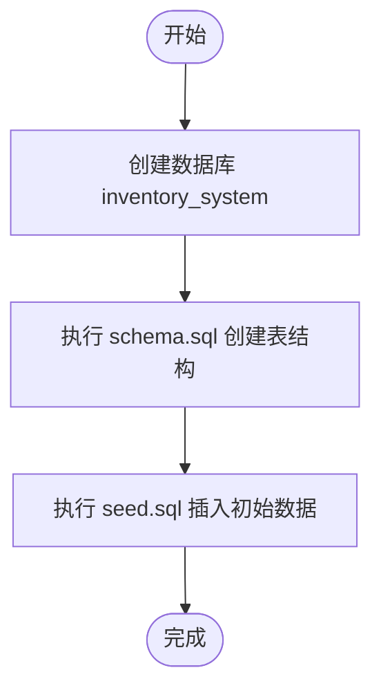
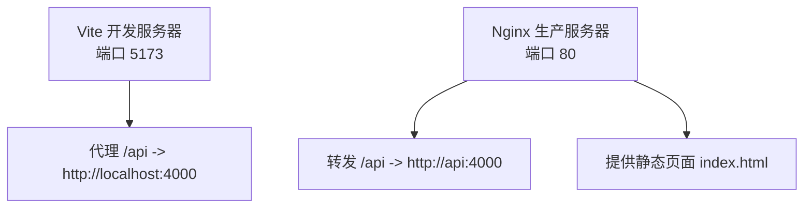
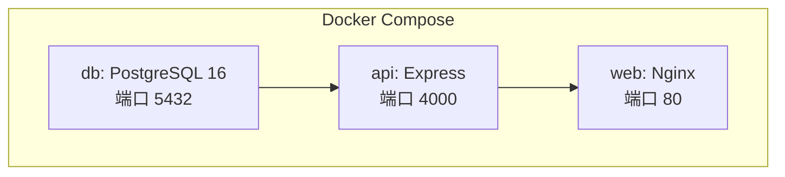

# 快速开始

<cite>
**本文引用的文件**
- [README.md](file://README.md)
- [package.json](file://package.json)
- [docker-compose.yml](file://docker-compose.yml)
- [server/package.json](file://server/package.json)
- [web/package.json](file://web/package.json)
- [server/src/config/db.js](file://server/src/config/db.js)
- [server/src/server.js](file://server/src/server.js)
- [server/Dockerfile](file://server/Dockerfile)
- [web/Dockerfile](file://web/Dockerfile)
- [web/vite.config.js](file://web/vite.config.js)
- [web/nginx.conf](file://web/nginx.conf)
- [server/database/schema.sql](file://server/database/schema.sql)
- [server/database/seed.sql](file://server/database/seed.sql)
</cite>

## 目录
1. [简介](#简介)
2. [项目结构](#项目结构)
3. [核心组件](#核心组件)
4. [架构总览](#架构总览)
5. [详细组件分析](#详细组件分析)
6. [依赖分析](#依赖分析)
7. [性能考虑](#性能考虑)
8. [故障排除指南](#故障排除指南)
9. [结论](#结论)
10. [附录](#附录)

## 简介
本指南面向希望快速搭建并运行库存管理系统的开发者，覆盖以下内容：
- 环境要求（Node.js、PostgreSQL、Docker）
- 两种安装方式：本地安装与 Docker 部署
- 初始配置说明与命令行示例
- 常见安装问题排查（数据库连接、端口冲突、权限等）

该系统采用前后端分离架构：后端基于 Node.js + Express + PostgreSQL；前端基于 Vue 3 + Vite + Nginx（Docker 场景）。项目提供一键 Docker 编排，便于快速上线。

## 项目结构
项目由三部分组成：
- server：后端 API 与数据库脚本
- web：前端 Vue 应用与构建配置
- 根目录：统一开发脚本、Docker 编排与文档

图表来源
- [package.json:1-20](file://package.json#L1-L20)
- [docker-compose.yml:1-57](file://docker-compose.yml#L1-L57)
- [server/package.json:1-31](file://server/package.json#L1-L31)
- [web/package.json:1-34](file://web/package.json#L1-L34)
- [server/src/config/db.js:1-25](file://server/src/config/db.js#L1-L25)
- [server/src/server.js:1-28](file://server/src/server.js#L1-L28)
- [server/Dockerfile:1-13](file://server/Dockerfile#L1-L13)
- [web/Dockerfile:1-19](file://web/Dockerfile#L1-L19)
- [web/vite.config.js:1-46](file://web/vite.config.js#L1-L46)
- [web/nginx.conf:1-21](file://web/nginx.conf#L1-L21)

章节来源
- [README.md:31-54](file://README.md#L31-L54)
- [package.json:6-12](file://package.json#L6-L12)

## 核心组件
- 后端服务（Express）：监听端口，默认 4000；启动时对数据库进行连通性校验；提供健康检查接口。
- 数据库（PostgreSQL）：通过连接池管理连接；支持 SSL 模式自动判断；提供初始化脚本。
- 前端应用（Vue 3 + Vite）：开发时通过代理转发 /api 到后端；生产构建由 Nginx 提供静态资源与反向代理。
- Docker 编排：使用 docker-compose 同时启动 db、api、web 三个服务，并在首次启动时执行数据库初始化脚本。

章节来源
- [server/src/server.js:4-28](file://server/src/server.js#L4-L28)
- [server/src/config/db.js:13-24](file://server/src/config/db.js#L13-L24)
- [web/vite.config.js:8-16](file://web/vite.config.js#L8-L16)
- [web/nginx.conf:8-15](file://web/nginx.conf#L8-L15)
- [docker-compose.yml:22-54](file://docker-compose.yml#L22-L54)

## 架构总览
下图展示了本地与 Docker 两种部署方式下的请求流转与组件关系。

图表来源
- [web/vite.config.js:8-16](file://web/vite.config.js#L8-L16)
- [server/src/server.js:4](file://server/src/server.js#L4)
- [docker-compose.yml:22-54](file://docker-compose.yml#L22-L54)

## 详细组件分析

### 后端启动流程与数据库连接
后端启动时会：
- 绑定端口并启动 HTTP 服务
- 使用连接池对数据库执行一次查询以验证连通性
- 若超时或失败则记录错误并退出进程

图表来源
- [server/src/server.js:13-25](file://server/src/server.js#L13-L25)
- [server/src/config/db.js:15-19](file://server/src/config/db.js#L15-L19)

章节来源
- [server/src/server.js:13-25](file://server/src/server.js#L13-L25)
- [server/src/config/db.js:13-24](file://server/src/config/db.js#L13-L24)

### 数据库初始化与种子数据
系统提供两步初始化：
- 执行模式脚本创建表结构
- 执行种子脚本插入初始用户、分类、仓库与库存数据

图表来源
- [README.md:33-40](file://README.md#L33-L40)
- [server/database/schema.sql:1-200](file://server/database/schema.sql#L1-L200)
- [server/database/seed.sql:1-114](file://server/database/seed.sql#L1-L114)

章节来源
- [README.md:33-40](file://README.md#L33-L40)
- [server/database/schema.sql:1-200](file://server/database/schema.sql#L1-L200)
- [server/database/seed.sql:1-114](file://server/database/seed.sql#L1-L114)

### 前端开发代理与生产反向代理
- 开发模式：Vite 将 /api 请求代理到后端 4000 端口
- 生产模式：Nginx 将 /api 转发到后端服务；静态页面由 Nginx 提供

图表来源
- [web/vite.config.js:8-16](file://web/vite.config.js#L8-L16)
- [web/nginx.conf:8-15](file://web/nginx.conf#L8-L15)

章节来源
- [web/vite.config.js:8-16](file://web/vite.config.js#L8-L16)
- [web/nginx.conf:8-15](file://web/nginx.conf#L8-L15)

### Docker 编排与启动顺序
Docker 编排文件定义了三个服务：
- db：PostgreSQL 16，挂载初始化脚本，健康检查通过后再启动其他服务
- api：基于 Node.js 的后端服务，暴露 4000 端口
- web：基于 Nginx 的前端服务，暴露 80 端口并代理 /api 到 api

图表来源
- [docker-compose.yml:1-57](file://docker-compose.yml#L1-L57)

章节来源
- [docker-compose.yml:1-57](file://docker-compose.yml#L1-L57)

## 依赖分析
- 运行时依赖
  - 后端：Express、pg（PostgreSQL）、helmet、cors、morgan、bcryptjs、jsonwebtoken、multer
  - 前端：Vue 3、Vue Router、Pinia、Chart.js、jsPDF、QRCode、@zxing/browser
- 开发依赖
  - 后端：nodemon、supertest
  - 前端：@vitejs/plugin-vue、tailwindcss、autoprefixer、vite、wrangler、@cloudflare/vite-plugin
- 统一脚本
  - 根目录提供并发启动前后端的脚本，简化本地开发体验

章节来源
- [server/package.json:15-29](file://server/package.json#L15-L29)
- [web/package.json:12-32](file://web/package.json#L12-L32)
- [package.json:6-12](file://package.json#L6-L12)

## 性能考虑
- 数据库连接池与超时：后端通过连接池与超时参数控制数据库连接行为，避免长时间阻塞。
- 前端分包策略：Vite 配置按功能模块拆分代码块，提升缓存命中与加载效率。
- 生产环境静态资源：Nginx 提供静态资源与反向代理，减少不必要的中间层开销。

章节来源
- [server/src/config/db.js:15-19](file://server/src/config/db.js#L15-L19)
- [web/vite.config.js:17-45](file://web/vite.config.js#L17-L45)
- [web/nginx.conf:1-21](file://web/nginx.conf#L1-L21)

## 故障排除指南
- 数据库连接失败
  - 确认数据库已启动且可访问
  - 检查连接字符串是否正确（本地与 Docker 环境不同）
  - 查看启动日志中的数据库连通性提示
- 端口冲突
  - 后端默认端口 4000；前端开发默认端口 5173；Docker 前端映射 8080
  - 如端口被占用，请修改相应配置或释放端口
- 权限问题
  - 确保数据库用户具备读写权限
  - Docker 环境中注意卷权限与初始化脚本可读性
- 健康检查与联调
  - 后端健康检查地址：http://localhost:4000/api/health
  - 登录页若提示“后端服务正常，可直接登录”，表示前后端已打通

章节来源
- [server/src/server.js:18-24](file://server/src/server.js#L18-L24)
- [README.md:66-72](file://README.md#L66-L72)
- [docker-compose.yml:80-89](file://docker-compose.yml#L80-L89)

## 结论
通过本指南，您可以在本地或 Docker 环境中快速完成库存管理系统的安装与启动。建议优先使用 Docker 一键部署以降低环境差异带来的问题；本地开发可利用代理与分包策略提升调试效率。遇到问题时，结合健康检查与日志定位常见故障点，通常可快速恢复。

## 附录

### 环境要求
- Node.js：推荐使用与 Dockerfile 中一致的版本（当前使用 node:20-alpine）
- PostgreSQL：推荐使用与 docker-compose 中一致的版本（当前使用 postgres:16-alpine）
- Docker：用于一键编排 db、api、web 服务
- 浏览器：访问前端界面与健康检查地址

章节来源
- [server/Dockerfile:1](file://server/Dockerfile#L1)
- [web/Dockerfile:1](file://web/Dockerfile#L1)
- [docker-compose.yml:3](file://docker-compose.yml#L3)

### 本地安装步骤
- 准备数据库
  - 创建数据库 inventory_system
  - 执行模式与种子脚本完成初始化
- 启动后端
  - 在 server 目录运行开发脚本
- 启动前端
  - 在 web 目录运行开发脚本
- 或者使用统一脚本同时启动前后端

章节来源
- [README.md:33-47](file://README.md#L33-L47)
- [package.json:7-8](file://package.json#L7-L8)

### Docker 部署步骤
- 启动
  - 使用 docker compose 启动并构建镜像
- 访问
  - 前端：http://localhost:8080
  - 后端健康检查：http://localhost:4000/api/health
- 停止与重置
  - 停止：docker compose down
  - 重置：docker compose down -v 并重新启动

章节来源
- [README.md:73-105](file://README.md#L73-L105)
- [docker-compose.yml:80-102](file://docker-compose.yml#L80-L102)

### 初始配置说明
- 数据库连接
  - 本地：设置 DATABASE_URL 环境变量指向 inventory_system 数据库
  - Docker：使用 compose 中的 DATABASE_URL（容器间网络）
- JWT 密钥
  - 在 Docker 环境中设置 JWT_SECRET
- 市场渠道同步（可选）
  - 可配置各平台同步端点与令牌（为空表示禁用）

章节来源
- [docker-compose.yml:28-37](file://docker-compose.yml#L28-L37)
- [server/src/config/db.js:13-19](file://server/src/config/db.js#L13-L19)

### 常用命令行示例
- 本地初始化数据库
  - 执行模式脚本
  - 执行种子脚本
- 本地开发启动
  - 分别启动后端与前端
  - 或使用统一脚本并发启动
- Docker 启动/停止/重置
  - 启动并构建
  - 停止
  - 停止并删除数据卷后重启

章节来源
- [README.md:37-53](file://README.md#L37-L53)
- [package.json:6-12](file://package.json#L6-L12)
- [docker-compose.yml:80-102](file://docker-compose.yml#L80-L102)