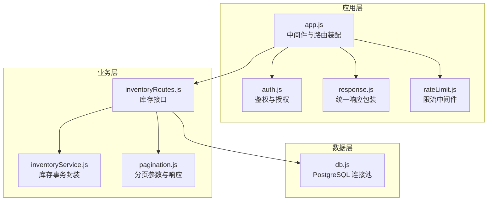
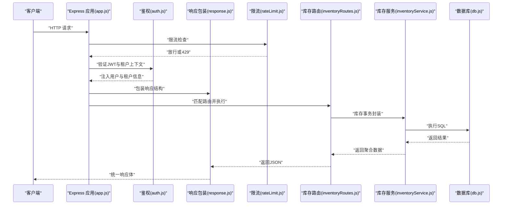
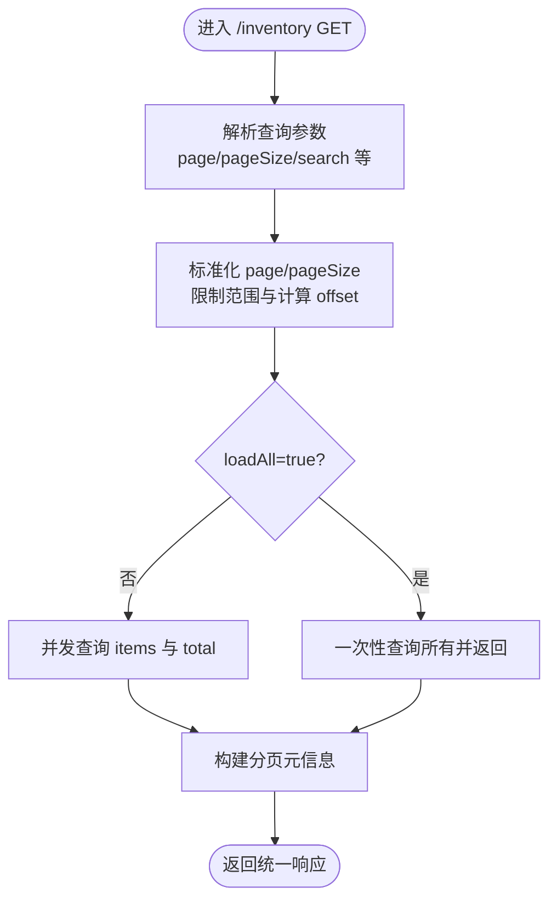
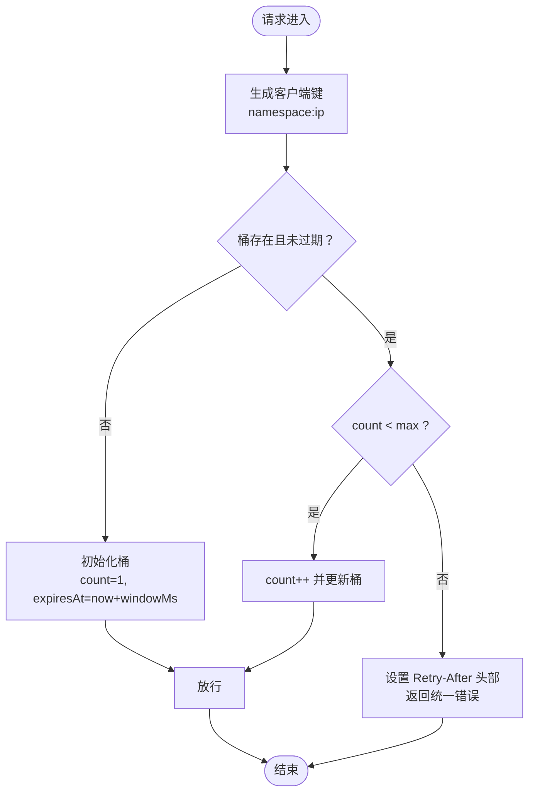
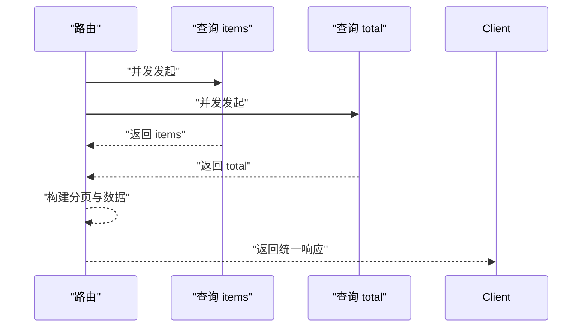
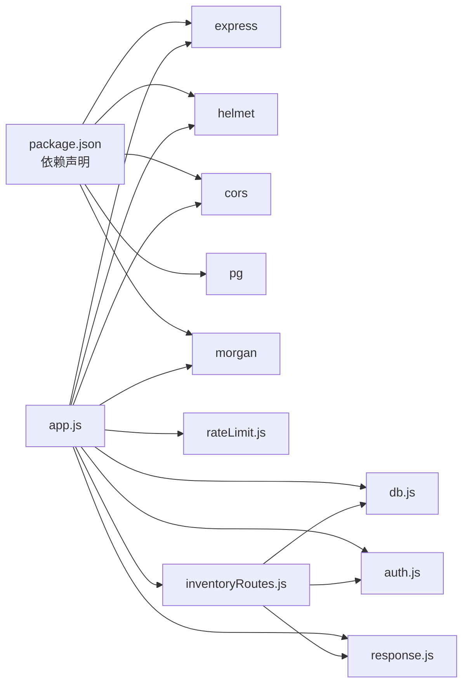

# API性能优化

<cite>
**本文引用的文件**
- [server/src/utils/pagination.js](file://server/src/utils/pagination.js)
- [server/src/middleware/rateLimit.js](file://server/src/middleware/rateLimit.js)
- [server/src/middleware/response.js](file://server/src/middleware/response.js)
- [server/src/utils/inventoryService.js](file://server/src/utils/inventoryService.js)
- [server/src/routes/inventoryRoutes.js](file://server/src/routes/inventoryRoutes.js)
- [server/src/app.js](file://server/src/app.js)
- [server/src/config/db.js](file://server/src/config/db.js)
- [server/src/middleware/auth.js](file://server/src/middleware/auth.js)
- [server/test/middleware.test.js](file://server/test/middleware.test.js)
- [server/test/integration.test.js](file://server/test/integration.test.js)
- [server/package.json](file://server/package.json)
</cite>

## 目录
1. [引言](#引言)
2. [项目结构](#项目结构)
3. [核心组件](#核心组件)
4. [架构总览](#架构总览)
5. [详细组件分析](#详细组件分析)
6. [依赖分析](#依赖分析)
7. [性能考量](#性能考量)
8. [故障排查指南](#故障排查指南)
9. [结论](#结论)
10. [附录](#附录)

## 引言
本文件聚焦库存管理系统的API性能优化实践，围绕分页机制、限流策略、批量操作、异步处理、响应优化、网络传输、监控与指标以及性能测试方法展开。文档以仓库中的实际代码为依据，结合架构图与流程图，帮助开发者在不牺牲可维护性的前提下，系统性地提升API的吞吐、延迟与稳定性。

## 项目结构
后端采用 Express 应用，通过中间件统一处理安全、日志、审计与响应包装；路由层按功能模块拆分，库存相关逻辑集中在库存路由与工具函数中；数据库连接池通过环境变量控制超时与SSL；测试覆盖了中间件行为与集成场景。

图表来源
- [server/src/app.js:1-91](file://server/src/app.js#L1-L91)
- [server/src/middleware/auth.js:1-87](file://server/src/middleware/auth.js#L1-L87)
- [server/src/middleware/response.js:1-62](file://server/src/middleware/response.js#L1-L62)
- [server/src/middleware/rateLimit.js:1-40](file://server/src/middleware/rateLimit.js#L1-L40)
- [server/src/utils/inventoryService.js:1-46](file://server/src/utils/inventoryService.js#L1-L46)
- [server/src/utils/pagination.js:1-28](file://server/src/utils/pagination.js#L1-L28)
- [server/src/config/db.js:1-29](file://server/src/config/db.js#L1-L29)

章节来源
- [server/src/app.js:1-91](file://server/src/app.js#L1-L91)

## 核心组件
- 分页工具：统一解析分页参数与构建分页响应，避免各接口重复逻辑。
- 限流中间件：基于内存桶的滑动窗口限流，支持命名空间与重试等待提示。
- 统一响应中间件：自动包装成功/失败响应，注入请求ID，便于追踪。
- 库存服务：封装库存行确保、查询与更新，统一事务边界。
- 库存路由：提供库存总览、流水查询、出入库与调拨等接口，使用并发查询与分页。

章节来源
- [server/src/utils/pagination.js:1-28](file://server/src/utils/pagination.js#L1-L28)
- [server/src/middleware/rateLimit.js:1-40](file://server/src/middleware/rateLimit.js#L1-L40)
- [server/src/middleware/response.js:1-62](file://server/src/middleware/response.js#L1-L62)
- [server/src/utils/inventoryService.js:1-46](file://server/src/utils/inventoryService.js#L1-L46)
- [server/src/routes/inventoryRoutes.js:1-536](file://server/src/routes/inventoryRoutes.js#L1-L536)

## 架构总览
下图展示从客户端到数据库的关键路径，以及中间件如何贯穿请求生命周期。

图表来源
- [server/src/app.js:47-88](file://server/src/app.js#L47-L88)
- [server/src/middleware/auth.js:5-61](file://server/src/middleware/auth.js#L5-L61)
- [server/src/middleware/response.js:3-56](file://server/src/middleware/response.js#L3-L56)
- [server/src/middleware/rateLimit.js:9-35](file://server/src/middleware/rateLimit.js#L9-L35)
- [server/src/routes/inventoryRoutes.js:17-156](file://server/src/routes/inventoryRoutes.js#L17-L156)
- [server/src/utils/inventoryService.js:3-39](file://server/src/utils/inventoryService.js#L3-L39)
- [server/src/config/db.js:17-28](file://server/src/config/db.js#L17-L28)

## 详细组件分析

### 分页机制优化
- 设计要点
  - 参数标准化：最小页码为1，页大小限制在1~100之间，避免过大开销。
  - 偏移计算：基于页码与页大小计算偏移，保证一致性。
  - 统一响应：提供分页元信息，前端可直接消费，减少适配成本。
- 性能影响
  - 控制单页最大记录数，降低单次查询与序列化压力。
  - 使用 LIMIT/OFFSET 时建议配合合适的索引与覆盖查询，避免全表扫描。
- 实现位置
  - [getPaginationParams:2-12](file://server/src/utils/pagination.js#L2-L12)
  - [buildPagination:15-22](file://server/src/utils/pagination.js#L15-L22)

图表来源
- [server/src/routes/inventoryRoutes.js:18-156](file://server/src/routes/inventoryRoutes.js#L18-L156)
- [server/src/utils/pagination.js:2-22](file://server/src/utils/pagination.js#L2-L22)

章节来源
- [server/src/utils/pagination.js:1-28](file://server/src/utils/pagination.js#L1-L28)
- [server/src/routes/inventoryRoutes.js:17-156](file://server/src/routes/inventoryRoutes.js#L17-L156)

### API限流策略
- 设计要点
  - 滑动窗口：基于内存 Map 维护每个客户端的计数与过期时间。
  - 客户端识别：优先使用代理头，回退至真实IP，形成键值。
  - 命名空间：支持多组限流规则，便于对不同接口或用户群组差异化控制。
  - 响应提示：设置重试秒数头部，并返回统一错误结构。
- 性能影响
  - 低内存占用，但非持久化，重启会清空；适合单实例部署或结合反向代理持久化。
  - 对突发流量有效抑制，避免雪崩效应。
- 实现位置
  - [createRateLimiter:9-35](file://server/src/middleware/rateLimit.js#L9-L35)
  - [getClientKey:3-7](file://server/src/middleware/rateLimit.js#L3-L7)

图表来源
- [server/src/middleware/rateLimit.js:9-35](file://server/src/middleware/rateLimit.js#L9-L35)

章节来源
- [server/src/middleware/rateLimit.js:1-40](file://server/src/middleware/rateLimit.js#L1-L40)
- [server/test/middleware.test.js:37-50](file://server/test/middleware.test.js#L37-L50)

### 批量操作优化
- 当前实现现状
  - 库存路由包含单条出入库与调拨的事务封装，使用 BEGIN/COMMIT 包裹，确保一致性。
  - 未发现显式的“批量插入/更新/删除”接口。
- 性能建议
  - 批量写入：使用批量 INSERT/UPDATE 语句或数据库提供的批量接口，减少往返次数。
  - 事务批处理：将多个小事务合并为一个事务，降低锁竞争与日志开销。
  - 并发控制：在路由层对批量请求进行速率限制与队列化，避免瞬时洪峰。
- 参考实现位置
  - [库存事务封装:3-39](file://server/src/utils/inventoryService.js#L3-L39)
  - [库存路由事务示例:247-436](file://server/src/routes/inventoryRoutes.js#L247-L436)

章节来源
- [server/src/utils/inventoryService.js:1-46](file://server/src/utils/inventoryService.js#L1-L46)
- [server/src/routes/inventoryRoutes.js:237-449](file://server/src/routes/inventoryRoutes.js#L237-L449)

### 异步处理优化
- Promise链式调用
  - 列表接口使用 Promise.all 并发查询 items 与 total，显著降低总等待时间。
- 错误处理
  - 统一响应中间件捕获错误状态码并包装为统一结构，便于前端一致处理。
  - 路由层在事务中出现异常时回滚并返回错误信息。
- 参考实现位置
  - [并发查询 items 与 total:79-144](file://server/src/routes/inventoryRoutes.js#L79-L144)
  - [统一响应包装:9-34](file://server/src/middleware/response.js#L9-L34)

图表来源
- [server/src/routes/inventoryRoutes.js:79-144](file://server/src/routes/inventoryRoutes.js#L79-L144)
- [server/src/middleware/response.js:3-56](file://server/src/middleware/response.js#L3-L56)

章节来源
- [server/src/routes/inventoryRoutes.js:79-144](file://server/src/routes/inventoryRoutes.js#L79-L144)
- [server/src/middleware/response.js:1-62](file://server/src/middleware/response.js#L1-L62)

### API响应优化
- 统一结构
  - 成功/失败统一字段、请求ID、错误码与详情，便于前端与监控系统消费。
- 数据脱敏
  - 成本价格根据权限动态屏蔽，避免敏感信息泄露。
- 参考实现位置
  - [统一响应包装:9-54](file://server/src/middleware/response.js#L9-L54)
  - [成本访问控制:25-31](file://server/src/utils/costAccess.js#L25-L31)
  - [库存路由中成本字段处理:70-76](file://server/src/routes/inventoryRoutes.js#L70-L76)

章节来源
- [server/src/middleware/response.js:1-62](file://server/src/middleware/response.js#L1-L62)
- [server/src/utils/costAccess.js:1-31](file://server/src/utils/costAccess.js#L1-L31)
- [server/src/routes/inventoryRoutes.js:68-76](file://server/src/routes/inventoryRoutes.js#L68-L76)

### 网络传输优化
- CORS与安全头
  - 仅允许白名单域名访问，减少跨域风险；Helmet设置安全头，CSP在Nginx层处理。
- 日志与审计
  - Morgan生产模式输出访问日志；审计中间件记录关键操作。
- 参考实现位置
  - [CORS与安全头配置:28-58](file://server/src/app.js#L28-L58)
  - [审计中间件](file://server/src/app.js#L58)

章节来源
- [server/src/app.js:28-58](file://server/src/app.js#L28-L58)

### API监控与性能指标
- 请求ID追踪
  - 响应中间件注入请求ID，便于端到端追踪。
- 错误兜底
  - 全局错误处理器统一返回错误结构，避免堆栈泄露。
- 参考实现位置
  - [请求ID注入与响应包装:4-54](file://server/src/middleware/response.js#L4-L54)
  - [全局错误处理:82-88](file://server/src/app.js#L82-L88)

章节来源
- [server/src/middleware/response.js:1-62](file://server/src/middleware/response.js#L1-L62)
- [server/src/app.js:82-88](file://server/src/app.js#L82-L88)

### 性能测试方法与基准测试
- 单元与集成测试
  - 测试覆盖响应包装与限流行为，可作为性能回归的基础。
  - 集成测试包含登录、产品与供应商的CRUD流程，可用于端到端性能评估。
- 基准测试建议
  - 使用压测工具对关键接口（库存列表、出入库）施加并发负载，观察P95/P99延迟与错误率。
  - 关注数据库连接池利用率、慢查询比例与锁等待情况。
- 参考实现位置
  - [中间件行为测试:9-50](file://server/test/middleware.test.js#L9-L50)
  - [集成测试示例:38-160](file://server/test/integration.test.js#L38-L160)

章节来源
- [server/test/middleware.test.js:1-52](file://server/test/middleware.test.js#L1-L52)
- [server/test/integration.test.js:1-162](file://server/test/integration.test.js#L1-L162)

## 依赖分析
- Express 应用装配与中间件顺序决定性能表现与可观测性。
- 数据库连接池通过环境变量控制超时与SSL，影响连接建立与加密开销。
- 路由层依赖鉴权中间件与库存服务，鉴权失败会提前短路，减少后续开销。

图表来源
- [server/package.json:15-30](file://server/package.json#L15-L30)
- [server/src/app.js:1-26](file://server/src/app.js#L1-L26)
- [server/src/config/db.js:1-29](file://server/src/config/db.js#L1-L29)

章节来源
- [server/package.json:1-31](file://server/package.json#L1-L31)
- [server/src/app.js:1-26](file://server/src/app.js#L1-L26)

## 性能考量
- 分页与查询
  - 使用 LIMIT/OFFSET 时建议对常用过滤字段建立索引，避免排序与过滤导致的全表扫描。
  - 对高频查询可引入缓存（如Redis）存储热门列表与统计聚合，缩短热路径。
- 限流与熔断
  - 单实例限流建议结合反向代理或外部缓存持久化，避免重启丢失。
  - 对下游依赖（如第三方市场同步）增加熔断与降级策略，保护核心路径。
- 事务与并发
  - 将小事务合并，减少锁持有时间；对只读查询使用只读连接或连接池副本。
- 压缩与传输
  - 启用Gzip/Deflate压缩静态资源与JSON响应，降低带宽占用。
  - 结合CDN与HTTP/2，利用多路复用与头部压缩提升传输效率。
- 监控与告警
  - 关键指标：响应时间（P50/P90/P95/P99）、吞吐量（RPS）、错误率、连接池利用率、慢查询TopN。
  - 建议接入APM（如OpenTelemetry）采集端到端链路与数据库指标。

## 故障排查指南
- 429 Too Many Requests
  - 检查限流配置与命名空间是否正确；确认客户端是否遵循 Retry-After。
  - 参考：[限流中间件:9-35](file://server/src/middleware/rateLimit.js#L9-L35)
- 统一错误响应
  - 确认全局错误处理器与响应中间件是否生效；核对状态码与错误码字段。
  - 参考：[统一响应包装:9-54](file://server/src/middleware/response.js#L9-L54)，[全局错误处理:82-88](file://server/src/app.js#L82-L88)
- 认证失败
  - 检查JWT签名、租户一致性与用户状态；确认鉴权中间件是否在路由前执行。
  - 参考：[鉴权中间件:5-61](file://server/src/middleware/auth.js#L5-L61)
- 数据库连接问题
  - 核对连接字符串与SSL配置、连接超时设置；检查连接池上限与峰值。
  - 参考：[数据库配置:17-28](file://server/src/config/db.js#L17-L28)

章节来源
- [server/src/middleware/rateLimit.js:1-40](file://server/src/middleware/rateLimit.js#L1-L40)
- [server/src/middleware/response.js:1-62](file://server/src/middleware/response.js#L1-L62)
- [server/src/middleware/auth.js:1-87](file://server/src/middleware/auth.js#L1-L87)
- [server/src/config/db.js:17-28](file://server/src/config/db.js#L17-L28)

## 结论
通过统一的分页与响应结构、并发查询、限流与统一错误处理，系统在可维护性与性能之间取得了良好平衡。建议在现有基础上进一步引入缓存、连接池优化、传输压缩与APM监控，持续迭代性能与稳定性。

## 附录
- 优化案例
  - 库存列表接口：使用 Promise.all 并发查询 items 与 total，显著降低首屏等待时间。
  - 出入库与调拨：在路由层包裹事务，确保一致性与原子性，避免脏数据。
- 性能调优建议
  - 数据库：为过滤与排序字段建索引；对只读查询使用副本；开启慢查询日志。
  - 缓存：热点列表与统计聚合引入缓存，设置合理TTL与失效策略。
  - 网络：启用Gzip/Deflate与HTTP/2，结合CDN加速静态资源。
  - 监控：采集响应时间、吞吐量、错误率与连接池指标，建立告警阈值。