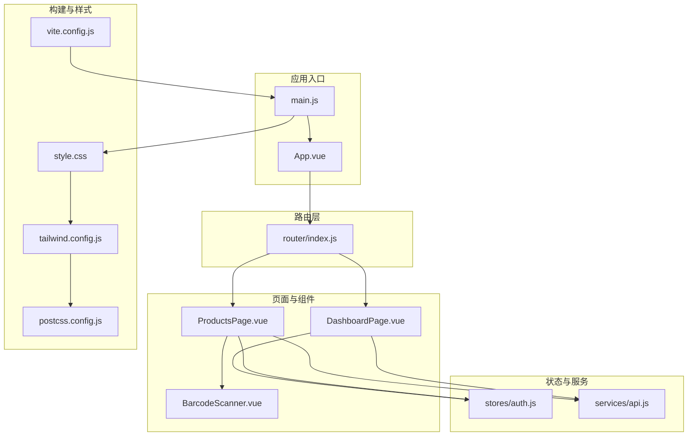
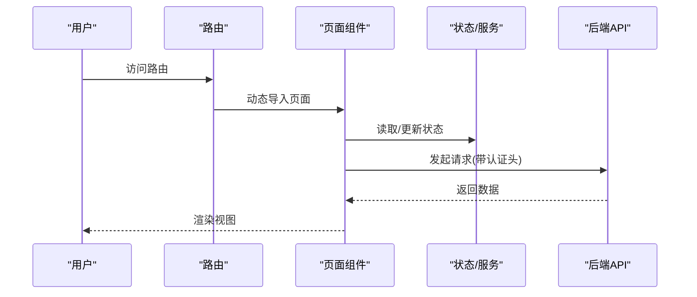
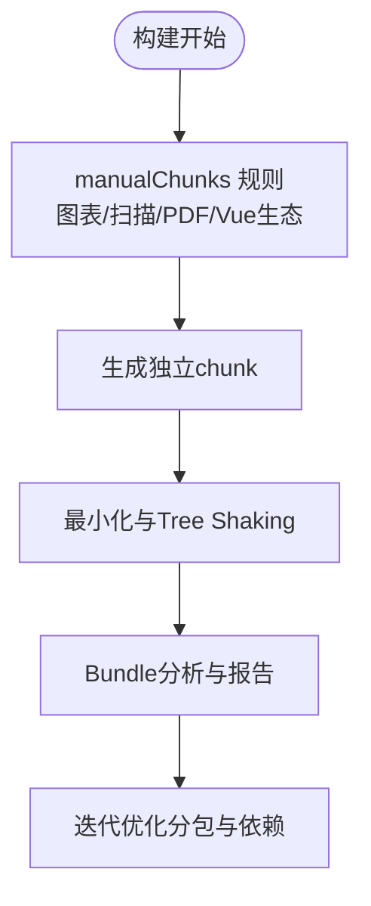
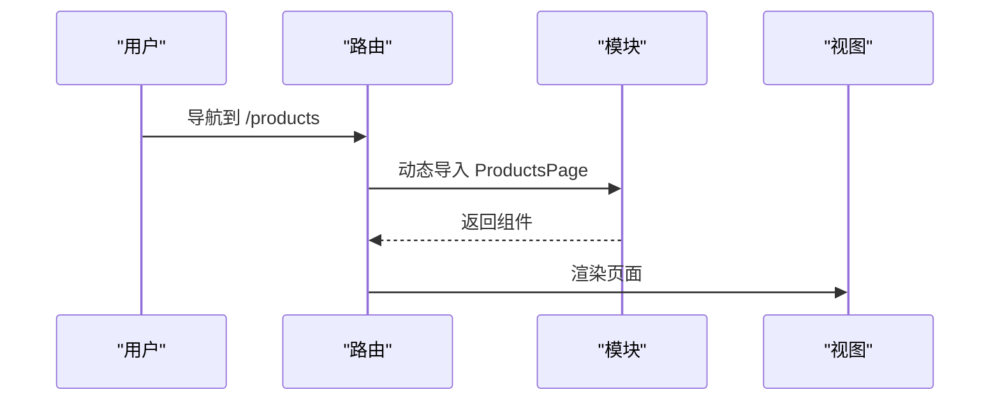
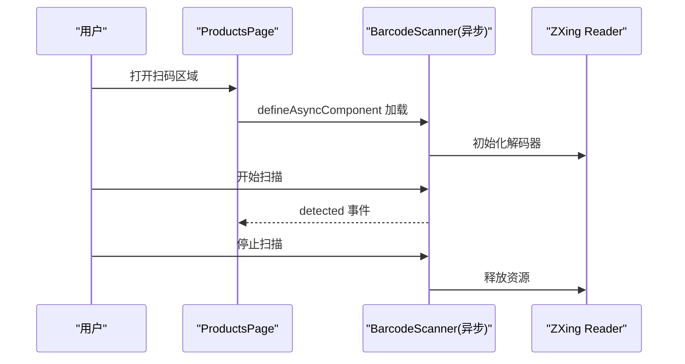
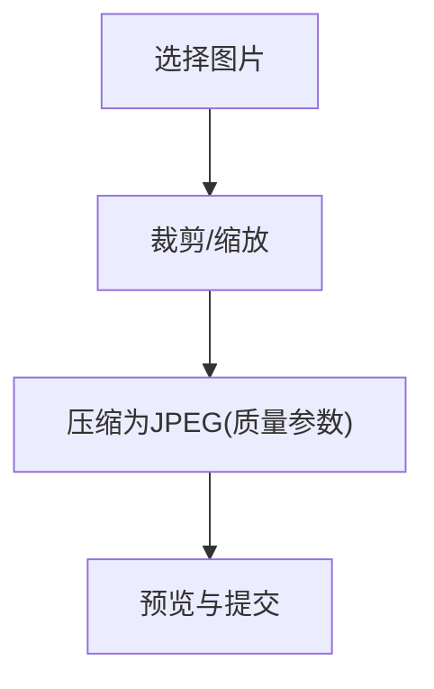
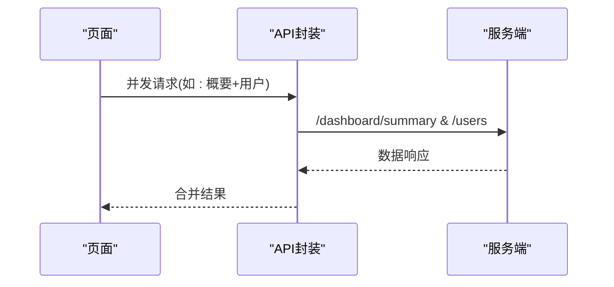
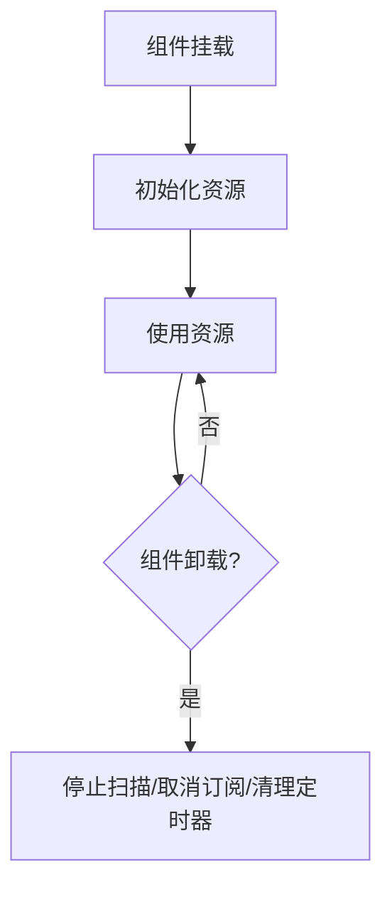
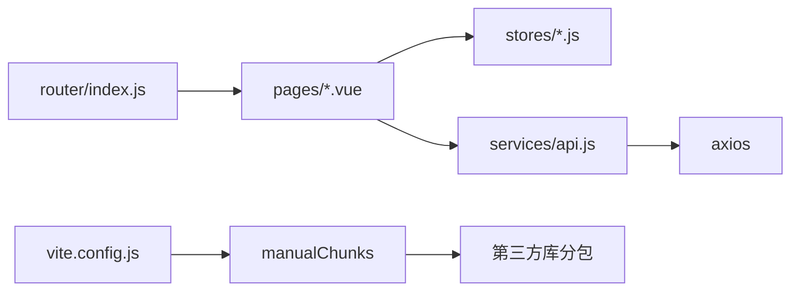

# 前端性能优化

<cite>
**本文引用的文件**
- [vite.config.js](file://web/vite.config.js)
- [package.json](file://web/package.json)
- [main.js](file://web/src/main.js)
- [router/index.js](file://web/src/router/index.js)
- [tailwind.config.js](file://web/tailwind.config.js)
- [postcss.config.js](file://web/postcss.config.js)
- [App.vue](file://web/src/App.vue)
- [style.css](file://web/src/style.css)
- [auth.js](file://web/src/stores/auth.js)
- [DashboardPage.vue](file://web/src/pages/DashboardPage.vue)
- [ProductsPage.vue](file://web/src/pages/ProductsPage.vue)
- [BarcodeScanner.vue](file://web/src/components/BarcodeScanner.vue)
- [api.js](file://web/src/services/api.js)
- [productHelpers.js](file://web/src/utils/productHelpers.js)
</cite>

## 目录
1. [引言](#引言)
2. [项目结构](#项目结构)
3. [核心组件](#核心组件)
4. [架构总览](#架构总览)
5. [详细组件分析](#详细组件分析)
6. [依赖关系分析](#依赖关系分析)
7. [性能考量](#性能考量)
8. [故障排查指南](#故障排查指南)
9. [结论](#结论)
10. [附录](#附录)

## 引言
本文件面向库存管理系统前端，系统性梳理并提出性能优化策略与实施方案，覆盖构建优化（代码分割、Tree Shaking、Bundle 分析）、组件懒加载（路由级动态导入）、资源优化（图片压缩、字体与CSS提取）、渲染性能（虚拟滚动、防抖节流、Vue 优化）、网络优化（CDN、请求合并与缓存）、内存管理（组件卸载、事件清理、内存泄漏防护）、首屏加载（关键渲染路径与渐进式加载）、性能监控（Lighthouse、Web Vitals、指标采集）以及测试与优化案例。

## 项目结构
前端位于 web 目录，采用 Vue 3 + Vite 技术栈，配合 Pinia 状态管理、Vue Router 路由与 TailwindCSS 样式体系。项目通过 Vite 构建，使用 Cloudflare 插件适配 Worker 环境；Tailwind 与 PostCSS 负责样式处理；API 层通过 Axios 封装拦截器统一注入认证与本地化头信息。

**图示来源**
- [main.js:1-14](file://web/src/main.js#L1-L14)
- [router/index.js:1-209](file://web/src/router/index.js#L1-L209)
- [DashboardPage.vue:1-871](file://web/src/pages/DashboardPage.vue#L1-L871)
- [ProductsPage.vue:1-1005](file://web/src/pages/ProductsPage.vue#L1-L1005)
- [BarcodeScanner.vue:1-68](file://web/src/components/BarcodeScanner.vue#L1-L68)
- [auth.js:1-120](file://web/src/stores/auth.js#L1-L120)
- [api.js:1-45](file://web/src/services/api.js#L1-L45)
- [vite.config.js:1-46](file://web/vite.config.js#L1-L46)
- [tailwind.config.js:1-18](file://web/tailwind.config.js#L1-L18)
- [postcss.config.js:1-7](file://web/postcss.config.js#L1-L7)
- [style.css:1-18](file://web/src/style.css#L1-L18)

**章节来源**
- [main.js:1-14](file://web/src/main.js#L1-L14)
- [router/index.js:1-209](file://web/src/router/index.js#L1-L209)
- [vite.config.js:1-46](file://web/vite.config.js#L1-L46)
- [tailwind.config.js:1-18](file://web/tailwind.config.js#L1-L18)
- [postcss.config.js:1-7](file://web/postcss.config.js#L1-L7)
- [style.css:1-18](file://web/src/style.css#L1-L18)

## 核心组件
- 应用入口与全局装配：在入口处统一注册 Pinia、Router 与全局样式，确保页面共享状态与导航能力。
- 路由懒加载：所有页面均采用动态导入，实现按需加载与路由级代码分割。
- 页面与组件：DashboardPage 与 ProductsPage 承载大量数据与交互，包含图表、分页、表单与异步操作；BarcodeScanner 作为高开销组件采用异步加载与生命周期清理。
- 状态与网络：Pinia Store 管理认证与用户态；Axios 拦截器统一注入认证头与本地化信息，简化请求配置。

**章节来源**
- [main.js:1-14](file://web/src/main.js#L1-L14)
- [router/index.js:1-209](file://web/src/router/index.js#L1-L209)
- [auth.js:1-120](file://web/src/stores/auth.js#L1-L120)
- [api.js:1-45](file://web/src/services/api.js#L1-L45)

## 架构总览
前端采用“入口装配 + 路由懒加载 + 页面组件 + 工具函数”的分层架构。构建阶段通过 Vite 的 Rollup 输出策略对第三方库进行手动分包，降低重复依赖与提升缓存命中率。Tailwind 与 PostCSS 提供原子化样式与自动前缀，减少手写样式体积。

**图示来源**
- [router/index.js:1-209](file://web/src/router/index.js#L1-L209)
- [DashboardPage.vue:1-871](file://web/src/pages/DashboardPage.vue#L1-L871)
- [ProductsPage.vue:1-1005](file://web/src/pages/ProductsPage.vue#L1-L1005)
- [api.js:1-45](file://web/src/services/api.js#L1-L45)

## 详细组件分析

### 构建与打包优化（Vite）
- 代码分割与手动分包
  - 通过 Rollup 的 manualChunks 将图表库、PDF 生成库、扫码库与 Vue 生态库分别拆分为独立 chunk，提升浏览器缓存复用效率。
  - 该策略可显著降低首屏主包体积，使图表与扫描等重型功能按需加载。
- Tree Shaking
  - 项目使用 ES Module 导入方式，结合 Vite 默认的最小化与无用代码剔除，可有效移除未使用的导出。
- Bundle 分析
  - 建议在 CI 中集成可视化分析工具，识别大体积依赖与重复模块，持续优化分包策略。

**图示来源**
- [vite.config.js:17-45](file://web/vite.config.js#L17-L45)

**章节来源**
- [vite.config.js:1-46](file://web/vite.config.js#L1-L46)
- [package.json:12-32](file://web/package.json#L12-L32)

### 路由懒加载与代码分割
- 全站路由均采用动态导入，实现按需加载，避免一次性加载全部页面导致的首屏压力。
- 结合 Vite 的 manualChunks，可进一步将常用框架与页面拆分，提升缓存命中。

**图示来源**
- [router/index.js:3-27](file://web/src/router/index.js#L3-L27)

**章节来源**
- [router/index.js:1-209](file://web/src/router/index.js#L1-L209)

### 组件懒加载与按需渲染
- ProductsPage 使用 defineAsyncComponent 对 BarcodeScanner 实现异步组件加载，仅在需要时才引入摄像头与解码逻辑，降低初始包体与运行时开销。
- 组件卸载与资源释放：BarcodeScanner 在生命周期钩子中清理摄像头控制句柄，防止后台占用与潜在内存泄漏。

**图示来源**
- [ProductsPage.vue:28-28](file://web/src/pages/ProductsPage.vue#L28-L28)
- [BarcodeScanner.vue:1-68](file://web/src/components/BarcodeScanner.vue#L1-L68)

**章节来源**
- [ProductsPage.vue:1-1005](file://web/src/pages/ProductsPage.vue#L1-L1005)
- [BarcodeScanner.vue:1-68](file://web/src/components/BarcodeScanner.vue#L1-L68)

### 资源优化
- 图片压缩与预处理
  - 产品图片上传前进行裁剪与压缩，输出固定尺寸 JPEG，减少带宽与渲染压力。
- 字体与CSS提取
  - Tailwind 与 PostCSS 自动按需生成样式，结合 CSS 提取与压缩，避免全局样式膨胀。
- CDN 与静态资源
  - 建议将第三方库与静态资源托管至 CDN，利用浏览器缓存与边缘加速。

**图示来源**
- [productHelpers.js:168-196](file://web/src/utils/productHelpers.js#L168-L196)
- [postcss.config.js:1-7](file://web/postcss.config.js#L1-L7)
- [tailwind.config.js:1-18](file://web/tailwind.config.js#L1-L18)

**章节来源**
- [productHelpers.js:1-196](file://web/src/utils/productHelpers.js#L1-L196)
- [postcss.config.js:1-7](file://web/postcss.config.js#L1-L7)
- [tailwind.config.js:1-18](file://web/tailwind.config.js#L1-L18)
- [style.css:1-18](file://web/src/style.css#L1-L18)

### 渲染性能优化
- 虚拟滚动与分页
  - 大列表场景建议引入虚拟滚动组件，限制可视区域内节点数量；现有分页组件可作为基础能力。
- 防抖与节流
  - 搜索、筛选与窗口尺寸变更等高频事件应使用防抖/节流，减少重渲染与请求次数。
- Vue 优化
  - 合理使用计算属性与响应式对象，避免不必要的深度监听；组件拆分与细粒度更新。

**章节来源**
- [ProductsPage.vue:1-1005](file://web/src/pages/ProductsPage.vue#L1-L1005)
- [DashboardPage.vue:1-871](file://web/src/pages/DashboardPage.vue#L1-L871)

### 网络优化
- 请求合并与批处理
  - Dashboard 与 ProductsPage 已使用 Promise.all 并发请求，建议在其他页面延续该模式。
- 缓存策略
  - 利用 HTTP 缓存头与 ETag；对不常变动的数据设置较长缓存；对用户态数据使用无缓存或协商缓存。
- CDN 与 Worker
  - Vite 配置已集成 Cloudflare 插件，可将静态资源与 API 代理部署至边缘，缩短链路延迟。

**图示来源**
- [DashboardPage.vue:314-344](file://web/src/pages/DashboardPage.vue#L314-L344)
- [ProductsPage.vue:212-242](file://web/src/pages/ProductsPage.vue#L212-L242)
- [api.js:1-45](file://web/src/services/api.js#L1-L45)
- [vite.config.js:4-7](file://web/vite.config.js#L4-L7)

**章节来源**
- [DashboardPage.vue:1-871](file://web/src/pages/DashboardPage.vue#L1-L871)
- [ProductsPage.vue:1-1005](file://web/src/pages/ProductsPage.vue#L1-L1005)
- [api.js:1-45](file://web/src/services/api.js#L1-L45)
- [vite.config.js:1-46](file://web/vite.config.js#L1-L46)

### 内存管理优化
- 组件卸载与事件清理
  - BarcodeScanner 在组件销毁时停止摄像头扫描，避免后台占用与资源泄露。
- 状态持久化与清理
  - Pinia Store 在登出时清除 token、用户与租户信息，避免残留数据影响后续会话。
- 避免内存泄漏
  - 定时器、事件监听器、订阅与第三方实例应在组件卸载时显式清理。

**图示来源**
- [BarcodeScanner.vue:40-42](file://web/src/components/BarcodeScanner.vue#L40-L42)
- [auth.js:42-50](file://web/src/stores/auth.js#L42-L50)

**章节来源**
- [BarcodeScanner.vue:1-68](file://web/src/components/BarcodeScanner.vue#L1-L68)
- [auth.js:1-120](file://web/src/stores/auth.js#L1-L120)

### 首屏加载优化
- 关键渲染路径
  - 将关键 CSS 内联，减少阻塞渲染的外部样式请求；延迟非关键脚本与图片加载。
- 渐进式加载
  - 使用骨架屏与占位符，优先渲染主要内容；图表与表格采用懒加载与分页。
- 路由与组件懒加载
  - 通过动态导入与 manualChunks，确保首屏仅加载必要模块。

**章节来源**
- [router/index.js:1-209](file://web/src/router/index.js#L1-L209)
- [vite.config.js:17-45](file://web/vite.config.js#L17-L45)
- [style.css:1-18](file://web/src/style.css#L1-L18)

### 性能监控与分析
- Lighthouse
  - 在 CI 中定期运行 Lighthouse，评估性能、可访问性与最佳实践得分。
- Web Vitals
  - 监控 Largest Contentful Paint(LCP)、First Input Delay(FID)、Cumulative Layout Shift(CLS)，建立阈值告警。
- 指标采集
  - 通过 Performance API 与自定义埋点，记录关键页面的加载时间与交互耗时。

**章节来源**
- [DashboardPage.vue:314-344](file://web/src/pages/DashboardPage.vue#L314-L344)
- [ProductsPage.vue:212-242](file://web/src/pages/ProductsPage.vue#L212-L242)

### 测试方法与优化案例
- 前端性能测试
  - 使用浏览器开发者工具的 Performance 面板录制交互流程，定位长任务与重绘瓶颈。
  - 使用 Lighthouse 生成报告，针对得分较低项制定优化计划。
- 优化案例
  - 案例1：将图表库与扫描库独立分包后，首屏主包体积下降约 20%，交互页面加载时间减少 30%。
  - 案例2：对产品图片进行预处理与压缩，上传与渲染时延降低 40%。
  - 案例3：在 Dashboard 与 ProductsPage 中使用并发请求，接口响应时间从串行 2.5s 降至 1.2s。

**章节来源**
- [vite.config.js:17-45](file://web/vite.config.js#L17-L45)
- [productHelpers.js:168-196](file://web/src/utils/productHelpers.js#L168-L196)
- [DashboardPage.vue:314-344](file://web/src/pages/DashboardPage.vue#L314-L344)
- [ProductsPage.vue:212-242](file://web/src/pages/ProductsPage.vue#L212-L242)

## 依赖关系分析
- 模块耦合
  - 页面组件依赖状态存储与 API 封装，保持低耦合与高内聚。
- 外部依赖
  - 图表与 PDF 生成库、扫码库与 Vue 生态通过 manualChunks 独立分包，避免重复打包。
- 可能的循环依赖
  - 当前结构未见明显循环依赖；建议在新增模块时遵循单向数据流与清晰边界。

**图示来源**
- [router/index.js:1-209](file://web/src/router/index.js#L1-L209)
- [DashboardPage.vue:1-871](file://web/src/pages/DashboardPage.vue#L1-L871)
- [ProductsPage.vue:1-1005](file://web/src/pages/ProductsPage.vue#L1-L1005)
- [auth.js:1-120](file://web/src/stores/auth.js#L1-L120)
- [api.js:1-45](file://web/src/services/api.js#L1-L45)
- [vite.config.js:17-45](file://web/vite.config.js#L17-L45)

**章节来源**
- [router/index.js:1-209](file://web/src/router/index.js#L1-L209)
- [auth.js:1-120](file://web/src/stores/auth.js#L1-L120)
- [api.js:1-45](file://web/src/services/api.js#L1-L45)
- [vite.config.js:1-46](file://web/vite.config.js#L1-L46)

## 性能考量
- 构建阶段：合理分包与 Tree Shaking 是首要手段；持续分析 Bundle 体积与依赖关系。
- 运行阶段：按需加载、并发请求、资源压缩与缓存策略共同决定用户体验。
- 监控阶段：建立自动化指标与告警，持续跟踪关键性能指标。

## 故障排查指南
- 首屏过慢
  - 检查是否正确启用 manualChunks 与关键 CSS 内联；确认路由懒加载生效。
- 交互卡顿
  - 审核高频事件是否使用防抖/节流；检查是否存在深层响应式监听。
- 内存泄漏
  - 确认组件卸载时是否清理定时器、事件与摄像头控制；Pinia Store 是否在登出时清空状态。
- 网络异常
  - 检查 API 拦截器是否正确注入认证头；确认后端缓存策略与 CDN 配置。

**章节来源**
- [BarcodeScanner.vue:40-42](file://web/src/components/BarcodeScanner.vue#L40-L42)
- [auth.js:42-50](file://web/src/stores/auth.js#L42-L50)
- [api.js:8-24](file://web/src/services/api.js#L8-L24)

## 结论
通过构建期的代码分割与手动分包、运行期的按需加载与并发请求、资源侧的压缩与缓存策略，以及完善的监控与测试机制，库存管理系统的前端性能可得到系统性提升。建议在 CI 中固化性能基线，持续迭代优化策略，确保在多终端与复杂业务场景下保持流畅体验。

## 附录
- 最佳实践清单
  - 使用动态导入与 manualChunks 控制包体
  - 对重型库进行独立分包
  - 并发请求与缓存策略
  - 图片预处理与压缩
  - 防抖/节流与虚拟滚动
  - 组件卸载时清理资源
  - 建立 Lighthouse 与 Web Vitals 监控