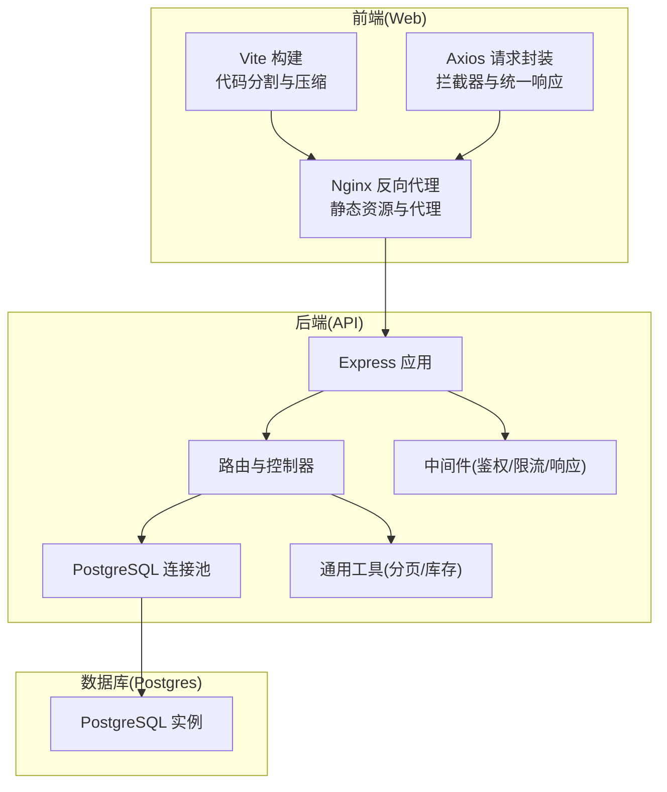
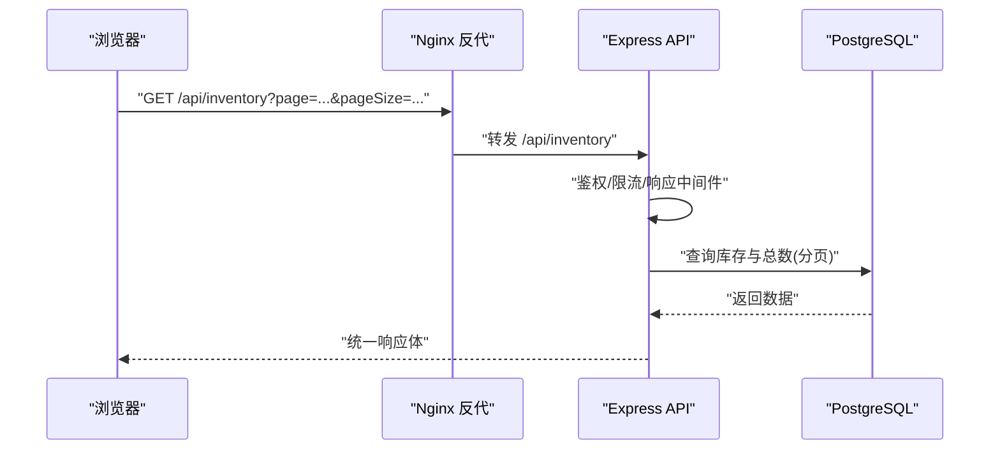
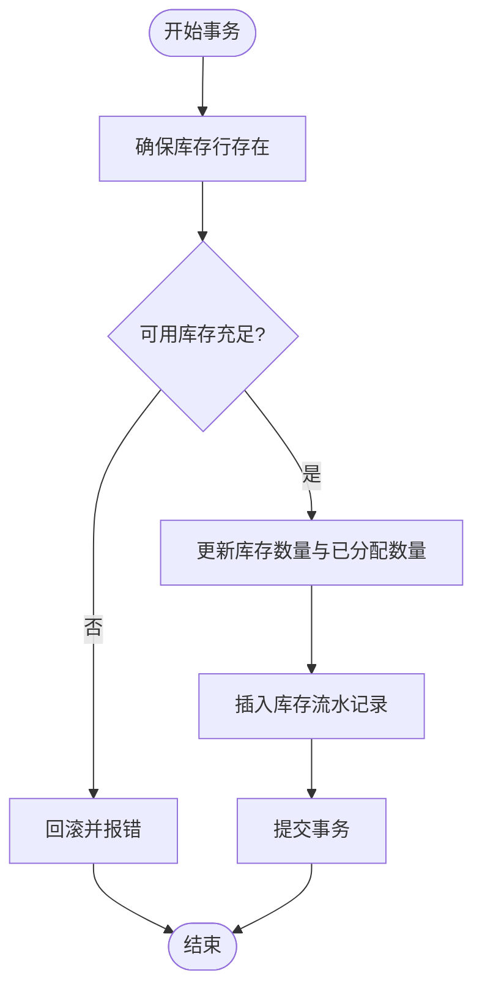
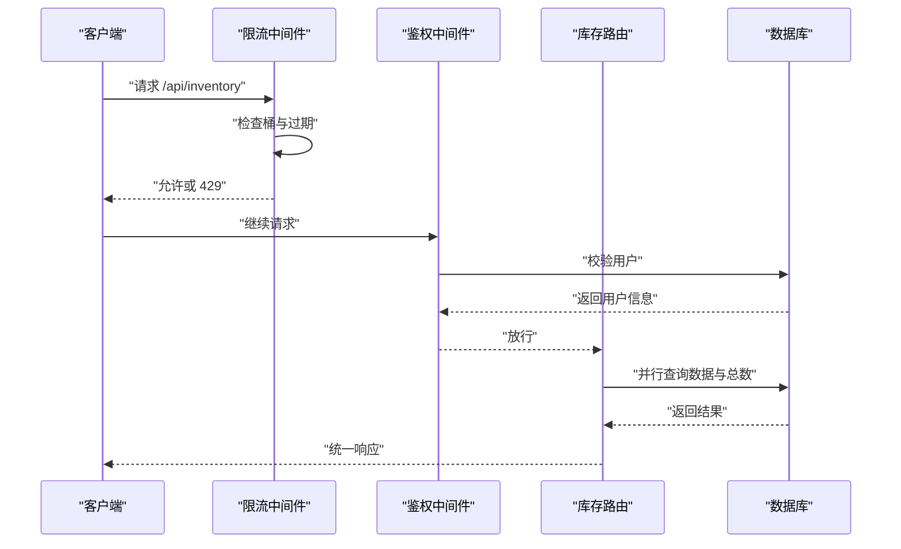
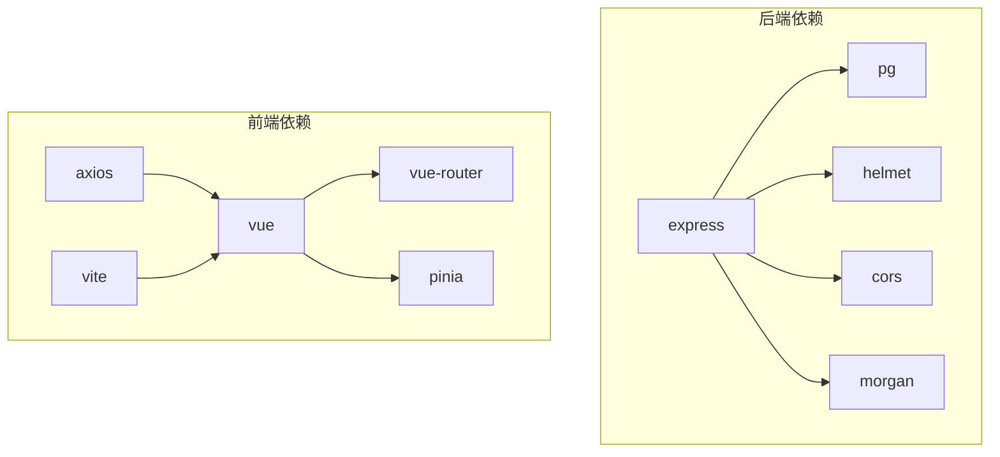

# 性能优化

<cite>
**本文引用的文件**
- [server/src/config/db.js](file://server/src/config/db.js)
- [server/src/utils/pagination.js](file://server/src/utils/pagination.js)
- [server/src/middleware/rateLimit.js](file://server/src/middleware/rateLimit.js)
- [server/src/middleware/auth.js](file://server/src/middleware/auth.js)
- [server/src/middleware/response.js](file://server/src/middleware/response.js)
- [server/src/routes/inventoryRoutes.js](file://server/src/routes/inventoryRoutes.js)
- [server/src/utils/inventoryService.js](file://server/src/utils/inventoryService.js)
- [server/src/app.js](file://server/src/app.js)
- [server/package.json](file://server/package.json)
- [web/vite.config.js](file://web/vite.config.js)
- [web/nginx.conf](file://web/nginx.conf)
- [web/src/services/api.js](file://web/src/services/api.js)
- [web/package.json](file://web/package.json)
- [server/Dockerfile](file://server/Dockerfile)
- [web/Dockerfile](file://web/Dockerfile)
- [docker-compose.yml](file://docker-compose.yml)
- [server/database/schema.sql](file://server/database/schema.sql)
- [server/database/seed.sql](file://server/database/seed.sql)
</cite>

## 目录
1. [简介](#简介)
2. [项目结构](#项目结构)
3. [核心组件](#核心组件)
4. [架构总览](#架构总览)
5. [详细组件分析](#详细组件分析)
6. [依赖关系分析](#依赖关系分析)
7. [性能考量与优化建议](#性能考量与优化建议)
8. [故障排查指南](#故障排查指南)
9. [结论](#结论)
10. [附录](#附录)

## 简介
本文件面向库存管理系统，系统采用前后端分离架构：前端基于 Vue 3 + Vite，后端基于 Express + PostgreSQL，通过 Nginx 反向代理与容器编排部署。本文聚焦性能优化策略与实现方案，覆盖数据库性能优化（索引设计、查询优化、连接池）、缓存策略（应用层与浏览器缓存）、API 性能（分页、批量与异步）、前端性能（代码分割、懒加载、资源压缩）、监控与指标、负载均衡与水平扩展、性能测试与基准测试、最佳实践与常见问题。

## 项目结构
- 后端服务位于 server/，包含路由、中间件、数据库连接池、业务工具与启动入口。
- 前端位于 web/，包含 Vue 页面、状态管理、API 封装、构建配置与 Nginx 配置。
- 容器化与编排通过 Dockerfile 与 docker-compose.yml 实现，后端与前端分别打包运行。

图表来源
- [server/src/app.js:25-65](file://server/src/app.js#L25-L65)
- [server/src/config/db.js:15-24](file://server/src/config/db.js#L15-L24)
- [web/vite.config.js:17-45](file://web/vite.config.js#L17-L45)
- [web/nginx.conf:8-15](file://web/nginx.conf#L8-L15)

章节来源
- [server/src/app.js:25-65](file://server/src/app.js#L25-L65)
- [web/vite.config.js:17-45](file://web/vite.config.js#L17-L45)
- [web/nginx.conf:8-15](file://web/nginx.conf#L8-L15)
- [server/src/config/db.js:15-24](file://server/src/config/db.js#L15-L24)

## 核心组件
- 数据库连接池与 SSL 控制：通过连接字符串动态决定是否启用 SSL，并设置连接超时，保障连接稳定性与安全性。
- 分页工具：统一分页参数与分页结构，降低接口重复逻辑与前端负担。
- 限流中间件：基于内存桶的滑动窗口限流，结合命名空间与客户端 IP，防止滥用。
- 鉴权与授权：JWT 校验与角色授权，减少无效请求对数据库的压力。
- 统一响应中间件：标准化响应结构，便于前端统一处理与调试。
- 库存事务工具：封装库存行确保、查询与更新，保证并发一致性与可维护性。
- 前端 API 封装：集中注入认证与成本访问令牌，统一响应转换与错误处理。
- 构建与反向代理：Vite 代码分割与 Rollup 手动分包，Nginx 代理 API 与静态资源。

章节来源
- [server/src/config/db.js:1-25](file://server/src/config/db.js#L1-L25)
- [server/src/utils/pagination.js:1-28](file://server/src/utils/pagination.js#L1-L28)
- [server/src/middleware/rateLimit.js:1-40](file://server/src/middleware/rateLimit.js#L1-L40)
- [server/src/middleware/auth.js:1-46](file://server/src/middleware/auth.js#L1-L46)
- [server/src/middleware/response.js:1-62](file://server/src/middleware/response.js#L1-L62)
- [server/src/utils/inventoryService.js:1-45](file://server/src/utils/inventoryService.js#L1-L45)
- [web/src/services/api.js:1-45](file://web/src/services/api.js#L1-L45)
- [web/vite.config.js:17-45](file://web/vite.config.js#L17-L45)
- [web/nginx.conf:8-15](file://web/nginx.conf#L8-L15)

## 架构总览
系统采用三层架构：前端负责视图与交互，后端负责业务与数据，数据库负责持久化。Nginx 作为边缘代理，负责静态资源与 API 转发；数据库通过连接池提供稳定连接；后端通过中间件与路由实现安全、限流与统一响应；前端通过 Axios 与后端交互，利用 Vite 的代码分割与构建优化。

图表来源
- [web/nginx.conf:8-15](file://web/nginx.conf#L8-L15)
- [server/src/app.js:27-33](file://server/src/app.js#L27-L33)
- [server/src/middleware/rateLimit.js:9-35](file://server/src/middleware/rateLimit.js#L9-L35)
- [server/src/routes/inventoryRoutes.js:17-151](file://server/src/routes/inventoryRoutes.js#L17-L151)
- [server/src/config/db.js:15-24](file://server/src/config/db.js#L15-L24)

## 详细组件分析

### 数据库性能优化
- 连接池配置
  - 动态 SSL：根据连接字符串与环境变量决定是否启用 SSL，生产环境默认开启，保障传输安全。
  - 连接超时：设置连接超时时间，避免长时间阻塞导致资源浪费。
- 查询优化
  - 列裁剪与必要字段：在库存与交易列表查询中仅选择必要列，减少网络与序列化开销。
  - 分页查询：同时执行分页数据与总数查询，并通过 Promise 并行提升响应速度。
  - 条件过滤：支持多字段模糊匹配与多条件过滤，配合索引提升检索效率。
- 索引设计建议
  - 建议为 stock_levels(product_id, warehouse_id) 建唯一索引或组合主键，避免重复插入与提升联表性能。
  - 为 stock_movements(product_id, created_at)、products(sku/barcode/name)、warehouses(code) 建常用查询字段索引。
  - 对高频过滤字段如 products(category_id)、stock_levels(warehouse_id) 建单列索引。
- 事务与一致性
  - 库存变更使用显式 BEGIN/COMMIT，确保原子性；失败回滚避免脏数据。
  - 使用 ensureStockRow 防止并发下缺失库存行导致的异常。

图表来源
- [server/src/utils/inventoryService.js:2-38](file://server/src/utils/inventoryService.js#L2-L38)
- [server/src/routes/inventoryRoutes.js:238-403](file://server/src/routes/inventoryRoutes.js#L238-L403)

章节来源
- [server/src/config/db.js:3-19](file://server/src/config/db.js#L3-L19)
- [server/src/utils/inventoryService.js:1-45](file://server/src/utils/inventoryService.js#L1-L45)
- [server/src/routes/inventoryRoutes.js:17-151](file://server/src/routes/inventoryRoutes.js#L17-L151)

### 缓存策略
- Redis 缓存（建议）
  - 会话与鉴权：将 JWT 载荷与用户信息缓存于 Redis，缩短鉴权路径与数据库压力。
  - 热点数据：对库存快照、产品基础信息、仓库信息进行短期缓存，结合失效策略与一致性更新。
  - 交易与报表：对高频查询结果（如最近流水）做缓存，设置合理 TTL。
- 浏览器缓存
  - 静态资源：通过 Nginx 配置强缓存与版本化资源，减少带宽与请求次数。
  - 接口缓存：对只读列表与详情接口，使用 ETag/Last-Modified 或 Cache-Control 控制缓存。
- 应用层缓存
  - 对成本价等敏感字段，按需返回，避免不必要的数据传输与缓存污染。

章节来源
- [server/src/middleware/auth.js:5-29](file://server/src/middleware/auth.js#L5-L29)
- [server/src/routes/inventoryRoutes.js:68-73](file://server/src/routes/inventoryRoutes.js#L68-L73)
- [web/nginx.conf:17-19](file://web/nginx.conf#L17-L19)

### API 性能优化
- 分页机制
  - 统一分页参数与分页结构，限制最大页大小，避免一次性返回大量数据。
  - 列表接口并行查询数据与总数，显著降低首屏等待时间。
- 批量与异步
  - 批量导入/导出：建议后端提供批量接口，前端分批发送，后端使用 COPY 或批量事务提升吞吐。
  - 异步任务：对耗时任务（如报表生成、市场同步）使用消息队列或定时任务，返回任务 ID，前端轮询或 WebSocket 推送。
- 限流与降级
  - 限流：基于滑动窗口的内存桶限流，防止突发流量击垮系统。
  - 降级：对非关键接口在高负载时返回缓存或简化数据。

图表来源
- [server/src/middleware/rateLimit.js:9-35](file://server/src/middleware/rateLimit.js#L9-L35)
- [server/src/middleware/auth.js:5-29](file://server/src/middleware/auth.js#L5-L29)
- [server/src/routes/inventoryRoutes.js:76-139](file://server/src/routes/inventoryRoutes.js#L76-L139)
- [server/src/middleware/response.js:36-54](file://server/src/middleware/response.js#L36-L54)

章节来源
- [server/src/utils/pagination.js:1-28](file://server/src/utils/pagination.js#L1-L28)
- [server/src/middleware/rateLimit.js:1-40](file://server/src/middleware/rateLimit.js#L1-L40)
- [server/src/middleware/auth.js:1-46](file://server/src/middleware/auth.js#L1-L46)
- [server/src/middleware/response.js:1-62](file://server/src/middleware/response.js#L1-L62)
- [server/src/routes/inventoryRoutes.js:76-151](file://server/src/routes/inventoryRoutes.js#L76-L151)

### 前端性能优化
- 代码分割与懒加载
  - Vite 通过 Rollup 手动分包将图表、PDF、扫码、Vue 核心等模块拆分，减少首屏体积。
  - 页面级路由懒加载，按需加载组件与页面，降低初始包体。
- 资源压缩与缓存
  - 生产构建自动压缩 JS/CSS/HTML，开启 Gzip/Brotli。
  - Nginx 提供静态资源强缓存与 404 回退至 index.html，支持 SPA。
- 请求优化
  - Axios 统一注入 Authorization 与成本访问令牌，减少重复代码。
  - 统一响应转换与错误处理，避免重复判断。

图表来源
- [web/vite.config.js:17-45](file://web/vite.config.js#L17-L45)
- [web/nginx.conf:17-19](file://web/nginx.conf#L17-L19)

章节来源
- [web/vite.config.js:17-45](file://web/vite.config.js#L17-L45)
- [web/nginx.conf:1-21](file://web/nginx.conf#L1-L21)
- [web/src/services/api.js:1-45](file://web/src/services/api.js#L1-L45)

### 监控与性能指标
- 请求追踪
  - 统一响应中间件为每次请求生成 x-request-id，便于端到端追踪。
- 日志与审计
  - Morgan 记录请求日志，审计中间件记录关键操作。
- APM 工具
  - 建议集成 APM（如 New Relic/AppDynamics/DataDog），采集后端慢 SQL、错误率、P95/P99 延迟。
  - 前端可使用 Web Vitals 与自定义指标（如首屏时间、交互延迟）。
- 指标落地
  - 结合 Prometheus/Grafana 展示数据库连接数、QPS、错误率、队列长度等。

章节来源
- [server/src/middleware/response.js:3-6](file://server/src/middleware/response.js#L3-L6)
- [server/src/app.js:27-33](file://server/src/app.js#L27-L33)

### 负载均衡与水平扩展
- 后端扩展
  - 多实例部署：通过容器编排（Compose/Kubernetes）横向扩展 API 实例。
  - 共享状态：无状态后端，使用外部缓存（Redis）与共享数据库。
- 数据库扩展
  - 读写分离：主库写入，从库只读查询；分页与报表走从库。
  - 分片：按仓库或产品维度分片，降低单表压力。
- 边缘加速
  - CDN：静态资源与部分 API（如只读列表）通过 CDN 缓存，降低源站压力。

章节来源
- [docker-compose.yml:22-53](file://docker-compose.yml#L22-L53)
- [server/Dockerfile:1-13](file://server/Dockerfile#L1-L13)
- [web/Dockerfile:1-19](file://web/Dockerfile#L1-L19)

### 性能测试与基准测试
- 基准场景
  - 单接口压测：库存列表（含搜索/筛选/分页）、最近流水、库存出入库/调拨。
  - 并发场景：模拟多用户同时查询与写入，观察数据库锁与连接池占用。
- 工具建议
  - 后端：Artillery/JMeter/Loader.io。
  - 前端：Lighthouse/Chrome DevTools Performance/自定义 Web Vitals。
- 指标目标
  - P95 延迟 < 500ms，错误率 < 0.1%，数据库连接池利用率 < 80%。

[本节为通用指导，不直接分析具体文件]

### 最佳实践与常见问题
- 最佳实践
  - 严格限制分页大小，避免一次性拉取过多数据。
  - 对热点只读接口增加缓存与 CDN。
  - 写操作使用事务与幂等设计，失败快速失败并回滚。
  - 前端按需加载与懒编译，减少主线程阻塞。
- 常见问题
  - 分页总数不准：确保总数查询与数据查询使用相同过滤条件。
  - 内存限流误伤：合理设置窗口与阈值，区分不同路由命名空间。
  - CORS/SSL 问题：生产环境务必启用 SSL，避免混合内容与证书校验失败。
  - 静态资源未缓存：确认 Nginx 缓存头与版本化策略。

章节来源
- [server/src/utils/pagination.js:3-5](file://server/src/utils/pagination.js#L3-L5)
- [server/src/middleware/rateLimit.js:9-28](file://server/src/middleware/rateLimit.js#L9-L28)
- [server/src/config/db.js:3-11](file://server/src/config/db.js#L3-L11)
- [web/nginx.conf:17-19](file://web/nginx.conf#L17-L19)

## 依赖关系分析
- 后端依赖
  - Express 提供路由与中间件；pg 提供连接池；helmet/cors/morgan 提升安全与可观测性。
- 前端依赖
  - Vue 3 + 路由 + 状态管理；Axios 统一请求；Vite + 插件优化构建。
- 容器与编排
  - Dockerfile 分离构建与运行阶段；docker-compose 组合数据库、API、Web 服务。

图表来源
- [server/package.json:15-29](file://server/package.json#L15-L29)
- [web/package.json:12-32](file://web/package.json#L12-L32)

章节来源
- [server/package.json:15-31](file://server/package.json#L15-L31)
- [web/package.json:12-34](file://web/package.json#L12-L34)

## 性能考量与优化建议
- 数据库
  - 索引：围绕高频查询字段建立索引；定期分析统计信息与执行计划。
  - 连接池：根据并发峰值调整最大连接数与空闲回收策略；监控连接池饱和度。
  - 查询：避免 N+1 查询；尽量使用 JOIN 与 EXISTS 替代子查询。
- 缓存
  - 采用多级缓存（本地缓存/进程内缓存/分布式缓存），设置合理的失效与更新策略。
- API
  - 优先使用分页与筛选；对写操作进行幂等与事务封装；对外暴露最小必要字段。
- 前端
  - 代码分割与懒加载；预加载关键资源；压缩与合并静态资源；启用 HTTP/2/3。
- 监控
  - 建立端到端链路追踪与告警；持续观测关键指标并迭代优化。

[本节为通用指导，不直接分析具体文件]

## 故障排查指南
- 429 Too Many Requests
  - 检查限流中间件配置与命名空间；确认客户端重试间隔与退避策略。
- 401/403 认证失败
  - 校验 JWT 密钥与签名；确认用户状态与角色授权。
- 数据库连接失败
  - 检查连接字符串、SSL 设置与连接超时；确认数据库健康状态。
- 前端白屏或 404
  - 检查 Nginx 反代与 SPA 回退；确认静态资源缓存与版本号。

章节来源
- [server/src/middleware/rateLimit.js:23-29](file://server/src/middleware/rateLimit.js#L23-L29)
- [server/src/middleware/auth.js:9-28](file://server/src/middleware/auth.js#L9-L28)
- [server/src/config/db.js:15-19](file://server/src/config/db.js#L15-L19)
- [web/nginx.conf:17-19](file://web/nginx.conf#L17-L19)

## 结论
通过合理的数据库索引与查询优化、连接池配置与事务设计，结合前端代码分割与静态资源缓存、Nginx 反向代理与 CDN 加速，以及完善的监控与限流策略，库存管理系统可在高并发场景下保持稳定与高性能。建议持续进行性能测试与指标观测，逐步引入 Redis 缓存、读写分离与分片等进阶优化手段。

## 附录
- 数据库初始化脚本
  - [schema.sql](file://server/database/schema.sql)
  - [seed.sql](file://server/database/seed.sql)