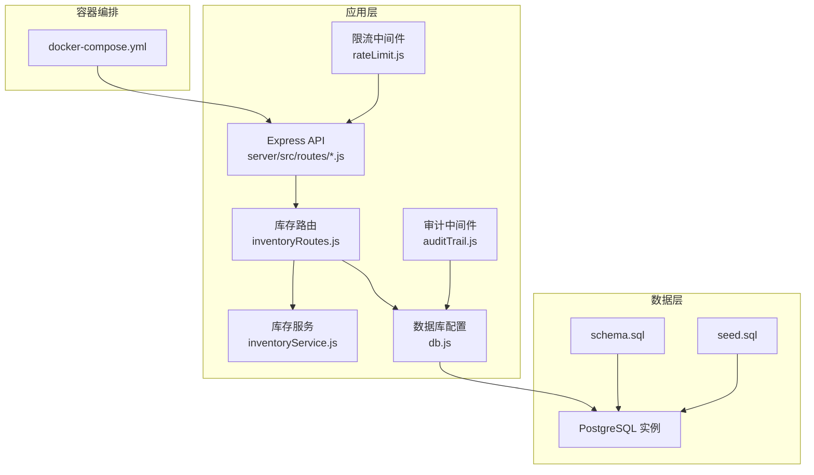
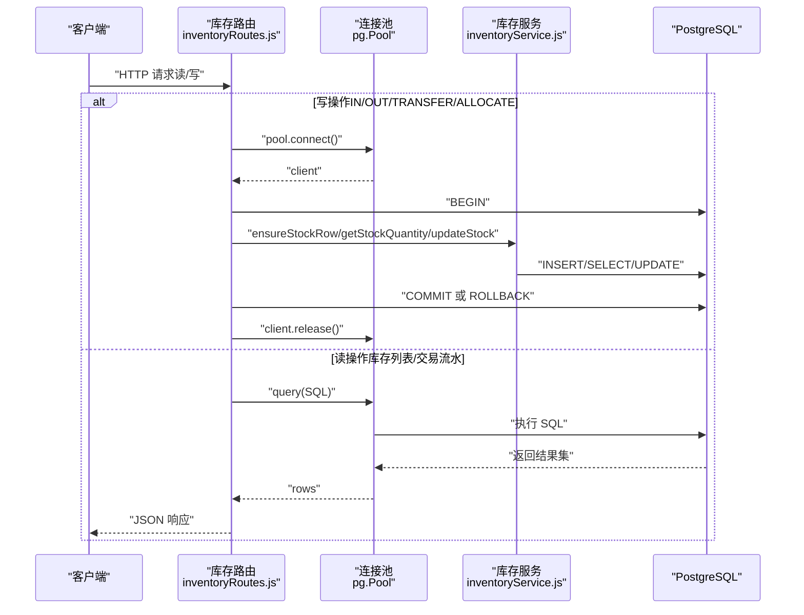
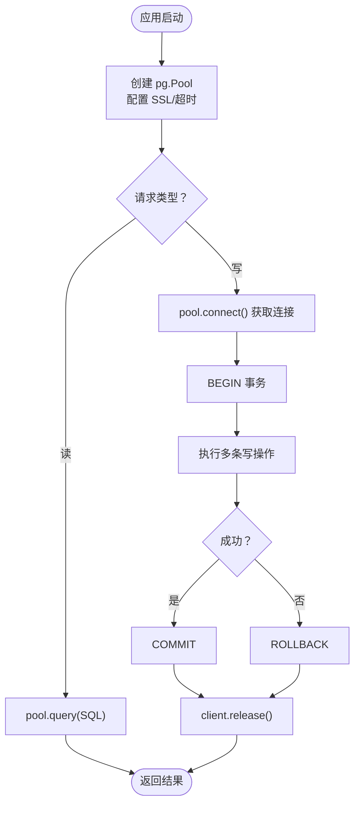
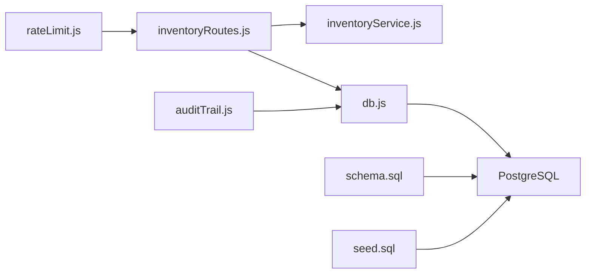

# 数据库性能优化

<cite>
**本文引用的文件**
- [server/src/config/db.js](file://server/src/config/db.js)
- [server/database/schema.sql](file://server/database/schema.sql)
- [server/database/seed.sql](file://server/database/seed.sql)
- [server/src/routes/inventoryRoutes.js](file://server/src/routes/inventoryRoutes.js)
- [server/src/utils/inventoryService.js](file://server/src/utils/inventoryService.js)
- [server/src/middleware/auditTrail.js](file://server/src/middleware/auditTrail.js)
- [server/src/middleware/rateLimit.js](file://server/src/middleware/rateLimit.js)
- [docker-compose.yml](file://docker-compose.yml)
- [package.json](file://package.json)
</cite>

## 目录
1. [简介](#简介)
2. [项目结构](#项目结构)
3. [核心组件](#核心组件)
4. [架构总览](#架构总览)
5. [详细组件分析](#详细组件分析)
6. [依赖关系分析](#依赖关系分析)
7. [性能考量](#性能考量)
8. [故障排查指南](#故障排查指南)
9. [结论](#结论)
10. [附录](#附录)

## 简介
本文件面向库存管理系统（基于 PostgreSQL 的后端）的数据库性能优化，围绕以下主题展开：PostgreSQL 连接池配置与连接管理、索引优化策略、SQL 查询优化技术、数据库分区与分表策略建议、事务优化、数据库监控指标、备份与恢复的性能考虑，并结合现有代码给出可落地的优化建议与案例。

## 项目结构
后端采用 Node.js + Express + pg.Pool 的连接池模式，数据库初始化通过 Docker Compose 启动时执行 SQL 脚本完成。库存路由模块承担主要读写路径，库存服务封装了事务内的库存行确保与更新逻辑，审计中间件在请求完成后异步写入审计日志，限流中间件用于保护 API 免受突发流量冲击。

图表来源
- [docker-compose.yml:1-57](file://docker-compose.yml#L1-L57)
- [server/src/routes/inventoryRoutes.js:1-493](file://server/src/routes/inventoryRoutes.js#L1-L493)
- [server/src/utils/inventoryService.js:1-45](file://server/src/utils/inventoryService.js#L1-L45)
- [server/src/config/db.js:1-25](file://server/src/config/db.js#L1-L25)
- [server/src/middleware/auditTrail.js:1-84](file://server/src/middleware/auditTrail.js#L1-L84)
- [server/src/middleware/rateLimit.js:1-40](file://server/src/middleware/rateLimit.js#L1-L40)
- [server/database/schema.sql:1-420](file://server/database/schema.sql#L1-L420)
- [server/database/seed.sql:1-114](file://server/database/seed.sql#L1-L114)

章节来源
- [docker-compose.yml:1-57](file://docker-compose.yml#L1-L57)
- [package.json:1-20](file://package.json#L1-L20)

## 核心组件
- 连接池与查询入口：通过 pg.Pool 提供连接池能力，统一导出 query 方法；SSL 依据连接字符串与环境变量动态启用。
- 表结构与索引：schema 定义了库存、产品、仓库、交易流水等核心表，并为高频查询字段建立索引。
- 路由与事务：库存路由在写操作中显式获取连接、开启事务、提交或回滚，并释放连接；读取路径采用连接池并发查询。
- 库存服务：封装库存行存在性保证、查询与更新，减少重复事务代码。
- 审计与限流：审计中间件在响应完成后异步写入审计日志；限流中间件基于内存桶进行速率限制。

章节来源
- [server/src/config/db.js:1-25](file://server/src/config/db.js#L1-L25)
- [server/database/schema.sql:1-420](file://server/database/schema.sql#L1-L420)
- [server/src/routes/inventoryRoutes.js:1-493](file://server/src/routes/inventoryRoutes.js#L1-L493)
- [server/src/utils/inventoryService.js:1-45](file://server/src/utils/inventoryService.js#L1-L45)
- [server/src/middleware/auditTrail.js:1-84](file://server/src/middleware/auditTrail.js#L1-L84)
- [server/src/middleware/rateLimit.js:1-40](file://server/src/middleware/rateLimit.js#L1-L40)

## 架构总览
下图展示从客户端到数据库的关键交互路径，以及连接池、事务与索引在其中的作用。

图表来源
- [server/src/routes/inventoryRoutes.js:230-403](file://server/src/routes/inventoryRoutes.js#L230-L403)
- [server/src/utils/inventoryService.js:1-45](file://server/src/utils/inventoryService.js#L1-L45)
- [server/src/config/db.js:15-24](file://server/src/config/db.js#L15-L24)

## 详细组件分析

### 连接池与连接管理
- 连接池初始化：通过 pg.Pool 创建连接池，支持根据连接字符串与环境变量动态启用 SSL；提供连接超时配置项。
- 连接生命周期：写操作显式从池中获取连接，开启事务，执行多条语句后提交或回滚，并释放连接；读操作直接使用连接池 query 执行 SQL。
- SSL 与超时：当连接目标非本地且满足条件时启用 SSL；连接超时可通过环境变量配置，默认值来自配置文件。

图表来源
- [server/src/config/db.js:15-24](file://server/src/config/db.js#L15-L24)
- [server/src/routes/inventoryRoutes.js:238-402](file://server/src/routes/inventoryRoutes.js#L238-L402)

章节来源
- [server/src/config/db.js:1-25](file://server/src/config/db.js#L1-L25)
- [server/src/routes/inventoryRoutes.js:230-403](file://server/src/routes/inventoryRoutes.js#L230-L403)

### 索引优化策略
- 复合索引设计：针对多列过滤与排序的场景，如 stock_levels(product_id, warehouse_id)、marketplace_orders(channel, order_status) 等，可显著降低全表扫描成本。
- 覆盖索引：对频繁查询且仅需少量列的场景，可考虑创建覆盖索引以避免回表（例如基于常用查询选择列表的组合索引）。
- 查询计划分析：建议使用 EXPLAIN/EXPLAIN ANALYZE 对热点查询进行分析，确认是否命中预期索引、是否存在不必要的排序或隐式函数导致索引失效。

章节来源
- [server/database/schema.sql:385-420](file://server/database/schema.sql#L385-L420)

### SQL 查询优化技术
- 查询重写：将 OR 条件改写为 IN 或使用 EXISTS/JOIN，减少重复扫描；对模糊匹配使用前缀匹配或 GIN/GIST 索引（视具体字段类型而定）。
- 执行计划分析：定期对慢查询执行 EXPLAIN，关注“计划成本”、“实际时间”、“索引扫描/顺序扫描”等指标。
- 慢查询监控：建议在生产环境开启慢查询日志（例如 log_min_duration_statement），并结合 APM 工具定位瓶颈。

章节来源
- [server/src/routes/inventoryRoutes.js:17-151](file://server/src/routes/inventoryRoutes.js#L17-L151)
- [server/src/routes/inventoryRoutes.js:154-227](file://server/src/routes/inventoryRoutes.js#L154-L227)

### 数据库分区与分表策略
- 按时间分区：对历史数据量大的表（如 stock_movements、marketplace_inventory_snapshots、audit_logs）按时间分区，保留近期热数据在主表，归档旧数据至分区，降低扫描范围。
- 按业务维度分表：对高并发的维度（如按仓库或渠道）进行分表，配合路由层的路由规则实现水平拆分，降低单表写压力。
- 注意事项：分区/分表需要在应用层或中间件层进行路由与聚合，确保查询与统计仍可跨分片执行。

章节来源
- [server/database/schema.sql:237-288](file://server/database/schema.sql#L237-L288)
- [server/database/schema.sql:137-194](file://server/database/schema.sql#L137-L194)

### 事务优化
- 事务粒度控制：将相关写操作放入同一事务，减少锁竞争与冲突；避免长事务持有行级锁过久。
- 死锁预防：统一更新顺序（如先源仓后目的仓）、缩短事务时间、减少交叉锁等待；对并发写入进行重试与幂等设计。
- 并发控制：写路径使用显式连接与事务，读路径使用连接池并发查询，避免阻塞。

章节来源
- [server/src/routes/inventoryRoutes.js:230-403](file://server/src/routes/inventoryRoutes.js#L230-L403)
- [server/src/utils/inventoryService.js:1-45](file://server/src/utils/inventoryService.js#L1-L45)

### 数据库监控指标
- 连接数：监控活跃连接数、空闲连接数、等待连接数，防止连接池耗尽。
- 查询响应时间：对关键路由（库存列表、交易流水）进行端到端响应时间监控。
- 缓冲区命中率：关注共享缓冲区命中率，必要时调优 shared_buffers、effective_cache_size 等参数。
- 慢查询：记录慢查询数量与占比，持续优化热点 SQL。

章节来源
- [server/src/middleware/auditTrail.js:47-79](file://server/src/middleware/auditTrail.js#L47-L79)

### 备份与恢复的性能考虑
- 备份策略：采用逻辑备份（如 pg_dump/pg_restore）进行增量与全量结合，避免在线备份对生产造成过大影响。
- 恢复演练：定期进行恢复演练，验证备份完整性与恢复速度，确保在故障时能快速回退。
- 影响最小化：在低峰期执行备份，使用并行备份工具提升效率；对大表采用分段备份与并行恢复。

## 依赖关系分析

图表来源
- [server/src/routes/inventoryRoutes.js:1-493](file://server/src/routes/inventoryRoutes.js#L1-L493)
- [server/src/utils/inventoryService.js:1-45](file://server/src/utils/inventoryService.js#L1-L45)
- [server/src/config/db.js:1-25](file://server/src/config/db.js#L1-L25)
- [server/src/middleware/auditTrail.js:1-84](file://server/src/middleware/auditTrail.js#L1-L84)
- [server/src/middleware/rateLimit.js:1-40](file://server/src/middleware/rateLimit.js#L1-L40)
- [server/database/schema.sql:1-420](file://server/database/schema.sql#L1-L420)
- [server/database/seed.sql:1-114](file://server/database/seed.sql#L1-L114)

章节来源
- [server/src/routes/inventoryRoutes.js:1-493](file://server/src/routes/inventoryRoutes.js#L1-L493)
- [server/src/utils/inventoryService.js:1-45](file://server/src/utils/inventoryService.js#L1-L45)
- [server/src/config/db.js:1-25](file://server/src/config/db.js#L1-L25)
- [server/src/middleware/auditTrail.js:1-84](file://server/src/middleware/auditTrail.js#L1-L84)
- [server/src/middleware/rateLimit.js:1-40](file://server/src/middleware/rateLimit.js#L1-L40)
- [server/database/schema.sql:1-420](file://server/database/schema.sql#L1-L420)
- [server/database/seed.sql:1-114](file://server/database/seed.sql#L1-L114)

## 性能考量
- 连接池参数建议（示例方向）：最大连接数与超时应结合并发峰值与数据库资源评估；在高并发场景下，适当提高最大连接数并缩短连接超时，避免排队与僵尸连接。
- 索引维护：定期分析表统计信息，重建碎片化索引；对新增索引进行 A/B 测试，评估写入开销与查询收益。
- 查询优化：优先优化热点路由（库存列表、交易流水），确保 WHERE/ORDER/LIMIT 子句充分利用索引；避免在 WHERE 中对列施加函数或类型转换。
- 分区与分表：对历史数据量大的表实施分区或分表，减少扫描范围；在应用层实现路由与聚合逻辑。
- 事务与锁：缩短事务时间，统一更新顺序，减少锁冲突；对失败重试进行指数退避与幂等设计。
- 监控与告警：建立连接数、响应时间、慢查询、缓冲命中率等指标的监控与告警，持续优化。

## 故障排查指南
- 连接池耗尽：检查活跃连接数与等待队列长度，适当增加最大连接数或优化超时配置；确认未遗漏释放连接。
- 写入缓慢：分析库存写入路径的事务成本，确认索引是否命中；检查是否存在长事务或锁等待。
- 慢查询：对热点路由执行 EXPLAIN，识别全表扫描或隐式函数导致的索引失效；必要时调整索引或查询重写。
- 审计日志异常：审计中间件在响应完成后异步写入，若出现失败不影响主流程，但需关注错误日志并进行重试或降级处理。
- 限流触发：检查限流窗口与阈值，确认是否误伤正常用户；对白名单或特定接口进行豁免。

章节来源
- [server/src/config/db.js:15-24](file://server/src/config/db.js#L15-L24)
- [server/src/routes/inventoryRoutes.js:230-403](file://server/src/routes/inventoryRoutes.js#L230-L403)
- [server/src/middleware/auditTrail.js:47-79](file://server/src/middleware/auditTrail.js#L47-L79)
- [server/src/middleware/rateLimit.js:9-35](file://server/src/middleware/rateLimit.js#L9-L35)

## 结论
通过对连接池、索引、SQL 查询、事务、分区与监控等方面的系统性优化，可显著提升库存管理系统的数据库性能与稳定性。建议在生产环境中持续监控关键指标，定期进行查询计划分析与索引健康检查，并结合业务增长趋势迭代分区与分表策略。

## 附录
- 环境变量与配置参考：连接字符串、SSL 模式、连接超时等参数可在数据库配置文件中查看与调整。
- 初始化脚本：通过 schema.sql 与 seed.sql 在首次启动时完成表结构与基础数据初始化。

章节来源
- [server/src/config/db.js:13-19](file://server/src/config/db.js#L13-L19)
- [server/database/schema.sql:1-420](file://server/database/schema.sql#L1-L420)
- [server/database/seed.sql:1-114](file://server/database/seed.sql#L1-L114)
- [docker-compose.yml:6-15](file://docker-compose.yml#L6-L15)