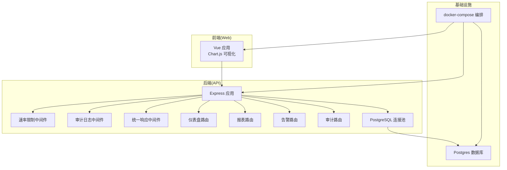
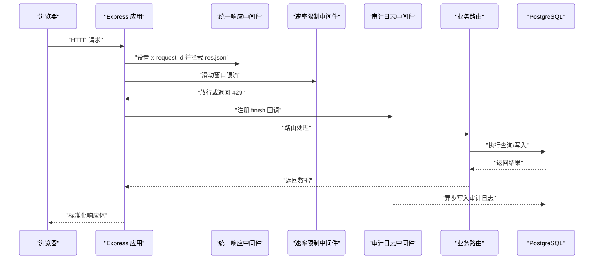
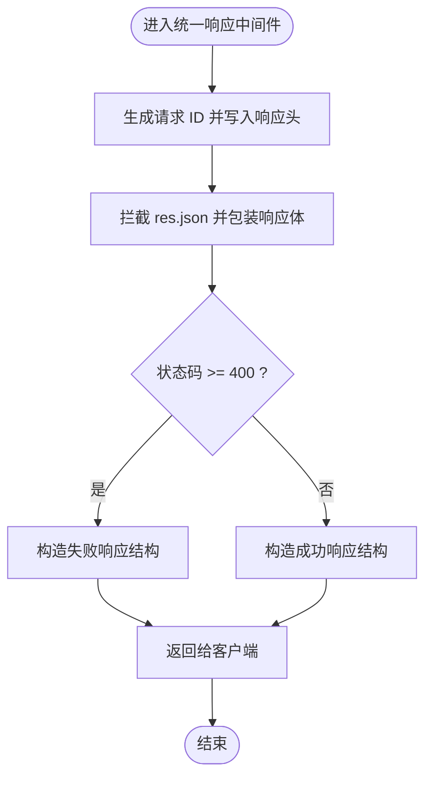
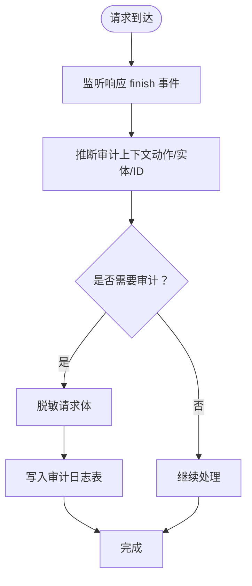
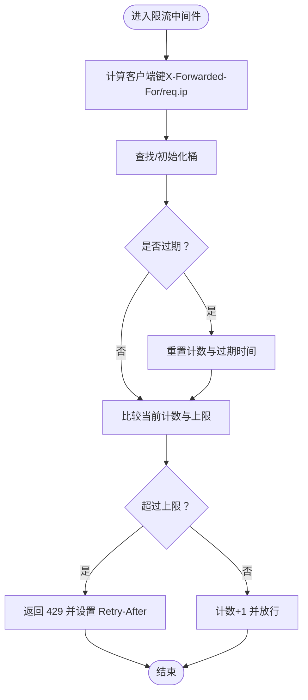
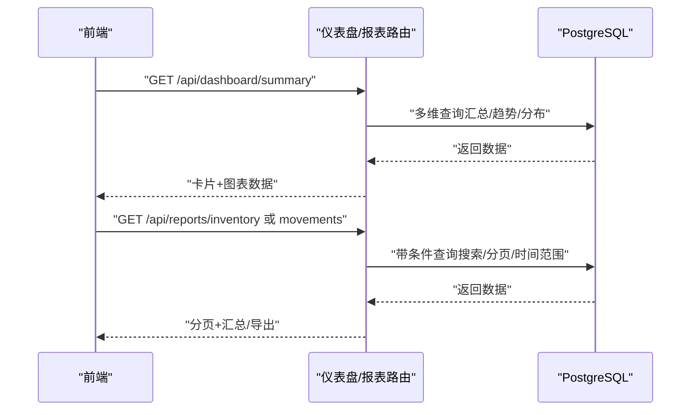
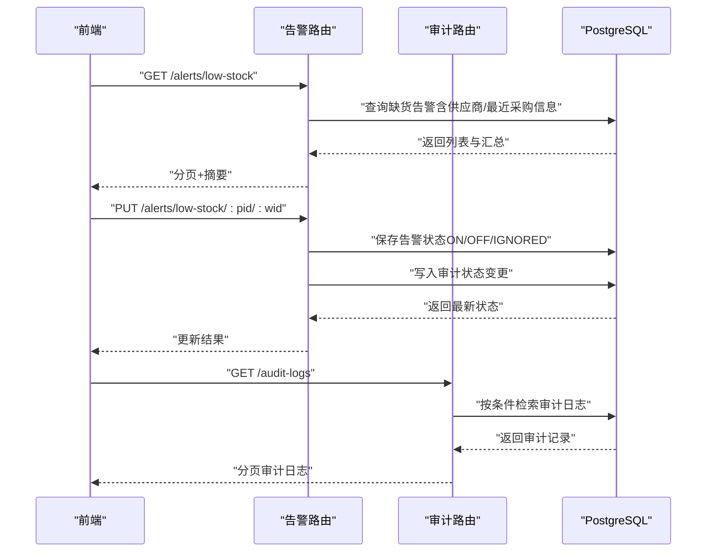
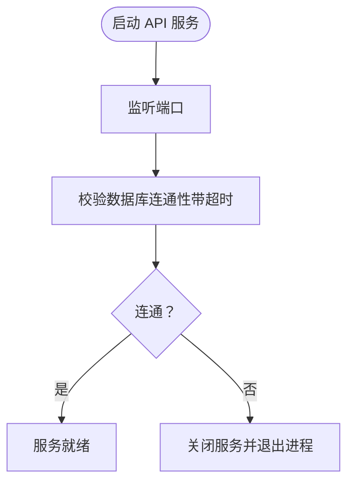
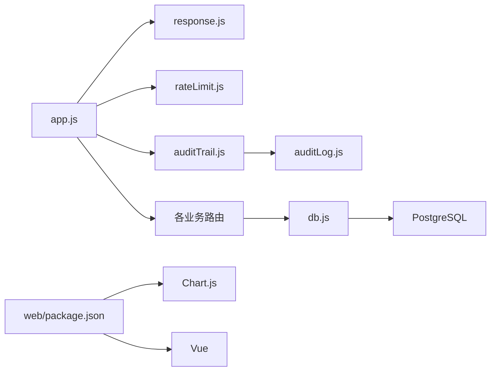

# 监控与指标

<cite>
**本文引用的文件**   
- [server/src/app.js](file://server/src/app.js)
- [server/src/server.js](file://server/src/server.js)
- [server/src/config/db.js](file://server/src/config/db.js)
- [server/src/middleware/auditTrail.js](file://server/src/middleware/auditTrail.js)
- [server/src/utils/auditLog.js](file://server/src/utils/auditLog.js)
- [server/src/middleware/rateLimit.js](file://server/src/middleware/rateLimit.js)
- [server/src/middleware/response.js](file://server/src/middleware/response.js)
- [server/src/routes/dashboardRoutes.js](file://server/src/routes/dashboardRoutes.js)
- [server/src/routes/reportRoutes.js](file://server/src/routes/reportRoutes.js)
- [server/src/routes/alertsRoutes.js](file://server/src/routes/alertsRoutes.js)
- [server/src/routes/auditRoutes.js](file://server/src/routes/auditRoutes.js)
- [docker-compose.yml](file://docker-compose.yml)
- [server/package.json](file://server/package.json)
- [web/package.json](file://web/package.json)
</cite>

## 目录
1. [引言](#引言)
2. [项目结构](#项目结构)
3. [核心组件](#核心组件)
4. [架构总览](#架构总览)
5. [详细组件分析](#详细组件分析)
6. [依赖关系分析](#依赖关系分析)
7. [性能考量](#性能考量)
8. [故障排查指南](#故障排查指南)
9. [结论](#结论)
10. [附录](#附录)

## 引言
本文件面向库存管理系统，构建一套完整的监控与指标方案，覆盖应用性能监控（APM）、日志监控、业务指标监控、实时监控面板、性能基线、告警机制、监控数据存储与分析，以及最佳实践与故障排查流程。文档以仓库现有代码为依据，结合容器编排与数据库连接配置，给出可落地的监控建议与实施路径。

## 项目结构
后端基于 Express 应用，通过中间件统一注入审计、速率限制、响应格式化与日志；路由层提供仪表盘、报表、告警与审计等接口；数据库使用 PostgreSQL 连接池；前端采用 Vue 生态与 Chart.js 可视化。容器编排通过 docker-compose 启动数据库、API 与 Web 前端服务。

图表来源
- [server/src/app.js:1-91](file://server/src/app.js#L1-L91)
- [server/src/middleware/rateLimit.js:1-40](file://server/src/middleware/rateLimit.js#L1-L40)
- [server/src/middleware/auditTrail.js:1-86](file://server/src/middleware/auditTrail.js#L1-L86)
- [server/src/middleware/response.js:1-62](file://server/src/middleware/response.js#L1-L62)
- [server/src/routes/dashboardRoutes.js:1-137](file://server/src/routes/dashboardRoutes.js#L1-L137)
- [server/src/routes/reportRoutes.js:1-261](file://server/src/routes/reportRoutes.js#L1-L261)
- [server/src/routes/alertsRoutes.js:1-311](file://server/src/routes/alertsRoutes.js#L1-L311)
- [server/src/routes/auditRoutes.js:1-113](file://server/src/routes/auditRoutes.js#L1-L113)
- [server/src/config/db.js:1-29](file://server/src/config/db.js#L1-L29)
- [docker-compose.yml:1-57](file://docker-compose.yml#L1-L57)

章节来源
- [server/src/app.js:1-91](file://server/src/app.js#L1-L91)
- [docker-compose.yml:1-57](file://docker-compose.yml#L1-L57)

## 核心组件
- 应用入口与中间件
  - 安全与日志：Helmet、CORS、Morgan 日志输出
  - 统一响应：生成 x-request-id，规范化成功/失败响应结构
  - 审计日志：自动记录变更类操作与登录事件
  - 速率限制：基于内存桶的滑动窗口限流
- 路由与业务指标
  - 仪表盘：汇总卡片、最近流水、缺货预览、趋势与分布
  - 报表：库存报表、流水报表（支持搜索、分页、导出）
  - 告警：缺货告警列表、状态更新、批量更新
  - 审计：管理员/主管可查询审计日志
- 数据库与连接
  - PostgreSQL 连接池，支持 SSL 切换与超时控制
- 容器编排
  - db、api、web 三服务，db 健康检查，api 启动时校验数据库连通性

章节来源
- [server/src/app.js:47-88](file://server/src/app.js#L47-L88)
- [server/src/middleware/response.js:1-62](file://server/src/middleware/response.js#L1-L62)
- [server/src/middleware/auditTrail.js:1-86](file://server/src/middleware/auditTrail.js#L1-L86)
- [server/src/middleware/rateLimit.js:1-40](file://server/src/middleware/rateLimit.js#L1-L40)
- [server/src/routes/dashboardRoutes.js:1-137](file://server/src/routes/dashboardRoutes.js#L1-L137)
- [server/src/routes/reportRoutes.js:1-261](file://server/src/routes/reportRoutes.js#L1-L261)
- [server/src/routes/alertsRoutes.js:1-311](file://server/src/routes/alertsRoutes.js#L1-L311)
- [server/src/routes/auditRoutes.js:1-113](file://server/src/routes/auditRoutes.js#L1-L113)
- [server/src/config/db.js:1-29](file://server/src/config/db.js#L1-L29)
- [server/src/server.js:1-28](file://server/src/server.js#L1-L28)
- [docker-compose.yml:1-57](file://docker-compose.yml#L1-L57)

## 架构总览
下图展示从浏览器到数据库的典型调用链路，以及审计与速率限制在链路中的位置。

图表来源
- [server/src/app.js:47-88](file://server/src/app.js#L47-L88)
- [server/src/middleware/response.js:1-62](file://server/src/middleware/response.js#L1-L62)
- [server/src/middleware/rateLimit.js:1-40](file://server/src/middleware/rateLimit.js#L1-L40)
- [server/src/middleware/auditTrail.js:1-86](file://server/src/middleware/auditTrail.js#L1-L86)
- [server/src/config/db.js:1-29](file://server/src/config/db.js#L1-L29)

## 详细组件分析

### 统一响应中间件（标准化输出与追踪）
- 功能要点
  - 为每个请求生成唯一请求 ID，并写入响应头
  - 自动将响应体包装为统一结构，区分成功/失败场景
  - 提供 res.success/res.fail 辅助方法
- 指标关联
  - 可用于下游埋点：以 x-request-id 关联日志、追踪与告警
  - 便于前端统一错误处理与重试策略

图表来源
- [server/src/middleware/response.js:1-62](file://server/src/middleware/response.js#L1-L62)

章节来源
- [server/src/middleware/response.js:1-62](file://server/src/middleware/response.js#L1-L62)

### 审计日志中间件（自动审计与结构化元数据）
- 功能要点
  - 在响应完成时推断上下文（动作类型、实体类型、实体 ID）
  - 对敏感字段进行脱敏（如密码）
  - 将审计记录写入数据库，包含方法、路径、状态码、元数据等
- 指标关联
  - 可作为合规与风控的数据来源
  - 支持审计报表与异常行为识别

图表来源
- [server/src/middleware/auditTrail.js:1-86](file://server/src/middleware/auditTrail.js#L1-L86)
- [server/src/utils/auditLog.js:1-40](file://server/src/utils/auditLog.js#L1-L40)

章节来源
- [server/src/middleware/auditTrail.js:1-86](file://server/src/middleware/auditTrail.js#L1-L86)
- [server/src/utils/auditLog.js:1-40](file://server/src/utils/auditLog.js#L1-L40)

### 速率限制中间件（防刷与稳定性保护）
- 功能要点
  - 基于内存 Map 的滑动窗口限流
  - 支持命名空间与窗口大小配置
  - 触发限流时返回 429 与 Retry-After 头
- 指标关联
  - 可统计 429 次数、触发 IP、窗口命中率
  - 作为弹性伸缩与容量规划参考

图表来源
- [server/src/middleware/rateLimit.js:1-40](file://server/src/middleware/rateLimit.js#L1-L40)

章节来源
- [server/src/middleware/rateLimit.js:1-40](file://server/src/middleware/rateLimit.js#L1-L40)

### 仪表盘与报表（业务指标承载）
- 仪表盘路由
  - 卡片：商品数、仓库数、缺货项、总在手数量
  - 最近流水、缺货预览、月度出入库趋势、按仓库/分类的库存分布
- 报表路由
  - 库存报表：支持搜索、分页、导出；按租户隔离
  - 流水报表：支持时间范围、关键词搜索、分页、导出
- 指标关联
  - 仪表盘卡片与图表即业务 KPI 的可视化载体
  - 报表为离线分析与导出提供数据基础

图表来源
- [server/src/routes/dashboardRoutes.js:1-137](file://server/src/routes/dashboardRoutes.js#L1-L137)
- [server/src/routes/reportRoutes.js:1-261](file://server/src/routes/reportRoutes.js#L1-L261)

章节来源
- [server/src/routes/dashboardRoutes.js:1-137](file://server/src/routes/dashboardRoutes.js#L1-L137)
- [server/src/routes/reportRoutes.js:1-261](file://server/src/routes/reportRoutes.js#L1-L261)

### 告警与审计（运维与合规）
- 告警路由
  - 查询缺货告警列表（支持搜索、筛选、分页）
  - 更新单个/批量告警状态、指派与备注
  - 写入低库存告警状态表并触发审计上下文
- 审计路由
  - 管理员/主管角色可查询审计日志（按时间、动作、实体类型过滤）
- 指标关联
  - 告警状态变化可作为运营处置效率指标
  - 审计日志为合规与问题回溯提供证据链

图表来源
- [server/src/routes/alertsRoutes.js:1-311](file://server/src/routes/alertsRoutes.js#L1-L311)
- [server/src/routes/auditRoutes.js:1-113](file://server/src/routes/auditRoutes.js#L1-L113)

章节来源
- [server/src/routes/alertsRoutes.js:1-311](file://server/src/routes/alertsRoutes.js#L1-L311)
- [server/src/routes/auditRoutes.js:1-113](file://server/src/routes/auditRoutes.js#L1-L113)

### 数据库连接与启动健康检查
- 连接池
  - 支持根据连接字符串与环境变量动态切换 SSL
  - 设置连接超时，避免启动阻塞
- 启动流程
  - 应用启动后先验证数据库连通性，失败则退出进程
- 指标关联
  - 可将连接池等待时间、超时次数纳入 APM 指标
  - 启动失败事件可用于 SLO 告警

图表来源
- [server/src/server.js:1-28](file://server/src/server.js#L1-L28)
- [server/src/config/db.js:1-29](file://server/src/config/db.js#L1-L29)

章节来源
- [server/src/server.js:1-28](file://server/src/server.js#L1-L28)
- [server/src/config/db.js:1-29](file://server/src/config/db.js#L1-L29)

## 依赖关系分析
- 中间件耦合
  - 审计中间件依赖数据库连接与审计工具函数
  - 统一响应中间件被所有路由共享，影响可观测性一致性
  - 速率限制中间件独立，但需注意反向代理的 X-Forwarded-For 透传
- 路由与数据
  - 仪表盘/报表/告警/审计均依赖数据库查询，且遵循租户隔离
- 外部依赖
  - Express、Morgan、Helmet、CORS、pg
  - 前端依赖 Chart.js、vue、vue-router、pinia

图表来源
- [server/src/app.js:1-91](file://server/src/app.js#L1-L91)
- [server/src/middleware/response.js:1-62](file://server/src/middleware/response.js#L1-L62)
- [server/src/middleware/rateLimit.js:1-40](file://server/src/middleware/rateLimit.js#L1-L40)
- [server/src/middleware/auditTrail.js:1-86](file://server/src/middleware/auditTrail.js#L1-L86)
- [server/src/utils/auditLog.js:1-40](file://server/src/utils/auditLog.js#L1-L40)
- [server/src/config/db.js:1-29](file://server/src/config/db.js#L1-L29)
- [web/package.json:1-34](file://web/package.json#L1-L34)

章节来源
- [server/src/app.js:1-91](file://server/src/app.js#L1-L91)
- [server/src/config/db.js:1-29](file://server/src/config/db.js#L1-L29)
- [web/package.json:1-34](file://web/package.json#L1-L34)

## 性能考量
- 启动与连接
  - 启动阶段对数据库进行超时校验，避免长时间阻塞
  - 连接池参数可根据实例规格与并发峰值调整
- 路由查询
  - 仪表盘与报表涉及多表关联与聚合，建议在关键列建立索引（如 tenant_id、created_at、product_id、warehouse_id）
- 中间件开销
  - 审计日志为异步写入，避免阻塞主请求链路
  - 速率限制使用内存 Map，建议在多实例部署时考虑集中式限流或 Redis
- 前端可视化
  - 图表渲染与大数据量导出会消耗资源，建议前端分页与懒加载

章节来源
- [server/src/server.js:1-28](file://server/src/server.js#L1-L28)
- [server/src/config/db.js:1-29](file://server/src/config/db.js#L1-L29)
- [server/src/middleware/auditTrail.js:1-86](file://server/src/middleware/auditTrail.js#L1-L86)
- [server/src/routes/dashboardRoutes.js:1-137](file://server/src/routes/dashboardRoutes.js#L1-L137)
- [server/src/routes/reportRoutes.js:1-261](file://server/src/routes/reportRoutes.js#L1-L261)

## 故障排查指南
- 启动失败（数据库不可达）
  - 现象：启动后立即退出
  - 排查：检查 DATABASE_URL、网络连通、SSL 配置、启动超时参数
  - 参考
    - [server/src/server.js:18-24](file://server/src/server.js#L18-L24)
    - [server/src/config/db.js:17-23](file://server/src/config/db.js#L17-L23)
- 429 频繁
  - 现象：客户端收到 429 且带有 Retry-After
  - 排查：确认限流窗口与上限配置、反代 X-Forwarded-For 是否透传
  - 参考
    - [server/src/middleware/rateLimit.js:9-35](file://server/src/middleware/rateLimit.js#L9-L35)
- 审计日志缺失
  - 现象：变更未落库
  - 排查：确认审计中间件已注册、finish 事件是否触发、数据库写入异常
  - 参考
    - [server/src/middleware/auditTrail.js:47-81](file://server/src/middleware/auditTrail.js#L47-L81)
    - [server/src/utils/auditLog.js:1-40](file://server/src/utils/auditLog.js#L1-L40)
- 响应格式异常
  - 现象：前端无法解析统一响应
  - 排查：确认统一响应中间件顺序、res.success/res.fail 使用方式
  - 参考
    - [server/src/middleware/response.js:1-62](file://server/src/middleware/response.js#L1-L62)
- 容器健康检查
  - 现象：容器反复重启
  - 排查：查看 db 健康检查与 api 依赖条件
  - 参考
    - [docker-compose.yml:16-20](file://docker-compose.yml#L16-L20)
    - [docker-compose.yml:40-42](file://docker-compose.yml#L40-L42)

章节来源
- [server/src/server.js:18-24](file://server/src/server.js#L18-L24)
- [server/src/config/db.js:17-23](file://server/src/config/db.js#L17-L23)
- [server/src/middleware/rateLimit.js:9-35](file://server/src/middleware/rateLimit.js#L9-L35)
- [server/src/middleware/auditTrail.js:47-81](file://server/src/middleware/auditTrail.js#L47-L81)
- [server/src/utils/auditLog.js:1-40](file://server/src/utils/auditLog.js#L1-L40)
- [server/src/middleware/response.js:1-62](file://server/src/middleware/response.js#L1-L62)
- [docker-compose.yml:16-20](file://docker-compose.yml#L16-L20)
- [docker-compose.yml:40-42](file://docker-compose.yml#L40-L42)

## 结论
本监控方案以现有代码为基础，围绕统一响应、审计日志、速率限制与路由查询构建观测闭环。通过仪表盘与报表承载业务 KPI，结合审计与告警完善合规与运营能力。建议后续引入 APM 工具采集时延与错误率、接入日志聚合平台实现结构化日志与异常告警，并建立性能基线与告警策略，持续优化系统稳定性与可观测性。

## 附录

### APM 关键性能指标（KPI）定义与采集建议
- 后端 KPI
  - 响应时延（P50/P90/P95）、吞吐（RPS）、错误率（5xx/429）
  - 连接池等待时间、超时次数、活跃连接数
  - 审计写入延迟、失败次数
- 前端 KPI
  - 页面首屏时间、交互响应时间、图表渲染耗时
- 采集建议
  - 使用 APM 工具（如 Prometheus + Grafana、CloudWatch、New Relic）采集后端指标
  - 前端埋点上报页面性能与用户行为
  - 通过统一响应中间件的请求 ID 实现端到端追踪

章节来源
- [server/src/middleware/response.js:1-62](file://server/src/middleware/response.js#L1-L62)
- [server/src/middleware/auditTrail.js:1-86](file://server/src/middleware/auditTrail.js#L1-L86)
- [server/src/config/db.js:1-29](file://server/src/config/db.js#L1-L29)

### 日志监控策略
- 结构化日志
  - 使用统一响应中间件输出标准化 JSON 日志，包含请求 ID、状态码、耗时
  - 审计日志记录操作人、实体、方法、路径、元数据
- 日志聚合
  - 将 Morgan 输出与应用日志统一收集至日志平台（如 ELK/Cloud Logging）
- 异常告警
  - 基于错误率、异常堆栈关键字、审计失败事件设置阈值与趋势告警

章节来源
- [server/src/app.js:57-58](file://server/src/app.js#L57-L58)
- [server/src/middleware/response.js:1-62](file://server/src/middleware/response.js#L1-L62)
- [server/src/middleware/auditTrail.js:1-86](file://server/src/middleware/auditTrail.js#L1-L86)
- [server/src/utils/auditLog.js:1-40](file://server/src/utils/auditLog.js#L1-L40)

### 业务指标监控
- 库存周转率
  - 公式：销售成本 / 平均库存
  - 数据来源：流水报表中的出库记录与库存报表的期末在手
- 订单处理时间
  - 从下单到发货/完成的时间差，可通过订单相关报表与审计日志推导
- 用户活跃度
  - 登录次数、关键操作频次（新增/修改/删除），来源于审计日志与登录事件

章节来源
- [server/src/routes/reportRoutes.js:1-261](file://server/src/routes/reportRoutes.js#L1-L261)
- [server/src/routes/alertsRoutes.js:1-311](file://server/src/routes/alertsRoutes.js#L1-L311)
- [server/src/middleware/auditTrail.js:1-86](file://server/src/middleware/auditTrail.js#L1-L86)

### 实时监控面板（仪表板设计）
- 仪表盘卡片：商品数、仓库数、缺货项、总在手数量
- 图表：月度出入库趋势、按仓库/分类的库存分布
- 设计建议
  - 分层展示：概览卡片 + 下钻图表 + 最近流水
  - 时间维度：支持近 N 月/季/年对比
  - 权限隔离：按租户维度展示

章节来源
- [server/src/routes/dashboardRoutes.js:1-137](file://server/src/routes/dashboardRoutes.js#L1-L137)

### 性能基线与异常检测
- 正常值范围
  - 基于历史数据计算 P50/P90/P95 时延与错误率阈值
  - 连接池等待时间与超时次数的基线
- 异常检测
  - 统计方法：3σ、分位数、移动平均
  - 机器学习：孤立森林、One-Class SVM（高级场景）

章节来源
- [server/src/server.js:1-28](file://server/src/server.js#L1-L28)
- [server/src/config/db.js:1-29](file://server/src/config/db.js#L1-L29)

### 监控告警机制
- 阈值告警
  - 错误率、时延、连接池等待、429 次数
- 趋势告警
  - 连续 N 个周期上升幅度超过阈值
- 复合告警
  - 时延升高 + 错误率上升 + 连接池等待激增
- 告警收敛
  - 同一指标在窗口内去重、静默与抑制

章节来源
- [server/src/middleware/rateLimit.js:9-35](file://server/src/middleware/rateLimit.js#L9-L35)
- [server/src/middleware/response.js:1-62](file://server/src/middleware/response.js#L1-L62)

### 监控数据存储与分析
- 时序数据库
  - Prometheus（PromQL 查询与告警）、InfluxDB（高写入场景）
- 分析方法
  - 聚合分析：按小时/天/周聚合指标
  - 回归分析：定位异常波动根因
  - 相关性分析：时延与错误率、连接池等待的关系

章节来源
- [server/src/config/db.js:1-29](file://server/src/config/db.js#L1-L29)

### 监控最佳实践
- 统一日志与追踪：以请求 ID 关联日志、指标与链路
- 渐进式埋点：先关键路径，再扩展到全链路
- 告警分级：P0（业务中断）、P1（SLA 偏离）、P2（潜在风险）
- 可视化优先：以仪表板驱动问题发现与根因定位

章节来源
- [server/src/middleware/response.js:1-62](file://server/src/middleware/response.js#L1-L62)
- [server/src/middleware/auditTrail.js:1-86](file://server/src/middleware/auditTrail.js#L1-L86)

### 故障排查流程
- 快速定位
  - 查看启动日志与数据库健康检查
  - 检查统一响应中间件是否生效
  - 审计日志是否写入成功
- 深入分析
  - 结合请求 ID 串联日志、指标与数据库慢查询
  - 评估限流策略与前端重试逻辑
- 复盘改进
  - 补充缺失指标、优化阈值与告警策略、完善容灾预案

章节来源
- [server/src/server.js:18-24](file://server/src/server.js#L18-L24)
- [server/src/middleware/response.js:1-62](file://server/src/middleware/response.js#L1-L62)
- [server/src/middleware/auditTrail.js:47-81](file://server/src/middleware/auditTrail.js#L47-L81)
- [docker-compose.yml:16-20](file://docker-compose.yml#L16-L20)

### 监控配置示例与告警规则（示例性描述）
- 配置示例
  - 启动超时：通过环境变量设置启动数据库超时
    - [server/src/server.js:19-20](file://server/src/server.js#L19-L20)
  - SSL 切换：根据连接字符串与环境变量决定是否启用 SSL
    - [server/src/config/db.js:3-15](file://server/src/config/db.js#L3-L15)
  - 速率限制：窗口 60s、最大 30 次
    - [server/src/middleware/rateLimit.js:9-35](file://server/src/middleware/rateLimit.js#L9-L35)
- 告警规则（示例）
  - 错误率 > 1%（5 分钟滚动窗口）
  - 时延 P95 > 阈值（N 秒）
  - 429 次数 > 阈值（每分钟）
  - 连接池等待时间 > 阈值（连续 3 个周期）

章节来源
- [server/src/server.js:19-20](file://server/src/server.js#L19-L20)
- [server/src/config/db.js:3-15](file://server/src/config/db.js#L3-L15)
- [server/src/middleware/rateLimit.js:9-35](file://server/src/middleware/rateLimit.js#L9-L35)