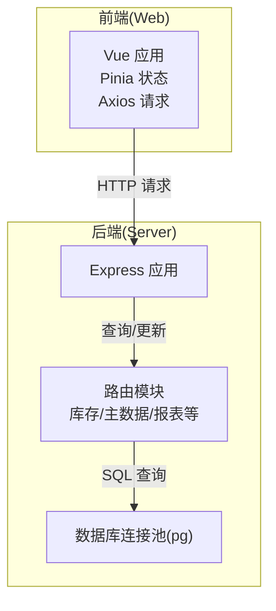
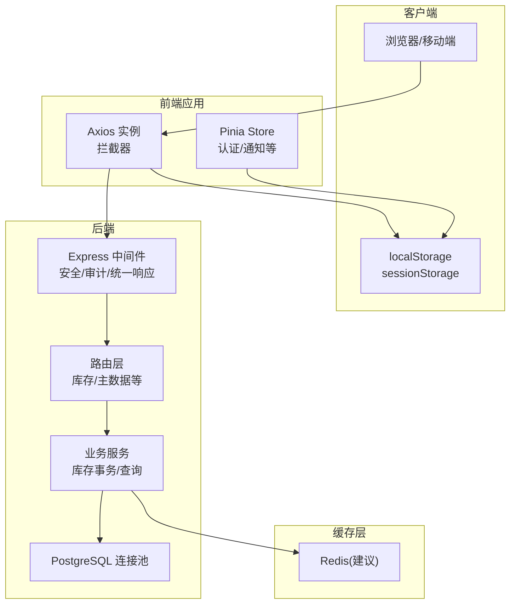
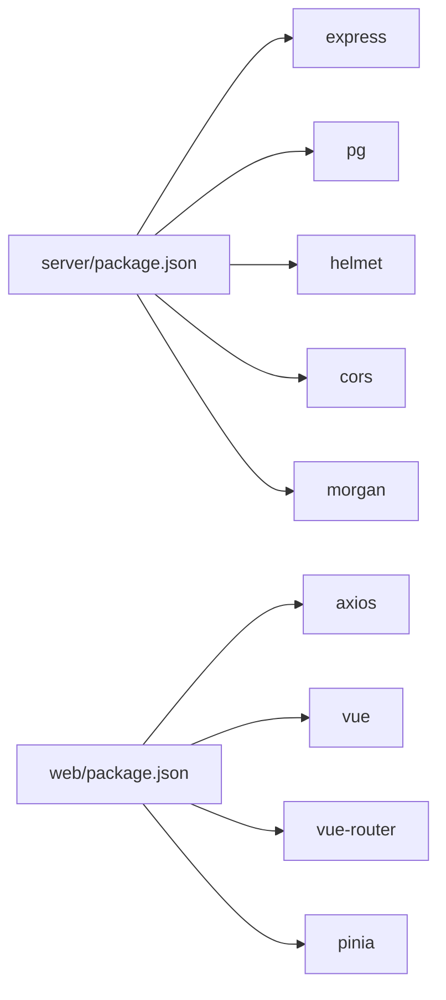

# 缓存策略

<cite>
**本文引用的文件**
- [server/src/app.js](file://server/src/app.js)
- [server/src/config/db.js](file://server/src/config/db.js)
- [server/src/middleware/response.js](file://server/src/middleware/response.js)
- [server/src/middleware/rateLimit.js](file://server/src/middleware/rateLimit.js)
- [server/src/routes/inventoryRoutes.js](file://server/src/routes/inventoryRoutes.js)
- [server/src/routes/masterRoutes.js](file://server/src/routes/masterRoutes.js)
- [server/src/utils/inventoryService.js](file://server/src/utils/inventoryService.js)
- [web/src/services/api.js](file://web/src/services/api.js)
- [web/src/stores/auth.js](file://web/src/stores/auth.js)
- [server/package.json](file://server/package.json)
- [web/package.json](file://web/package.json)
</cite>

## 目录
1. [引言](#引言)
2. [项目结构](#项目结构)
3. [核心组件](#核心组件)
4. [架构总览](#架构总览)
5. [详细组件分析](#详细组件分析)
6. [依赖关系分析](#依赖关系分析)
7. [性能考量](#性能考量)
8. [故障排查指南](#故障排查指南)
9. [结论](#结论)
10. [附录](#附录)

## 引言
本文件面向库存管理系统，系统性梳理后端与前端的缓存策略与实现方案，覆盖后端缓存（如 Redis 配置建议）、API 响应缓存（HTTP 缓存头与条件请求）、前端缓存（浏览器缓存、localStorage/sessionStorage）以及数据缓存层次（应用层、会话层、持久化）。同时给出缓存失效策略（TTL、穿透防护等）、监控与性能指标建议、配置示例与最佳实践，并说明缓存一致性与故障处理机制。

## 项目结构
系统采用前后端分离架构：
- 后端基于 Express，提供 REST API；路由按功能模块划分，数据库连接通过 pg 连接池管理。
- 前端基于 Vue 3 + Vite，通过 Axios 发起请求，使用 Pinia 管理状态，本地存储用户令牌与偏好。

图表来源
- [server/src/app.js:1-65](file://server/src/app.js#L1-L65)
- [server/src/config/db.js:1-25](file://server/src/config/db.js#L1-L25)
- [web/src/services/api.js:1-45](file://web/src/services/api.js#L1-L45)

章节来源
- [server/src/app.js:1-65](file://server/src/app.js#L1-L65)
- [server/src/config/db.js:1-25](file://server/src/config/db.js#L1-L25)
- [web/src/services/api.js:1-45](file://web/src/services/api.js#L1-L45)

## 核心组件
- 后端应用与中间件
  - Express 应用初始化、CORS、Helmet 安全头、morgan 日志、审计中间件、统一响应包装。
  - 路由按模块划分，如库存、主数据、仪表盘、报表、告警、审计、盘点、市场、订单、物流、供应商、通知、设置、银行对账等。
- 数据访问
  - 使用 pg 连接池进行数据库访问，支持 SSL 与超时配置。
- 前端请求与状态
  - Axios 创建基础实例，自动注入认证与成本访问令牌、语言环境等请求头。
  - Pinia 管理认证状态，localStorage 持久化令牌与用户信息。

章节来源
- [server/src/app.js:1-65](file://server/src/app.js#L1-L65)
- [server/src/config/db.js:1-25](file://server/src/config/db.js#L1-L25)
- [web/src/services/api.js:1-45](file://web/src/services/api.js#L1-L45)
- [web/src/stores/auth.js:1-90](file://web/src/stores/auth.js#L1-L90)

## 架构总览
后端缓存策略建议（Redis）与前端缓存策略的总体关系如下：

图表来源
- [server/src/app.js:1-65](file://server/src/app.js#L1-L65)
- [server/src/middleware/response.js:1-62](file://server/src/middleware/response.js#L1-L62)
- [server/src/routes/inventoryRoutes.js:1-493](file://server/src/routes/inventoryRoutes.js#L1-L493)
- [server/src/utils/inventoryService.js:1-45](file://server/src/utils/inventoryService.js#L1-L45)
- [server/src/config/db.js:1-25](file://server/src/config/db.js#L1-L25)
- [web/src/services/api.js:1-45](file://web/src/services/api.js#L1-L45)
- [web/src/stores/auth.js:1-90](file://web/src/stores/auth.js#L1-L90)

## 详细组件分析

### 后端缓存策略（Redis 建议）
- Redis 配置要点
  - 连接与集群：根据部署规模选择单机或哨兵/集群模式；开启密码与 TLS（生产环境）。
  - 内存淘汰策略：优先使用 allkeys-lru 或 volatile-ttl，平衡热点与过期键。
  - TTL 设置：对高频读但不常变的数据设置合理过期时间（如分钟级到小时级），对强一致场景禁用缓存或短 TTL 并配合回源校验。
  - 分布式锁：对库存扣减等关键写操作使用 Redlock 或基于 SET NX EX 的轻量锁，避免并发超卖。
- 缓存键设计
  - 规范化命名空间：如 inventory:stock:{productId}:{warehouseId}、master:category:{id}、report:daily:{date}。
  - 版本号/ETag：在键中嵌入版本号或内容摘要，用于失效与一致性控制。
  - 命名规范：使用冒号分隔层级，避免冲突；对敏感键加前缀区分权限域。
- 过期策略
  - LRU：对热数据使用 LRU，避免冷数据占用内存。
  - TTL：对实时性要求高的键设置短 TTL，结合“读写同过期”策略降低陈旧风险。
  - 穿透防护：对空值也做缓存（短 TTL），并使用布隆过滤器减少无效查询。
- 失效策略
  - 主动失效：写操作成功后主动删除相关键或更新版本号。
  - 被动失效：后台扫描或定时任务清理过期键。
  - 降级：缓存不可用时快速失败或直连数据库，记录降级指标。

说明：当前代码未直接引入 Redis，以上为推荐的后端缓存实现方案与最佳实践。

### API 响应缓存（HTTP 缓存头与条件请求）
- 缓存头建议
  - 对静态或低频变更资源设置 Cache-Control（如 no-store、no-cache、max-age=秒数）。
  - 对可公开缓存的资源设置 Public，对私有资源设置 Private。
  - ETag/Last-Modified：为 GET 列表与详情接口提供弱/强 ETag，支持条件请求。
- 条件请求处理
  - If-None-Match：命中缓存则返回 304，节省带宽。
  - If-Modified-Since：与 Last-Modified 协作，减少响应体传输。
- 业务场景
  - 列表接口：对分页列表可设置较短 TTL（如 60-180 秒），并提供 ETag。
  - 详情接口：对稳定不变的主数据（如分类、仓库）可设置较长 TTL（如 5-15 分钟）。
  - 动态接口：对实时库存、交易流水等设置短 TTL 或不缓存，必要时使用 ETag。

说明：当前代码未显式设置 HTTP 缓存头，可在路由层或中间件中统一添加。

### 前端缓存策略
- 浏览器缓存
  - 静态资源：构建工具生成带哈希的文件名，配合长期缓存策略。
  - HTML/CSS/JS：通过构建配置设置 Cache-Control，避免频繁更新的资源被长期缓存。
- localStorage
  - 存储认证令牌与用户信息，实现刷新后状态恢复。
  - 仅存放非敏感信息，敏感数据避免明文存储。
- sessionStorage
  - 存放短期会话参数（如成本访问令牌），关闭标签页即失效。
- Axios 拦截器
  - 自动注入 Authorization 与成本访问令牌、语言环境等请求头，减少重复代码。
  - 统一处理响应结构，提取 data 字段，简化调用方逻辑。

章节来源
- [web/src/services/api.js:1-45](file://web/src/services/api.js#L1-L45)
- [web/src/stores/auth.js:1-90](file://web/src/stores/auth.js#L1-L90)

### 数据缓存层次
- 应用层缓存（前端）
  - Pinia Store：缓存用户偏好、通知、货币等轻量数据，减少重复请求。
  - 组件内缓存：对当前页可见数据做本地缓存，避免重复渲染。
- 会话缓存（前端）
  - localStorage：持久化登录态与用户信息；注意跨站脚本攻击风险。
  - sessionStorage：临时参数与短期令牌，提高安全性。
- 持久化缓存（后端）
  - PostgreSQL：作为权威数据源，所有写操作必须落库。
  - Redis（建议）：作为热数据缓存与会话存储，加速读取与减轻 DB 压力。

### 缓存失效策略
- LRU 算法：对热点键使用 LRU，淘汰最久未使用键。
- TTL 设置：对不同业务设置差异化 TTL，兼顾性能与一致性。
- 缓存穿透防护：对空结果也缓存（短 TTL），并使用布隆过滤器预判存在性。
- 写后失效：写操作成功后主动删除或更新相关缓存键，确保最终一致。
- 强制回源：在高并发或异常情况下，允许读请求绕过缓存直连数据库。

### 缓存监控与性能指标
- 命中率统计：记录 hits/misses，计算命中率并可视化。
- 内存使用监控：观察 Redis 内存增长趋势，及时扩容或优化键结构。
- 命令耗时：统计慢查询与热点命令，定位性能瓶颈。
- 错误与降级：记录缓存不可用次数、降级比例与恢复时间。

### 缓存一致性保证与故障处理
- 一致性
  - 先写数据库，再写缓存；或写数据库成功后再删除缓存（延迟双删/更新版本号）。
  - 对强一致场景禁用缓存或短 TTL，并在读路径进行回源校验。
- 故障处理
  - 缓存层不可用：快速失败或降级直连数据库，记录指标并报警。
  - 读多写少：允许短暂不一致，定期全量重建缓存。
  - 幂等性：写操作幂等化，避免重复写导致的缓存脏数据。

## 依赖关系分析

图表来源
- [server/package.json:1-31](file://server/package.json#L1-L31)
- [web/package.json:1-34](file://web/package.json#L1-L34)

章节来源
- [server/package.json:1-31](file://server/package.json#L1-L31)
- [web/package.json:1-34](file://web/package.json#L1-L34)

## 性能考量
- 后端
  - 使用连接池（pg）避免频繁创建连接，合理设置超时与 SSL。
  - 对高频查询使用索引与分页，避免一次性加载全量数据。
  - 在路由层对列表接口使用并发查询与分页，减少单次响应体积。
- 前端
  - 对静态资源启用长期缓存，对动态数据设置合理 TTL。
  - 使用 Pinia 管理轻量状态，避免重复请求。
  - Axios 统一拦截器减少样板代码，提升开发效率。

## 故障排查指南
- 请求失败
  - 检查统一响应包装是否正确返回错误码与消息。
  - 查看审计日志与请求 ID，定位具体问题。
- 认证与授权
  - 确认请求头中携带 Authorization 与成本访问令牌。
  - 检查 localStorage 是否正确持久化令牌。
- 速率限制
  - 若触发限流，检查 X-RateLimit-* 响应头与 Retry-After。
- 数据库连接
  - 检查连接字符串、SSL 配置与超时设置，确认连接池可用。

章节来源
- [server/src/middleware/response.js:1-62](file://server/src/middleware/response.js#L1-L62)
- [server/src/middleware/rateLimit.js:1-40](file://server/src/middleware/rateLimit.js#L1-L40)
- [server/src/config/db.js:1-25](file://server/src/config/db.js#L1-L25)
- [web/src/services/api.js:1-45](file://web/src/services/api.js#L1-L45)
- [web/src/stores/auth.js:1-90](file://web/src/stores/auth.js#L1-L90)

## 结论
本系统当前未直接实现 Redis 缓存与 HTTP 缓存头，建议按本文方案在后端引入 Redis 并在路由层统一设置缓存头与条件请求处理，在前端完善浏览器缓存与本地存储策略。通过合理的 TTL、LRU、穿透防护与失效策略，结合监控与故障处理机制，可显著提升系统性能与稳定性。

## 附录

### 缓存配置示例（后端）
- Redis 连接（建议）
  - 地址与端口、密码、TLS、超时、最大连接数、序列化方式。
- 键命名规范
  - inventory:stock:{productId}:{warehouseId}
  - master:category:{id}
  - report:daily:{date}
- TTL 建议
  - 列表接口：60-180 秒
  - 详情接口：300-900 秒
  - 实时接口：短 TTL 或不缓存
- 过期策略
  - LRU 或 volatile-ttl
  - 穿透防护：空值缓存 + 布隆过滤器

### 缓存配置示例（前端）
- Axios
  - 自动注入 Authorization、成本访问令牌、语言环境。
- Pinia Store
  - 缓存用户偏好、通知、货币等轻量数据。
- localStorage/sessionStorage
  - 持久化令牌与短期参数，注意安全与隐私。

### 最佳实践
- 读多写少：对只读或低频变更数据启用缓存。
- 写后失效：写成功后主动删除或更新缓存键。
- 强一致场景：禁用缓存或短 TTL，并在读路径回源校验。
- 监控与告警：命中率、内存使用、慢查询、降级比例。
- 文档与演练：定期演练缓存层故障切换与恢复流程。