# 关系映射

<cite>
**本文档引用的文件**
- [schema.sql](file://server/database/schema.sql)
- [seed.sql](file://server/database/seed.sql)
- [db.js](file://server/src/config/db.js)
- [inventoryService.js](file://server/src/utils/inventoryService.js)
- [inventoryRoutes.js](file://server/src/routes/inventoryRoutes.js)
- [supplierRoutes.js](file://server/src/routes/supplierRoutes.js)
- [orderRoutes.js](file://server/src/routes/orderRoutes.js)
- [masterRoutes.js](file://server/src/routes/masterRoutes.js)
- [001_add_multi_tenant.sql](file://server/database/migrations/001_add_multi_tenant.sql)
- [002_fix_unique_constraints.sql](file://server/database/migrations/002_fix_unique_constraints.sql)
</cite>

## 目录
1. [简介](#简介)
2. [项目结构](#项目结构)
3. [核心组件](#核心组件)
4. [架构总览](#架构总览)
5. [详细组件分析](#详细组件分析)
6. [依赖分析](#依赖分析)
7. [性能考量](#性能考量)
8. [故障排查指南](#故障排查指南)
9. [结论](#结论)
10. [附录](#附录)

## 简介
本文件聚焦于库存系统的数据库实体关系设计与实现，系统采用 PostgreSQL 作为持久化存储，并通过多租户隔离增强数据安全性与可扩展性。本文将系统性阐述一对一、一对多、多对多关系在数据库中的建模方式与在服务层的实现细节；分析关系映射对查询性能的影响及优化策略；说明关系完整性约束的实现与维护机制；给出复杂业务关系（如产品组合、供应商关系、库存分配）的建模方法；并提供关系变更对系统的影响分析与迁移策略，以及关系查询的最佳实践与性能优化技巧。

## 项目结构
后端采用 Node.js + Express 架构，数据库层由 PostgreSQL 提供，核心关系定义集中在数据库模式文件中，服务层通过路由与工具函数封装关系查询与事务处理。

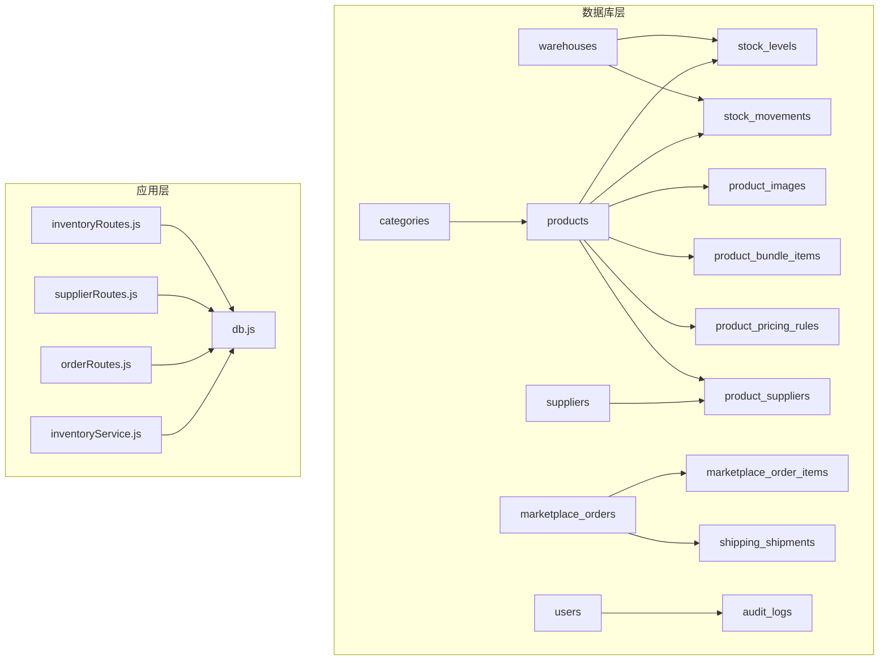

**图表来源**
- [schema.sql:2-447](file://server/database/schema.sql#L2-L447)
- [inventoryRoutes.js:1-536](file://server/src/routes/inventoryRoutes.js#L1-L536)
- [supplierRoutes.js:1-383](file://server/src/routes/supplierRoutes.js#L1-L383)
- [orderRoutes.js:1-124](file://server/src/routes/orderRoutes.js#L1-L124)
- [inventoryService.js:1-46](file://server/src/utils/inventoryService.js#L1-L46)
- [db.js:1-29](file://server/src/config/db.js#L1-L29)

**章节来源**
- [schema.sql:1-447](file://server/database/schema.sql#L1-L447)
- [db.js:1-29](file://server/src/config/db.js#L1-L29)

## 核心组件
- 数据库模式与索引：集中定义实体、外键、唯一约束与索引，确保关系完整性与查询性能。
- 多租户迁移：为所有业务表增加 tenant_id 并调整唯一约束，实现租户级数据隔离。
- 路由与服务：通过路由封装业务流程，利用工具函数统一处理库存事务与关系查询。
- 查询优化：大量使用 JOIN、索引与分页，结合并发查询以降低响应时间。

**章节来源**
- [schema.sql:1-447](file://server/database/schema.sql#L1-L447)
- [001_add_multi_tenant.sql:1-100](file://server/database/migrations/001_add_multi_tenant.sql#L1-L100)
- [002_fix_unique_constraints.sql:1-44](file://server/database/migrations/002_fix_unique_constraints.sql#L1-L44)
- [inventoryRoutes.js:1-536](file://server/src/routes/inventoryRoutes.js#L1-L536)
- [supplierRoutes.js:1-383](file://server/src/routes/supplierRoutes.js#L1-L383)
- [orderRoutes.js:1-124](file://server/src/routes/orderRoutes.js#L1-L124)
- [inventoryService.js:1-46](file://server/src/utils/inventoryService.js#L1-L46)

## 架构总览
系统采用“数据库层 + 应用层”两层架构，数据库层负责关系建模与约束，应用层负责业务编排与查询优化。多租户通过在每个实体上增加 tenant_id 并调整唯一约束实现，确保不同租户数据相互隔离。

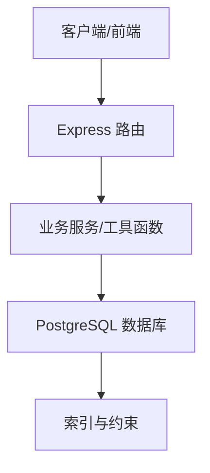

**图表来源**
- [db.js:1-29](file://server/src/config/db.js#L1-L29)
- [schema.sql:1-447](file://server/database/schema.sql#L1-L447)

## 详细组件分析

### 实体关系模型与约束
系统的核心实体与关系如下：
- 用户与仓库：一对多（一个仓库可由多个用户管理，但受租户隔离）
- 类别与产品：一对多（一个类别包含多个产品）
- 产品与库存：一对一（每个产品在每个仓库的库存记录唯一）
- 产品与图片：一对多（一个产品可有多张图片）
- 产品与定价规则：一对多（一个产品可有多个定价规则）
- 产品与供应商：多对多（通过联结表 product_suppliers 实现）
- 产品与组合项：一对多（组合产品包含多个子项）
- 仓库与库存：一对多（一个仓库包含多个库存记录）
- 仓库与出入库：一对多（一个仓库产生多条出入库记录）
- 订单与订单项：一对多（一个外部订单包含多个订单项）
- 订单与物流：一对一（一个外部订单对应一个物流单）

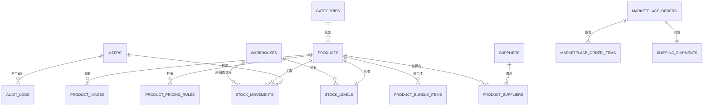

**图表来源**
- [schema.sql:2-447](file://server/database/schema.sql#L2-L447)

**章节来源**
- [schema.sql:2-447](file://server/database/schema.sql#L2-L447)

### 多租户隔离与唯一约束
- 为所有业务表新增 tenant_id 字段，并建立外键约束，确保跨租户数据隔离。
- 将全局唯一约束改为租户内唯一，例如 users(email)、products(sku/product_code/barcode)、system_settings(setting_key)、marketplace_orders(channel, external_order_id) 等。
- 为 tenant_id 建立索引，提升过滤与连接性能。

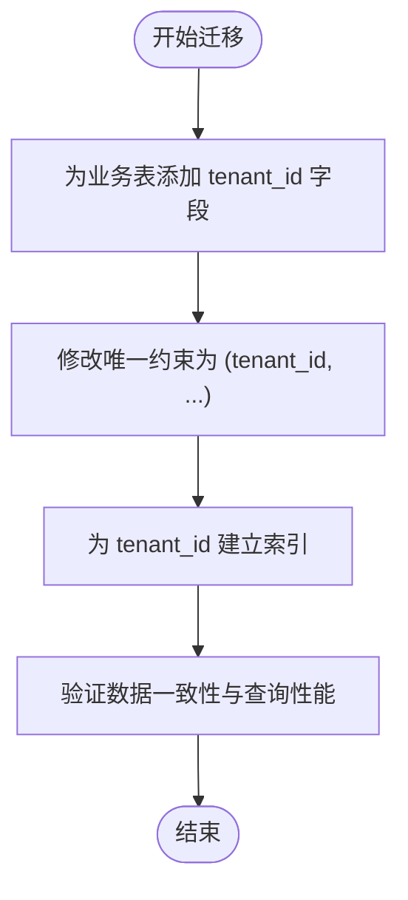

**图表来源**
- [001_add_multi_tenant.sql:1-100](file://server/database/migrations/001_add_multi_tenant.sql#L1-L100)
- [002_fix_unique_constraints.sql:1-44](file://server/database/migrations/002_fix_unique_constraints.sql#L1-L44)

**章节来源**
- [001_add_multi_tenant.sql:1-100](file://server/database/migrations/001_add_multi_tenant.sql#L1-L100)
- [002_fix_unique_constraints.sql:1-44](file://server/database/migrations/002_fix_unique_constraints.sql#L1-L44)

### 一对一关系：产品与库存
- 设计要点：每个产品在每个仓库仅有一条库存记录，使用 (product_id, warehouse_id) 唯一约束保证一对一。
- 查询路径：库存查询、可用量计算、事务更新均基于该唯一键进行。
- 事务处理：通过工具函数封装库存行确保、读取与更新，保证并发安全。

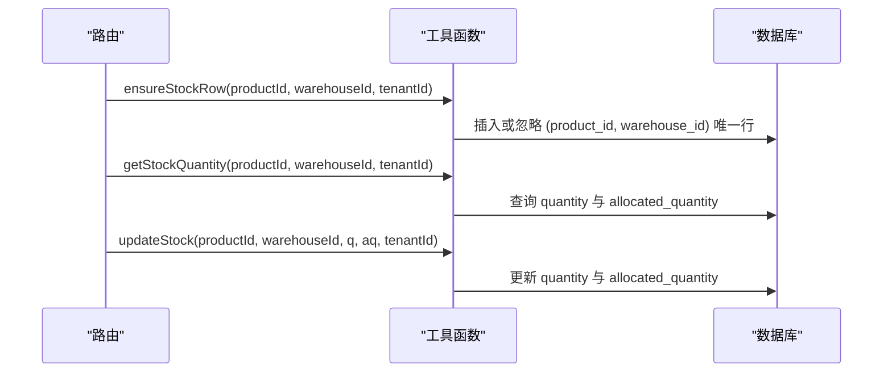

**图表来源**
- [inventoryService.js:1-46](file://server/src/utils/inventoryService.js#L1-L46)
- [inventoryRoutes.js:237-437](file://server/src/routes/inventoryRoutes.js#L237-L437)

**章节来源**
- [schema.sql:125-133](file://server/database/schema.sql#L125-L133)
- [inventoryService.js:1-46](file://server/src/utils/inventoryService.js#L1-L46)
- [inventoryRoutes.js:237-437](file://server/src/routes/inventoryRoutes.js#L237-L437)

### 一对多关系：类别与产品、仓库与库存、产品与图片
- 类别到产品：通过 products.category_id 外键关联，支持按类别筛选与统计。
- 仓库到库存：通过 stock_levels.warehouse_id 外键关联，支持按仓库聚合与盘点。
- 产品到图片：通过 product_images.product_id 外键关联，支持主图与排序展示。
- 查询优化：在关联字段上建立索引，减少连接成本；在高基数字段上使用覆盖索引。

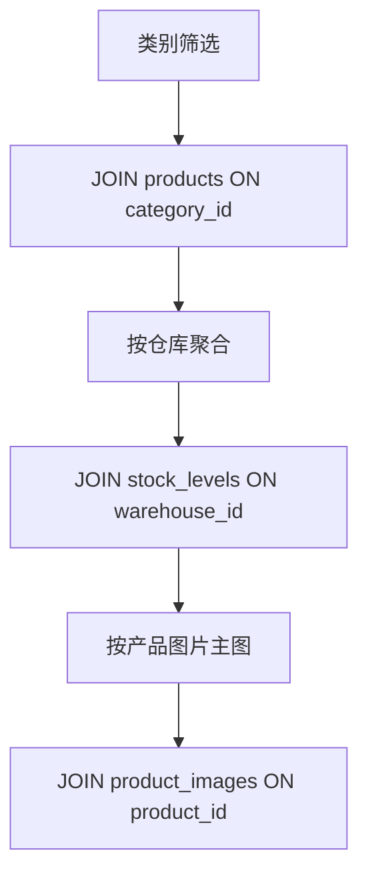

**图表来源**
- [schema.sql:15-54](file://server/database/schema.sql#L15-L54)
- [schema.sql:125-133](file://server/database/schema.sql#L125-L133)
- [schema.sql:71-78](file://server/database/schema.sql#L71-L78)
- [inventoryRoutes.js:18-156](file://server/src/routes/inventoryRoutes.js#L18-L156)

**章节来源**
- [schema.sql:15-54](file://server/database/schema.sql#L15-L54)
- [schema.sql:71-78](file://server/database/schema.sql#L71-L78)
- [schema.sql:125-133](file://server/database/schema.sql#L125-L133)
- [inventoryRoutes.js:18-156](file://server/src/routes/inventoryRoutes.js#L18-L156)

### 多对多关系：产品与供应商
- 设计要点：通过 product_suppliers 联结表实现多对多，使用 (product_id, supplier_id) 唯一约束防止重复关联。
- 主供应商：通过 is_primary 字段标记主供应商，便于业务侧快速定位。
- 查询路径：在供应商详情中关联产品清单与最近采购记录，支持多表 JOIN 与分组统计。

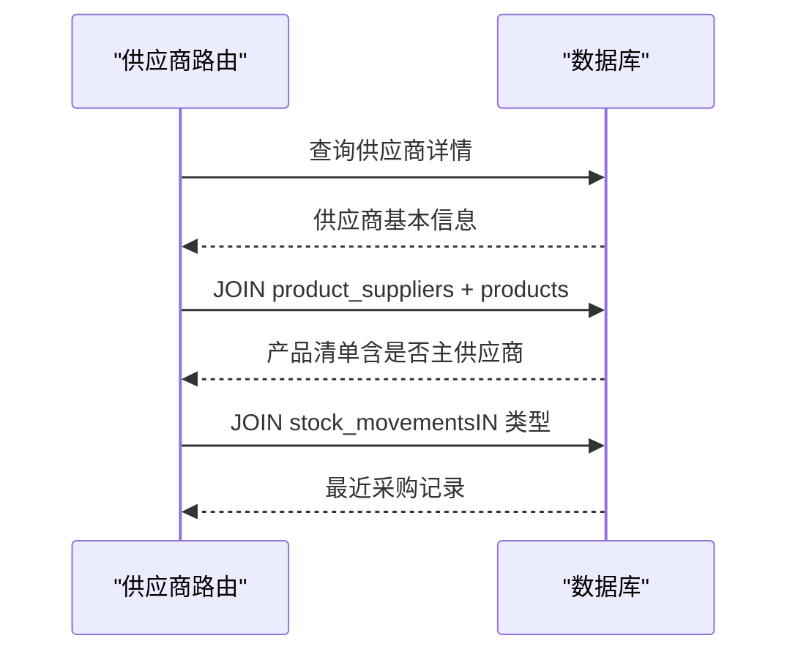

**图表来源**
- [supplierRoutes.js:178-241](file://server/src/routes/supplierRoutes.js#L178-L241)
- [schema.sql:348-356](file://server/database/schema.sql#L348-L356)

**章节来源**
- [schema.sql:348-356](file://server/database/schema.sql#L348-L356)
- [supplierRoutes.js:178-241](file://server/src/routes/supplierRoutes.js#L178-L241)

### 复杂业务关系：产品组合与定价规则
- 产品组合：通过 product_bundle_items 联结表保存组合产品的子项及其数量，支持组合销售与拆分。
- 定价规则：通过 product_pricing_rules 为产品定义多套定价规则（如渠道、折扣、建议价），支持动态选择活动价格。
- 查询路径：在产品详情加载时，按组合 ID 或产品 ID 加载子项与规则，结合渠道参数解析活动价格。

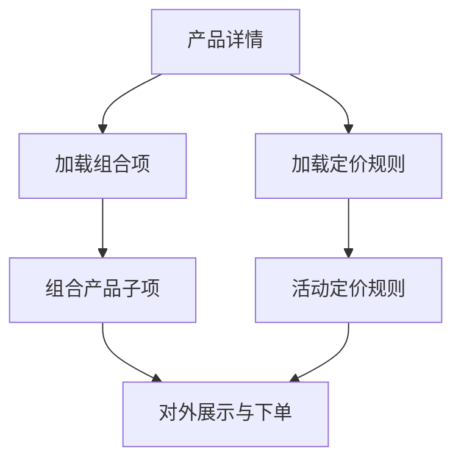

**图表来源**
- [schema.sql:80-87](file://server/database/schema.sql#L80-L87)
- [schema.sql:99-109](file://server/database/schema.sql#L99-L109)
- [masterRoutes.js:349-467](file://server/src/routes/masterRoutes.js#L349-L467)
- [masterRoutes.js:326-347](file://server/src/routes/masterRoutes.js#L326-L347)

**章节来源**
- [schema.sql:80-87](file://server/database/schema.sql#L80-L87)
- [schema.sql:99-109](file://server/database/schema.sql#L99-L109)
- [masterRoutes.js:326-467](file://server/src/routes/masterRoutes.js#L326-L467)

### 出入库与库存分配：关系与事务
- 出入库类型：IN/OUT/TRANSFER 三种类型，分别对应不同的源/目的仓库与数量变化。
- 库存分配：通过 allocated_quantity 字段实现订单预留与释放，结合可用量校验防止超卖。
- 事务保障：所有出入库与分配操作在单个事务中执行，确保数据一致性。

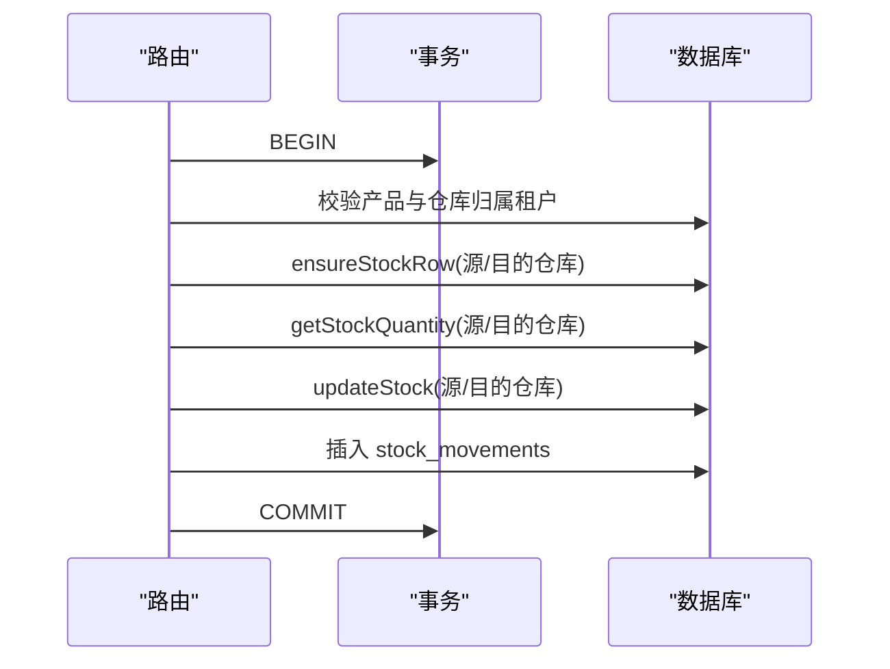

**图表来源**
- [inventoryRoutes.js:237-437](file://server/src/routes/inventoryRoutes.js#L237-L437)
- [inventoryService.js:1-46](file://server/src/utils/inventoryService.js#L1-L46)

**章节来源**
- [schema.sql:237-248](file://server/database/schema.sql#L237-L248)
- [inventoryRoutes.js:237-437](file://server/src/routes/inventoryRoutes.js#L237-L437)
- [inventoryService.js:1-46](file://server/src/utils/inventoryService.js#L1-L46)

### 市场渠道与订单关系
- 外部订单与订单项：通过 marketplace_orders 与 marketplace_order_items 建立一对多关系，支持按渠道与状态筛选。
- 物流对应：通过 shipping_shipments 与外部订单一一对应，记录物流状态与跟踪信息。
- 查询优化：在 channel、order_status、created_at 等字段上建立索引，提升分页与筛选性能。

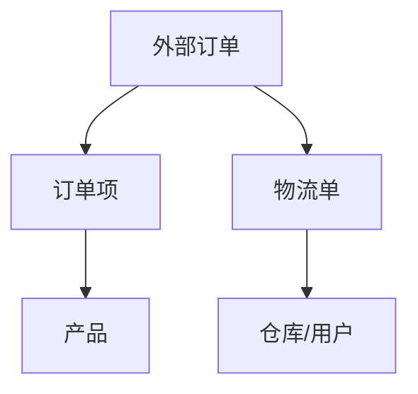

**图表来源**
- [schema.sql:196-235](file://server/database/schema.sql#L196-L235)
- [orderRoutes.js:33-121](file://server/src/routes/orderRoutes.js#L33-L121)

**章节来源**
- [schema.sql:196-235](file://server/database/schema.sql#L196-L235)
- [orderRoutes.js:33-121](file://server/src/routes/orderRoutes.js#L33-L121)

## 依赖分析
- 路由依赖数据库连接池，通过统一的查询封装执行 SQL。
- 工具函数依赖数据库连接池，封装库存行确保、读取与更新。
- 多租户隔离通过在每个实体上增加 tenant_id 并在查询中强制过滤实现。

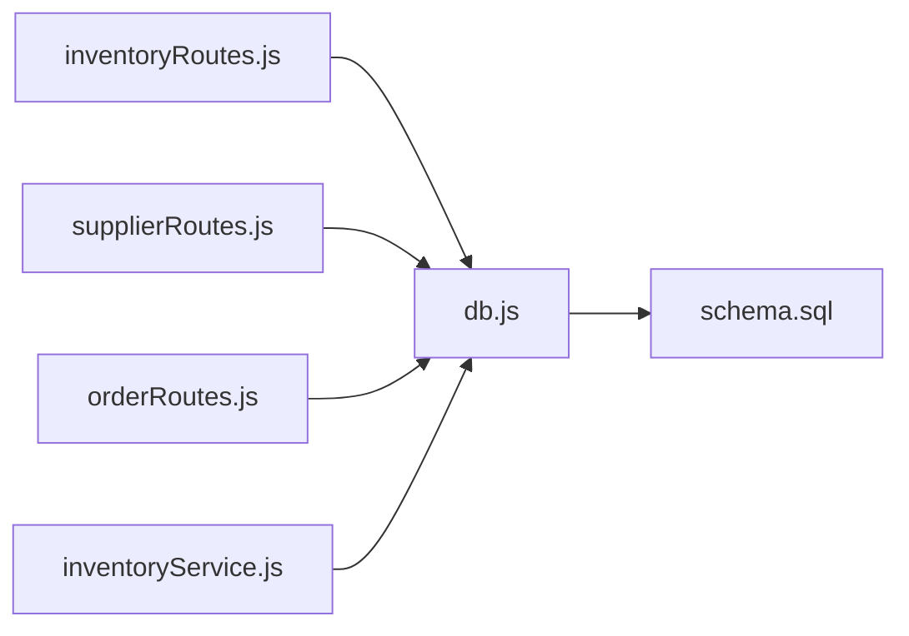

**图表来源**
- [inventoryRoutes.js:1-10](file://server/src/routes/inventoryRoutes.js#L1-L10)
- [supplierRoutes.js:1-8](file://server/src/routes/supplierRoutes.js#L1-L8)
- [orderRoutes.js:1-10](file://server/src/routes/orderRoutes.js#L1-L10)
- [inventoryService.js:1-10](file://server/src/utils/inventoryService.js#L1-L10)
- [db.js:1-29](file://server/src/config/db.js#L1-L29)

**章节来源**
- [inventoryRoutes.js:1-10](file://server/src/routes/inventoryRoutes.js#L1-L10)
- [supplierRoutes.js:1-8](file://server/src/routes/supplierRoutes.js#L1-L8)
- [orderRoutes.js:1-10](file://server/src/routes/orderRoutes.js#L1-L10)
- [inventoryService.js:1-10](file://server/src/utils/inventoryService.js#L1-L10)
- [db.js:1-29](file://server/src/config/db.js#L1-L29)

## 性能考量
- 索引策略
  - 在关联字段上建立索引：如 products(category_id)、stock_levels(product_id, warehouse_id)、stock_movements(product_id, created_at)、product_suppliers(product_id, supplier_id) 等。
  - 在高基数字段上建立覆盖索引：如 marketplace_orders(channel, order_status)、marketplace_order_items(marketplace_order_id)。
  - 在多租户场景下优先使用复合索引：如 users(tenant_id, email)、products(tenant_id, sku)。
- 查询优化
  - 使用分页与并发查询：在列表接口中并行执行数据查询与总数统计，减少响应时间。
  - 使用 JOIN 与 LATERAL 子查询：在告警与报表场景中，通过 JOIN 与 LATERAL 获取最近状态与关联信息。
  - 控制返回字段：根据权限隐藏敏感字段（如成本价），减少网络传输与前端渲染压力。
- 事务与锁
  - 所有库存相关操作在事务中执行，避免并发导致的数据不一致。
  - 使用行级锁与唯一约束配合，确保并发下的数据一致性。
- 缓存与归档
  - 对高频查询结果进行短期缓存（如最近订单、热门产品），降低数据库压力。
  - 对历史数据进行归档与分区，减少热表扫描范围。

**章节来源**
- [schema.sql:410-446](file://server/database/schema.sql#L410-L446)
- [inventoryRoutes.js:79-144](file://server/src/routes/inventoryRoutes.js#L79-L144)
- [supplierRoutes.js:32-96](file://server/src/routes/supplierRoutes.js#L32-L96)
- [orderRoutes.js:40-87](file://server/src/routes/orderRoutes.js#L40-L87)

## 故障排查指南
- 常见错误与定位
  - 外键约束失败：检查关联实体是否存在且属于同一租户；确认 tenant_id 是否正确传递。
  - 唯一约束冲突：检查 (tenant_id, ...) 唯一索引是否生效；确认业务逻辑是否重复插入。
  - 并发超卖：检查 allocated_quantity 与可用量计算逻辑；确认事务是否正确提交。
  - 查询性能问题：检查是否命中索引；确认分页参数是否合理；避免 N+1 查询。
- 排查步骤
  - 核对路由参数与请求体，确保必填字段与类型正确。
  - 查看审计日志与错误日志，定位异常发生的时间点与操作人。
  - 使用 EXPLAIN/ANALYZE 分析慢查询，评估索引使用情况。
  - 在测试环境复现问题，逐步缩小范围至具体模块与 SQL。

**章节来源**
- [inventoryRoutes.js:237-437](file://server/src/routes/inventoryRoutes.js#L237-L437)
- [supplierRoutes.js:178-241](file://server/src/routes/supplierRoutes.js#L178-L241)
- [orderRoutes.js:90-121](file://server/src/routes/orderRoutes.js#L90-L121)

## 结论
本系统通过清晰的关系建模与严格的多租户隔离，实现了产品、仓库、供应商、订单等核心业务的稳定运行。借助完善的索引与查询优化策略，系统在大数据量下仍能保持良好性能。通过事务与唯一约束保障数据一致性，配合审计与错误日志体系，提升了系统的可观测性与可维护性。未来可在缓存、分区与异步同步等方面进一步优化，以支撑更大规模的业务增长。

## 附录
- 初始化数据：包含基础用户、分类、仓库与示例商品，用于快速验证系统功能。
- 数据库连接：通过连接池管理连接，自动根据连接字符串决定是否启用 SSL，并设置连接超时。

**章节来源**
- [seed.sql:1-114](file://server/database/seed.sql#L1-L114)
- [db.js:1-29](file://server/src/config/db.js#L1-L29)