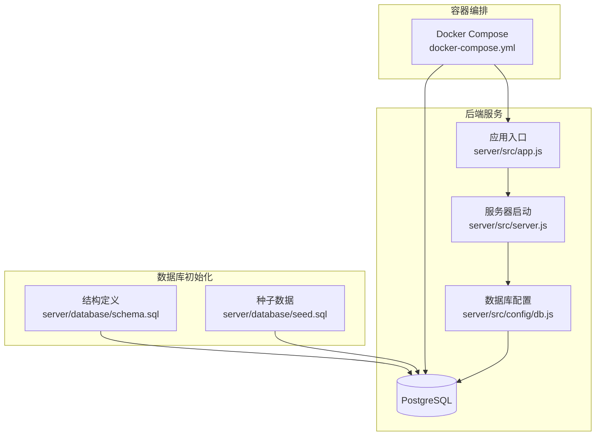
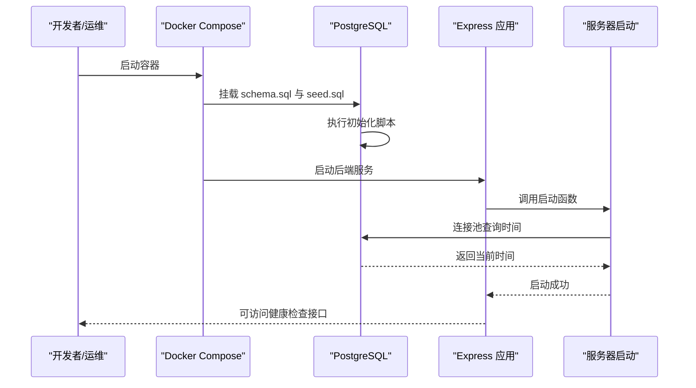
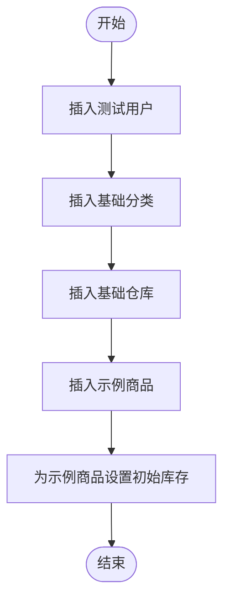
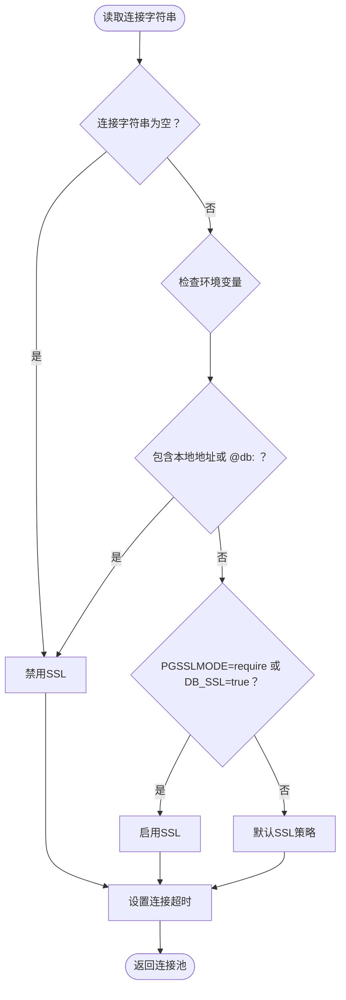
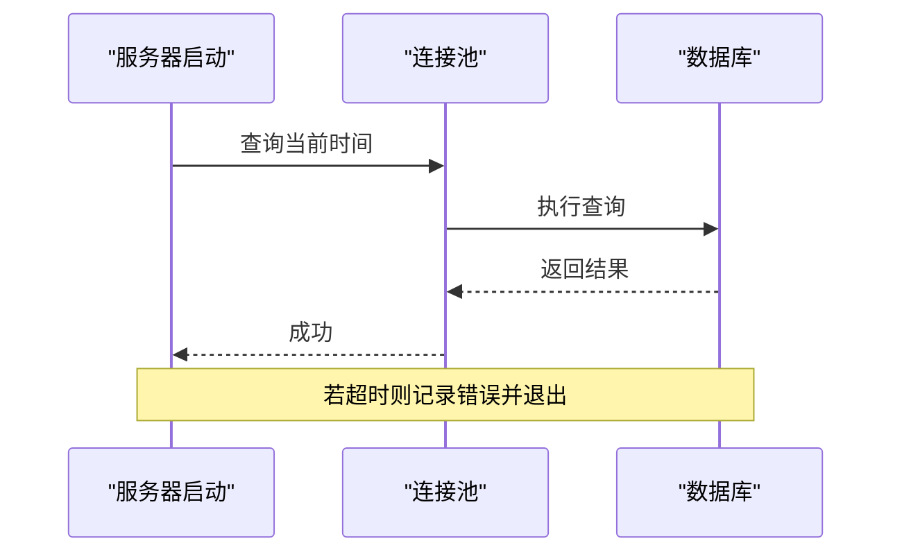
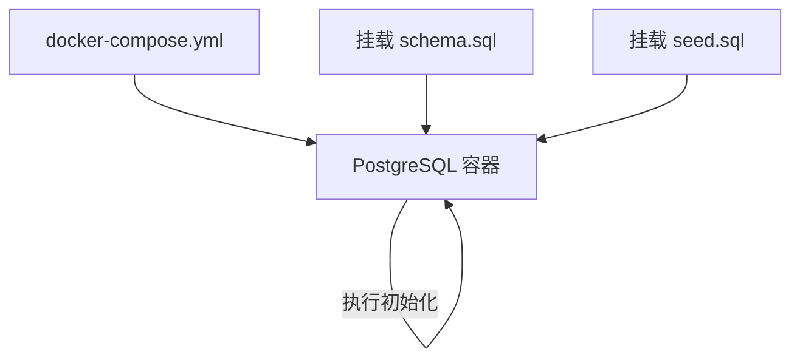
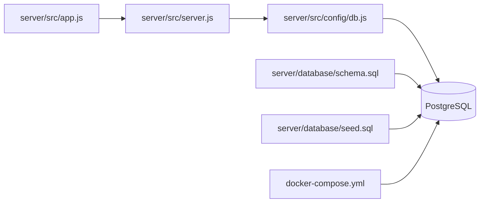

# 初始化与种子数据

<cite>
**本文档引用的文件**
- [schema.sql](file://server/database/schema.sql)
- [seed.sql](file://server/database/seed.sql)
- [db.js](file://server/src/config/db.js)
- [app.js](file://server/src/app.js)
- [server.js](file://server/src/server.js)
- [docker-compose.yml](file://docker-compose.yml)
- [DEPLOY_FREE.md](file://DEPLOY_FREE.md)
- [README.md](file://README.md)
- [package.json](file://package.json)
</cite>

## 目录
1. [简介](#简介)
2. [项目结构](#项目结构)
3. [核心组件](#核心组件)
4. [架构总览](#架构总览)
5. [详细组件分析](#详细组件分析)
6. [依赖关系分析](#依赖关系分析)
7. [性能考虑](#性能考虑)
8. [故障排除指南](#故障排除指南)
9. [结论](#结论)
10. [附录](#附录)

## 简介
本文件聚焦于库存管理系统的数据库初始化与种子数据机制，详细说明系统启动时的数据库准备过程、初始数据加载机制、schema.sql 中的数据库结构定义、seed.sql 中的初始数据插入逻辑，以及系统预设数据的含义与用途。同时涵盖数据库迁移与版本升级过程中的数据兼容性处理、开发环境与生产环境的数据库初始化差异、数据库重置与重新初始化操作指南、数据备份与恢复策略、种子数据的维护与更新流程，为系统部署与运维人员提供实用的操作指导。

## 项目结构
系统采用前后端分离架构，数据库初始化与种子数据位于后端 server/database 目录中，通过 Docker Compose 在本地一键启动时自动执行；在生产环境中，可通过命令行工具或部署平台手动执行初始化脚本。

图表来源
- [app.js:1-91](file://server/src/app.js#L1-L91)
- [server.js:1-28](file://server/src/server.js#L1-L28)
- [db.js:1-29](file://server/src/config/db.js#L1-L29)
- [schema.sql:1-447](file://server/database/schema.sql#L1-L447)
- [seed.sql:1-114](file://server/database/seed.sql#L1-L114)
- [docker-compose.yml:1-57](file://docker-compose.yml#L1-L57)

章节来源
- [README.md:22-54](file://README.md#L22-L54)
- [docker-compose.yml:1-57](file://docker-compose.yml#L1-L57)

## 核心组件
- 数据库连接池与SSL策略：通过连接字符串解析与环境变量控制SSL模式，支持本地开发与云数据库的差异化配置。
- 应用启动时的数据库连通性校验：在启动阶段对数据库进行超时检测，确保服务可用后再对外提供接口。
- 结构与种子脚本：schema.sql 定义完整的数据库表结构与索引，seed.sql 提供初始用户、分类、仓库与示例商品数据。
- 容器化初始化：Docker Compose 将 schema.sql 与 seed.sql 挂载到容器初始化目录，实现首次启动自动执行。

章节来源
- [db.js:1-29](file://server/src/config/db.js#L1-L29)
- [server.js:13-25](file://server/src/server.js#L13-L25)
- [schema.sql:1-447](file://server/database/schema.sql#L1-L447)
- [seed.sql:1-114](file://server/database/seed.sql#L1-L114)
- [docker-compose.yml:13-15](file://docker-compose.yml#L13-L15)

## 架构总览
系统启动时的数据库初始化与验证流程如下：

图表来源
- [docker-compose.yml:13-15](file://docker-compose.yml#L13-L15)
- [server.js:13-25](file://server/src/server.js#L13-L25)
- [db.js:19-23](file://server/src/config/db.js#L19-L23)

## 详细组件分析

### 数据库结构定义（schema.sql）
schema.sql 定义了完整的业务模型与索引，覆盖用户、分类、仓库、产品、图片、捆绑商品、定价规则、库存、市场同步、物流、出入库、盘点、审计日志、供应商、银行流水等模块。其设计要点包括：
- 主键与外键约束：确保数据完整性与引用一致性。
- 默认值与校验：如用户角色枚举、库存数量非负、价格数值精度等。
- 索引优化：为高频查询字段建立索引，提升查询性能。
- 字段演进：通过条件添加列与数据迁移更新，保证历史数据兼容。

```mermaid
erDiagram
USERS {
serial id PK
varchar full_name
varchar email UK
text password_hash
varchar role
boolean is_active
varchar preferred_currency
timestamp created_at
}
CATEGORIES {
serial id PK
varchar name UK
text description
timestamp created_at
}
WAREHOUSES {
serial id PK
varchar name
varchar code UK
text address
varchar manager_name
boolean is_active
timestamp created_at
}
PRODUCTS {
serial id PK
varchar name
varchar sku UK
varchar product_code
varchar barcode UK
text image_data
text description
text usage_guide
text pros
text cons
integer category_id FK
varchar unit
numeric cost_price
numeric selling_price
numeric markup_percentage
numeric suggested_price
integer reorder_level
boolean is_active
timestamp created_at
timestamp updated_at
}
PRODUCT_IMAGES {
serial id PK
integer product_id FK
text image_data
integer sort_order
boolean is_primary
timestamp created_at
}
PRODUCT_BUNDLE_ITEMS {
serial id PK
integer combo_product_id FK
integer item_product_id FK
numeric item_quantity
timestamp created_at
}
PRODUCT_PRICING_RULES {
serial id PK
integer product_id FK
varchar rule_name
varchar channel_key
numeric markup_percentage
numeric suggested_price
boolean is_default
integer sort_order
timestamp created_at
}
STOCK_LEVELS {
serial id PK
integer product_id FK
integer warehouse_id FK
integer quantity
integer allocated_quantity
timestamp updated_at
}
MARKETPLACE_SYNC_LOGS {
serial id PK
varchar channel
varchar sync_type
varchar status
integer records_count
jsonb raw_response
integer synced_by FK
timestamp synced_at
}
MARKETPLACE_INVENTORY_SNAPSHOTS {
serial id PK
varchar channel
varchar external_sku
integer product_id FK
integer warehouse_id FK
integer on_hand
integer allocated_quantity
integer available_quantity
jsonb payload
timestamp synced_at
}
MARKETPLACE_CONNECTIONS {
serial id PK
varchar channel UK
varchar shop_name
text api_base_url
text access_token
text refresh_token
jsonb metadata
boolean is_active
integer updated_by FK
timestamp updated_at
}
MARKETPLACE_OAUTH_STATES {
serial id PK
varchar channel
varchar state_token UK
text redirect_uri
timestamp expires_at
integer created_by FK
timestamp created_at
}
MARKETPLACE_ERROR_LOGS {
serial id PK
varchar channel
varchar operation
varchar error_code
text message
jsonb details
varchar request_id
integer created_by FK
timestamp created_at
}
MARKETPLACE_ORDERS {
serial id PK
varchar channel
varchar external_order_id
varchar order_status
varchar buyer_name
numeric total_amount
varchar currency
timestamp order_created_at
jsonb payload
timestamp synced_at
}
MARKETPLACE_ORDER_ITEMS {
serial id PK
integer marketplace_order_id FK
varchar external_item_id
varchar external_sku
integer product_id FK
integer quantity
numeric unit_price
jsonb payload
}
SHIPPING_SHIPMENTS {
serial id PK
varchar channel
integer marketplace_order_id FK
varchar shipment_status
varchar carrier
varchar service_level
varchar tracking_no
text label_url
timestamp shipped_at
timestamp delivered_at
jsonb payload
integer updated_by FK
timestamp updated_at
}
STOCK_MOVEMENTS {
serial id PK
varchar movement_type
integer product_id FK
integer source_warehouse_id FK
integer destination_warehouse_id FK
integer quantity
varchar reference_no
text notes
integer created_by FK
timestamp created_at
}
STOCK_COUNTS {
serial id PK
integer warehouse_id FK
varchar status
text notes
integer created_by FK
integer completed_by FK
integer applied_by FK
timestamp created_at
timestamp completed_at
timestamp applied_at
}
STOCK_COUNT_ITEMS {
serial id PK
integer stock_count_id FK
integer product_id FK
integer warehouse_id FK
integer expected_quantity
integer counted_quantity
integer difference_quantity
}
AUDIT_LOGS {
serial id PK
integer user_id FK
varchar user_email
varchar user_role
varchar action
varchar entity_type
varchar entity_id
varchar method
text path
text description
jsonb metadata
timestamp created_at
}
LOW_STOCK_ALERT_STATES {
serial id PK
integer product_id FK
integer warehouse_id FK
varchar status
integer assigned_to FK
text notes
integer updated_by FK
timestamp updated_at
}
SUPPLIERS {
serial id PK
varchar name
varchar company_name
varchar contact_name
varchar phone
varchar email
text address
text payment_terms
integer lead_time_days
text notes
boolean is_active
integer created_by FK
integer updated_by FK
timestamp created_at
timestamp updated_at
}
SUPPLIER_PAYMENT_RECORDS {
serial id PK
integer supplier_id FK
integer period_month
integer period_year
date paid_date
numeric amount
text notes
integer created_by FK
timestamp created_at
}
PRODUCT_SUPPLIERS {
serial id PK
integer product_id FK
integer supplier_id FK
boolean is_primary
integer created_by FK
timestamp created_at
}
PRODUCT_COST_PRICE_HISTORIES {
serial id PK
integer product_id FK
numeric old_cost_price
numeric new_cost_price
numeric percent_change
text reason
integer changed_by FK
timestamp changed_at
}
SYSTEM_NOTIFICATIONS {
serial id PK
varchar notification_type
varchar title
text message
jsonb metadata
varchar target_role
boolean is_read
integer created_by FK
timestamp created_at
}
SYSTEM_SETTINGS {
serial id PK
varchar setting_key UK
text setting_value
integer updated_by FK
timestamp updated_at
}
BANK_STATEMENTS {
serial id PK
integer uploaded_by FK
date statement_month
text original_name
text storage_path
text mime_type
integer file_size
timestamp created_at
}
USERS ||--o{ AUDIT_LOGS : "创建"
CATEGORIES ||--o{ PRODUCTS : "拥有"
WAREHOUSES ||--o{ STOCK_LEVELS : "拥有"
PRODUCTS ||--o{ PRODUCT_IMAGES : "拥有"
PRODUCTS ||--o{ PRODUCT_BUNDLE_ITEMS : "组合"
PRODUCTS ||--o{ PRODUCT_PRICING_RULES : "定价规则"
PRODUCTS ||--o{ STOCK_MOVEMENTS : "移动"
PRODUCTS ||--o{ STOCK_COUNT_ITEMS : "盘点项"
PRODUCTS ||--o{ LOW_STOCK_ALERT_STATES : "预警状态"
PRODUCTS ||--o{ PRODUCT_SUPPLIERS : "供应商关联"
PRODUCTS ||--o{ PRODUCT_COST_PRICE_HISTORIES : "成本变更"
MARKETPLACE_ORDERS ||--o{ MARKETPLACE_ORDER_ITEMS : "订单项"
WAREHOUSES ||--o{ STOCK_COUNTS : "盘点"
WAREHOUSES ||--o{ STOCK_COUNT_ITEMS : "盘点项"
SUPPLIERS ||--o{ SUPPLIER_PAYMENT_RECORDS : "支付记录"
SUPPLIERS ||--o{ PRODUCT_SUPPLIERS : "供应商关联"
```

图表来源
- [schema.sql:1-447](file://server/database/schema.sql#L1-L447)

章节来源
- [schema.sql:1-447](file://server/database/schema.sql#L1-L447)

### 种子数据逻辑（seed.sql）
seed.sql 提供系统初始运行所需的最小化数据集，包括：
- 测试用户：管理员、仓库主管、普通员工与测试账户，便于不同角色登录验证。
- 基础分类：电子产品、办公用品等常用分类。
- 基础仓库：主仓库与门店仓库，用于演示多仓库存管理。
- 示例商品：无线鼠标与USB-C充电线，绑定到电子分类，并设置成本价、售价、补货点等。
- 初始库存：为示例商品在主仓库设置初始库存数量。

图表来源
- [seed.sql:1-114](file://server/database/seed.sql#L1-L114)

章节来源
- [seed.sql:1-114](file://server/database/seed.sql#L1-L114)

### 数据库连接与SSL策略（db.js）
数据库连接池通过连接字符串解析与环境变量控制SSL模式，支持以下场景：
- 本地开发：当连接字符串包含 localhost 或 127.0.0.1 或 @db: 时禁用SSL。
- 生产环境：根据 PGSSLMODE 或 DB_SSL 环境变量决定是否启用SSL。
- 超时控制：通过连接超时参数限制连接等待时间。

图表来源
- [db.js:3-15](file://server/src/config/db.js#L3-L15)
- [db.js:19-23](file://server/src/config/db.js#L19-L23)

章节来源
- [db.js:1-29](file://server/src/config/db.js#L1-L29)

### 应用启动与数据库连通性校验（server.js）
应用启动时会尝试通过连接池查询当前时间，若超时则记录错误并优雅退出，防止服务在数据库不可用时对外提供接口。

图表来源
- [server.js:6-24](file://server/src/server.js#L6-L24)

章节来源
- [server.js:1-28](file://server/src/server.js#L1-L28)

### 容器化初始化（docker-compose.yml）
Docker Compose 在首次启动时将 schema.sql 与 seed.sql 挂载到容器初始化目录，PostgreSQL 容器会在初始化阶段自动执行这些脚本，完成数据库结构与种子数据的创建。

图表来源
- [docker-compose.yml:13-15](file://docker-compose.yml#L13-L15)

章节来源
- [docker-compose.yml:1-57](file://docker-compose.yml#L1-L57)

## 依赖关系分析
- 应用层依赖数据库连接池：server.js 通过 db.js 获取连接池并进行健康检查。
- 数据库层依赖初始化脚本：schema.sql 与 seed.sql 为数据库提供结构与种子数据。
- 容器层依赖初始化脚本：docker-compose.yml 将脚本挂载到容器初始化目录。

图表来源
- [app.js:1-91](file://server/src/app.js#L1-L91)
- [server.js:1-28](file://server/src/server.js#L1-L28)
- [db.js:1-29](file://server/src/config/db.js#L1-L29)
- [schema.sql:1-447](file://server/database/schema.sql#L1-L447)
- [seed.sql:1-114](file://server/database/seed.sql#L1-L114)
- [docker-compose.yml:1-57](file://docker-compose.yml#L1-L57)

章节来源
- [app.js:1-91](file://server/src/app.js#L1-L91)
- [server.js:1-28](file://server/src/server.js#L1-L28)
- [db.js:1-29](file://server/src/config/db.js#L1-L29)
- [schema.sql:1-447](file://server/database/schema.sql#L1-L447)
- [seed.sql:1-114](file://server/database/seed.sql#L1-L114)
- [docker-compose.yml:1-57](file://docker-compose.yml#L1-L57)

## 性能考虑
- 索引优化：schema.sql 中为高频查询字段建立了索引，如产品分类、库存、市场同步、审计日志等，有助于提升查询性能。
- 连接池与超时：db.js 中设置了连接超时参数，避免长时间阻塞导致资源浪费。
- 数据量控制：seed.sql 提供最小化种子数据，避免在开发环境引入过多数据影响性能。

[本节为通用建议，不涉及具体文件分析]

## 故障排除指南
- 启动失败（数据库连接超时）：检查 DATABASE_URL 是否正确、网络连通性、SSL 配置是否符合目标数据库要求。
- 生产环境首次部署：使用 psql 命令分别执行 schema.sql 与 seed.sql，确认执行成功后再启动服务。
- Docker 本地开发：若需要重置数据库，可使用 docker compose 停止并删除卷，然后重新构建启动。
- 健康检查：访问 /api/health 确认服务可用。

章节来源
- [server.js:18-24](file://server/src/server.js#L18-L24)
- [DEPLOY_FREE.md:108-126](file://DEPLOY_FREE.md#L108-L126)
- [README.md:97-104](file://README.md#L97-L104)

## 结论
本文档系统性地阐述了库存管理系统的数据库初始化与种子数据机制，包括结构定义、种子数据、连接配置、启动校验与容器化初始化。通过明确的流程与最佳实践，帮助开发与运维人员在不同环境下高效完成数据库准备与维护工作。

[本节为总结性内容，不涉及具体文件分析]

## 附录

### 开发环境与生产环境的数据库初始化差异
- 开发环境（本地）：使用 docker-compose 自动挂载并执行初始化脚本，适合快速搭建与测试。
- 生产环境（云数据库）：通过 psql 命令手动执行 schema.sql 与 seed.sql，适合精确控制与审计。

章节来源
- [docker-compose.yml:13-15](file://docker-compose.yml#L13-L15)
- [DEPLOY_FREE.md:108-126](file://DEPLOY_FREE.md#L108-L126)

### 数据库重置与重新初始化操作指南
- Docker 本地重置：停止并删除卷后重新构建启动，实现完全清空后的重建。
- 手动重置：先删除数据库或表结构，再重新执行 schema.sql 与 seed.sql。

章节来源
- [README.md:97-104](file://README.md#L97-L104)
- [DEPLOY_FREE.md:108-126](file://DEPLOY_FREE.md#L108-L126)

### 数据备份与恢复策略
- 备份：使用数据库提供的备份工具导出结构与数据。
- 恢复：在新环境中先执行 schema.sql，再导入数据，最后执行 seed.sql（如需）。

[本节为通用建议，不涉及具体文件分析]

### 种子数据的维护与更新流程
- 新增种子数据：在 seed.sql 中按现有格式添加，注意使用 ON CONFLICT 防止重复。
- 更新种子数据：谨慎修改现有种子，必要时提供迁移脚本以保持兼容性。
- 版本升级：在 schema.sql 中增加字段或更新默认值时，配合数据迁移语句保证历史数据一致。

章节来源
- [seed.sql:28-114](file://server/database/seed.sql#L28-L114)
- [schema.sql:64-69](file://server/database/schema.sql#L64-L69)
- [schema.sql:112-114](file://server/database/schema.sql#L112-L114)