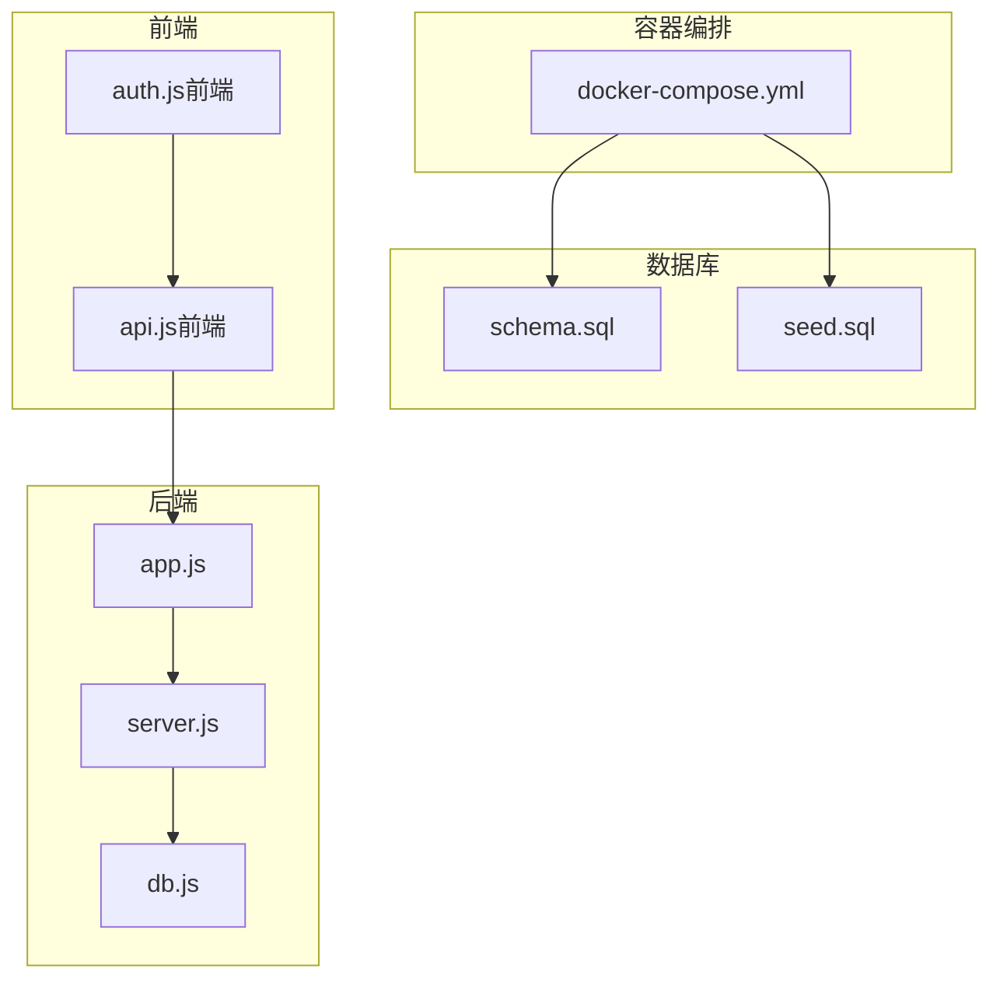
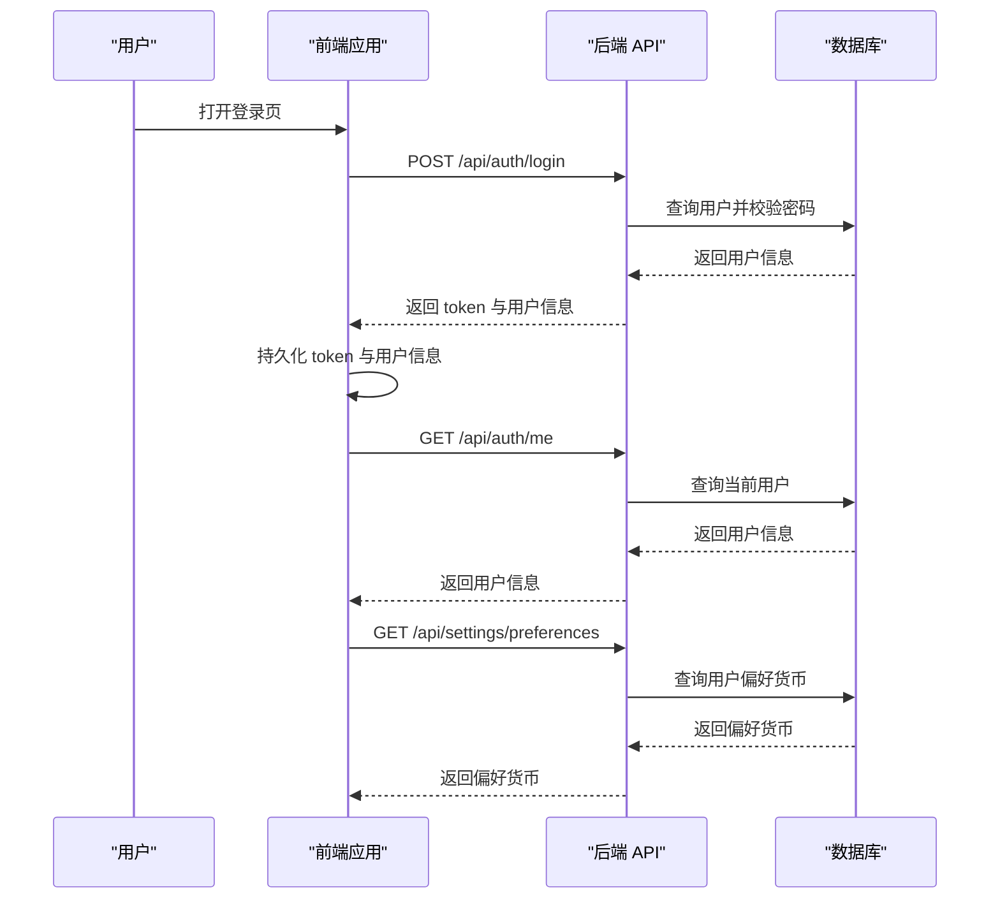
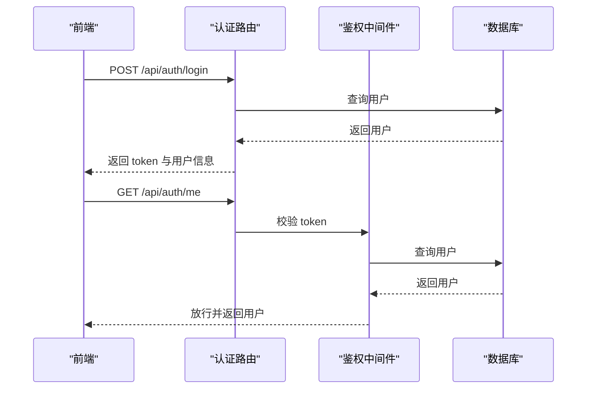
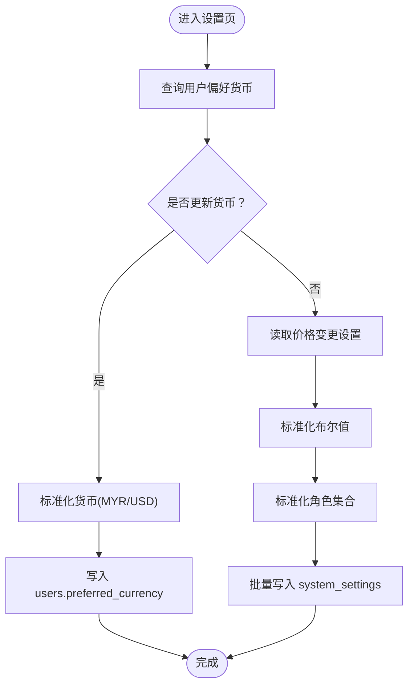
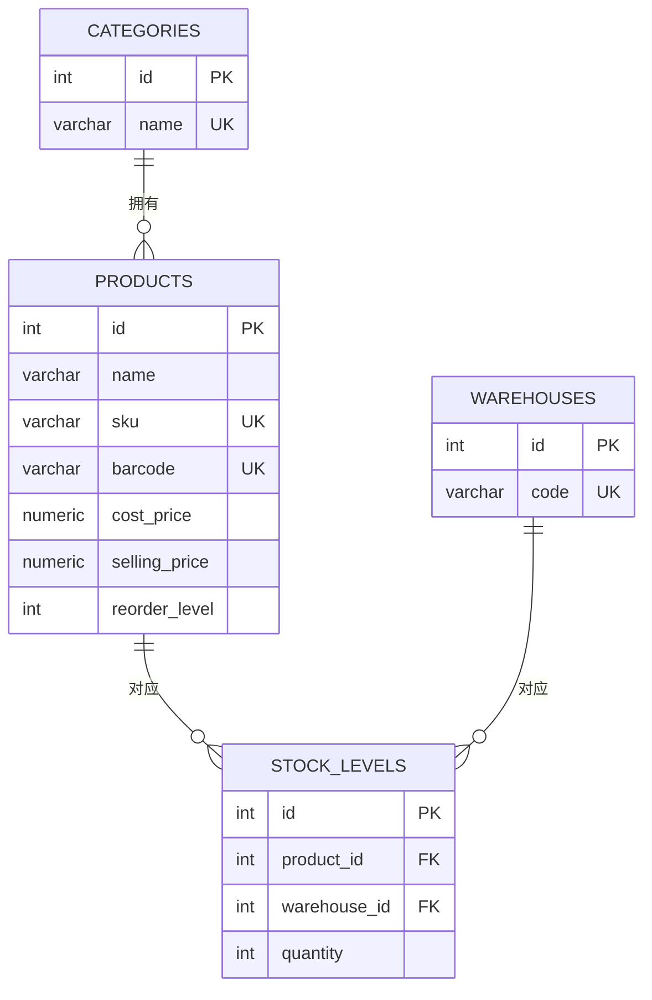
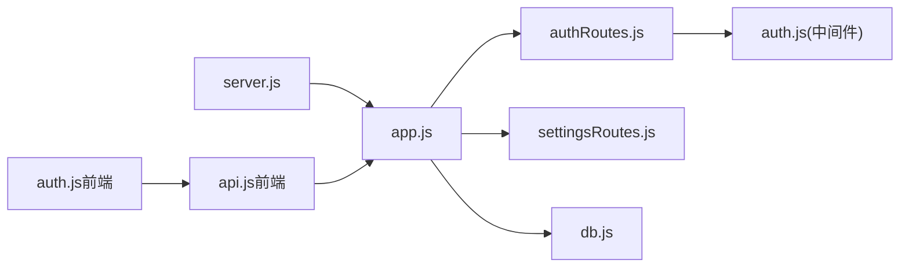

# 初始化数据

<cite>
**本文引用的文件**
- [schema.sql](file://server/database/schema.sql)
- [seed.sql](file://server/database/seed.sql)
- [db.js](file://server/src/config/db.js)
- [authRoutes.js](file://server/src/routes/authRoutes.js)
- [settingsRoutes.js](file://server/src/routes/settingsRoutes.js)
- [auth.js](file://server/src/middleware/auth.js)
- [server.js](file://server/src/server.js)
- [app.js](file://server/src/app.js)
- [docker-compose.yml](file://docker-compose.yml)
- [README.md](file://README.md)
- [DEPLOY_FREE.md](file://DEPLOY_FREE.md)
- [auth.js（前端）](file://web/src/stores/auth.js)
- [api.js（前端）](file://web/src/services/api.js)
</cite>

## 目录
1. [简介](#简介)
2. [项目结构](#项目结构)
3. [核心组件](#核心组件)
4. [架构总览](#架构总览)
5. [详细组件分析](#详细组件分析)
6. [依赖关系分析](#依赖关系分析)
7. [性能考量](#性能考量)
8. [故障排查指南](#故障排查指南)
9. [结论](#结论)
10. [附录](#附录)

## 简介
本章节说明库存管理系统在启动时所需的基础数据，即“种子数据（Seed Data）”。这些数据用于支撑系统在首次部署或重置后即可正常运行，包括默认用户、基础分类与仓库、示例商品及初始库存、系统设置键值等。同时给出导入方法、数据字典、环境差异化配置建议以及数据验证与完整性检查方法。

## 项目结构
- 后端通过数据库初始化脚本完成表结构与种子数据的创建。
- 前端通过环境变量配置 API 地址，并在登录后持久化用户状态与偏好货币。
- 容器编排在首次启动时自动执行初始化脚本，确保数据库具备可用的种子数据。

图表来源
- [docker-compose.yml:1-57](file://docker-compose.yml#L1-L57)
- [schema.sql:1-447](file://server/database/schema.sql#L1-L447)
- [seed.sql:1-114](file://server/database/seed.sql#L1-L114)
- [app.js:1-67](file://server/src/app.js#L1-L67)
- [server.js:1-27](file://server/src/server.js#L1-L27)
- [db.js:1-25](file://server/src/config/db.js#L1-L25)
- [api.js（前端）:1-45](file://web/src/services/api.js#L1-L45)
- [auth.js（前端）:1-90](file://web/src/stores/auth.js#L1-L90)

章节来源
- [README.md:31-54](file://README.md#L31-L54)
- [docker-compose.yml:14-15](file://docker-compose.yml#L14-L15)
- [schema.sql:1-447](file://server/database/schema.sql#L1-L447)
- [seed.sql:1-114](file://server/database/seed.sql#L1-L114)

## 核心组件
- 用户（users）
  - 默认管理员、仓管、员工与测试账户，便于快速登录与功能验证。
  - 字段要点：全名、邮箱唯一、密码哈希、角色（ADMIN/MANAGER/STAFF）、是否激活、偏好货币、创建时间。
- 角色与权限
  - 基于角色的访问控制（RBAC），后端路由与中间件限制访问范围。
- 分类（categories）
  - 基础分类，如“电子产品”、“办公用品”，用于商品归类。
- 仓库（warehouses）
  - 主仓库与门店仓库，含编码唯一性约束。
- 商品（products）
  - 包含名称、SKU/条码唯一、单位、成本价/售价、建议价、补货线等。
- 库存（stock_levels）
  - 按产品+仓库维度记录可用数量与占用数量。
- 系统设置（system_settings）
  - 键值对形式存储系统级配置，如价格变动阈值、通知开关与目标角色等。
- 偏好货币（users.preferred_currency）
  - 用户层面的货币偏好，默认 MYR，支持更新。

章节来源
- [seed.sql:1-114](file://server/database/seed.sql#L1-L114)
- [schema.sql:2-11](file://server/database/schema.sql#L2-L11)
- [schema.sql:15-20](file://server/database/schema.sql#L15-L20)
- [schema.sql:22-30](file://server/database/schema.sql#L22-L30)
- [schema.sql:32-54](file://server/database/schema.sql#L32-L54)
- [schema.sql:125-133](file://server/database/schema.sql#L125-L133)
- [schema.sql:390-396](file://server/database/schema.sql#L390-L396)
- [authRoutes.js:24-59](file://server/src/routes/authRoutes.js#L24-L59)
- [settingsRoutes.js:54-83](file://server/src/routes/settingsRoutes.js#L54-L83)

## 架构总览
初始化数据在系统启动阶段由数据库层提供，后端应用通过连接池访问数据库；前端通过 API 获取用户信息与偏好设置，完成登录态恢复与界面展示。

图表来源
- [authRoutes.js:17-69](file://server/src/routes/authRoutes.js#L17-L69)
- [auth.js（前端）:44-78](file://web/src/stores/auth.js#L44-L78)
- [settingsRoutes.js:54-83](file://server/src/routes/settingsRoutes.js#L54-L83)
- [api.js（前端）:8-24](file://web/src/services/api.js#L8-L24)

## 详细组件分析

### 用户与角色权限
- 种子数据包含默认用户，角色覆盖 ADMIN、MANAGER、STAFF，便于演示不同权限下的功能。
- 后端登录接口与鉴权中间件共同保证用户身份与权限校验。
- 前端登录成功后保存 token 与用户信息，并在刷新页面时调用“获取当前用户”接口恢复登录态。

图表来源
- [authRoutes.js:17-69](file://server/src/routes/authRoutes.js#L17-L69)
- [auth.js（前端）:44-78](file://web/src/stores/auth.js#L44-L78)
- [auth.js:5-29](file://server/src/middleware/auth.js#L5-L29)

章节来源
- [seed.sql:1-28](file://server/database/seed.sql#L1-L28)
- [authRoutes.js:17-69](file://server/src/routes/authRoutes.js#L17-L69)
- [auth.js（前端）:44-78](file://web/src/stores/auth.js#L44-L78)
- [auth.js:5-29](file://server/src/middleware/auth.js#L5-L29)

### 偏好货币与系统设置
- 用户偏好货币默认 MYR，可在设置页更新。
- 系统设置采用键值对存储，如价格变动通知阈值、启用开关与通知角色集合。
- 设置接口对布尔与枚举值进行标准化处理，确保输入合法。

图表来源
- [settingsRoutes.js:54-83](file://server/src/routes/settingsRoutes.js#L54-L83)
- [settingsRoutes.js:85-141](file://server/src/routes/settingsRoutes.js#L85-L141)

章节来源
- [settingsRoutes.js:54-83](file://server/src/routes/settingsRoutes.js#L54-L83)
- [settingsRoutes.js:85-141](file://server/src/routes/settingsRoutes.js#L85-L141)
- [schema.sql:390-396](file://server/database/schema.sql#L390-L396)

### 商品与库存初始化
- 示例商品包含 SKU、条码、成本价、售价、补货线等字段。
- 初始库存按产品×仓库组合插入，确保主仓库有示例库存。

图表来源
- [seed.sql:44-113](file://server/database/seed.sql#L44-L113)
- [schema.sql:32-54](file://server/database/schema.sql#L32-L54)
- [schema.sql:125-133](file://server/database/schema.sql#L125-L133)
- [schema.sql:15-20](file://server/database/schema.sql#L15-L20)
- [schema.sql:22-30](file://server/database/schema.sql#L22-L30)

章节来源
- [seed.sql:44-113](file://server/database/seed.sql#L44-L113)
- [schema.sql:32-54](file://server/database/schema.sql#L32-L54)
- [schema.sql:125-133](file://server/database/schema.sql#L125-L133)

### 初始化数据导入方法与脚本说明
- 本地开发
  - 创建数据库后，使用 psql 分别执行 schema.sql 与 seed.sql。
- Docker 编排
  - 容器启动时自动挂载初始化脚本，首次初始化完成后继续运行。
- 部署到 Render（生产）
  - 首次部署需手动执行 schema.sql 与 seed.sql，确保新表与种子数据就绪。

章节来源
- [README.md:37-40](file://README.md#L37-L40)
- [README.md:104](file://README.md#L104)
- [docker-compose.yml:14-15](file://docker-compose.yml#L14-L15)
- [DEPLOY_FREE.md:108-126](file://DEPLOY_FREE.md#L108-L126)

### 数据字典与配置项清单
- 用户（users）
  - 关键字段：id、full_name、email（唯一）、password_hash、role（ADMIN/MANAGER/STAFF）、is_active、preferred_currency（默认 MYR）、created_at。
- 分类（categories）
  - 关键字段：id、name（唯一）、description、created_at。
- 仓库（warehouses）
  - 关键字段：id、name、code（唯一）、address、manager_name、is_active、created_at。
- 商品（products）
  - 关键字段：id、name、sku（唯一）、barcode（唯一）、category_id、unit、cost_price、selling_price、markup_percentage、suggested_price、reorder_level、is_active、created_at、updated_at。
- 库存（stock_levels）
  - 关键字段：id、product_id、warehouse_id、quantity、allocated_quantity、updated_at。
- 系统设置（system_settings）
  - 关键字段：id、setting_key（唯一）、setting_value、updated_by、updated_at。
- 偏好货币（users.preferred_currency）
  - 取值：MYR、USD（设置接口进行标准化）。

章节来源
- [schema.sql:2-11](file://server/database/schema.sql#L2-L11)
- [schema.sql:15-20](file://server/database/schema.sql#L15-L20)
- [schema.sql:22-30](file://server/database/schema.sql#L22-L30)
- [schema.sql:32-54](file://server/database/schema.sql#L32-L54)
- [schema.sql:125-133](file://server/database/schema.sql#L125-L133)
- [schema.sql:390-396](file://server/database/schema.sql#L390-L396)

### 不同部署环境的初始化数据调整
- 开发环境（本地/容器）
  - 使用默认种子数据，便于快速验证登录与功能。
- 测试/预发布环境
  - 可保留默认种子数据，但建议修改默认密码并在上线前轮换。
- 生产环境
  - 首次部署必须执行 schema.sql 与 seed.sql，确保表结构与种子数据一致。
  - 保持 JWT_SECRET 稳定，避免频繁轮换导致用户频繁失效。

章节来源
- [DEPLOY_FREE.md:84-90](file://DEPLOY_FREE.md#L84-L90)
- [DEPLOY_FREE.md:108-126](file://DEPLOY_FREE.md#L108-L126)
- [README.md:104](file://README.md#L104)

### 数据验证与完整性检查
- 连接超时与健康检查
  - 后端启动时对数据库执行心跳查询，超时则拒绝启动。
- 唯一性与约束
  - 邮箱、SKU、条码、仓库编码、产品编号等字段具有唯一性约束。
- 登录与鉴权
  - 登录接口与鉴权中间件确保用户存在且激活，角色有效。
- 设置项校验
  - 设置接口对布尔值与角色集合进行标准化，防止非法输入。

章节来源
- [server.js:18-24](file://server/src/server.js#L18-L24)
- [seed.sql:28](file://server/database/seed.sql#L28)
- [seed.sql:42](file://server/database/seed.sql#L42)
- [seed.sql:68](file://server/database/seed.sql#L68)
- [seed.sql:93](file://server/database/seed.sql#L93)
- [authRoutes.js:31-39](file://server/src/routes/authRoutes.js#L31-L39)
- [auth.js:20-22](file://server/src/middleware/auth.js#L20-L22)
- [settingsRoutes.js:10-20](file://server/src/routes/settingsRoutes.js#L10-L20)
- [settingsRoutes.js:22-29](file://server/src/routes/settingsRoutes.js#L22-L29)
- [settingsRoutes.js:31-35](file://server/src/routes/settingsRoutes.js#L31-L35)

## 依赖关系分析
- 后端应用依赖数据库连接池，启动时进行数据库连通性检查。
- 路由层依赖中间件实现鉴权与审计日志。
- 前端依赖 API 服务与 Pinia 状态管理，持久化登录态与用户偏好。

图表来源
- [server.js:1-27](file://server/src/server.js#L1-L27)
- [app.js:1-67](file://server/src/app.js#L1-L67)
- [authRoutes.js:1-72](file://server/src/routes/authRoutes.js#L1-L72)
- [settingsRoutes.js:1-144](file://server/src/routes/settingsRoutes.js#L1-L144)
- [auth.js:1-46](file://server/src/middleware/auth.js#L1-L46)
- [db.js:1-25](file://server/src/config/db.js#L1-L25)
- [auth.js（前端）:1-90](file://web/src/stores/auth.js#L1-L90)
- [api.js（前端）:1-45](file://web/src/services/api.js#L1-L45)

章节来源
- [server.js:1-27](file://server/src/server.js#L1-L27)
- [app.js:1-67](file://server/src/app.js#L1-L67)
- [auth.js:1-46](file://server/src/middleware/auth.js#L1-L46)
- [auth.js（前端）:1-90](file://web/src/stores/auth.js#L1-L90)
- [api.js（前端）:1-45](file://web/src/services/api.js#L1-L45)

## 性能考量
- 初始化脚本仅在首次部署执行，后续无需重复导入。
- 前端登录态持久化减少重复鉴权请求。
- 合理设置数据库连接超时与 SSL 参数，提升生产环境稳定性。

## 故障排查指南
- 启动失败（数据库连接超时）
  - 检查 DATABASE_URL、SSL 配置与网络连通性。
- 登录 401
  - 确认 JWT_SECRET 稳定，未被意外轮换；检查用户是否存在且激活。
- 设置接口报错
  - 确认传入参数符合规范（布尔值、角色集合、货币枚举）。
- 首次部署后功能异常
  - 确认 schema.sql 与 seed.sql 已成功执行；核对表结构与种子数据。

章节来源
- [server.js:18-24](file://server/src/server.js#L18-L24)
- [authRoutes.js:31-39](file://server/src/routes/authRoutes.js#L31-L39)
- [settingsRoutes.js:10-20](file://server/src/routes/settingsRoutes.js#L10-L20)
- [settingsRoutes.js:22-29](file://server/src/routes/settingsRoutes.js#L22-L29)
- [settingsRoutes.js:31-35](file://server/src/routes/settingsRoutes.js#L31-L35)
- [DEPLOY_FREE.md:261-281](file://DEPLOY_FREE.md#L261-L281)

## 结论
初始化数据是系统正常运行的基石。通过 schema.sql 与 seed.sql 提供的结构与种子数据，结合容器编排与部署指南，可确保系统在不同环境下快速、稳定地完成首次部署。配合严格的输入校验与完整性约束，能够有效保障业务数据的准确性与一致性。

## 附录
- 初始化脚本路径
  - [schema.sql](file://server/database/schema.sql)
  - [seed.sql](file://server/database/seed.sql)
- 启动与连接
  - [server.js](file://server/src/server.js)
  - [db.js](file://server/src/config/db.js)
- 登录与设置
  - [authRoutes.js](file://server/src/routes/authRoutes.js)
  - [settingsRoutes.js](file://server/src/routes/settingsRoutes.js)
  - [auth.js（前端）](file://web/src/stores/auth.js)
  - [api.js（前端）](file://web/src/services/api.js)
- 部署与环境
  - [docker-compose.yml](file://docker-compose.yml)
  - [README.md](file://README.md)
  - [DEPLOY_FREE.md](file://DEPLOY_FREE.md)