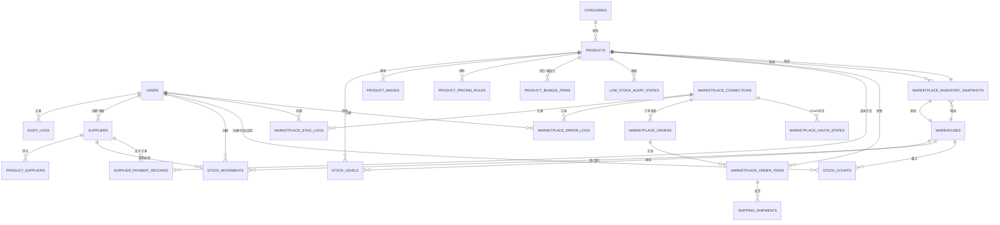
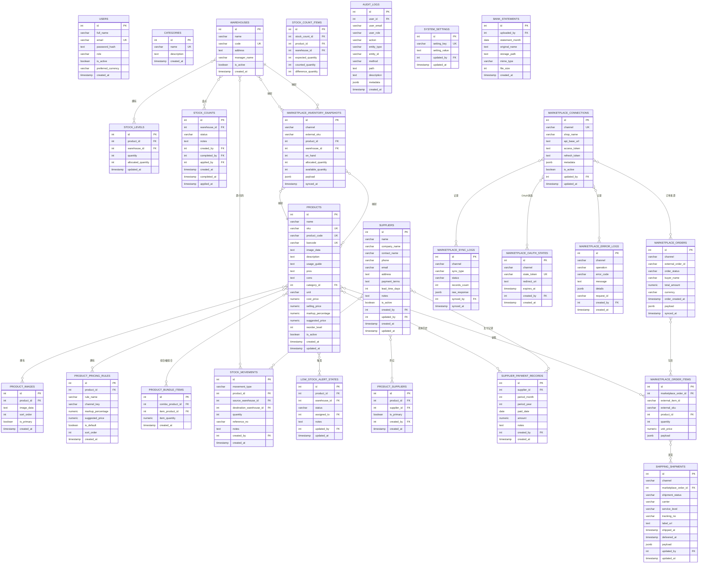
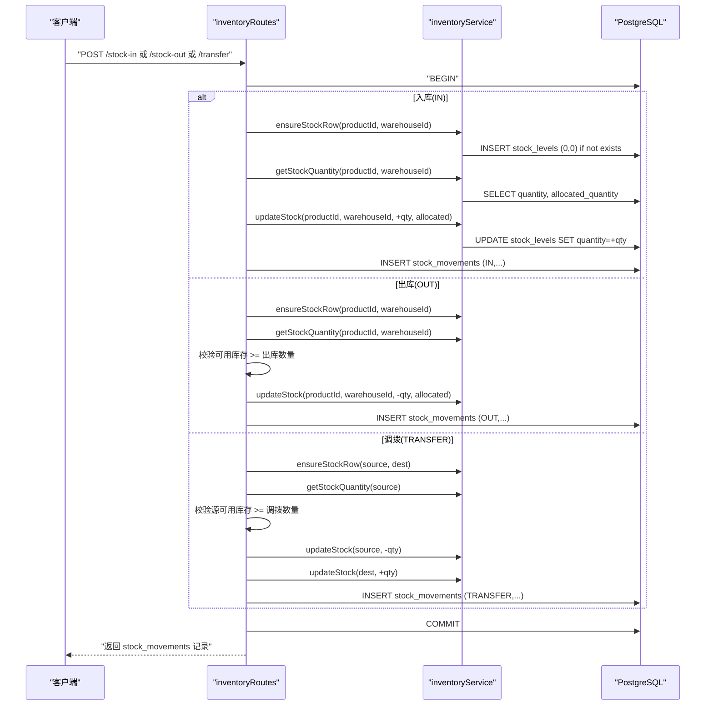
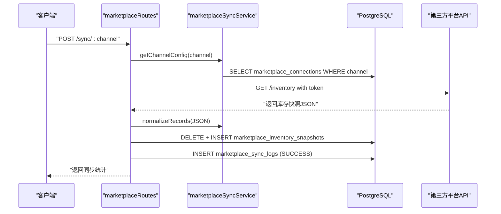
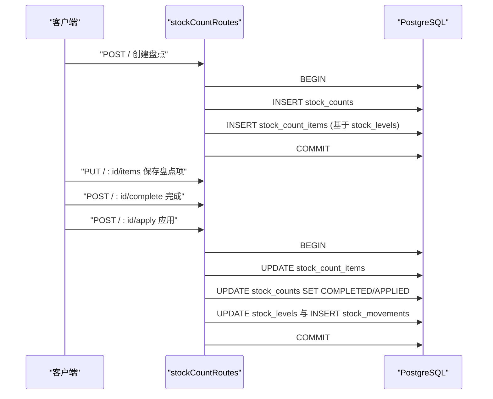
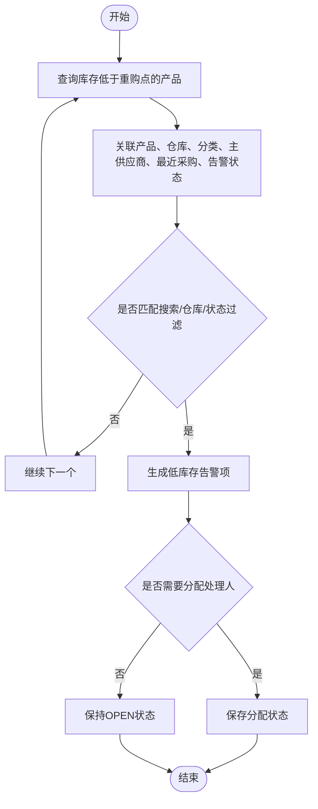

# 实体关系模型

<cite>
**本文引用的文件**
- [schema.sql](file://server/database/schema.sql)
- [seed.sql](file://server/database/seed.sql)
- [db.js](file://server/src/config/db.js)
- [inventoryRoutes.js](file://server/src/routes/inventoryRoutes.js)
- [orderRoutes.js](file://server/src/routes/orderRoutes.js)
- [supplierRoutes.js](file://server/src/routes/supplierRoutes.js)
- [marketplaceRoutes.js](file://server/src/routes/marketplaceRoutes.js)
- [stockCountRoutes.js](file://server/src/routes/stockCountRoutes.js)
- [alertsRoutes.js](file://server/src/routes/alertsRoutes.js)
- [inventoryService.js](file://server/src/utils/inventoryService.js)
- [marketplaceSyncService.js](file://server/src/services/marketplaceSyncService.js)
- [auditLog.js](file://server/src/utils/auditLog.js)
</cite>

## 目录
1. [简介](#简介)
2. [项目结构](#项目结构)
3. [核心组件](#核心组件)
4. [架构总览](#架构总览)
5. [详细组件分析](#详细组件分析)
6. [依赖分析](#依赖分析)
7. [性能考量](#性能考量)
8. [故障排查指南](#故障排查指南)
9. [结论](#结论)
10. [附录](#附录)

## 简介
本文件面向库存管理系统，聚焦于数据库实体关系模型（ERD），梳理用户、产品、仓库、供应商、订单、库存流水、盘点与告警等核心业务实体之间的关系，解释一对一、一对多、多对多关系，并说明这些关系如何支撑库存流转、供应链管理与电商集成等业务流程。同时提供关系维护最佳实践与数据一致性保障机制。

## 项目结构
后端采用 Node.js + PostgreSQL 架构，数据库结构在 schema.sql 中定义，种子数据在 seed.sql 初始化基础数据；路由层通过 Express 提供 REST 接口，服务层封装电商同步与库存操作逻辑，工具层提供审计日志与通用服务。

```mermaid
graph TB
subgraph "数据库层"
T_USERS["users"]
T_CATEGORIES["categories"]
T_WAREHOUSES["warehouses"]
T_PRODUCTS["products"]
T_PRODUCT_IMAGES["product_images"]
T_PRODUCT_PRICING["product_pricing_rules"]
T_PRODUCT_BUNDLE["product_bundle_items"]
T_STOCK_LEVELS["stock_levels"]
T_STOCK_MOVEMENTS["stock_movements"]
T_STOCK_COUNTS["stock_counts"]
T_STOCK_COUNT_ITEMS["stock_count_items"]
T_LOW_STOCK_ALERTS["low_stock_alert_states"]
T_SUPPLIERS["suppliers"]
T_PRODUCT_SUPPLIERS["product_suppliers"]
T_SUPPLIER_PAYMENTS["supplier_payment_records"]
T_MARKETPLACE_CONNS["marketplace_connections"]
T_MARKETPLACE_ORDERS["marketplace_orders"]
T_MARKETPLACE_ORDER_ITEMS["marketplace_order_items"]
T_MARKETPLACE_SHIPMENTS["shipping_shipments"]
T_MARKETPLACE_SNAPSHOTS["marketplace_inventory_snapshots"]
T_MARKETPLACE_SYNC_LOGS["marketplace_sync_logs"]
T_MARKETPLACE_OAUTH_STATES["marketplace_oauth_states"]
T_MARKETPLACE_ERROR_LOGS["marketplace_error_logs"]
T_AUDIT_LOGS["audit_logs"]
T_SYSTEM_SETTINGS["system_settings"]
T_BANK_STATEMENTS["bank_statements"]
end
subgraph "应用层"
R_INVENTORY["inventoryRoutes"]
R_ORDER["orderRoutes"]
R_SUPPLIER["supplierRoutes"]
R_MARKETPLACE["marketplaceRoutes"]
R_STOCK_COUNT["stockCountRoutes"]
R_ALERTS["alertsRoutes"]
S_INV_SERVICE["inventoryService"]
S_MP_SYNC["marketplaceSyncService"]
U_AUDIT["auditLog"]
end
R_INVENTORY --> S_INV_SERVICE
R_INVENTORY --> T_STOCK_MOVEMENTS
R_INVENTORY --> T_STOCK_LEVELS
R_INVENTORY --> T_PRODUCTS
R_INVENTORY --> T_WAREHOUSES
R_ORDER --> T_MARKETPLACE_ORDERS
R_ORDER --> T_MARKETPLACE_ORDER_ITEMS
R_SUPPLIER --> T_SUPPLIERS
R_SUPPLIER --> T_PRODUCT_SUPPLIERS
R_SUPPLIER --> T_SUPPLIER_PAYMENTS
R_MARKETPLACE --> S_MP_SYNC
R_MARKETPLACE --> T_MARKETPLACE_CONNS
R_MARKETPLACE --> T_MARKETPLACE_ORDERS
R_MARKETPLACE --> T_MARKETPLACE_ORDER_ITEMS
R_MARKETPLACE --> T_MARKETPLACE_SHIPMENTS
R_MARKETPLACE --> T_MARKETPLACE_SNAPSHOTS
R_MARKETPLACE --> T_MARKETPLACE_SYNC_LOGS
R_MARKETPLACE --> T_MARKETPLACE_OAUTH_STATES
R_MARKETPLACE --> T_MARKETPLACE_ERROR_LOGS
R_STOCK_COUNT --> T_STOCK_COUNTS
R_STOCK_COUNT --> T_STOCK_COUNT_ITEMS
R_STOCK_COUNT --> T_STOCK_MOVEMENTS
R_STOCK_COUNT --> T_STOCK_LEVELS
R_ALERTS --> T_LOW_STOCK_ALERTS
R_ALERTS --> T_PRODUCTS
R_ALERTS --> T_WAREHOUSES
R_ALERTS --> T_SUPPLIERS
U_AUDIT --> T_AUDIT_LOGS
```

图表来源
- [schema.sql](file://server/database/schema.sql)
- [inventoryRoutes.js](file://server/src/routes/inventoryRoutes.js)
- [orderRoutes.js](file://server/src/routes/orderRoutes.js)
- [supplierRoutes.js](file://server/src/routes/supplierRoutes.js)
- [marketplaceRoutes.js](file://server/src/routes/marketplaceRoutes.js)
- [stockCountRoutes.js](file://server/src/routes/stockCountRoutes.js)
- [alertsRoutes.js](file://server/src/routes/alertsRoutes.js)
- [inventoryService.js](file://server/src/utils/inventoryService.js)
- [marketplaceSyncService.js](file://server/src/services/marketplaceSyncService.js)
- [auditLog.js](file://server/src/utils/auditLog.js)

章节来源
- [schema.sql](file://server/database/schema.sql)
- [db.js](file://server/src/config/db.js)

## 核心组件
- 数据库层：定义所有业务实体及外键约束，包含用户、分类、仓库、产品、库存、供应商、电商对接、盘点、告警、审计日志等表。
- 应用层：
  - 路由层：inventoryRoutes、orderRoutes、supplierRoutes、marketplaceRoutes、stockCountRoutes、alertsRoutes。
  - 服务层：inventoryService（库存增减）、marketplaceSyncService（电商同步）。
  - 工具层：auditLog（审计日志）。

章节来源
- [inventoryRoutes.js](file://server/src/routes/inventoryRoutes.js)
- [inventoryService.js](file://server/src/utils/inventoryService.js)
- [marketplaceRoutes.js](file://server/src/routes/marketplaceRoutes.js)
- [marketplaceSyncService.js](file://server/src/services/marketplaceSyncService.js)
- [alertsRoutes.js](file://server/src/routes/alertsRoutes.js)
- [stockCountRoutes.js](file://server/src/routes/stockCountRoutes.js)
- [auditLog.js](file://server/src/utils/auditLog.js)

## 架构总览
系统围绕“产品-仓库”库存视图展开，通过库存流水记录出入库与调拨；通过电商模块实现库存快照与订单同步；通过供应商模块管理采购与成本变更；通过告警模块驱动补货与提醒；通过审计日志追踪所有关键操作。

图表来源
- [schema.sql](file://server/database/schema.sql)

## 详细组件分析

### 实体关系模型（ERD）
以下为关键实体及其关系的可视化表示，标注了外键与索引，体现一对一、一对多、多对多关系。

图表来源
- [schema.sql](file://server/database/schema.sql)

### 关系与业务流程映射
- 库存流转
  - 出入库与调拨通过 stock_movements 记录，quantity 变化通过 stock_levels 更新，支持分配库存（allocated_quantity）用于订单占用。
  - 库存增减统一由 inventoryService 封装，确保事务性与一致性。
- 供应链管理
  - 供应商与产品通过 product_suppliers 关联，支持主供应商标记；采购入库时可记录 supplier_id、unit_cost、purchase_reason。
  - 成本价格变更记录在 product_cost_price_histories，支持通知策略与阈值控制。
- 电商集成
  - marketplace_connections 存储各平台连接信息；marketplace_sync_logs 记录同步结果；marketplace_inventory_snapshots 持有外部 SKU 与本地映射。
  - marketplace_orders 与 marketplace_order_items 支持订单同步；shipping_shipments 追踪发货状态。
- 盘点与告警
  - stock_counts 与 stock_count_items 支持全仓或指定仓的盘点流程；完成后根据差异生成出入库流水并更新库存。
  - low_stock_alert_states 基于 reorder_level 与当前库存触发告警，支持分配与状态管理。

章节来源
- [inventoryRoutes.js](file://server/src/routes/inventoryRoutes.js)
- [inventoryService.js](file://server/src/utils/inventoryService.js)
- [stockCountRoutes.js](file://server/src/routes/stockCountRoutes.js)
- [alertsRoutes.js](file://server/src/routes/alertsRoutes.js)
- [orderRoutes.js](file://server/src/routes/orderRoutes.js)
- [marketplaceRoutes.js](file://server/src/routes/marketplaceRoutes.js)
- [marketplaceSyncService.js](file://server/src/services/marketplaceSyncService.js)

### 库存增减与事务流程（序列图）

图表来源
- [inventoryRoutes.js](file://server/src/routes/inventoryRoutes.js)
- [inventoryService.js](file://server/src/utils/inventoryService.js)

### 电商库存同步流程（序列图）

图表来源
- [marketplaceRoutes.js](file://server/src/routes/marketplaceRoutes.js)
- [marketplaceSyncService.js](file://server/src/services/marketplaceSyncService.js)
- [schema.sql](file://server/database/schema.sql)

### 盘点流程（序列图）

图表来源
- [stockCountRoutes.js](file://server/src/routes/stockCountRoutes.js)
- [schema.sql](file://server/database/schema.sql)

### 告警与补货流程（流程图）

图表来源
- [alertsRoutes.js](file://server/src/routes/alertsRoutes.js)
- [schema.sql](file://server/database/schema.sql)

## 依赖分析
- 外键依赖
  - 所有业务实体均通过外键与核心实体（users、warehouses、products、suppliers、marketplace_connections）建立强约束，确保删除/更新行为符合 ON DELETE 策略（CASCADE/SET NULL）。
- 索引与性能
  - schema 中为高频查询字段建立索引（如 products.sku、stock_movements.created_at、marketplace_orders.channel/status 等），提升检索效率。
- 事务与一致性
  - 库存增减、盘点应用、电商同步等关键路径使用事务包裹，失败回滚，避免部分更新导致的数据不一致。
- 审计与可追溯
  - audit_logs 记录所有重要操作，结合路由层的审计上下文，形成完整的操作轨迹。

章节来源
- [schema.sql](file://server/database/schema.sql)
- [inventoryRoutes.js](file://server/src/routes/inventoryRoutes.js)
- [stockCountRoutes.js](file://server/src/routes/stockCountRoutes.js)
- [marketplaceRoutes.js](file://server/src/routes/marketplaceRoutes.js)
- [auditLog.js](file://server/src/utils/auditLog.js)

## 性能考量
- 查询优化
  - 使用分页参数与 LIMIT/OFFSET，避免一次性加载大量数据。
  - 对常用过滤字段（如 channel、status、created_at）建立索引，减少全表扫描。
- 写入优化
  - 批量插入 marketplace_inventory_snapshots 与 product_images，减少往返次数。
  - 使用 FOR UPDATE 在关键更新路径上降低并发冲突概率。
- 缓存与异步
  - 建议对热点报表（如库存概览、告警汇总）增加缓存层，定期刷新。
  - 电商同步建议异步队列化，避免阻塞请求线程。

## 故障排查指南
- 常见错误与定位
  - 库存不足：检查 stock_levels 的可用量（on_hand - allocated）与出入库流水，确认是否存在未释放的占用。
  - 电商同步失败：查看 marketplace_sync_logs 与 marketplace_error_logs，核对连接配置与令牌有效性。
  - 盘点差异：核对 stock_count_items 的 expected/counted/difference，确认应用前后的 stock_levels 是否正确更新。
- 审计追踪
  - 通过 audit_logs 快速定位操作人、时间、方法与路径，辅助问题复盘。
- 数据修复
  - 使用事务包裹修复脚本，先 SELECT 再 UPDATE，确保原子性与可回滚。

章节来源
- [alertsRoutes.js](file://server/src/routes/alertsRoutes.js)
- [marketplaceRoutes.js](file://server/src/routes/marketplaceRoutes.js)
- [stockCountRoutes.js](file://server/src/routes/stockCountRoutes.js)
- [auditLog.js](file://server/src/utils/auditLog.js)

## 结论
该库存系统的 ERD 清晰地刻画了从产品、仓库到供应商、电商与盘点告警的完整闭环。通过严格的外键约束、事务与审计机制，系统在复杂业务场景下仍能保持数据一致性与可追溯性。建议在生产环境中持续监控关键指标（同步成功率、库存准确率、告警响应时效），并结合索引与缓存策略进一步优化性能。

## 附录
- 初始化数据
  - 种子数据包含初始用户、分类、仓库与示例产品，便于快速验证库存与电商功能。
- 环境配置
  - 数据库连接通过环境变量配置，支持 SSL 与超时设置，满足不同部署环境需求。

章节来源
- [seed.sql](file://server/database/seed.sql)
- [db.js](file://server/src/config/db.js)