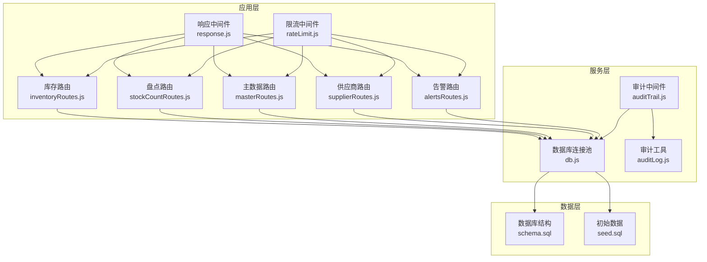
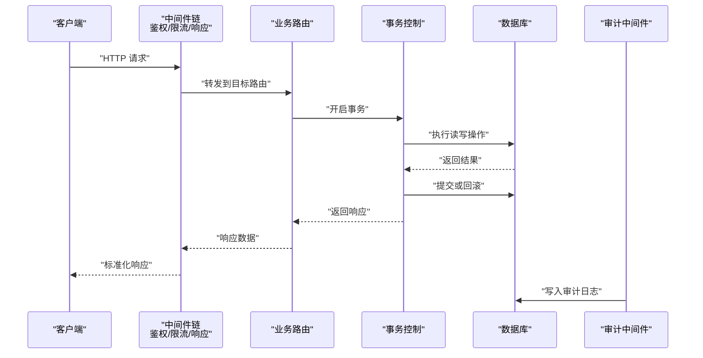
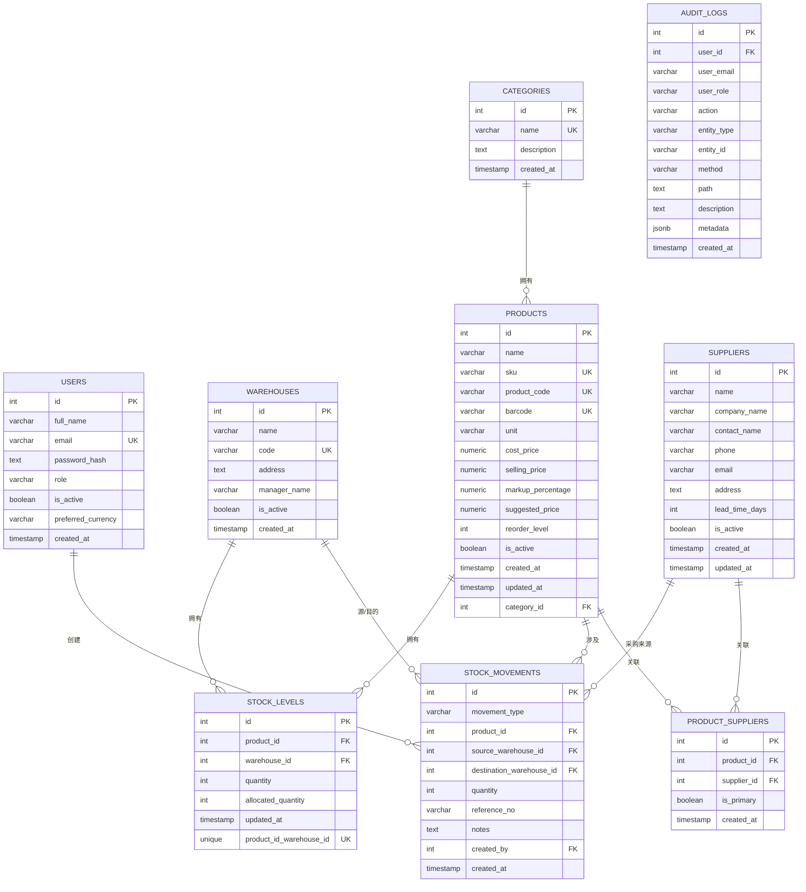
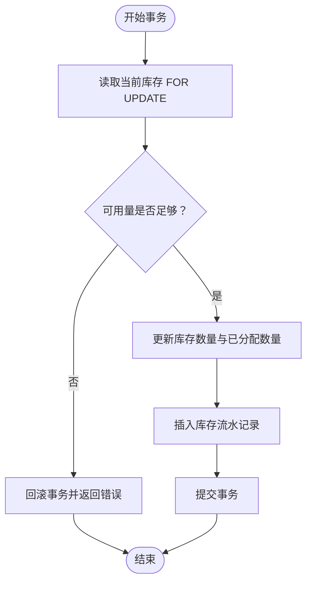
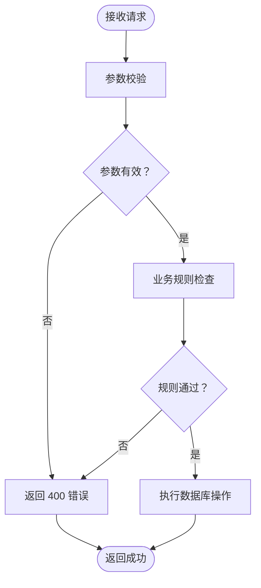
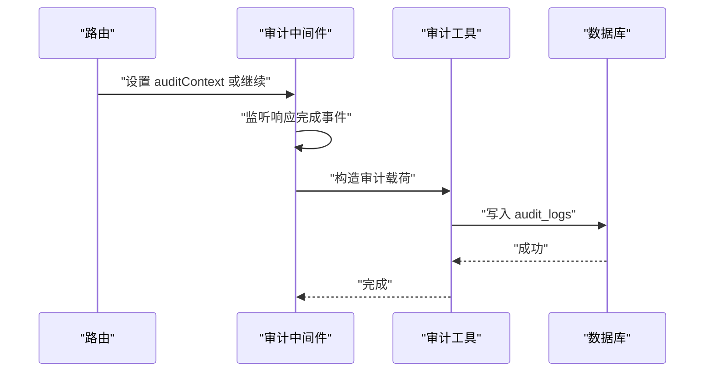
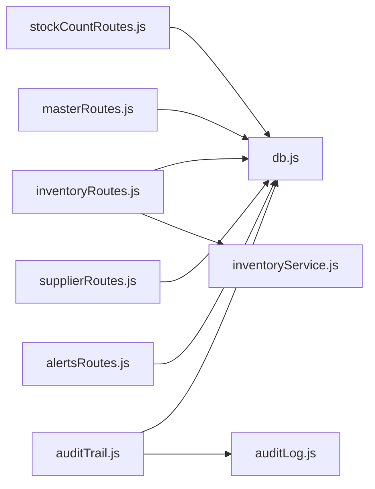

# 数据完整性

<cite>
**本文引用的文件**
- [schema.sql](file://server/database/schema.sql)
- [seed.sql](file://server/database/seed.sql)
- [db.js](file://server/src/config/db.js)
- [auditTrail.js](file://server/src/middleware/auditTrail.js)
- [auditLog.js](file://server/src/utils/auditLog.js)
- [inventoryRoutes.js](file://server/src/routes/inventoryRoutes.js)
- [stockCountRoutes.js](file://server/src/routes/stockCountRoutes.js)
- [masterRoutes.js](file://server/src/routes/masterRoutes.js)
- [supplierRoutes.js](file://server/src/routes/supplierRoutes.js)
- [alertsRoutes.js](file://server/src/routes/alertsRoutes.js)
- [response.js](file://server/src/middleware/response.js)
- [rateLimit.js](file://server/src/middleware/rateLimit.js)
</cite>

## 目录
1. [引言](#引言)
2. [项目结构](#项目结构)
3. [核心组件](#核心组件)
4. [架构总览](#架构总览)
5. [详细组件分析](#详细组件分析)
6. [依赖关系分析](#依赖关系分析)
7. [性能考量](#性能考量)
8. [故障排查指南](#故障排查指南)
9. [结论](#结论)
10. [附录](#附录)

## 引言
本文件聚焦于库存管理系统的“数据完整性”，从数据库设计、约束与索引、事务一致性、审计追踪、并发控制与锁机制等维度，系统性阐述如何在该系统中保障数据的准确性、一致性和可靠性。文档同时给出数据验证机制、完整性检查方法与工具、备份与灾难恢复策略建议，以及常见问题的排查路径。

## 项目结构
后端采用 Node.js + PostgreSQL 架构，数据库结构与种子数据位于 server/database，连接池与查询封装位于 server/src/config/db.js；业务路由集中在 server/src/routes 下，审计中间件与通用工具位于 server/src/middleware 与 server/src/utils。

**图表来源**
- [db.js:1-25](file://server/src/config/db.js#L1-L25)
- [auditTrail.js:1-84](file://server/src/middleware/auditTrail.js#L1-L84)
- [auditLog.js:1-38](file://server/src/utils/auditLog.js#L1-L38)
- [schema.sql:1-447](file://server/database/schema.sql#L1-L447)
- [seed.sql:1-114](file://server/database/seed.sql#L1-L114)

**章节来源**
- [db.js:1-25](file://server/src/config/db.js#L1-L25)
- [schema.sql:1-447](file://server/database/schema.sql#L1-L447)
- [seed.sql:1-114](file://server/database/seed.sql#L1-L114)

## 核心组件
- 数据库层：通过表结构定义、外键约束、CHECK 约束、唯一索引与复合索引，确保实体完整性、参照完整性与业务规则强制执行。
- 连接与查询：PostgreSQL 连接池封装，自动 SSL 判定与超时配置，统一 query 接口。
- 事务与一致性：库存出入库、调拨、盘点应用均使用 BEGIN/COMMIT/ROLLBACK 显式事务，配合 FOR UPDATE 实现行级锁，避免并发冲突。
- 审计与可追溯：全局审计中间件在请求完成后记录操作日志，覆盖用户、动作、实体、元数据等字段。
- 验证与防护：路由层参数校验、中间件限流、响应标准化输出，降低异常与攻击风险。

**章节来源**
- [schema.sql:1-447](file://server/database/schema.sql#L1-L447)
- [db.js:1-25](file://server/src/config/db.js#L1-L25)
- [auditTrail.js:1-84](file://server/src/middleware/auditTrail.js#L1-L84)
- [auditLog.js:1-38](file://server/src/utils/auditLog.js#L1-L38)
- [inventoryRoutes.js:229-403](file://server/src/routes/inventoryRoutes.js#L229-L403)
- [stockCountRoutes.js:273-324](file://server/src/routes/stockCountRoutes.js#L273-L324)

## 架构总览
以下图展示数据完整性相关的关键交互：路由层发起业务请求，经中间件处理（鉴权、限流、响应包装），进入事务控制与数据库访问，最终写入审计日志。

**图表来源**
- [response.js:1-62](file://server/src/middleware/response.js#L1-L62)
- [rateLimit.js:1-40](file://server/src/middleware/rateLimit.js#L1-L40)
- [inventoryRoutes.js:229-403](file://server/src/routes/inventoryRoutes.js#L229-L403)
- [stockCountRoutes.js:273-324](file://server/src/routes/stockCountRoutes.js#L273-L324)
- [auditTrail.js:47-79](file://server/src/middleware/auditTrail.js#L47-L79)

## 详细组件分析

### 数据库设计与约束
- 实体完整性：所有主表使用自增主键，非空字段广泛使用 NOT NULL。
- 参照完整性：大量外键约束（如 products.category_id、stock_levels.product_id/warehouse_id、stock_movements.created_by 等）配合 ON DELETE 行为（CASCADE/SET NULL）保证关联删除与清理策略。
- 业务规则强制：CHECK 约束用于枚举值限制（如 movement_type、status）、数值范围（如 quantity ≥ 0、markup_percentage、reorder_level 等）。
- 唯一性与去重：UNIQUE 约束（如 users.email、products.sku/product_code/barcode、warehouses.code、stock_levels(product_id, warehouse_id) 等）避免重复录入。
- 索引优化：为高频查询字段建立索引（如产品、仓库、库存、审计、订单、供应商等），显著提升查询与联结性能。

**图表来源**
- [schema.sql:2-447](file://server/database/schema.sql#L2-L447)

**章节来源**
- [schema.sql:2-447](file://server/database/schema.sql#L2-L447)

### 外键约束与参照完整性
- 商品与分类：products.category_id → categories.id，删除时置空，避免级联删除影响库存视图。
- 库存与仓库/商品：stock_levels(product_id, warehouse_id) 联合唯一，外键约束确保不存在孤立库存。
- 凭证与用户：stock_movements.created_by → users.id，审计与责任追踪。
- 供应商与商品：product_suppliers(product_id, supplier_id) 联合唯一，确保每商品-供应商组合唯一。

这些外键与 ON DELETE 行为共同构成稳定的参照完整性，结合唯一索引与 CHECK 约束，形成强健的数据模型。

**章节来源**
- [schema.sql:44-356](file://server/database/schema.sql#L44-L356)

### 触发器与存储过程
- 当前代码库未发现显式的触发器与存储过程实现。系统通过数据库约束与应用层事务实现复杂业务规则（如库存可用量校验、调拨前后数量更新、盘点差异调整等）。若未来需要更复杂的自动化规则，可在数据库层面引入触发器或函数以补充。

**章节来源**
- [inventoryRoutes.js:229-403](file://server/src/routes/inventoryRoutes.js#L229-L403)
- [stockCountRoutes.js:326-431](file://server/src/routes/stockCountRoutes.js#L326-L431)

### 事务一致性与并发控制
- 显式事务：库存出入库、调拨、盘点应用均使用 BEGIN/COMMIT/ROLLBACK 包裹，确保多步写入原子性。
- 行级锁：盘点应用在读取目标库存时使用 FOR UPDATE，防止并发修改导致的超卖或数据不一致。
- 并发安全的库存更新：统一的库存服务封装 ensureStockRow/getStockQuantity/updateStock，避免重复初始化与竞态条件。

**图表来源**
- [inventoryRoutes.js:292-332](file://server/src/routes/inventoryRoutes.js#L292-L332)
- [stockCountRoutes.js:333-362](file://server/src/routes/stockCountRoutes.js#L333-L362)

**章节来源**
- [inventoryRoutes.js:229-403](file://server/src/routes/inventoryRoutes.js#L229-L403)
- [stockCountRoutes.js:326-431](file://server/src/routes/stockCountRoutes.js#L326-L431)
- [inventoryService.js:1-45](file://server/src/utils/inventoryService.js#L1-L45)

### 数据验证机制
- 输入验证：路由层对必填字段进行基础校验（如 productId、quantity、warehouseId 等），非法参数直接返回 400。
- 业务规则检查：库存出库/调拨前计算可用量（已分配量扣减），不足则拒绝；调拨源与目的仓必须不同。
- 数据格式验证：价格统一保留两位小数；枚举值通过 CHECK 约束限定；日期时间使用数据库默认 CURRENT_TIMESTAMP。
- 成本访问控制：通过专用头部与 JWT 校验，限制敏感成本字段的可见性。

**图表来源**
- [inventoryRoutes.js:230-336](file://server/src/routes/inventoryRoutes.js#L230-L336)
- [masterRoutes.js:22-35](file://server/src/routes/masterRoutes.js#L22-L35)

**章节来源**
- [inventoryRoutes.js:229-403](file://server/src/routes/inventoryRoutes.js#L229-L403)
- [masterRoutes.js:22-35](file://server/src/routes/masterRoutes.js#L22-L35)

### 审计与可追溯
- 全局审计中间件：在响应完成事件中收集上下文（动作、实体、路径、方法、状态码、请求体脱敏），写入 audit_logs。
- 审计工具：统一的写入函数，支持 JSONB 元数据持久化。
- 路由侧增强：部分路由在成功后设置 auditContext，确保关键操作被记录。

**图表来源**
- [auditTrail.js:47-79](file://server/src/middleware/auditTrail.js#L47-L79)
- [auditLog.js:1-38](file://server/src/utils/auditLog.js#L1-L38)

**章节来源**
- [auditTrail.js:1-84](file://server/src/middleware/auditTrail.js#L1-L84)
- [auditLog.js:1-38](file://server/src/utils/auditLog.js#L1-L38)

### 并发控制与锁机制
- 连接池与超时：连接池根据环境变量自动启用 SSL，并设置连接超时，提升稳定性。
- 行级锁：盘点应用在读取目标库存时使用 FOR UPDATE，避免并发写入导致的数据竞争。
- 事务隔离：显式事务包裹多步写入，确保一致性边界清晰。

**章节来源**
- [db.js:1-25](file://server/src/config/db.js#L1-L25)
- [stockCountRoutes.js:333-362](file://server/src/routes/stockCountRoutes.js#L333-L362)

### 数据完整性检查方法与工具
- 结构一致性：定期比对 schema.sql 与生产库实际结构，确保约束与索引一致。
- 数据一致性：编写 SQL 检查脚本，验证库存可用量=总量-已分配量、商品与定价规则数量、供应商与商品关联有效性等。
- 审计核对：基于 audit_logs 的操作轨迹，复盘关键变更（库存调整、价格变动、用户权限等）。
- 性能与索引：结合 EXPLAIN 分析慢查询，按需补充或调整索引。

**章节来源**
- [schema.sql:410-447](file://server/database/schema.sql#L410-L447)
- [auditTrail.js:1-84](file://server/src/middleware/auditTrail.js#L1-L84)

### 备份、恢复与灾难恢复策略
- 数据库备份：建议采用逻辑备份（如 pg_dump）与物理备份相结合，定期全量+增量备份。
- 恢复演练：制定 RTO/RPO 目标，定期进行恢复演练，验证备份可用性与恢复流程。
- 灾难恢复：跨机房/云区域部署，结合只读副本与自动故障转移，确保高可用。
- 版本与迁移：将 schema.sql 作为基线，配合迁移脚本管理结构演进，确保回滚能力。

[本节为通用实践建议，不直接分析具体文件]

### 并发控制与锁机制
- 连接池与超时：合理设置连接池大小与超时，避免连接耗尽引发的并发阻塞。
- 行级锁：FOR UPDATE 在高并发场景下可能成为瓶颈，建议通过批量处理与最小化事务时间缓解。
- 限流与熔断：通过限流中间件控制突发流量，保护数据库压力。

**章节来源**
- [db.js:1-25](file://server/src/config/db.js#L1-L25)
- [rateLimit.js:1-40](file://server/src/middleware/rateLimit.js#L1-L40)

## 依赖关系分析
- 路由依赖连接池与工具模块，统一通过 query 执行 SQL。
- 审计中间件独立于业务路由，仅依赖数据库连接池与审计工具。
- 库存服务封装了库存读写逻辑，被多个路由复用，降低重复代码与一致性风险。

**图表来源**
- [inventoryRoutes.js:1-493](file://server/src/routes/inventoryRoutes.js#L1-L493)
- [stockCountRoutes.js:1-434](file://server/src/routes/stockCountRoutes.js#L1-L434)
- [masterRoutes.js:1-800](file://server/src/routes/masterRoutes.js#L1-L800)
- [supplierRoutes.js:1-370](file://server/src/routes/supplierRoutes.js#L1-L370)
- [alertsRoutes.js:1-290](file://server/src/routes/alertsRoutes.js#L1-L290)
- [auditTrail.js:1-84](file://server/src/middleware/auditTrail.js#L1-L84)
- [auditLog.js:1-38](file://server/src/utils/auditLog.js#L1-L38)
- [db.js:1-25](file://server/src/config/db.js#L1-L25)

**章节来源**
- [inventoryRoutes.js:1-493](file://server/src/routes/inventoryRoutes.js#L1-L493)
- [stockCountRoutes.js:1-434](file://server/src/routes/stockCountRoutes.js#L1-L434)
- [masterRoutes.js:1-800](file://server/src/routes/masterRoutes.js#L1-L800)
- [supplierRoutes.js:1-370](file://server/src/routes/supplierRoutes.js#L1-L370)
- [alertsRoutes.js:1-290](file://server/src/routes/alertsRoutes.js#L1-L290)
- [auditTrail.js:1-84](file://server/src/middleware/auditTrail.js#L1-L84)
- [auditLog.js:1-38](file://server/src/utils/auditLog.js#L1-L38)
- [db.js:1-25](file://server/src/config/db.js#L1-L25)

## 性能考量
- 查询性能：为高频过滤与排序字段建立索引，避免全表扫描；对大结果集使用分页与延迟加载。
- 写入性能：批量插入与更新，减少往返次数；事务内合并多次写入。
- 连接池：合理设置最大连接数与超时，避免峰值拥塞。
- 审计开销：审计日志写入应异步化或降采样，避免阻塞主业务路径。

[本节提供通用指导，不直接分析具体文件]

## 故障排查指南
- 参数错误：检查路由层参数校验与错误响应，确认必填字段与格式。
- 事务失败：查看路由中的 ROLLBACK 逻辑，定位具体失败步骤。
- 并发冲突：关注 FOR UPDATE 使用位置与事务持续时间，必要时拆分事务或优化锁粒度。
- 审计缺失：确认审计中间件是否正确挂载，响应完成事件是否触发。
- 连接问题：检查连接字符串、SSL 配置与超时设置。

**章节来源**
- [inventoryRoutes.js:397-402](file://server/src/routes/inventoryRoutes.js#L397-L402)
- [stockCountRoutes.js:318-323](file://server/src/routes/stockCountRoutes.js#L318-L323)
- [auditTrail.js:47-79](file://server/src/middleware/auditTrail.js#L47-L79)
- [db.js:1-25](file://server/src/config/db.js#L1-L25)

## 结论
该系统通过严谨的数据库设计（外键、CHECK、唯一与索引）、显式事务与行级锁、统一的审计与响应中间件，构建了可靠的数据完整性体系。建议后续在复杂业务规则场景引入触发器/函数，并完善备份与灾备演练，持续监控与优化性能与一致性边界。

## 附录
- 初始数据：包含示例用户、分类、仓库与商品，便于快速验证库存与盘点流程。
- 响应标准化：统一 success/fail 输出与 requestId，便于前端与日志追踪。

**章节来源**
- [seed.sql:1-114](file://server/database/seed.sql#L1-L114)
- [response.js:1-62](file://server/src/middleware/response.js#L1-L62)