# 数据库表结构

<cite>
**本文引用的文件**
- [schema.sql](file://server/database/schema.sql)
- [seed.sql](file://server/database/seed.sql)
- [inventoryRoutes.js](file://server/src/routes/inventoryRoutes.js)
- [supplierRoutes.js](file://server/src/routes/supplierRoutes.js)
- [marketplaceRoutes.js](file://server/src/routes/marketplaceRoutes.js)
- [inventoryService.js](file://server/src/utils/inventoryService.js)
- [marketplaceSyncService.js](file://server/src/services/marketplaceSyncService.js)
</cite>

## 目录
1. [简介](#简介)
2. [项目结构与数据库相关模块](#项目结构与数据库相关模块)
3. [核心表结构概览](#核心表结构概览)
4. [架构总览](#架构总览)
5. [详细表结构与字段说明](#详细表结构与字段说明)
6. [依赖关系与参照完整性](#依赖关系与参照完整性)
7. [索引策略与性能优化](#索引策略与性能优化)
8. [业务规则与验证逻辑](#业务规则与验证逻辑)
9. [故障排查指南](#故障排查指南)
10. [结论](#结论)

## 简介
本文件面向库存管理系统的核心数据库表结构，聚焦于用户、产品、仓库、库存、供应商、订单等主要实体，系统性说明各表的字段定义、数据类型、约束条件、业务含义、主外键关系、参照完整性约束、索引策略与性能优化建议，并结合后端路由与服务层逻辑，解释典型业务流程中的数据流转与校验规则。

## 项目结构与数据库相关模块
- 数据库模式与初始化脚本位于 server/database/schema.sql（表结构）与 server/database/seed.sql（基础数据）。
- 后端路由与服务层通过 server/src/routes/* 与 server/src/utils/*、server/src/services/* 访问数据库并执行业务逻辑。
- 关键交互包括：库存增删转、供应商管理、多平台电商同步（Shopee/Lazada/TikTok）等。

```mermaid
graph TB
subgraph "数据库层"
U["users"]
C["categories"]
W["warehouses"]
P["products"]
PI["product_images"]
PB["product_bundle_items"]
PPR["product_pricing_rules"]
SL["stock_levels"]
SM["stock_movements"]
SC["stock_counts"]
SCI["stock_count_items"]
LSA["low_stock_alert_states"]
S["suppliers"]
PS["product_suppliers"]
SPRH["product_cost_price_histories"]
MO["marketplace_orders"]
MOI["marketplace_order_items"]
MSL["marketplace_sync_logs"]
MIS["marketplace_inventory_snapshots"]
MC["marketplace_connections"]
MOS["marketplace_oauth_states"]
MEL["marketplace_error_logs"]
SS["shipping_shipments"]
AL["audit_logs"]
SN["system_notifications"]
SS2["system_settings"]
BS["bank_statements"]
end
subgraph "应用层"
IR["inventoryRoutes.js"]
SR["supplierRoutes.js"]
MR["marketplaceRoutes.js"]
IS["inventoryService.js"]
MSS["marketplaceSyncService.js"]
end
IR --> IS
IR --> SL
IR --> P
IR --> W
IR --> AL
SR --> S
SR --> PS
SR --> SPRH
SR --> AL
MR --> MSS
MR --> MO
MR --> MOI
MR --> MSL
MR --> MIS
MR --> MC
MR --> MOS
MR --> MEL
MR --> SS
MR --> AL
```

图表来源
- [schema.sql:1-447](file://server/database/schema.sql#L1-L447)
- [inventoryRoutes.js:1-493](file://server/src/routes/inventoryRoutes.js#L1-L493)
- [supplierRoutes.js:1-370](file://server/src/routes/supplierRoutes.js#L1-L370)
- [marketplaceRoutes.js:1-641](file://server/src/routes/marketplaceRoutes.js#L1-L641)
- [inventoryService.js:1-45](file://server/src/utils/inventoryService.js#L1-L45)
- [marketplaceSyncService.js:1-146](file://server/src/services/marketplaceSyncService.js#L1-L146)

章节来源
- [schema.sql:1-447](file://server/database/schema.sql#L1-L447)
- [seed.sql:1-114](file://server/database/seed.sql#L1-L114)

## 核心表结构概览
以下为核心实体表的简要说明，后续章节将逐表展开字段、约束、业务规则与索引策略。

- 用户表 users：存储系统用户信息，含角色与货币偏好，默认激活状态。
- 分类表 categories：产品分类，名称唯一。
- 仓库表 warehouses：仓库基本信息，编码唯一。
- 产品表 products：产品主数据，含成本价、售价、建议价、加价率、重购点等，支持 SKU/条码/产品编码唯一。
- 产品图片表 product_images：产品图片，支持主图与排序。
- 组合套餐表 product_bundle_items：组合产品与其子项及数量。
- 价格规则表 product_pricing_rules：按渠道或默认的价格规则。
- 库存表 stock_levels：按产品+仓库维度的库存与占用量，唯一约束。
- 库存流水表 stock_movements：出入库与调拨流水，记录来源/去向仓库、参考单号、原因等。
- 库存盘点表 stock_counts 与明细 stock_count_items：盘点任务与每项差异。
- 低库存告警表 low_stock_alert_states：低库存状态与分配处理。
- 供应商表 suppliers：供应商信息，含联系人、电话、邮箱、地址、付款条款、前置天数等。
- 产品-供应商关联表 product_suppliers：产品与供应商的多对多关系，支持主供应商标记。
- 成本价历史表 product_cost_price_histories：成本价变更记录。
- 电商订单表 marketplace_orders 与明细 marketplace_order_items：外部平台订单同步。
- 电商库存快照表 marketplace_inventory_snapshots：外部库存快照映射到内部产品与仓库。
- 电商连接表 marketplace_connections：平台接入配置与令牌。
- 电商 OAuth 状态表 marketplace_oauth_states：OAuth 授权状态与过期时间。
- 电商错误日志表 marketplace_error_logs：同步与授权过程中的错误记录。
- 发货单表 shipping_shipments：发货状态与物流信息。
- 审计日志表 audit_logs：系统操作审计。
- 通知表 system_notifications：系统消息通知。
- 设置表 system_settings：系统配置键值。
- 银行流水表 bank_statements：上传的银行对账单文件元数据。

章节来源
- [schema.sql:1-447](file://server/database/schema.sql#L1-L447)

## 架构总览
下图展示核心表之间的关系与典型业务流（库存增删转、供应商管理、电商同步）。

```mermaid
erDiagram
users ||--o{ stock_movements : "创建"
users ||--o{ suppliers : "创建/更新"
users ||--o{ audit_logs : "产生"
users ||--o{ marketplace_connections : "更新"
users ||--o{ marketplace_error_logs : "产生"
users ||--o{ system_notifications : "创建"
categories ||--o{ products : "拥有"
warehouses ||--o{ stock_levels : "拥有"
products ||--o{ stock_levels : "拥有"
products ||--o{ product_images : "拥有"
products ||--o{ product_bundle_items : "组合"
products ||--o{ product_pricing_rules : "规则"
products ||--o{ product_suppliers : "供应"
products ||--o{ stock_movements : "影响"
products ||--o{ stock_count_items : "盘点项"
products ||--o{ low_stock_alert_states : "触发"
products ||--o{ marketplace_order_items : "匹配"
products ||--o{ marketplace_inventory_snapshots : "映射"
warehouses ||--o{ stock_movements : "源/目的"
warehouses ||--o{ stock_counts : "盘点"
warehouses ||--o{ stock_count_items : "盘点项"
warehouses ||--o{ marketplace_inventory_snapshots : "映射"
suppliers ||--o{ product_suppliers : "供应"
suppliers ||--o{ stock_movements : "采购来源"
suppliers ||--o{ product_cost_price_histories : "成本变更"
marketplace_orders ||--o{ marketplace_order_items : "包含"
marketplace_orders ||--o{ shipping_shipments : "对应"
marketplace_orders ||--o{ audit_logs : "审计"
marketplace_inventory_snapshots ||--o{ audit_logs : "审计"
marketplace_sync_logs ||--o{ audit_logs : "审计"
marketplace_error_logs ||--o{ audit_logs : "审计"
```

图表来源
- [schema.sql:1-447](file://server/database/schema.sql#L1-L447)

## 详细表结构与字段说明

### 用户表 users
- 字段与约束
  - id：自增主键
  - full_name：非空字符串
  - email：非空且唯一
  - password_hash：非空文本
  - role：非空，CHECK 限制为 ADMIN/MANAGER/STAFF
  - is_active：布尔，默认 TRUE
  - preferred_currency：非空，默认 MYR
  - created_at：非空，默认当前时间戳
- 业务含义
  - 系统用户身份与权限载体；用于审计日志、库存流水、供应商维护等的“创建者/更新者”标识。
- 索引策略
  - 建议在 email 上建立唯一索引（已由唯一约束保证）
- 性能建议
  - 在审计日志与各类业务表中通过 user_id 进行 JOIN 时，确保有索引覆盖 user_id

章节来源
- [schema.sql:2-11](file://server/database/schema.sql#L2-L11)
- [audit_logs:275-288](file://server/database/schema.sql#L275-L288)

### 产品分类表 categories
- 字段与约束
  - id：自增主键
  - name：非空且唯一
  - description：可空文本
  - created_at：非空，默认当前时间戳
- 业务含义
  - 产品的分类维度，被产品表引用
- 索引策略
  - 建议在 name 上建立唯一索引（已由唯一约束保证）

章节来源
- [schema.sql:15-20](file://server/database/schema.sql#L15-L20)

### 仓库表 warehouses
- 字段与约束
  - id：自增主键
  - name：非空
  - code：非空且唯一
  - address：可空文本
  - manager_name：可空
  - is_active：布尔，默认 TRUE
  - created_at：非空，默认当前时间戳
- 业务含义
  - 物理库存存放地点，库存表按产品+仓库聚合
- 索引策略
  - 建议在 code 上建立唯一索引（已由唯一约束保证）

章节来源
- [schema.sql:22-30](file://server/database/schema.sql#L22-L30)

### 产品表 products
- 字段与约束
  - id：自增主键
  - name：非空
  - sku：非空且唯一
  - sku_type：默认 SINGLE
  - product_code：唯一（迁移后补充）
  - barcode：唯一（迁移后补充）
  - image_data：可空文本
  - description/usage_guide/pros/cons：可空文本
  - category_id：外键引用 categories(id)，删除时置空
  - unit：默认 pcs
  - cost_price/selling_price/markup_percentage/suggested_price：数值型，默认 0 或计算值
  - reorder_level：默认 0
  - is_active：布尔，默认 TRUE
  - created_at/updated_at：默认当前时间戳
- 业务含义
  - 产品主数据，支撑库存、定价、销售、采购等业务
- 索引策略
  - 建议在 product_code、barcode、category_id 建立索引（已建）

章节来源
- [schema.sql:32-54](file://server/database/schema.sql#L32-L54)
- [schema.sql:56-69](file://server/database/schema.sql#L56-L69)

### 产品图片表 product_images
- 字段与约束
  - id：自增主键
  - product_id：非空，外键引用 products(id)，级联删除
  - image_data：非空文本
  - sort_order：默认 0
  - is_primary：布尔，默认 FALSE
  - created_at：默认当前时间戳
- 业务含义
  - 产品图片集合，支持主图与排序
- 索引策略
  - 建议在 product_id 上建立索引（已建）

章节来源
- [schema.sql:71-78](file://server/database/schema.sql#L71-L78)

### 组合套餐表 product_bundle_items
- 字段与约束
  - id：自增主键
  - combo_product_id：非空，外键引用 products(id)，级联删除
  - item_product_id：非空，外键引用 products(id)，级联删除
  - item_quantity：默认 1
  - created_at：默认当前时间戳
  - 唯一约束：(combo_product_id, item_product_id)
- 业务含义
  - 组合产品与其子项构成，用于销售与库存拆解
- 索引策略
  - 建议在 combo_product_id 上建立索引（已建）

章节来源
- [schema.sql:80-87](file://server/database/schema.sql#L80-L87)

### 价格规则表 product_pricing_rules
- 字段与约束
  - id：自增主键
  - product_id：非空，外键引用 products(id)，级联删除
  - rule_name：非空
  - channel_key：可空（迁移后补充）
  - markup_percentage：默认 0
  - suggested_price：默认 0
  - is_default：布尔，默认 FALSE
  - sort_order：默认 0
  - created_at：默认当前时间戳
- 业务含义
  - 按渠道或默认的价格策略，支持建议价与加价率
- 索引策略
  - 建议在 product_id 上建立索引（已建）

章节来源
- [schema.sql:99-109](file://server/database/schema.sql#L99-L109)
- [schema.sql:111-123](file://server/database/schema.sql#L111-L123)

### 库存表 stock_levels
- 字段与约束
  - id：自增主键
  - product_id：非空，外键引用 products(id)，级联删除
  - warehouse_id：非空，外键引用 warehouses(id)，级联删除
  - quantity：默认 0，CHECK ≥ 0
  - allocated_quantity：默认 0，CHECK ≥ 0
  - updated_at：默认当前时间戳
  - 唯一约束：(product_id, warehouse_id)
- 业务含义
  - 每个产品在每个仓库的可用/占用库存
- 索引策略
  - 建议在 product_id、warehouse_id 上建立索引（已建）

章节来源
- [schema.sql:125-133](file://server/database/schema.sql#L125-L133)

### 供应商表 suppliers
- 字段与约束
  - id：自增主键
  - name：非空
  - company_name/contact_name/phone/email/address/payment_terms/notes：可空
  - lead_time_days：默认 0，CHECK ≥ 0
  - is_active：布尔，默认 TRUE
  - created_by/updated_by：外键引用 users(id)，删除时置空
  - created_at/updated_at：默认当前时间戳
- 业务含义
  - 供应商档案，支持主供应商与成本价历史追踪
- 索引策略
  - 建议在 name、is_active 上建立索引（已建）

章节来源
- [schema.sql:302-318](file://server/database/schema.sql#L302-L318)
- [schema.sql:320-334](file://server/database/schema.sql#L320-L334)

### 产品-供应商关联表 product_suppliers
- 字段与约束
  - id：自增主键
  - product_id：非空，外键引用 products(id)，级联删除
  - supplier_id：非空，外键引用 suppliers(id)，级联删除
  - is_primary：布尔，默认 TRUE
  - created_by：外键引用 users(id)，删除时置空
  - created_at：默认当前时间戳
  - 唯一约束：(product_id, supplier_id)
- 业务含义
  - 多供应商供应同一产品，支持主供应商标记
- 索引策略
  - 建议在 product_id、supplier_id、is_primary 上建立索引（已建）

章节来源
- [schema.sql:348-356](file://server/database/schema.sql#L348-L356)

### 成本价历史表 product_cost_price_histories
- 字段与约束
  - id：自增主键
  - product_id：非空，外键引用 products(id)，级联删除
  - old_cost_price/new_cost_price：数值型
  - percent_change：数值型
  - reason：可空文本
  - changed_by：外键引用 users(id)，删除时置空
  - changed_at：默认当前时间戳
- 业务含义
  - 成本价变更审计
- 索引策略
  - 建议在 product_id、changed_at 上建立索引（已建）

章节来源
- [schema.sql:367-376](file://server/database/schema.sql#L367-L376)

### 库存流水表 stock_movements
- 字段与约束
  - id：自增主键
  - movement_type：非空，CHECK 限定 IN('IN','OUT','TRANSFER')
  - product_id：非空，外键引用 products(id)，级联删除
  - source_warehouse_id/destination_warehouse_id：可空，外键引用 warehouses(id)，删除时置空
  - quantity：> 0
  - reference_no：可空
  - notes：可空
  - created_by：外键引用 users(id)，删除时置空
  - created_at：默认当前时间戳
- 业务含义
  - 入库、出库、调拨流水，支持采购来源与单位成本记录
- 索引策略
  - 建议在 product_id、created_at DESC 上建立索引（已建）

章节来源
- [schema.sql:237-248](file://server/database/schema.sql#L237-L248)
- [schema.sql:358-366](file://server/database/schema.sql#L358-L366)

### 库存盘点表 stock_counts 与明细 stock_count_items
- 字段与约束
  - stock_counts：id、warehouse_id、status、notes、created_by/updated_by、created_at/completed_at/applied_at
  - stock_count_items：id、stock_count_id、product_id、warehouse_id、expected_quantity、counted_quantity、difference_quantity、notes
- 业务含义
  - 盘点任务与每项差异记录，支持 OPEN/COMPLETED/APPLIED 状态机
- 索引策略
  - 建议在 warehouse_id、status、stock_count_id 上建立索引（已建）

章节来源
- [schema.sql:250-273](file://server/database/schema.sql#L250-L273)

### 低库存告警表 low_stock_alert_states
- 字段与约束
  - id：自增主键
  - product_id/warehouse_id：非空，外键引用 products/warehouses，级联删除
  - status：默认 OPEN，CHECK 限定 IN('OPEN','READ','IGNORED')
  - assigned_to：外键引用 users(id)，删除时置空
  - notes：可空
  - updated_by：外键引用 users(id)，删除时置空
  - updated_at：默认当前时间戳
  - 唯一约束：(product_id, warehouse_id)
- 业务含义
  - 低库存告警状态与处理跟踪
- 索引策略
  - 建议在 status 上建立索引（已建）

章节来源
- [schema.sql:290-300](file://server/database/schema.sql#L290-L300)

### 电商订单表 marketplace_orders 与明细 marketplace_order_items
- 字段与约束
  - marketplace_orders：id、channel、external_order_id（唯一）、order_status、buyer_name、total_amount、currency、order_created_at、payload、synced_at
  - marketplace_order_items：id、marketplace_order_id、external_item_id、external_sku、product_id（可空）、quantity、unit_price、payload
- 业务含义
  - 外部平台订单同步与明细，支持按 channel+external_order_id 去重
- 索引策略
  - 建议在 channel、order_status、marketplace_order_id 上建立索引（已建）

章节来源
- [schema.sql:196-219](file://server/database/schema.sql#L196-L219)

### 电商库存快照表 marketplace_inventory_snapshots
- 字段与约束
  - id、channel、external_sku、product_id（可空）、warehouse_id（可空）、on_hand、allocated_quantity、available_quantity、payload、synced_at
- 业务含义
  - 外部库存快照，映射到内部产品与仓库
- 索引策略
  - 建议在 channel 上建立索引（已建）

章节来源
- [schema.sql:148-159](file://server/database/schema.sql#L148-L159)

### 电商连接表 marketplace_connections
- 字段与约束
  - id、channel（唯一）、shop_name、api_base_url、access_token、refresh_token、metadata、is_active、updated_by、updated_at
- 业务含义
  - 平台接入配置与令牌
- 索引策略
  - 建议在 channel 上建立唯一索引（已建）

章节来源
- [schema.sql:161-172](file://server/database/schema.sql#L161-L172)

### 电商 OAuth 状态表 marketplace_oauth_states
- 字段与约束
  - id、channel、state_token（唯一）、redirect_uri、expires_at、created_by、created_at
- 业务含义
  - OAuth 授权状态与过期时间控制
- 索引策略
  - 建议在 channel、expires_at 上建立索引（已建）

章节来源
- [schema.sql:174-182](file://server/database/schema.sql#L174-L182)

### 电商错误日志表 marketplace_error_logs
- 字段与约束
  - id、channel、operation、error_code、message、details、request_id、created_by、created_at
- 业务含义
  - 同步与授权过程中的错误记录
- 索引策略
  - 建议在 channel、created_at DESC 上建立索引（已建）

章节来源
- [schema.sql:184-194](file://server/database/schema.sql#L184-L194)

### 发货单表 shipping_shipments
- 字段与约束
  - id、channel、marketplace_order_id（可空）、shipment_status、carrier、service_level、tracking_no、label_url、shipped_at、delivered_at、payload、updated_by、updated_at
- 业务含义
  - 发货状态与物流信息
- 索引策略
  - 建议在 shipment_status 上建立索引（已建）

章节来源
- [schema.sql:221-235](file://server/database/schema.sql#L221-L235)

### 审计日志表 audit_logs
- 字段与约束
  - id、user_id（可空）、user_email、user_role、action、entity_type、entity_id、method、path、description、metadata、created_at
- 业务含义
  - 系统所有重要操作的审计
- 索引策略
  - 建议在 user_id、created_at DESC 上建立索引（已建）

章节来源
- [schema.sql:275-288](file://server/database/schema.sql#L275-L288)

### 通知表 system_notifications
- 字段与约束
  - id、notification_type、title、message、metadata、target_role、is_read、created_by、created_at
- 业务含义
  - 系统消息通知
- 索引策略
  - 建议在 created_at DESC、notification_type 上建立索引（已建）

章节来源
- [schema.sql:378-388](file://server/database/schema.sql#L378-L388)

### 设置表 system_settings
- 字段与约束
  - id、setting_key（唯一）、setting_value、updated_by、updated_at
- 业务含义
  - 系统配置键值
- 索引策略
  - 建议在 setting_key 上建立唯一索引（已建）

章节来源
- [schema.sql:390-396](file://server/database/schema.sql#L390-L396)

### 银行流水表 bank_statements
- 字段与约束
  - id、uploaded_by、statement_month、original_name、storage_path、mime_type、file_size、created_at
  - 唯一约束：(uploaded_by, statement_month)
- 业务含义
  - 上传的银行对账单文件元数据
- 索引策略
  - 建议在 uploaded_by、statement_month DESC 上建立索引（已建）

章节来源
- [schema.sql:398-408](file://server/database/schema.sql#L398-L408)

## 依赖关系与参照完整性
- 主键与外键
  - products.category_id → categories(id)（删除置空）
  - stock_levels.(product_id, warehouse_id) → products(id), warehouses(id)（级联删除）
  - stock_movements.(product_id, source_warehouse_id, destination_warehouse_id) → products(id), warehouses(id)（部分删除置空）
  - product_images/product_bundle_items/product_pricing_rules → products(id)（级联删除）
  - product_suppliers → products(id), suppliers(id)（级联删除）
  - stock_counts → warehouses(id)（级联删除）
  - stock_count_items → stock_counts(id), products(id), warehouses(id)（级联删除）
  - low_stock_alert_states → products(id), warehouses(id)（级联删除）
  - marketplace_orders → marketplace_order_items（级联删除）
  - marketplace_inventory_snapshots → products(id), warehouses(id)（删除置空）
  - marketplace_connections → users(id)（删除置空）
  - marketplace_error_logs → users(id)（删除置空）
  - shipping_shipments → marketplace_orders(id)（删除置空）
  - audit_logs → users(id)（删除置空）
  - system_notifications → users(id)（删除置空）
  - system_settings → users(id)（删除置空）
  - bank_statements → users(id)（级联删除）
- 参照完整性
  - 所有外键均设置删除行为（SET NULL 或 CASCADE），确保数据一致性与清理
  - 唯一约束保障关键业务键的唯一性（如 email、sku、product_code、barcode、channel、external_order_id 等）

章节来源
- [schema.sql:1-447](file://server/database/schema.sql#L1-L447)

## 索引策略与性能优化
- 已建索引
  - products：category_id、product_code（唯一）、barcode
  - product_images：product_id
  - product_bundle_items：combo_product_id
  - product_pricing_rules：product_id
  - stock_levels：product_id、warehouse_id（唯一）
  - stock_movements：product_id、created_at DESC
  - marketplace_inventory_snapshots：channel
  - marketplace_orders：channel、order_status、external_order_id（唯一）
  - marketplace_oauth_states：channel、expires_at
  - marketplace_error_logs：channel、created_at DESC
  - marketplace_order_items：marketplace_order_id
  - shipping_shipments：shipment_status
  - stock_counts：warehouse_id、status
  - stock_count_items：stock_count_id
  - audit_logs：user_id、created_at DESC
  - low_stock_alert_states：status
  - suppliers：name、is_active
  - product_suppliers：product_id、supplier_id、is_primary
  - product_cost_price_histories：product_id、changed_at DESC
  - system_notifications：created_at DESC、notification_type
  - supplier_payment_records：supplier_id、period_year DESC, period_month DESC（唯一）
  - bank_statements：uploaded_by、statement_month DESC
- 性能建议
  - 查询路径优化：在高频过滤字段上使用现有索引（如 products.name/sku/barcode/category_id、stock_levels.product_id/warehouse_id、marketplace_orders.channel/status 等）
  - 分页与排序：库存与流水列表查询已采用 LIMIT/OFFSET 与按 updated_at/created_at DESC 排序，建议保持索引覆盖
  - 写入优化：库存增删转使用事务与批量插入，减少锁竞争；库存快照按 channel 清洗后批量写入
  - 缓存与归档：历史审计与错误日志可考虑冷热分离与定期归档

章节来源
- [schema.sql:410-447](file://server/database/schema.sql#L410-L447)
- [inventoryRoutes.js:17-151](file://server/src/routes/inventoryRoutes.js#L17-L151)
- [marketplaceRoutes.js:437-554](file://server/src/routes/marketplaceRoutes.js#L437-L554)

## 业务规则与验证逻辑
- 库存增删转（stock_movements）
  - 入库：必须指定仓库，自动补齐库存行，数量累加
  - 出库：必须指定仓库，校验可用库存（on_hand - allocated）≥ 出库数量
  - 调拨：必须指定源/目的仓库且不相同，校验源仓可用库存充足，分别更新源/目的仓库存
  - 事务：使用 BEGIN/COMMIT/ROLLBACK 保证原子性
- 供应商管理
  - 创建/更新：必填公司名；lead_time_days ≥ 0；可选扩展字段（branch、business_hours、parent_company、map_link）
  - 状态切换：仅允许 ADMIN/MANAGER 操作
- 电商同步
  - 支持 Shopee/Lazada/TikTok 三通道；连接配置优先取数据库配置，否则回退环境变量
  - 同步前清洗外部库存数据，按 channel 删除旧快照后批量写入
  - 错误日志与审计日志同步记录
- 审计与通知
  - 所有关键操作均写入 audit_logs
  - system_notifications 支持按角色推送系统消息

章节来源
- [inventoryRoutes.js:229-490](file://server/src/routes/inventoryRoutes.js#L229-L490)
- [inventoryService.js:1-45](file://server/src/utils/inventoryService.js#L1-L45)
- [supplierRoutes.js:94-344](file://server/src/routes/supplierRoutes.js#L94-L344)
- [marketplaceRoutes.js:144-202](file://server/src/routes/marketplaceRoutes.js#L144-L202)
- [marketplaceSyncService.js:100-140](file://server/src/services/marketplaceSyncService.js#L100-L140)

## 故障排查指南
- 库存不足
  - 症状：出库/调拨时报“库存不足”
  - 排查：检查 stock_levels 中 on_hand 与 allocated 的差值是否满足需求；确认仓库选择正确
- 外部平台连接失败
  - 症状：同步失败或连接测试失败
  - 排查：检查 marketplace_connections 中的 endpoint 与 token 是否配置；核对环境变量；查看 marketplace_error_logs 与 marketplace_sync_logs
- 重复订单或重复库存快照
  - 症状：导入重复数据
  - 排查：确认 marketplace_orders 的 external_order_id 唯一性；确认按 channel 清洗快照后再写入
- 权限与审计
  - 症状：无法执行某些操作
  - 排查：确认用户角色（ADMIN/MANAGER/STAFF）；检查 audit_logs 中的操作记录

章节来源
- [inventoryRoutes.js:292-350](file://server/src/routes/inventoryRoutes.js#L292-L350)
- [marketplaceRoutes.js:173-200](file://server/src/routes/marketplaceRoutes.js#L173-L200)
- [marketplaceSyncService.js:119-121](file://server/src/services/marketplaceSyncService.js#L119-L121)

## 结论
该数据库表结构围绕“产品—仓库—库存—供应商—电商”五大业务主线构建，通过外键与唯一约束保障数据一致性，配合完善的索引策略与审计体系，满足库存管理、供应链协同与多平台电商对接的复杂场景。建议在实际部署中结合业务增长持续评估索引与分区策略，并完善监控与告警机制以保障系统稳定性。