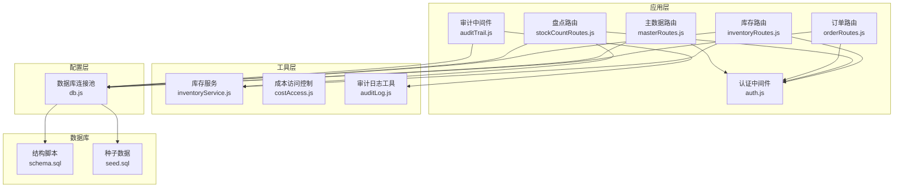
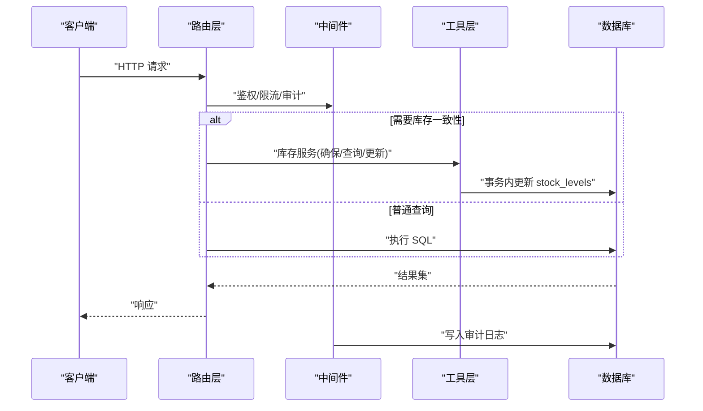
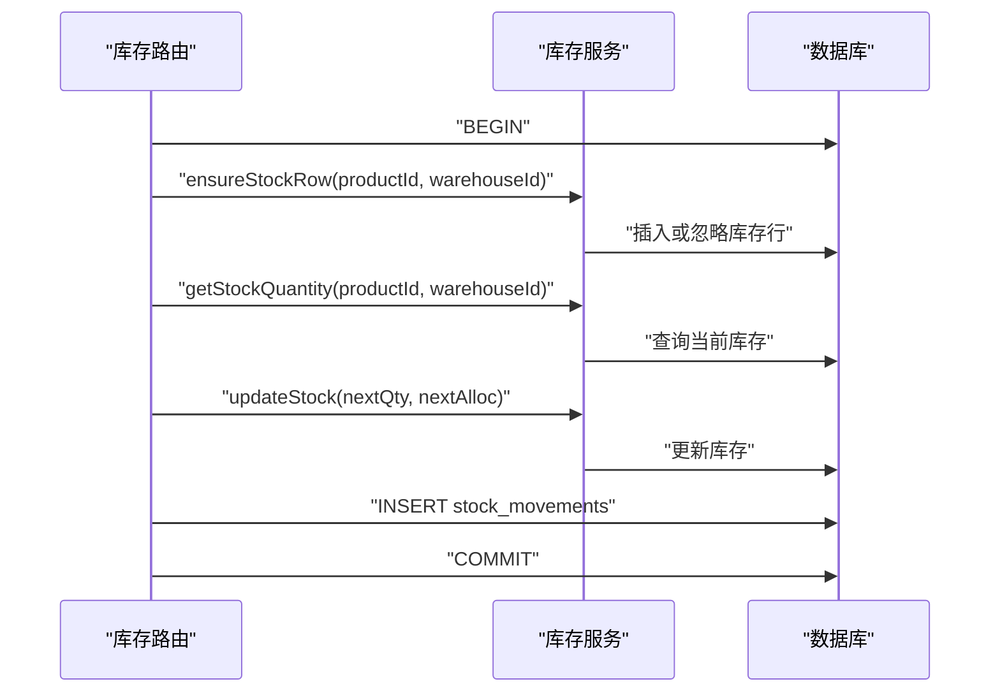
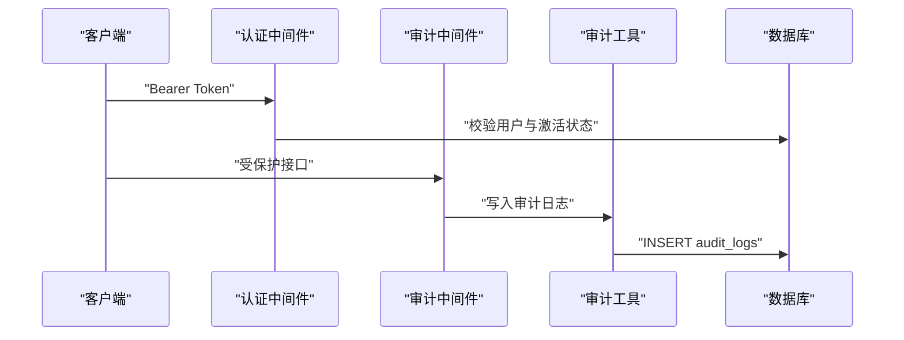
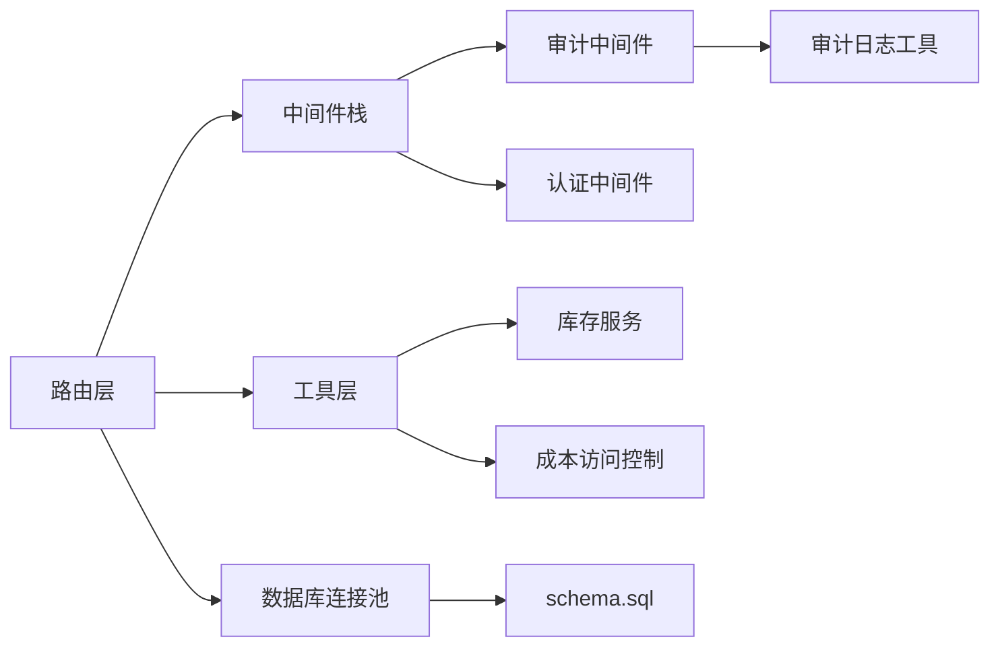

# 数据库设计

<cite>
**本文引用的文件**
- [schema.sql](file://server/database/schema.sql)
- [seed.sql](file://server/database/seed.sql)
- [db.js](file://server/src/config/db.js)
- [auditTrail.js](file://server/src/middleware/auditTrail.js)
- [auditLog.js](file://server/src/utils/auditLog.js)
- [auth.js](file://server/src/middleware/auth.js)
- [inventoryRoutes.js](file://server/src/routes/inventoryRoutes.js)
- [stockCountRoutes.js](file://server/src/routes/stockCountRoutes.js)
- [orderRoutes.js](file://server/src/routes/orderRoutes.js)
- [masterRoutes.js](file://server/src/routes/masterRoutes.js)
- [inventoryService.js](file://server/src/utils/inventoryService.js)
- [costAccess.js](file://server/src/utils/costAccess.js)
</cite>

## 目录
1. [简介](#简介)
2. [项目结构](#项目结构)
3. [核心组件](#核心组件)
4. [架构总览](#架构总览)
5. [详细组件分析](#详细组件分析)
6. [依赖分析](#依赖分析)
7. [性能考量](#性能考量)
8. [故障排查指南](#故障排查指南)
9. [结论](#结论)
10. [附录](#附录)

## 简介
本文件为库存管理系统的数据库设计文档，覆盖数据模型、关系结构、字段定义、索引与约束、业务规则、数据访问模式、审计与安全、性能优化、数据生命周期与迁移策略，以及初始化与种子数据的使用说明。目标是帮助开发者与运维人员快速理解并高效维护该系统。

## 项目结构
数据库相关的核心文件位于 server/database 目录，应用层通过 server/src/config/db.js 连接数据库；路由层（如库存、盘点、订单）在 server/src/routes 下，工具层（如库存服务、成本访问控制）在 server/src/utils 下；审计日志在 server/src/middleware 和 server/src/utils 下实现。

**图表来源**
- [db.js:1-25](file://server/src/config/db.js#L1-L25)
- [schema.sql:1-420](file://server/database/schema.sql#L1-L420)
- [seed.sql:1-114](file://server/database/seed.sql#L1-L114)
- [inventoryRoutes.js:1-493](file://server/src/routes/inventoryRoutes.js#L1-L493)
- [stockCountRoutes.js:1-434](file://server/src/routes/stockCountRoutes.js#L1-L434)
- [orderRoutes.js:1-113](file://server/src/routes/orderRoutes.js#L1-L113)
- [masterRoutes.js:1-800](file://server/src/routes/masterRoutes.js#L1-L800)
- [auditTrail.js:1-84](file://server/src/middleware/auditTrail.js#L1-L84)
- [auditLog.js:1-38](file://server/src/utils/auditLog.js#L1-L38)
- [auth.js:1-46](file://server/src/middleware/auth.js#L1-L46)
- [inventoryService.js:1-45](file://server/src/utils/inventoryService.js#L1-L45)
- [costAccess.js:1-32](file://server/src/utils/costAccess.js#L1-L32)

**章节来源**
- [schema.sql:1-420](file://server/database/schema.sql#L1-L420)
- [seed.sql:1-114](file://server/database/seed.sql#L1-L114)
- [db.js:1-25](file://server/src/config/db.js#L1-L25)

## 核心组件
本系统围绕以下核心实体展开：用户、产品、仓库、库存、订单（含市场渠道）、供应商、审计日志、系统设置与通知等。各实体通过外键关联形成清晰的业务闭环。

- 用户 users：系统使用者，具备角色与激活状态，支持偏好货币。
- 产品 products：核心商品，支持多渠道定价规则、组合装、图片、成本价与建议售价等。
- 仓库 warehouses：物理或逻辑仓储单元，支持启用状态与负责人信息。
- 库存 stock_levels：按产品+仓库维度记录实存量与已分配量。
- 交易 stock_movements：出入库与调拨流水，记录数量、参考号、原因、成本等。
- 盘点 stock_counts 与明细 stock_count_items：盘点任务与逐项差异记录。
- 供应商 suppliers 与关联 product_suppliers：产品-供应商映射及主供应商标记。
- 市场渠道相关：marketplace_connections、marketplace_orders、marketplace_order_items、shipping_shipments、marketplace_inventory_snapshots、marketplace_sync_logs、marketplace_error_logs。
- 审计 audit_logs：统一审计轨迹。
- 系统 system_settings、system_notifications：系统级配置与通知。
- 其他：categories（分类）、product_images（产品图片）、product_bundle_items（组合装子项）、product_pricing_rules（定价规则）、low_stock_alert_states（低库存告警状态）。

**章节来源**
- [schema.sql:2-420](file://server/database/schema.sql#L2-L420)

## 架构总览
数据库采用 PostgreSQL，通过连接池进行并发访问；路由层封装查询与事务，工具层提供库存一致性保障与成本访问控制；审计中间件自动记录关键操作。

**图表来源**
- [inventoryRoutes.js:229-403](file://server/src/routes/inventoryRoutes.js#L229-L403)
- [stockCountRoutes.js:326-431](file://server/src/routes/stockCountRoutes.js#L326-L431)
- [inventoryService.js:1-45](file://server/src/utils/inventoryService.js#L1-L45)
- [auditTrail.js:47-79](file://server/src/middleware/auditTrail.js#L47-L79)
- [auditLog.js:1-38](file://server/src/utils/auditLog.js#L1-L38)
- [db.js:15-24](file://server/src/config/db.js#L15-L24)

## 详细组件分析

### 实体关系图（ER）

```mermaid
erDiagram
USERS {
int id PK
varchar full_name
varchar email UK
text password_hash
varchar role
boolean is_active
varchar preferred_currency
timestamp created_at
}
CATEGORIES {
int id PK
varchar name UK
text description
timestamp created_at
}
WAREHOUSES {
int id PK
varchar name
varchar code UK
text address
varchar manager_name
boolean is_active
timestamp created_at
}
PRODUCTS {
int id PK
varchar name
varchar sku UK
varchar sku_type
varchar product_code UK
varchar barcode UK
text image_data
text description
text usage_guide
text pros
text cons
int category_id FK
varchar unit
numeric cost_price
numeric selling_price
numeric markup_percentage
numeric suggested_price
int reorder_level
boolean is_active
timestamp created_at
timestamp updated_at
}
PRODUCT_IMAGES {
int id PK
int product_id FK
text image_data
int sort_order
boolean is_primary
timestamp created_at
}
PRODUCT_BUNDLE_ITEMS {
int id PK
int combo_product_id FK
int item_product_id FK
numeric item_quantity
timestamp created_at
}
PRODUCT_PRICING_RULES {
int id PK
int product_id FK
varchar rule_name
varchar channel_key
numeric markup_percentage
numeric suggested_price
boolean is_default
int sort_order
timestamp created_at
}
STOCK_LEVELS {
int id PK
int product_id FK
int warehouse_id FK
int quantity
int allocated_quantity
timestamp updated_at
}
STOCK_MOVEMENTS {
int id PK
varchar movement_type
int product_id FK
int source_warehouse_id FK
int destination_warehouse_id FK
int quantity
varchar reference_no
text notes
int created_by FK
timestamp created_at
}
STOCK_COUNTS {
int id PK
int warehouse_id FK
varchar status
text notes
int created_by FK
int completed_by FK
int applied_by FK
timestamp created_at
timestamp completed_at
timestamp applied_at
}
STOCK_COUNT_ITEMS {
int id PK
int stock_count_id FK
int product_id FK
int warehouse_id FK
int expected_quantity
int counted_quantity
int difference_quantity
}
SUPPLIERS {
int id PK
varchar name
varchar company_name
varchar contact_name
varchar phone
varchar email
text address
text payment_terms
int lead_time_days
text notes
boolean is_active
int created_by FK
int updated_by FK
timestamp created_at
timestamp updated_at
}
PRODUCT_SUPPLIERS {
int id PK
int product_id FK
int supplier_id FK
boolean is_primary
int created_by FK
timestamp created_at
}
MARKETPLACE_CONNECTIONS {
int id PK
varchar channel UK
varchar shop_name
text api_base_url
text access_token
text refresh_token
jsonb metadata
boolean is_active
int updated_by FK
timestamp updated_at
}
MARKETPLACE_ORDERS {
int id PK
varchar channel
varchar external_order_id
varchar order_status
varchar buyer_name
numeric total_amount
varchar currency
timestamp order_created_at
jsonb payload
timestamp synced_at
}
MARKETPLACE_ORDER_ITEMS {
int id PK
int marketplace_order_id FK
varchar external_item_id
varchar external_sku
int product_id FK
int quantity
numeric unit_price
jsonb payload
}
SHIPPING_SHIPMENTS {
int id PK
varchar channel
int marketplace_order_id FK
varchar shipment_status
varchar carrier
varchar service_level
varchar tracking_no
text label_url
timestamp shipped_at
timestamp delivered_at
jsonb payload
int updated_by FK
timestamp updated_at
}
MARKETPLACE_INVENTORY_SNAPSHOTS {
int id PK
varchar channel
varchar external_sku
int product_id FK
int warehouse_id FK
int on_hand
int allocated_quantity
int available_quantity
jsonb payload
timestamp synced_at
}
MARKETPLACE_SYNC_LOGS {
int id PK
varchar channel
varchar sync_type
varchar status
int records_count
jsonb raw_response
int synced_by FK
timestamp synced_at
}
MARKETPLACE_ERROR_LOGS {
int id PK
varchar channel
varchar operation
varchar error_code
text message
jsonb details
varchar request_id
int created_by FK
timestamp created_at
}
AUDIT_LOGS {
int id PK
int user_id FK
varchar user_email
varchar user_role
varchar action
varchar entity_type
varchar entity_id
varchar method
text path
text description
jsonb metadata
timestamp created_at
}
LOW_STOCK_ALERT_STATES {
int id PK
int product_id FK
int warehouse_id FK
varchar status
int assigned_to FK
text notes
int updated_by FK
timestamp updated_at
}
SYSTEM_SETTINGS {
int id PK
varchar setting_key UK
text setting_value
int updated_by FK
timestamp updated_at
}
SYSTEM_NOTIFICATIONS {
int id PK
varchar notification_type
varchar title
text message
jsonb metadata
varchar target_role
boolean is_read
int created_by FK
timestamp created_at
}
BANK_STATEMENTS {
int id PK
int uploaded_by FK
date statement_month
varchar original_name
varchar storage_path
varchar mime_type
int file_size
timestamp created_at
}
PRODUCTS }o--|| CATEGORIES : "category_id"
PRODUCTS ||--o{ PRODUCT_IMAGES : "图片"
PRODUCTS ||--o{ PRODUCT_BUNDLE_ITEMS : "组合项"
PRODUCTS ||--o{ PRODUCT_PRICING_RULES : "定价规则"
PRODUCTS ||--o{ STOCK_LEVELS : "库存"
PRODUCTS ||--o{ STOCK_MOVEMENTS : "流水"
PRODUCTS ||--o{ STOCK_COUNT_ITEMS : "盘点项"
PRODUCTS ||--o{ PRODUCT_SUPPLIERS : "供应商映射"
PRODUCTS ||--o{ MARKETPLACE_ORDER_ITEMS : "订单项"
PRODUCTS ||--o{ LOW_STOCK_ALERT_STATES : "低库存状态"
WAREHOUSES ||--o{ STOCK_LEVELS : "库存"
WAREHOUSES ||--o{ STOCK_MOVEMENTS : "源/目的仓"
WAREHOUSES ||--o{ STOCK_COUNTS : "盘点任务"
WAREHOUSES ||--o{ STOCK_COUNT_ITEMS : "盘点项"
WAREHOUSES ||--o{ MARKETPLACE_INVENTORY_SNAPSHOTS : "快照"
USERS ||--o{ STOCK_MOVEMENTS : "创建者"
USERS ||--o{ STOCK_COUNTS : "创建/完成/应用"
USERS ||--o{ AUDIT_LOGS : "审计"
USERS ||--o{ SYSTEM_NOTIFICATIONS : "创建者"
USERS ||--o{ BANK_STATEMENTS : "上传者"
USERS ||--o{ SUPPLIERS : "创建/更新"
USERS ||--o{ MARKETPLACE_CONNECTIONS : "更新者"
USERS ||--o{ MARKETPLACE_ERROR_LOGS : "创建者"
SUPPLIERS ||--o{ PRODUCT_SUPPLIERS : "映射"
```

**图表来源**
- [schema.sql:2-420](file://server/database/schema.sql#L2-L420)

### 字段定义与约束（摘要）
- users：主键 id；唯一邮箱；角色枚举；布尔激活；默认货币；时间戳。
- products：主键 id；唯一 SKU/条码/产品编码；外键 category_id；单位默认“件”；价格与建议价默认 0；重购点默认 0；时间戳。
- stock_levels：复合唯一（product_id, warehouse_id）；非负数量与分配量检查。
- stock_movements：movement_type 枚举（IN/OUT/TRANSFER）；正数数量；可选供应商与成本。
- stock_counts：状态枚举（OPEN/COMPLETED/APPLIED）；多阶段流程。
- marketplace_*：JSONB 存储原始响应与负载；外键可为空以兼容同步失败场景。
- audit_logs：JSONB 元数据；统一审计入口。
- system_settings/system_notifications：键值配置与通知广播。
- 其他：供应商主供应商标记、组合装数量、定价规则排序、低库存状态等。

**章节来源**
- [schema.sql:2-420](file://server/database/schema.sql#L2-L420)

### 数据访问模式与事务
- 库存变动（入库/出库/调拨/占用释放）通过连接池获取客户端，显式 BEGIN/COMMIT/ROLLBACK，确保一致性。
- 库存服务封装 ensureStockRow/getStockQuantity/updateStock，避免重复事务代码。
- 盘点流程：创建→保存→完成→应用，应用阶段对差异进行 IN/OUT 调整并生成流水。
- 订单同步：限流中间件保护第三方通道，批量查询与聚合返回。

**图表来源**
- [inventoryRoutes.js:229-403](file://server/src/routes/inventoryRoutes.js#L229-L403)
- [inventoryService.js:1-45](file://server/src/utils/inventoryService.js#L1-L45)

**章节来源**
- [inventoryRoutes.js:229-403](file://server/src/routes/inventoryRoutes.js#L229-L403)
- [stockCountRoutes.js:326-431](file://server/src/routes/stockCountRoutes.js#L326-L431)
- [inventoryService.js:1-45](file://server/src/utils/inventoryService.js#L1-L45)

### 审计与安全
- 审计中间件在响应完成后异步写入 audit_logs，自动推断动作、实体与描述，屏蔽敏感字段。
- 认证中间件基于 JWT 校验用户身份与激活状态；授权中间件按角色放行。
- 成本访问控制：通过自定义头携带 JWT，仅 ADMIN/MANAGER 可解密查看成本。

**图表来源**
- [auth.js:5-29](file://server/src/middleware/auth.js#L5-L29)
- [auditTrail.js:47-79](file://server/src/middleware/auditTrail.js#L47-L79)
- [auditLog.js:1-38](file://server/src/utils/auditLog.js#L1-L38)

**章节来源**
- [auditTrail.js:1-84](file://server/src/middleware/auditTrail.js#L1-L84)
- [auditLog.js:1-38](file://server/src/utils/auditLog.js#L1-L38)
- [auth.js:1-46](file://server/src/middleware/auth.js#L1-L46)
- [costAccess.js:1-32](file://server/src/utils/costAccess.js#L1-L32)

### 数据验证与业务规则
- 数值与枚举：数量≥0、movement_type 枚举、状态枚举、角色枚举。
- 外键与级联：产品删除置空相关外键（如库存快照中的 product_id），图片级联删除。
- 业务流程：出库/调拨前校验可用库存（已分配量扣减后剩余）；调拨源仓与目的仓必须不同；占用释放不得为负且不超过实存量。
- 盘点：仅 OPEN 状态可编辑/完成；应用时对差异进行 IN/OUT 调整并生成流水。

**章节来源**
- [schema.sql:125-133](file://server/database/schema.sql#L125-L133)
- [inventoryRoutes.js:292-350](file://server/src/routes/inventoryRoutes.js#L292-L350)
- [stockCountRoutes.js:221-324](file://server/src/routes/stockCountRoutes.js#L221-L324)

### 缓存策略与性能
- 查询层：分页参数与 LIKE 模糊匹配，避免一次性全量加载。
- 索引层：对高频过滤字段建立索引（如产品分类、仓库、订单状态、审计时间等）。
- 批处理：库存列表与订单列表采用并行查询统计总数与分页数据。
- 连接池：配置超时与 SSL 开关，生产环境默认启用 SSL。

**章节来源**
- [schema.sql:385-419](file://server/database/schema.sql#L385-L419)
- [inventoryRoutes.js:76-139](file://server/src/routes/inventoryRoutes.js#L76-L139)
- [orderRoutes.js:37-81](file://server/src/routes/orderRoutes.js#L37-L81)
- [db.js:15-19](file://server/src/config/db.js#L15-L19)

### 数据生命周期、保留与归档
- 审计日志与错误日志：按时间倒序索引，便于滚动清理。
- 银行流水：按月唯一，便于归档与检索。
- 建议策略（通用实践，非代码强制）：定期归档历史审计与错误日志至冷存储；对长期无活动的低频数据进行压缩或迁移。

**章节来源**
- [schema.sql:275-288](file://server/database/schema.sql#L275-L288)
- [schema.sql:184-194](file://server/database/schema.sql#L184-L194)
- [schema.sql:373-383](file://server/database/schema.sql#L373-L383)

### 数据迁移与版本管理
- 结构演进：通过 schema.sql 的条件性 DDL（IF NOT EXISTS、ALTER TABLE ADD COLUMN IF NOT EXISTS、UPDATE 补齐默认值）实现向后兼容。
- 种子数据：通过 seed.sql 初始化基础用户、分类、仓库与示例商品及初始库存，避免硬编码。
- 版本策略：每次变更先在开发/测试环境执行 schema.sql，再合并到主分支；迁移时遵循幂等与回滚路径。

**章节来源**
- [schema.sql:56-70](file://server/database/schema.sql#L56-L70)
- [schema.sql:111-124](file://server/database/schema.sql#L111-L124)
- [schema.sql:135-137](file://server/database/schema.sql#L135-L137)
- [seed.sql:1-114](file://server/database/seed.sql#L1-L114)

### 数据初始化与种子数据
- 初始化步骤：部署时先执行 schema.sql 创建表与索引；随后执行 seed.sql 插入初始数据。
- 种子数据包含：管理员/经理/员工/测试账号、基础分类、仓库、示例商品与库存。

**章节来源**
- [seed.sql:1-114](file://server/database/seed.sql#L1-L114)

### 实际数据示例与查询模式
- 库存总览：支持按名称/SKU/条码/分类/仓库模糊搜索，支持低库存筛选与分页。
- 交易流水：支持按类型与关键词搜索，按时间倒序分页。
- 订单列表：支持按渠道/状态/关键词搜索，按下单时间倒序。
- 成本访问：通过自定义头携带令牌，仅授权用户可见成本与相关定价规则。

**章节来源**
- [inventoryRoutes.js:17-151](file://server/src/routes/inventoryRoutes.js#L17-L151)
- [inventoryRoutes.js:154-227](file://server/src/routes/inventoryRoutes.js#L154-L227)
- [orderRoutes.js:31-81](file://server/src/routes/orderRoutes.js#L31-L81)
- [masterRoutes.js:115-130](file://server/src/routes/masterRoutes.js#L115-L130)

## 依赖分析
- 路由层依赖数据库连接池与中间件栈。
- 工具层提供库存一致性与成本访问控制，降低路由层复杂度。
- 审计中间件与工具层解耦，保证审计不侵入业务逻辑。
- 外部系统通过市场渠道表与订单表对接，JSONB 保留原始数据。

**图表来源**
- [db.js:1-25](file://server/src/config/db.js#L1-L25)
- [inventoryRoutes.js:1-10](file://server/src/routes/inventoryRoutes.js#L1-L10)
- [stockCountRoutes.js:1-8](file://server/src/routes/stockCountRoutes.js#L1-L8)
- [orderRoutes.js:1-9](file://server/src/routes/orderRoutes.js#L1-L9)
- [masterRoutes.js:1-12](file://server/src/routes/masterRoutes.js#L1-L12)
- [auditTrail.js:1-12](file://server/src/middleware/auditTrail.js#L1-L12)
- [auditLog.js:1-10](file://server/src/utils/auditLog.js#L1-L10)
- [auth.js:1-10](file://server/src/middleware/auth.js#L1-L10)
- [inventoryService.js:1-10](file://server/src/utils/inventoryService.js#L1-L10)
- [costAccess.js:1-10](file://server/src/utils/costAccess.js#L1-L10)
- [schema.sql:1-10](file://server/database/schema.sql#L1-L10)

**章节来源**
- [db.js:1-25](file://server/src/config/db.js#L1-L25)
- [auditTrail.js:1-84](file://server/src/middleware/auditTrail.js#L1-L84)
- [auditLog.js:1-38](file://server/src/utils/auditLog.js#L1-L38)
- [auth.js:1-46](file://server/src/middleware/auth.js#L1-L46)
- [inventoryService.js:1-45](file://server/src/utils/inventoryService.js#L1-L45)
- [costAccess.js:1-32](file://server/src/utils/costAccess.js#L1-L32)
- [schema.sql:1-420](file://server/database/schema.sql#L1-L420)

## 性能考量
- 索引覆盖：高频过滤字段（如产品分类、仓库、订单状态、审计时间）已建立索引。
- 分页与并行查询：列表接口采用 LIMIT/OFFSET 并行统计总数，避免全量扫描。
- 事务粒度：库存与盘点均在单事务中完成，减少锁竞争。
- 连接池与 SSL：生产环境默认启用 SSL，连接超时可控。

**章节来源**
- [schema.sql:385-419](file://server/database/schema.sql#L385-L419)
- [inventoryRoutes.js:76-139](file://server/src/routes/inventoryRoutes.js#L76-L139)
- [orderRoutes.js:37-81](file://server/src/routes/orderRoutes.js#L37-L81)
- [db.js:15-19](file://server/src/config/db.js#L15-L19)

## 故障排查指南
- 审计日志未记录：确认审计中间件已挂载且未被前置中间件拦截；检查写入函数是否抛错。
- 库存不足：检查可用库存计算（实存量-已分配量）与业务输入数量；核对调拨源仓与目的仓不同。
- 盘点异常：确认状态流转（OPEN→COMPLETED→APPLIED）与 FOR UPDATE 锁；核对差异是否正确。
- 订单同步失败：检查限流配置与第三方通道状态；查看 marketplace_error_logs 与 marketplace_sync_logs。

**章节来源**
- [auditTrail.js:47-79](file://server/src/middleware/auditTrail.js#L47-L79)
- [auditLog.js:1-38](file://server/src/utils/auditLog.js#L1-L38)
- [inventoryRoutes.js:292-350](file://server/src/routes/inventoryRoutes.js#L292-L350)
- [stockCountRoutes.js:273-324](file://server/src/routes/stockCountRoutes.js#L273-L324)
- [orderRoutes.js:13-29](file://server/src/routes/orderRoutes.js#L13-L29)

## 结论
本数据库设计以清晰的实体关系与严格的约束为基础，结合索引、事务与审计机制，满足库存管理的准确性与可追溯性需求。通过幂等的迁移脚本与种子数据，确保部署一致性；通过中间件与工具层分离关注点，提升可维护性与安全性。

## 附录
- 初始化脚本：执行 schema.sql 后执行 seed.sql。
- 种子数据：包含管理员/经理/员工/测试账号、基础分类、仓库、示例商品与初始库存。
- 关键查询模式：库存总览、交易流水、订单列表、成本访问令牌。

**章节来源**
- [seed.sql:1-114](file://server/database/seed.sql#L1-L114)
- [inventoryRoutes.js:17-151](file://server/src/routes/inventoryRoutes.js#L17-L151)
- [inventoryRoutes.js:154-227](file://server/src/routes/inventoryRoutes.js#L154-L227)
- [orderRoutes.js:31-81](file://server/src/routes/orderRoutes.js#L31-L81)
- [masterRoutes.js:95-130](file://server/src/routes/masterRoutes.js#L95-L130)