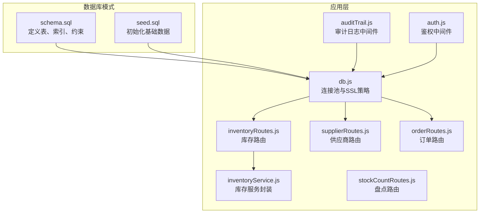
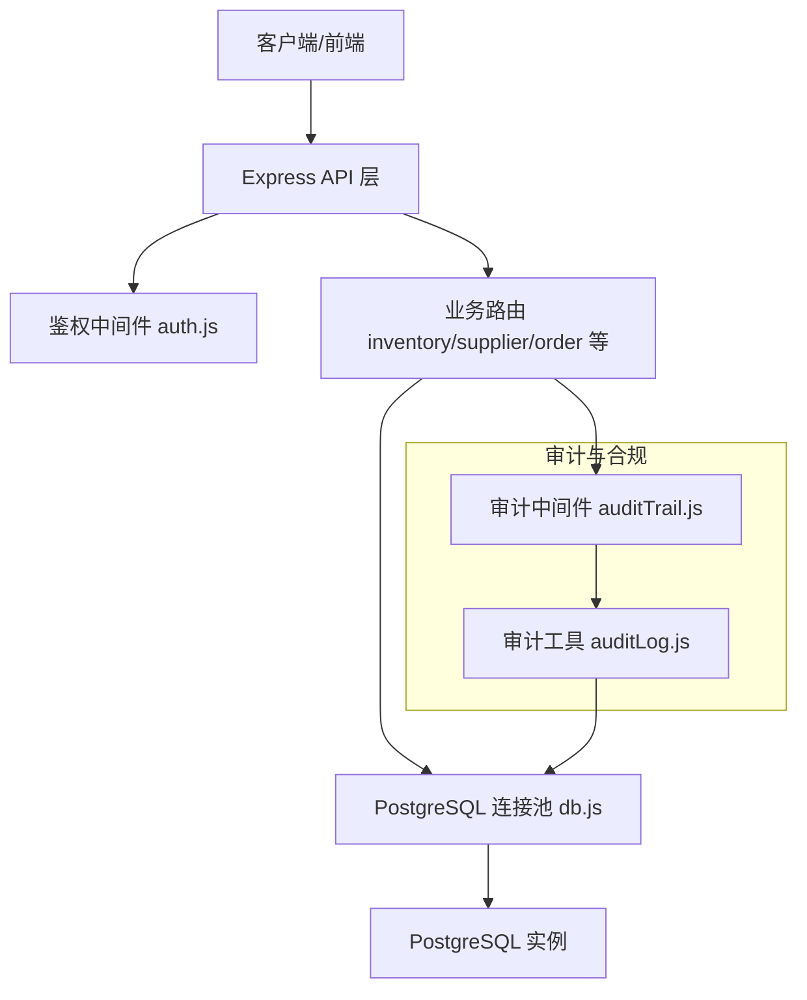
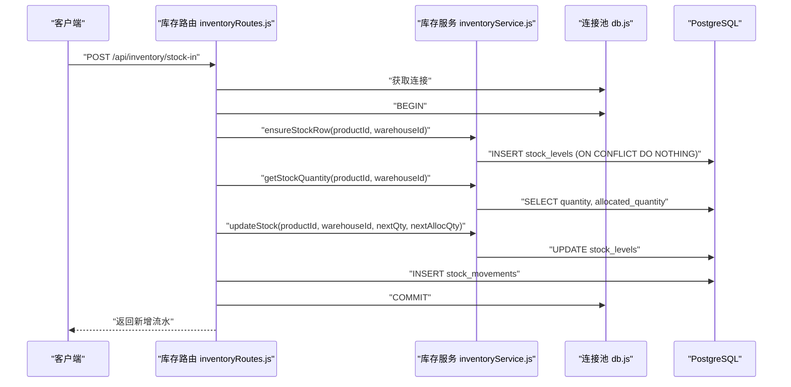
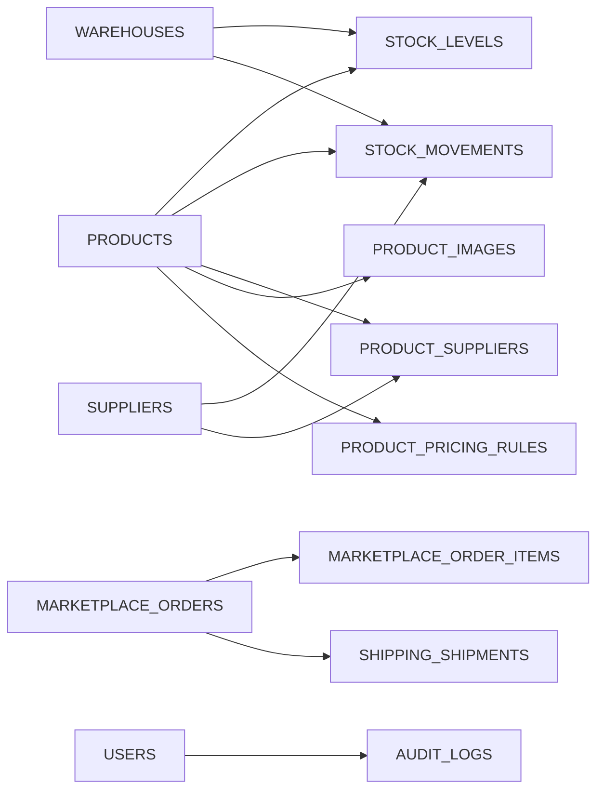

# 数据库设计

<cite>
**本文引用的文件**
- [schema.sql](file://server/database/schema.sql)
- [seed.sql](file://server/database/seed.sql)
- [db.js](file://server/src/config/db.js)
- [auth.js](file://server/src/middleware/auth.js)
- [auditTrail.js](file://server/src/middleware/auditTrail.js)
- [auditLog.js](file://server/src/utils/auditLog.js)
- [inventoryRoutes.js](file://server/src/routes/inventoryRoutes.js)
- [inventoryService.js](file://server/src/utils/inventoryService.js)
- [stockCountRoutes.js](file://server/src/routes/stockCountRoutes.js)
- [supplierRoutes.js](file://server/src/routes/supplierRoutes.js)
- [orderRoutes.js](file://server/src/routes/orderRoutes.js)
- [.env.example](file://server/.env.example)
</cite>

## 目录
1. [简介](#简介)
2. [项目结构](#项目结构)
3. [核心组件](#核心组件)
4. [架构总览](#架构总览)
5. [详细组件分析](#详细组件分析)
6. [依赖分析](#依赖分析)
7. [性能考虑](#性能考虑)
8. [故障排查指南](#故障排查指南)
9. [结论](#结论)
10. [附录](#附录)

## 简介
本文件面向库存管理系统数据库设计，基于实际的数据库脚本与后端实现，系统化梳理实体关系模型（ER）、字段定义、主键/外键/索引/约束、数据验证与业务规则、数据访问模式、缓存策略与性能考量、数据生命周期与归档、迁移路径与版本管理、以及数据安全与访问控制。文档同时提供可视化图示与示例数据，帮助开发者与运维人员快速理解与落地。

## 项目结构
数据库层由两部分组成：
- 模式定义：通过统一的 SQL 脚本集中声明所有表、索引与约束，确保结构可重复部署与演进。
- 初始化数据：通过种子脚本插入基础用户、分类、仓库与示例商品及初始库存，便于本地开发与演示。

图表来源
- [schema.sql:1-447](file://server/database/schema.sql#L1-L447)
- [seed.sql:1-114](file://server/database/seed.sql#L1-L114)
- [db.js:1-25](file://server/src/config/db.js#L1-L25)
- [auth.js:1-46](file://server/src/middleware/auth.js#L1-L46)
- [auditTrail.js:1-84](file://server/src/middleware/auditTrail.js#L1-L84)
- [inventoryRoutes.js:1-493](file://server/src/routes/inventoryRoutes.js#L1-L493)
- [inventoryService.js:1-45](file://server/src/utils/inventoryService.js#L1-L45)
- [stockCountRoutes.js:360-406](file://server/src/routes/stockCountRoutes.js#L360-L406)
- [supplierRoutes.js:1-370](file://server/src/routes/supplierRoutes.js#L1-L370)
- [orderRoutes.js:1-113](file://server/src/routes/orderRoutes.js#L1-L113)

章节来源
- [schema.sql:1-447](file://server/database/schema.sql#L1-L447)
- [seed.sql:1-114](file://server/database/seed.sql#L1-L114)

## 核心组件
本节从数据库视角拆解核心实体与关系，明确主键、外键、索引与约束，并结合业务规则说明数据验证与一致性保障。

- 用户 users
  - 主键：id
  - 关键字段：full_name、email（唯一）、role（CHECK 枚举）、is_active、preferred_currency、created_at
  - 约束：role 限定枚举值；默认货币 MYR；软删除/停用通过 is_active 控制
  - 用途：系统用户、鉴权主体

- 分类 categories
  - 主键：id
  - 唯一：name
  - 字段：description、created_at

- 仓库 warehouses
  - 主键：id
  - 唯一：code
  - 字段：name、address、manager_name、is_active、created_at

- 商品 products
  - 主键：id
  - 唯一：sku、product_code、barcode
  - 外键：category_id -> categories(id)（ON DELETE SET NULL）
  - 字段：name、sku_type、product_code、barcode、image_data、usage_guide、pros、cons、unit、cost_price、selling_price、markup_percentage、suggested_price、reorder_level、is_active、created_at、updated_at
  - 约束：数量与价格数值精度；重购点非负；默认单位“件”
  - 规则：自动补全 product_code 与 suggested_price；支持套餐组合（见 product_bundle_items）

- 商品图片 product_images
  - 主键：id
  - 外键：product_id -> products(id)（CASCADE 删除）
  - 字段：image_data、sort_order、is_primary、created_at

- 商品定价规则 product_pricing_rules
  - 主键：id
  - 外键：product_id -> products(id)（CASCADE 删除）
  - 字段：rule_name、channel_key、markup_percentage、suggested_price、is_default、sort_order、created_at
  - 规则：迁移阶段自动补齐 channel_key 与默认规则

- 库存 stock_levels
  - 主键：id
  - 唯一：(product_id, warehouse_id)
  - 外键：product_id -> products(id)（CASCADE 删除）；warehouse_id -> warehouses(id)（CASCADE 删除）
  - 字段：quantity、allocated_quantity、updated_at
  - 约束：quantity 与 allocated_quantity 非负

- 库存流水 stock_movements
  - 主键：id
  - 字段：movement_type（CHECK: IN/OUT/TRANSFER）、product_id、source_warehouse_id、destination_warehouse_id、quantity、reference_no、notes、supplier_id、unit_cost、purchase_reason、created_by、created_at
  - 约束：quantity > 0；movement_type 枚举；外键链路完整

- 库存盘点 stock_counts
  - 主键：id
  - 字段：warehouse_id、status（CHECK: OPEN/COMPLETED/APPLIED）、notes、created_by、completed_by、applied_by、created_at、completed_at、applied_at

- 盘点明细 stock_count_items
  - 主键：id
  - 唯一：(stock_count_id, product_id, warehouse_id)
  - 字段：expected_quantity、counted_quantity、difference_quantity、notes

- 低库存告警 low_stock_alert_states
  - 主键：id
  - 唯一：(product_id, warehouse_id)
  - 字段：status（CHECK: OPEN/READ/IGNORED）、assigned_to、notes、updated_by、updated_at

- 供应商 suppliers
  - 主键：id
  - 字段：name、company_name、contact_name、phone、email、address、payment_terms、lead_time_days（非负）、notes、is_active、created_by、updated_by、created_at、updated_at
  - 扩展字段：branch、business_hours、parent_company、map_link

- 供应商-商品关联 product_suppliers
  - 主键：id
  - 唯一：(product_id, supplier_id)
  - 字段：is_primary、created_by、created_at

- 供应商付款记录 supplier_payment_records
  - 主键：id
  - 唯一：(supplier_id, period_month, period_year)
  - 字段：period_month、period_year、paid_date、amount、notes、created_by、created_at

- 成本价变更历史 product_cost_price_histories
  - 主键：id
  - 外键：product_id -> products(id)（CASCADE 删除）
  - 字段：old_cost_price、new_cost_price、percent_change、reason、changed_by、changed_at

- 市场渠道相关
  - marketplace_connections、marketplace_oauth_states、marketplace_error_logs、marketplace_orders、marketplace_order_items、shipping_shipments、marketplace_inventory_snapshots、marketplace_sync_logs

- 审计日志 audit_logs
  - 主键：id
  - 字段：user_id、user_email、user_role、action、entity_type、entity_id、method、path、description、metadata（JSONB）、created_at

- 系统通知 system_notifications
  - 主键：id
  - 字段：notification_type、title、message、metadata（JSONB）、target_role、is_read、created_by、created_at

- 系统设置 system_settings
  - 主键：id
  - 唯一：setting_key
  - 字段：setting_key、setting_value、updated_by、updated_at

- 银行流水 bank_statements
  - 主键：id
  - 唯一：(uploaded_by, statement_month)
  - 字段：uploaded_by、statement_month、original_name、storage_path、mime_type、file_size、created_at

章节来源
- [schema.sql:1-447](file://server/database/schema.sql#L1-L447)

## 架构总览
下图展示数据库层与应用层交互，强调事务一致性、鉴权与审计贯穿关键流程。

图表来源
- [db.js:1-25](file://server/src/config/db.js#L1-L25)
- [auth.js:1-46](file://server/src/middleware/auth.js#L1-L46)
- [auditTrail.js:1-84](file://server/src/middleware/auditTrail.js#L1-L84)
- [auditLog.js:1-37](file://server/src/utils/auditLog.js#L1-L37)
- [inventoryRoutes.js:1-493](file://server/src/routes/inventoryRoutes.js#L1-L493)
- [supplierRoutes.js:1-370](file://server/src/routes/supplierRoutes.js#L1-L370)
- [orderRoutes.js:1-113](file://server/src/routes/orderRoutes.js#L1-L113)

## 详细组件分析

### 实体关系图（ER）

```mermaid
erDiagram
USERS {
int id PK
varchar full_name
varchar email UK
text password_hash
varchar role
boolean is_active
varchar preferred_currency
timestamp created_at
}
CATEGORIES {
int id PK
varchar name UK
text description
timestamp created_at
}
WAREHOUSES {
int id PK
varchar name
varchar code UK
text address
varchar manager_name
boolean is_active
timestamp created_at
}
PRODUCTS {
int id PK
varchar name
varchar sku UK
varchar product_code UK
varchar barcode UK
varchar unit
numeric cost_price
numeric selling_price
numeric markup_percentage
numeric suggested_price
int reorder_level
boolean is_active
int category_id FK
timestamp created_at
timestamp updated_at
}
PRODUCT_IMAGES {
int id PK
int product_id FK
text image_data
int sort_order
boolean is_primary
timestamp created_at
}
PRODUCT_PRICING_RULES {
int id PK
int product_id FK
varchar rule_name
varchar channel_key
numeric markup_percentage
numeric suggested_price
boolean is_default
int sort_order
timestamp created_at
}
STOCK_LEVELS {
int id PK
int product_id FK
int warehouse_id FK
int quantity
int allocated_quantity
timestamp updated_at
}
STOCK_MOVEMENTS {
int id PK
varchar movement_type
int product_id FK
int source_warehouse_id FK
int destination_warehouse_id FK
int quantity
varchar reference_no
text notes
int supplier_id FK
numeric unit_cost
text purchase_reason
int created_by FK
timestamp created_at
}
STOCK_COUNTS {
int id PK
int warehouse_id FK
varchar status
text notes
int created_by FK
int completed_by FK
int applied_by FK
timestamp created_at
timestamp completed_at
timestamp applied_at
}
STOCK_COUNT_ITEMS {
int id PK
int stock_count_id FK
int product_id FK
int warehouse_id FK
int expected_quantity
int counted_quantity
int difference_quantity
}
LOW_STOCK_ALERT_STATES {
int id PK
int product_id FK
int warehouse_id FK
varchar status
int assigned_to FK
text notes
int updated_by FK
timestamp updated_at
}
SUPPLIERS {
int id PK
varchar name
varchar company_name
varchar contact_name
varchar phone
varchar email
text address
text payment_terms
int lead_time_days
text notes
boolean is_active
int created_by FK
int updated_by FK
timestamp created_at
timestamp updated_at
}
PRODUCT_SUPPLIERS {
int id PK
int product_id FK
int supplier_id FK
boolean is_primary
int created_by FK
timestamp created_at
}
SUPPLIER_PAYMENT_RECORDS {
int id PK
int supplier_id FK
int period_month
int period_year
date paid_date
numeric amount
text notes
int created_by FK
timestamp created_at
}
PRODUCT_COST_PRICE_HISTORIES {
int id PK
int product_id FK
numeric old_cost_price
numeric new_cost_price
numeric percent_change
text reason
int changed_by FK
timestamp changed_at
}
MARKETPLACE_CONNECTIONS {
int id PK
varchar channel UK
varchar shop_name
text api_base_url
text access_token
text refresh_token
jsonb metadata
boolean is_active
int updated_by FK
timestamp updated_at
}
MARKETPLACE_OAUTH_STATES {
int id PK
varchar channel
varchar state_token
text redirect_uri
timestamp expires_at
int created_by FK
timestamp created_at
}
MARKETPLACE_ERROR_LOGS {
int id PK
varchar channel
varchar operation
varchar error_code
text message
jsonb details
varchar request_id
int created_by FK
timestamp created_at
}
MARKETPLACE_ORDERS {
int id PK
varchar channel
varchar external_order_id
varchar order_status
varchar buyer_name
numeric total_amount
varchar currency
timestamp order_created_at
jsonb payload
timestamp synced_at
}
MARKETPLACE_ORDER_ITEMS {
int id PK
int marketplace_order_id FK
varchar external_item_id
varchar external_sku
int product_id FK
int quantity
numeric unit_price
jsonb payload
}
SHIPPING_SHIPMENTS {
int id PK
varchar channel
int marketplace_order_id FK
varchar shipment_status
varchar carrier
varchar service_level
varchar tracking_no
text label_url
timestamp shipped_at
timestamp delivered_at
jsonb payload
int updated_by FK
timestamp updated_at
}
MARKETPLACE_INVENTORY_SNAPSHOTS {
int id PK
varchar channel
varchar external_sku
int product_id FK
int warehouse_id FK
int on_hand
int allocated_quantity
int available_quantity
jsonb payload
timestamp synced_at
}
MARKETPLACE_SYNC_LOGS {
int id PK
varchar channel
varchar sync_type
varchar status
int records_count
jsonb raw_response
int synced_by FK
timestamp synced_at
}
AUDIT_LOGS {
int id PK
int user_id FK
varchar user_email
varchar user_role
varchar action
varchar entity_type
varchar entity_id
varchar method
text path
text description
jsonb metadata
timestamp created_at
}
SYSTEM_NOTIFICATIONS {
int id PK
varchar notification_type
varchar title
text message
jsonb metadata
varchar target_role
boolean is_read
int created_by FK
timestamp created_at
}
SYSTEM_SETTINGS {
int id PK
varchar setting_key UK
text setting_value
int updated_by FK
timestamp updated_at
}
BANK_STATEMENTS {
int id PK
int uploaded_by FK
date statement_month
varchar original_name
varchar storage_path
varchar mime_type
int file_size
timestamp created_at
}
PRODUCTS }o--|| CATEGORIES : "category_id"
PRODUCT_IMAGES }o--|| PRODUCTS : "product_id"
PRODUCT_PRICING_RULES }o--|| PRODUCTS : "product_id"
STOCK_LEVELS }o--|| PRODUCTS : "product_id"
STOCK_LEVELS }o--|| WAREHOUSES : "warehouse_id"
STOCK_MOVEMENTS }o--|| PRODUCTS : "product_id"
STOCK_MOVEMENTS }o--|| WAREHOUSES : "source/destination"
STOCK_MOVEMENTS }o--|| SUPPLIERS : "supplier_id"
STOCK_COUNTS }o--|| WAREHOUSES : "warehouse_id"
STOCK_COUNT_ITEMS }o--|| STOCK_COUNTS : "stock_count_id"
STOCK_COUNT_ITEMS }o--|| PRODUCTS : "product_id"
STOCK_COUNT_ITEMS }o--|| WAREHOUSES : "warehouse_id"
LOW_STOCK_ALERT_STATES }o--|| PRODUCTS : "product_id"
LOW_STOCK_ALERT_STATES }o--|| WAREHOUSES : "warehouse_id"
PRODUCT_SUPPLIERS }o--|| PRODUCTS : "product_id"
PRODUCT_SUPPLIERS }o--|| SUPPLIERS : "supplier_id"
SUPPLIER_PAYMENT_RECORDS }o--|| SUPPLIERS : "supplier_id"
PRODUCT_COST_PRICE_HISTORIES }o--|| PRODUCTS : "product_id"
MARKETPLACE_ORDER_ITEMS }o--|| MARKETPLACE_ORDERS : "marketplace_order_id"
MARKETPLACE_ORDER_ITEMS }o--|| PRODUCTS : "product_id"
SHIPPING_SHIPMENTS }o--|| MARKETPLACE_ORDERS : "marketplace_order_id"
MARKETPLACE_INVENTORY_SNAPSHOTS }o--|| PRODUCTS : "product_id"
MARKETPLACE_INVENTORY_SNAPSHOTS }o--|| WAREHOUSES : "warehouse_id"
MARKETPLACE_SYNC_LOGS }o--|| USERS : "synced_by"
MARKETPLACE_ERROR_LOGS }o--|| USERS : "created_by"
MARKETPLACE_OAUTH_STATES }o--|| USERS : "created_by"
MARKETPLACE_CONNECTIONS }o--|| USERS : "updated_by"
SYSTEM_NOTIFICATIONS }o--|| USERS : "created_by"
BANK_STATEMENTS }o--|| USERS : "uploaded_by"
AUDIT_LOGS }o--|| USERS : "user_id"
```

图表来源
- [schema.sql:1-447](file://server/database/schema.sql#L1-L447)

### 数据访问模式与事务处理
- 统一使用 PostgreSQL 连接池，支持按需启用 SSL，连接超时可配置。
- 库存操作通过封装函数在单个事务中执行，保证一致性与原子性。
- 审计日志在请求完成后异步写入，避免阻塞主流程。

图表来源
- [inventoryRoutes.js:229-403](file://server/src/routes/inventoryRoutes.js#L229-L403)
- [inventoryService.js:1-45](file://server/src/utils/inventoryService.js#L1-L45)
- [db.js:1-25](file://server/src/config/db.js#L1-L25)

章节来源
- [db.js:1-25](file://server/src/config/db.js#L1-L25)
- [inventoryRoutes.js:1-493](file://server/src/routes/inventoryRoutes.js#L1-L493)
- [inventoryService.js:1-45](file://server/src/utils/inventoryService.js#L1-L45)

### 数据验证与业务规则
- 用户：角色枚举、邮箱唯一、默认货币、活跃状态。
- 商品：SKU/条码/产品编码唯一；成本价/售价/建议价与加价率联动；重购点非负。
- 库存：数量与已分配数量非负；出库/调拨前校验可用库存。
- 流水：出入库/调拨类型枚举；数量必须大于 0；调拨源仓与目的仓不可相同。
- 供应商：交货周期非负；扩展字段支持企业信息与地图链接。
- 审计：自动记录操作者、方法、路径与请求体摘要（敏感字段脱敏）。

章节来源
- [schema.sql:1-447](file://server/database/schema.sql#L1-L447)
- [inventoryRoutes.js:229-403](file://server/src/routes/inventoryRoutes.js#L229-L403)
- [auditTrail.js:1-84](file://server/src/middleware/auditTrail.js#L1-L84)

### 缓存策略与性能考虑
- 查询优化：对高频查询建立复合索引与单列索引，如商品分类、仓库、库存、订单、审计日志、供应商等。
- 分页与并发：列表接口采用 LIMIT/OFFSET 分页，同时并行统计总数，降低延迟。
- 事务隔离：库存增删改在单事务内完成，避免并发导致的超卖或不一致。
- 速率限制：对高风险接口（如订单同步）进行限流，防止滥用与抖动。

章节来源
- [schema.sql:410-446](file://server/database/schema.sql#L410-L446)
- [inventoryRoutes.js:76-139](file://server/src/routes/inventoryRoutes.js#L76-L139)
- [orderRoutes.js:8-29](file://server/src/routes/orderRoutes.js#L8-L29)

### 数据生命周期、保留策略与归档
- 审计日志：按时间倒序查询与索引，建议结合业务策略定期归档至冷存储。
- 订单与流水：按渠道与状态建立索引，支持按时间窗口清理或归档。
- 银行流水：按上传人与月份去重，建议按月归档并保留法定年限。
- 建议：制定“数据保留期”策略并在 schema 中预留归档表或分区表空间。

章节来源
- [schema.sql:275-288](file://server/database/schema.sql#L275-L288)
- [schema.sql:196-235](file://server/database/schema.sql#L196-L235)
- [schema.sql:398-408](file://server/database/schema.sql#L398-L408)

### 数据迁移路径与版本管理
- 结构演进：通过 schema.sql 统一声明，支持增量迁移与回滚检查点。
- 种子数据：seed.sql 提供最小可用数据集，便于环境初始化。
- 运行时补丁：如商品表的字段补齐与默认值迁移，确保历史数据兼容。
- 版本管理：建议配合数据库迁移工具（如 Liquibase/ Flyway）管理版本号与变更集。

章节来源
- [schema.sql:56-124](file://server/database/schema.sql#L56-L124)
- [seed.sql:1-114](file://server/database/seed.sql#L1-L114)

### 数据安全、隐私与访问控制
- 鉴权：JWT 校验，失败返回 401；用户不存在或未激活禁止访问。
- 授权：基于角色的访问控制（ADMIN/MANAGER/STAFF），不同接口设置不同权限。
- 审计：自动记录操作行为与请求体摘要（密码字段脱敏）。
- 连接安全：根据环境与连接字符串决定是否启用 SSL。
- 速率限制：对高风险接口进行限流，降低攻击面。

章节来源
- [auth.js:1-46](file://server/src/middleware/auth.js#L1-L46)
- [auditTrail.js:1-84](file://server/src/middleware/auditTrail.js#L1-L84)
- [db.js:1-25](file://server/src/config/db.js#L1-L25)
- [orderRoutes.js:8-29](file://server/src/routes/orderRoutes.js#L8-L29)

## 依赖分析
- 表间依赖：商品与仓库是库存与流水的核心关联；供应商通过多对多关联商品；市场渠道相关表围绕订单与发货展开。
- 索引依赖：查询条件覆盖的列均建立索引，显著提升分页与过滤性能。
- 中间件依赖：鉴权与审计贯穿所有受保护路由，确保安全与可追溯。

图表来源
- [schema.sql:1-447](file://server/database/schema.sql#L1-L447)

章节来源
- [schema.sql:1-447](file://server/database/schema.sql#L1-L447)

## 性能考虑
- 索引策略：针对搜索、过滤与排序字段建立索引，避免全表扫描。
- 查询优化：列表接口并行统计总数，减少往返次数。
- 事务优化：库存操作在单事务内完成，减少锁竞争。
- 连接池：合理设置连接数与超时，避免阻塞与资源耗尽。

## 故障排查指南
- 鉴权失败：确认 Authorization 头与 JWT 密钥配置正确，检查用户是否存在且处于激活状态。
- 审计缺失：确认审计中间件已注册，检查写入异常日志。
- 库存不足：检查可用库存计算逻辑与已分配数量，确认事务提交状态。
- 速率限制：关注 429 返回与 retry-after 头，调整限流参数或等待冷却。

章节来源
- [auth.js:1-46](file://server/src/middleware/auth.js#L1-L46)
- [auditTrail.js:1-84](file://server/src/middleware/auditTrail.js#L1-L84)
- [inventoryRoutes.js:292-350](file://server/src/routes/inventoryRoutes.js#L292-L350)
- [orderRoutes.js:8-29](file://server/src/routes/orderRoutes.js#L8-L29)

## 结论
该数据库设计以清晰的 ER 模型为基础，结合严格的约束与索引策略，配合应用层的事务封装、鉴权与审计机制，实现了库存管理场景下的高一致性、可追溯与高性能。建议在生产环境中进一步完善数据归档策略、监控与告警体系，并通过迁移工具规范化版本管理。

## 附录

### 示例数据
- 初始用户：管理员、仓管员、普通员工与测试账户，便于不同角色登录验证。
- 基础分类：电子产品、办公用品。
- 仓库：主仓与 Outlet 仓。
- 商品：无线鼠标、USB-C 充电线，带 SKU/条码与基础库存。
- 初始库存：按商品与仓库交叉生成，便于演示库存列表与流水。

章节来源
- [seed.sql:1-114](file://server/database/seed.sql#L1-L114)

### 环境变量
- DATABASE_URL：数据库连接串（含主机、端口、数据库名、凭据）。
- JWT_SECRET：用于签发与校验 JWT 的密钥。
- PGSSLMODE：可选强制启用 SSL 的标志位。

章节来源
- [.env.example:1-4](file://server/.env.example#L1-L4)