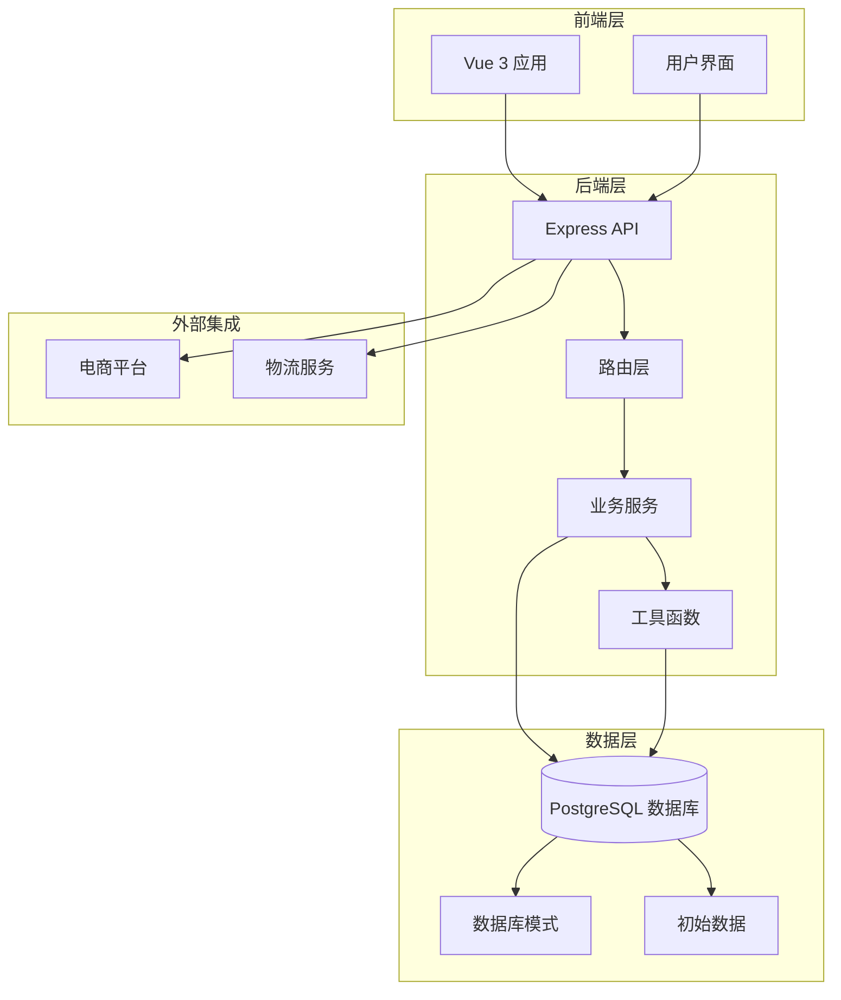
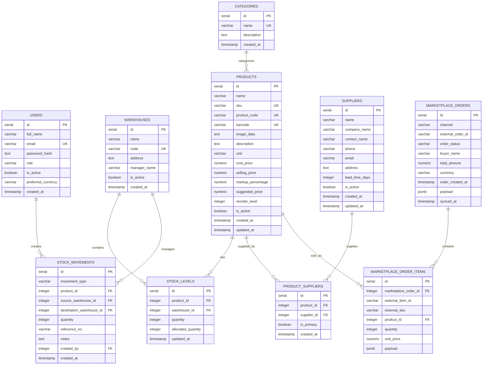
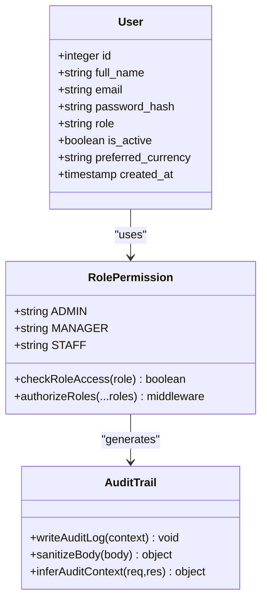
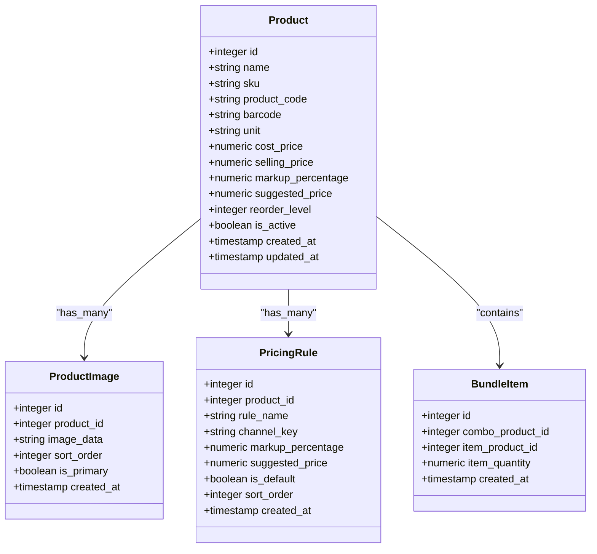
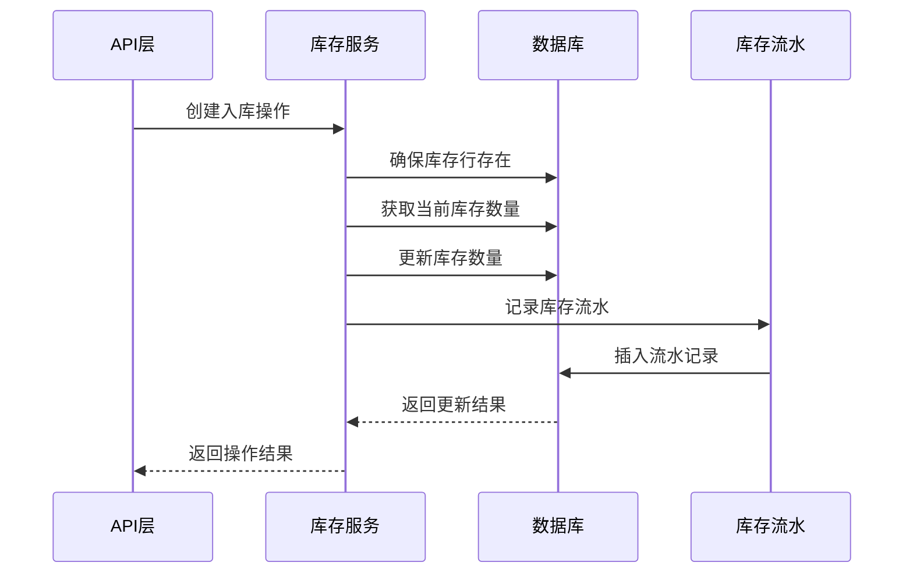
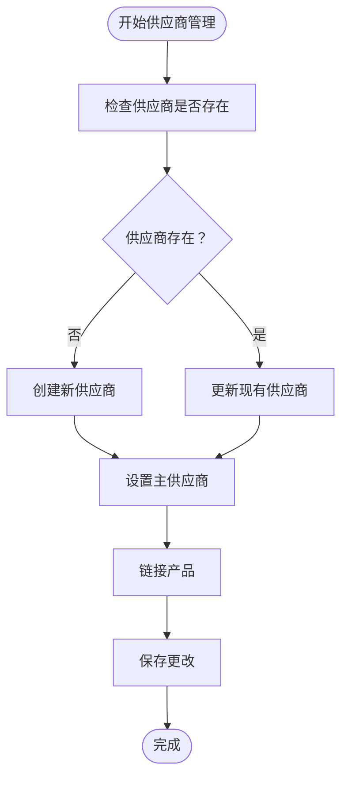
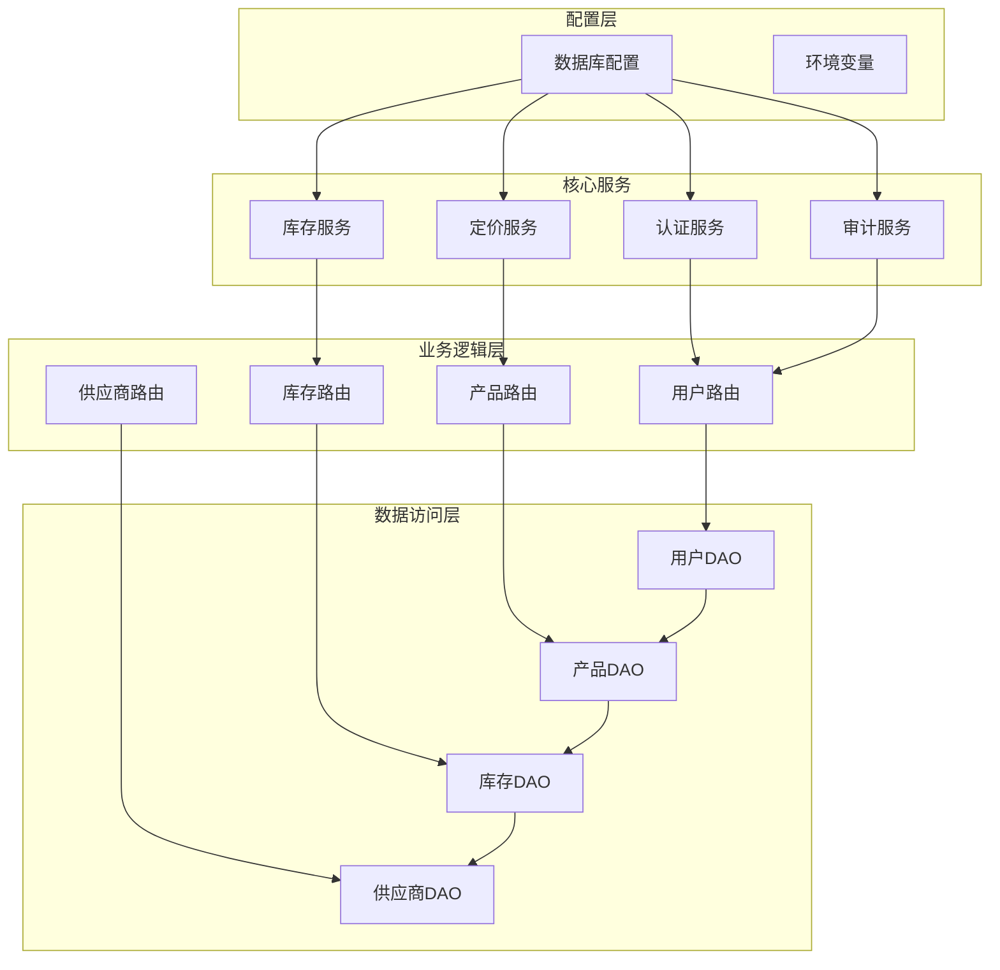
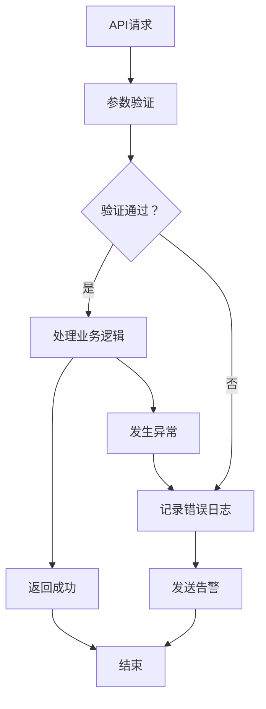

# 数据模型概览

<cite>
**本文档引用的文件**
- [schema.sql](file://server/database/schema.sql)
- [seed.sql](file://server/database/seed.sql)
- [db.js](file://server/src/config/db.js)
- [inventoryRoutes.js](file://server/src/routes/inventoryRoutes.js)
- [masterRoutes.js](file://server/src/routes/masterRoutes.js)
- [orderRoutes.js](file://server/src/routes/orderRoutes.js)
- [supplierRoutes.js](file://server/src/routes/supplierRoutes.js)
- [inventoryService.js](file://server/src/utils/inventoryService.js)
- [auditTrail.js](file://server/src/middleware/auditTrail.js)
- [auditLog.js](file://server/src/utils/auditLog.js)
- [orderSyncService.js](file://server/src/services/orderSyncService.js)
</cite>

## 目录
1. [简介](#简介)
2. [项目结构](#项目结构)
3. [核心组件](#核心组件)
4. [架构概览](#架构概览)
5. [详细组件分析](#详细组件分析)
6. [依赖关系分析](#依赖关系分析)
7. [性能考虑](#性能考虑)
8. [故障排除指南](#故障排除指南)
9. [结论](#结论)
10. [附录](#附录)

## 简介

本系统是一个基于Vue 3、Tailwind CSS、Node.js、Express和PostgreSQL构建的完整库存管理系统。该系统实现了现代化的企业级库存管理功能，包括多仓库库存跟踪、批次管理、价格策略、供应商管理、市场渠道集成等核心业务功能。

系统采用模块化设计，通过清晰的数据库架构和RESTful API实现了完整的业务流程闭环，支持从产品管理到库存操作再到销售订单处理的全流程管理。

## 项目结构

系统采用前后端分离架构，后端使用Node.js + Express提供RESTful API，前端使用Vue 3构建响应式管理界面，数据库采用PostgreSQL存储所有业务数据。



**图表来源**
- [schema.sql:1-420](file://server/database/schema.sql#L1-L420)
- [db.js:1-25](file://server/src/config/db.js#L1-L25)

**章节来源**
- [README.md:1-105](file://README.md#L1-L105)
- [schema.sql:1-420](file://server/database/schema.sql#L1-L420)

## 核心组件

系统的核心数据模型围绕五个主要业务实体构建：用户(User)、产品(Product)、仓库(Warehouse)、库存(Stock Level)和订单(Order)，并通过多种关联表实现复杂业务关系。

### 主要业务实体

1. **用户实体** - 支持多角色权限管理
2. **产品实体** - 支持单件和组合产品
3. **仓库实体** - 多仓库库存管理
4. **库存实体** - 每个产品在每个仓库的库存快照
5. **订单实体** - 支持多平台订单同步

**章节来源**
- [schema.sql:2-54](file://server/database/schema.sql#L2-L54)
- [schema.sql:22-30](file://server/database/schema.sql#L22-L30)
- [schema.sql:125-133](file://server/database/schema.sql#L125-L133)

## 架构概览

系统采用三层架构设计，通过清晰的边界分离实现高内聚低耦合的代码组织。



**图表来源**
- [schema.sql:2-54](file://server/database/schema.sql#L2-L54)
- [schema.sql:125-133](file://server/database/schema.sql#L125-L133)
- [schema.sql:196-219](file://server/database/schema.sql#L196-L219)

## 详细组件分析

### 用户管理模块

用户模块实现了基于角色的访问控制(RBAC)，支持ADMIN、MANAGER、STAFF三种角色，每种角色具有不同的操作权限。



**图表来源**
- [schema.sql:2-11](file://server/database/schema.sql#L2-L11)
- [auditTrail.js:14-45](file://server/src/middleware/auditTrail.js#L14-L45)

用户管理的关键特性：
- 角色驱动的权限控制
- 审计日志记录
- 密码安全存储
- 多货币支持

**章节来源**
- [schema.sql:2-11](file://server/database/schema.sql#L2-L11)
- [auditTrail.js:14-84](file://server/src/middleware/auditTrail.js#L14-L84)

### 产品管理模块

产品模块支持单件产品和组合产品两种类型，通过独立的定价规则系统实现灵活的价格管理。



**图表来源**
- [schema.sql:32-78](file://server/database/schema.sql#L32-L78)
- [schema.sql:99-124](file://server/database/schema.sql#L99-L124)
- [schema.sql:80-87](file://server/database/schema.sql#L80-L87)

产品管理的核心功能：
- 单件与组合产品支持
- 多渠道定价策略
- 图片管理和展示
- 成本价格历史追踪

**章节来源**
- [schema.sql:32-78](file://server/database/schema.sql#L32-L78)
- [schema.sql:99-124](file://server/database/schema.sql#L99-L124)
- [masterRoutes.js:892-1022](file://server/src/routes/masterRoutes.js#L892-L1022)

### 仓库与库存管理

库存管理是系统的核心，实现了精确的多仓库库存跟踪和实时库存更新机制。



**图表来源**
- [inventoryService.js:1-45](file://server/src/utils/inventoryService.js#L1-L45)
- [inventoryRoutes.js:229-403](file://server/src/routes/inventoryRoutes.js#L229-L403)

库存管理的关键特性：
- 实时库存计算
- 库存分配管理
- 多仓库库存同步
- 库存流水追踪

**章节来源**
- [inventoryService.js:1-45](file://server/src/utils/inventoryService.js#L1-L45)
- [inventoryRoutes.js:229-403](file://server/src/routes/inventoryRoutes.js#L229-L403)

### 供应商管理模块

供应商模块实现了复杂的供应商-产品关系管理，支持主供应商设置和多供应商协作。



**图表来源**
- [supplierRoutes.js:94-328](file://server/src/routes/supplierRoutes.js#L94-L328)
- [schema.sql:302-331](file://server/database/schema.sql#L302-L331)

**章节来源**
- [supplierRoutes.js:94-328](file://server/src/routes/supplierRoutes.js#L94-L328)
- [schema.sql:302-331](file://server/database/schema.sql#L302-L331)

### 市场渠道集成

系统集成了多个电商平台，实现了订单和库存的双向同步。

```mermaid
graph LR
subgraph "本地系统"
LocalProducts[本地产品]
LocalStock[本地库存]
LocalOrders[本地订单]
end
subgraph "电商平台"
Shopee[Shopee]
Lazada[Lazada]
TikTok[TikTok]
end
subgraph "同步机制"
SyncOrders[订单同步]
SyncInventory[库存同步]
ErrorLog[错误日志]
end
LocalProducts <- --> SyncInventory
LocalStock <- --> SyncInventory
LocalOrders <- --> SyncOrders
Shopee < --> SyncOrders
Lazada < --> SyncOrders
TikTok < --> SyncOrders
SyncOrders --> ErrorLog
SyncInventory --> ErrorLog
```

**图表来源**
- [orderSyncService.js:19-118](file://server/src/services/orderSyncService.js#L19-L118)
- [schema.sql:137-194](file://server/database/schema.sql#L137-L194)

**章节来源**
- [orderSyncService.js:19-118](file://server/src/services/orderSyncService.js#L19-L118)
- [schema.sql:137-194](file://server/database/schema.sql#L137-L194)

## 依赖关系分析

系统采用模块化的依赖设计，通过清晰的接口定义实现松耦合的组件交互。



**图表来源**
- [db.js:1-25](file://server/src/config/db.js#L1-L25)
- [auditTrail.js:1-84](file://server/src/middleware/auditTrail.js#L1-L84)

**章节来源**
- [db.js:1-25](file://server/src/config/db.js#L1-L25)
- [auditTrail.js:1-84](file://server/src/middleware/auditTrail.js#L1-L84)

## 性能考虑

系统在设计时充分考虑了性能优化，采用了多种策略确保在大数据量下的稳定运行。

### 查询优化策略

1. **索引优化**
   - 为常用查询字段建立复合索引
   - 使用覆盖索引减少回表查询
   - 对时间戳字段建立降序索引

2. **分页机制**
   - 所有列表查询都支持分页
   - 提供总数统计优化
   - 支持批量加载和增量加载

3. **连接优化**
   - 使用JOIN替代子查询
   - 避免N+1查询问题
   - 批量操作减少网络往返

### 缓存策略

系统采用多层次缓存策略：
- **查询结果缓存**：热点数据缓存
- **会话缓存**：用户会话信息
- **配置缓存**：系统配置信息

### 并发控制

1. **事务管理**
   - 关键操作使用事务保证一致性
   - 死锁检测和预防
   - 乐观锁机制

2. **并发限制**
   - API请求频率限制
   - 数据库连接池管理
   - 资源使用监控

## 故障排除指南

### 常见问题诊断

1. **数据库连接问题**
   ```sql
   -- 检查数据库连接状态
   SELECT pg_stat_activity.count, pg_stat_activity.state 
   FROM pg_stat_activity 
   WHERE pg_stat_activity.datname = 'inventory_system';
   ```

2. **库存不一致问题**
   ```sql
   -- 检查库存数据完整性
   SELECT p.name, w.name, sl.quantity, sl.allocated_quantity
   FROM stock_levels sl
   JOIN products p ON sl.product_id = p.id
   JOIN warehouses w ON sl.warehouse_id = w.id
   WHERE sl.quantity < 0 OR sl.allocated_quantity < 0;
   ```

3. **权限访问问题**
   ```sql
   -- 检查用户权限配置
   SELECT u.full_name, u.role, u.is_active
   FROM users u
   WHERE u.email = 'admin@inventory.local';
   ```

### 错误日志分析

系统提供了完善的错误日志记录机制：



**图表来源**
- [auditTrail.js:47-79](file://server/src/middleware/auditTrail.js#L47-L79)
- [auditLog.js:1-38](file://server/src/utils/auditLog.js#L1-L38)

**章节来源**
- [auditTrail.js:47-84](file://server/src/middleware/auditTrail.js#L47-L84)
- [auditLog.js:1-38](file://server/src/utils/auditLog.js#L1-L38)

## 结论

本库存管理系统通过精心设计的数据架构和业务逻辑，实现了企业级的库存管理需求。系统的主要优势包括：

1. **完整的业务覆盖**：从产品管理到订单处理的全流程支持
2. **灵活的扩展性**：模块化设计便于功能扩展和定制
3. **强大的数据完整性**：通过外键约束和业务规则确保数据质量
4. **完善的审计体系**：全面的操作日志和错误追踪
5. **高性能设计**：优化的查询和缓存策略

系统为初学者提供了清晰的概念理解，为开发者提供了深入的技术细节，是一个值得参考的企业级应用架构示例。

## 附录

### 数据模型演进历史

系统经历了以下主要演进阶段：

1. **基础版本**：实现核心的库存管理功能
2. **多仓库版本**：增加多仓库支持和库存分配
3. **电商集成版本**：添加市场渠道同步功能
4. **权限增强版本**：完善RBAC权限控制
5. **性能优化版本**：引入缓存和查询优化

### 未来扩展方向

1. **移动端支持**：开发移动应用客户端
2. **报表分析**：增强数据分析和可视化功能
3. **自动化库存**：实现智能补货建议
4. **供应链协同**：扩展供应商协作功能
5. **AI集成**：引入机器学习进行需求预测

### 最佳实践建议

1. **数据备份**：定期备份数据库和重要配置
2. **监控告警**：建立完善的系统监控机制
3. **性能测试**：定期进行性能压力测试
4. **安全审计**：定期审查系统安全配置
5. **文档维护**：保持技术文档的及时更新