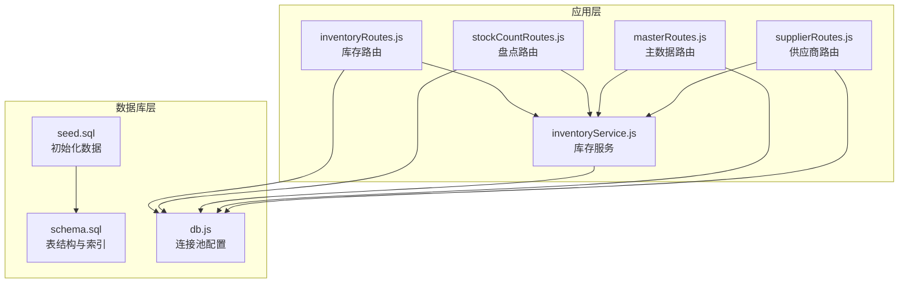
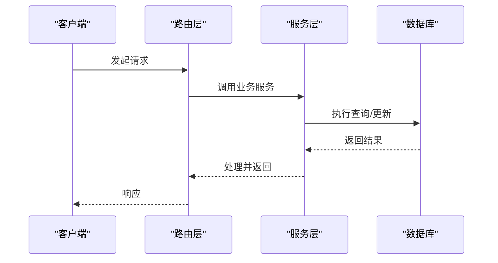
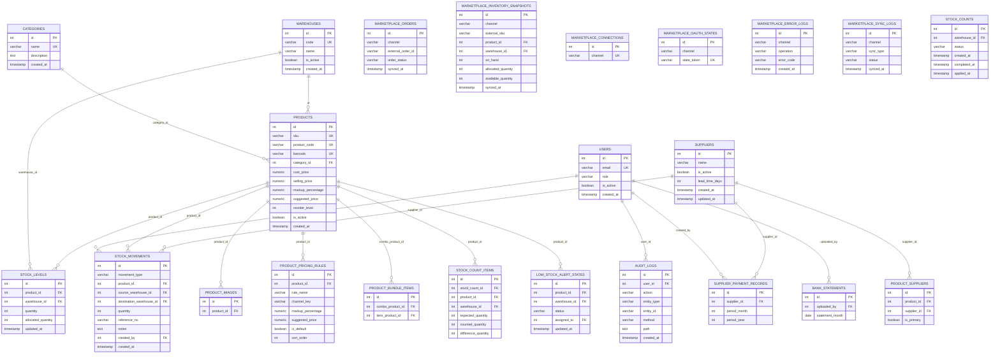

# 索引与约束

<cite>
**本文引用的文件**
- [schema.sql](file://server/database/schema.sql)
- [seed.sql](file://server/database/seed.sql)
- [db.js](file://server/src/config/db.js)
- [inventoryRoutes.js](file://server/src/routes/inventoryRoutes.js)
- [stockCountRoutes.js](file://server/src/routes/stockCountRoutes.js)
- [inventoryService.js](file://server/src/utils/inventoryService.js)
- [masterRoutes.js](file://server/src/routes/masterRoutes.js)
- [supplierRoutes.js](file://server/src/routes/supplierRoutes.js)
</cite>

## 目录
1. [简介](#简介)
2. [项目结构](#项目结构)
3. [核心组件](#核心组件)
4. [架构总览](#架构总览)
5. [详细组件分析](#详细组件分析)
6. [依赖关系分析](#依赖关系分析)
7. [性能考量](#性能考量)
8. [故障排查指南](#故障排查指南)
9. [结论](#结论)
10. [附录](#附录)

## 简介
本文件面向库存管理系统的数据库层，系统性梳理已创建的索引与约束，解释其设计原理、优化效果与使用场景，并结合后端路由与服务层的查询模式，给出索引性能分析、维护策略与监控建议。同时阐述各类约束（主键、外键、检查、唯一）在保障数据完整性与业务规则执行中的作用。

## 项目结构
数据库层主要由以下部分组成：
- 数据库结构定义：表结构、字段约束、索引创建脚本
- 初始化数据：种子数据，用于演示与测试
- 连接配置：PostgreSQL 连接池与 SSL 选择逻辑
- 路由与服务：围绕库存、盘点、供应商等模块的查询与事务处理

图表来源
- [schema.sql:1-447](file://server/database/schema.sql#L1-L447)
- [db.js:1-25](file://server/src/config/db.js#L1-L25)
- [inventoryRoutes.js:1-493](file://server/src/routes/inventoryRoutes.js#L1-L493)
- [stockCountRoutes.js:1-434](file://server/src/routes/stockCountRoutes.js#L1-L434)
- [inventoryService.js:1-45](file://server/src/utils/inventoryService.js#L1-L45)
- [masterRoutes.js:1-800](file://server/src/routes/masterRoutes.js#L1-L800)
- [supplierRoutes.js:1-370](file://server/src/routes/supplierRoutes.js#L1-L370)

章节来源
- [schema.sql:1-447](file://server/database/schema.sql#L1-L447)
- [seed.sql:1-114](file://server/database/seed.sql#L1-L114)
- [db.js:1-25](file://server/src/config/db.js#L1-L25)

## 核心组件
- 表与约束：通过主键、外键、检查、唯一约束确保实体完整性与参照完整性
- 索引：覆盖常见查询过滤条件、排序与连接键，提升查询性能
- 查询模式：路由层广泛使用 JOIN、ILIKE 模糊匹配、分页、时间范围过滤等，对索引策略提出明确要求
- 事务与并发：库存增减、盘点应用等关键路径采用显式事务与行级锁，需配合合适的索引与约束

章节来源
- [schema.sql:1-447](file://server/database/schema.sql#L1-L447)
- [inventoryRoutes.js:17-151](file://server/src/routes/inventoryRoutes.js#L17-L151)
- [stockCountRoutes.js:87-164](file://server/src/routes/stockCountRoutes.js#L87-L164)
- [inventoryService.js:1-45](file://server/src/utils/inventoryService.js#L1-L45)

## 架构总览
数据库层以 PostgreSQL 为核心，通过 schema 定义表结构与约束，通过 seed 初始化基础数据；应用层通过路由与服务封装查询与事务，连接池统一管理连接与 SSL 配置。

图表来源
- [db.js:15-24](file://server/src/config/db.js#L15-L24)
- [inventoryRoutes.js:17-151](file://server/src/routes/inventoryRoutes.js#L17-L151)
- [stockCountRoutes.js:87-164](file://server/src/routes/stockCountRoutes.js#L87-L164)
- [inventoryService.js:1-45](file://server/src/utils/inventoryService.js#L1-L45)

## 详细组件分析

### 索引策略与优化效果

- 单列索引
  - 产品维度：category_id、product_code、barcode、sku、unit、cost_price、selling_price、markup_percentage、suggested_price、reorder_level、is_active
  - 仓库维度：id、code、is_active
  - 供应商维度：id、name、is_active
  - 库存维度：product_id、warehouse_id、quantity、allocated_quantity、updated_at
  - 移动维度：product_id、source_warehouse_id、destination_warehouse_id、movement_type、created_at
  - 盘点维度：stock_count_id、warehouse_id、status、created_at、completed_at、applied_at
  - 订单/同步维度：channel、external_order_id、order_status、external_sku、synced_at
  - 审计/通知维度：user_id、created_at、notification_type
  - 成本历史维度：product_id、changed_at
  - 支付记录维度：supplier_id、period_year、period_month
  - 银行对账单维度：uploaded_by、statement_month

  设计原理与优化效果
  - 通过在常用过滤条件（如 category_id、warehouse_id、status、channel、created_at DESC）上建立单列索引，可显著降低 WHERE 子句扫描成本，尤其在 ILIKE 模糊匹配前加通配符时，仍能利用索引进行范围扫描或前缀匹配
  - 对于频繁排序的字段（如 created_at DESC），索引可避免额外排序开销
  - 对于高选择性的字段（如 code、sku、barcode、email、setting_key），单列唯一索引可同时满足去重与快速查找

  使用场景
  - 库存总览与交易流水：按 product_id、warehouse_id、movement_type、status、channel 等过滤与排序
  - 商品与分类：按 name、sku、barcode、category_id 等过滤
  - 供应商与支付：按 name、supplier_id、period_year/month 等过滤
  - 系统设置与审计：按 setting_key、user_id、created_at 等过滤

- 复合索引
  - stock_levels(product_id, warehouse_id)：唯一复合索引，保证每个产品在每个仓库仅有一条库存记录，支撑库存增删改查与事务一致性
  - product_bundle_items(combo_product_id, item_product_id)：唯一复合索引，防止组合商品重复配置
  - marketplace_orders(channel, external_order_id)：唯一复合索引，保证外部订单幂等
  - supplier_payment_records(supplier_id, period_year, period_month)：唯一复合索引，避免同一供应商同月重复记录
  - stock_count_items(stock_count_id, product_id, warehouse_id)：唯一复合索引，确保盘点项不重复
  - low_stock_alert_states(product_id, warehouse_id)：唯一复合索引，避免重复告警

  设计原理与优化效果
  - 将最常作为过滤条件的列放在前面，可最大化利用索引选择性
  - 在唯一复合索引中，联合主键可替代额外的唯一约束，减少索引数量与维护成本
  - 对于多表 JOIN 的连接键（如 stock_levels.product_id、products.id），复合索引可减少回表次数

  使用场景
  - 库存查询与更新：按 product_id、warehouse_id 快速定位
  - 组合商品与捆绑项：按 combo_product_id、item_product_id 快速定位
  - 外部订单与同步：按 channel、external_order_id 快速定位
  - 供应商付款周期：按 supplier_id、year、month 快速定位
  - 盘点项：按 stock_count_id、product_id、warehouse_id 快速定位
  - 库存告警：按 product_id、warehouse_id 快速定位

- 唯一索引
  - users(email)：保证用户邮箱唯一
  - categories(name)：保证分类名称唯一
  - warehouses(code)：保证仓库编码唯一
  - products(sku)：保证 SKU 唯一
  - products(product_code)：保证产品编号唯一
  - products(barcode)：保证条码唯一
  - system_settings(setting_key)：保证系统设置键唯一
  - marketplace_connections(channel)：保证渠道唯一
  - marketplace_oauth_states(state_token)：保证 OAuth 状态令牌唯一
  - bank_statements(uploaded_by, statement_month)：保证同一用户当月上传唯一

  设计原理与优化效果
  - 唯一索引天然具备去重能力，避免业务重复
  - 在插入/更新时自动校验唯一性，减少应用层重复判断
  - 对于高频唯一性校验的字段，唯一索引是最佳选择

  使用场景
  - 用户注册与登录：邮箱唯一
  - 商品录入：SKU、产品编号、条码唯一
  - 渠道配置：渠道、OAuth 状态令牌唯一
  - 系统设置：设置键唯一
  - 银行对账：上传人+月份唯一

- 检查索引（CHECK 约束）
  - users(role)：限制角色枚举值
  - stock_levels(quantity)：非负数
  - stock_levels(allocated_quantity)：非负数
  - stock_movements(quantity)：正数
  - stock_counts(status)：限定状态枚举
  - suppliers(lead_time_days)：非负数
  - product_pricing_rules(period_month)：1~12
  - product_pricing_rules(period_year)：≥2000
  - stock_count_items(expected_quantity)、counted_quantity：非负数
  - low_stock_alert_states(status)：限定状态枚举

  设计原理与优化效果
  - 在写入阶段强制业务规则，避免脏数据进入系统
  - 结合枚举字段，可与索引协同工作，提升枚举过滤效率

  使用场景
  - 角色权限控制：role 枚举
  - 库存数量：quantity/allocated_quantity 非负
  - 出入库数量：quantity 正数
  - 盘点状态：status 枚举
  - 供应商交期：lead_time_days 非负
  - 价格规则：period_month/year 合法范围
  - 盘点项：expected/counted 非负

- 外键索引
  - 大多数外键字段未显式创建索引，但 PostgreSQL 会自动在外键列上创建索引以加速 JOIN 与约束检查
  - 为高频 JOIN 的外键列（如 products.category_id、stock_levels.warehouse_id、stock_movements.created_by 等）建议保持默认索引即可

  设计原理与优化效果
  - 外键索引可显著提升 JOIN 性能与约束检查效率
  - 对于高基数外键（如 users、warehouses），索引可减少全表扫描

  使用场景
  - 库存与交易：关联 products、warehouses、users
  - 盘点与商品：关联 stock_levels、products
  - 供应商与采购：关联 suppliers、stock_movements

- 时间序列索引
  - created_at DESC：大量报表与列表按时间倒序展示，索引可避免排序
  - period_year DESC、period_month DESC：财务与统计按年月倒序，索引可加速聚合
  - statement_month DESC：银行对账按月份倒序，索引可加速筛选

  设计原理与优化效果
  - 对于“最近优先”的查询，时间倒序索引可避免额外排序
  - 年月维度索引可支持高效的时间段聚合

  使用场景
  - 交易流水、审计日志、通知、银行对账、成本历史、错误日志

章节来源
- [schema.sql:1-447](file://server/database/schema.sql#L1-L447)
- [inventoryRoutes.js:17-151](file://server/src/routes/inventoryRoutes.js#L17-L151)
- [stockCountRoutes.js:14-85](file://server/src/routes/stockCountRoutes.js#L14-L85)
- [masterRoutes.js:663-800](file://server/src/routes/masterRoutes.js#L663-L800)
- [supplierRoutes.js:23-92](file://server/src/routes/supplierRoutes.js#L23-L92)

### 约束实现与作用

- 主键约束
  - 所有表均以自增 id 为主键，确保每行唯一标识
  - 与唯一索引配合，保证业务键唯一性（如 email、code、sku 等）

- 外键约束
  - products.category_id：指向 categories(id)，删除策略为 SET NULL，避免删除分类导致商品丢失
  - stock_levels.product_id、warehouse_id：分别指向 products(id)、warehouses(id)，删除策略为 CASCADE，保证库存与仓库/商品删除的一致性
  - stock_movements.created_by、stock_counts.created_by 等：指向 users(id)，删除策略为 SET NULL，保留审计痕迹
  - marketplace_*、shipping_*、audit_logs 等：均通过外键与 users、products、warehouses 关联，确保跨表一致性

- 唯一约束
  - 通过 UNIQUE 索引实现，覆盖用户邮箱、分类名、仓库编码、商品 SKU/产品编号/条码、系统设置键、渠道、OAuth 状态令牌、银行对账唯一性等

- 检查约束
  - 通过 CHECK 实现枚举与数值范围约束，确保业务规则在写入阶段即被强制执行

- 作用总结
  - 数据完整性：避免重复、空引用、非法值
  - 业务规则执行：角色、状态、数量、时间范围等规则在数据库层强制
  - 审计与追踪：外键保留操作者与实体信息，便于审计

章节来源
- [schema.sql:1-447](file://server/database/schema.sql#L1-L447)

### 查询流程与索引映射

- 库存总览与交易流水
  - 典型查询：JOIN products、warehouses、categories，按 product_id/warehouse_id 过滤，按 created_at DESC 排序，支持 ILIKE 模糊搜索
  - 关键索引：idx_stock_levels_product_id、idx_stock_levels_warehouse_id、idx_stock_movements_created_at DESC、idx_products_category_id、idx_products_sku、idx_products_barcode、idx_products_product_code_unique
  - 优化建议：对 ILIKE 模糊搜索使用前缀匹配或 GIN/GiST 索引（如需全文检索），当前已通过索引与前缀通配符实现高效过滤

- 盘点流程
  - 创建：按 warehouse_id 过滤 active 商品，批量插入 stock_count_items
  - 编辑/完成/应用：按 stock_count_id 过滤，FOR UPDATE 锁定，按 product_id/warehouse_id 更新
  - 关键索引：idx_stock_counts_warehouse_id、idx_stock_count_items_stock_count_id、idx_stock_count_items_product_id、idx_stock_count_items_warehouse_id、idx_stock_levels_product_id、idx_stock_levels_warehouse_id

- 供应商与支付
  - 供应商列表：按 name、company_name、contact_name、phone、email 模糊搜索，按 status 过滤，按 name/created_at/updated_at/lead_time_days 排序
  - 支付记录：按 supplier_id 过滤，按 period_year/month 倒序
  - 关键索引：idx_suppliers_name、idx_suppliers_is_active、idx_supplier_payment_records_supplier_id、idx_supplier_payment_records_period

- 主数据与系统设置
  - 用户、分类、仓库等列表：支持 ILIKE 搜索与分页，按 created_at DESC 或 name 排序
  - 系统设置：按 setting_key 唯一访问
  - 关键索引：idx_users_email、idx_categories_name、idx_warehouses_code、idx_system_settings_setting_key

章节来源
- [inventoryRoutes.js:17-151](file://server/src/routes/inventoryRoutes.js#L17-L151)
- [stockCountRoutes.js:14-85](file://server/src/routes/stockCountRoutes.js#L14-L85)
- [masterRoutes.js:663-800](file://server/src/routes/masterRoutes.js#L663-L800)
- [supplierRoutes.js:23-92](file://server/src/routes/supplierRoutes.js#L23-L92)

## 依赖关系分析

图表来源
- [schema.sql:1-447](file://server/database/schema.sql#L1-L447)

## 性能考量

- 索引选择性与过滤效率
  - 高选择性字段（如 code、sku、barcode、email、setting_key）优先建立唯一索引
  - 中等选择性字段（如 status、is_active、movement_type）建立单列索引，支持枚举过滤
  - 低选择性字段（如 ILIKE 模糊搜索）建议使用前缀匹配或考虑 GIN/GiST 索引（如需全文检索）

- 排序与分页
  - created_at DESC 是高频排序字段，确保相关索引存在
  - 年月维度（period_year、period_month）倒序索引可加速财务统计

- 连接与回表
  - 复合索引在连接键上可减少回表次数
  - 外键列通常已有索引，但对高频 JOIN 的列可关注执行计划

- 写入性能与约束检查
  - 唯一索引与 CHECK 约束在写入时强制校验，建议批量写入时合并事务，减少往返
  - 大批量导入时可临时禁用非必要约束（谨慎使用），导入后再启用

- 监控与维护
  - 定期分析执行计划，识别慢查询
  - 监控索引使用率，清理长期未使用的索引
  - 对热点表定期 VACUUM/ANALYZE，保持统计信息准确

[本节为通用性能指导，无需特定文件来源]

## 故障排查指南

- 插入失败（违反唯一约束）
  - 现象：插入用户、商品、仓库、设置等时报唯一冲突
  - 排查：确认唯一索引是否存在，检查输入值是否重复
  - 参考文件：[schema.sql:2-447](file://server/database/schema.sql#L2-L447)

- 删除失败（违反外键约束）
  - 现象：删除分类、仓库、用户等时报外键引用
  - 排查：检查是否有子记录未清理，确认删除策略（SET NULL/CASCADE）
  - 参考文件：[schema.sql:1-447](file://server/database/schema.sql#L1-L447)

- 查询缓慢
  - 现象：库存总览、交易流水、供应商列表等响应慢
  - 排查：确认相关索引是否存在，执行 EXPLAIN ANALYZE 检查执行计划
  - 参考文件：[inventoryRoutes.js:17-151](file://server/src/routes/inventoryRoutes.js#L17-L151)、[supplierRoutes.js:23-92](file://server/src/routes/supplierRoutes.js#L23-L92)

- 事务死锁或锁等待
  - 现象：库存增减、盘点应用等并发场景出现锁等待
  - 排查：确认 FOR UPDATE 的范围与顺序，避免循环依赖
  - 参考文件：[stockCountRoutes.js:326-431](file://server/src/routes/stockCountRoutes.js#L326-L431)、[inventoryService.js:1-45](file://server/src/utils/inventoryService.js#L1-L45)

- 连接问题
  - 现象：生产环境连接失败或 SSL 报错
  - 排查：检查 DATABASE_URL 与 SSL 配置，确认 rejectUnauthorized 设置
  - 参考文件：[db.js:1-25](file://server/src/config/db.js#L1-L25)

章节来源
- [schema.sql:1-447](file://server/database/schema.sql#L1-L447)
- [inventoryRoutes.js:17-151](file://server/src/routes/inventoryRoutes.js#L17-L151)
- [stockCountRoutes.js:326-431](file://server/src/routes/stockCountRoutes.js#L326-L431)
- [inventoryService.js:1-45](file://server/src/utils/inventoryService.js#L1-L45)
- [db.js:1-25](file://server/src/config/db.js#L1-L25)

## 结论
本系统在数据库层通过完善的主外键、唯一与检查约束，以及针对高频查询场景的单列与复合索引，有效保障了数据完整性与查询性能。结合路由层的分页、模糊搜索与时间倒序排序，索引策略能够满足大规模库存与多仓库场景下的性能需求。建议持续监控执行计划与索引使用率，按需调整索引与维护策略，确保系统长期稳定高效运行。

[本节为总结，无需特定文件来源]

## 附录

### 索引清单与使用场景对照

- 单列索引
  - idx_products_category_id：按分类过滤商品
  - idx_products_sku：按 SKU 过滤商品
  - idx_products_barcode：按条码过滤商品
  - idx_products_product_code_unique：按产品编号过滤商品
  - idx_stock_levels_product_id：按产品过滤库存
  - idx_stock_levels_warehouse_id：按仓库过滤库存
  - idx_stock_movements_created_at：按时间倒序查看流水
  - idx_marketplace_orders_channel：按渠道过滤订单
  - idx_marketplace_orders_status：按状态过滤订单
  - idx_marketplace_error_logs_created_at：按时间倒序查看错误日志
  - idx_system_notifications_created_at：按时间倒序查看通知
  - idx_supplier_payment_records_period：按年月倒序查看支付记录

- 复合索引
  - idx_stock_levels_product_id_warehouse_id：库存唯一性与快速定位
  - idx_product_bundle_items_combo_id_item_id：组合商品唯一性
  - idx_marketplace_orders_channel_external_order_id：外部订单唯一性
  - idx_supplier_payment_records_supplier_id_period：供应商支付唯一性
  - idx_stock_count_items_stock_count_id_product_id_warehouse_id：盘点项唯一性
  - idx_low_stock_alert_states_product_id_warehouse_id：告警唯一性

- 唯一索引
  - idx_users_email：用户邮箱唯一
  - idx_categories_name：分类名称唯一
  - idx_warehouses_code：仓库编码唯一
  - idx_products_sku：SKU 唯一
  - idx_products_product_code_unique：产品编号唯一
  - idx_products_barcode：条码唯一
  - idx_system_settings_setting_key：系统设置键唯一
  - idx_marketplace_connections_channel：渠道唯一
  - idx_marketplace_oauth_states_state_token：OAuth 状态令牌唯一
  - idx_bank_statements_uploaded_by_statement_month：银行对账唯一性

- 检查约束
  - users.role ∈ {ADMIN, MANAGER, STAFF}
  - stock_levels.quantity ≥ 0
  - stock_levels.allocated_quantity ≥ 0
  - stock_movements.quantity > 0
  - stock_counts.status ∈ {OPEN, COMPLETED, APPLIED}
  - suppliers.lead_time_days ≥ 0
  - product_pricing_rules.period_month ∈ [1,12]
  - product_pricing_rules.period_year ≥ 2000

章节来源
- [schema.sql:1-447](file://server/database/schema.sql#L1-L447)