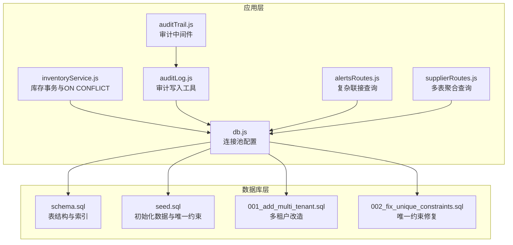
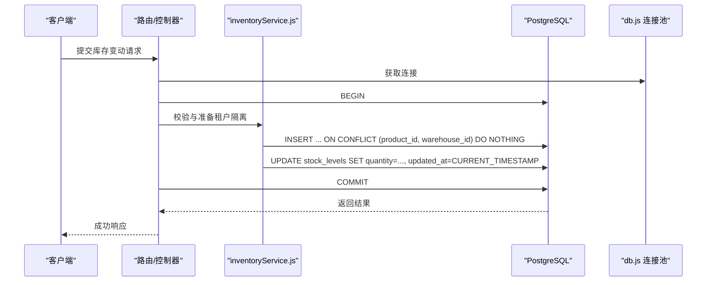
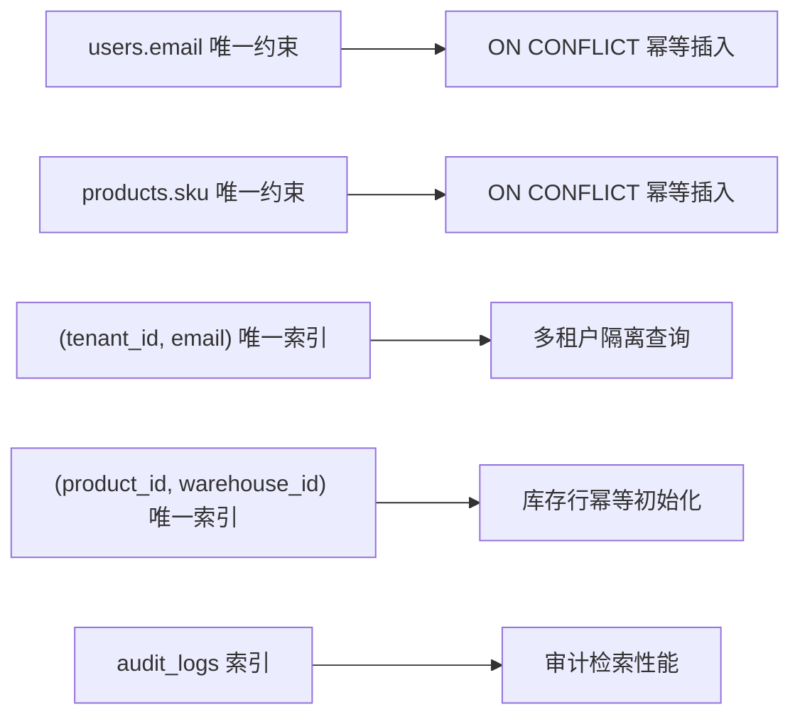

# 索引与约束

<cite>
**本文引用的文件列表**
- [schema.sql](file://server/database/schema.sql)
- [seed.sql](file://server/database/seed.sql)
- [db.js](file://server/src/config/db.js)
- [001_add_multi_tenant.sql](file://server/database/migrations/001_add_multi_tenant.sql)
- [002_fix_unique_constraints.sql](file://server/database/migrations/002_fix_unique_constraints.sql)
- [inventoryService.js](file://server/src/utils/inventoryService.js)
- [auditTrail.js](file://server/src/middleware/auditTrail.js)
- [auditLog.js](file://server/src/utils/auditLog.js)
- [alertsRoutes.js](file://server/src/routes/alertsRoutes.js)
- [supplierRoutes.js](file://server/src/routes/supplierRoutes.js)
</cite>

## 目录
1. [简介](#简介)
2. [项目结构与数据库相关模块](#项目结构与数据库相关模块)
3. [核心组件与约束设计](#核心组件与约束设计)
4. [架构总览](#架构总览)
5. [详细组件分析](#详细组件分析)
6. [依赖关系分析](#依赖关系分析)
7. [性能考量与优化策略](#性能考量与优化策略)
8. [故障排查指南](#故障排查指南)
9. [结论](#结论)
10. [附录：最佳实践与常见陷阱](#附录最佳实践与常见陷阱)

## 简介
本文件聚焦于库存系统的数据库索引与约束设计，系统性阐述主键索引、唯一索引、复合索引的设计原则与性能影响；解释外键约束、检查约束、审计日志等机制在业务中的落地方式；并结合实际迁移脚本与应用层代码，给出索引维护策略、性能监控方法、数据库迁移过程中的变更与兼容性处理建议，以及面向性能调优的实用指导。

## 项目结构与数据库相关模块
- 数据库结构定义与索引创建集中在 schema.sql 中，包含大量单列与复合索引，覆盖高频查询字段。
- 初始化数据 seed.sql 使用 ON CONFLICT 语句进行幂等插入，体现对唯一约束的依赖。
- 迁移脚本 001_add_multi_tenant.sql 与 002_fix_unique_constraints.sql 展示了多租户改造过程中对唯一约束与索引的重构，强调“租户内唯一”与“查询性能”的平衡。
- 应用层通过 inventoryService.js 封装库存事务与 ON CONFLICT 逻辑，体现约束与索引在运行期的协同作用。
- 审计中间件 auditTrail.js 与工具 auditLog.js 将业务行为持久化到 audit_logs 表，配合索引实现高效检索。

图表来源
- [schema.sql:1-447](file://server/database/schema.sql#L1-L447)
- [seed.sql:1-114](file://server/database/seed.sql#L1-L114)
- [001_add_multi_tenant.sql:1-100](file://server/database/migrations/001_add_multi_tenant.sql#L1-L100)
- [002_fix_unique_constraints.sql:1-44](file://server/database/migrations/002_fix_unique_constraints.sql#L1-L44)
- [db.js:1-29](file://server/src/config/db.js#L1-L29)
- [inventoryService.js:1-45](file://server/src/utils/inventoryService.js#L1-L45)
- [auditTrail.js:1-85](file://server/src/middleware/auditTrail.js#L1-L85)
- [auditLog.js:1-39](file://server/src/utils/auditLog.js#L1-L39)
- [alertsRoutes.js:44-69](file://server/src/routes/alertsRoutes.js#L44-L69)
- [supplierRoutes.js:31-64](file://server/src/routes/supplierRoutes.js#L31-L64)

章节来源
- [schema.sql:1-447](file://server/database/schema.sql#L1-L447)
- [seed.sql:1-114](file://server/database/seed.sql#L1-L114)
- [001_add_multi_tenant.sql:1-100](file://server/database/migrations/001_add_multi_tenant.sql#L1-L100)
- [002_fix_unique_constraints.sql:1-44](file://server/database/migrations/002_fix_unique_constraints.sql#L1-L44)
- [db.js:1-29](file://server/src/config/db.js#L1-L29)

## 核心组件与约束设计
- 主键索引：绝大多数表采用自增主键（SERIAL PRIMARY KEY），确保每条记录唯一标识，支撑外键引用与二级索引组织。
- 唯一索引/约束：
  - 全局唯一：users.email、categories.name、warehouses.code、products.sku、products.product_code、products.barcode 等。
  - 多租户唯一：迁移后改为 (tenant_id, field) 唯一，确保跨租户隔离。
  - ON CONFLICT：种子数据与运行期插入广泛使用，依赖唯一约束保证幂等。
- 复合索引：围绕高频过滤、排序与联接字段建立，如 (product_id, warehouse_id)、(channel, external_order_id)、(tenant_id, email) 等。
- 检查约束：role 枚举校验、数量非负、状态枚举、日期范围等，保障业务规则一致性。
- 外键约束：产品、图片、定价规则、出入库、订单、供应商等均通过外键关联，配合 ON DELETE 行为控制级联删除与置空。
- 触发器：未发现显式触发器定义；审计日志通过中间件与工具函数实现，属于应用层触发的副作用。

章节来源
- [schema.sql:2-54](file://server/database/schema.sql#L2-L54)
- [schema.sql:137-194](file://server/database/schema.sql#L137-L194)
- [schema.sql:209-235](file://server/database/schema.sql#L209-L235)
- [schema.sql:250-273](file://server/database/schema.sql#L250-L273)
- [schema.sql:302-318](file://server/database/schema.sql#L302-L318)
- [schema.sql:348-356](file://server/database/schema.sql#L348-L356)
- [001_add_multi_tenant.sql:62-81](file://server/database/migrations/001_add_multi_tenant.sql#L62-L81)
- [002_fix_unique_constraints.sql:6-13](file://server/database/migrations/002_fix_unique_constraints.sql#L6-L13)
- [seed.sql:27-28](file://server/database/seed.sql#L27-L28)
- [seed.sql:34-35](file://server/database/seed.sql#L34-L35)
- [seed.sql:41-42](file://server/database/seed.sql#L41-L42)
- [seed.sql:67-68](file://server/database/seed.sql#L67-L68)
- [seed.sql:92-93](file://server/database/seed.sql#L92-L93)
- [seed.sql:102-103](file://server/database/seed.sql#L102-L103)
- [seed.sql:112-113](file://server/database/seed.sql#L112-L113)

## 架构总览
数据库层通过 schema.sql 定义表结构与索引，迁移脚本在多租户改造中将“全局唯一”调整为“租户内唯一”，并在必要处补充索引以维持查询性能。应用层通过 inventoryService.js 的 ON CONFLICT 与事务封装，确保库存数据一致性；审计中间件与工具将关键业务动作持久化到 audit_logs，并利用索引支持高效检索。

图表来源
- [inventoryService.js:1-45](file://server/src/utils/inventoryService.js#L1-L45)
- [db.js:1-29](file://server/src/config/db.js#L1-L29)

章节来源
- [inventoryService.js:1-45](file://server/src/utils/inventoryService.js#L1-L45)
- [db.js:1-29](file://server/src/config/db.js#L1-L29)

## 详细组件分析

### 主键索引与唯一索引
- 设计要点
  - 主键：确保每张表的唯一标识，支撑外键与二级索引组织。
  - 唯一约束：用于业务唯一性（如邮箱、仓库编码、SKU 等）。
  - 多租户唯一：将 (tenant_id, field) 组合作为唯一约束，避免跨租户冲突。
- 性能影响
  - 唯一索引同时提供去重与快速查找能力，但写入时需维护索引，带来额外开销。
  - 复合唯一索引可覆盖多条件查询，减少回表成本。
- 实现细节
  - 迁移脚本将 users.email、categories.name、warehouses.code、products.sku/product_code/barcode 的全局唯一约束替换为租户内唯一。
  - 通过 ON CONFLICT 实现幂等插入，避免重复写入。

章节来源
- [schema.sql:2-54](file://server/database/schema.sql#L2-L54)
- [schema.sql:137-194](file://server/database/schema.sql#L137-L194)
- [schema.sql:209-235](file://server/database/schema.sql#L209-L235)
- [schema.sql:250-273](file://server/database/schema.sql#L250-L273)
- [schema.sql:302-318](file://server/database/schema.sql#L302-L318)
- [schema.sql:348-356](file://server/database/schema.sql#L348-L356)
- [001_add_multi_tenant.sql:62-81](file://server/database/migrations/001_add_multi_tenant.sql#L62-L81)
- [002_fix_unique_constraints.sql:6-13](file://server/database/migrations/002_fix_unique_constraints.sql#L6-L13)
- [seed.sql:27-28](file://server/database/seed.sql#L27-L28)
- [seed.sql:34-35](file://server/database/seed.sql#L34-L35)
- [seed.sql:41-42](file://server/database/seed.sql#L41-L42)
- [seed.sql:67-68](file://server/database/seed.sql#L67-L68)
- [seed.sql:92-93](file://server/database/seed.sql#L92-L93)
- [seed.sql:102-103](file://server/database/seed.sql#L102-L103)
- [seed.sql:112-113](file://server/database/seed.sql#L112-L113)

### 复合索引与查询优化
- 关键复合索引
  - (product_id, warehouse_id)：库存水平与出入库记录的联合查询与去重。
  - (channel, external_order_id)：外部平台订单的唯一性与查询。
  - (tenant_id, email/name/code)：多租户隔离下的唯一性与检索。
  - (tenant_id, created_at DESC)：审计日志、通知、银行流水等时间序列查询。
  - (supplier_id, period_year, period_month)：供应商账单周期查询。
- 查询模式
  - 联接查询：alertsRoutes.js 中通过多表联接与 LEFT JOIN LATERAL 获取最近采购信息。
  - 聚合查询：supplierRoutes.js 对供应商与产品映射进行分组统计。
- 性能考量
  - 复合索引顺序应优先放置选择性高、过滤性强的列。
  - 对于 ORDER BY、GROUP BY、WHERE 多字段组合，复合索引可显著降低排序与临时表开销。

章节来源
- [schema.sql:410-446](file://server/database/schema.sql#L410-L446)
- [alertsRoutes.js:44-69](file://server/src/routes/alertsRoutes.js#L44-L69)
- [supplierRoutes.js:31-64](file://server/src/routes/supplierRoutes.js#L31-L64)

### 外键约束与检查约束
- 外键约束
  - 产品图片、定价规则、出入库、订单项、低库存状态、供应商映射等均通过外键关联，ON DELETE 行为包括 CASCADE 与 SET NULL，确保数据一致性与清理策略明确。
- 检查约束
  - 角色枚举、数量非负、状态枚举、月份/年份范围等，保障输入合法性与业务规则执行。
- 实施方式
  - 在 schema.sql 中直接声明；在迁移脚本中对多租户场景进行约束调整，确保唯一性与查询性能兼顾。

章节来源
- [schema.sql:44-54](file://server/database/schema.sql#L44-L54)
- [schema.sql:125-133](file://server/database/schema.sql#L125-L133)
- [schema.sql:196-208](file://server/database/schema.sql#L196-L208)
- [schema.sql:237-248](file://server/database/schema.sql#L237-L248)
- [schema.sql:290-300](file://server/database/schema.sql#L290-L300)
- [schema.sql:302-318](file://server/database/schema.sql#L302-L318)
- [schema.sql:348-356](file://server/database/schema.sql#L348-L356)
- [001_add_multi_tenant.sql:62-81](file://server/database/migrations/001_add_multi_tenant.sql#L62-L81)
- [002_fix_unique_constraints.sql:23-35](file://server/database/migrations/002_fix_unique_constraints.sql#L23-L35)

### 审计日志与触发器替代
- 审计机制
  - 审计中间件在请求完成后异步写入 audit_logs，包含用户、实体类型、方法、路径、元数据等。
  - 通过索引 (tenant_id, created_at DESC)、(user_id)、(entity_type) 支持高效检索。
- 触发器
  - 未发现显式触发器；审计通过应用层中间件实现，具备可控性与可观测性。

章节来源
- [auditTrail.js:1-85](file://server/src/middleware/auditTrail.js#L1-L85)
- [auditLog.js:1-39](file://server/src/utils/auditLog.js#L1-L39)
- [schema.sql:275-288](file://server/database/schema.sql#L275-L288)
- [schema.sql:431-432](file://server/database/schema.sql#L431-L432)

### 运行期一致性与事务
- ON CONFLICT 幂等插入：inventoryService.js 中对库存行进行 ON CONFLICT (product_id, warehouse_id) DO NOTHING，避免重复初始化。
- 事务边界：库存变动在路由层开启事务，先校验租户隔离与可用量，再更新库存与生成流水，最后提交。
- 多租户隔离：所有查询与写入均附加 tenant_id 条件，确保跨租户数据隔离。

章节来源
- [inventoryService.js:1-45](file://server/src/utils/inventoryService.js#L1-L45)
- [alertsRoutes.js:237-334](file://server/src/routes/alertsRoutes.js#L237-L334)

## 依赖关系分析
- 约束与索引依赖
  - ON CONFLICT 依赖唯一约束或唯一索引；若仅存在唯一索引而无约束，可能无法满足应用层的幂等需求。
  - 复合索引依赖查询模式；错误的索引顺序会导致查询计划不佳。
- 多租户依赖
  - 唯一约束从全局迁移到 (tenant_id, field)，需要同步更新索引与查询条件。
  - 迁移脚本中补充了 tenant_id 相关索引，以维持查询性能。
- 应用层依赖
  - inventoryService.js 依赖 (product_id, warehouse_id) 唯一性与 ON CONFLICT。
  - 审计中间件依赖 audit_logs 表结构与索引。

图表来源
- [001_add_multi_tenant.sql:62-81](file://server/database/migrations/001_add_multi_tenant.sql#L62-L81)
- [002_fix_unique_constraints.sql:6-13](file://server/database/migrations/002_fix_unique_constraints.sql#L6-L13)
- [seed.sql:27-28](file://server/database/seed.sql#L27-L28)
- [seed.sql:67-68](file://server/database/seed.sql#L67-L68)
- [schema.sql:125-133](file://server/database/schema.sql#L125-L133)
- [schema.sql:275-288](file://server/database/schema.sql#L275-L288)

章节来源
- [001_add_multi_tenant.sql:62-81](file://server/database/migrations/001_add_multi_tenant.sql#L62-L81)
- [002_fix_unique_constraints.sql:6-13](file://server/database/migrations/002_fix_unique_constraints.sql#L6-L13)
- [seed.sql:27-28](file://server/database/seed.sql#L27-L28)
- [seed.sql:67-68](file://server/database/seed.sql#L67-L68)
- [schema.sql:125-133](file://server/database/schema.sql#L125-L133)
- [schema.sql:275-288](file://server/database/schema.sql#L275-L288)

## 性能考量与优化策略
- 索引选择性与顺序
  - 复合索引应优先放置高选择性的列；例如 (tenant_id, email) 优于 (email, tenant_id)，因为 tenant_id 可显著缩小搜索空间。
- 写入与读取权衡
  - 唯一索引提升读取效率，但写入时需维护索引，应结合业务写入峰值评估。
- 时间序列查询
  - 对 created_at DESC 排序的查询，优先使用 (tenant_id, created_at DESC) 或单独 (created_at DESC) 索引，减少排序成本。
- 聚合与联接
  - 聚合查询（如供应商统计）应确保关联字段有索引；联接查询优先使用小表驱动大表，必要时使用物化视图或预聚合。
- 监控与诊断
  - 建议定期执行 EXPLAIN/EXPLAIN ANALYZE 分析慢查询计划，识别缺失索引或索引失效点。
  - 结合数据库性能视图与应用埋点，定位热点表与慢查询。

[本节为通用性能指导，不直接分析具体文件]

## 故障排查指南
- 唯一冲突
  - 现象：插入失败或 ON CONFLICT 生效。
  - 排查：确认唯一约束/索引是否正确迁移至 (tenant_id, field)；核对业务层是否遗漏 tenant_id。
- 多租户隔离问题
  - 现象：跨租户数据可见或写入异常。
  - 排查：检查查询与写入是否包含 tenant_id 条件；确认迁移脚本是否成功执行。
- 审计日志检索缓慢
  - 现象：审计查询耗时较长。
  - 排查：确认 (tenant_id, created_at DESC)、(user_id)、(entity_type) 等索引是否存在；检查查询是否命中索引。
- 库存更新异常
  - 现象：库存超卖或更新失败。
  - 排查：确认事务边界与租户校验逻辑；检查 (product_id, warehouse_id) 唯一性与 ON CONFLICT 行为。

章节来源
- [001_add_multi_tenant.sql:62-81](file://server/database/migrations/001_add_multi_tenant.sql#L62-L81)
- [002_fix_unique_constraints.sql:6-13](file://server/database/migrations/002_fix_unique_constraints.sql#L6-L13)
- [auditTrail.js:1-85](file://server/src/middleware/auditTrail.js#L1-L85)
- [auditLog.js:1-39](file://server/src/utils/auditLog.js#L1-L39)
- [inventoryService.js:1-45](file://server/src/utils/inventoryService.js#L1-L45)

## 结论
该系统在数据库层面通过主键、唯一约束与复合索引构建了清晰的数据完整性与查询性能基础；在多租户改造中，将“全局唯一”调整为“租户内唯一”，并通过补充索引维持查询效率。应用层通过事务与 ON CONFLICT 保障一致性，审计中间件提供可观测性。整体设计在隔离性、性能与可维护性之间取得良好平衡。

[本节为总结性内容，不直接分析具体文件]

## 附录：最佳实践与常见陷阱
- 最佳实践
  - 唯一约束与唯一索引并存：确保应用层 ON CONFLICT 正常工作。
  - 复合索引顺序：高选择性列优先，匹配常见 WHERE/ORDER/GROUP 条件。
  - 多租户唯一：统一采用 (tenant_id, field) 唯一约束，迁移时同步更新索引。
  - 审计索引：为 tenant_id、created_at、user_id、entity_type 建立索引，支撑高效检索。
  - 事务与幂等：对关键写入使用事务与 ON CONFLICT 幂等插入，避免重复初始化。
- 常见陷阱
  - 仅建立唯一索引而未添加唯一约束：应用层 ON CONFLICT 可能无法生效。
  - 忽略 tenant_id：导致跨租户数据污染或查询结果异常。
  - 复合索引顺序不当：导致查询不走索引或回表频繁。
  - 缺少时间序列索引：导致审计与报表类查询性能下降。
  - 迁移后遗漏补充索引：导致查询性能回退。

[本节为通用指导，不直接分析具体文件]