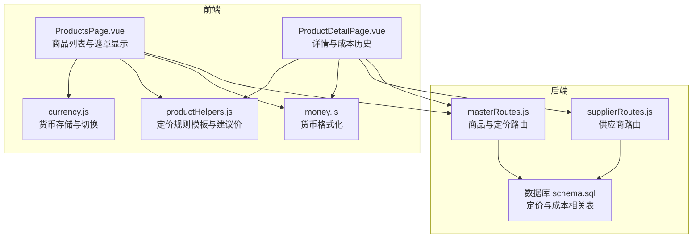
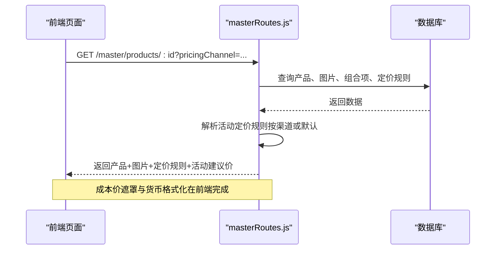
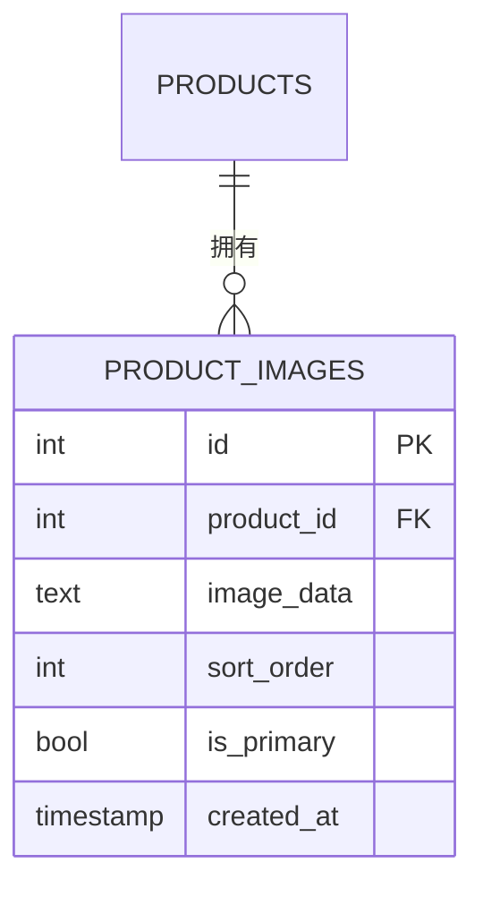
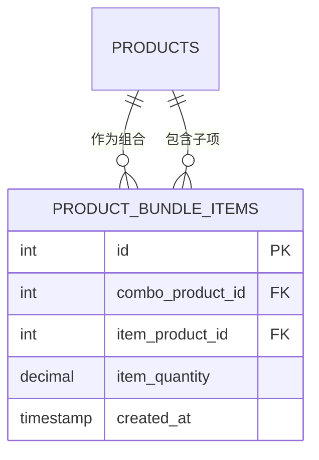
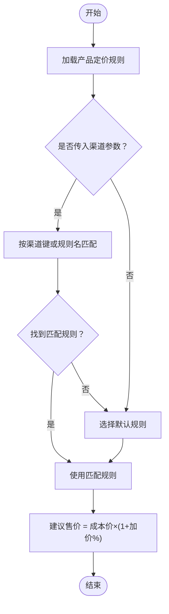
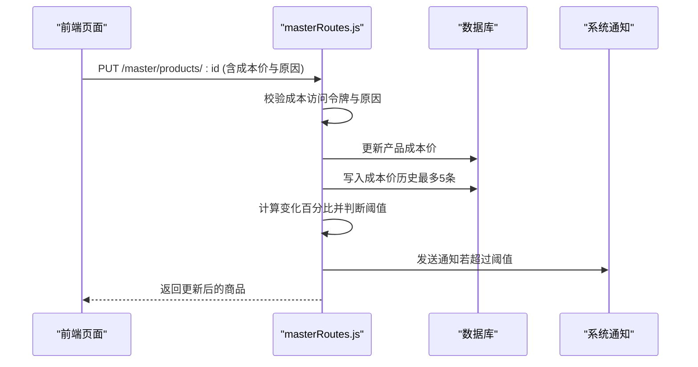
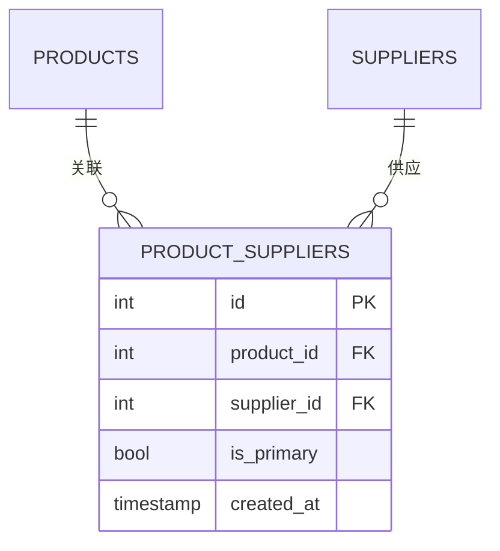
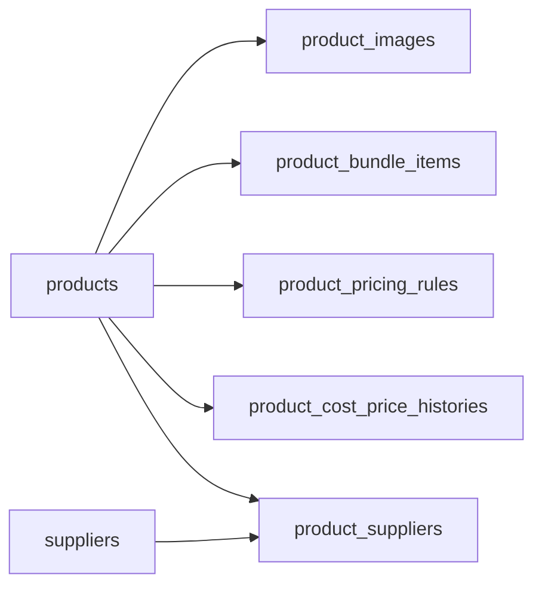

# 定价与成本表

<cite>
**本文引用的文件**
- [schema.sql](file://server/database/schema.sql)
- [seed.sql](file://server/database/seed.sql)
- [masterRoutes.js](file://server/src/routes/masterRoutes.js)
- [supplierRoutes.js](file://server/src/routes/supplierRoutes.js)
- [productHelpers.js](file://web/src/utils/productHelpers.js)
- [money.js](file://web/src/utils/money.js)
- [currency.js](file://web/src/stores/currency.js)
- [ProductsPage.vue](file://web/src/pages/ProductsPage.vue)
- [ProductDetailPage.vue](file://web/src/pages/ProductDetailPage.vue)
- [POSTMAN_BACKEND_GUIDE.md](file://POSTMAN_BACKEND_GUIDE.md)
</cite>

## 目录
1. [简介](#简介)
2. [项目结构](#项目结构)
3. [核心组件](#核心组件)
4. [架构总览](#架构总览)
5. [详细组件分析](#详细组件分析)
6. [依赖关系分析](#依赖关系分析)
7. [性能考量](#性能考量)
8. [故障排查指南](#故障排查指南)
9. [结论](#结论)
10. [附录](#附录)

## 简介
本文件聚焦于库存系统中与“定价与成本”相关的核心数据表与业务流程，覆盖以下主题：
- 产品图片表：产品多图管理与主图逻辑
- 产品组合项表：产品组合（套餐）构成
- 产品定价规则表：渠道差异化定价与默认规则
- 产品成本价历史表：成本价变更追踪与阈值告警
- 产品供应商关联表：主供应商设定与供应商价格对比基础
- 成本价管理机制：成本访问令牌、成本遮罩与可视化控制
- 价格计算模型：建议售价、批量折扣与渠道定价
- 成本分析与利润计算：基于成本价的历史记录与可视化
- 价格调整流程、审批机制与影响评估
- 汇率与货币：前端货币格式化与本地化
- 财务报表集成：成本价历史与通知机制

## 项目结构
后端采用 Express 路由组织商品、供应商等模块；前端通过 Vue 页面与工具函数完成定价规则展示、成本价遮罩与货币格式化。

图表来源
- [masterRoutes.js](file://server/src/routes/masterRoutes.js)
- [supplierRoutes.js](file://server/src/routes/supplierRoutes.js)
- [schema.sql](file://server/database/schema.sql)
- [ProductsPage.vue](file://web/src/pages/ProductsPage.vue)
- [ProductDetailPage.vue](file://web/src/pages/ProductDetailPage.vue)
- [productHelpers.js](file://web/src/utils/productHelpers.js)
- [money.js](file://web/src/utils/money.js)
- [currency.js](file://web/src/stores/currency.js)

章节来源
- [schema.sql](file://server/database/schema.sql)
- [masterRoutes.js](file://server/src/routes/masterRoutes.js)
- [supplierRoutes.js](file://server/src/routes/supplierRoutes.js)
- [ProductsPage.vue](file://web/src/pages/ProductsPage.vue)
- [ProductDetailPage.vue](file://web/src/pages/ProductDetailPage.vue)
- [productHelpers.js](file://web/src/utils/productHelpers.js)
- [money.js](file://web/src/utils/money.js)
- [currency.js](file://web/src/stores/currency.js)

## 核心组件
- 产品图片表（product_images）
  - 字段要点：外键到产品、排序序号、是否主图、创建时间
  - 作用：支持产品多图展示与主图优先级
- 产品组合项表（product_bundle_items）
  - 字段要点：组合产品ID、子产品ID、子产品数量
  - 作用：定义组合产品的构成与数量
- 产品定价规则表（product_pricing_rules）
  - 字段要点：产品ID、规则名、渠道键、加价百分比、建议售价、是否默认、排序
  - 作用：支持多渠道差异化定价与默认规则选择
- 产品成本价历史表（product_cost_price_histories）
  - 字段要点：产品ID、旧成本价、新成本价、变化百分比、原因、变更人、变更时间
  - 作用：成本价变更追踪、阈值告警与历史回溯
- 产品供应商关联表（product_suppliers）
  - 字段要点：产品ID、供应商ID、是否主供应商
  - 作用：主供应商设定与供应商价格对比的基础

章节来源
- [schema.sql](file://server/database/schema.sql)
- [masterRoutes.js](file://server/src/routes/masterRoutes.js)

## 架构总览
后端路由负责：
- 商品查询与详情：按渠道解析活动定价规则、加载图片与组合项
- 成本价变更：校验成本访问权限、记录历史、触发阈值告警
- 供应商详情：列出关联商品与近期采购流水

前端页面负责：
- 商品列表：遮罩成本价、展示建议价与渠道规则矩阵
- 商品详情：展示成本历史、主供应商信息、库存与流水

图表来源
- [masterRoutes.js](file://server/src/routes/masterRoutes.js)
- [ProductsPage.vue](file://web/src/pages/ProductsPage.vue)
- [ProductDetailPage.vue](file://web/src/pages/ProductDetailPage.vue)

## 详细组件分析

### 产品图片表（product_images）
- 设计要点
  - 主键自增ID
  - 外键约束到产品表，级联删除保证一致性
  - 排序字段与主图标记用于前端渲染顺序与主图优先
- 数据流
  - 创建/更新产品时写入图片集合
  - 读取时按主图优先、排序升序、创建时间升序返回
- 性能与索引
  - 为 product_id 建有索引，支持批量加载

图表来源
- [schema.sql](file://server/database/schema.sql)

章节来源
- [schema.sql](file://server/database/schema.sql)
- [masterRoutes.js](file://server/src/routes/masterRoutes.js)

### 产品组合项表（product_bundle_items）
- 设计要点
  - 组合产品ID与子产品ID唯一约束，防止重复组合
  - 子产品数量支持小数，便于灵活配置
- 数据流
  - 创建/更新组合产品时，先清空旧组合，再插入新组合
  - 读取时按组合产品ID聚合返回子项明细

图表来源
- [schema.sql](file://server/database/schema.sql)

章节来源
- [schema.sql](file://server/database/schema.sql)
- [masterRoutes.js](file://server/src/routes/masterRoutes.js)

### 产品定价规则表（product_pricing_rules）
- 设计要点
  - 规则名与渠道键用于区分不同渠道（如零售、批发、VIP）
  - 加价百分比与建议售价可单独设置或自动计算
  - 是否默认与排序决定活动规则解析优先级
- 价格计算模型
  - 建议售价 = 成本价 × (1 + 加价百分比)
  - 活动规则解析：优先匹配渠道键或规则名，否则回退到默认规则
- 前端展示
  - 商品详情页展示规则矩阵，突出默认规则

图表来源
- [masterRoutes.js](file://server/src/routes/masterRoutes.js)
- [productHelpers.js](file://web/src/utils/productHelpers.js)

章节来源
- [schema.sql](file://server/database/schema.sql)
- [masterRoutes.js](file://server/src/routes/masterRoutes.js)
- [productHelpers.js](file://web/src/utils/productHelpers.js)
- [ProductDetailPage.vue](file://web/src/pages/ProductDetailPage.vue)

### 产品成本价历史表（product_cost_price_histories）
- 设计要点
  - 记录每次成本价变更的旧值、新值、变化百分比、原因与操作人
  - 仅保留最近5条历史记录，避免无限增长
- 阈值告警
  - 当变化百分比绝对值超过系统设置阈值时，向目标角色发送系统通知
- 成本访问控制
  - 仅持有成本访问令牌的管理员/经理可修改成本价
  - 修改成本价需提供变更原因

图表来源
- [masterRoutes.js](file://server/src/routes/masterRoutes.js)
- [ProductDetailPage.vue](file://web/src/pages/ProductDetailPage.vue)

章节来源
- [schema.sql](file://server/database/schema.sql)
- [masterRoutes.js](file://server/src/routes/masterRoutes.js)
- [ProductDetailPage.vue](file://web/src/pages/ProductDetailPage.vue)

### 产品供应商关联表（product_suppliers）
- 设计要点
  - 产品与供应商的多对多关系，通过中间表限定主供应商
  - 支持设置/取消主供应商，确保补货与价格对比的准确性
- 供应商详情
  - 展示关联商品列表与近期采购流水，便于成本分析与价格对比

图表来源
- [schema.sql](file://server/database/schema.sql)

章节来源
- [schema.sql](file://server/database/schema.sql)
- [supplierRoutes.js](file://server/src/routes/supplierRoutes.js)
- [ProductDetailPage.vue](file://web/src/pages/ProductDetailPage.vue)

## 依赖关系分析
- 表间依赖
  - product_images 依赖 products
  - product_bundle_items 依赖 products（组合与子项）
  - product_pricing_rules 依赖 products
  - product_cost_price_histories 依赖 products
  - product_suppliers 依赖 products 与 suppliers
- 路由依赖
  - masterRoutes 负责商品与定价相关接口，依赖数据库与成本访问中间件
  - supplierRoutes 提供供应商详情与关联商品查询
- 前端依赖
  - 商品列表与详情依赖后端接口返回的定价规则与成本历史
  - 货币格式化与本地化由 money.js 与 currency.js 提供

图表来源
- [schema.sql](file://server/database/schema.sql)

章节来源
- [schema.sql](file://server/database/schema.sql)
- [masterRoutes.js](file://server/src/routes/masterRoutes.js)
- [supplierRoutes.js](file://server/src/routes/supplierRoutes.js)

## 性能考量
- 索引优化
  - 对 product_images、product_bundle_items、product_pricing_rules、product_cost_price_histories、product_suppliers 等常用查询字段建立索引，提升批量加载与过滤效率
- 批量加载
  - masterRoutes 使用 Promise.all 并行加载图片、定价规则与组合项，降低响应延迟
- 历史记录裁剪
  - 成本价历史仅保留最近5条，避免膨胀与查询开销

章节来源
- [schema.sql](file://server/database/schema.sql)
- [masterRoutes.js](file://server/src/routes/masterRoutes.js)

## 故障排查指南
- 成本价无法修改
  - 检查是否已获取成本访问令牌且角色具备权限
  - 确认请求体包含变更原因
- 成本价变更未触发告警
  - 检查系统设置中的阈值配置与通知目标角色
- 渠道定价不生效
  - 确认请求参数 pricingChannel 与规则中的 channel_key 匹配
  - 检查是否存在默认规则作为回退
- 供应商详情无数据
  - 确认产品是否已绑定供应商，且供应商处于启用状态

章节来源
- [masterRoutes.js](file://server/src/routes/masterRoutes.js)
- [supplierRoutes.js](file://server/src/routes/supplierRoutes.js)
- [POSTMAN_BACKEND_GUIDE.md](file://POSTMAN_BACKEND_GUIDE.md)

## 结论
本数据模型围绕“成本价管理、渠道差异化定价、组合产品与供应商关联”构建，配合成本价历史与阈值告警机制，形成完整的成本定价闭环。前端通过遮罩与货币格式化保障数据安全与可读性，后端通过并行加载与索引优化确保性能稳定。建议在实际部署中结合业务场景完善审批流程与审计日志，以满足财务合规要求。

## 附录

### 价格调整流程与审批机制
- 流程步骤
  - 申请：输入成本价与变更原因
  - 审批：管理员/经理通过成本访问令牌进行确认
  - 记录：写入成本价历史并触发阈值告警
- 影响评估
  - 自动重算建议售价与渠道规则
  - 通知相关角色关注价格波动

章节来源
- [masterRoutes.js](file://server/src/routes/masterRoutes.js)
- [ProductDetailPage.vue](file://web/src/pages/ProductDetailPage.vue)

### 汇率转换与税费计算
- 货币与本地化
  - 前端根据用户偏好与币种选择本地化格式
  - 支持 MYR、USD 等币种
- 税费与汇率
  - 系统未内置税费与汇率字段，可在业务层扩展或通过外部集成处理

章节来源
- [money.js](file://web/src/utils/money.js)
- [currency.js](file://web/src/stores/currency.js)

### 财务报表集成
- 成本价历史可用于生成成本变动报表
- 系统通知可作为内部审计与风控的补充依据

章节来源
- [masterRoutes.js](file://server/src/routes/masterRoutes.js)
- [ProductDetailPage.vue](file://web/src/pages/ProductDetailPage.vue)