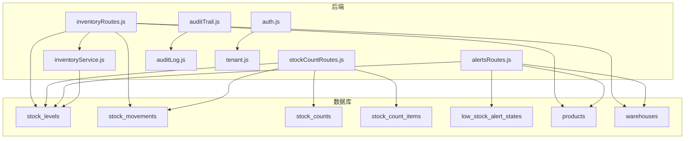
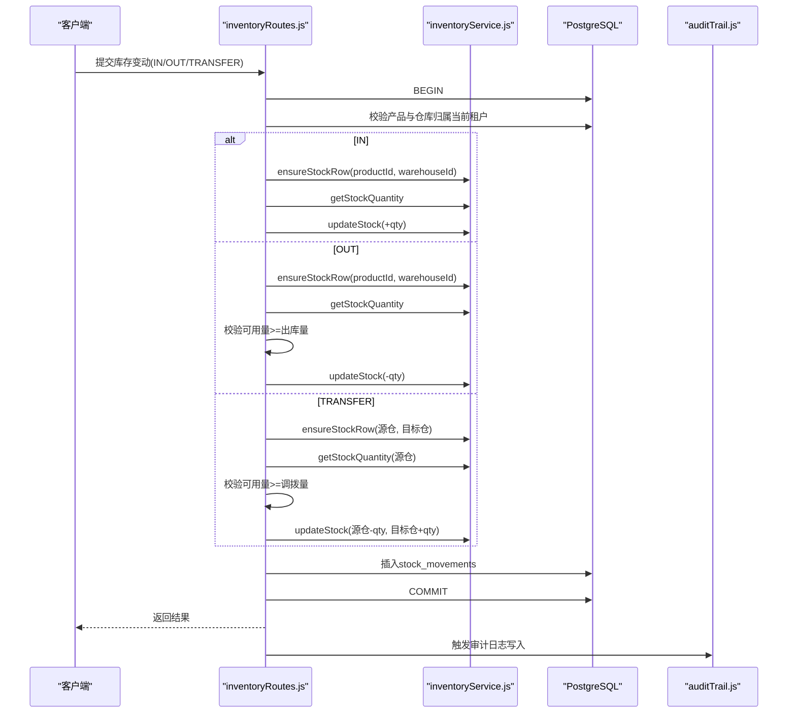
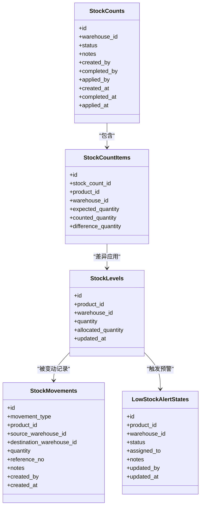
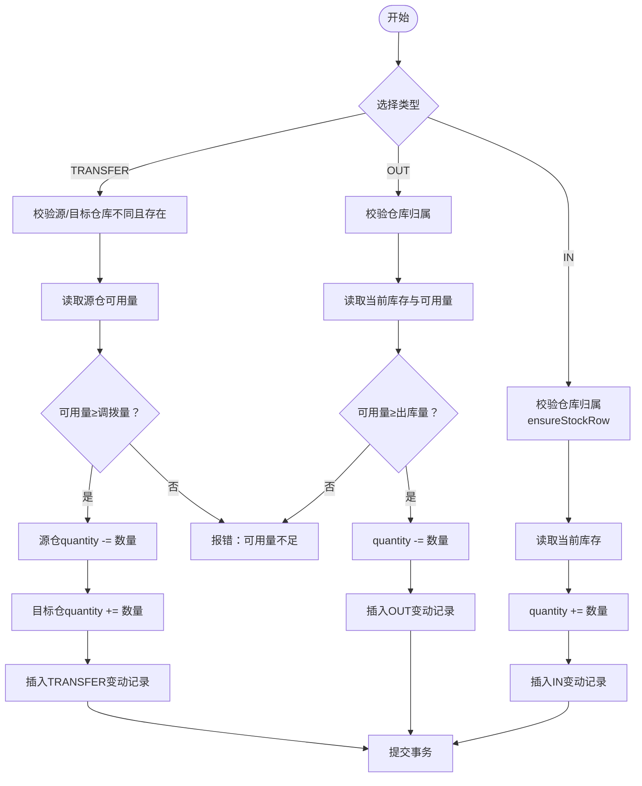

# 库存管理表

<cite>
**本文引用的文件**
- [schema.sql](file://server/database/schema.sql)
- [seed.sql](file://server/database/seed.sql)
- [inventoryService.js](file://server/src/utils/inventoryService.js)
- [inventoryRoutes.js](file://server/src/routes/inventoryRoutes.js)
- [stockCountRoutes.js](file://server/src/routes/stockCountRoutes.js)
- [alertsRoutes.js](file://server/src/routes/alertsRoutes.js)
- [masterRoutes.js](file://server/src/routes/masterRoutes.js)
- [auditTrail.js](file://server/src/middleware/auditTrail.js)
- [auditLog.js](file://server/src/utils/auditLog.js)
- [tenant.js](file://server/src/utils/tenant.js)
- [auth.js](file://server/src/middleware/auth.js)
</cite>

## 目录
1. [简介](#简介)
2. [项目结构](#项目结构)
3. [核心组件](#核心组件)
4. [架构概览](#架构概览)
5. [详细组件分析](#详细组件分析)
6. [依赖关系分析](#依赖关系分析)
7. [性能考量](#性能考量)
8. [故障排查指南](#故障排查指南)
9. [结论](#结论)
10. [附录](#附录)

## 简介
本文件面向库存管理人员与系统管理员，系统性梳理库存管理相关的核心数据表与业务流程，包括：
- 库存水平表(stock_levels)：记录每个产品在各仓库的库存数量与已分配数量
- 库存变动表(stock_movements)：记录所有出入库与调拨的明细
- 库存盘点表(stock_counts)与盘点项表(stock_count_items)：支持盘点计划、执行与差异应用
- 库存计算逻辑、增减规则与事务处理
- 库存分配、可用量计算与锁定机制
- 变动类型定义(IN/OUT/TRANSFER)与业务场景
- 库存预警机制、安全库存设置与自动补货触发条件
- 库存准确性保证、盘点流程与差异处理
- 库存历史追踪、成本核算与财务影响分析
- 多租户隔离与审计日志

## 项目结构
后端采用 Express + PostgreSQL，库存相关数据模型集中于数据库 schema，业务逻辑通过路由层封装，库存服务工具统一处理库存增减与查询。

图表来源
- [schema.sql:125-273](file://server/database/schema.sql#L125-L273)
- [inventoryRoutes.js:1-536](file://server/src/routes/inventoryRoutes.js#L1-L536)
- [stockCountRoutes.js:1-458](file://server/src/routes/stockCountRoutes.js#L1-L458)
- [alertsRoutes.js:1-311](file://server/src/routes/alertsRoutes.js#L1-L311)
- [inventoryService.js:1-46](file://server/src/utils/inventoryService.js#L1-L46)
- [auditTrail.js:1-86](file://server/src/middleware/auditTrail.js#L1-L86)
- [auditLog.js:1-40](file://server/src/utils/auditLog.js#L1-L40)
- [tenant.js:1-42](file://server/src/utils/tenant.js#L1-L42)
- [auth.js:40-86](file://server/src/middleware/auth.js#L40-L86)

章节来源
- [schema.sql:125-273](file://server/database/schema.sql#L125-L273)
- [inventoryRoutes.js:1-536](file://server/src/routes/inventoryRoutes.js#L1-L536)
- [stockCountRoutes.js:1-458](file://server/src/routes/stockCountRoutes.js#L1-L458)
- [alertsRoutes.js:1-311](file://server/src/routes/alertsRoutes.js#L1-L311)
- [inventoryService.js:1-46](file://server/src/utils/inventoryService.js#L1-L46)
- [auditTrail.js:1-86](file://server/src/middleware/auditTrail.js#L1-L86)
- [auditLog.js:1-40](file://server/src/utils/auditLog.js#L1-L40)
- [tenant.js:1-42](file://server/src/utils/tenant.js#L1-L42)
- [auth.js:40-86](file://server/src/middleware/auth.js#L40-L86)

## 核心组件
- stock_levels：按“产品+仓库”维度存储库存数量与已分配数量，确保可用量=库存-已分配且非负
- stock_movements：统一记录库存变动，含类型(IN/OUT/TRANSFER)、数量、来源/去向仓库、参考单号、备注等
- stock_counts 与 stock_count_items：支持盘点计划创建、录入实盘、完成与应用，差异自动转为IN/OUT变动
- low_stock_alert_states：低库存预警状态与分配，结合reorder_level进行触发
- 审计日志与多租户隔离：所有写操作均记录审计日志，所有查询/写入均附加tenant_id过滤

章节来源
- [schema.sql:125-273](file://server/database/schema.sql#L125-L273)
- [inventoryRoutes.js:237-449](file://server/src/routes/inventoryRoutes.js#L237-L449)
- [stockCountRoutes.js:93-178](file://server/src/routes/stockCountRoutes.js#L93-L178)
- [alertsRoutes.js:15-42](file://server/src/routes/alertsRoutes.js#L15-L42)

## 架构概览
库存模块围绕“事务一致性 + 多租户隔离 + 审计追踪”设计，所有写操作在单个连接内以事务包裹，确保库存增减原子性；读取侧通过JOIN关联多表，提供库存概览、交易流水、低库存预警与盘点流程。

图表来源
- [inventoryRoutes.js:237-449](file://server/src/routes/inventoryRoutes.js#L237-L449)
- [inventoryService.js:1-46](file://server/src/utils/inventoryService.js#L1-L46)
- [auditTrail.js:47-81](file://server/src/middleware/auditTrail.js#L47-L81)

## 详细组件分析

### 数据模型与字段说明

#### stock_levels（库存水平）
- 主键：自增ID
- 联合唯一：(product_id, warehouse_id)
- 字段要点：
  - quantity：库存数量（≥0）
  - allocated_quantity：已分配数量（≥0），通常对应订单占用
  - updated_at：更新时间戳
- 计算规则：
  - 可用量 = MAX(quantity - allocated_quantity, 0)
  - 任何库存调整需保持上述非负约束

章节来源
- [schema.sql:125-133](file://server/database/schema.sql#L125-L133)
- [inventoryRoutes.js:37-52](file://server/src/routes/inventoryRoutes.js#L37-L52)

#### stock_movements（库存变动）
- 主键：自增ID
- 字段要点：
  - movement_type ∈ {'IN','OUT','TRANSFER'}
  - product_id、source_warehouse_id、destination_warehouse_id
  - quantity（>0）
  - reference_no、notes
  - created_by、created_at
  - 扩展字段：supplier_id、unit_cost、purchase_reason（用于采购入库）
- 业务场景：
  - IN：采购入库或其它入库
  - OUT：销售出库或其它出库
  - TRANSFER：仓库间调拨

章节来源
- [schema.sql:237-248](file://server/database/schema.sql#L237-L248)
- [inventoryRoutes.js:237-449](file://server/src/routes/inventoryRoutes.js#L237-L449)

#### stock_counts（库存盘点）
- 主键：自增ID
- 字段要点：
  - warehouse_id：所属仓库
  - status ∈ {'OPEN','COMPLETED','APPLIED'}
  - notes、created_by、completed_by、applied_by
  - created_at、completed_at、applied_at
- 生命周期：
  - CREATE：生成盘点单并批量插入stock_count_items
  - EDIT：录入实盘数量
  - COMPLETE：冻结实盘数据
  - APPLY：将差异应用到stock_levels，并生成IN/OUT变动

章节来源
- [schema.sql:250-261](file://server/database/schema.sql#L250-L261)
- [stockCountRoutes.js:93-178](file://server/src/routes/stockCountRoutes.js#L93-L178)

#### stock_count_items（盘点项）
- 主键：自增ID
- 字段要点：
  - stock_count_id、product_id、warehouse_id
  - expected_quantity：期初库存（来自stock_levels）
  - counted_quantity：实盘数量（可为空，COMPLETE时填充）
  - difference_quantity：差异=实盘-期初
  - notes
- 差异处理：
  - APPLY阶段根据difference_quantity正负生成IN/OUT变动

章节来源
- [schema.sql:263-273](file://server/database/schema.sql#L263-L273)
- [stockCountRoutes.js:347-455](file://server/src/routes/stockCountRoutes.js#L347-L455)

#### low_stock_alert_states（低库存预警）
- 主键：自增ID
- 字段要点：
  - product_id、warehouse_id
  - status ∈ {'OPEN','READ','IGNORED'}
  - assigned_to、notes、updated_by、updated_at
- 触发条件：
  - 当前库存≤reorder_level即触发OPEN状态
  - 可由管理员分配处理人并更新状态

章节来源
- [schema.sql:290-300](file://server/database/schema.sql#L290-L300)
- [alertsRoutes.js:15-42](file://server/src/routes/alertsRoutes.js#L15-L42)

### 库存计算逻辑与可用量
- 可用量 = MAX(stock_levels.quantity - stock_levels.allocated_quantity, 0)
- 出库/调拨前必须校验可用量≥出库量
- 分配模式：
  - reserve：增加allocated_quantity
  - release：减少allocated_quantity
- 事务内保证：同一连接内先读取再更新，避免并发导致的超卖

章节来源
- [inventoryRoutes.js:312-356](file://server/src/routes/inventoryRoutes.js#L312-L356)
- [inventoryRoutes.js:451-533](file://server/src/routes/inventoryRoutes.js#L451-L533)
- [inventoryService.js:14-28](file://server/src/utils/inventoryService.js#L14-L28)

### 库存增减规则与事务处理
- IN：仅允许指定仓库，新增或累加stock_levels.quantity
- OUT：必须指定仓库，校验可用量充足后扣减
- TRANSFER：校验源/目标仓库不同且可用量充足，分别对源仓扣减、目标仓加增
- 事务：所有写操作在单连接内BEGIN/COMMIT，失败则ROLLBACK
- 多租户：所有SQL均附加tenant_id过滤，避免跨租户数据访问

章节来源
- [inventoryRoutes.js:237-449](file://server/src/routes/inventoryRoutes.js#L237-L449)
- [tenant.js:9-14](file://server/src/utils/tenant.js#L9-L14)
- [auth.js:40-58](file://server/src/middleware/auth.js#L40-L58)

### 库存分配、锁定与可用量
- 分配预留：通过allocate接口将allocated_quantity增加，不改变quantity
- 释放：将allocated_quantity减少，恢复可用量
- 锁定语义：在apply阶段对stock_levels使用FOR UPDATE，避免并发修改导致的不一致
- 可用量非负：所有更新均保证quantity与allocated_quantity非负

章节来源
- [inventoryRoutes.js:451-533](file://server/src/routes/inventoryRoutes.js#L451-L533)
- [stockCountRoutes.js:347-455](file://server/src/routes/stockCountRoutes.js#L347-L455)

### 库存变动类型与业务场景
- IN：采购入库、退货入库、调拨转入、盘盈等
- OUT：销售出库、内部领用、调拨转出、盘亏等
- TRANSFER：仓库间调拨
- 参考单据：reference_no用于追踪来源/去向单据编号
- 成本字段：unit_cost、purchase_reason可用于成本核算与财务入账

章节来源
- [schema.sql:237-248](file://server/database/schema.sql#L237-L248)
- [inventoryRoutes.js:276-306](file://server/src/routes/inventoryRoutes.js#L276-L306)

### 库存预警机制、安全库存与自动补货
- 安全库存：由products.reorder_level定义
- 预警触发：当stock_levels.quantity ≤ products.reorder_level时，生成OPEN状态的low_stock_alert_states
- 管理员处理：可将状态更新为READ/IGNORED，或分配处理人
- 自动补货：系统未内置自动补货触发器，但可通过外部工作流或定时任务基于reorder_level与历史消耗推导补货建议

章节来源
- [alertsRoutes.js:73-84](file://server/src/routes/alertsRoutes.js#L73-L84)
- [alertsRoutes.js:207-251](file://server/src/routes/alertsRoutes.js#L207-L251)

### 库存准确性保证、盘点流程与差异处理
- 盘点流程：
  1) CREATE：生成stock_counts并批量写入stock_count_items（expected_quantity=期初）
  2) EDIT：录入counted_quantity（可为空，COMPLETE时自动填充）
  3) COMPLETE：冻结counted_quantity并计算difference_quantity
  4) APPLY：将差异应用到stock_levels，并生成IN/OUT变动
- 差异处理：
  - 正差：生成IN变动
  - 负差：生成OUT变动
  - 0差：不生成变动
- 并发控制：APPLY阶段对stock_levels加锁，逐条更新并插入变动

章节来源
- [stockCountRoutes.js:93-178](file://server/src/routes/stockCountRoutes.js#L93-L178)
- [stockCountRoutes.js:290-345](file://server/src/routes/stockCountRoutes.js#L290-L345)
- [stockCountRoutes.js:347-455](file://server/src/routes/stockCountRoutes.js#L347-L455)

### 库存历史追踪、成本核算与财务影响
- 历史追踪：stock_movements记录每次变动的时间、数量、来源/去向、参考单号与操作人
- 成本核算：支持unit_cost字段，可用于计算变动金额与库存总成本
- 财务影响：IN变动可作为采购入账依据；OUT变动可作为销售出账依据；差异IN/OUT用于库存调整入账
- 成本历史：通过product_cost_price_histories记录成本变更历史，保留最近5条

章节来源
- [schema.sql:237-248](file://server/database/schema.sql#L237-L248)
- [schema.sql:367-376](file://server/database/schema.sql#L367-L376)
- [masterRoutes.js:235-283](file://server/src/routes/masterRoutes.js#L235-L283)

### 多租户隔离与审计日志
- 多租户：所有路由在执行前通过authenticateToken注入tenant_id，查询/写入均附加tenant_id过滤
- 审计日志：auditTrail中间件在响应完成后写入audit_logs，记录操作者、实体、方法、路径与元数据

章节来源
- [tenant.js:9-14](file://server/src/utils/tenant.js#L9-L14)
- [auth.js:40-58](file://server/src/middleware/auth.js#L40-L58)
- [auditTrail.js:47-81](file://server/src/middleware/auditTrail.js#L47-L81)
- [auditLog.js:1-40](file://server/src/utils/auditLog.js#L1-L40)

## 依赖关系分析

图表来源
- [schema.sql:125-300](file://server/database/schema.sql#L125-L300)

章节来源
- [schema.sql:125-300](file://server/database/schema.sql#L125-L300)

## 性能考量
- 查询优化：
  - stock_levels按product_id、warehouse_id建立索引，支持快速定位
  - stock_movements按product_id与created_at倒序建立索引，支持交易流水分页
  - stock_counts按warehouse_id与status建立索引，支持盘点状态筛选
- 分页与搜索：
  - 库存总览与交易流水均支持分页与多字段模糊搜索，避免一次性加载大量数据
- 并发控制：
  - 盘点apply阶段对stock_levels使用FOR UPDATE，避免竞态
  - allocate阶段通过事务与校验避免超分配

章节来源
- [schema.sql:415-447](file://server/database/schema.sql#L415-L447)
- [inventoryRoutes.js:18-156](file://server/src/routes/inventoryRoutes.js#L18-L156)
- [stockCountRoutes.js:347-455](file://server/src/routes/stockCountRoutes.js#L347-L455)

## 故障排查指南
- 常见错误与原因
  - “仓库不在当前公司”：产品或仓库不属于当前租户，检查authenticateToken是否正确注入tenant_id
  - “可用量不足”：出库或调拨量超过可用量，检查allocated_quantity与quantity
  - “分配量不能为负/超过在手量”：allocate模式为release时导致allocated_quantity小于0，或超过quantity
  - “仅OPEN/COMPLETED状态可编辑/应用”：盘点状态流转不符合流程
- 审计与追溯
  - 通过audit_logs查看操作者、方法、路径与请求体
  - 通过stock_movements查看具体变动详情与参考单号
- 快速定位
  - 使用交易流水接口按movement_type与reference_no检索
  - 使用库存总览接口按仓库/品类筛选与低库存标记

章节来源
- [inventoryRoutes.js:237-449](file://server/src/routes/inventoryRoutes.js#L237-L449)
- [stockCountRoutes.js:290-345](file://server/src/routes/stockCountRoutes.js#L290-L345)
- [auditTrail.js:47-81](file://server/src/middleware/auditTrail.js#L47-L81)
- [auditLog.js:1-40](file://server/src/utils/auditLog.js#L1-L40)

## 结论
该库存系统以stock_levels为核心，通过stock_movements完整记录每笔变动，配合stock_counts实现盘点闭环；借助low_stock_alert_states与reorder_level构建预警机制；通过多租户隔离与审计日志保障数据安全与可追溯。系统在事务一致性、并发控制与性能优化方面具备良好基础，建议后续补充自动补货触发策略与成本波动通知策略以进一步完善。

## 附录

### 关键流程图：库存变动（IN/OUT/TRANSFER）

图表来源
- [inventoryRoutes.js:237-449](file://server/src/routes/inventoryRoutes.js#L237-L449)
- [inventoryService.js:14-39](file://server/src/utils/inventoryService.js#L14-L39)