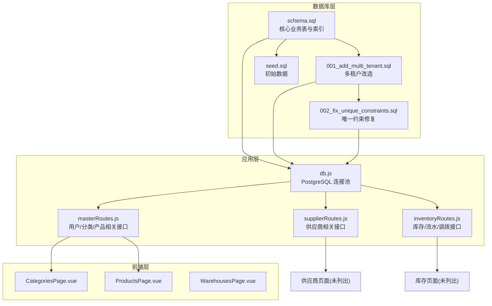
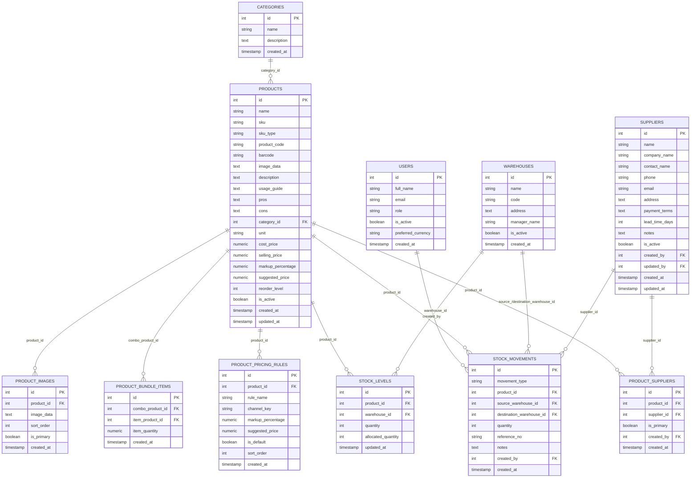
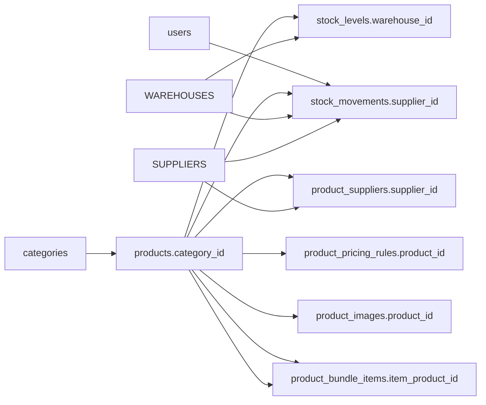

# 核心业务表

<cite>
**本文引用的文件**
- [schema.sql](file://server/database/schema.sql)
- [seed.sql](file://server/database/seed.sql)
- [001_add_multi_tenant.sql](file://server/database/migrations/001_add_multi_tenant.sql)
- [002_fix_unique_constraints.sql](file://server/database/migrations/002_fix_unique_constraints.sql)
- [masterRoutes.js](file://server/src/routes/masterRoutes.js)
- [supplierRoutes.js](file://server/src/routes/supplierRoutes.js)
- [inventoryRoutes.js](file://server/src/routes/inventoryRoutes.js)
- [db.js](file://server/src/config/db.js)
- [CategoriesPage.vue](file://web/src/pages/CategoriesPage.vue)
- [ProductsPage.vue](file://web/src/pages/ProductsPage.vue)
- [WarehousesPage.vue](file://web/src/pages/WarehousesPage.vue)
</cite>

## 目录
1. [简介](#简介)
2. [项目结构](#项目结构)
3. [核心组件](#核心组件)
4. [架构总览](#架构总览)
5. [详细组件分析](#详细组件分析)
6. [依赖分析](#依赖分析)
7. [性能考量](#性能考量)
8. [故障排查指南](#故障排查指南)
9. [结论](#结论)
10. [附录](#附录)

## 简介
本文件聚焦于库存系统的核心业务表，包括用户表(users)、产品表(products)、仓库表(warehouses)、分类表(categories)与供应商表(suppliers)。文档从表结构、字段定义、约束与业务含义出发，解释主外键关系与参照完整性保障；结合应用层路由与前端页面的使用方式，给出典型查询模式、性能优化建议、表结构演进历史与多租户改造的版本兼容策略，帮助数据库设计者与应用开发者建立一致的数据模型认知。

## 项目结构
- 数据库层：通过初始化脚本(server/database/schema.sql)定义核心业务表及索引；迁移脚本(server/database/migrations/)实现多租户改造与唯一约束调整；种子数据(server/database/seed.sql)提供初始演示数据。
- 应用层：Express 路由(server/src/routes/)负责对核心业务表的增删改查与复杂业务流程（如库存流水、价格规则、供应商关联等）。
- 前端层：Vue 页面(web/src/pages/)展示与操作核心业务数据，体现字段与查询模式的实际使用。

图表来源
- [schema.sql:1-447](file://server/database/schema.sql#L1-L447)
- [001_add_multi_tenant.sql:1-100](file://server/database/migrations/001_add_multi_tenant.sql#L1-L100)
- [002_fix_unique_constraints.sql:1-44](file://server/database/migrations/002_fix_unique_constraints.sql#L1-L44)
- [seed.sql:1-114](file://server/database/seed.sql#L1-L114)
- [db.js:1-29](file://server/src/config/db.js#L1-L29)
- [masterRoutes.js:1-800](file://server/src/routes/masterRoutes.js#L1-L800)
- [supplierRoutes.js:1-383](file://server/src/routes/supplierRoutes.js#L1-L383)
- [inventoryRoutes.js:1-536](file://server/src/routes/inventoryRoutes.js#L1-L536)
- [CategoriesPage.vue:1-211](file://web/src/pages/CategoriesPage.vue#L1-L211)
- [ProductsPage.vue:1-1005](file://web/src/pages/ProductsPage.vue#L1-L1005)
- [WarehousesPage.vue:1-260](file://web/src/pages/WarehousesPage.vue#L1-L260)

章节来源
- [schema.sql:1-447](file://server/database/schema.sql#L1-L447)
- [001_add_multi_tenant.sql:1-100](file://server/database/migrations/001_add_multi_tenant.sql#L1-L100)
- [002_fix_unique_constraints.sql:1-44](file://server/database/migrations/002_fix_unique_constraints.sql#L1-L44)
- [seed.sql:1-114](file://server/database/seed.sql#L1-L114)
- [db.js:1-29](file://server/src/config/db.js#L1-L29)

## 核心组件
本节按业务域梳理核心表的结构要点与约束，强调主外键关系、唯一性与业务规则。

- users（用户）
  - 主键：id（自增）
  - 关键字段：full_name、email（唯一）、role（枚举：ADMIN、MANAGER、STAFF）、is_active、preferred_currency、created_at
  - 业务含义：系统用户身份与权限载体，支持多租户隔离
  - 约束与规则：角色枚举校验；邮箱全局唯一（多租户后改为租户内唯一）

- categories（分类）
  - 主键：id（自增）
  - 关键字段：name（唯一）、description、created_at
  - 业务含义：产品分类维度
  - 约束与规则：名称租户内唯一

- warehouses（仓库）
  - 主键：id（自增）
  - 关键字段：name、code（唯一）、address、manager_name、is_active、created_at
  - 业务含义：物理存储位置，支持多仓库管理
  - 约束与规则：仓库编码租户内唯一

- products（产品）
  - 主键：id（自增）
  - 关键字段：name、sku（唯一）、sku_type（默认 SINGLE 或 COMBO）、product_code（唯一，允许空）、barcode（唯一，允许空）、image_data、description、usage_guide、pros、cons、category_id（外键到categories）、unit（默认 pcs）、cost_price、selling_price、markup_percentage、suggested_price、reorder_level、is_active、created_at、updated_at
  - 业务含义：核心商品实体，支持组合装（COMBO）与独立单品（SINGLE）
  - 约束与规则：多字段租户内唯一；价格字段数值精度控制；组合装通过 product_bundle_items 关联子项

- suppliers（供应商）
  - 主键：id（自增）
  - 关键字段：name、company_name、contact_name、phone、email、address、payment_terms、lead_time_days（非负）、notes、is_active、created_by、updated_by、created_at、updated_at
  - 业务含义：供应链主体，支持主供应商绑定与支付记录
  - 约束与规则：lead_time_days 非负；多字段租户内唯一

章节来源
- [schema.sql:2-318](file://server/database/schema.sql#L2-L318)

## 架构总览
核心业务表围绕“产品-仓库-用户-分类-供应商”构建，形成以下关键关系：
- products.category_id → categories.id（一对多）
- stock_levels(product_id, warehouse_id) → products.id, warehouses.id（联合唯一）
- stock_movements(product_id, source/destination_warehouse_id, supplier_id) → products, warehouses, suppliers（可空外键）
- product_suppliers(product_id, supplier_id) → products, suppliers（联合唯一）
- product_pricing_rules(product_id) → products（一对多）
- product_images(product_id) → products（一对多）
- product_bundle_items(combo_product_id, item_product_id) → products（联合唯一）

图表来源
- [schema.sql:2-318](file://server/database/schema.sql#L2-L318)

## 详细组件分析

### 用户表 users
- 字段与约束
  - id：自增主键
  - email：唯一（多租户后改为租户内唯一，见迁移）
  - role：枚举校验（ADMIN、MANAGER、STAFF）
  - is_active：布尔开关
  - preferred_currency：默认货币
  - created_at：默认当前时间戳
- 业务含义
  - 系统使用者，承载认证与授权基础
- 典型使用场景
  - 用户列表、创建/更新/删除用户、审计日志记录
- 查询模式
  - 搜索：full_name/email/role 模糊匹配
  - 分页：按创建时间倒序
- 性能优化
  - 建议对 tenant_id、email 建立复合唯一索引（多租户）
  - 对 role、is_active 建立过滤索引
- 版本兼容
  - 多租户改造后，需在所有写入路径显式传入 tenant_id

章节来源
- [schema.sql:2-11](file://server/database/schema.sql#L2-L11)
- [001_add_multi_tenant.sql:32-68](file://server/database/migrations/001_add_multi_tenant.sql#L32-L68)
- [masterRoutes.js:498-673](file://server/src/routes/masterRoutes.js#L498-L673)

### 产品表 products
- 字段与约束
  - 主键：id
  - 唯一：sku（租户内）、product_code（租户内，允许空）、barcode（租户内，允许空）
  - 外键：category_id → categories(id)（ON DELETE SET NULL）
  - 数值：cost_price、selling_price、markup_percentage、suggested_price（NUMERIC 精度）
  - 其他：unit、reorder_level、is_active、created_at/updated_at
- 业务含义
  - 商品实体，支持组合装（COMBO）与独立单品（SINGLE）
- 典型使用场景
  - 商品列表、详情、图片与定价规则加载、组合装子项管理
- 查询模式
  - 搜索：name/sku/barcode/category/warehouse
  - 过滤：categoryId、lowStockOnly（可用库存≤reorder_level）
  - 分页：按更新时间倒序
- 性能优化
  - 建议对 category_id、sku、product_code、barcode 建立索引
  - 对组合装查询使用 product_bundle_items 的组合索引
- 版本兼容
  - 多租户改造后，所有相关表均增加 tenant_id 并调整唯一约束

章节来源
- [schema.sql:32-54](file://server/database/schema.sql#L32-L54)
- [masterRoutes.js:497-795](file://server/src/routes/masterRoutes.js#L497-L795)
- [ProductsPage.vue:208-242](file://web/src/pages/ProductsPage.vue#L208-L242)

### 仓库表 warehouses
- 字段与约束
  - 主键：id
  - 唯一：code（租户内）
  - 其他：name、address、manager_name、is_active、created_at
- 业务含义
  - 存储地点，库存与调拨的物理边界
- 典型使用场景
  - 仓库列表、编辑、启用/停用
- 查询模式
  - 搜索：name/code/address/manager_name
  - 过滤：is_active
  - 分页：按更新时间倒序
- 性能优化
  - 建议对 code、is_active 建立索引
- 版本兼容
  - 多租户改造后，唯一约束改为租户内唯一

章节来源
- [schema.sql:22-30](file://server/database/schema.sql#L22-L30)
- [WarehousesPage.vue:28-98](file://web/src/pages/WarehousesPage.vue#L28-L98)

### 分类表 categories
- 字段与约束
  - 主键：id
  - 唯一：name（租户内）
  - 其他：description、created_at
- 业务含义
  - 商品分类维度
- 典型使用场景
  - 分类列表、创建/更新/删除
- 查询模式
  - 搜索：name/description
  - 分页：按名称排序
- 性能优化
  - 建议对 name 建立索引
- 版本兼容
  - 多租户改造后，唯一约束改为租户内唯一

章节来源
- [schema.sql:15-20](file://server/database/schema.sql#L15-L20)
- [masterRoutes.js:676-795](file://server/src/routes/masterRoutes.js#L676-L795)

### 供应商表 suppliers
- 字段与约束
  - 主键：id
  - 其他：name、company_name、contact_name、phone、email、address、payment_terms、lead_time_days（≥0）、notes、is_active、created_by/updated_by、created_at/updated_at
- 业务含义
  - 供应链主体，支持主供应商绑定与支付记录
- 典型使用场景
  - 供应商列表、详情（关联产品、最近采购）、创建/更新/停用/删除
- 查询模式
  - 搜索：name/company_name/contact_name/phone/email
  - 过滤：is_active
  - 排序：name/created_at/updated_at/lead_time_days
- 性能优化
  - 建议对 name、is_active 建立索引
- 版本兼容
  - 多租户改造后，唯一约束改为租户内唯一

章节来源
- [schema.sql:302-318](file://server/database/schema.sql#L302-L318)
- [supplierRoutes.js:23-96](file://server/src/routes/supplierRoutes.js#L23-L96)

## 依赖分析
- 外键依赖链
  - products.category_id → categories(id)
  - stock_levels(product_id, warehouse_id) → products(id), warehouses(id)
  - stock_movements(product_id, source_warehouse_id, destination_warehouse_id, supplier_id) → products, warehouses, suppliers
  - product_suppliers(product_id, supplier_id) → products, suppliers
  - product_pricing_rules(product_id) → products
  - product_images(product_id) → products
  - product_bundle_items(combo_product_id, item_product_id) → products
- 索引与查询
  - 多处查询基于 tenant_id、category_id、warehouse_id、product_id 等字段，迁移脚本已补充相应索引
- 安全与审计
  - audit_logs 记录用户行为，包含 user_id、user_email、user_role、action、entity_type、method、path、metadata、created_at

图表来源
- [schema.sql:2-318](file://server/database/schema.sql#L2-L318)

章节来源
- [schema.sql:2-318](file://server/database/schema.sql#L2-L318)

## 性能考量
- 索引策略
  - 已有索引覆盖常见查询：products(category_id)、stock_levels(product_id/warehouse_id)、stock_movements(created_at)、audit_logs(user_id/created_at)、suppliers(name/is_active)、product_suppliers(is_primary) 等
  - 多租户改造后，建议对 tenant_id 建立过滤索引，提升跨表 JOIN 性能
- 查询模式优化
  - 列表页采用分页与模糊搜索，避免一次性全量加载
  - 使用 EXPLAIN 分析慢查询，必要时为 tenant_id 添加复合索引
- 写入一致性
  - 库存流水涉及事务（BEGIN/COMMIT/ROLLBACK），确保库存与流水的一致性
- 数值精度
  - NUMERIC(12,2)/NUMERIC(12,3) 等用于价格与数量，避免浮点误差

章节来源
- [schema.sql:410-446](file://server/database/schema.sql#L410-L446)
- [inventoryRoutes.js:237-437](file://server/src/routes/inventoryRoutes.js#L237-L437)

## 故障排查指南
- 常见错误与定位
  - 唯一约束冲突：检查租户内唯一约束是否被正确应用（多租户改造后）
  - 外键缺失：确认关联对象（产品/仓库/供应商）是否属于当前租户
  - 库存不足：stock_movements OUT/TRANSFER 前检查可用库存（on_hand - allocated）
  - 成本字段不可见：前端成本保护机制需要解锁 passcode
- 审计与追踪
  - 审计日志包含 action、entity_type、method、path、metadata 等，便于回溯问题
- 数据一致性
  - 批量操作（如导入/迁移）应使用事务包裹，失败时回滚

章节来源
- [schema.sql:275-288](file://server/database/schema.sql#L275-L288)
- [inventoryRoutes.js:237-437](file://server/src/routes/inventoryRoutes.js#L237-L437)
- [ProductsPage.vue:179-206](file://web/src/pages/ProductsPage.vue#L179-L206)

## 结论
该核心业务表体系以产品为中心，围绕分类、仓库、供应商与用户构建完整的库存与供应链数据模型。多租户改造提升了数据隔离能力，迁移脚本对唯一约束与索引进行了系统性调整。配合应用层路由与前端页面的查询模式，形成了清晰的读写路径与性能优化策略。建议在生产环境中持续关注 tenant_id 的强制传入、索引命中率与事务写入的吞吐表现。

## 附录
- 表结构演进与版本兼容
  - 初始版本：users、categories、warehouses、products、suppliers 等核心表
  - 多租户改造：为所有业务表增加 tenant_id，调整唯一约束为租户内唯一，并补充相关索引
  - 唯一约束修复：针对 system_settings、marketplace_connections、marketplace_orders 等表进行唯一约束加固
- 字段命名规范与数据类型选择
  - 字段名采用小写下划线风格，便于 SQL 书写与团队协作
  - 时间戳统一使用 timestamp，默认 CURRENT_TIMESTAMP
  - 价格与数量使用 NUMERIC，保证精度
  - 枚举字段使用 CHECK 约束限制取值范围
- 典型使用场景与查询模式
  - 用户管理：分页+搜索+角色过滤
  - 商品管理：分页+搜索+分类过滤+低库存筛选
  - 仓库管理：分页+搜索+启用状态过滤
  - 供应商管理：分页+搜索+状态过滤+排序
  - 库存管理：库存总览+交易流水+调拨/出库/入库

章节来源
- [001_add_multi_tenant.sql:1-100](file://server/database/migrations/001_add_multi_tenant.sql#L1-L100)
- [002_fix_unique_constraints.sql:1-44](file://server/database/migrations/002_fix_unique_constraints.sql#L1-L44)
- [masterRoutes.js:497-795](file://server/src/routes/masterRoutes.js#L497-L795)
- [supplierRoutes.js:23-96](file://server/src/routes/supplierRoutes.js#L23-L96)
- [inventoryRoutes.js:18-156](file://server/src/routes/inventoryRoutes.js#L18-L156)