# 电商集成表

<cite>
**本文引用的文件**
- [schema.sql](file://server/database/schema.sql)
- [marketplaceRoutes.js](file://server/src/routes/marketplaceRoutes.js)
- [marketplaceSyncService.js](file://server/src/services/marketplaceSyncService.js)
- [orderSyncService.js](file://server/src/services/orderSyncService.js)
- [shippingRoutes.js](file://server/src/routes/shippingRoutes.js)
- [orderRoutes.js](file://server/src/routes/orderRoutes.js)
- [auth.js](file://server/src/middleware/auth.js)
- [auditLog.js](file://server/src/utils/auditLog.js)
- [db.js](file://server/src/config/db.js)
- [package.json](file://server/package.json)
- [MarketplaceCenterPage.vue](file://web/src/pages/MarketplaceCenterPage.vue)
- [MarketplaceOAuthCallbackPage.vue](file://web/src/pages/MarketplaceOAuthCallbackPage.vue)
- [POSTMAN_BACKEND_GUIDE.md](file://POSTMAN_BACKEND_GUIDE.md)
- [seed.sql](file://server/database/seed.sql)
</cite>

## 目录
1. [简介](#简介)
2. [项目结构](#项目结构)
3. [核心组件](#核心组件)
4. [架构总览](#架构总览)
5. [详细组件分析](#详细组件分析)
6. [依赖关系分析](#依赖关系分析)
7. [性能考量](#性能考量)
8. [故障排除指南](#故障排除指南)
9. [结论](#结论)
10. [附录](#附录)

## 简介
本文件面向电商运营人员与系统集成开发者，提供电商集成相关数据表的完整参考与实现解析。重点覆盖以下表结构与流程：
- 市场平台连接表 marketplace_connections：存储各电商平台（Shopee/Lazada/TikTok）的连接信息与令牌元数据
- 市场平台同步日志表 marketplace_sync_logs：记录库存与订单同步结果
- 市场平台库存快照表 marketplace_inventory_snapshots：按渠道聚合的库存快照
- 市场平台订单表 marketplace_orders 与订单明细表 marketplace_order_items：统一拉取并落库的外部订单
- 物流发货表 shipping_shipments：订单发货状态与物流信息

同时，文档阐述电商API集成架构、OAuth认证流程与令牌管理机制，解释商品同步策略、订单同步处理与物流状态追踪；说明不同电商平台API差异处理、错误日志记录与重试机制；给出库存同步一致性保证、价格同步规则与促销活动处理建议；并提供最佳实践、性能监控与故障排除指南。

## 项目结构
后端采用 Express + PostgreSQL 架构，电商集成相关逻辑集中在路由层与服务层：
- 路由层：marketplaceRoutes、orderRoutes、shippingRoutes 提供 REST 接口
- 服务层：marketplaceSyncService、orderSyncService 实现同步与归一化逻辑
- 数据访问：db.js 封装 PG 连接池
- 安全中间件：auth.js 提供 JWT 校验与角色授权
- 审计日志：auditLog.js 统一写入审计日志

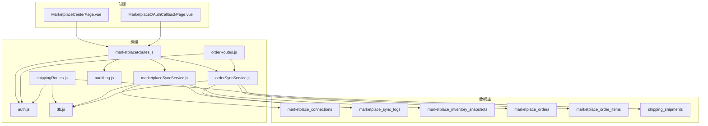

图表来源
- [marketplaceRoutes.js:1-685](file://server/src/routes/marketplaceRoutes.js#L1-L685)
- [orderRoutes.js:1-124](file://server/src/routes/orderRoutes.js#L1-L124)
- [shippingRoutes.js:1-169](file://server/src/routes/shippingRoutes.js#L1-L169)
- [marketplaceSyncService.js:1-159](file://server/src/services/marketplaceSyncService.js#L1-L159)
- [orderSyncService.js:1-128](file://server/src/services/orderSyncService.js#L1-L128)
- [auth.js:1-87](file://server/src/middleware/auth.js#L1-L87)
- [auditLog.js:1-40](file://server/src/utils/auditLog.js#L1-L40)
- [db.js:1-29](file://server/src/config/db.js#L1-L29)
- [schema.sql:137-235](file://server/database/schema.sql#L137-L235)

章节来源
- [marketplaceRoutes.js:1-685](file://server/src/routes/marketplaceRoutes.js#L1-L685)
- [orderRoutes.js:1-124](file://server/src/routes/orderRoutes.js#L1-L124)
- [shippingRoutes.js:1-169](file://server/src/routes/shippingRoutes.js#L1-L169)
- [marketplaceSyncService.js:1-159](file://server/src/services/marketplaceSyncService.js#L1-L159)
- [orderSyncService.js:1-128](file://server/src/services/orderSyncService.js#L1-L128)
- [auth.js:1-87](file://server/src/middleware/auth.js#L1-L87)
- [auditLog.js:1-40](file://server/src/utils/auditLog.js#L1-L40)
- [db.js:1-29](file://server/src/config/db.js#L1-L29)
- [schema.sql:137-235](file://server/database/schema.sql#L137-L235)

## 核心组件
- 市场平台连接表 marketplace_connections
  - 存储渠道标识、店铺名、API基础URL、访问令牌、刷新令牌、元数据JSON、启用状态等
  - 支持按租户隔离与按渠道唯一约束
- 市场平台同步日志表 marketplace_sync_logs
  - 记录每次同步的渠道、类型（inventory/orders）、状态（SUCCESS/FAILED）、记录数、原始响应、操作人
- 市场平台库存快照表 marketplace_inventory_snapshots
  - 按渠道记录外部SKU对应的本地产品与仓库映射、在库/占用/可用数量、原始载荷
- 市场平台订单表 marketplace_orders 与订单明细表 marketplace_order_items
  - 统一拉取并去重入库，支持按外部订单号唯一
- 物流发货表 shipping_shipments
  - 记录发货状态、承运商、服务等级、运单号、面单URL、时间戳与更新人

章节来源
- [schema.sql:137-235](file://server/database/schema.sql#L137-L235)

## 架构总览
电商集成采用“前端页面 + 后端路由 + 服务层 + 数据库”的分层架构。前端通过 Marketplaces 页面与 OAuth 回调页面发起连接配置、同步任务与状态查询；后端路由负责鉴权与限流，服务层负责与第三方平台交互与数据归一化，数据库持久化所有集成数据与审计日志。

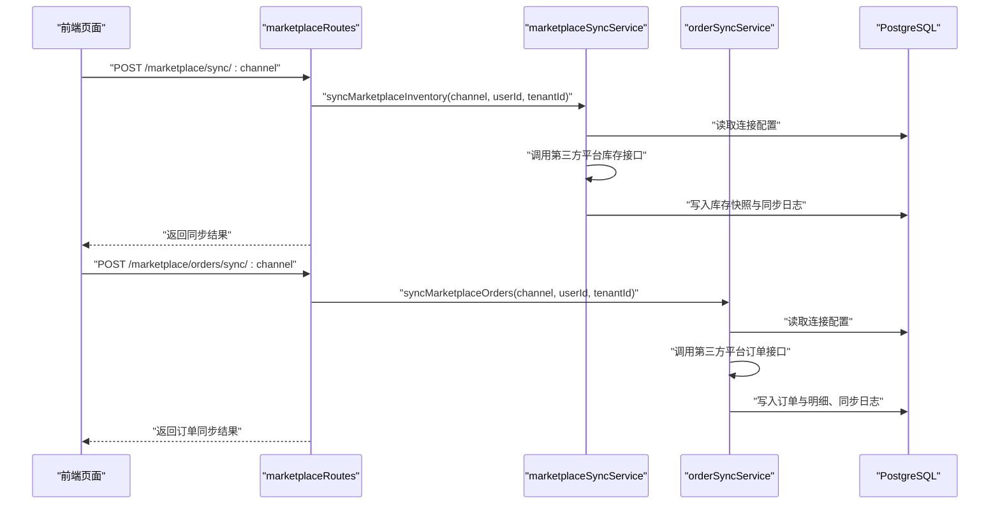

图表来源
- [marketplaceRoutes.js:153-213](file://server/src/routes/marketplaceRoutes.js#L153-L213)
- [marketplaceSyncService.js:113-153](file://server/src/services/marketplaceSyncService.js#L113-L153)
- [orderSyncService.js:19-123](file://server/src/services/orderSyncService.js#L19-L123)

## 详细组件分析

### 市场平台连接表 marketplace_connections
- 设计要点
  - 唯一索引：(tenant_id, channel)
  - 元数据字段：JSONB 存放平台特定配置（如授权路径、最近状态等）
  - 令牌字段：access_token、refresh_token 支持多平台
- 使用场景
  - 作为同步服务的配置源，优先使用数据库中的连接配置，其次回退到环境变量
  - OAuth 回调后更新元数据与激活状态

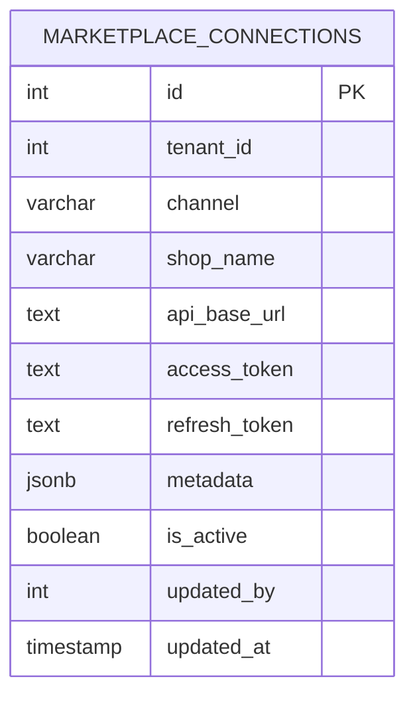

图表来源
- [schema.sql:161-172](file://server/database/schema.sql#L161-L172)

章节来源
- [schema.sql:161-172](file://server/database/schema.sql#L161-L172)
- [marketplaceSyncService.js:19-38](file://server/src/services/marketplaceSyncService.js#L19-L38)
- [marketplaceRoutes.js:78-151](file://server/src/routes/marketplaceRoutes.js#L78-L151)

### 市场平台同步日志表 marketplace_sync_logs
- 设计要点
  - 记录同步类型（inventory/orders）、状态、记录数、原始响应
  - 关联操作人与租户隔离
- 使用场景
  - 同步成功/失败后写入日志，便于监控与回溯

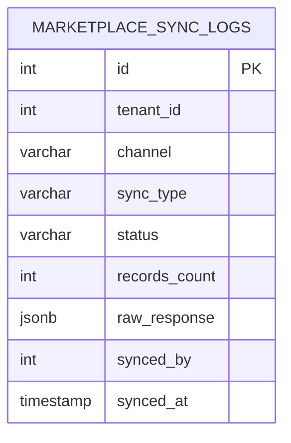

图表来源
- [schema.sql:137-146](file://server/database/schema.sql#L137-L146)
- [marketplaceRoutes.js:183-211](file://server/src/routes/marketplaceRoutes.js#L183-L211)
- [orderSyncService.js:111-117](file://server/src/services/orderSyncService.js#L111-L117)

章节来源
- [schema.sql:137-146](file://server/database/schema.sql#L137-L146)
- [marketplaceRoutes.js:183-211](file://server/src/routes/marketplaceRoutes.js#L183-L211)
- [orderSyncService.js:111-117](file://server/src/services/orderSyncService.js#L111-L117)

### 市场平台库存快照表 marketplace_inventory_snapshots
- 设计要点
  - 每次同步前清空该渠道的快照，确保“全量替换”
  - 外部SKU映射到本地产品与仓库，计算在库/占用/可用
  - 原始载荷保留以便问题排查
- 使用场景
  - 生成库存报表、对账与异常定位

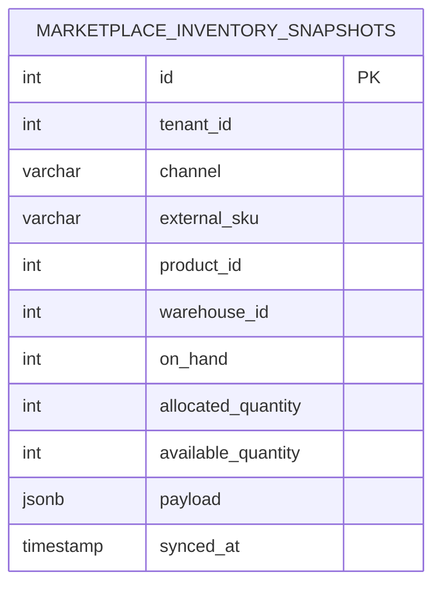

图表来源
- [schema.sql:148-159](file://server/database/schema.sql#L148-L159)
- [marketplaceSyncService.js:61-111](file://server/src/services/marketplaceSyncService.js#L61-L111)

章节来源
- [schema.sql:148-159](file://server/database/schema.sql#L148-L159)
- [marketplaceSyncService.js:61-111](file://server/src/services/marketplaceSyncService.js#L61-L111)

### 市场平台订单表与订单明细表 marketplace_orders 与 marketplace_order_items
- 设计要点
  - 订单表按 (tenant_id, channel, external_order_id) 唯一
  - 订单明细表按订单清理后重建，确保与外部最新状态一致
  - 明细中可关联本地产品ID（若SKU匹配）
- 使用场景
  - 订单列表查询、详情查看、发货状态更新

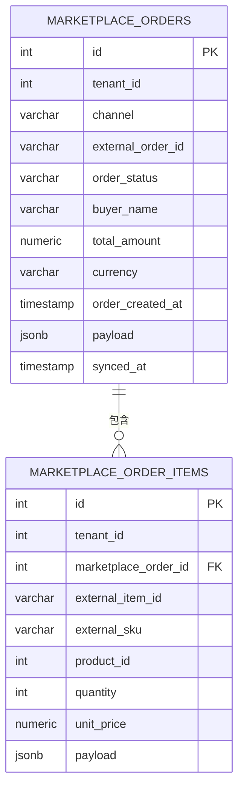

图表来源
- [schema.sql:196-220](file://server/database/schema.sql#L196-L220)
- [orderSyncService.js:42-109](file://server/src/services/orderSyncService.js#L42-L109)

章节来源
- [schema.sql:196-220](file://server/database/schema.sql#L196-L220)
- [orderSyncService.js:42-109](file://server/src/services/orderSyncService.js#L42-L109)

### 物流发货表 shipping_shipments
- 设计要点
  - 发货状态枚举：PENDING/SHIPPED/IN_TRANSIT/DELIVERED/CANCELLED
  - 自动填充发货/送达时间戳
  - 可绑定外部订单，支持按状态与关键字检索

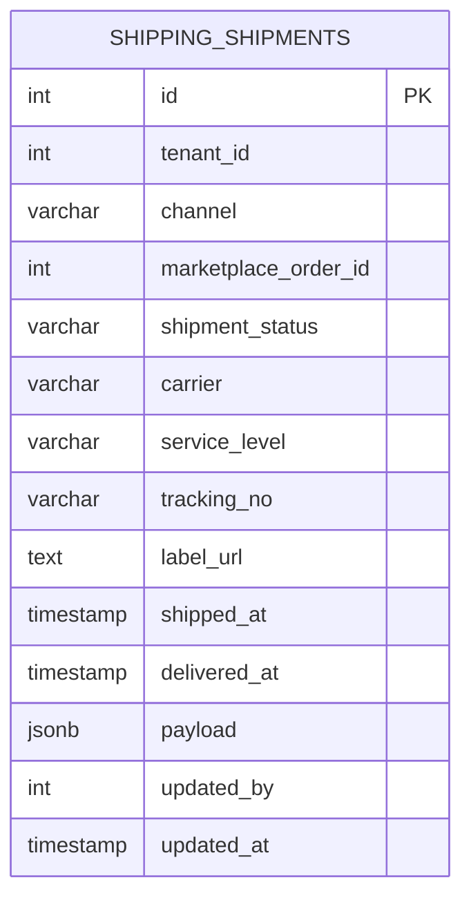

图表来源
- [schema.sql:221-235](file://server/database/schema.sql#L221-L235)
- [shippingRoutes.js:11-166](file://server/src/routes/shippingRoutes.js#L11-L166)

章节来源
- [schema.sql:221-235](file://server/database/schema.sql#L221-L235)
- [shippingRoutes.js:11-166](file://server/src/routes/shippingRoutes.js#L11-L166)

### OAuth认证流程与令牌管理
- 流程概览
  - 前端保存渠道配置后，调用“开始OAuth”生成state并打开平台授权页
  - 平台回调至“OAuth回调”接口，校验state与过期时间，写入连接元数据
  - 后续同步使用连接中的令牌或环境变量回退
- 关键点
  - marketplace_oauth_states 表存放一次性state与过期时间
  - marketplace_connections 的 metadata 字段保存最近state、code与成功时间
  - 前端页面 MarketplaceCenterPage.vue 与 MarketplaceOAuthCallbackPage.vue 协同完成授权闭环

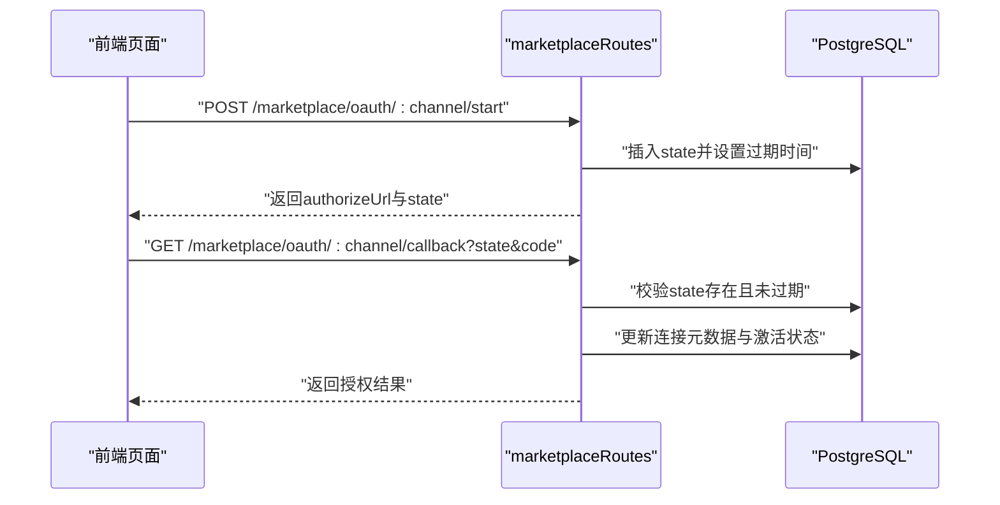

图表来源
- [marketplaceRoutes.js:215-394](file://server/src/routes/marketplaceRoutes.js#L215-L394)
- [schema.sql:174-182](file://server/database/schema.sql#L174-L182)

章节来源
- [marketplaceRoutes.js:215-394](file://server/src/routes/marketplaceRoutes.js#L215-L394)
- [schema.sql:174-182](file://server/database/schema.sql#L174-L182)
- [MarketplaceCenterPage.vue:176-216](file://web/src/pages/MarketplaceCenterPage.vue#L176-L216)
- [MarketplaceOAuthCallbackPage.vue:19-48](file://web/src/pages/MarketplaceOAuthCallbackPage.vue#L19-L48)

### 商品同步策略与库存一致性
- 归一化策略
  - 统一从第三方接口载荷中提取 onHand/allocated/available 等字段，兼容不同平台命名差异
  - 外部SKU映射到本地产品ID，仓库码映射到本地仓库ID
- 一致性保证
  - 每次库存同步前清空该渠道的快照，避免历史残留
  - 将原始载荷写入 payload 字段，便于对账与回溯
- 价格与促销
  - 当前库存同步不涉及价格与促销字段，价格与促销建议通过独立渠道或规则引擎处理

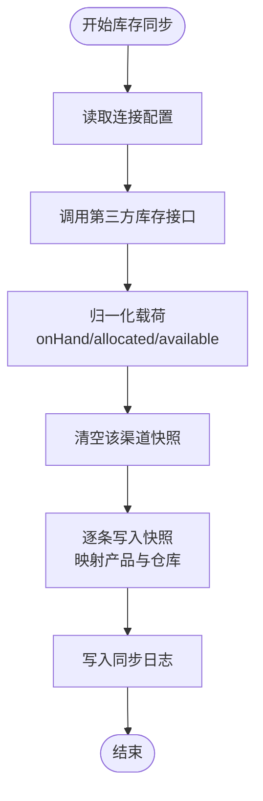

图表来源
- [marketplaceSyncService.js:113-153](file://server/src/services/marketplaceSyncService.js#L113-L153)
- [marketplaceSyncService.js:40-59](file://server/src/services/marketplaceSyncService.js#L40-L59)
- [marketplaceSyncService.js:61-111](file://server/src/services/marketplaceSyncService.js#L61-L111)

章节来源
- [marketplaceSyncService.js:113-153](file://server/src/services/marketplaceSyncService.js#L113-L153)
- [marketplaceSyncService.js:40-59](file://server/src/services/marketplaceSyncService.js#L40-L59)
- [marketplaceSyncService.js:61-111](file://server/src/services/marketplaceSyncService.js#L61-L111)

### 订单同步处理
- 归一化策略
  - 统一订单状态、买家姓名、金额、币种、下单时间与明细项
  - 明细项SKU映射本地产品ID
- 去重与幂等
  - 以 (tenant_id, channel, external_order_id) 唯一键进行UPSERT
  - 同步前清理旧明细，确保与外部最新状态一致
- 日志与审计
  - 成功/失败均写入同步日志，并记录操作人

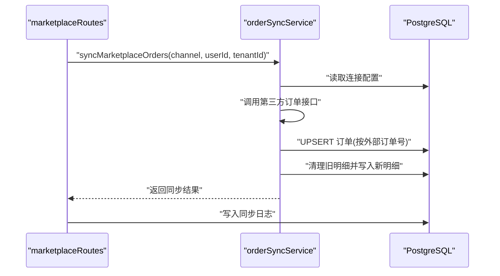

图表来源
- [orderSyncService.js:19-123](file://server/src/services/orderSyncService.js#L19-L123)
- [marketplaceRoutes.js:637-682](file://server/src/routes/marketplaceRoutes.js#L637-L682)

章节来源
- [orderSyncService.js:19-123](file://server/src/services/orderSyncService.js#L19-L123)
- [marketplaceRoutes.js:637-682](file://server/src/routes/marketplaceRoutes.js#L637-L682)

### 物流状态追踪
- 发货创建
  - 通过订单ID创建发货记录，自动标记为 SHIPPED 并填充时间戳
- 状态更新
  - 支持 PENDING/SHIPPED/IN_TRANSIT/DELIVERED/CANCELLED 状态转换
  - 自动维护 shipped_at/delivered_at 时间戳
- 查询筛选
  - 支持按状态、运单号、外部订单号、买家姓名等条件检索

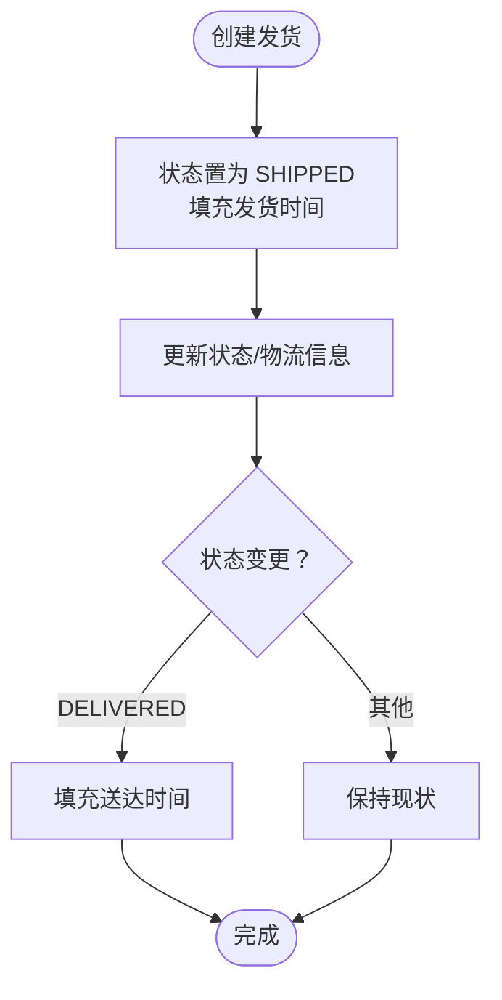

图表来源
- [shippingRoutes.js:70-118](file://server/src/routes/shippingRoutes.js#L70-L118)
- [shippingRoutes.js:120-166](file://server/src/routes/shippingRoutes.js#L120-L166)

章节来源
- [shippingRoutes.js:70-118](file://server/src/routes/shippingRoutes.js#L70-L118)
- [shippingRoutes.js:120-166](file://server/src/routes/shippingRoutes.js#L120-L166)

### 不同电商平台API差异处理
- 通道支持
  - 当前支持 Shopee/Lazada/TikTok 三类渠道
- 配置优先级
  - 优先使用数据库中的连接配置（api_base_url/access_token），否则回退到环境变量
- 载荷归一化
  - 对库存与订单接口返回的字段进行统一映射，屏蔽平台差异
- 端点适配
  - 订单端点基于库存端点替换路径后使用

章节来源
- [marketplaceRoutes.js:18-20](file://server/src/routes/marketplaceRoutes.js#L18-L20)
- [marketplaceSyncService.js:3-16](file://server/src/services/marketplaceSyncService.js#L3-L16)
- [marketplaceSyncService.js:19-38](file://server/src/services/marketplaceSyncService.js#L19-L38)
- [orderSyncService.js:26-33](file://server/src/services/orderSyncService.js#L26-L33)

### 错误日志记录与重试机制
- 错误日志
  - marketplace_error_logs 记录操作、错误码、消息、详情、请求ID与时间
  - 同步失败时写入同步日志与错误日志，并触发审计
- 重试建议
  - 建议在定时任务中对 FAILED 的同步进行指数退避重试
  - 对于 OAuth 回调错误，记录 provider error 并提示重新授权

章节来源
- [schema.sql:184-194](file://server/database/schema.sql#L184-L194)
- [marketplaceRoutes.js:183-211](file://server/src/routes/marketplaceRoutes.js#L183-L211)
- [marketplaceRoutes.js:319-331](file://server/src/routes/marketplaceRoutes.js#L319-L331)
- [auditLog.js:1-35](file://server/src/utils/auditLog.js#L1-L35)

## 依赖关系分析
- 组件耦合
  - marketplaceRoutes 依赖 marketplaceSyncService 与 orderSyncService
  - 服务层依赖 db.js 进行数据库操作
  - 所有路由均依赖 auth.js 进行 JWT 校验与租户上下文注入
- 外部依赖
  - 第三方电商平台API（Shopee/Lazada/TikTok）
  - JWT 令牌验证（jsonwebtoken）

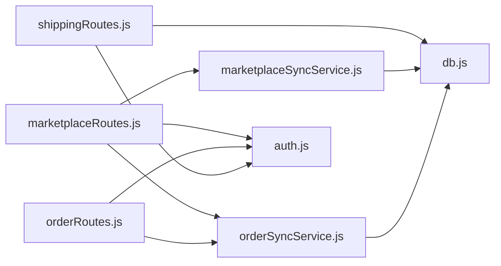

图表来源
- [marketplaceRoutes.js:1-685](file://server/src/routes/marketplaceRoutes.js#L1-L685)
- [orderRoutes.js:1-124](file://server/src/routes/orderRoutes.js#L1-L124)
- [shippingRoutes.js:1-169](file://server/src/routes/shippingRoutes.js#L1-L169)
- [marketplaceSyncService.js:1-159](file://server/src/services/marketplaceSyncService.js#L1-L159)
- [orderSyncService.js:1-128](file://server/src/services/orderSyncService.js#L1-L128)
- [auth.js:1-87](file://server/src/middleware/auth.js#L1-L87)
- [db.js:1-29](file://server/src/config/db.js#L1-L29)

章节来源
- [package.json:15-25](file://server/package.json#L15-L25)
- [auth.js:1-87](file://server/src/middleware/auth.js#L1-L87)
- [db.js:1-29](file://server/src/config/db.js#L1-L29)

## 性能考量
- 数据库层面
  - 为关键查询建立索引（如库存快照、订单、发货、错误日志等）
  - 使用 JSONB 字段存储原始载荷，便于快速检索与回溯
- 接口层面
  - 为同步与OAuth接口设置速率限制，避免突发流量冲击
  - 分页查询与条件过滤，减少单次返回数据量
- 缓存与批处理
  - 建议在应用层缓存常用配置（如连接配置），降低数据库压力
  - 对高频查询结果进行短期缓存

章节来源
- [schema.sql:419-446](file://server/database/schema.sql#L419-L446)
- [marketplaceRoutes.js:13-14](file://server/src/routes/marketplaceRoutes.js#L13-L14)
- [orderRoutes.js:10-10](file://server/src/routes/orderRoutes.js#L10-L10)

## 故障排除指南
- 认证失败
  - 检查 Authorization 头是否携带有效 JWT
  - 确认用户状态与租户状态正常
- 连接配置问题
  - 确认 marketplace_connections 中的 api_base_url 与 access_token 已正确填写
  - 使用“连接测试”接口验证连通性
- 同步失败
  - 查看 marketplace_sync_logs 与 marketplace_error_logs
  - 检查第三方平台返回状态与错误码
- OAuth 回调失败
  - 校验 state 是否存在且未过期
  - 检查回调参数是否完整（state/code/error）

章节来源
- [auth.js:5-61](file://server/src/middleware/auth.js#L5-L61)
- [marketplaceRoutes.js:396-456](file://server/src/routes/marketplaceRoutes.js#L396-L456)
- [marketplaceRoutes.js:284-394](file://server/src/routes/marketplaceRoutes.js#L284-L394)
- [schema.sql:137-194](file://server/database/schema.sql#L137-L194)

## 结论
本电商集成方案通过标准化的数据表设计与服务层抽象，实现了对 Shopee/Lazada/TikTok 等平台的统一接入与管理。借助库存快照、订单明细与物流状态表，系统能够稳定地完成商品与订单的双向同步，并提供完善的审计与错误日志能力。建议在生产环境中结合速率限制、重试策略与监控告警，持续优化同步性能与可靠性。

## 附录
- 前端页面
  - MarketplaceCenterPage.vue：连接配置、OAuth引导、同步任务与错误日志展示
  - MarketplaceOAuthCallbackPage.vue：OAuth回调处理与结果反馈
- 后端接口示例（参考）
  - 认证与用户：POST /auth/login、GET /auth/me
  - 商品与库存：GET /products、GET /inventory
  - 电商集成：GET/POST /marketplace/*、GET/POST /orders/*、GET/POST /shipping/*
- 初始化数据
  - 种子数据包含默认用户、分类、仓库与示例商品，便于快速验证

章节来源
- [MarketplaceCenterPage.vue:1-477](file://web/src/pages/MarketplaceCenterPage.vue#L1-L477)
- [MarketplaceOAuthCallbackPage.vue:1-81](file://web/src/pages/MarketplaceOAuthCallbackPage.vue#L1-L81)
- [POSTMAN_BACKEND_GUIDE.md:28-302](file://POSTMAN_BACKEND_GUIDE.md#L28-L302)
- [seed.sql:1-114](file://server/database/seed.sql#L1-L114)