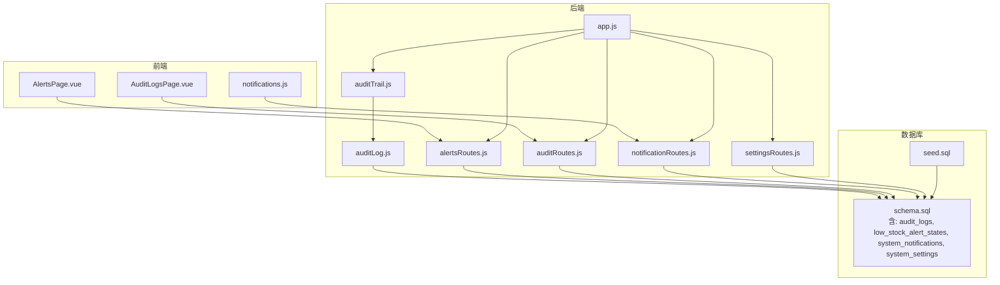
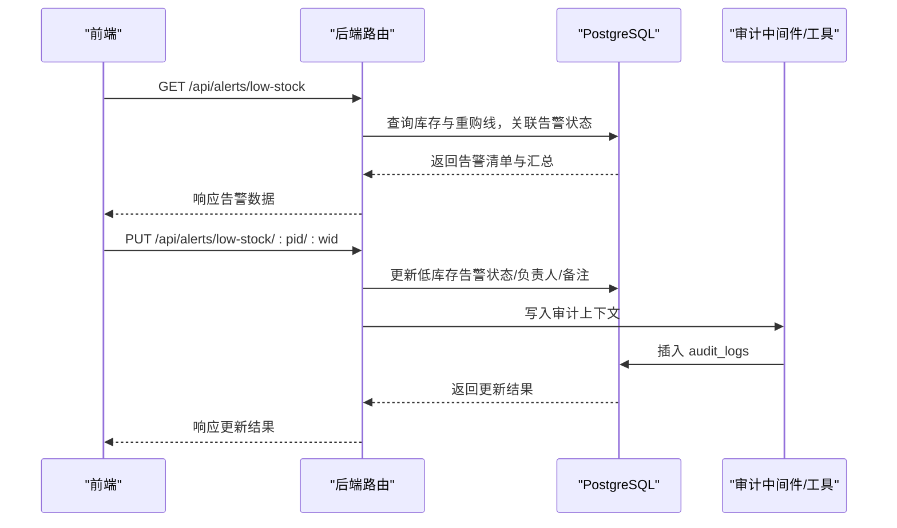
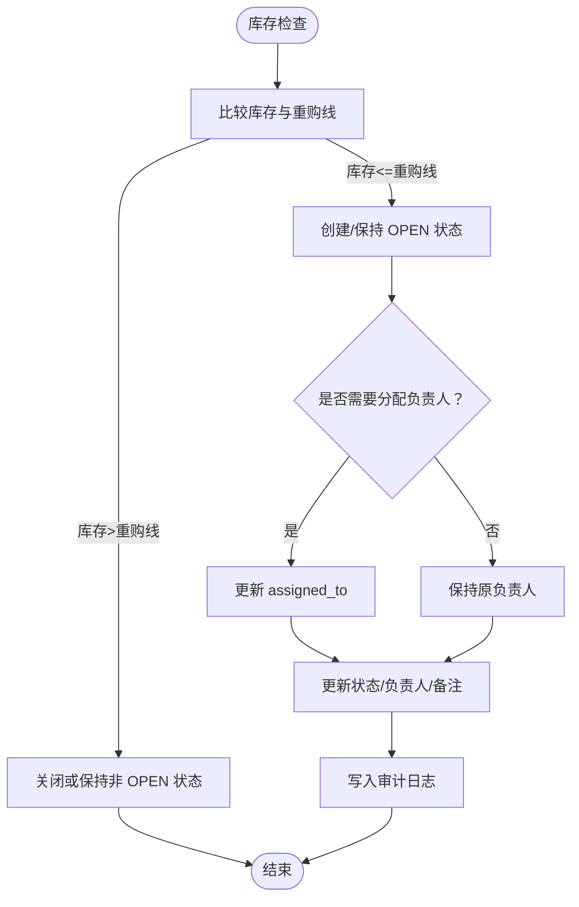
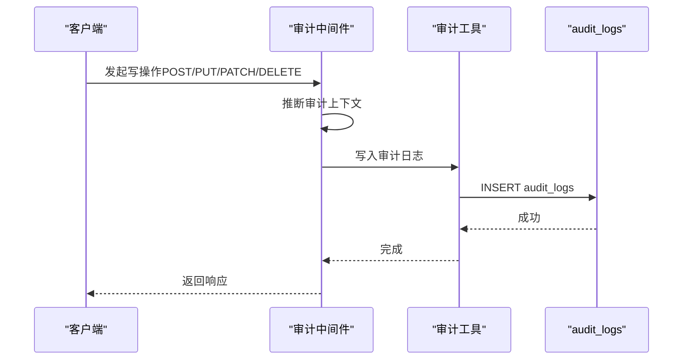
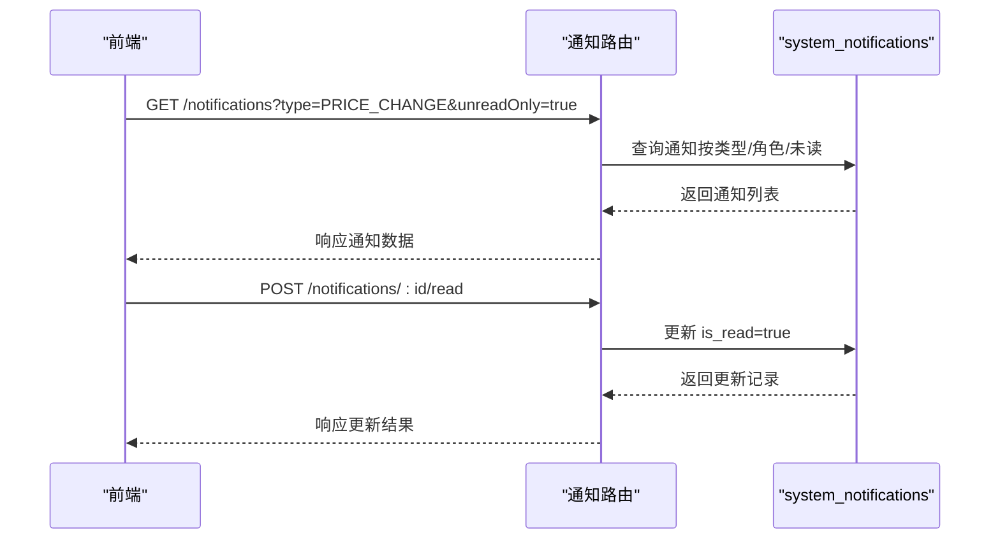
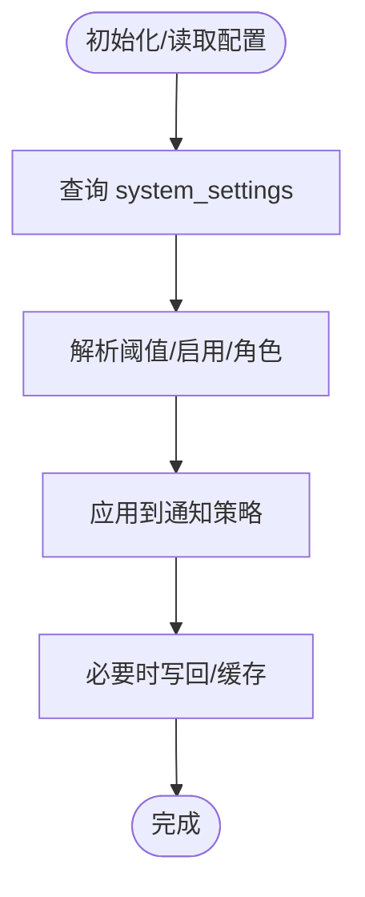
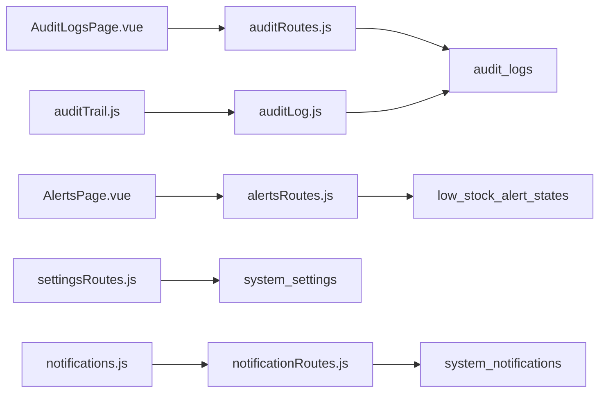

# 监控与告警表

<cite>
**本文引用的文件列表**
- [schema.sql](file://server/database/schema.sql)
- [seed.sql](file://server/database/seed.sql)
- [alertsRoutes.js](file://server/src/routes/alertsRoutes.js)
- [auditRoutes.js](file://server/src/routes/auditRoutes.js)
- [notificationRoutes.js](file://server/src/routes/notificationRoutes.js)
- [settingsRoutes.js](file://server/src/routes/settingsRoutes.js)
- [auditTrail.js](file://server/src/middleware/auditTrail.js)
- [auditLog.js](file://server/src/utils/auditLog.js)
- [app.js](file://server/src/app.js)
- [AlertsPage.vue](file://web/src/pages/AlertsPage.vue)
- [AuditLogsPage.vue](file://web/src/pages/AuditLogsPage.vue)
- [notifications.js](file://web/src/stores/notifications.js)
</cite>

## 目录
1. [简介](#简介)
2. [项目结构](#项目结构)
3. [核心组件](#核心组件)
4. [架构总览](#架构总览)
5. [详细组件分析](#详细组件分析)
6. [依赖关系分析](#依赖关系分析)
7. [性能考量](#性能考量)
8. [故障排查指南](#故障排查指南)
9. [结论](#结论)
10. [附录](#附录)

## 简介
本文件面向运维与系统管理员，系统性梳理库存管理平台中的监控与告警相关数据模型与实现，重点覆盖以下四类表：
- 低库存告警状态表：用于记录每个产品在各仓库的低库存告警状态、负责人与备注等信息，并提供批量更新能力。
- 审计日志表：记录用户操作行为，支撑合规审计、问题追溯与风控。
- 系统通知表：用于向用户推送系统级消息，支持按角色与类型过滤。
- 系统设置表：集中存储租户级配置项，如价格变动阈值、是否启用通知、目标角色等。

同时，文档阐述告警触发机制、告警级别定义与处理流程；解释审计日志的记录策略、数据保留与合规要求；说明系统通知的类型分类、推送渠道与用户偏好设置；并给出告警规则配置、通知模板管理与自动化处理建议，以及监控指标、性能基线与异常检测思路，帮助读者完成从数据模型到运维实践的完整闭环。

## 项目结构
后端采用 Express + PostgreSQL，数据库结构集中在 schema 中定义；前端使用 Vue + Pinia，通过 API 调用后端接口展示与交互。审计中间件贯穿所有写操作，统一生成审计日志；告警与通知路由提供查询、更新与批量更新能力。

图表来源
- [app.js:1-93](file://server/src/app.js#L1-L93)
- [auditTrail.js:1-86](file://server/src/middleware/auditTrail.js#L1-L86)
- [auditLog.js:1-40](file://server/src/utils/auditLog.js#L1-L40)
- [alertsRoutes.js:1-311](file://server/src/routes/alertsRoutes.js#L1-L311)
- [auditRoutes.js:1-113](file://server/src/routes/auditRoutes.js#L1-L113)
- [notificationRoutes.js:1-91](file://server/src/routes/notificationRoutes.js#L1-L91)
- [settingsRoutes.js:1-158](file://server/src/routes/settingsRoutes.js#L1-L158)
- [schema.sql:275-396](file://server/database/schema.sql#L275-L396)
- [seed.sql:1-114](file://server/database/seed.sql#L1-L114)

章节来源
- [app.js:1-93](file://server/src/app.js#L1-L93)
- [schema.sql:275-396](file://server/database/schema.sql#L275-L396)

## 核心组件
- 低库存告警状态表（low_stock_alert_states）：记录产品在仓库的告警状态、负责人、更新人与备注，支持按状态与仓库过滤，提供单条与批量更新接口。
- 审计日志表（audit_logs）：记录用户操作行为，包含用户标识、动作、实体类型、HTTP 方法、路径、描述与元数据，支持按时间范围、动作、实体类型与关键词检索。
- 系统通知表（system_notifications）：记录系统消息，支持按类型、目标角色与未读状态过滤，提供“标记已读”能力。
- 系统设置表（system_settings）：集中存储租户级配置键值，如价格变动阈值、是否启用通知、目标角色等，支持查询与更新。

章节来源
- [schema.sql:275-396](file://server/database/schema.sql#L275-L396)
- [alertsRoutes.js:15-42](file://server/src/routes/alertsRoutes.js#L15-L42)
- [auditRoutes.js:16-110](file://server/src/routes/auditRoutes.js#L16-L110)
- [notificationRoutes.js:16-88](file://server/src/routes/notificationRoutes.js#L16-L88)
- [settingsRoutes.js:38-56](file://server/src/routes/settingsRoutes.js#L38-L56)

## 架构总览
后端通过中间件统一采集审计事件，写入审计日志；告警模块基于库存与重购线自动触发 OPEN 状态，管理员可更新状态、分配负责人并记录审计上下文；通知模块按角色与类型分发系统消息；设置模块提供阈值与角色配置，驱动自动化通知。

图表来源
- [alertsRoutes.js:87-205](file://server/src/routes/alertsRoutes.js#L87-L205)
- [auditTrail.js:47-81](file://server/src/middleware/auditTrail.js#L47-L81)
- [auditLog.js:1-35](file://server/src/utils/auditLog.js#L1-L35)

## 详细组件分析

### 低库存告警状态表（low_stock_alert_states）
- 表结构要点
  - 主键：自增 id
  - 关联：product_id、warehouse_id（外键约束），唯一索引保证每产品每仓库仅一条告警状态
  - 状态：枚举 OPEN、READ、IGNORED，默认 OPEN
  - 负责人：assigned_to 外键关联用户
  - 更新链路：updated_by 记录更新人，updated_at 记录更新时间
- 触发机制
  - 当某产品在某仓库的库存小于等于其重购线时，系统返回 OPEN 状态（若无历史状态则默认 OPEN）
- 告警级别与处理流程
  - 级别：系统内未定义显式级别字段，可通过状态与负责人进行内部分级管理
  - 流程：OPEN -> READ（已知悉）-> IGNORED（忽略处理）；可分配负责人推进闭环
- 接口能力
  - 单条更新：PUT /alerts/low-stock/:productId/:warehouseId
  - 批量更新：POST /alerts/low-stock/bulk-update
  - 查询：GET /alerts/low-stock 支持搜索、仓库过滤、状态过滤、分页与汇总统计

图表来源
- [alertsRoutes.js:15-42](file://server/src/routes/alertsRoutes.js#L15-L42)
- [alertsRoutes.js:207-251](file://server/src/routes/alertsRoutes.js#L207-L251)
- [alertsRoutes.js:253-308](file://server/src/routes/alertsRoutes.js#L253-L308)

章节来源
- [schema.sql:290-300](file://server/database/schema.sql#L290-L300)
- [alertsRoutes.js:87-205](file://server/src/routes/alertsRoutes.js#L87-L205)
- [alertsRoutes.js:207-308](file://server/src/routes/alertsRoutes.js#L207-L308)

### 审计日志表（audit_logs）
- 记录策略
  - 中间件在响应完成后收集上下文，仅对 2xx 成功写操作记录；登录成功也会被记录
  - 自动清洗敏感字段（如密码），并序列化元数据
- 数据保留与合规
  - 仓库层未设置自动清理策略；建议结合业务合规要求制定保留周期（例如 1 年），到期归档或删除
- 查询与导出
  - 支持按动作、实体类型、时间范围与关键词检索
  - 前端支持导出 CSV/JSON/PDF

图表来源
- [auditTrail.js:14-45](file://server/src/middleware/auditTrail.js#L14-L45)
- [auditTrail.js:47-81](file://server/src/middleware/auditTrail.js#L47-L81)
- [auditLog.js:1-35](file://server/src/utils/auditLog.js#L1-L35)

章节来源
- [auditTrail.js:1-86](file://server/src/middleware/auditTrail.js#L1-L86)
- [auditLog.js:1-40](file://server/src/utils/auditLog.js#L1-L40)
- [auditRoutes.js:16-110](file://server/src/routes/auditRoutes.js#L16-L110)
- [AuditLogsPage.vue:54-115](file://web/src/pages/AuditLogsPage.vue#L54-L115)

### 系统通知表（system_notifications）
- 类型与目标
  - 通知类型：前端示例中出现 PRICE_CHANGE；可扩展为库存预警、系统维护等
  - 目标角色：可为空（全体）或限定 ADMIN/MANAGER/STAFF
- 推送渠道与偏好
  - 前端 Store 提供未读计数与刷新能力；未见邮件/短信等外部渠道集成
  - 用户偏好：前端页面提供“仅未读”开关与分页
- 接口能力
  - 获取通知：GET /notifications（支持类型过滤、未读过滤）
  - 标记已读：POST /notifications/:id/read

图表来源
- [notificationRoutes.js:16-58](file://server/src/routes/notificationRoutes.js#L16-L58)
- [notificationRoutes.js:60-88](file://server/src/routes/notificationRoutes.js#L60-L88)
- [notifications.js:13-31](file://web/src/stores/notifications.js#L13-L31)

章节来源
- [schema.sql:378-388](file://server/database/schema.sql#L378-L388)
- [notificationRoutes.js:16-88](file://server/src/routes/notificationRoutes.js#L16-L88)
- [notifications.js:1-52](file://web/src/stores/notifications.js#L1-L52)

### 系统设置表（system_settings）
- 配置项示例
  - 价格变动阈值百分比（PRICE_CHANGE_ALERT_THRESHOLD_PERCENT）
  - 是否启用通知（PRICE_CHANGE_NOTIFICATIONS_ENABLED）
  - 通知目标角色（PRICE_CHANGE_NOTIFY_ROLES）
- 接口能力
  - 查询：GET /settings/price-change
  - 更新：PUT /settings/price-change（支持阈值、启用开关、角色集合）

图表来源
- [settingsRoutes.js:38-56](file://server/src/routes/settingsRoutes.js#L38-L56)
- [settingsRoutes.js:97-155](file://server/src/routes/settingsRoutes.js#L97-L155)

章节来源
- [schema.sql:390-396](file://server/database/schema.sql#L390-L396)
- [settingsRoutes.js:38-155](file://server/src/routes/settingsRoutes.js#L38-L155)

## 依赖关系分析
- 路由到中间件/工具
  - 所有写操作路由均受审计中间件保护，确保审计日志一致性
  - 告警路由在更新时写入审计上下文，便于追踪变更
- 路由到数据库
  - 四个核心表分别由对应路由负责读写：alerts、audit、notifications、settings
- 前端到后端
  - 前端页面通过 API 获取数据并展示，Store 管理未读计数与刷新

图表来源
- [alertsRoutes.js:1-311](file://server/src/routes/alertsRoutes.js#L1-L311)
- [auditRoutes.js:1-113](file://server/src/routes/auditRoutes.js#L1-L113)
- [notificationRoutes.js:1-91](file://server/src/routes/notificationRoutes.js#L1-L91)
- [settingsRoutes.js:1-158](file://server/src/routes/settingsRoutes.js#L1-L158)
- [auditTrail.js:1-86](file://server/src/middleware/auditTrail.js#L1-L86)
- [auditLog.js:1-40](file://server/src/utils/auditLog.js#L1-L40)
- [AlertsPage.vue:113-135](file://web/src/pages/AlertsPage.vue#L113-L135)
- [AuditLogsPage.vue:54-73](file://web/src/pages/AuditLogsPage.vue#L54-L73)
- [notifications.js:13-31](file://web/src/stores/notifications.js#L13-L31)

章节来源
- [app.js:1-93](file://server/src/app.js#L1-L93)

## 性能考量
- 查询优化
  - 审计日志、低库存告警、系统通知均建立相应索引，建议定期审查执行计划
  - 分页查询与 COUNT 并行，减少锁竞争
- 写入优化
  - 审计中间件异步写入，避免阻塞主业务路径
  - 批量更新告警时使用 Promise.all 并发提交
- 存储与保留
  - 建议对审计日志与通知表设置分区或归档策略，控制增长速度
  - 对高频写入表（如 audit_logs）考虑压缩与冷热分离

[本节为通用指导，无需特定文件来源]

## 故障排查指南
- 告警状态异常
  - 检查库存与重购线是否正确；确认唯一索引是否导致冲突
  - 使用审计日志定位最近一次更新记录
- 通知未送达
  - 确认通知类型与目标角色匹配；检查未读过滤开关
  - 查看通知表状态与创建时间
- 审计缺失
  - 确认中间件是否挂载；检查响应码是否为 2xx
  - 核对审计上下文推断逻辑与敏感字段清洗

章节来源
- [auditTrail.js:47-81](file://server/src/middleware/auditTrail.js#L47-L81)
- [auditLog.js:1-35](file://server/src/utils/auditLog.js#L1-L35)
- [auditRoutes.js:16-110](file://server/src/routes/auditRoutes.js#L16-L110)

## 结论
该系统以明确的数据模型与中间件机制实现了监控与告警闭环：库存触发 OPEN 状态，管理员闭环管理，审计中间件保障可追溯性，系统通知与设置驱动自动化与个性化。建议在生产环境中补充数据保留策略、索引维护与异常检测基线，持续提升可观测性与稳定性。

[本节为总结，无需特定文件来源]

## 附录

### 告警规则配置与处理流程
- 规则配置
  - 重购线：products.reorder_level
  - 低库存阈值：库存 ≤ 重购线即触发 OPEN
  - 通知阈值：通过 system_settings 中的价格变动阈值与角色集合控制
- 处理流程
  - OPEN -> READ（已知悉）-> IGNORED（忽略处理）
  - 可分配负责人推进闭环；每次更新写入审计日志

章节来源
- [schema.sql:50-54](file://server/database/schema.sql#L50-L54)
- [alertsRoutes.js:15-42](file://server/src/routes/alertsRoutes.js#L15-L42)
- [settingsRoutes.js:97-155](file://server/src/routes/settingsRoutes.js#L97-L155)

### 审计日志记录策略与合规
- 记录范围：仅对 2xx 成功写操作记录；登录成功也记录
- 敏感字段：密码字段会被脱敏
- 导出能力：前端支持导出 CSV/JSON/PDF，便于合规审计

章节来源
- [auditTrail.js:14-45](file://server/src/middleware/auditTrail.js#L14-L45)
- [auditTrail.js:47-81](file://server/src/middleware/auditTrail.js#L47-L81)
- [AuditLogsPage.vue:117-154](file://web/src/pages/AuditLogsPage.vue#L117-L154)

### 系统通知类型与用户偏好
- 类型：示例为 PRICE_CHANGE，可扩展为库存预警、系统维护等
- 目标：可为空（全体）或限定角色
- 偏好：前端提供“仅未读”开关与分页

章节来源
- [schema.sql:378-388](file://server/database/schema.sql#L378-L388)
- [notificationRoutes.js:16-58](file://server/src/routes/notificationRoutes.js#L16-L58)
- [notifications.js:13-31](file://web/src/stores/notifications.js#L13-L31)

### 监控指标、性能基线与异常检测
- 指标建议
  - 告警总量、OPEN/READ/IGNORED 比例、平均处理时长
  - 审计日志写入延迟、失败率
  - 通知未读数、触达率
- 基线与检测
  - 基于历史趋势设定阈值；对异常波动进行告警
  - 对审计日志写入失败与响应延迟进行熔断与重试

[本节为通用指导，无需特定文件来源]