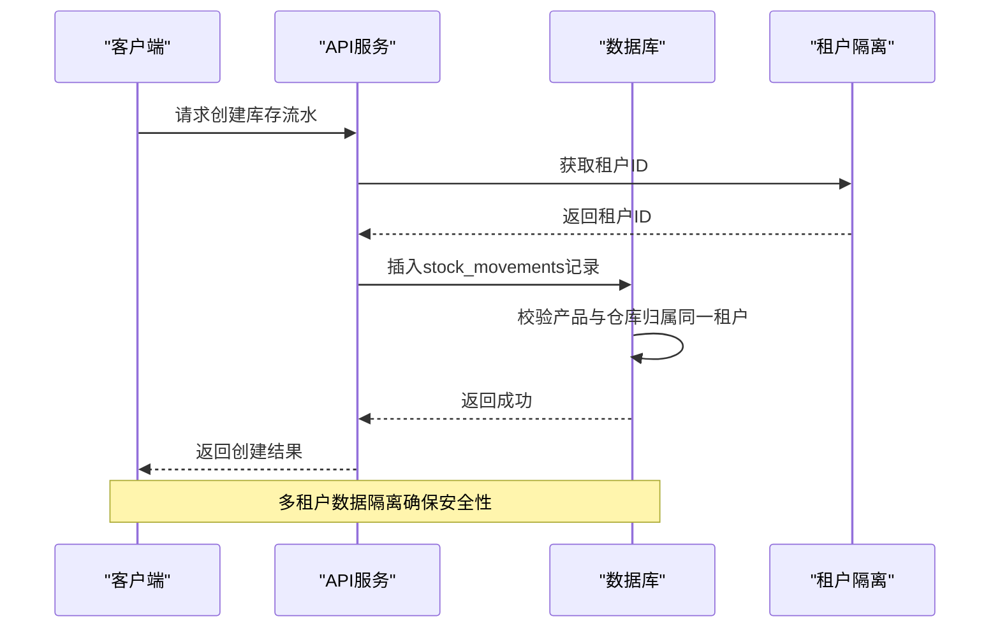

# 表结构详解

<cite>
**本文档引用的文件**
- [schema.sql](file://server/database/schema.sql)
- [seed.sql](file://server/database/seed.sql)
- [001_add_multi_tenant.sql](file://server/database/migrations/001_add_multi_tenant.sql)
- [002_fix_unique_constraints.sql](file://server/database/migrations/002_fix_unique_constraints.sql)
- [db.js](file://server/src/config/db.js)
- [inventoryRoutes.js](file://server/src/routes/inventoryRoutes.js)
- [inventoryService.js](file://server/src/utils/inventoryService.js)
- [masterRoutes.js](file://server/src/routes/masterRoutes.js)
- [supplierRoutes.js](file://server/src/routes/supplierRoutes.js)
- [stockCountRoutes.js](file://server/src/routes/stockCountRoutes.js)
</cite>

## 目录
1. [简介](#简介)
2. [项目结构](#项目结构)
3. [核心组件](#核心组件)
4. [架构概览](#架构概览)
5. [详细组件分析](#详细组件分析)
6. [依赖关系分析](#依赖关系分析)
7. [性能考量](#性能考量)
8. [故障排除指南](#故障排除指南)
9. [结论](#结论)
10. [附录](#附录)

## 简介
本文件为库存管理系统的完整表结构文档，覆盖所有业务表的字段定义、数据类型、约束条件、业务含义及使用场景。文档基于实际数据库脚本和后端路由实现，提供字段命名规范、数据类型选择原因、字段变更历史、版本兼容性说明、NULL值处理策略以及数据完整性保障机制。同时包含实际SQL示例和常见查询模式，帮助数据库管理员和开发者准确理解并维护系统数据结构。

## 项目结构
库存管理系统采用前后端分离架构，数据库层通过PostgreSQL提供数据持久化能力。核心数据库对象包括：
- 用户管理：users
- 商品管理：categories、products、product_images、product_bundle_items、product_pricing_rules
- 库存管理：warehouses、stock_levels、stock_movements、stock_counts、stock_count_items
- 供应链管理：suppliers、product_suppliers、supplier_payment_records
- 市场渠道管理：marketplace_connections、marketplace_sync_logs、marketplace_inventory_snapshots、marketplace_orders、marketplace_order_items、shipping_shipments
- 系统管理：audit_logs、low_stock_alert_states、system_notifications、system_settings、bank_statements
- 多租户扩展：tenants（迁移脚本）

```mermaid
graph TB
subgraph "核心业务表"
users["users<br/>用户表"]
categories["categories<br/>分类表"]
products["products<br/>商品表"]
warehouses["warehouses<br/>仓库表"]
suppliers["suppliers<br/>供应商表"]
end
subgraph "库存相关表"
stock_levels["stock_levels<br/>库存表"]
stock_movements["stock_movements<br/>库存流水"]
stock_counts["stock_counts<br/>盘点单"]
stock_count_items["stock_count_items<br/>盘点明细"]
end
subgraph "商品关联表"
product_images["product_images<br/>商品图片"]
product_bundle_items["product_bundle_items<br/>组合商品项"]
product_pricing_rules["product_pricing_rules<br/>定价规则"]
product_suppliers["product_suppliers<br/>商品供应商"]
end
subgraph "市场渠道表"
marketplace_connections["marketplace_connections<br/>渠道连接"]
marketplace_sync_logs["marketplace_sync_logs<br/>同步日志"]
marketplace_inventory_snapshots["marketplace_inventory_snapshots<br/>库存快照"]
marketplace_orders["marketplace_orders<br/>订单"]
marketplace_order_items["marketplace_order_items<br/>订单明细"]
shipping_shipments["shipping_shipments<br/>发货单"]
end
subgraph "系统管理表"
audit_logs["audit_logs<br/>审计日志"]
low_stock_alert_states["low_stock_alert_states<br/>低库存告警"]
system_notifications["system_notifications<br/>系统通知"]
system_settings["system_settings<br/>系统设置"]
bank_statements["bank_statements<br/>银行对账单"]
end
subgraph "多租户扩展"
tenants["tenants<br/>租户表"]
end
users --> tenants
categories --> tenants
products --> tenants
warehouses --> tenants
suppliers --> tenants
stock_levels --> tenants
stock_movements --> tenants
stock_counts --> tenants
stock_count_items --> tenants
product_images --> tenants
product_bundle_items --> tenants
product_pricing_rules --> tenants
product_suppliers --> tenants
marketplace_connections --> tenants
marketplace_sync_logs --> tenants
marketplace_inventory_snapshots --> tenants
marketplace_orders --> tenants
marketplace_order_items --> tenants
shipping_shipments --> tenants
audit_logs --> tenants
low_stock_alert_states --> tenants
system_notifications --> tenants
system_settings --> tenants
bank_statements --> tenants
```



**图表来源**
- [schema.sql:1-447](file://server/database/schema.sql#L1-L447)
- [001_add_multi_tenant.sql:1-100](file://server/database/migrations/001_add_multi_tenant.sql#L1-L100)

**章节来源**
- [schema.sql:1-447](file://server/database/schema.sql#L1-L447)
- [001_add_multi_tenant.sql:1-100](file://server/database/migrations/001_add_multi_tenant.sql#L1-L100)

## 核心组件
本节概述系统中的核心表及其主要职责，为后续详细分析奠定基础。

### 用户与权限管理
- **users表**：存储系统用户信息，支持多角色权限控制，包含密码哈希、偏好货币等字段
- **system_settings表**：系统配置参数，支持租户维度的设置隔离
- **system_notifications表**：系统通知消息，支持按角色定向推送

### 商品与分类管理
- **categories表**：商品分类，支持名称唯一性约束
- **products表**：核心商品信息，包含SKU、条形码、成本价、售价等关键字段
- **product_images表**：商品图片管理，支持主图标记和排序
- **product_bundle_items表**：组合商品的子项关系
- **product_pricing_rules表**：多渠道定价规则

### 仓库与库存管理
- **warehouses表**：仓库信息管理
- **stock_levels表**：各仓库的商品库存数量
- **stock_movements表**：库存变动流水，支持入库、出库、调拨三种类型
- **stock_counts表**：库存盘点流程管理
- **stock_count_items表**：盘点明细项

### 供应链管理
- **suppliers表**：供应商信息，包含联系信息、付款条款等
- **product_suppliers表**：商品与供应商的关联关系
- **supplier_payment_records表**：供应商付款记录

### 市场渠道集成
- **marketplace_connections表**：第三方平台连接配置
- **marketplace_sync_logs表**：同步操作日志
- **marketplace_inventory_snapshots表**：库存快照数据
- **marketplace_orders表**：外部订单信息
- **marketplace_order_items表**：订单明细
- **shipping_shipments表**：发货单据

### 系统监控与审计
- **audit_logs表**：操作审计日志
- **low_stock_alert_states表**：低库存告警状态管理
- **bank_statements表**：银行对账单文件管理

**章节来源**
- [schema.sql:1-447](file://server/database/schema.sql#L1-L447)

## 架构概览
系统采用多租户架构设计，通过在所有业务表中增加tenant_id字段实现数据隔离。核心架构特点包括：

### 多租户设计
- 所有业务表新增tenant_id字段，默认值为1（默认租户）
- 原全局唯一约束改为租户内唯一约束
- 关键表建立tenant_id索引提升查询性能
- 审计日志表支持tenant_id字段

### 数据一致性保障
- 使用PostgreSQL的外键约束确保引用完整性
- 通过UNIQUE约束保证关键标识符的唯一性
- 采用CHECK约束限制枚举值范围
- 事务处理确保库存操作的原子性

### 性能优化策略
- 为高频查询字段建立复合索引
- 为时间戳字段建立倒序索引支持分页查询
- 为JSONB字段建立索引支持全文检索



**图表来源**
- [inventoryRoutes.js:237-437](file://server/src/routes/inventoryRoutes.js#L237-L437)
- [001_add_multi_tenant.sql:32-60](file://server/database/migrations/001_add_multi_tenant.sql#L32-L60)

**章节来源**
- [001_add_multi_tenant.sql:1-100](file://server/database/migrations/001_add_multi_tenant.sql#L1-L100)
- [inventoryRoutes.js:237-437](file://server/src/routes/inventoryRoutes.js#L237-L437)

## 详细组件分析

### users表 - 用户管理
users表是系统的核心用户表，负责存储用户基本信息和权限控制。

#### 字段定义与约束
| 字段名 | 数据类型 | 约束 | 默认值 | 业务含义 |
|--------|----------|------|--------|----------|
| id | SERIAL | PRIMARY KEY | 自增 | 主键标识 |
| full_name | VARCHAR(120) | NOT NULL | - | 用户全名 |
| email | VARCHAR(150) | NOT NULL, UNIQUE | - | 登录邮箱 |
| password_hash | TEXT | NOT NULL | - | 密码哈希值 |
| role | VARCHAR(20) | NOT NULL, CHECK | - | 角色：ADMIN/MANAGER/STAFF |
| is_active | BOOLEAN | NOT NULL, DEFAULT TRUE | TRUE | 是否激活 |
| preferred_currency | VARCHAR(10) | NOT NULL, DEFAULT 'MYR' | MYR | 偏好货币 |
| created_at | TIMESTAMP | NOT NULL, DEFAULT CURRENT_TIMESTAMP | 当前时间 | 创建时间 |

#### 设计考虑
- **角色枚举**：通过CHECK约束限制角色值，确保数据一致性
- **邮箱唯一性**：全局唯一约束保证用户登录唯一性
- **货币偏好**：支持多币种环境下的显示偏好

#### 使用场景与频率
- 高频：用户认证、权限检查
- 中频：用户列表查询、角色管理
- 低频：用户详情修改

**章节来源**
- [schema.sql:2-11](file://server/database/schema.sql#L2-L11)
- [seed.sql:2-28](file://server/database/seed.sql#L2-L28)

### categories表 - 商品分类
categories表管理商品分类信息，支持多级分类的层次化管理。

#### 字段定义与约束
| 字段名 | 数据类型 | 约束 | 默认值 | 业务含义 |
|--------|----------|------|--------|----------|
| id | SERIAL | PRIMARY KEY | 自增 | 主键标识 |
| name | VARCHAR(120) | NOT NULL, UNIQUE | - | 分类名称 |
| description | TEXT | - | - | 分类描述 |
| created_at | TIMESTAMP | NOT NULL, DEFAULT CURRENT_TIMESTAMP | 当前时间 | 创建时间 |

#### 设计考虑
- **名称唯一性**：确保分类名称的唯一性，避免混淆
- **描述字段**：支持分类的详细说明和备注

#### 使用场景与频率
- 低频：分类创建、更新、删除
- 中频：商品创建时的分类选择
- 高频：分类列表展示

**章节来源**
- [schema.sql:15-20](file://server/database/schema.sql#L15-L20)
- [seed.sql:31-35](file://server/database/seed.sql#L31-L35)

### products表 - 商品信息
products表是系统的核心业务表，存储商品的所有关键信息。

#### 字段定义与约束
| 字段名 | 数据类型 | 约束 | 默认值 | 业务含义 |
|--------|----------|------|--------|----------|
| id | SERIAL | PRIMARY KEY | 自增 | 主键标识 |
| name | VARCHAR(180) | NOT NULL | - | 商品名称 |
| sku | VARCHAR(60) | NOT NULL, UNIQUE | - | SKU编码 |
| sku_type | VARCHAR(20) | NOT NULL, DEFAULT 'SINGLE' | SINGLE | SKU类型：SINGLE/COMBO |
| product_code | VARCHAR(80) | UNIQUE | - | 产品内部编码 |
| barcode | VARCHAR(80) | UNIQUE | - | 条形码 |
| image_data | TEXT | - | - | 商品图片数据 |
| description | TEXT | - | - | 商品描述 |
| usage_guide | TEXT | - | - | 使用指南 |
| pros | TEXT | - | - | 优点说明 |
| cons | TEXT | - | - | 缺点说明 |
| category_id | INTEGER | REFERENCES categories(id) | - | 分类外键 |
| unit | VARCHAR(30) | NOT NULL, DEFAULT 'pcs' | pcs | 计量单位 |
| cost_price | NUMERIC(12,2) | NOT NULL, DEFAULT 0 | 0 | 成本价 |
| selling_price | NUMERIC(12,2) | NOT NULL, DEFAULT 0 | 0 | 销售价 |
| markup_percentage | NUMERIC(8,2) | NOT NULL, DEFAULT 0 | 0 | 加价百分比 |
| suggested_price | NUMERIC(12,2) | NOT NULL, DEFAULT 0 | 0 | 建议售价 |
| reorder_level | INTEGER | NOT NULL, DEFAULT 0 | 0 | 重购点 |
| is_active | BOOLEAN | NOT NULL, DEFAULT TRUE | TRUE | 是否启用 |
| created_at | TIMESTAMP | NOT NULL, DEFAULT CURRENT_TIMESTAMP | 当前时间 | 创建时间 |
| updated_at | TIMESTAMP | NOT NULL, DEFAULT CURRENT_TIMESTAMP | 当前时间 | 更新时间 |

#### 设计考虑
- **多编码支持**：同时支持SKU、产品内部编码、条形码三种标识方式
- **价格体系**：成本价、售价、建议售价、加价百分比形成完整的定价体系
- **组合商品**：通过sku_type字段区分普通商品和组合商品
- **历史追踪**：created_at和updated_at字段用于数据追踪

#### 字段变更历史
- **2024-01**：新增product_code字段，用于内部管理编码
- **2024-01**：新增sku_type字段，支持组合商品
- **2024-01**：新增image_data、usage_guide、pros、cons字段
- **2024-01**：新增markup_percentage和suggested_price字段
- **2024-01**：初始化product_code和suggested_price数据

#### 使用场景与频率
- 高频：商品查询、库存查询
- 中频：商品创建、更新
- 低频：商品删除、批量导入

**章节来源**
- [schema.sql:32-54](file://server/database/schema.sql#L32-L54)
- [schema.sql:56-69](file://server/database/schema.sql#L56-L69)
- [seed.sql:44-93](file://server/database/seed.sql#L44-L93)

### product_images表 - 商品图片
product_images表管理商品的图片资源，支持多张图片和主图标记。

#### 字段定义与约束
| 字段名 | 数据类型 | 约束 | 默认值 | 业务含义 |
|--------|----------|------|--------|----------|
| id | SERIAL | PRIMARY KEY | 自增 | 主键标识 |
| product_id | INTEGER | NOT NULL, REFERENCES products(id) | - | 商品外键 |
| image_data | TEXT | NOT NULL | - | 图片数据 |
| sort_order | INTEGER | NOT NULL, DEFAULT 0 | 0 | 排序权重 |
| is_primary | BOOLEAN | NOT NULL, DEFAULT FALSE | FALSE | 是否主图 |
| created_at | TIMESTAMP | NOT NULL, DEFAULT CURRENT_TIMESTAMP | 当前时间 | 创建时间 |

#### 设计考虑
- **级联删除**：当商品删除时，相关图片自动清理
- **主图机制**：通过is_primary字段标识主图
- **排序机制**：sort_order字段支持自定义图片顺序

#### 使用场景与频率
- 低频：图片上传、删除
- 中频：商品详情展示
- 高频：图片列表查询

**章节来源**
- [schema.sql:71-78](file://server/database/schema.sql#L71-L78)

### product_bundle_items表 - 组合商品项
product_bundle_items表定义组合商品的子项关系。

#### 字段定义与约束
| 字段名 | 数据类型 | 约束 | 默认值 | 业务含义 |
|--------|----------|------|--------|----------|
| id | SERIAL | PRIMARY KEY | 自增 | 主键标识 |
| combo_product_id | INTEGER | NOT NULL, REFERENCES products(id) | - | 组合商品ID |
| item_product_id | INTEGER | NOT NULL, REFERENCES products(id) | - | 子商品ID |
| item_quantity | NUMERIC(12,3) | NOT NULL, DEFAULT 1 | 1 | 子商品数量 |
| created_at | TIMESTAMP | NOT NULL, DEFAULT CURRENT_TIMESTAMP | 当前时间 | 创建时间 |

#### 设计考虑
- **唯一约束**：(combo_product_id, item_product_id)确保组合关系唯一
- **数量精度**：使用NUMERIC(12,3)支持小数数量

#### 使用场景与频率
- 低频：组合商品配置
- 中频：商品详情展示
- 高频：组合商品查询

**章节来源**
- [schema.sql:80-87](file://server/database/schema.sql#L80-L87)

### product_pricing_rules表 - 定价规则
product_pricing_rules表管理商品的多渠道定价规则。

#### 字段定义与约束
| 字段名 | 数据类型 | 约束 | 默认值 | 业务含义 |
|--------|----------|------|--------|----------|
| id | SERIAL | PRIMARY KEY | 自增 | 主键标识 |
| product_id | INTEGER | NOT NULL, REFERENCES products(id) | - | 商品外键 |
| rule_name | VARCHAR(120) | NOT NULL | - | 规则名称 |
| channel_key | VARCHAR(80) | - | - | 渠道标识 |
| markup_percentage | NUMERIC(8,2) | NOT NULL, DEFAULT 0 | 0 | 加价百分比 |
| suggested_price | NUMERIC(12,2) | NOT NULL, DEFAULT 0 | 0 | 建议售价 |
| is_default | BOOLEAN | NOT NULL, DEFAULT FALSE | FALSE | 是否默认规则 |
| sort_order | INTEGER | NOT NULL, DEFAULT 0 | 0 | 排序权重 |
| created_at | TIMESTAMP | NOT NULL, DEFAULT CURRENT_TIMESTAMP | 当前时间 | 创建时间 |

#### 设计考虑
- **渠道支持**：支持多渠道定价策略
- **默认规则**：通过is_default字段标识默认定价
- **排序机制**：sort_order支持规则优先级

#### 字段变更历史
- **2024-01**：新增channel_key字段，用于渠道标识
- **2024-01**：初始化默认定价规则

#### 使用场景与频率
- 低频：定价规则创建、更新
- 中频：商品定价计算
- 高频：定价规则查询

**章节来源**
- [schema.sql:99-109](file://server/database/schema.sql#L99-L109)
- [schema.sql:111-123](file://server/database/schema.sql#L111-L123)

### warehouses表 - 仓库管理
warehouses表管理仓库信息，支持多仓库运营。

#### 字段定义与约束
| 字段名 | 数据类型 | 约束 | 默认值 | 业务含义 |
|--------|----------|------|--------|----------|
| id | SERIAL | PRIMARY KEY | 自增 | 主键标识 |
| name | VARCHAR(120) | NOT NULL | - | 仓库名称 |
| code | VARCHAR(30) | NOT NULL, UNIQUE | - | 仓库编码 |
| address | TEXT | - | - | 仓库地址 |
| manager_name | VARCHAR(120) | - | - | 仓库负责人 |
| is_active | BOOLEAN | NOT NULL, DEFAULT TRUE | TRUE | 是否启用 |
| created_at | TIMESTAMP | NOT NULL, DEFAULT CURRENT_TIMESTAMP | 当前时间 | 创建时间 |

#### 设计考虑
- **编码唯一性**：确保仓库编码的唯一性
- **地址信息**：支持详细的仓库位置信息

#### 使用场景与频率
- 低频：仓库创建、更新
- 中频：仓库选择、库存查询
- 高频：仓库列表展示

**章节来源**
- [schema.sql:22-30](file://server/database/schema.sql#L22-L30)
- [seed.sql:37-42](file://server/database/seed.sql#L37-L42)

### stock_levels表 - 库存水平
stock_levels表记录各仓库的商品库存数量。

#### 字段定义与约束
| 字段名 | 数据类型 | 约束 | 默认值 | 业务含义 |
|--------|----------|------|--------|----------|
| id | SERIAL | PRIMARY KEY | 自增 | 主键标识 |
| product_id | INTEGER | NOT NULL, REFERENCES products(id) | - | 商品外键 |
| warehouse_id | INTEGER | NOT NULL, REFERENCES warehouses(id) | - | 仓库外键 |
| quantity | INTEGER | NOT NULL, DEFAULT 0, CHECK (>=0) | 0 | 实际库存数量 |
| allocated_quantity | INTEGER | NOT NULL, DEFAULT 0, CHECK (>=0) | 0 | 已分配数量 |
| updated_at | TIMESTAMP | NOT NULL, DEFAULT CURRENT_TIMESTAMP | 当前时间 | 更新时间 |
| unique | (product_id, warehouse_id) | - | - | 唯一组合 |

#### 设计考虑
- **数量校验**：通过CHECK约束确保库存数量非负
- **分配机制**：allocated_quantity支持订单占用库存
- **唯一组合**：确保每个商品在每个仓库只有一个库存记录

#### 字段变更历史
- **2024-01**：新增allocated_quantity字段，支持库存分配

#### 使用场景与频率
- 高频：库存查询、实时库存更新
- 中频：库存预警、报表统计
- 低频：库存调整、盘点

**章节来源**
- [schema.sql:125-133](file://server/database/schema.sql#L125-L133)
- [schema.sql:135](file://server/database/schema.sql#L135)

### stock_movements表 - 库存流水
stock_movements表记录所有库存变动的流水信息。

#### 字段定义与约束
| 字段名 | 数据类型 | 约束 | 默认值 | 业务含义 |
|--------|----------|------|--------|----------|
| id | SERIAL | PRIMARY KEY | 自增 | 主键标识 |
| movement_type | VARCHAR(20) | NOT NULL, CHECK | - | 变动类型：IN/OUT/TRANSFER |
| product_id | INTEGER | NOT NULL, REFERENCES products(id) | - | 商品外键 |
| source_warehouse_id | INTEGER | REFERENCES warehouses(id) | - | 源仓库外键 |
| destination_warehouse_id | INTEGER | REFERENCES warehouses(id) | - | 目标仓库外键 |
| quantity | INTEGER | NOT NULL, CHECK (>0) | - | 变动数量 |
| reference_no | VARCHAR(80) | - | - | 参考编号 |
| notes | TEXT | - | - | 备注说明 |
| supplier_id | INTEGER | REFERENCES suppliers(id) | - | 供应商外键 |
| unit_cost | NUMERIC(12,2) | - | - | 单位成本 |
| purchase_reason | TEXT | - | - | 采购原因 |
| created_by | INTEGER | REFERENCES users(id) | - | 操作人 |
| created_at | TIMESTAMP | NOT NULL, DEFAULT CURRENT_TIMESTAMP | 当前时间 | 创建时间 |

#### 设计考虑
- **类型枚举**：通过CHECK约束限制变动类型
- **数量校验**：确保变动数量为正数
- **成本跟踪**：支持采购成本的跟踪
- **多仓库支持**：支持仓库间调拨

#### 字段变更历史
- **2024-01**：新增supplier_id、unit_cost、purchase_reason字段
- **2024-01**：支持多仓库调拨操作

#### 使用场景与频率
- 高频：库存流水查询、实时库存更新
- 中频：库存报表、成本核算
- 低频：流水详情查看

**章节来源**
- [schema.sql:237-248](file://server/database/schema.sql#L237-L248)
- [schema.sql:358-366](file://server/database/schema.sql#L358-L366)

### stock_counts表 - 盘点单
stock_counts表管理库存盘点流程。

#### 字段定义与约束
| 字段名 | 数据类型 | 约束 | 默认值 | 业务含义 |
|--------|----------|------|--------|----------|
| id | SERIAL | PRIMARY KEY | 自增 | 主键标识 |
| warehouse_id | INTEGER | NOT NULL, REFERENCES warehouses(id) | - | 仓库外键 |
| status | VARCHAR(20) | NOT NULL, DEFAULT 'OPEN', CHECK | OPEN | 状态：OPEN/COMPLETED/APPLIED |
| notes | TEXT | - | - | 备注说明 |
| created_by | INTEGER | REFERENCES users(id) | - | 创建人 |
| completed_by | INTEGER | REFERENCES users(id) | - | 完成人 |
| applied_by | INTEGER | REFERENCES users(id) | - | 应用人 |
| created_at | TIMESTAMP | NOT NULL, DEFAULT CURRENT_TIMESTAMP | 当前时间 | 创建时间 |
| completed_at | TIMESTAMP | - | - | 完成时间 |
| applied_at | TIMESTAMP | - | - | 应用时间 |

#### 设计考虑
- **状态机**：OPEN→COMPLETED→APPLIED的状态流转
- **时间追踪**：记录各个阶段的时间节点

#### 使用场景与频率
- 低频：盘点单创建、完成、应用
- 中频：盘点进度跟踪
- 高频：盘点单列表查询

**章节来源**
- [schema.sql:250-261](file://server/database/schema.sql#L250-L261)

### stock_count_items表 - 盘点明细
stock_count_items表记录盘点单的明细项。

#### 字段定义与约束
| 字段名 | 数据类型 | 约束 | 默认值 | 业务含义 |
|--------|----------|------|--------|----------|
| id | SERIAL | PRIMARY KEY | 自增 | 主键标识 |
| stock_count_id | INTEGER | NOT NULL, REFERENCES stock_counts(id) | - | 盘点单外键 |
| product_id | INTEGER | NOT NULL, REFERENCES products(id) | - | 商品外键 |
| warehouse_id | INTEGER | NOT NULL, REFERENCES warehouses(id) | - | 仓库外键 |
| expected_quantity | INTEGER | NOT NULL, DEFAULT 0, CHECK (>=0) | 0 | 预期数量 |
| counted_quantity | INTEGER | CHECK (>=0) | - | 实盘数量 |
| difference_quantity | INTEGER | NOT NULL, DEFAULT 0 | 0 | 差异数量 |
| notes | TEXT | - | - | 备注说明 |

#### 设计考虑
- **差异计算**：difference_quantity自动计算(expected-counted)
- **数量校验**：确保数量非负

#### 使用场景与频率
- 低频：盘点录入、差异处理
- 中频：盘点进度查看
- 高频：盘点明细查询

**章节来源**
- [schema.sql:263-273](file://server/database/schema.sql#L263-L273)

### suppliers表 - 供应商管理
suppliers表管理供应商信息。

#### 字段定义与约束
| 字段名 | 数据类型 | 约束 | 默认值 | 业务含义 |
|--------|----------|------|--------|----------|
| id | SERIAL | PRIMARY KEY | 自增 | 主键标识 |
| name | VARCHAR(180) | NOT NULL | - | 供应商名称 |
| company_name | VARCHAR(180) | - | - | 公司名称 |
| contact_name | VARCHAR(120) | - | - | 联系人姓名 |
| phone | VARCHAR(60) | - | - | 联系电话 |
| email | VARCHAR(160) | - | - | 联系邮箱 |
| address | TEXT | - | - | 地址信息 |
| payment_terms | TEXT | - | - | 付款条款 |
| lead_time_days | INTEGER | NOT NULL, DEFAULT 0, CHECK (>=0) | 0 | 交货天数 |
| notes | TEXT | - | - | 备注说明 |
| is_active | BOOLEAN | NOT NULL, DEFAULT TRUE | TRUE | 是否启用 |
| created_by | INTEGER | REFERENCES users(id) | - | 创建人 |
| updated_by | INTEGER | REFERENCES users(id) | - | 更新人 |
| created_at | TIMESTAMP | NOT NULL, DEFAULT CURRENT_TIMESTAMP | 当前时间 | 创建时间 |
| updated_at | TIMESTAMP | NOT NULL, DEFAULT CURRENT_TIMESTAMP | 当前时间 | 更新时间 |

#### 设计考虑
- **扩展字段**：支持丰富的供应商信息
- **交货时间**：lead_time_days支持供应链管理
- **状态管理**：is_active支持供应商启停

#### 字段变更历史
- **2024-01**：新增company_name字段
- **2024-01**：新增branch、business_hours、parent_company、map_link字段

#### 使用场景与频率
- 低频：供应商创建、更新
- 中频：供应商选择、采购下单
- 高频：供应商列表查询

**章节来源**
- [schema.sql:302-318](file://server/database/schema.sql#L302-L318)
- [schema.sql:320-334](file://server/database/schema.sql#L320-L334)

### product_suppliers表 - 商品供应商
product_suppliers表管理商品与供应商的关联关系。

#### 字段定义与约束
| 字段名 | 数据类型 | 约束 | 默认值 | 业务含义 |
|--------|----------|------|--------|----------|
| id | SERIAL | PRIMARY KEY | 自增 | 主键标识 |
| product_id | INTEGER | NOT NULL, REFERENCES products(id) | - | 商品外键 |
| supplier_id | INTEGER | NOT NULL, REFERENCES suppliers(id) | - | 供应商外键 |
| is_primary | BOOLEAN | NOT NULL, DEFAULT TRUE | TRUE | 是否主供应商 |
| created_by | INTEGER | REFERENCES users(id) | - | 创建人 |
| created_at | TIMESTAMP | NOT NULL, DEFAULT CURRENT_TIMESTAMP | 当前时间 | 创建时间 |

#### 设计考虑
- **主供应商**：通过is_primary字段标识首选供应商
- **唯一约束**：确保商品与供应商关系唯一

#### 使用场景与频率
- 低频：供应商关系维护
- 中频：采购下单、供应商选择
- 高频：商品供应商查询

**章节来源**
- [schema.sql:348-356](file://server/database/schema.sql#L348-L356)

### supplier_payment_records表 - 供应商付款记录
supplier_payment_records表记录供应商付款历史。

#### 字段定义与约束
| 字段名 | 数据类型 | 约束 | 默认值 | 业务含义 |
|--------|----------|------|--------|----------|
| id | SERIAL | PRIMARY KEY | 自增 | 主键标识 |
| supplier_id | INTEGER | NOT NULL, REFERENCES suppliers(id) | - | 供应商外键 |
| period_month | INTEGER | NOT NULL, CHECK (>=1 AND <=12) | - | 付款月份 |
| period_year | INTEGER | NOT NULL, CHECK (>=2000) | - | 付款年份 |
| paid_date | DATE | - | - | 付款日期 |
| amount | NUMERIC(12,2) | - | - | 付款金额 |
| notes | TEXT | - | - | 备注说明 |
| created_by | INTEGER | REFERENCES users(id) | - | 创建人 |
| created_at | TIMESTAMP | NOT NULL, DEFAULT CURRENT_TIMESTAMP | 当前时间 | 创建时间 |

#### 设计考虑
- **周期性**：按月度记录付款
- **唯一约束**：(supplier_id, period_month, period_year)确保月度唯一

#### 使用场景与频率
- 低频：付款记录录入
- 中频：财务对账、报表生成
- 高频：付款记录查询

**章节来源**
- [schema.sql:335-346](file://server/database/schema.sql#L335-L346)

### marketplace_connections表 - 市场渠道连接
marketplace_connections表管理第三方平台的连接配置。

#### 字段定义与约束
| 字段名 | 数据类型 | 约束 | 默认值 | 业务含义 |
|--------|----------|------|--------|----------|
| id | SERIAL | PRIMARY KEY | 自增 | 主键标识 |
| channel | VARCHAR(30) | NOT NULL, UNIQUE | - | 渠道名称 |
| shop_name | VARCHAR(120) | - | - | 店铺名称 |
| api_base_url | TEXT | - | - | API基础URL |
| access_token | TEXT | - | - | 访问令牌 |
| refresh_token | TEXT | - | - | 刷新令牌 |
| metadata | JSONB | NOT NULL, DEFAULT '{}'::jsonb | {} | 元数据 |
| is_active | BOOLEAN | NOT NULL, DEFAULT TRUE | TRUE | 是否启用 |
| updated_by | INTEGER | REFERENCES users(id) | - | 更新人 |
| updated_at | TIMESTAMP | NOT NULL, DEFAULT CURRENT_TIMESTAMP | 当前时间 | 更新时间 |

#### 设计考虑
- **JSONB存储**：支持灵活的元数据存储
- **令牌管理**：支持OAuth令牌的存储和刷新
- **渠道唯一性**：确保渠道名称的唯一性

#### 使用场景与频率
- 低频：渠道配置、令牌更新
- 中频：同步任务执行
- 高频：渠道状态查询

**章节来源**
- [schema.sql:161-172](file://server/database/schema.sql#L161-L172)

### marketplace_sync_logs表 - 同步日志
marketplace_sync_logs表记录市场渠道同步操作的日志。

#### 字段定义与约束
| 字段名 | 数据类型 | 约束 | 默认值 | 业务含义 |
|--------|----------|------|--------|----------|
| id | SERIAL | PRIMARY KEY | 自增 | 主键标识 |
| channel | VARCHAR(30) | NOT NULL | - | 渠道名称 |
| sync_type | VARCHAR(30) | NOT NULL, DEFAULT 'inventory' | inventory | 同步类型 |
| status | VARCHAR(20) | NOT NULL, DEFAULT 'SUCCESS' | SUCCESS | 状态：SUCCESS/FAILED |
| records_count | INTEGER | NOT NULL, DEFAULT 0 | 0 | 同步记录数 |
| raw_response | JSONB | NOT NULL, DEFAULT '{}'::jsonb | {} | 原始响应 |
| synced_by | INTEGER | REFERENCES users(id) | - | 操作人 |
| synced_at | TIMESTAMP | NOT NULL, DEFAULT CURRENT_TIMESTAMP | 当前时间 | 同步时间 |

#### 设计考虑
- **状态追踪**：记录同步操作的成功或失败状态
- **数据审计**：raw_response存储原始响应便于问题排查

#### 使用场景与频率
- 高频：同步日志查询、状态监控
- 低频：日志清理、统计分析

**章节来源**
- [schema.sql:137-146](file://server/database/schema.sql#L137-L146)

### marketplace_inventory_snapshots表 - 库存快照
marketplace_inventory_snapshots表存储第三方平台的库存快照数据。

#### 字段定义与约束
| 字段名 | 数据类型 | 约束 | 默认值 | 业务含义 |
|--------|----------|------|--------|----------|
| id | SERIAL | PRIMARY KEY | 自增 | 主键标识 |
| channel | VARCHAR(30) | NOT NULL | - | 渠道名称 |
| external_sku | VARCHAR(120) | NOT NULL | - | 外部SKU |
| product_id | INTEGER | REFERENCES products(id) | - | 商品外键 |
| warehouse_id | INTEGER | REFERENCES warehouses(id) | - | 仓库外键 |
| on_hand | INTEGER | NOT NULL, DEFAULT 0 | 0 | 实际库存 |
| allocated_quantity | INTEGER | NOT NULL, DEFAULT 0 | 0 | 已分配数量 |
| available_quantity | INTEGER | NOT NULL, DEFAULT 0 | 0 | 可用库存 |
| payload | JSONB | NOT NULL, DEFAULT '{}'::jsonb | {} | 原始数据 |
| synced_at | TIMESTAMP | NOT NULL, DEFAULT CURRENT_TIMESTAMP | 当前时间 | 同步时间 |

#### 设计考虑
- **可用库存**：available_quantity = on_hand - allocated_quantity
- **数据映射**：通过product_id和warehouse_id关联到本地系统

#### 使用场景与频率
- 高频：库存快照查询、实时库存对比
- 低频：快照清理、历史数据分析

**章节来源**
- [schema.sql:148-159](file://server/database/schema.sql#L148-L159)

### marketplace_orders表 - 市场渠道订单
marketplace_orders表管理来自第三方平台的订单信息。

#### 字段定义与约束
| 字段名 | 数据类型 | 约束 | 默认值 | 业务含义 |
|--------|----------|------|--------|----------|
| id | SERIAL | PRIMARY KEY | 自增 | 主键标识 |
| channel | VARCHAR(30) | NOT NULL | - | 渠道名称 |
| external_order_id | VARCHAR(120) | NOT NULL | - | 外部订单号 |
| order_status | VARCHAR(40) | NOT NULL, DEFAULT 'PENDING' | PENDING | 订单状态 |
| buyer_name | VARCHAR(120) | - | - | 买家名称 |
| total_amount | NUMERIC(12,2) | NOT NULL, DEFAULT 0 | 0 | 订单总额 |
| currency | VARCHAR(10) | NOT NULL, DEFAULT 'USD' | USD | 货币类型 |
| order_created_at | TIMESTAMP | - | - | 订单创建时间 |
| payload | JSONB | NOT NULL, DEFAULT '{}'::jsonb | {} | 原始数据 |
| synced_at | TIMESTAMP | NOT NULL, DEFAULT CURRENT_TIMESTAMP | 当前时间 | 同步时间 |

#### 设计考虑
- **唯一约束**：(channel, external_order_id)确保订单唯一性
- **状态管理**：支持订单状态的跟踪

#### 使用场景与频率
- 高频：订单查询、状态更新
- 低频：订单清理、统计分析

**章节来源**
- [schema.sql:196-208](file://server/database/schema.sql#L196-L208)

### marketplace_order_items表 - 订单明细
marketplace_order_items表记录第三方平台订单的明细信息。

#### 字段定义与约束
| 字段名 | 数据类型 | 约束 | 默认值 | 业务含义 |
|--------|----------|------|--------|----------|
| id | SERIAL | PRIMARY KEY | 自增 | 主键标识 |
| marketplace_order_id | INTEGER | NOT NULL, REFERENCES marketplace_orders(id) | - | 订单外键 |
| external_item_id | VARCHAR(120) | - | - | 外部商品ID |
| external_sku | VARCHAR(120) | - | - | 外部SKU |
| product_id | INTEGER | REFERENCES products(id) | - | 商品外键 |
| quantity | INTEGER | NOT NULL, DEFAULT 0 | 0 | 数量 |
| unit_price | NUMERIC(12,2) | NOT NULL, DEFAULT 0 | 0 | 单价 |
| payload | JSONB | NOT NULL, DEFAULT '{}'::jsonb | {} | 原始数据 |

#### 设计考虑
- **数据映射**：通过product_id关联到本地商品
- **价格跟踪**：记录购买时的单价

#### 使用场景与频率
- 高频：订单明细查询
- 低频：明细清理、统计分析

**章节来源**
- [schema.sql:210-219](file://server/database/schema.sql#L210-L219)

### shipping_shipments表 - 发货单
shipping_shipments表管理发货单据信息。

#### 字段定义与约束
| 字段名 | 数据类型 | 约束 | 默认值 | 业务含义 |
|--------|----------|------|--------|----------|
| id | SERIAL | PRIMARY KEY | 自增 | 主键标识 |
| channel | VARCHAR(30) | - | - | 渠道名称 |
| marketplace_order_id | INTEGER | REFERENCES marketplace_orders(id) | - | 订单外键 |
| shipment_status | VARCHAR(40) | NOT NULL, DEFAULT 'PENDING' | PENDING | 发货状态 |
| carrier | VARCHAR(80) | - | - | 快递公司 |
| service_level | VARCHAR(80) | - | - | 服务等级 |
| tracking_no | VARCHAR(120) | - | - | 追踪号码 |
| label_url | TEXT | - | - | 标签URL |
| shipped_at | TIMESTAMP | - | - | 发货时间 |
| delivered_at | TIMESTAMP | - | - | 签收时间 |
| payload | JSONB | NOT NULL, DEFAULT '{}'::jsonb | {} | 原始数据 |
| updated_by | INTEGER | REFERENCES users(id) | - | 操作人 |
| updated_at | TIMESTAMP | NOT NULL, DEFAULT CURRENT_TIMESTAMP | 当前时间 | 更新时间 |

#### 设计考虑
- **物流跟踪**：支持发货、签收等物流状态
- **状态机**：pending→shipped→delivered的状态流转

#### 使用场景与频率
- 高频：发货状态查询、物流跟踪
- 低频：发货单清理、统计分析

**章节来源**
- [schema.sql:221-235](file://server/database/schema.sql#L221-L235)

### audit_logs表 - 审计日志
audit_logs表记录所有重要操作的审计信息。

#### 字段定义与约束
| 字段名 | 数据类型 | 约束 | 默认值 | 业务含义 |
|--------|----------|------|--------|----------|
| id | SERIAL | PRIMARY KEY | 自增 | 主键标识 |
| user_id | INTEGER | REFERENCES users(id) | - | 用户外键 |
| user_email | VARCHAR(150) | - | - | 用户邮箱 |
| user_role | VARCHAR(20) | - | - | 用户角色 |
| action | VARCHAR(80) | NOT NULL | - | 操作类型 |
| entity_type | VARCHAR(80) | NOT NULL | - | 实体类型 |
| entity_id | VARCHAR(120) | - | - | 实体ID |
| method | VARCHAR(10) | NOT NULL | - | HTTP方法 |
| path | TEXT | NOT NULL | - | 请求路径 |
| description | TEXT | - | - | 操作描述 |
| metadata | JSONB | NOT NULL, DEFAULT '{}'::jsonb | {} | 元数据 |
| created_at | TIMESTAMP | NOT NULL, DEFAULT CURRENT_TIMESTAMP | 当前时间 | 创建时间 |

#### 设计考虑
- **全面审计**：记录用户操作的完整上下文
- **JSONB存储**：支持灵活的元数据存储

#### 使用场景与频率
- 高频：审计日志查询、合规检查
- 低频：日志清理、统计分析

**章节来源**
- [schema.sql:275-288](file://server/database/schema.sql#L275-L288)

### low_stock_alert_states表 - 低库存告警
low_stock_alert_states表管理低库存告警的状态。

#### 字段定义与约束
| 字段名 | 数据类型 | 约束 | 默认值 | 业务含义 |
|--------|----------|------|--------|----------|
| id | SERIAL | PRIMARY KEY | 自增 | 主键标识 |
| product_id | INTEGER | NOT NULL, REFERENCES products(id) | - | 商品外键 |
| warehouse_id | INTEGER | NOT NULL, REFERENCES warehouses(id) | - | 仓库外键 |
| status | VARCHAR(20) | NOT NULL, DEFAULT 'OPEN', CHECK | OPEN | 状态：OPEN/READ/IGNORED |
| assigned_to | INTEGER | REFERENCES users(id) | - | 分配给用户 |
| notes | TEXT | - | - | 备注说明 |
| updated_by | INTEGER | REFERENCES users(id) | - | 更新人 |
| updated_at | TIMESTAMP | NOT NULL, DEFAULT CURRENT_TIMESTAMP | 当前时间 | 更新时间 |

#### 设计考虑
- **状态管理**：OPEN→READ→IGNORED的状态流转
- **责任分配**：assigned_to字段支持告警处理分工

#### 使用场景与频率
- 高频：告警状态查询、处理
- 低频：告警清理、统计分析

**章节来源**
- [schema.sql:290-300](file://server/database/schema.sql#L290-L300)

### system_notifications表 - 系统通知
system_notifications表管理系统的通知消息。

#### 字段定义与约束
| 字段名 | 数据类型 | 约束 | 默认值 | 业务含义 |
|--------|----------|------|--------|----------|
| id | SERIAL | PRIMARY KEY | 自增 | 主键标识 |
| notification_type | VARCHAR(40) | NOT NULL | - | 通知类型 |
| title | VARCHAR(200) | NOT NULL | - | 通知标题 |
| message | TEXT | NOT NULL | - | 通知内容 |
| metadata | JSONB | NOT NULL, DEFAULT '{}'::jsonb | {} | 元数据 |
| target_role | VARCHAR(20) | - | - | 目标角色 |
| is_read | BOOLEAN | NOT NULL, DEFAULT FALSE | FALSE | 是否已读 |
| created_by | INTEGER | REFERENCES users(id) | - | 创建人 |
| created_at | TIMESTAMP | NOT NULL, DEFAULT CURRENT_TIMESTAMP | 当前时间 | 创建时间 |

#### 设计考虑
- **角色定向**：target_role支持按角色推送
- **状态管理**：is_read字段跟踪阅读状态

#### 使用场景与频率
- 高频：通知列表查询、阅读状态更新
- 低频：通知清理、统计分析

**章节来源**
- [schema.sql:378-388](file://server/database/schema.sql#L378-L388)

### system_settings表 - 系统设置
system_settings表管理系统的配置参数。

#### 字段定义与约束
| 字段名 | 数据类型 | 约束 | 默认值 | 业务含义 |
|--------|----------|------|--------|----------|
| id | SERIAL | PRIMARY KEY | 自增 | 主键标识 |
| setting_key | VARCHAR(120) | NOT NULL, UNIQUE | - | 设置键 |
| setting_value | TEXT | NOT NULL | - | 设置值 |
| updated_by | INTEGER | REFERENCES users(id) | - | 更新人 |
| updated_at | TIMESTAMP | NOT NULL, DEFAULT CURRENT_TIMESTAMP | 当前时间 | 更新时间 |

#### 设计考虑
- **唯一键**：setting_key确保设置项唯一性
- **灵活值**：setting_value使用TEXT支持各种数据类型

#### 使用场景与频率
- 低频：系统配置更新
- 中频：配置读取、应用启动时加载

**章节来源**
- [schema.sql:390-396](file://server/database/schema.sql#L390-L396)

### bank_statements表 - 银行对账单
bank_statements表管理银行对账单文件信息。

#### 字段定义与约束
| 字段名 | 数据类型 | 约束 | 默认值 | 业务含义 |
|--------|----------|------|--------|----------|
| id | SERIAL | PRIMARY KEY | 自增 | 主键标识 |
| uploaded_by | INTEGER | NOT NULL, REFERENCES users(id) | - | 上传人 |
| statement_month | DATE | NOT NULL | - | 对账单月份 |
| original_name | TEXT | NOT NULL | - | 原始文件名 |
| storage_path | TEXT | NOT NULL | - | 存储路径 |
| mime_type | TEXT | NOT NULL | - | MIME类型 |
| file_size | INTEGER | NOT NULL | - | 文件大小 |
| created_at | TIMESTAMP | NOT NULL, DEFAULT CURRENT_TIMESTAMP | 当前时间 | 上传时间 |

#### 设计考虑
- **月份唯一性**：(uploaded_by, statement_month)确保月度唯一
- **文件管理**：支持对账单文件的完整生命周期管理

#### 使用场景与频率
- 低频：对账单上传、下载
- 中频：对账单列表查询
- 高频：文件存储路径访问

**章节来源**
- [schema.sql:398-408](file://server/database/schema.sql#L398-L408)

## 依赖关系分析

### 外键关系图
系统中的外键关系体现了业务实体间的依赖关系：

```mermaid
erDiagram
users ||--o{ stock_movements : "created_by"
users ||--o{ stock_counts : "created_by"
users ||--o{ stock_counts : "completed_by"
users ||--o{ stock_counts : "applied_by"
users ||--o{ suppliers : "created_by"
users ||--o{ suppliers : "updated_by"
users ||--o{ audit_logs : "user_id"
users ||--o{ system_notifications : "created_by"
users ||--o{ bank_statements : "uploaded_by"
categories ||--o{ products : "category_id"
products ||--o{ stock_levels : "product_id"
products ||--o{ stock_movements : "product_id"
products ||--o{ stock_count_items : "product_id"
products ||--o{ product_images : "product_id"
products ||--o{ product_bundle_items : "combo_product_id"
products ||--o{ product_bundle_items : "item_product_id"
products ||--o{ product_pricing_rules : "product_id"
products ||--o{ product_suppliers : "product_id"
warehouses ||--o{ stock_levels : "warehouse_id"
warehouses ||--o{ stock_movements : "source_warehouse_id"
warehouses ||--o{ stock_movements : "destination_warehouse_id"
warehouses ||--o{ stock_counts : "warehouse_id"
warehouses ||--o{ stock_count_items : "warehouse_id"
suppliers ||--o{ product_suppliers : "supplier_id"
suppliers ||--o{ stock_movements : "supplier_id"
suppliers ||--o{ supplier_payment_records : "supplier_id"
marketplace_orders ||--o{ marketplace_order_items : "marketplace_order_id"
marketplace_orders ||--o{ shipping_shipments : "marketplace_order_id"
```



**图表来源**
- [schema.sql:1-447](file://server/database/schema.sql#L1-L447)

### 约束关系分析
系统通过多种约束确保数据完整性：

#### 唯一性约束
- **users.email**：全局唯一（多租户后改为租户内唯一）
- **categories.name**：全局唯一（多租户后改为租户内唯一）
- **warehouses.code**：全局唯一（多租户后改为租户内唯一）
- **products.sku/product_code/barcode**：全局唯一（多租户后改为租户内唯一）
- **system_settings.setting_key**：全局唯一（多租户后改为租户内唯一）
- **marketplace_connections.channel**：全局唯一（多租户后改为租户内唯一）
- **marketplace_orders.external_order_id**：全局唯一（多租户后改为租户内唯一）

#### 检查约束
- **users.role**：限制为ADMIN/MANAGER/STAFF
- **stock_levels.quantity**：≥0
- **stock_levels.allocated_quantity**：≥0
- **stock_movements.quantity**：>0
- **suppliers.lead_time_days**：≥0
- **supplier_payment_records.period_month**：1-12
- **supplier_payment_records.period_year**：≥2000

#### 外键约束
- 所有相关表都建立了适当的外键约束
- 支持CASCADE和SET NULL等不同的删除行为

**章节来源**
- [schema.sql:1-447](file://server/database/schema.sql#L1-L447)
- [001_add_multi_tenant.sql:62-82](file://server/database/migrations/001_add_multi_tenant.sql#L62-L82)
- [002_fix_unique_constraints.sql:6-36](file://server/database/migrations/002_fix_unique_constraints.sql#L6-L36)

## 性能考量
系统在设计时充分考虑了性能优化，主要体现在以下几个方面：

### 索引策略
系统建立了大量索引以提升查询性能：

#### 高频查询索引
- **users.email**：支持用户登录查询
- **products.sku**：支持商品快速定位
- **stock_levels.product_id/warehouse_id**：支持库存查询
- **stock_movements.created_at**：支持流水分页查询

#### 复合索引
- **products(category_id)**：支持按分类查询商品
- **stock_movements(product_id)**：支持商品流水查询
- **marketplace_orders(channel, order_status)**：支持订单状态查询

#### 租户隔离索引
- **所有业务表的tenant_id索引**：确保多租户查询性能
- **多租户唯一约束索引**：支持租户内唯一性检查

### 查询优化
- **分页查询**：大量使用LIMIT/OFFSET实现分页
- **条件过滤**：通过WHERE条件减少数据传输
- **JOIN优化**：合理使用INNER JOIN和LEFT JOIN

### 数据类型选择
- **NUMERIC类型**：用于精确的价格和数量计算
- **JSONB类型**：支持灵活的数据存储和查询
- **TIMESTAMP类型**：支持精确的时间戳记录

## 故障排除指南

### 常见问题诊断
1. **数据唯一性冲突**
   - 症状：插入数据时报唯一性错误
   - 解决：检查租户ID是否正确，确认唯一约束范围

2. **外键约束错误**
   - 症状：关联数据插入失败
   - 解决：确认被引用记录的存在性和租户归属

3. **库存不足错误**
   - 症状：出库或调拨失败
   - 解决：检查可用库存数量和已分配数量

### 数据完整性检查
```sql
-- 检查库存数据完整性
SELECT p.name, w.name, sl.quantity, sl.allocated_quantity, 
       (sl.quantity - sl.allocated_quantity) as available
FROM stock_levels sl
JOIN products p ON sl.product_id = p.id
JOIN warehouses w ON sl.warehouse_id = w.id
WHERE sl.quantity < sl.allocated_quantity;

-- 检查价格数据一致性
SELECT p.name, p.cost_price, p.selling_price, p.markup_percentage, 
       (p.cost_price * (1 + p.markup_percentage/100)) as calculated_selling_price
FROM products p
WHERE ABS(p.selling_price - (p.cost_price * (1 + p.markup_percentage/100))) > 0.01;
```

### 性能问题排查
1. **慢查询分析**
   - 使用EXPLAIN ANALYZE分析查询计划
   - 检查索引使用情况
   - 优化WHERE条件和JOIN顺序

2. **锁竞争问题**
   - 检查长时间运行的事务
   - 优化批量操作的事务粒度
   - 使用适当的隔离级别

**章节来源**
- [inventoryRoutes.js:237-437](file://server/src/routes/inventoryRoutes.js#L237-L437)
- [inventoryService.js:1-46](file://server/src/utils/inventoryService.js#L1-L46)

## 结论
本库存管理系统通过合理的表结构设计、完善的约束机制和多租户架构，实现了高效、安全、可扩展的库存管理功能。系统支持完整的库存生命周期管理，包括商品管理、库存控制、供应链管理、市场渠道集成和系统监控等功能模块。

### 设计优势
- **多租户隔离**：通过tenant_id字段实现数据完全隔离
- **数据完整性**：通过外键、唯一性、检查约束确保数据质量
- **性能优化**：通过索引策略和查询优化提升系统性能
- **扩展性强**：支持灵活的业务需求变化

### 后续改进建议
1. **监控指标**：增加更多业务指标的统计和监控
2. **备份策略**：完善数据备份和恢复机制
3. **权限细化**：进一步细化字段级别的权限控制
4. **审计增强**：增加更详细的审计日志和合规报告

## 附录

### 字段命名规范
- **表名**：使用复数形式，如products、stock_levels
- **字段名**：使用小写字母和下划线，如product_code、created_at
- **外键**：使用名词+id格式，如product_id、warehouse_id
- **布尔字段**：使用is_前缀，如is_active、is_primary

### 数据类型选择原则
- **精确计算**：使用NUMERIC类型存储价格和数量
- **文本内容**：使用VARCHAR类型存储可变长度文本
- **结构化数据**：使用JSONB类型存储灵活的结构化数据
- **时间戳**：使用TIMESTAMP类型存储日期和时间

### SQL示例
以下是一些常用的SQL查询示例：

#### 库存查询
```sql
-- 查询商品库存详情
SELECT p.name, p.sku, w.name as warehouse_name, 
       sl.quantity, sl.allocated_quantity,
       (sl.quantity - sl.allocated_quantity) as available
FROM stock_levels sl
JOIN products p ON sl.product_id = p.id
JOIN warehouses w ON sl.warehouse_id = w.id
WHERE p.id = $1 AND w.id = $2;
```

#### 库存流水查询
```sql
-- 查询商品流水记录
SELECT sm.movement_type, sm.quantity, sm.reference_no,
       sm.created_at, u.full_name as created_by_name
FROM stock_movements sm
LEFT JOIN users u ON sm.created_by = u.id
WHERE sm.product_id = $1
ORDER BY sm.created_at DESC
LIMIT 50;
```

#### 供应商查询
```sql
-- 查询供应商及其关联商品
SELECT s.name, s.company_name, ps.is_primary,
       p.name as product_name, p.sku
FROM suppliers s
LEFT JOIN product_suppliers ps ON s.id = ps.supplier_id
LEFT JOIN products p ON ps.product_id = p.id
WHERE s.id = $1
ORDER BY ps.is_primary DESC, p.name;
```

**章节来源**
- [inventoryRoutes.js:18-156](file://server/src/routes/inventoryRoutes.js#L18-L156)
- [supplierRoutes.js:23-97](file://server/src/routes/supplierRoutes.js#L23-L97)
- [stockCountRoutes.js:15-91](file://server/src/routes/stockCountRoutes.js#L15-L91)