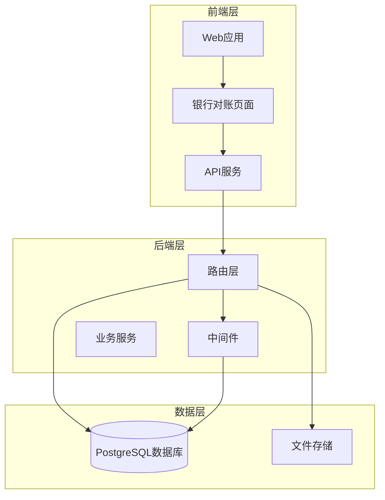
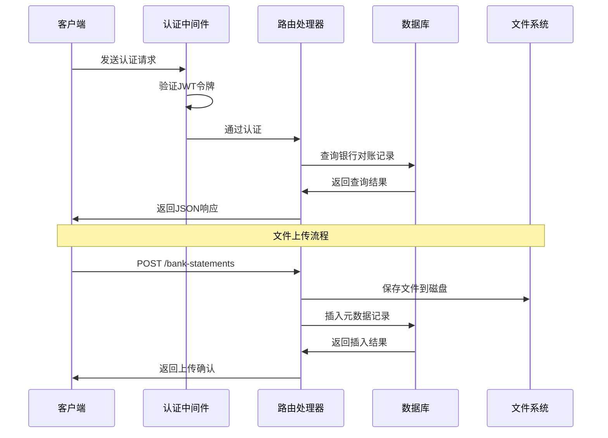
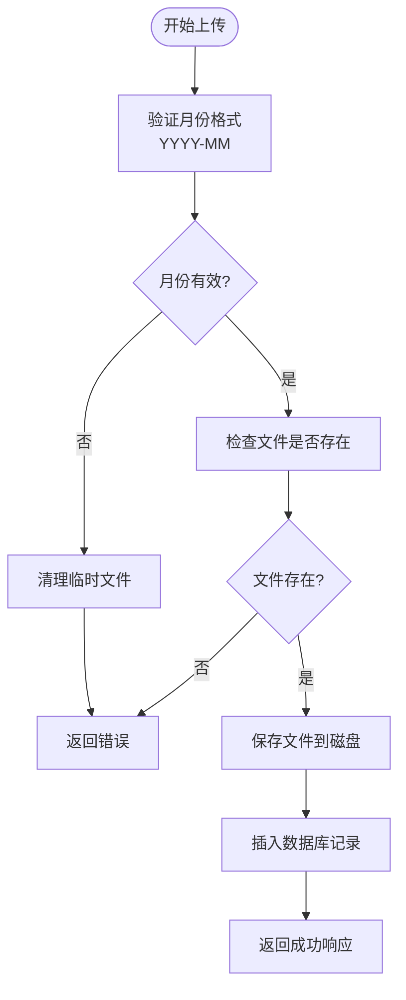
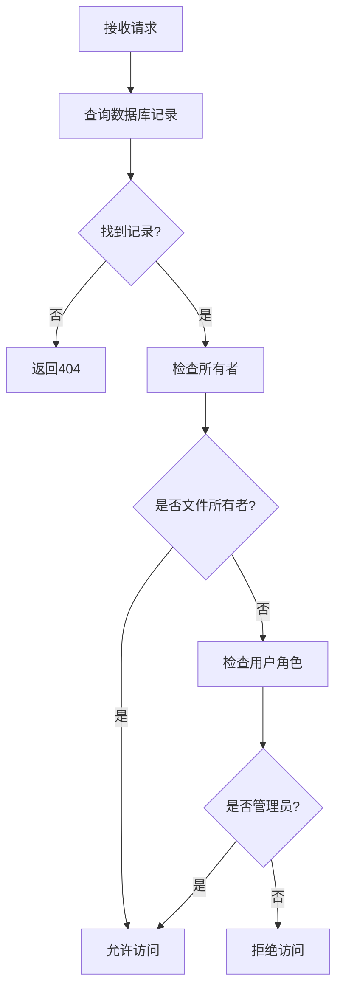
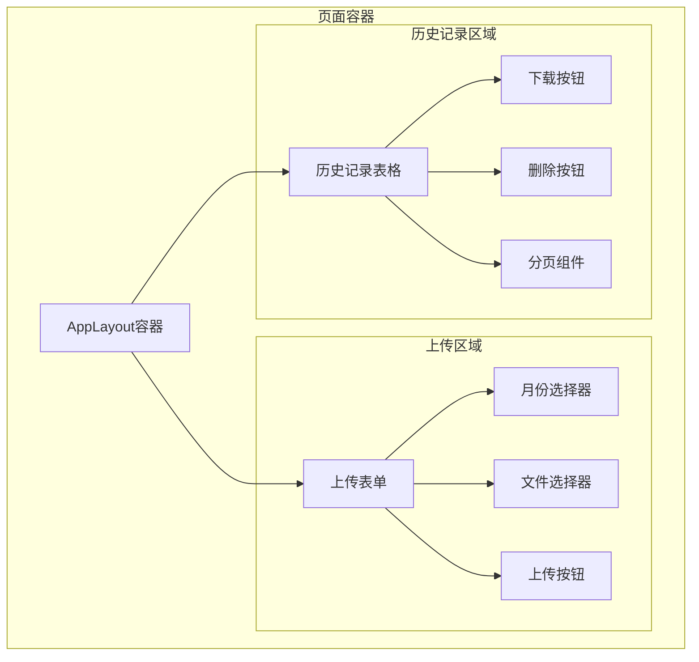
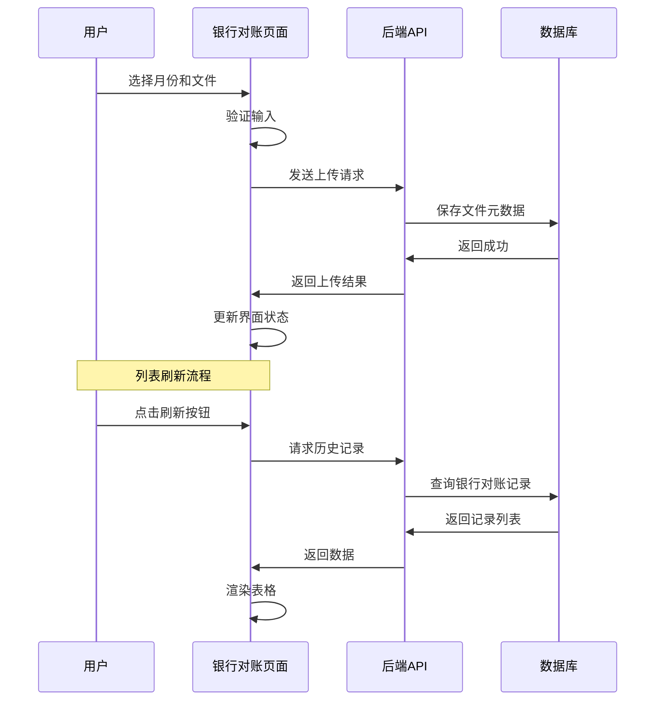
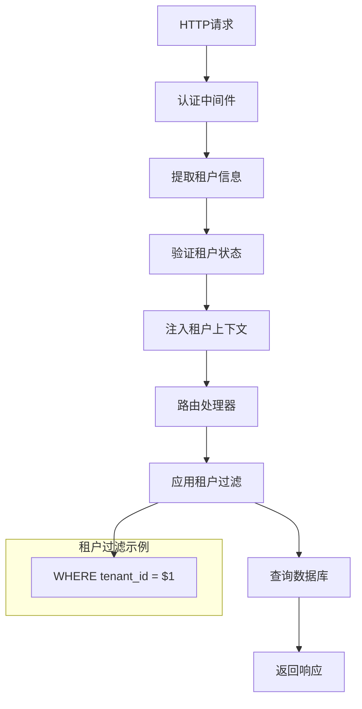
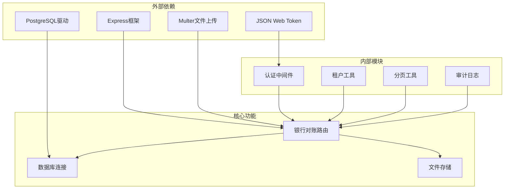

# 银行对账表

<cite>
**本文档引用的文件**
- [bankStatementRoutes.js](file://server/src/routes/bankStatementRoutes.js)
- [schema.sql](file://server/database/schema.sql)
- [BankStatementsPage.vue](file://web/src/pages/BankStatementsPage.vue)
- [auth.js](file://server/src/middleware/auth.js)
- [tenant.js](file://server/src/utils/tenant.js)
- [auditTrail.js](file://server/src/middleware/auditTrail.js)
</cite>

## 目录
1. [简介](#简介)
2. [项目结构](#项目结构)
3. [核心组件](#核心组件)
4. [架构概览](#架构概览)
5. [详细组件分析](#详细组件分析)
6. [依赖关系分析](#依赖关系分析)
7. [性能考虑](#性能考虑)
8. [故障排除指南](#故障排除指南)
9. [结论](#结论)

## 简介

银行对账表（bank_statements）是库存管理系统中的重要财务模块，专门用于管理和处理银行对账单文件。该系统提供了完整的银行对账单生命周期管理，包括文件上传、存储、下载、删除以及权限控制等功能。

本系统采用现代化的技术栈，前端使用Vue.js框架，后端使用Node.js和Express，数据库采用PostgreSQL。系统设计遵循租户隔离原则，确保多用户环境下的数据安全和独立性。

## 项目结构

银行对账功能在项目中的组织结构如下：



**图表来源**
- [bankStatementRoutes.js:1-261](file://server/src/routes/bankStatementRoutes.js#L1-L261)
- [schema.sql:398-408](file://server/database/schema.sql#L398-L408)

**章节来源**
- [bankStatementRoutes.js:1-261](file://server/src/routes/bankStatementRoutes.js#L1-L261)
- [schema.sql:398-408](file://server/database/schema.sql#L398-L408)

## 核心组件

### 数据库表结构

银行对账表采用以下核心字段设计：

| 字段名 | 数据类型 | 约束条件 | 描述 |
|--------|----------|----------|------|
| id | SERIAL | PRIMARY KEY | 主键标识符 |
| uploaded_by | INTEGER | NOT NULL, REFERENCES users | 上传者用户ID |
| statement_month | DATE | NOT NULL | 对账单所属月份 |
| original_name | TEXT | NOT NULL | 原始文件名 |
| storage_path | TEXT | NOT NULL | 存储路径 |
| mime_type | TEXT | NOT NULL | 文件MIME类型 |
| file_size | INTEGER | NOT NULL | 文件大小（字节） |
| created_at | TIMESTAMP | DEFAULT CURRENT_TIMESTAMP | 创建时间 |

### 关键索引设计

系统为银行对账表建立了多个关键索引以优化查询性能：

- `idx_bank_statements_uploaded_by`: 按上传者查询优化
- `idx_bank_statements_statement_month`: 按月份排序优化

**章节来源**
- [schema.sql:398-408](file://server/database/schema.sql#L398-L408)
- [schema.sql:445-446](file://server/database/schema.sql#L445-L446)

## 架构概览

银行对账系统的整体架构采用分层设计，确保职责分离和可维护性：



**图表来源**
- [bankStatementRoutes.js:81-169](file://server/src/routes/bankStatementRoutes.js#L81-L169)
- [auth.js:5-61](file://server/src/middleware/auth.js#L5-L61)

## 详细组件分析

### 文件上传组件

文件上传功能实现了完整的文件管理流程，包括格式验证、大小限制和安全存储。

#### 上传流程图



**图表来源**
- [bankStatementRoutes.js:116-169](file://server/src/routes/bankStatementRoutes.js#L116-L169)

#### 支持的文件格式

系统支持以下文件格式：
- PDF文档：application/pdf
- 图片文件：image/jpeg, image/png, image/webp
- Excel电子表格：application/vnd.openxmlformats-officedocument.spreadsheetml.sheet, application/vnd.ms-excel

#### 文件命名策略

系统采用统一的文件命名规范：
```
u{用户ID}_{YYYY-MM}_{时间戳}{扩展名}
```

例如：`u123_2024-01_1704067200000.pdf`

**章节来源**
- [bankStatementRoutes.js:29-53](file://server/src/routes/bankStatementRoutes.js#L29-L53)
- [bankStatementRoutes.js:116-169](file://server/src/routes/bankStatementRoutes.js#L116-L169)

### 权限控制系统

系统实现了严格的权限控制机制，确保数据安全：

#### 权限验证流程



**图表来源**
- [bankStatementRoutes.js:188-190](file://server/src/routes/bankStatementRoutes.js#L188-L190)

#### 角色权限矩阵

| 操作 | 普通用户 | 管理员 | 超级管理员 |
|------|----------|--------|------------|
| 上传对账单 | ✅ | ✅ | ✅ |
| 下载对账单 | 仅限自己 | ✅ | ✅ |
| 删除对账单 | 仅限自己 | ✅ | ✅ |
| 查看列表 | 仅限自己 | ✅ | ✅ |

**章节来源**
- [bankStatementRoutes.js:188-190](file://server/src/routes/bankStatementRoutes.js#L188-L190)
- [auth.js:64-88](file://server/src/middleware/auth.js#L64-L88)

### 前端用户界面

前端银行对账页面提供了直观的用户交互体验：

#### 页面布局结构



**图表来源**
- [BankStatementsPage.vue:128-279](file://web/src/pages/BankStatementsPage.vue#L128-L279)

#### 用户交互流程



**图表来源**
- [BankStatementsPage.vue:46-95](file://web/src/pages/BankStatementsPage.vue#L46-L95)

**章节来源**
- [BankStatementsPage.vue:1-279](file://web/src/pages/BankStatementsPage.vue#L1-L279)

### 租户隔离机制

系统采用多租户架构，确保不同公司或部门的数据完全隔离：

#### 租户上下文流程



**图表来源**
- [auth.js:14-57](file://server/src/middleware/auth.js#L14-L57)
- [tenant.js:9-14](file://server/src/utils/tenant.js#L9-L14)

**章节来源**
- [auth.js:1-96](file://server/src/middleware/auth.js#L1-L96)
- [tenant.js:1-43](file://server/src/utils/tenant.js#L1-L43)

## 依赖关系分析

银行对账系统的依赖关系体现了清晰的分层架构：



**图表来源**
- [bankStatementRoutes.js:1-10](file://server/src/routes/bankStatementRoutes.js#L1-L10)
- [auth.js:1-3](file://server/src/middleware/auth.js#L1-L3)

### 关键依赖关系

1. **认证依赖**: 所有银行对账操作都依赖于认证中间件
2. **租户隔离**: 通过租户工具确保数据隔离
3. **文件存储**: 使用Multer进行文件上传和存储
4. **数据库访问**: 通过统一的数据库连接池访问

**章节来源**
- [bankStatementRoutes.js:1-261](file://server/src/routes/bankStatementRoutes.js#L1-L261)

## 性能考虑

### 查询优化策略

系统采用了多种查询优化技术：

1. **索引优化**: 为常用查询字段建立索引
2. **分页查询**: 实现大数据量的分页处理
3. **并发查询**: 使用Promise.all并行执行查询

### 存储优化

1. **文件大小限制**: 限制单个文件最大25MB
2. **磁盘空间管理**: 自动清理临时文件
3. **缓存策略**: 合理使用浏览器缓存

## 故障排除指南

### 常见问题及解决方案

#### 文件上传失败

**问题症状**: 上传时返回错误消息

**可能原因**:
1. 文件格式不支持
2. 文件大小超过限制
3. 月份格式无效

**解决步骤**:
1. 检查文件格式是否在支持列表内
2. 确认文件大小不超过25MB
3. 验证月份格式为YYYY-MM

#### 权限访问被拒绝

**问题症状**: 下载或删除文件时报403错误

**可能原因**:
1. 非文件所有者尝试访问
2. 用户角色权限不足
3. 租户上下文缺失

**解决步骤**:
1. 确认当前登录用户是否为文件所有者
2. 检查用户角色是否为管理员
3. 验证认证令牌的有效性

#### 文件不存在

**问题症状**: 下载时返回404错误

**可能原因**:
1. 文件已被删除
2. 存储路径配置错误
3. 数据库记录与实际文件不匹配

**解决步骤**:
1. 检查数据库中的文件记录
2. 验证存储目录权限
3. 确认文件物理存在性

**章节来源**
- [bankStatementRoutes.js:245-258](file://server/src/routes/bankStatementRoutes.js#L245-L258)

## 结论

银行对账表系统是一个功能完整、安全可靠的财务数据管理解决方案。系统的主要特点包括：

1. **安全性**: 实现了严格的权限控制和租户隔离
2. **可靠性**: 提供完整的错误处理和故障恢复机制
3. **可扩展性**: 采用模块化设计，便于功能扩展
4. **用户体验**: 提供直观的前端界面和流畅的操作体验

该系统为财务人员和系统管理员提供了准确的银行对账数据模型，支持完整的对账单生命周期管理，包括文件上传、存储、检索和删除等核心功能。通过合理的架构设计和技术选型，系统能够满足企业级应用的安全性和性能要求。

对于未来的改进方向，建议考虑集成自动对账算法、增强数据分析功能以及完善报表生成功能，以进一步提升系统的智能化水平和用户体验。