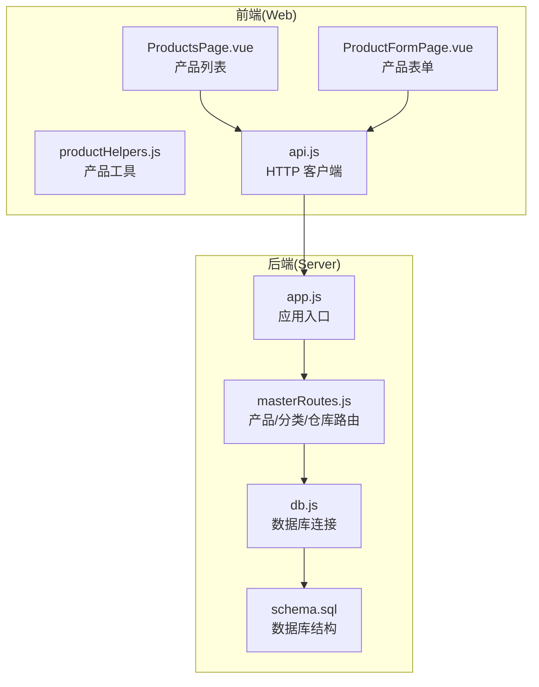
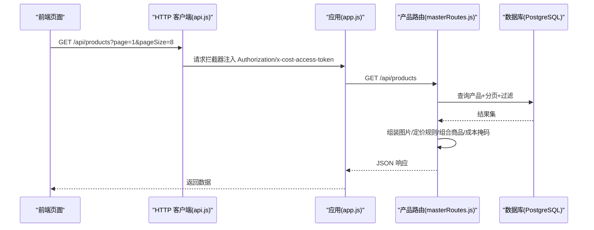
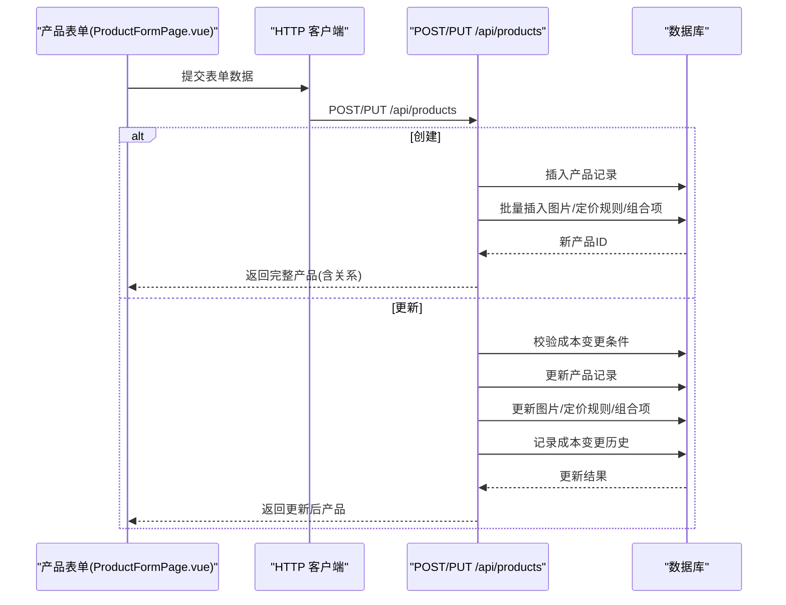
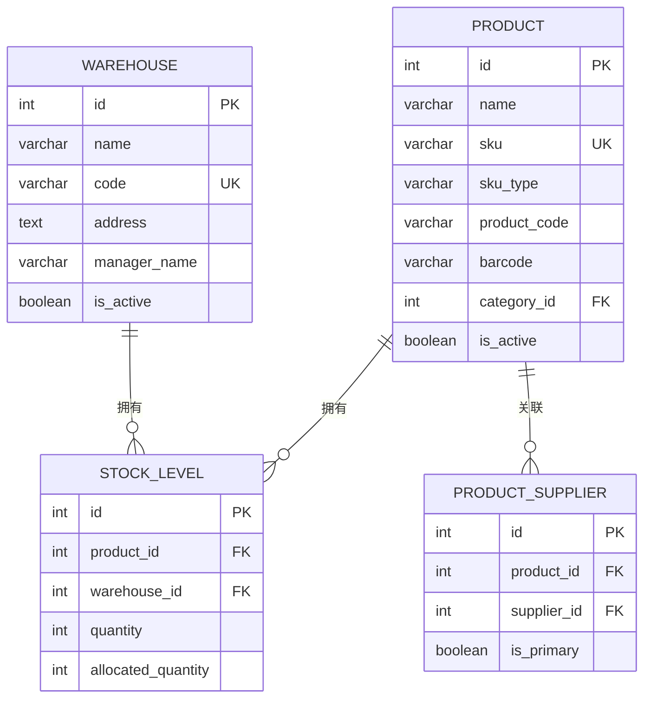
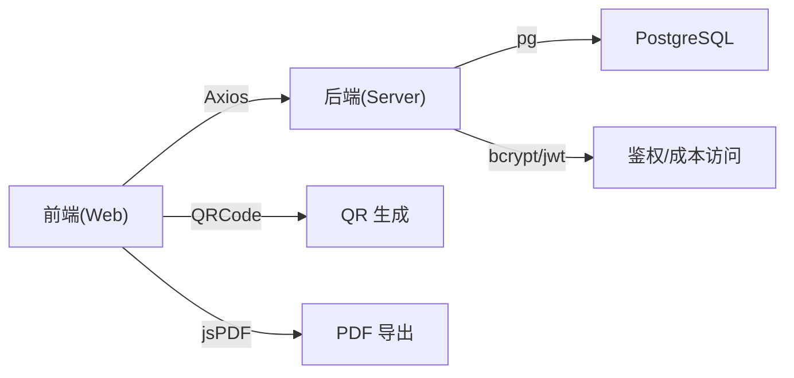
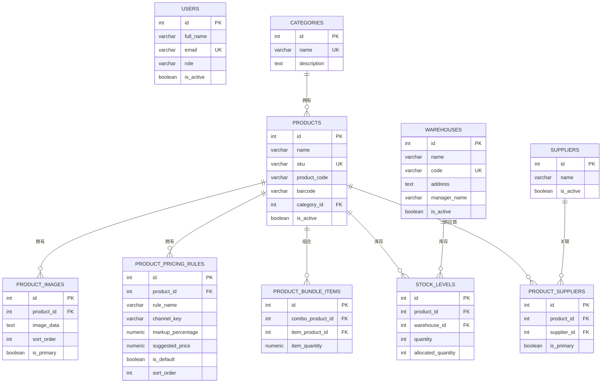

# 产品主数据管理

<cite>
**本文档引用的文件**
- [server/src/app.js](file://server/src/app.js)
- [server/src/server.js](file://server/src/server.js)
- [server/src/config/db.js](file://server/src/config/db.js)
- [server/src/routes/masterRoutes.js](file://server/src/routes/masterRoutes.js)
- [server/database/schema.sql](file://server/database/schema.sql)
- [server/database/seed.sql](file://server/database/seed.sql)
- [web/src/pages/ProductsPage.vue](file://web/src/pages/ProductsPage.vue)
- [web/src/pages/ProductFormPage.vue](file://web/src/pages/ProductFormPage.vue)
- [web/src/utils/productHelpers.js](file://web/src/utils/productHelpers.js)
- [web/src/services/api.js](file://web/src/services/api.js)
</cite>

## 目录
1. [简介](#简介)
2. [项目结构](#项目结构)
3. [核心组件](#核心组件)
4. [架构总览](#架构总览)
5. [详细组件分析](#详细组件分析)
6. [依赖分析](#依赖分析)
7. [性能考虑](#性能考虑)
8. [故障排查指南](#故障排查指南)
9. [结论](#结论)
10. [附录](#附录)

## 简介
本系统为产品主数据管理平台，覆盖产品全生命周期管理：CRUD 操作、产品分类、属性定义、信息维护、条形码与编码体系、SKU 规则、与仓库的关联及多仓库库存配置、产品规格与定价规则、搜索筛选排序、以及成本保护与版本化变更记录。系统采用前后端分离架构，后端基于 Node.js + Express + PostgreSQL，前端基于 Vue 3 + Vite，提供产品列表、表单、批量操作、标签打印与导出等能力。

## 项目结构
- 后端服务
  - 应用入口与中间件：应用启动、CORS、Helmet、日志、审计、统一响应包装
  - 数据库连接：PostgreSQL 连接池与 SSL 自动判断
  - 路由模块：产品、分类、仓库、库存、通知、设置等业务路由
  - 工具与中间件：分页、审计日志、鉴权、限流、响应格式化
- 前端应用
  - 页面组件：产品列表、产品表单、分类、仓库等
  - 工具函数：产品相关辅助（定价规则、条形码、图片处理、标签打印）
  - 服务层：Axios 封装，自动注入认证与成本访问令牌

**图表来源**
- [server/src/app.js:1-67](file://server/src/app.js#L1-L67)
- [server/src/config/db.js:1-25](file://server/src/config/db.js#L1-L25)
- [server/src/routes/masterRoutes.js:1-120](file://server/src/routes/masterRoutes.js#L1-L120)
- [web/src/pages/ProductsPage.vue:1-120](file://web/src/pages/ProductsPage.vue#L1-L120)
- [web/src/pages/ProductFormPage.vue:1-60](file://web/src/pages/ProductFormPage.vue#L1-L60)
- [web/src/utils/productHelpers.js:1-40](file://web/src/utils/productHelpers.js#L1-L40)
- [web/src/services/api.js:1-45](file://web/src/services/api.js#L1-L45)

**章节来源**
- [server/src/app.js:1-67](file://server/src/app.js#L1-L67)
- [server/src/server.js:1-28](file://server/src/server.js#L1-L28)
- [server/src/config/db.js:1-25](file://server/src/config/db.js#L1-L25)
- [server/database/schema.sql:1-120](file://server/database/schema.sql#L1-L120)
- [web/src/pages/ProductsPage.vue:1-120](file://web/src/pages/ProductsPage.vue#L1-L120)
- [web/src/pages/ProductFormPage.vue:1-60](file://web/src/pages/ProductFormPage.vue#L1-L60)
- [web/src/utils/productHelpers.js:1-40](file://web/src/utils/productHelpers.js#L1-L40)
- [web/src/services/api.js:1-45](file://web/src/services/api.js#L1-L45)

## 核心组件
- 产品路由与业务逻辑
  - 支持搜索、分页、状态过滤、是否含条形码过滤、按分类筛选
  - 成本价格访问令牌机制，管理员/经理可临时解锁查看成本
  - 默认定价规则与活动渠道定价规则解析与返回
  - 图片、定价规则、组合商品（SKU 类型）的批量持久化
- 前端产品页面
  - 列表页：搜索、筛选、分页、批量打印/下载标签、成本解锁/隐藏
  - 表单页：基础信息、图片上传与预览、定价规则、组合商品、成本变更原因、成本解锁
- 数据模型
  - 产品表：名称、SKU、SKU 类型、商品编码、条形码、描述、单位、成本/售价/加价率/建议价、重购线、状态
  - 关联表：产品图片、定价规则、组合商品项、仓库库存、供应商关联
- 数据库结构
  - 包含产品、分类、仓库、库存、移动、同步快照、通知、设置、审计日志等核心表
  - 大量索引优化查询性能

**章节来源**
- [server/src/routes/masterRoutes.js:890-1089](file://server/src/routes/masterRoutes.js#L890-L1089)
- [server/src/routes/masterRoutes.js:1258-1513](file://server/src/routes/masterRoutes.js#L1258-L1513)
- [web/src/pages/ProductsPage.vue:208-242](file://web/src/pages/ProductsPage.vue#L208-L242)
- [web/src/pages/ProductFormPage.vue:87-124](file://web/src/pages/ProductFormPage.vue#L87-L124)
- [server/database/schema.sql:32-133](file://server/database/schema.sql#L32-L133)

## 架构总览
系统采用“前端 SPA + 后端 REST API + PostgreSQL”三层架构。前端通过 Axios 发起请求，自动附加认证与成本访问令牌；后端路由负责鉴权、参数校验、数据持久化与关联查询；数据库通过连接池提供高并发访问。

**图表来源**
- [web/src/services/api.js:1-45](file://web/src/services/api.js#L1-L45)
- [server/src/app.js:1-67](file://server/src/app.js#L1-L67)
- [server/src/routes/masterRoutes.js:890-1089](file://server/src/routes/masterRoutes.js#L890-L1089)

**章节来源**
- [server/src/app.js:1-67](file://server/src/app.js#L1-L67)
- [server/src/server.js:1-28](file://server/src/server.js#L1-L28)
- [server/src/config/db.js:1-25](file://server/src/config/db.js#L1-L25)
- [web/src/services/api.js:1-45](file://web/src/services/api.js#L1-L45)

## 详细组件分析

### 产品 CRUD 流程
- 创建流程
  - 校验必填字段（名称、SKU），生成默认定价规则与主图
  - 并行保存产品图片、定价规则、组合商品项
  - 可选设置主供应商
- 更新流程
  - 校验存在性与成本变更条件（需成本访问令牌与变更原因）
  - 更新产品基础信息与默认定价规则
  - 并行更新图片、定价规则、组合商品
  - 记录成本变更历史与阈值通知策略
- 删除流程
  - 管理员权限，级联删除产品相关数据

**图表来源**
- [web/src/pages/ProductFormPage.vue:126-171](file://web/src/pages/ProductFormPage.vue#L126-L171)
- [server/src/routes/masterRoutes.js:1258-1513](file://server/src/routes/masterRoutes.js#L1258-L1513)

**章节来源**
- [web/src/pages/ProductFormPage.vue:126-171](file://web/src/pages/ProductFormPage.vue#L126-L171)
- [server/src/routes/masterRoutes.js:1258-1513](file://server/src/routes/masterRoutes.js#L1258-L1513)

### 产品分类管理
- 分类接口支持搜索、分页与全量加载
- 前端列表页加载分类并用于筛选
- 产品创建/更新时可绑定分类

**章节来源**
- [server/src/routes/masterRoutes.js:664-773](file://server/src/routes/masterRoutes.js#L664-L773)
- [web/src/pages/ProductsPage.vue:212-229](file://web/src/pages/ProductsPage.vue#L212-L229)

### 产品属性定义与信息维护
- 属性字段
  - 基础：名称、SKU、SKU 类型(SINGLE/COMBO)、商品编码、条形码、单位、状态
  - 成本与定价：成本价、售价、加价率、建议价、定价规则
  - 库存与补货：重购线
  - 描述：描述、使用说明、优点、缺点
  - 关系：分类、主供应商、图片、组合商品项
- 前端表单与列表均展示上述字段，并支持批量操作与成本保护

**章节来源**
- [server/database/schema.sql:32-54](file://server/database/schema.sql#L32-L54)
- [web/src/pages/ProductFormPage.vue:27-50](file://web/src/pages/ProductFormPage.vue#L27-L50)
- [web/src/pages/ProductsPage.vue:56-78](file://web/src/pages/ProductsPage.vue#L56-L78)

### 产品条形码管理与编码体系
- 条形码字段唯一约束，支持按条形码搜索
- 商品编码（product_code）唯一且可自动生成
- 前端提供条形码扫描识别（以 PRD- 前缀区分商品编码与普通条码）

**章节来源**
- [server/database/schema.sql:37-38](file://server/database/schema.sql#L37-L38)
- [web/src/pages/ProductsPage.vue:383-391](file://web/src/pages/ProductsPage.vue#L383-L391)
- [web/src/utils/productHelpers.js:17-19](file://web/src/utils/productHelpers.js#L17-L19)

### SKU 生成规则
- SKU 必填且唯一
- SKU 类型支持 SINGLE 与 COMBO（组合商品）
- 组合商品项：内含子商品与数量，用于拆解与销售

**章节来源**
- [server/database/schema.sql:35-36](file://server/database/schema.sql#L35-L36)
- [server/database/schema.sql:80-87](file://server/database/schema.sql#L80-L87)
- [server/src/routes/masterRoutes.js:433-463](file://server/src/routes/masterRoutes.js#L433-L463)

### 产品与仓库关联、多仓库库存配置
- 仓库表：名称、编码、地址、负责人、状态
- 库存表：产品-仓库唯一键，记录在库量与占用量
- 产品详情页展示各仓库的可用量、占用量与更新时间
- 支持主供应商设置与历史记录

**图表来源**
- [server/database/schema.sql:22-30](file://server/database/schema.sql#L22-L30)
- [server/database/schema.sql:32-54](file://server/database/schema.sql#L32-L54)
- [server/database/schema.sql:125-133](file://server/database/schema.sql#L125-L133)
- [server/database/schema.sql:348-356](file://server/database/schema.sql#L348-L356)

**章节来源**
- [server/database/schema.sql:22-30](file://server/database/schema.sql#L22-L30)
- [server/database/schema.sql:125-133](file://server/database/schema.sql#L125-L133)
- [server/src/routes/masterRoutes.js:1054-1110](file://server/src/routes/masterRoutes.js#L1054-L1110)

### 产品规格管理与定价规则
- 默认定价规则：根据成本价与加价率计算建议价
- 多渠道定价规则：支持零售/批发/VIP 等渠道，可指定默认规则
- 前端支持添加/删除/设置默认/同步规则，自动计算建议价

**章节来源**
- [server/src/routes/masterRoutes.js:41-93](file://server/src/routes/masterRoutes.js#L41-L93)
- [web/src/utils/productHelpers.js:27-44](file://web/src/utils/productHelpers.js#L27-L44)
- [web/src/pages/ProductFormPage.vue:126-171](file://web/src/pages/ProductFormPage.vue#L126-L171)

### 搜索、筛选与排序
- 搜索范围：名称、SKU、商品编码、条形码、描述、分类名
- 筛选维度：分类ID、状态(all/active/inactive)、是否含条形码(yes/no/all)
- 排序：按创建时间倒序
- 分页：统一分页参数与构建器

**章节来源**
- [server/src/routes/masterRoutes.js:890-1089](file://server/src/routes/masterRoutes.js#L890-L1089)

### 成本保护与版本控制
- 成本访问令牌：管理员/经理凭密码换取短期 JWT，携带 x-cost-access-token 请求头
- 成本字段掩码：未授权时返回空值，授权后返回真实值
- 成本变更记录：变更历史表仅保留最近 N 条，支持阈值触发通知策略

**章节来源**
- [server/src/routes/masterRoutes.js:95-137](file://server/src/routes/masterRoutes.js#L95-L137)
- [server/src/routes/masterRoutes.js:234-281](file://server/src/routes/masterRoutes.js#L234-L281)

### 数据导入导出与批量操作
- 导出
  - 单个/批量 QR 标签 PNG 下载
  - 批量 PDF 导出（A4 布局，双列排版）
- 批量操作
  - 列表页支持全选当前页、批量打印/下载
- 前端工具：QR 生成、HTML 打印、PDF 导出、图片压缩裁剪

**章节来源**
- [web/src/pages/ProductsPage.vue:547-598](file://web/src/pages/ProductsPage.vue#L547-L598)
- [web/src/utils/productHelpers.js:46-166](file://web/src/utils/productHelpers.js#L46-L166)

## 依赖分析
- 前端依赖
  - Axios：HTTP 客户端封装，自动注入认证与成本访问令牌
  - QRCode：生成产品 QR 码
  - jsPDF：批量导出 PDF
- 后端依赖
  - Express：Web 框架
  - pg：PostgreSQL 连接池
  - bcrypt：密码哈希与比对
  - JWT：成本访问令牌签发与校验
  - Morgan/Helmet/Cors：安全与日志中间件

**图表来源**
- [web/src/services/api.js:1-45](file://web/src/services/api.js#L1-L45)
- [server/src/config/db.js:1-25](file://server/src/config/db.js#L1-L25)
- [server/src/routes/masterRoutes.js:95-137](file://server/src/routes/masterRoutes.js#L95-L137)
- [web/src/utils/productHelpers.js:1-196](file://web/src/utils/productHelpers.js#L1-L196)

**章节来源**
- [web/src/services/api.js:1-45](file://web/src/services/api.js#L1-L45)
- [server/src/config/db.js:1-25](file://server/src/config/db.js#L1-L25)
- [server/src/routes/masterRoutes.js:95-137](file://server/src/routes/masterRoutes.js#L95-L137)
- [web/src/utils/productHelpers.js:1-196](file://web/src/utils/productHelpers.js#L1-L196)

## 性能考虑
- 数据库层面
  - 为产品、图片、定价规则、库存、移动、供应商等建立索引，提升查询效率
  - 使用连接池与超时控制，避免长事务与阻塞
- 接口层面
  - 列表接口支持 all=false 的分页查询，避免一次性全量拉取
  - 关联数据按需加载（图片、定价规则、组合项），减少响应体积
- 前端层面
  - 图片上传前本地压缩与裁剪，降低带宽与存储压力
  - 批量操作使用并行请求与分页加载，提升交互体验

**章节来源**
- [server/database/schema.sql:410-447](file://server/database/schema.sql#L410-L447)
- [server/src/routes/masterRoutes.js:890-1089](file://server/src/routes/masterRoutes.js#L890-L1089)
- [web/src/utils/productHelpers.js:168-196](file://web/src/utils/productHelpers.js#L168-L196)

## 故障排查指南
- 常见错误与定位
  - 400：必填字段缺失或参数非法（如名称、SKU）
  - 401：成本访问令牌无效或过期
  - 403：无权限修改成本或非管理员操作
  - 404：产品不存在
  - 500：数据库异常或服务内部错误
- 排查步骤
  - 检查请求头是否包含正确的 Authorization 与 x-cost-access-token
  - 确认数据库连接与索引是否存在
  - 查看审计日志与系统通知，定位具体操作与错误上下文
- 建议
  - 对外暴露的接口统一使用响应包装中间件，避免泄露堆栈
  - 成本变更强制要求原因与令牌，确保可追溯

**章节来源**
- [server/src/app.js:57-64](file://server/src/app.js#L57-L64)
- [server/src/routes/masterRoutes.js:1024-1052](file://server/src/routes/masterRoutes.js#L1024-L1052)
- [server/src/routes/masterRoutes.js:1390-1412](file://server/src/routes/masterRoutes.js#L1390-L1412)

## 结论
该系统围绕产品主数据提供了完整的 CRUD、分类、属性、条形码与编码、SKU 规则、定价与成本保护、仓库与库存、搜索筛选、批量导出与打印等能力。通过合理的数据库设计、鉴权与成本访问令牌机制、以及前后端协作，满足了中小企业的日常运营需求。建议在生产环境中进一步完善数据校验、审计与监控，持续优化查询与导出性能。

## 附录

### 数据模型概览

**图表来源**
- [server/database/schema.sql:2-11](file://server/database/schema.sql#L2-L11)
- [server/database/schema.sql:15-20](file://server/database/schema.sql#L15-L20)
- [server/database/schema.sql:32-54](file://server/database/schema.sql#L32-L54)
- [server/database/schema.sql:71-78](file://server/database/schema.sql#L71-L78)
- [server/database/schema.sql:99-109](file://server/database/schema.sql#L99-L109)
- [server/database/schema.sql:80-87](file://server/database/schema.sql#L80-L87)
- [server/database/schema.sql:22-30](file://server/database/schema.sql#L22-L30)
- [server/database/schema.sql:125-133](file://server/database/schema.sql#L125-L133)
- [server/database/schema.sql:302-318](file://server/database/schema.sql#L302-L318)
- [server/database/schema.sql:348-356](file://server/database/schema.sql#L348-L356)