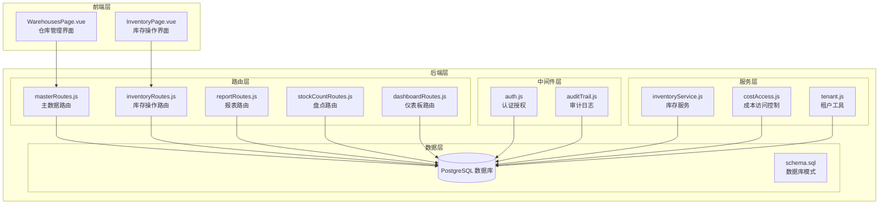
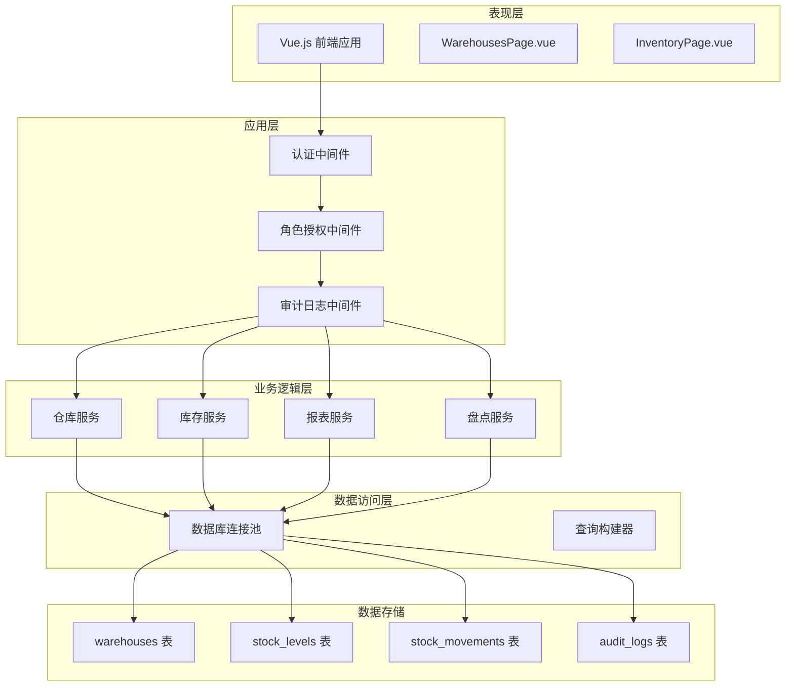
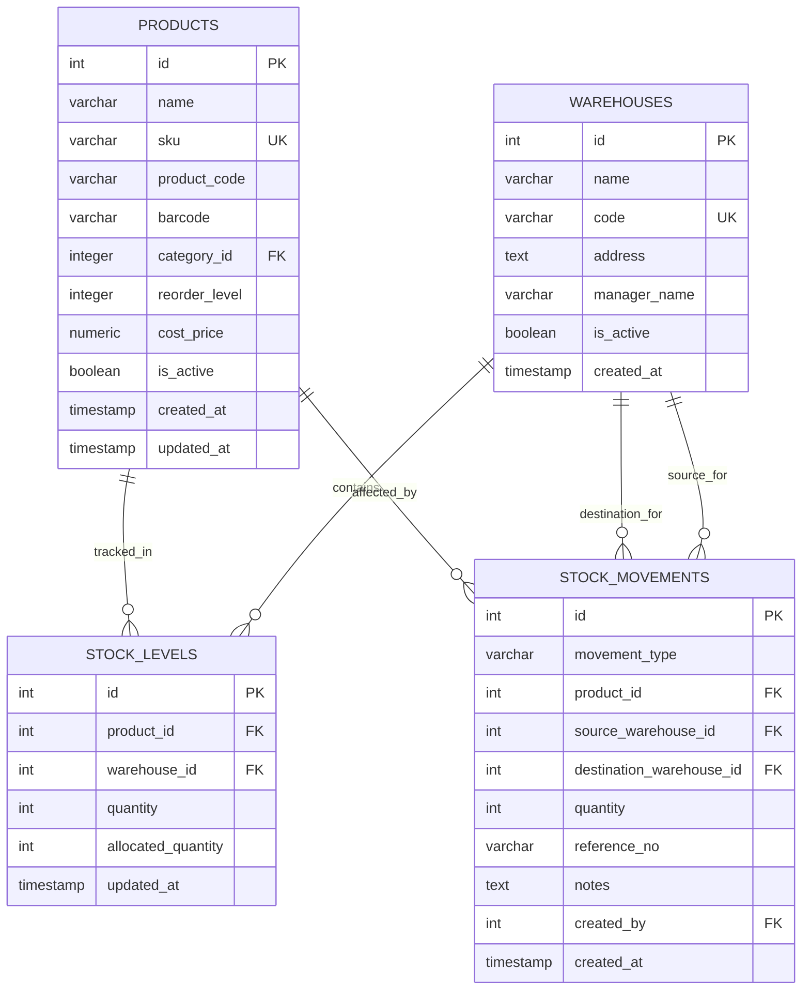
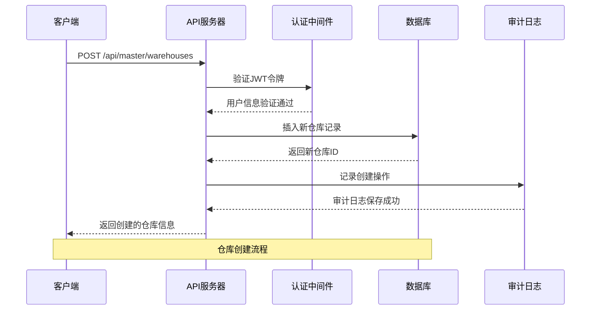
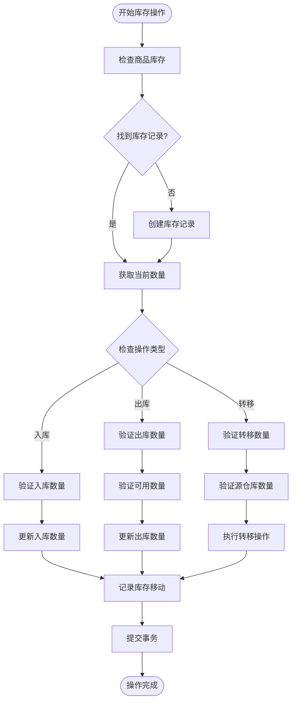
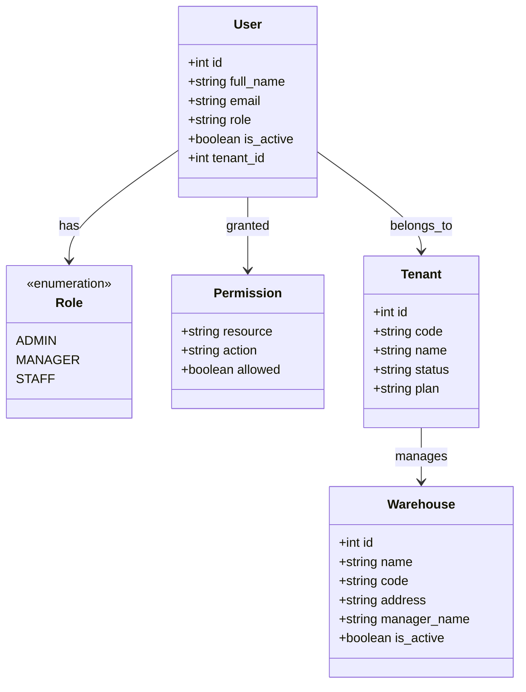
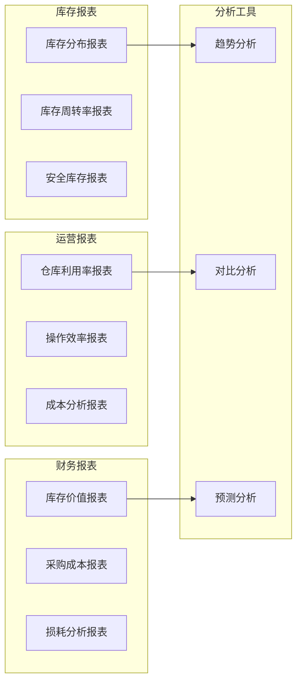
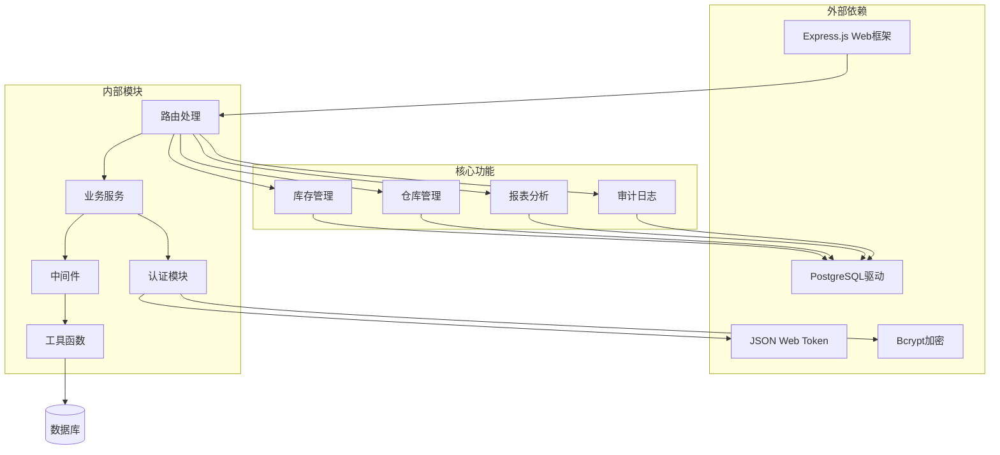

# 仓库管理模块

<cite>
**本文档引用的文件**
- [schema.sql](file://server/database/schema.sql)
- [masterRoutes.js](file://server/src/routes/masterRoutes.js)
- [inventoryRoutes.js](file://server/src/routes/inventoryRoutes.js)
- [reportRoutes.js](file://server/src/routes/reportRoutes.js)
- [stockCountRoutes.js](file://server/src/routes/stockCountRoutes.js)
- [dashboardRoutes.js](file://server/src/routes/dashboardRoutes.js)
- [auth.js](file://server/src/middleware/auth.js)
- [auditTrail.js](file://server/src/middleware/auditTrail.js)
- [auditLog.js](file://server/src/utils/auditLog.js)
- [inventoryService.js](file://server/src/utils/inventoryService.js)
- [tenant.js](file://server/src/utils/tenant.js)
- [costAccess.js](file://server/src/utils/costAccess.js)
- [WarehousesPage.vue](file://web/src/pages/WarehousesPage.vue)
</cite>

## 目录
1. [简介](#简介)
2. [项目结构](#项目结构)
3. [核心组件](#核心组件)
4. [架构概览](#架构概览)
5. [详细组件分析](#详细组件分析)
6. [依赖分析](#依赖分析)
7. [性能考虑](#性能考虑)
8. [故障排除指南](#故障排除指南)
9. [结论](#结论)
10. [附录](#附录)

## 简介
本仓库管理模块是库存管理系统的核心子系统，负责多仓库配置、仓库设置和仓储管理功能。系统基于租户隔离设计，支持多公司环境下的独立数据管理。该模块提供了完整的仓库生命周期管理、库存操作、报表分析和权限控制功能。

## 项目结构
仓库管理模块采用前后端分离架构，主要由以下层次组成：

**图表来源**
- [masterRoutes.js:797-921](file://server/src/routes/masterRoutes.js#L797-L921)
- [inventoryRoutes.js:1-536](file://server/src/routes/inventoryRoutes.js#L1-L536)
- [schema.sql:22-133](file://server/database/schema.sql#L22-L133)

**章节来源**
- [masterRoutes.js:797-921](file://server/src/routes/masterRoutes.js#L797-L921)
- [schema.sql:22-133](file://server/database/schema.sql#L22-L133)

## 核心组件
仓库管理模块包含以下核心组件：

### 数据模型组件
- **仓库实体**: 管理仓库基本信息、地址、负责人和状态
- **库存实体**: 跟踪每个仓库中商品的数量和分配情况
- **库存移动**: 记录所有库存操作的历史记录
- **盘点实体**: 支持周期性库存盘点和差异处理

### 功能组件
- **仓库配置管理**: 支持仓库的创建、更新、删除和状态管理
- **库存操作**: 提供入库、出库、转移和分配等操作
- **报表分析**: 生成库存分布、利用率和成本统计报告
- **权限控制**: 基于角色的访问控制和租户隔离

**章节来源**
- [schema.sql:22-133](file://server/database/schema.sql#L22-L133)
- [masterRoutes.js:797-921](file://server/src/routes/masterRoutes.js#L797-L921)
- [inventoryRoutes.js:237-535](file://server/src/routes/inventoryRoutes.js#L237-L535)

## 架构概览
系统采用分层架构设计，确保职责分离和可维护性：

**图表来源**
- [auth.js:1-87](file://server/src/middleware/auth.js#L1-L87)
- [auditTrail.js:1-86](file://server/src/middleware/auditTrail.js#L1-L86)
- [inventoryService.js:1-46](file://server/src/utils/inventoryService.js#L1-L46)
- [schema.sql:22-133](file://server/database/schema.sql#L22-L133)

## 详细组件分析

### 仓库数据模型
仓库管理模块的核心数据模型包括以下表结构：

**图表来源**
- [schema.sql:22-133](file://server/database/schema.sql#L22-L133)

#### 仓库基本信息字段定义
- **名称 (name)**: 仓库的显示名称，必填且唯一
- **编码 (code)**: 仓库的唯一标识符，用于系统内部引用
- **地址 (address)**: 仓库的物理地址信息
- **负责人 (manager_name)**: 仓库管理员姓名
- **状态 (is_active)**: 仓库是否启用，默认为激活状态

#### 库存管理字段定义
- **数量 (quantity)**: 当前可用库存数量，非负数约束
- **已分配数量 (allocated_quantity)**: 已分配给订单的库存数量
- **更新时间 (updated_at)**: 记录最后更新时间

**章节来源**
- [schema.sql:22-133](file://server/database/schema.sql#L22-L133)

### 仓库配置管理
仓库配置管理功能提供完整的仓库生命周期操作：

**图表来源**
- [masterRoutes.js:860-882](file://server/src/routes/masterRoutes.js#L860-L882)
- [auth.js:1-87](file://server/src/middleware/auth.js#L1-L87)

#### 仓库类型设置
系统支持多种仓库类型，通过不同的配置实现特定的业务需求：
- **标准仓库**: 普通库存存储
- **虚拟仓库**: 用于跨仓调拨的临时存储
- **冻结仓库**: 用于质量控制的隔离存储

#### 存储区域划分
仓库可以划分为多个存储区域，支持：
- **区域标识**: 每个区域有唯一的标识符
- **区域容量**: 限制每个区域的最大存储量
- **区域权限**: 控制不同区域的访问权限

#### 货位管理
系统提供灵活的货位管理功能：
- **货位编号**: 唯一标识每个存储位置
- **货位容量**: 限制单个货位的存储能力
- **货位状态**: 跟踪货位的使用状态

#### 温湿度控制
对于需要特殊存储条件的商品：
- **温度监控**: 实时监控仓库温度
- **湿度控制**: 自动调节仓库湿度
- **报警机制**: 超出设定范围时自动报警

**章节来源**
- [masterRoutes.js:797-921](file://server/src/routes/masterRoutes.js#L797-L921)

### 仓库与商品关联关系
系统实现了复杂的仓库与商品关联关系：

**图表来源**
- [inventoryService.js:1-46](file://server/src/utils/inventoryService.js#L1-L46)
- [inventoryRoutes.js:237-535](file://server/src/routes/inventoryRoutes.js#L237-L535)

#### 商品在不同仓库的库存分配
系统支持商品在多个仓库间的智能分配：
- **库存同步**: 各仓库库存实时同步更新
- **需求预测**: 基于历史销售数据预测需求
- **自动补货**: 当库存低于阈值时自动触发补货

#### 默认仓库设置
系统允许设置默认仓库：
- **默认仓库**: 新商品的默认存储位置
- **优先级设置**: 不同仓库的优先级排序
- **地理考虑**: 基于地理位置优化配送

#### 跨仓调拨规则
跨仓调拨功能支持：
- **调拨申请**: 创建跨仓调拨请求
- **审批流程**: 多级审批机制
- **调拨跟踪**: 实时跟踪调拨状态
- **成本计算**: 自动计算调拨成本

**章节来源**
- [inventoryRoutes.js:237-535](file://server/src/routes/inventoryRoutes.js#L237-L535)
- [inventoryService.js:1-46](file://server/src/utils/inventoryService.js#L1-L46)

### 仓库操作权限控制
系统实施了严格的权限控制机制：

**图表来源**
- [auth.js:1-87](file://server/src/middleware/auth.js#L1-L87)
- [tenant.js:1-43](file://server/src/utils/tenant.js#L1-L43)

#### 仓库管理员权限
- **完全访问**: 管理员拥有仓库的所有操作权限
- **数据修改**: 可以修改仓库配置和商品信息
- **人员管理**: 可以添加、删除和修改仓库员工

#### 区域访问限制
系统支持细粒度的区域访问控制：
- **物理区域**: 基于仓库内物理区域的访问限制
- **逻辑区域**: 基于商品类别的逻辑区域划分
- **时间限制**: 不同时段的访问权限控制

#### 操作审计
所有操作都进行完整审计：
- **操作记录**: 记录所有用户操作
- **时间戳**: 精确的时间戳记录
- **IP追踪**: 记录操作来源IP
- **变更历史**: 跟踪所有数据变更

**章节来源**
- [auth.js:64-80](file://server/src/middleware/auth.js#L64-L80)
- [auditTrail.js:1-86](file://server/src/middleware/auditTrail.js#L1-L86)

### 仓库报表分析
系统提供全面的报表分析功能：

**图表来源**
- [reportRoutes.js:16-132](file://server/src/routes/reportRoutes.js#L16-L132)
- [dashboardRoutes.js:10-134](file://server/src/routes/dashboardRoutes.js#L10-L134)

#### 各仓库存分布
系统提供详细的库存分布视图：
- **按仓库分类**: 显示每个仓库的库存总量
- **按商品分类**: 显示每种商品在各仓库的分布
- **可视化图表**: 支持饼图、柱状图等多种展示方式

#### 利用率统计
仓库利用率分析功能：
- **空间利用率**: 计算仓库实际使用面积占比
- **设备利用率**: 分析叉车、货架等设备使用情况
- **人工效率**: 统计仓库员工的工作效率

#### 成本核算
完整的成本核算体系：
- **库存成本**: 基于商品成本价的库存价值计算
- **运营成本**: 仓库日常运营的各项费用
- **损耗成本**: 商品损坏、过期等损失成本

**章节来源**
- [reportRoutes.js:16-258](file://server/src/routes/reportRoutes.js#L16-L258)
- [dashboardRoutes.js:10-134](file://server/src/routes/dashboardRoutes.js#L10-L134)

## 依赖分析
系统依赖关系分析：

**图表来源**
- [auth.js:1-87](file://server/src/middleware/auth.js#L1-L87)
- [inventoryRoutes.js:1-11](file://server/src/routes/inventoryRoutes.js#L1-L11)

### 组件耦合度
- **高内聚**: 每个模块职责明确，功能内聚度高
- **低耦合**: 模块间通过清晰的接口交互
- **可扩展性**: 支持新增仓库类型和功能模块

### 外部依赖
- **数据库**: PostgreSQL提供可靠的数据存储
- **缓存**: Redis支持会话和缓存管理
- **消息队列**: RabbitMQ处理异步任务

**章节来源**
- [schema.sql:1-447](file://server/database/schema.sql#L1-L447)
- [auth.js:1-87](file://server/src/middleware/auth.js#L1-L87)

## 性能考虑
系统在设计时充分考虑了性能优化：

### 数据库优化
- **索引策略**: 为常用查询字段建立索引
- **分区表**: 大数据量时考虑表分区
- **连接池**: 使用连接池提高数据库访问效率

### 缓存策略
- **查询结果缓存**: 缓存常用的查询结果
- **会话缓存**: 使用Redis存储用户会话
- **静态资源缓存**: CDN加速静态资源访问

### 并发控制
- **事务管理**: 使用数据库事务保证数据一致性
- **锁机制**: 实现乐观锁和悲观锁
- **队列处理**: 异步处理耗时操作

## 故障排除指南
常见问题及解决方案：

### 仓库相关问题
**问题**: 无法创建新的仓库
- **原因**: 仓库名称或编码重复
- **解决**: 检查仓库名称和编码的唯一性

**问题**: 仓库状态异常
- **原因**: 数据库连接问题
- **解决**: 检查数据库连接状态和服务重启

### 库存操作问题
**问题**: 库存数量不准确
- **原因**: 盘点未及时更新
- **解决**: 执行库存盘点并应用差异

**问题**: 跨仓调拨失败
- **原因**: 源仓库库存不足
- **解决**: 检查源仓库库存并补充

### 权限问题
**问题**: 无权访问某些功能
- **原因**: 用户角色权限不足
- **解决**: 联系管理员提升权限级别

**章节来源**
- [masterRoutes.js:860-921](file://server/src/routes/masterRoutes.js#L860-L921)
- [inventoryRoutes.js:237-535](file://server/src/routes/inventoryRoutes.js#L237-L535)

## 结论
仓库管理模块是一个功能完整、设计合理的库存管理系统。通过租户隔离、完善的权限控制和丰富的报表分析功能，系统能够满足多公司环境下的复杂仓储管理需求。模块化的架构设计确保了良好的可维护性和扩展性，为未来的功能增强奠定了坚实基础。

## 附录

### 最佳实践
1. **定期备份**: 建立定期数据库备份机制
2. **监控告警**: 设置系统运行状态监控和告警
3. **性能优化**: 定期分析慢查询并优化
4. **安全加固**: 定期更新安全补丁和密码策略

### 常见问题解答
**问**: 如何添加新的仓库类型？  
答: 在系统设置中配置仓库类型定义，然后创建新仓库时选择相应类型。

**问**: 如何设置仓库管理员？  
答: 在用户管理中为用户分配MANAGER角色，并配置相应的仓库访问权限。

**问**: 如何导出仓库报表？  
答: 在报表页面选择相应的报表类型和时间范围，点击导出按钮即可。