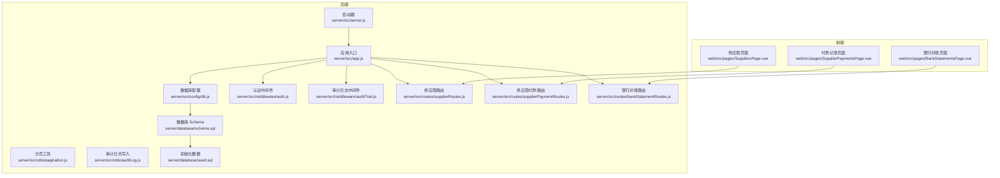
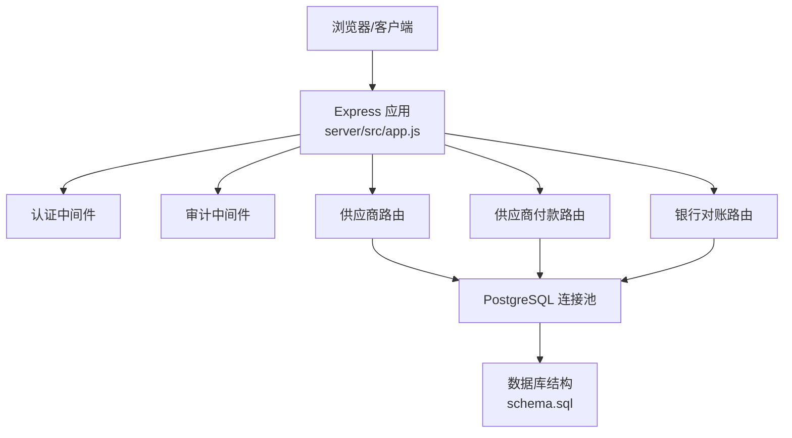
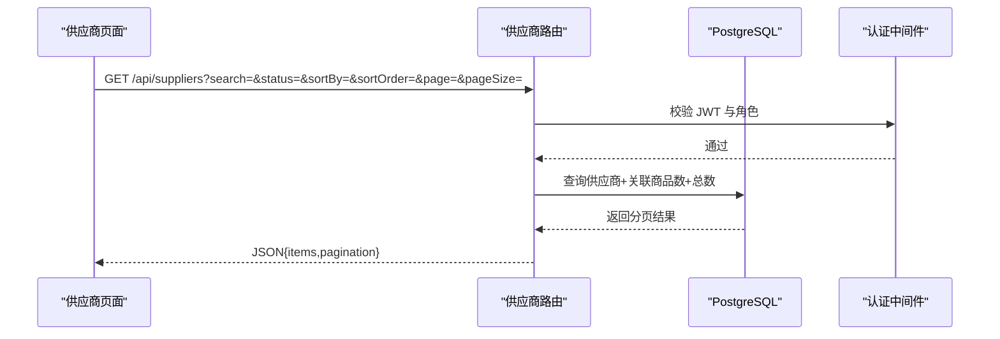
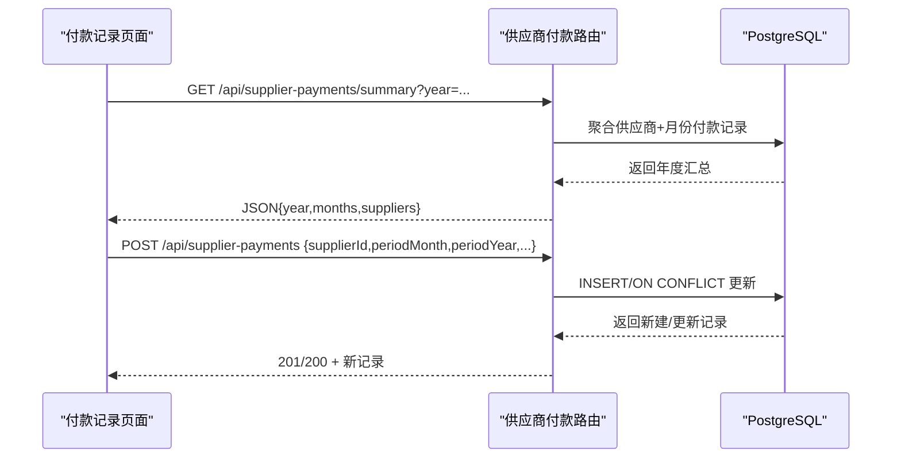
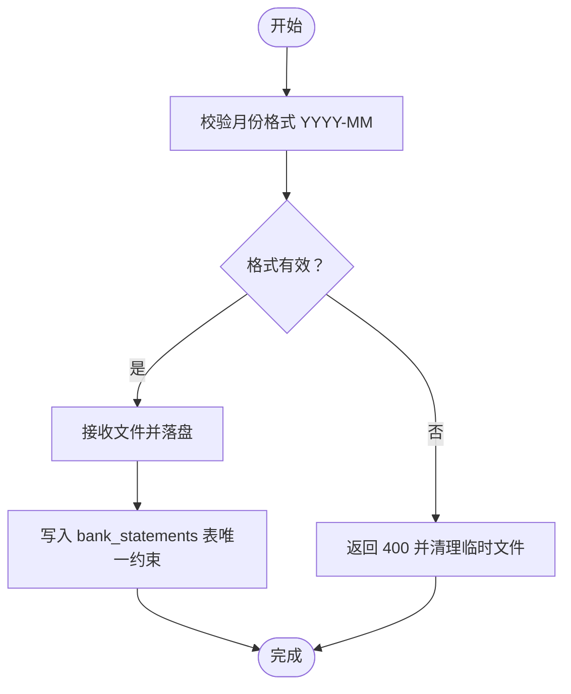
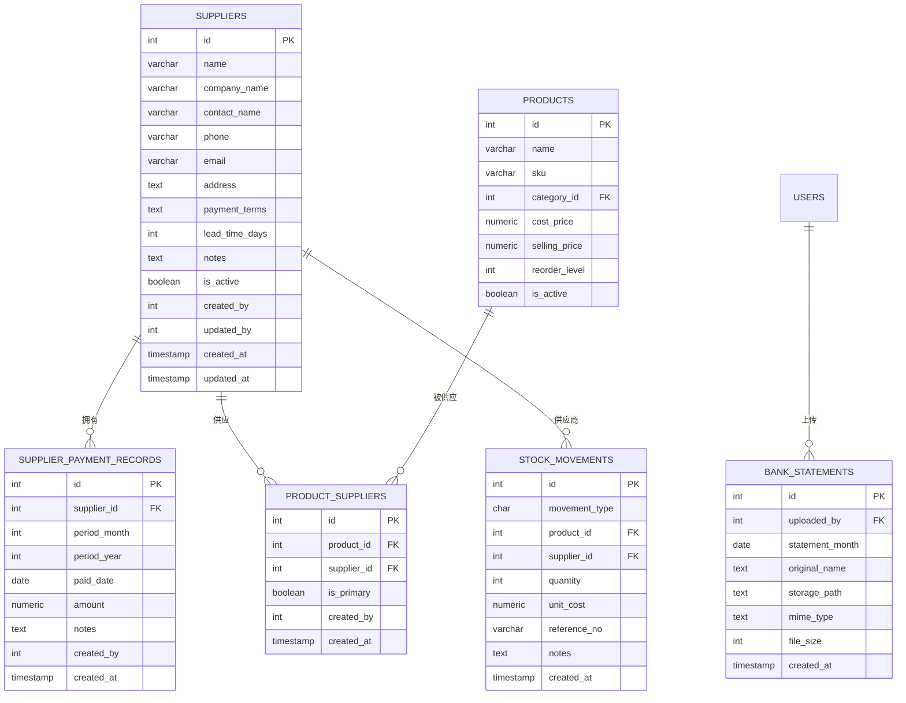
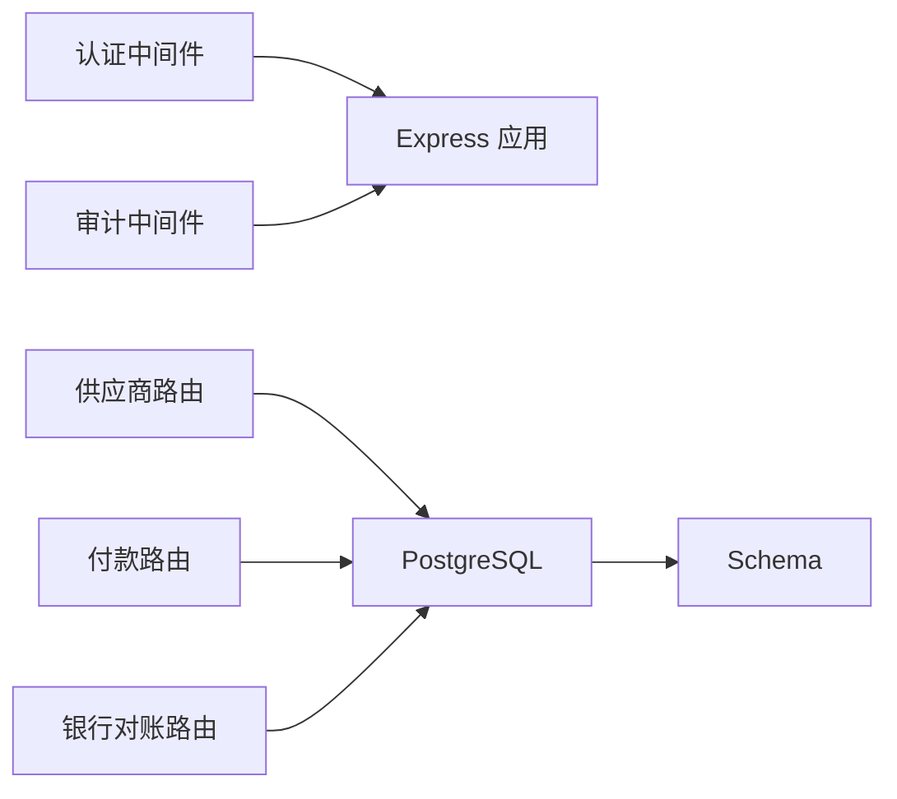

# 供应商与供应链管理

<cite>
**本文引用的文件**
- [server/src/app.js](file://server/src/app.js)
- [server/src/server.js](file://server/src/server.js)
- [server/src/config/db.js](file://server/src/config/db.js)
- [server/database/schema.sql](file://server/database/schema.sql)
- [server/database/seed.sql](file://server/database/seed.sql)
- [server/src/routes/supplierRoutes.js](file://server/src/routes/supplierRoutes.js)
- [server/src/routes/supplierPaymentRoutes.js](file://server/src/routes/supplierPaymentRoutes.js)
- [server/src/routes/bankStatementRoutes.js](file://server/src/routes/bankStatementRoutes.js)
- [server/src/middleware/auth.js](file://server/src/middleware/auth.js)
- [server/src/middleware/auditTrail.js](file://server/src/middleware/auditTrail.js)
- [server/src/utils/pagination.js](file://server/src/utils/pagination.js)
- [server/src/utils/auditLog.js](file://server/src/utils/auditLog.js)
- [web/src/pages/SuppliersPage.vue](file://web/src/pages/SuppliersPage.vue)
- [web/src/pages/SupplierPaymentsPage.vue](file://web/src/pages/SupplierPaymentsPage.vue)
- [web/src/pages/BankStatementsPage.vue](file://web/src/pages/BankStatementsPage.vue)
</cite>

## 目录
1. [简介](#简介)
2. [项目结构](#项目结构)
3. [核心组件](#核心组件)
4. [架构总览](#架构总览)
5. [详细组件分析](#详细组件分析)
6. [依赖关系分析](#依赖关系分析)
7. [性能考量](#性能考量)
8. [故障排查指南](#故障排查指南)
9. [结论](#结论)
10. [附录](#附录)

## 简介
本系统围绕“供应商与供应链管理”构建，覆盖供应商信息管理、供应商分类与评估（通过关联商品与采购历史间接体现）、采购执行与库存变动、供应商付款管理（应付账款记录与汇总）、以及银行对账单上传与归档。系统采用前后端分离架构：后端基于 Express 提供 REST API，使用 PostgreSQL 进行持久化；前端基于 Vue 3 构建管理界面，支持供应商列表、付款记录矩阵、银行对账单上传与下载等。

## 项目结构
后端核心由应用入口、数据库连接、路由模块、中间件与工具组成；数据库包含主结构、索引与种子数据；前端提供供应商、付款记录与银行对账单三大页面。

图表来源
- [server/src/app.js:1-67](file://server/src/app.js#L1-L67)
- [server/src/server.js:1-28](file://server/src/server.js#L1-L28)
- [server/src/config/db.js:1-25](file://server/src/config/db.js#L1-L25)
- [server/src/middleware/auth.js:1-46](file://server/src/middleware/auth.js#L1-L46)
- [server/src/middleware/auditTrail.js:1-84](file://server/src/middleware/auditTrail.js#L1-L84)
- [server/src/utils/pagination.js:1-28](file://server/src/utils/pagination.js#L1-L28)
- [server/src/utils/auditLog.js:1-38](file://server/src/utils/auditLog.js#L1-L38)
- [server/src/routes/supplierRoutes.js:1-370](file://server/src/routes/supplierRoutes.js#L1-L370)
- [server/src/routes/supplierPaymentRoutes.js:1-177](file://server/src/routes/supplierPaymentRoutes.js#L1-L177)
- [server/src/routes/bankStatementRoutes.js:1-255](file://server/src/routes/bankStatementRoutes.js#L1-L255)
- [server/database/schema.sql:1-447](file://server/database/schema.sql#L1-L447)
- [server/database/seed.sql:1-114](file://server/database/seed.sql#L1-L114)
- [web/src/pages/SuppliersPage.vue:1-272](file://web/src/pages/SuppliersPage.vue#L1-L272)
- [web/src/pages/SupplierPaymentsPage.vue:1-289](file://web/src/pages/SupplierPaymentsPage.vue#L1-L289)
- [web/src/pages/BankStatementsPage.vue:1-279](file://web/src/pages/BankStatementsPage.vue#L1-L279)

章节来源
- [server/src/app.js:1-67](file://server/src/app.js#L1-L67)
- [server/src/server.js:1-28](file://server/src/server.js#L1-L28)
- [server/src/config/db.js:1-25](file://server/src/config/db.js#L1-L25)
- [server/database/schema.sql:1-447](file://server/database/schema.sql#L1-L447)
- [server/database/seed.sql:1-114](file://server/database/seed.sql#L1-L114)

## 核心组件
- 认证与授权中间件：负责 JWT 校验与角色授权，确保受保护路由仅对具备角色权限的用户开放。
- 审计日志中间件：统一记录用户行为，便于合规与追踪。
- 分页工具：统一处理分页参数与返回结构，减少重复逻辑。
- 数据库连接池：根据环境变量动态决定 SSL 与超时策略，保证生产安全与稳定性。
- 路由模块：
  - 供应商路由：提供供应商的增删改查、状态变更、按关键词与状态筛选、分页与排序。
  - 供应商付款路由：提供付款记录的查询、汇总（按供应商与月份）、创建与删除。
  - 银行对账路由：提供对账单上传（PDF/JPEG/PNG/WEBP/XLS/XLSX，最大 25MB）、下载与删除，按月唯一约束，支持分页。

章节来源
- [server/src/middleware/auth.js:1-46](file://server/src/middleware/auth.js#L1-L46)
- [server/src/middleware/auditTrail.js:1-84](file://server/src/middleware/auditTrail.js#L1-L84)
- [server/src/utils/pagination.js:1-28](file://server/src/utils/pagination.js#L1-L28)
- [server/src/config/db.js:1-25](file://server/src/config/db.js#L1-L25)
- [server/src/routes/supplierRoutes.js:1-370](file://server/src/routes/supplierRoutes.js#L1-L370)
- [server/src/routes/supplierPaymentRoutes.js:1-177](file://server/src/routes/supplierPaymentRoutes.js#L1-L177)
- [server/src/routes/bankStatementRoutes.js:1-255](file://server/src/routes/bankStatementRoutes.js#L1-L255)

## 架构总览
后端以 Express 应用为核心，注册全局中间件（安全头、CORS、日志、响应包装、审计）与多条路由；数据库通过连接池提供查询能力；前端页面通过 API 与后端交互。

图表来源
- [server/src/app.js:1-67](file://server/src/app.js#L1-L67)
- [server/src/middleware/auth.js:1-46](file://server/src/middleware/auth.js#L1-L46)
- [server/src/middleware/auditTrail.js:1-84](file://server/src/middleware/auditTrail.js#L1-L84)
- [server/src/routes/supplierRoutes.js:1-370](file://server/src/routes/supplierRoutes.js#L1-L370)
- [server/src/routes/supplierPaymentRoutes.js:1-177](file://server/src/routes/supplierPaymentRoutes.js#L1-L177)
- [server/src/routes/bankStatementRoutes.js:1-255](file://server/src/routes/bankStatementRoutes.js#L1-L255)
- [server/src/config/db.js:1-25](file://server/src/config/db.js#L1-L25)
- [server/database/schema.sql:1-447](file://server/database/schema.sql#L1-L447)

## 详细组件分析

### 供应商信息管理
- 功能要点
  - 支持按公司名、联系人、电话、邮箱等关键词检索，支持状态筛选（全部/启用/停用）。
  - 支持按更新时间、创建时间、名称、交货周期排序，支持升序/降序。
  - 支持创建/更新供应商信息，包含公司名、联系人、电话、邮箱、地址、付款条件、交货周期、分支、营业时间、母公司、地图链接、备注、状态等字段。
  - 支持批量查询供应商详情，包含关联商品清单与近期采购流水（入库、供应商、产品、数量、单价、参考号等）。
  - 支持状态变更与删除（需管理员或主管角色）。
- 关键实现路径
  - 供应商路由与查询逻辑：[server/src/routes/supplierRoutes.js:1-370](file://server/src/routes/supplierRoutes.js#L1-L370)
  - 分页与排序参数处理：[server/src/utils/pagination.js:1-28](file://server/src/utils/pagination.js#L1-L28)
  - 前端供应商列表与操作：[web/src/pages/SuppliersPage.vue:1-272](file://web/src/pages/SuppliersPage.vue#L1-L272)

图表来源
- [server/src/routes/supplierRoutes.js:23-92](file://server/src/routes/supplierRoutes.js#L23-L92)
- [server/src/middleware/auth.js:5-29](file://server/src/middleware/auth.js#L5-L29)
- [server/src/utils/pagination.js:2-12](file://server/src/utils/pagination.js#L2-L12)

章节来源
- [server/src/routes/supplierRoutes.js:1-370](file://server/src/routes/supplierRoutes.js#L1-L370)
- [server/src/utils/pagination.js:1-28](file://server/src/utils/pagination.js#L1-L28)
- [web/src/pages/SuppliersPage.vue:1-272](file://web/src/pages/SuppliersPage.vue#L1-L272)

### 供应商付款管理（应付账款记录）
- 功能要点
  - 按供应商与年份过滤付款记录，支持分页。
  - 汇总接口：按供应商分组返回年度 12 个月的付款记录，未付款项为空数组。
  - 创建付款记录：支持按年月唯一冲突更新，记录付款日期、金额与备注。
  - 删除付款记录：按 ID 删除。
- 关键实现路径
  - 付款路由与汇总逻辑：[server/src/routes/supplierPaymentRoutes.js:1-177](file://server/src/routes/supplierPaymentRoutes.js#L1-L177)
  - 前端付款矩阵与表单：[web/src/pages/SupplierPaymentsPage.vue:1-289](file://web/src/pages/SupplierPaymentsPage.vue#L1-L289)

图表来源
- [server/src/routes/supplierPaymentRoutes.js:72-112](file://server/src/routes/supplierPaymentRoutes.js#L72-L112)
- [server/src/routes/supplierPaymentRoutes.js:114-151](file://server/src/routes/supplierPaymentRoutes.js#L114-L151)

章节来源
- [server/src/routes/supplierPaymentRoutes.js:1-177](file://server/src/routes/supplierPaymentRoutes.js#L1-L177)
- [web/src/pages/SupplierPaymentsPage.vue:1-289](file://web/src/pages/SupplierPaymentsPage.vue#L1-L289)

### 银行对账单管理
- 功能要点
  - 上传：支持 PDF/JPEG/PNG/WEBP/XLS/XLSX，文件大小上限 25MB，按 YYYY-MM 校验月份，同一用户同月唯一。
  - 下载：按 ID 校验上传者或管理员权限后返回文件。
  - 删除：按 ID 校验权限后删除记录与本地文件。
  - 列表：按上传者分页查询，展示月份、原文件名、类型、大小、上传时间。
- 关键实现路径
  - 对账路由与文件存储：[server/src/routes/bankStatementRoutes.js:1-255](file://server/src/routes/bankStatementRoutes.js#L1-L255)
  - 前端上传与历史：[web/src/pages/BankStatementsPage.vue:1-279](file://web/src/pages/BankStatementsPage.vue#L1-L279)

图表来源
- [server/src/routes/bankStatementRoutes.js:114-165](file://server/src/routes/bankStatementRoutes.js#L114-L165)

章节来源
- [server/src/routes/bankStatementRoutes.js:1-255](file://server/src/routes/bankStatementRoutes.js#L1-L255)
- [web/src/pages/BankStatementsPage.vue:1-279](file://web/src/pages/BankStatementsPage.vue#L1-L279)

### 数据模型设计
- 主要实体
  - 供应商：包含公司名、联系人、电话、邮箱、地址、付款条件、交货周期、分支、营业时间、母公司、地图链接、备注、状态等。
  - 供应商付款记录：按供应商+月份+年份唯一，记录付款日期、金额与备注。
  - 银行对账单：按上传者+月份唯一，记录原文件名、存储路径、MIME 类型、大小与上传时间。
  - 产品-供应商关联：用于建立产品与供应商的供应关系。
  - 库存变动：记录入库、出库与调拨，支持关联供应商与单位成本。
- 索引与约束
  - 多表建立复合索引与唯一约束，提升查询性能与数据一致性。
  - 供应商表新增常用扩展字段（如公司名、分支、营业时间、母公司、地图链接），满足实际业务需求。

图表来源
- [server/database/schema.sql:302-447](file://server/database/schema.sql#L302-L447)

章节来源
- [server/database/schema.sql:1-447](file://server/database/schema.sql#L1-L447)
- [server/database/seed.sql:1-114](file://server/database/seed.sql#L1-L114)

## 依赖关系分析
- 后端依赖
  - Express 应用注册中间件与路由，统一错误处理与健康检查。
  - 数据库连接池根据环境变量决定 SSL 与超时，启动时进行连通性校验。
  - 审计中间件在响应完成后异步写入审计日志，降低对主流程影响。
- 前后端交互
  - 前端页面通过 API 获取数据并提交表单，路由层负责参数校验与业务规则执行。
- 外部集成
  - 银行对账单上传依赖本地磁盘存储，建议在生产环境结合对象存储（如 S3）与鉴权策略。

图表来源
- [server/src/app.js:26-67](file://server/src/app.js#L26-L67)
- [server/src/middleware/auth.js:1-46](file://server/src/middleware/auth.js#L1-L46)
- [server/src/middleware/auditTrail.js:1-84](file://server/src/middleware/auditTrail.js#L1-L84)
- [server/src/routes/supplierRoutes.js:1-370](file://server/src/routes/supplierRoutes.js#L1-L370)
- [server/src/routes/supplierPaymentRoutes.js:1-177](file://server/src/routes/supplierPaymentRoutes.js#L1-L177)
- [server/src/routes/bankStatementRoutes.js:1-255](file://server/src/routes/bankStatementRoutes.js#L1-L255)
- [server/src/config/db.js:1-25](file://server/src/config/db.js#L1-L25)
- [server/database/schema.sql:1-447](file://server/database/schema.sql#L1-L447)

章节来源
- [server/src/app.js:1-67](file://server/src/app.js#L1-L67)
- [server/src/config/db.js:1-25](file://server/src/config/db.js#L1-L25)
- [server/src/middleware/auditTrail.js:1-84](file://server/src/middleware/auditTrail.js#L1-L84)

## 性能考量
- 查询优化
  - 使用索引覆盖常见查询（供应商名称、状态、产品-供应商唯一性、付款记录唯一性、对账单唯一性）。
  - 分页参数限制最小值与最大值，避免大页扫描。
- 写入优化
  - 付款记录使用 ON CONFLICT 更新，减少重复插入开销。
  - 审计日志异步写入，避免阻塞主请求。
- 存储与传输
  - 对账单上传限制大小与类型，防止资源滥用；建议生产环境迁移至对象存储并开启 CDN。
- 连接与可用性
  - 启动阶段进行数据库连通性超时检测，失败时优雅退出，避免僵尸进程。

章节来源
- [server/src/utils/pagination.js:2-12](file://server/src/utils/pagination.js#L2-L12)
- [server/src/routes/supplierPaymentRoutes.js:123-128](file://server/src/routes/supplierPaymentRoutes.js#L123-L128)
- [server/src/middleware/auditTrail.js:47-79](file://server/src/middleware/auditTrail.js#L47-L79)
- [server/src/server.js:13-25](file://server/src/server.js#L13-L25)

## 故障排查指南
- 认证失败
  - 现象：返回 401，提示缺少令牌或无效/过期。
  - 排查：确认 Authorization 头格式为 Bearer Token，检查 JWT_SECRET 是否正确，核对用户状态。
- 权限不足
  - 现象：返回 403，提示无权限。
  - 排查：确认用户角色是否具备 ADMIN/MANAGER 权限，检查路由是否启用 authorizeRoles。
- 数据库连接问题
  - 现象：启动时报数据库连接超时或失败。
  - 排查：检查 DATABASE_URL、SSL 配置与网络连通性，调整 STARTUP_DB_TIMEOUT_MS。
- 对账单上传失败
  - 现象：返回 400 或上传失败。
  - 排查：确认月份格式 YYYY-MM、文件类型与大小限制，检查上传目录权限与磁盘空间。
- 审计日志异常
  - 现象：写入失败但不影响主流程。
  - 排查：查看后端日志中的 Failed to write audit log 错误，检查 audit_logs 表结构与权限。

章节来源
- [server/src/middleware/auth.js:5-29](file://server/src/middleware/auth.js#L5-L29)
- [server/src/middleware/auditTrail.js:47-79](file://server/src/middleware/auditTrail.js#L47-L79)
- [server/src/server.js:18-24](file://server/src/server.js#L18-L24)
- [server/src/routes/bankStatementRoutes.js:239-252](file://server/src/routes/bankStatementRoutes.js#L239-L252)

## 结论
该系统提供了完整的供应商与供应链管理基础能力：供应商全生命周期管理、付款记录与汇总、银行对账单上传与归档。通过中间件与工具层的统一抽象，保障了安全性、可观测性与可维护性。建议后续在生产环境中引入对象存储、缓存策略与更完善的供应商评估指标（如质量、交付及时率等）以支撑更精细化的供应链协同。

## 附录

### API 接口概览
- 供应商
  - GET /api/suppliers：分页查询供应商，支持关键词、状态、排序。
  - GET /api/suppliers/:id：获取供应商详情与关联商品及近期采购。
  - POST /api/suppliers：创建供应商（ADMIN/MANAGER）。
  - PUT /api/suppliers/:id：更新供应商（ADMIN/MANAGER）。
  - PATCH /api/suppliers/:id/status：更新状态（ADMIN/MANAGER）。
  - DELETE /api/suppliers/:id：删除供应商（ADMIN/MANAGER）。
- 供应商付款
  - GET /api/supplier-payments：按供应商/年份分页查询。
  - GET /api/supplier-payments/summary：按供应商分组的年度汇总。
  - POST /api/supplier-payments：创建/更新付款记录。
  - DELETE /api/supplier-payments/:id：删除付款记录。
- 银行对账
  - GET /api/bank-statements：分页列出当前用户上传的对账单。
  - POST /api/bank-statements：上传对账单（multipart/form-data）。
  - GET /api/bank-statements/:id/download：下载对账单。
  - DELETE /api/bank-statements/:id：删除对账单。

章节来源
- [server/src/routes/supplierRoutes.js:23-367](file://server/src/routes/supplierRoutes.js#L23-L367)
- [server/src/routes/supplierPaymentRoutes.js:19-174](file://server/src/routes/supplierPaymentRoutes.js#L19-L174)
- [server/src/routes/bankStatementRoutes.js:80-237](file://server/src/routes/bankStatementRoutes.js#L80-L237)