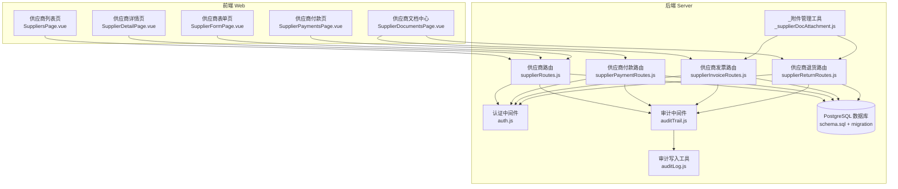
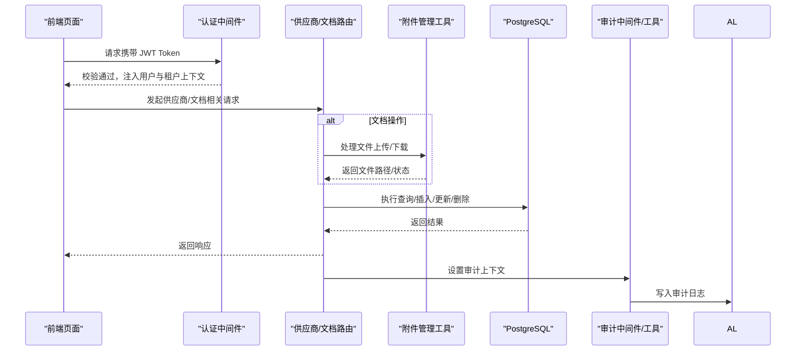
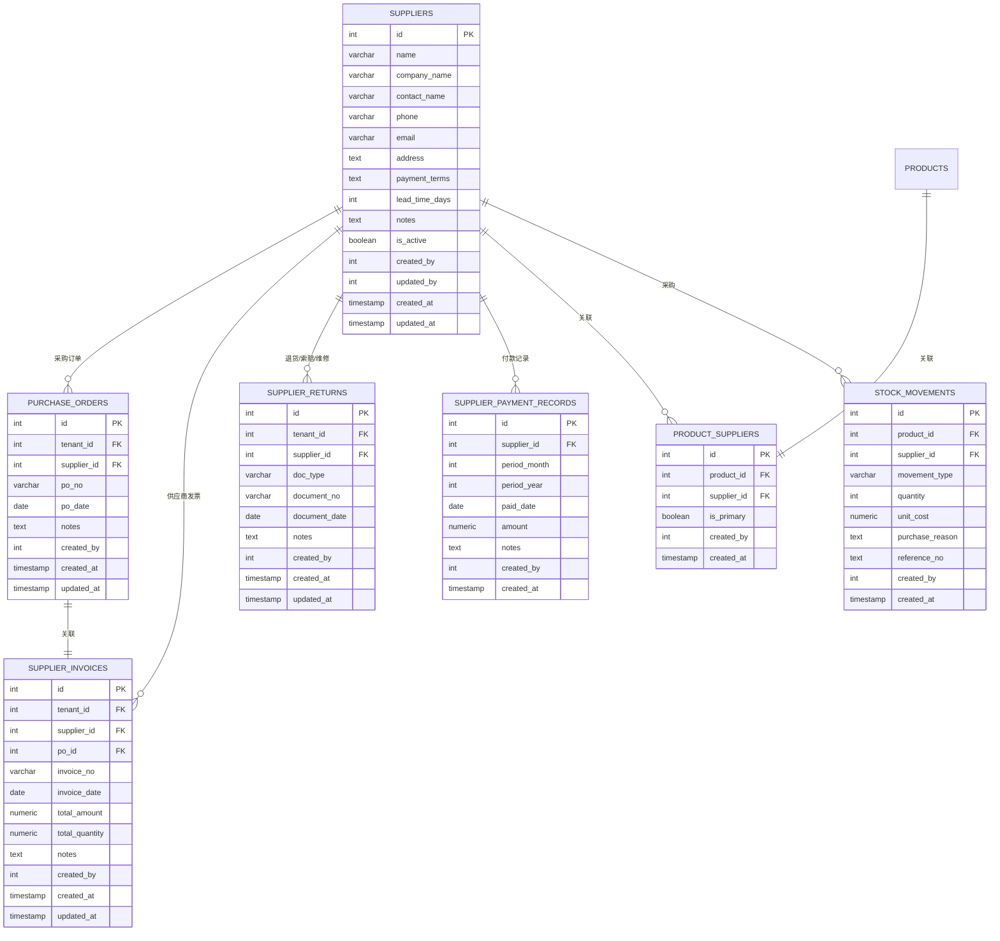
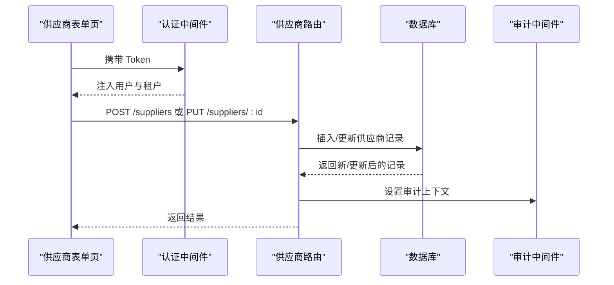
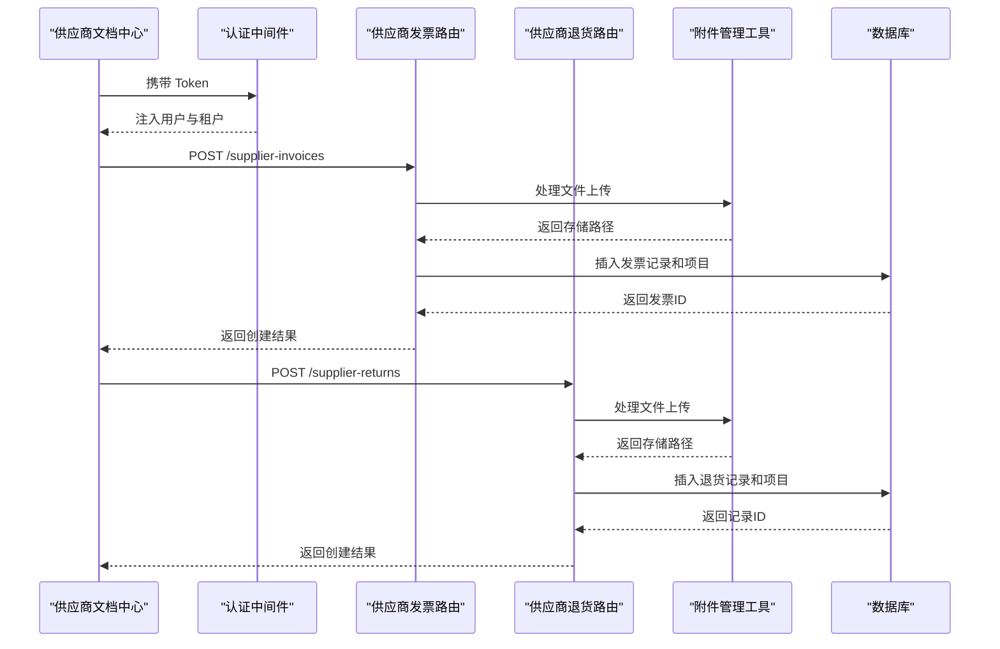
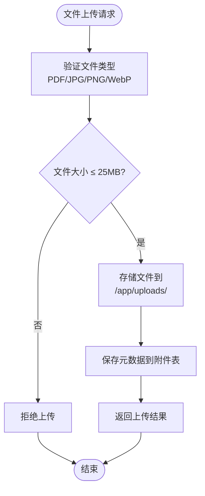
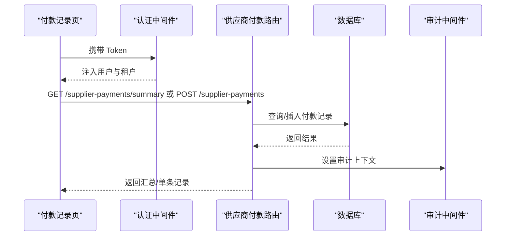
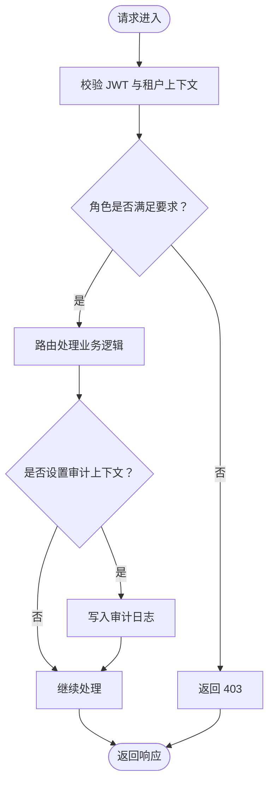
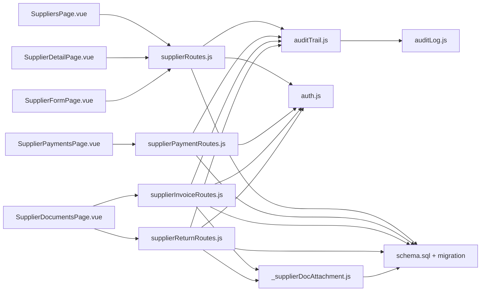

# 供应商管理

<cite>
**本文引用的文件**
- [server/src/routes/supplierRoutes.js](file://server/src/routes/supplierRoutes.js)
- [server/src/routes/supplierInvoiceRoutes.js](file://server/src/routes/supplierInvoiceRoutes.js)
- [server/src/routes/supplierReturnRoutes.js](file://server/src/routes/supplierReturnRoutes.js)
- [server/src/routes/_supplierDocAttachment.js](file://server/src/routes/_supplierDocAttachment.js)
- [server/src/routes/supplierPaymentRoutes.js](file://server/src/routes/supplierPaymentRoutes.js)
- [server/database/migrations/004_supplier_documents.sql](file://server/database/migrations/004_supplier_documents.sql)
- [server/database/schema.sql](file://server/database/schema.sql)
- [server/src/middleware/auth.js](file://server/src/middleware/auth.js)
- [server/src/middleware/auditTrail.js](file://server/src/middleware/auditTrail.js)
- [server/src/utils/auditLog.js](file://server/src/utils/auditLog.js)
- [web/src/pages/SuppliersPage.vue](file://web/src/pages/SuppliersPage.vue)
- [web/src/pages/SupplierDetailPage.vue](file://web/src/pages/SupplierDetailPage.vue)
- [web/src/pages/SupplierFormPage.vue](file://web/src/pages/SupplierFormPage.vue)
- [web/src/pages/SupplierPaymentsPage.vue](file://web/src/pages/SupplierPaymentsPage.vue)
- [web/src/pages/SupplierDocumentsPage.vue](file://web/src/pages/SupplierDocumentsPage.vue)
- [web/src/components/PurchaseOrderFormModal.vue](file://web/src/components/PurchaseOrderFormModal.vue)
- [web/src/components/SupplierInvoiceFormModal.vue](file://web/src/components/SupplierInvoiceFormModal.vue)
- [web/src/components/SupplierReturnFormModal.vue](file://web/src/components/SupplierReturnFormModal.vue)
</cite>

## 更新摘要
**所做更改**
- 新增完整的供应商文档管理系统，包括采购订单(PO)、供应商发票、供应商退货/索赔/维修的完整CRUD功能
- 数据库架构更新，新增三个核心文档表及其关联表
- 前端界面增强，新增供应商文档中心页面和对应的表单组件
- 文件附件管理功能，支持PDF、JPG、PNG、WebP格式的文档上传和下载
- 审计日志扩展，新增多种文档操作的审计记录

## 目录
1. [简介](#简介)
2. [项目结构](#项目结构)
3. [核心组件](#核心组件)
4. [架构总览](#架构总览)
5. [详细组件分析](#详细组件分析)
6. [依赖关系分析](#依赖关系分析)
7. [性能考量](#性能考量)
8. [故障排查指南](#故障排查指南)
9. [结论](#结论)
10. [附录](#附录)

## 简介
本文件面向"供应商管理"模块，系统性梳理供应商信息维护与采购管理能力，涵盖：
- 供应商数据模型设计与字段定义
- 供应商创建、编辑、状态控制与联系人管理
- 采购价格管理（单价、批量导入、有效期、历史追踪）
- 供应商评估（评分、交货时间统计、质量评价、付款条件）
- 供应商合同与付款记录、对账单生成
- **新增** 供应商文档管理系统（采购订单、发票、退货/索赔/维修）
- **新增** 文件附件管理与文档生命周期管理
- 数据安全、权限控制与审计最佳实践

## 项目结构
供应商管理由前后端协同实现：
- 后端采用 Express + PostgreSQL，通过路由层暴露供应商与付款记录的 CRUD 接口，并基于租户隔离与角色授权进行安全控制。
- **新增** 供应商文档路由：采购订单、供应商发票、供应商退货/索赔/维修的完整CRUD接口
- **新增** 附件管理工具：统一的文件上传、存储、下载和删除处理
- 前端使用 Vue 3 组件化页面，提供供应商列表、详情、表单与付款记录汇总视图。
- **新增** 供应商文档中心页面，支持三种文档类型的统一管理
- 审计日志贯穿关键操作，确保可追溯性。

**图表来源**
- [server/src/routes/supplierRoutes.js:1-383](file://server/src/routes/supplierRoutes.js#L1-L383)
- [server/src/routes/supplierInvoiceRoutes.js:1-416](file://server/src/routes/supplierInvoiceRoutes.js#L1-L416)
- [server/src/routes/supplierReturnRoutes.js:1-384](file://server/src/routes/supplierReturnRoutes.js#L1-L384)
- [server/src/routes/_supplierDocAttachment.js:1-84](file://server/src/routes/_supplierDocAttachment.js#L1-L84)
- [server/src/routes/supplierPaymentRoutes.js:1-205](file://server/src/routes/supplierPaymentRoutes.js#L1-L205)
- [server/database/migrations/004_supplier_documents.sql:1-144](file://server/database/migrations/004_supplier_documents.sql#L1-L144)

**章节来源**
- [server/src/routes/supplierRoutes.js:1-383](file://server/src/routes/supplierRoutes.js#L1-L383)
- [server/src/routes/supplierInvoiceRoutes.js:1-416](file://server/src/routes/supplierInvoiceRoutes.js#L1-L416)
- [server/src/routes/supplierReturnRoutes.js:1-384](file://server/src/routes/supplierReturnRoutes.js#L1-L384)
- [server/src/routes/_supplierDocAttachment.js:1-84](file://server/src/routes/_supplierDocAttachment.js#L1-L84)
- [server/database/migrations/004_supplier_documents.sql:1-144](file://server/database/migrations/004_supplier_documents.sql#L1-L144)

## 核心组件
- 供应商路由：提供供应商的查询、创建、更新、状态变更、删除等接口；支持按关键字、状态、排序筛选。
- 供应商付款路由：提供付款记录的分页查询、汇总视图、创建与删除；支持按供应商、年份过滤。
- **新增** 供应商发票路由：提供发票的完整CRUD操作，支持PO关联、数量和金额计算、附件管理。
- **新增** 供应商退货路由：提供退货、索赔、维修文档的统一管理，支持类型分类和附件管理。
- **新增** 附件管理工具：统一处理文件上传、存储路径构建、文件删除等操作。
- 数据模型：供应商表、供应商付款记录表、产品-供应商关联表、库存出入库记录（含供应商字段）、**新增** 供应商文档相关表。
- 审计与鉴权：JWT 鉴权、角色授权、租户隔离、统一审计写入。

**章节来源**
- [server/src/routes/supplierRoutes.js:23-97](file://server/src/routes/supplierRoutes.js#L23-L97)
- [server/src/routes/supplierPaymentRoutes.js:20-72](file://server/src/routes/supplierPaymentRoutes.js#L20-L72)
- [server/src/routes/supplierInvoiceRoutes.js:17-50](file://server/src/routes/supplierInvoiceRoutes.js#L17-L50)
- [server/src/routes/supplierReturnRoutes.js:17-37](file://server/src/routes/supplierReturnRoutes.js#L17-L37)
- [server/src/routes/_supplierDocAttachment.js:1-84](file://server/src/routes/_supplierDocAttachment.js#L1-L84)

## 架构总览
供应商管理在后端以"路由 -> 中间件 -> 数据库"的层次组织，前端通过 API 与后端交互，审计中间件自动捕获关键操作并写入审计日志。

**图表来源**
- [server/src/middleware/auth.js:5-61](file://server/src/middleware/auth.js#L5-L61)
- [server/src/routes/supplierInvoiceRoutes.js:99-176](file://server/src/routes/supplierInvoiceRoutes.js#L99-L176)
- [server/src/routes/supplierReturnRoutes.js:79-120](file://server/src/routes/supplierReturnRoutes.js#L79-L120)
- [server/src/routes/_supplierDocAttachment.js:33-66](file://server/src/routes/_supplierDocAttachment.js#L33-L66)
- [server/src/middleware/auditTrail.js:47-81](file://server/src/middleware/auditTrail.js#L47-L81)

## 详细组件分析

### 供应商数据模型与字段定义
- 供应商表（suppliers）包含：
  - 基本信息：名称、公司名、联系人、电话、邮箱、地址
  - 运营信息：付款条件、交货周期、备注、状态
  - 关联扩展：分支、营业时间、母公司、地图链接
  - 审计字段：创建者、更新者、创建时间、更新时间
- 供应商付款记录表（supplier_payment_records）包含：
  - 供应商标识、所属租户、账期（月/年）、实付日期、金额、备注
  - 唯一约束：同一供应商同一账期唯一
- 产品-供应商关联（product_suppliers）：
  - 多对多关联，支持主供应商标记
- 库存出入库记录（stock_movements）：
  - 新增供应商字段、单价、采购原因等，便于溯源
- **新增** 采购订单表（purchase_orders）：
  - 包含租户ID、供应商ID、PO编号、日期、备注等
  - 支持PO项目和附件管理
- **新增** 供应商发票表（supplier_invoices）：
  - 必须关联采购订单，包含发票编号、日期、总金额、总数量
  - 支持发票项目明细和附件管理
- **新增** 供应商退货/索赔/维修表（supplier_returns）：
  - 支持RETURN/CLAIM/REPAIR三种文档类型
  - 独立于PO和发票，完全可选的文档管理

**图表来源**
- [server/database/migrations/004_supplier_documents.sql:13-125](file://server/database/migrations/004_supplier_documents.sql#L13-L125)
- [server/database/schema.sql:302-366](file://server/database/schema.sql#L302-L366)

**章节来源**
- [server/database/migrations/004_supplier_documents.sql:13-125](file://server/database/migrations/004_supplier_documents.sql#L13-L125)
- [server/database/schema.sql:302-366](file://server/database/schema.sql#L302-L366)

### 供应商信息管理功能
- 列表与筛选
  - 支持按关键字（名称/公司/联系人/电话/邮箱）、状态（全部/启用/停用）、排序（更新时间/创建时间/名称/交货周期）分页查询
- 创建与编辑
  - 必填项：公司名称；其余字段可空
  - 更新时自动记录更新者与更新时间
- 状态控制
  - 提供 PATCH 接口切换供应商启用/停用
- 联系人与扩展信息
  - 支持联系人、电话、邮箱、地址、营业时间、地图链接、母公司、分支等字段
- 详情页
  - 展示供应商基础信息、关联商品清单、最近采购记录（入库单据）

**图表来源**
- [server/src/routes/supplierRoutes.js:99-176](file://server/src/routes/supplierRoutes.js#L99-L176)
- [server/src/middleware/auth.js:5-61](file://server/src/middleware/auth.js#L5-L61)
- [server/src/middleware/auditTrail.js:47-81](file://server/src/middleware/auditTrail.js#L47-L81)

**章节来源**
- [server/src/routes/supplierRoutes.js:23-97](file://server/src/routes/supplierRoutes.js#L23-L97)
- [server/src/routes/supplierRoutes.js:99-176](file://server/src/routes/supplierRoutes.js#L99-L176)
- [server/src/routes/supplierRoutes.js:243-354](file://server/src/routes/supplierRoutes.js#L243-L354)
- [web/src/pages/SuppliersPage.vue:44-66](file://web/src/pages/SuppliersPage.vue#L44-L66)
- [web/src/pages/SupplierFormPage.vue:52-78](file://web/src/pages/SupplierFormPage.vue#L52-L78)
- [web/src/pages/SupplierDetailPage.vue:36-49](file://web/src/pages/SupplierDetailPage.vue#L36-L49)

### 供应商文档管理系统

#### 采购订单(PO)管理
- **新增** 完整的PO CRUD功能
- 支持PO编号唯一性校验、供应商关联验证
- PO项目管理：支持产品、数量、描述、序列号等字段
- 附件管理：支持PDF、JPG、PNG、WebP格式上传
- 租户隔离：所有PO按租户ID进行隔离

#### 供应商发票管理
- **新增** 发票与PO强关联机制
- 自动计算：数量×单价−折扣=金额
- 支持发票项目明细管理
- 附件管理：统一的文件上传和下载处理
- 总金额和总数量自动汇总

#### 供应商退货/索赔/维修管理
- **新增** 统一的文档类型管理
- 支持RETURN、CLAIM、REPAIR三种类型
- 独立于PO和发票的文档流
- 支持附件管理，便于证据保存

**图表来源**
- [server/src/routes/supplierInvoiceRoutes.js:161-233](file://server/src/routes/supplierInvoiceRoutes.js#L161-L233)
- [server/src/routes/supplierReturnRoutes.js:122-191](file://server/src/routes/supplierReturnRoutes.js#L122-L191)
- [server/src/routes/_supplierDocAttachment.js:33-66](file://server/src/routes/_supplierDocAttachment.js#L33-L66)

**章节来源**
- [server/src/routes/supplierInvoiceRoutes.js:52-113](file://server/src/routes/supplierInvoiceRoutes.js#L52-L113)
- [server/src/routes/supplierInvoiceRoutes.js:161-233](file://server/src/routes/supplierInvoiceRoutes.js#L161-L233)
- [server/src/routes/supplierInvoiceRoutes.js:335-400](file://server/src/routes/supplierInvoiceRoutes.js#L335-L400)
- [server/src/routes/supplierReturnRoutes.js:21-78](file://server/src/routes/supplierReturnRoutes.js#L21-L78)
- [server/src/routes/supplierReturnRoutes.js:122-191](file://server/src/routes/supplierReturnRoutes.js#L122-L191)
- [server/src/routes/supplierReturnRoutes.js:303-368](file://server/src/routes/supplierReturnRoutes.js#L303-L368)
- [server/src/routes/_supplierDocAttachment.js:1-84](file://server/src/routes/_supplierDocAttachment.js#L1-L84)

### 文件附件管理系统

#### 附件存储架构
- **新增** 统一的文件存储路径管理
- 上传目录：/app/uploads/<subDir>（Docker卷挂载）
- 支持的文件类型：PDF、JPG、PNG、WebP
- 文件大小限制：25MB
- 自动文件名生成：包含父文档ID和上传用户ID

#### 附件管理流程
- **新增** 上传验证：类型检查、大小限制
- **新增** 存储路径构建：基于子目录和文件名
- **新增** 文件删除：级联删除相关附件
- **新增** 下载处理：安全的文件下载和类型设置

**图表来源**
- [server/src/routes/_supplierDocAttachment.js:33-66](file://server/src/routes/_supplierDocAttachment.js#L33-L66)
- [server/src/routes/supplierInvoiceRoutes.js:335-360](file://server/src/routes/supplierInvoiceRoutes.js#L335-L360)
- [server/src/routes/supplierReturnRoutes.js:303-328](file://server/src/routes/supplierReturnRoutes.js#L303-L328)

**章节来源**
- [server/src/routes/_supplierDocAttachment.js:1-84](file://server/src/routes/_supplierDocAttachment.js#L1-L84)
- [server/src/routes/supplierInvoiceRoutes.js:335-400](file://server/src/routes/supplierInvoiceRoutes.js#L335-L400)
- [server/src/routes/supplierReturnRoutes.js:303-368](file://server/src/routes/supplierReturnRoutes.js#L303-L368)

### 采购价格管理
- 单价维护
  - 入库单据包含单价字段，便于追溯每笔采购成本
- 批量价格导入
  - 当前未发现专门的"批量价格导入"接口；可通过扩展在后端增加 CSV/Excel 导入处理逻辑
- 价格有效期管理
  - 未见专用"有效期"字段或策略；可在产品定价规则表基础上扩展
- 历史价格追踪
  - 存在"产品成本价格历史"表，可用于记录成本变动历史；建议在供应商报价或入库流程中联动写入

**章节来源**
- [server/database/schema.sql:367-376](file://server/database/schema.sql#L367-L376)
- [server/database/schema.sql:237-248](file://server/database/schema.sql#L237-L248)

### 供应商评估功能
- 供应商评分与质量评价
  - 未发现评分/质量评价字段；可在供应商表或新增评估表中扩展
- 交货时间统计
  - 供应商表已有交货周期字段；可在入库记录中补充实际到货时间，形成对比分析
- 付款条件管理
  - 供应商表存在付款条件字段，前端提供枚举映射展示

**章节来源**
- [server/database/schema.sql:302-318](file://server/database/schema.sql#L302-L318)
- [web/src/pages/SuppliersPage.vue:25-31](file://web/src/pages/SuppliersPage.vue#L25-L31)
- [web/src/pages/SupplierDetailPage.vue:17-23](file://web/src/pages/SupplierDetailPage.vue#L17-L23)

### 供应商合同管理、付款记录与对账单
- 供应商合同管理
  - 未发现专门的"供应商合同"表；可在供应商表扩展合同编号、签署日期、到期日等字段，或新增独立合同表
- 付款记录
  - 供应商付款记录表支持按年/月维度记录付款情况，提供汇总视图与单条记录的增删改
- 对账单生成
  - 未发现对账单生成功能；可基于付款记录与采购入库记录进行聚合导出

**图表来源**
- [server/src/routes/supplierPaymentRoutes.js:74-122](file://server/src/routes/supplierPaymentRoutes.js#L74-L122)
- [server/src/routes/supplierPaymentRoutes.js:124-172](file://server/src/routes/supplierPaymentRoutes.js#L124-L172)
- [server/src/middleware/auditTrail.js:47-81](file://server/src/middleware/auditTrail.js#L47-L81)

**章节来源**
- [server/src/routes/supplierPaymentRoutes.js:20-72](file://server/src/routes/supplierPaymentRoutes.js#L20-L72)
- [server/src/routes/supplierPaymentRoutes.js:74-122](file://server/src/routes/supplierPaymentRoutes.js#L74-L122)
- [server/src/routes/supplierPaymentRoutes.js:124-202](file://server/src/routes/supplierPaymentRoutes.js#L124-L202)
- [web/src/pages/SupplierPaymentsPage.vue:71-85](file://web/src/pages/SupplierPaymentsPage.vue#L71-L85)
- [web/src/pages/SupplierPaymentsPage.vue:113-141](file://web/src/pages/SupplierPaymentsPage.vue#L113-L141)

### 数据安全、权限控制与审计
- 认证与租户隔离
  - JWT 校验、租户状态检查、租户 ID 一致性校验，确保跨租户不可越权
- 角色授权
  - 仅管理员/经理可执行创建/更新/删除/状态变更/付款记录管理
- 审计
  - 自动记录操作类型、实体类型、实体 ID、方法、路径、描述与元数据
  - 审计上下文可由路由显式设置，或由中间件推断
- **新增** 文档操作审计
  - 新增/更新/删除供应商发票、退货文档的操作都会记录审计日志
  - 附件上传/下载/删除也会产生相应的审计记录

**图表来源**
- [server/src/middleware/auth.js:5-61](file://server/src/middleware/auth.js#L5-L61)
- [server/src/middleware/auth.js:64-72](file://server/src/middleware/auth.js#L64-L72)
- [server/src/middleware/auditTrail.js:47-81](file://server/src/middleware/auditTrail.js#L47-L81)
- [server/src/utils/auditLog.js:1-40](file://server/src/utils/auditLog.js#L1-L40)

**章节来源**
- [server/src/middleware/auth.js:5-61](file://server/src/middleware/auth.js#L5-L61)
- [server/src/middleware/auth.js:64-72](file://server/src/middleware/auth.js#L64-L72)
- [server/src/middleware/auditTrail.js:47-81](file://server/src/middleware/auditTrail.js#L47-L81)
- [server/src/utils/auditLog.js:1-40](file://server/src/utils/auditLog.js#L1-L40)

## 依赖关系分析
- 前端依赖后端提供的 API：
  - 供应商列表/详情/表单/状态变更/删除
  - 供应商付款记录列表/汇总/创建/删除
  - **新增** 供应商文档中心：PO、发票、退货文档的统一管理
- 后端依赖：
  - 数据库表结构（供应商、付款记录、产品-供应商、库存出入库、**新增** 供应商文档相关表）
  - 中间件（认证、审计）
  - 工具（分页、租户提取、**新增** 附件管理）
  - **新增** 附件存储服务：文件上传、下载、删除

**图表来源**
- [web/src/pages/SuppliersPage.vue:1-272](file://web/src/pages/SuppliersPage.vue#L1-L272)
- [web/src/pages/SupplierDetailPage.vue:1-207](file://web/src/pages/SupplierDetailPage.vue#L1-L207)
- [web/src/pages/SupplierFormPage.vue:1-277](file://web/src/pages/SupplierFormPage.vue#L1-L277)
- [web/src/pages/SupplierPaymentsPage.vue:1-289](file://web/src/pages/SupplierPaymentsPage.vue#L1-L289)
- [web/src/pages/SupplierDocumentsPage.vue:1-355](file://web/src/pages/SupplierDocumentsPage.vue#L1-L355)
- [server/src/routes/supplierRoutes.js:1-383](file://server/src/routes/supplierRoutes.js#L1-L383)
- [server/src/routes/supplierPaymentRoutes.js:1-205](file://server/src/routes/supplierPaymentRoutes.js#L1-L205)
- [server/src/routes/supplierInvoiceRoutes.js:1-416](file://server/src/routes/supplierInvoiceRoutes.js#L1-L416)
- [server/src/routes/supplierReturnRoutes.js:1-384](file://server/src/routes/supplierReturnRoutes.js#L1-L384)
- [server/src/routes/_supplierDocAttachment.js:1-84](file://server/src/routes/_supplierDocAttachment.js#L1-L84)
- [server/src/middleware/auth.js:1-96](file://server/src/middleware/auth.js#L1-L96)
- [server/src/middleware/auditTrail.js:1-86](file://server/src/middleware/auditTrail.js#L1-L86)
- [server/src/utils/auditLog.js:1-40](file://server/src/utils/auditLog.js#L1-L40)
- [server/database/migrations/004_supplier_documents.sql:1-144](file://server/database/migrations/004_supplier_documents.sql#L1-L144)

**章节来源**
- [web/src/pages/SuppliersPage.vue:1-272](file://web/src/pages/SuppliersPage.vue#L1-L272)
- [web/src/pages/SupplierDetailPage.vue:1-207](file://web/src/pages/SupplierDetailPage.vue#L1-L207)
- [web/src/pages/SupplierFormPage.vue:1-277](file://web/src/pages/SupplierFormPage.vue#L1-L277)
- [web/src/pages/SupplierPaymentsPage.vue:1-289](file://web/src/pages/SupplierPaymentsPage.vue#L1-L289)
- [web/src/pages/SupplierDocumentsPage.vue:1-355](file://web/src/pages/SupplierDocumentsPage.vue#L1-L355)
- [server/src/routes/supplierRoutes.js:1-383](file://server/src/routes/supplierRoutes.js#L1-L383)
- [server/src/routes/supplierPaymentRoutes.js:1-205](file://server/src/routes/supplierPaymentRoutes.js#L1-L205)
- [server/src/routes/supplierInvoiceRoutes.js:1-416](file://server/src/routes/supplierInvoiceRoutes.js#L1-L416)
- [server/src/routes/supplierReturnRoutes.js:1-384](file://server/src/routes/supplierReturnRoutes.js#L1-L384)
- [server/src/routes/_supplierDocAttachment.js:1-84](file://server/src/routes/_supplierDocAttachment.js#L1-L84)
- [server/database/migrations/004_supplier_documents.sql:1-144](file://server/database/migrations/004_supplier_documents.sql#L1-L144)

## 性能考量
- 查询优化
  - 供应商列表使用分页与索引（名称、状态），建议在高频查询字段上建立合适索引
  - **新增** 供应商文档表建立了相应的索引：按租户+供应商、按日期排序、按文档类型过滤
- 并发与事务
  - 付款记录插入使用唯一键冲突更新，避免重复记录
  - **新增** 文档创建使用事务保证数据一致性，支持回滚操作
- 前端渲染
  - 列表与详情采用懒加载与分页，减少一次性渲染压力
  - **新增** 附件列表采用异步加载，提升页面响应速度
- **新增** 文件存储优化
  - 附件文件采用本地存储，支持快速上传和下载
  - 文件名包含时间戳，避免重名冲突

## 故障排查指南
- 认证失败
  - 检查请求头 Authorization 是否携带有效 JWT；确认租户状态与租户 ID 一致
- 权限不足
  - 确认用户角色为 ADMIN 或 MANAGER；非授权操作会返回 403
- 供应商不存在
  - 创建/更新/删除/状态变更均需提供正确供应商 ID；若返回 404，检查 ID 与租户匹配
- 付款记录异常
  - 确认 supplierId、periodMonth、periodYear 参数齐全；检查供应商是否属于当前租户
- 审计缺失
  - 确认审计中间件已注册；检查审计上下文是否设置
- **新增** 文档操作异常
  - PO/发票/退货创建失败：检查必填字段完整性、租户ID正确性
  - 附件上传失败：检查文件类型、大小限制、存储权限
  - 文档关联错误：发票必须关联有效的PO，且供应商必须匹配

**章节来源**
- [server/src/middleware/auth.js:5-61](file://server/src/middleware/auth.js#L5-L61)
- [server/src/middleware/auth.js:64-72](file://server/src/middleware/auth.js#L64-L72)
- [server/src/routes/supplierRoutes.js:356-380](file://server/src/routes/supplierRoutes.js#L356-L380)
- [server/src/routes/supplierPaymentRoutes.js:124-172](file://server/src/routes/supplierPaymentRoutes.js#L124-L172)
- [server/src/routes/supplierInvoiceRoutes.js:164-192](file://server/src/routes/supplierInvoiceRoutes.js#L164-L192)
- [server/src/routes/supplierReturnRoutes.js:126-132](file://server/src/routes/supplierReturnRoutes.js#L126-L132)

## 结论
本系统已具备完善的供应商信息管理与付款记录能力，结合租户隔离与角色授权，满足多租户场景下的安全需求。**本次更新新增了完整的供应商文档管理系统**，包括：
- 采购订单(PO)、供应商发票、供应商退货/索赔/维修的完整CRUD功能
- 统一的文件附件管理，支持多种格式和大小限制
- 完善的审计日志，覆盖所有文档操作
- 前端文档中心页面，提供统一的文档管理体验

建议后续扩展：
- 供应商合同管理与对账单生成
- 供应商评估指标（评分、质量、交货时间统计）
- 采购价格管理（批量导入、有效期、历史追踪）
- 供应商等级分类与分级权限控制
- **新增** 文档模板管理和批量导入功能

## 附录
- 字段与验证要点
  - 供应商名称必填；交货周期非负整数；状态布尔值
  - 付款记录必填供应商、账期（月/年）；金额数值型
  - **新增** PO必填字段：供应商ID、PO编号、PO日期
  - **新增** 发票必填字段：供应商ID、PO ID、发票编号、发票日期
  - **新增** 退货文档必填字段：供应商ID、文档类型、文档编号、文档日期
- 最佳实践
  - 所有写操作均应设置审计上下文
  - 严格区分 ADMIN/MANAGER 权限，避免误操作
  - 使用租户隔离字段与查询条件，防止跨租户访问
  - **新增** 附件文件命名规范：p{父文档ID}_u{用户ID}_{时间戳}{扩展名}
  - **新增** 文档关联验证：确保PO、发票、退货的供应商一致性