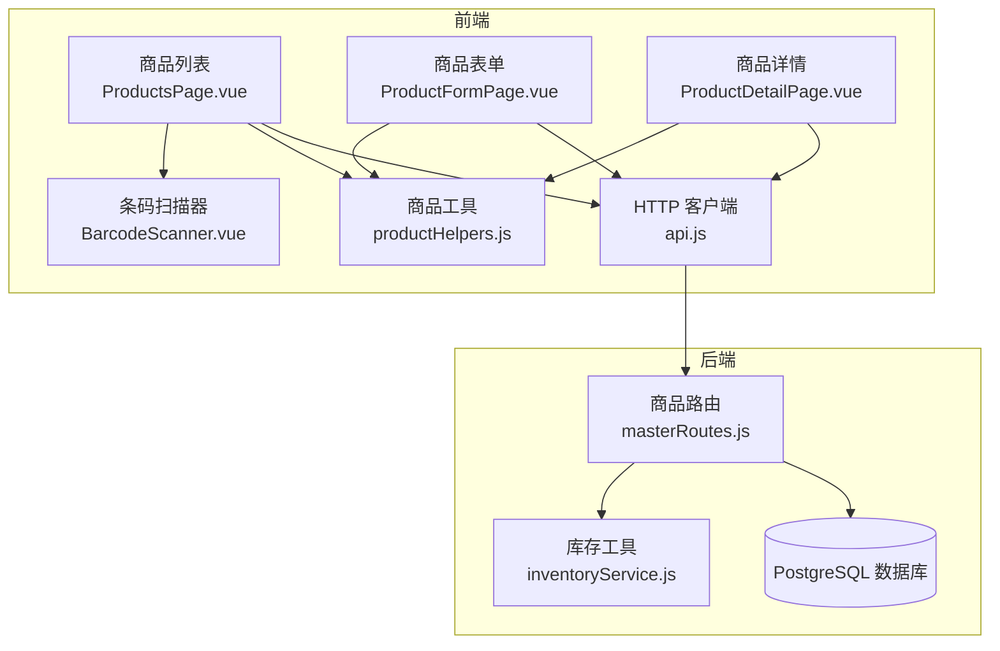
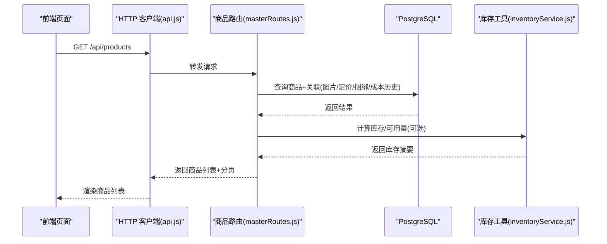
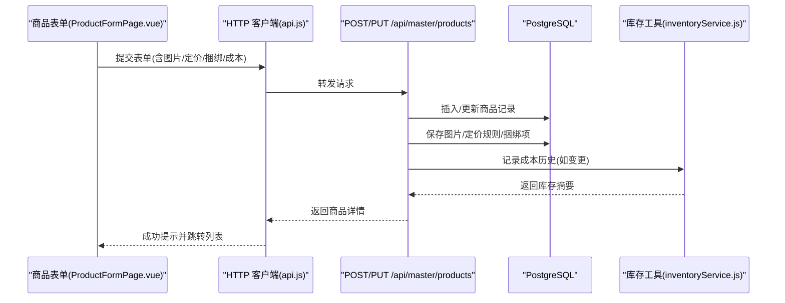
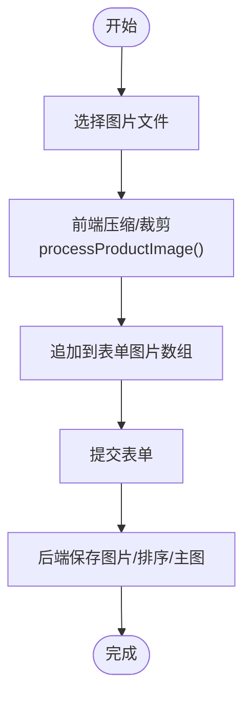
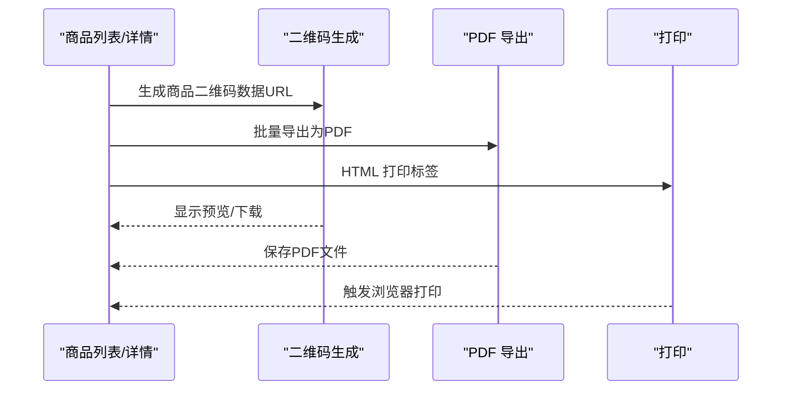
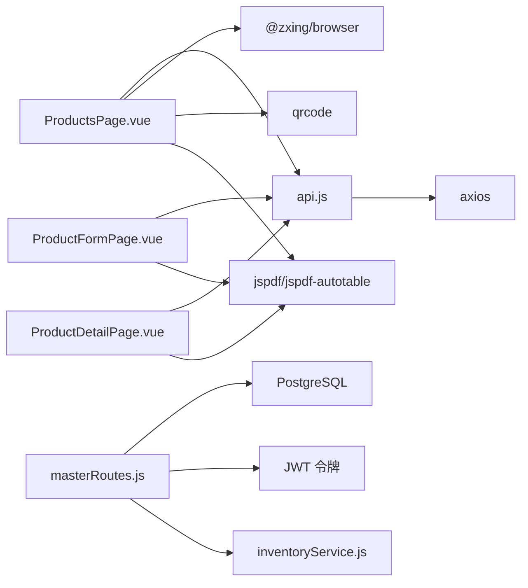

# 商品主数据管理

<cite>
**本文档引用的文件**
- [masterRoutes.js](file://server/src/routes/masterRoutes.js)
- [schema.sql](file://server/database/schema.sql)
- [001_add_multi_tenant.sql](file://server/database/migrations/001_add_multi_tenant.sql)
- [002_fix_unique_constraints.sql](file://server/database/migrations/002_fix_unique_constraints.sql)
- [ProductsPage.vue](file://web/src/pages/ProductsPage.vue)
- [ProductFormPage.vue](file://web/src/pages/ProductFormPage.vue)
- [ProductDetailPage.vue](file://web/src/pages/ProductDetailPage.vue)
- [productHelpers.js](file://web/src/utils/productHelpers.js)
- [BarcodeScanner.vue](file://web/src/components/BarcodeScanner.vue)
- [api.js](file://web/src/services/api.js)
- [inventoryService.js](file://server/src/utils/inventoryService.js)
</cite>

## 目录
1. [简介](#简介)
2. [项目结构](#项目结构)
3. [核心组件](#核心组件)
4. [架构总览](#架构总览)
5. [详细组件分析](#详细组件分析)
6. [依赖关系分析](#依赖关系分析)
7. [性能考量](#性能考量)
8. [故障排查指南](#故障排查指南)
9. [结论](#结论)

## 简介
本文件系统化梳理了库存系统中的“商品主数据管理”能力，涵盖商品数据模型设计、CRUD流程、状态管理、图片管理、条码/二维码与批量标签导出、以及数据一致性与性能优化等关键主题。目标是帮助开发者与运营人员快速理解并高效使用该模块。

## 项目结构
- 后端采用 Express + PostgreSQL，路由集中在 masterRoutes.js，商品相关接口统一在 /api/products 下提供。
- 前端基于 Vue3 + Vite，商品列表、表单、详情页面分别位于 ProductsPage.vue、ProductFormPage.vue、ProductDetailPage.vue。
- 数据模型通过 schema.sql 定义，多租户通过 migrations/001_add_multi_tenant.sql 实现，确保不同租户间数据隔离。

图表来源
- [ProductsPage.vue:1-1005](file://web/src/pages/ProductsPage.vue#L1-L1005)
- [ProductFormPage.vue:1-505](file://web/src/pages/ProductFormPage.vue#L1-L505)
- [ProductDetailPage.vue:1-486](file://web/src/pages/ProductDetailPage.vue#L1-L486)
- [productHelpers.js:1-196](file://web/src/utils/productHelpers.js#L1-L196)
- [BarcodeScanner.vue:1-68](file://web/src/components/BarcodeScanner.vue#L1-L68)
- [api.js:1-45](file://web/src/services/api.js#L1-L45)
- [masterRoutes.js:924-1571](file://server/src/routes/masterRoutes.js#L924-L1571)
- [inventoryService.js:1-46](file://server/src/utils/inventoryService.js#L1-L46)

章节来源
- [masterRoutes.js:924-1571](file://server/src/routes/masterRoutes.js#L924-L1571)
- [schema.sql:32-124](file://server/database/schema.sql#L32-L124)
- [ProductsPage.vue:1-1005](file://web/src/pages/ProductsPage.vue#L1-L1005)
- [ProductFormPage.vue:1-505](file://web/src/pages/ProductFormPage.vue#L1-L505)
- [ProductDetailPage.vue:1-486](file://web/src/pages/ProductDetailPage.vue#L1-L486)
- [productHelpers.js:1-196](file://web/src/utils/productHelpers.js#L1-L196)
- [BarcodeScanner.vue:1-68](file://web/src/components/BarcodeScanner.vue#L1-L68)
- [api.js:1-45](file://web/src/services/api.js#L1-L45)
- [inventoryService.js:1-46](file://server/src/utils/inventoryService.js#L1-L46)

## 核心组件
- 商品数据模型：包含商品ID、SKU、产品编码、条形码、名称、描述、规格、单位、价格体系、重购线、状态等字段，支持组合SKU与捆绑商品。
- 商品路由层：提供商品列表、详情、创建、更新、删除、成本访问令牌、主供应商设置、成本变更历史等接口。
- 前端页面：商品列表页支持搜索、筛选、分页、批量操作；表单页支持成本解锁、图片处理、定价规则、捆绑商品配置；详情页汇总库存、预警、流水、成本历史等。
- 工具与扫描：前端提供二维码生成、批量标签导出、图片压缩处理、条码扫描器组件。

章节来源
- [masterRoutes.js:924-1571](file://server/src/routes/masterRoutes.js#L924-L1571)
- [schema.sql:32-124](file://server/database/schema.sql#L32-L124)
- [ProductsPage.vue:1-1005](file://web/src/pages/ProductsPage.vue#L1-L1005)
- [ProductFormPage.vue:1-505](file://web/src/pages/ProductFormPage.vue#L1-L505)
- [ProductDetailPage.vue:1-486](file://web/src/pages/ProductDetailPage.vue#L1-L486)
- [productHelpers.js:1-196](file://web/src/utils/productHelpers.js#L1-L196)
- [BarcodeScanner.vue:1-68](file://web/src/components/BarcodeScanner.vue#L1-L68)

## 架构总览
商品主数据管理遵循“前后端分离 + 多租户隔离”的架构：
- 前端通过 api.js 统一注入认证与成本访问令牌，调用后端 /api/master 路由。
- 后端 masterRoutes.js 对商品 CRUD、关系加载、成本访问控制、通知策略等进行统一处理。
- 数据库 schema.sql 定义商品、图片、定价规则、捆绑项、成本历史等核心表，配合 migrations 实现多租户隔离。

图表来源
- [api.js:1-45](file://web/src/services/api.js#L1-L45)
- [masterRoutes.js:924-1058](file://server/src/routes/masterRoutes.js#L924-L1058)
- [inventoryService.js:1-46](file://server/src/utils/inventoryService.js#L1-L46)

## 详细组件分析

### 商品数据模型与字段规范
- 关键字段
  - 基础信息：id、name、sku、sku_type、product_code、barcode、unit、description、usage_guide、pros、cons
  - 价格体系：cost_price、selling_price、markup_percentage、suggested_price
  - 库存与状态：reorder_level、is_active、created_at、updated_at
  - 关联：category_id、image_data（主图）、pricing_rules、bundle_items
- 唯一性与约束
  - 多租户隔离：(tenant_id, sku)、(tenant_id, product_code)、(tenant_id, barcode) 唯一
  - 价格与库存：数值类型限制精度，库存非负
- 组合SKU与捆绑
  - COMBO 类型商品通过 product_bundle_items 定义子项及数量

章节来源
- [schema.sql:32-124](file://server/database/schema.sql#L32-L124)
- [001_add_multi_tenant.sql:74-82](file://server/database/migrations/001_add_multi_tenant.sql#L74-L82)

### 商品CRUD与查询流程
- 列表查询
  - 支持关键词搜索（名称、SKU、产品编码、条码、描述、分类名）、分类筛选、状态筛选（全部/激活/停用）、是否含条码筛选、分页与全量加载(all=true)
  - 后端通过 attachProductRelations 统一加载图片、定价规则、捆绑项、主图、活动定价规则
- 详情查询
  - 返回商品基础信息、图片、定价规则、库存分布、最近流水、低库存预警、主供应商、成本历史摘要
- 创建/更新
  - 支持批量图片、定价规则、捆绑项、主供应商设置
  - 成本变更需解锁成本访问令牌或管理员权限，并记录成本历史与阈值通知策略
- 删除
  - 管理员角色可删除商品

图表来源
- [ProductFormPage.vue:126-171](file://web/src/pages/ProductFormPage.vue#L126-L171)
- [masterRoutes.js:1306-1558](file://server/src/routes/masterRoutes.js#L1306-L1558)
- [inventoryService.js:1-46](file://server/src/utils/inventoryService.js#L1-L46)

章节来源
- [masterRoutes.js:924-1571](file://server/src/routes/masterRoutes.js#L924-L1571)
- [ProductFormPage.vue:126-171](file://web/src/pages/ProductFormPage.vue#L126-L171)

### 商品状态管理与库存状态
- 激活/停用：is_active 控制商品上下架；列表页支持按状态筛选
- 库存状态显示：前端汇总总在手、已分配、可用、仓库数量与低库存计数
- 主供应商：支持设置主供应商，便于补货与采购管理

章节来源
- [ProductDetailPage.vue:227-486](file://web/src/pages/ProductDetailPage.vue#L227-L486)
- [masterRoutes.js:1269-1304](file://server/src/routes/masterRoutes.js#L1269-L1304)

### 商品图片管理
- 多图上传与压缩：前端上传图片后自动裁剪为正方形并压缩为 JPEG，输出固定尺寸画布
- 排序与主图：支持拖拽排序、设置主图；后端按 sort_order 升序、is_primary 优先返回
- 存储：图片以 base64 数据存储于 product_images 表

图表来源
- [productHelpers.js:168-196](file://web/src/utils/productHelpers.js#L168-L196)
- [ProductsPage.vue:397-436](file://web/src/pages/ProductsPage.vue#L397-L436)
- [ProductFormPage.vue:223-244](file://web/src/pages/ProductFormPage.vue#L223-L244)

章节来源
- [productHelpers.js:1-196](file://web/src/utils/productHelpers.js#L1-L196)
- [ProductsPage.vue:397-494](file://web/src/pages/ProductsPage.vue#L397-L494)
- [ProductFormPage.vue:223-244](file://web/src/pages/ProductFormPage.vue#L223-L244)

### 条码扫描、二维码生成与批量标签导出
- 条码扫描：前端使用 @zxing/browser 实时扫描，识别到条码/二维码后触发搜索与查询
- 二维码生成：使用 qrcode 库生成指定尺寸与样式的数据 URL
- 批量导出：支持 PNG 下载、PDF 导出、HTML 打印，批量标签按 A4 网格布局排版

图表来源
- [BarcodeScanner.vue:1-68](file://web/src/components/BarcodeScanner.vue#L1-L68)
- [productHelpers.js:46-166](file://web/src/utils/productHelpers.js#L46-L166)
- [ProductsPage.vue:383-598](file://web/src/pages/ProductsPage.vue#L383-L598)
- [ProductDetailPage.vue:102-118](file://web/src/pages/ProductDetailPage.vue#L102-L118)

章节来源
- [BarcodeScanner.vue:1-68](file://web/src/components/BarcodeScanner.vue#L1-L68)
- [productHelpers.js:1-196](file://web/src/utils/productHelpers.js#L1-L196)
- [ProductsPage.vue:383-598](file://web/src/pages/ProductsPage.vue#L383-L598)
- [ProductDetailPage.vue:102-118](file://web/src/pages/ProductDetailPage.vue#L102-L118)

### 成本访问控制与成本历史
- 成本访问令牌：管理员/经理凭当前登录密码换取短期成本访问令牌，携带 x-cost-access-token 请求头
- 成本变更：更新成本需提供原因；超过阈值百分比自动触发通知策略
- 成本历史：最多保留最近5条变更记录，包含变更时间、旧/新价格、变动百分比

章节来源
- [masterRoutes.js:1060-1088](file://server/src/routes/masterRoutes.js#L1060-L1088)
- [masterRoutes.js:235-283](file://server/src/routes/masterRoutes.js#L235-L283)
- [ProductFormPage.vue:126-171](file://web/src/pages/ProductFormPage.vue#L126-L171)

## 依赖关系分析
- 前端依赖
  - axios：统一 HTTP 客户端，自动注入 Authorization 与成本访问令牌
  - @zxing/browser：条码扫描
  - jspdf / jspdf-autotable：PDF 导出
  - qrcode：二维码生成
- 后端依赖
  - Express + PostgreSQL：REST 接口与数据持久化
  - 多租户：通过 tenant_id 隔离用户、商品、供应商、库存等数据
  - 成本访问：JWT 令牌控制成本字段可见性

图表来源
- [api.js:1-45](file://web/src/services/api.js#L1-L45)
- [ProductsPage.vue:1-1005](file://web/src/pages/ProductsPage.vue#L1-L1005)
- [ProductFormPage.vue:1-505](file://web/src/pages/ProductFormPage.vue#L1-L505)
- [ProductDetailPage.vue:1-486](file://web/src/pages/ProductDetailPage.vue#L1-L486)
- [masterRoutes.js:1-1571](file://server/src/routes/masterRoutes.js#L1-L1571)
- [inventoryService.js:1-46](file://server/src/utils/inventoryService.js#L1-L46)

章节来源
- [api.js:1-45](file://web/src/services/api.js#L1-L45)
- [masterRoutes.js:1-1571](file://server/src/routes/masterRoutes.js#L1-L1571)

## 性能考量
- 分页与懒加载：列表查询支持分页与全量加载开关，避免一次性传输大量数据
- 并行查询：详情页通过 Promise.all 并行加载图片、定价规则、库存、流水、预警、成本历史
- 索引优化：多租户场景下对 tenant_id、唯一键、常用查询列建立索引
- 图片处理：前端压缩与裁剪降低带宽与存储开销
- 成本访问：仅在必要时解密成本字段，减少敏感数据泄露风险

章节来源
- [masterRoutes.js:924-1058](file://server/src/routes/masterRoutes.js#L924-L1058)
- [001_add_multi_tenant.sql:83-91](file://server/database/migrations/001_add_multi_tenant.sql#L83-L91)
- [productHelpers.js:168-196](file://web/src/utils/productHelpers.js#L168-L196)

## 故障排查指南
- 成本访问失败
  - 确认已使用当前登录密码换取成本访问令牌
  - 检查 x-cost-access-token 是否随请求发送
- 成本变更被拒绝
  - 非管理员/经理且未解锁成本访问令牌时无法修改成本
  - 修改成本需提供原因
- 图片上传异常
  - 确认文件类型与大小限制
  - 检查前端压缩流程是否成功
- 条码扫描失败
  - 确认摄像头权限与设备可用
  - 尝试更换设备或浏览器
- 列表为空或分页异常
  - 检查搜索条件与筛选参数
  - 确认分页参数 page/pageSize 合法

章节来源
- [masterRoutes.js:1060-1088](file://server/src/routes/masterRoutes.js#L1060-L1088)
- [ProductFormPage.vue:126-171](file://web/src/pages/ProductFormPage.vue#L126-L171)
- [BarcodeScanner.vue:1-68](file://web/src/components/BarcodeScanner.vue#L1-L68)
- [ProductsPage.vue:208-242](file://web/src/pages/ProductsPage.vue#L208-L242)

## 结论
商品主数据管理模块在多租户隔离、成本访问控制、图片处理、条码/二维码与批量标签导出等方面提供了完善的前后端协同方案。通过合理的数据模型、路由封装与前端组件化，实现了高可用、易维护的商品主数据生命周期管理。建议在生产环境中持续关注索引与缓存策略、成本访问令牌的安全性与有效期管理，以及前端图片处理的性能优化。