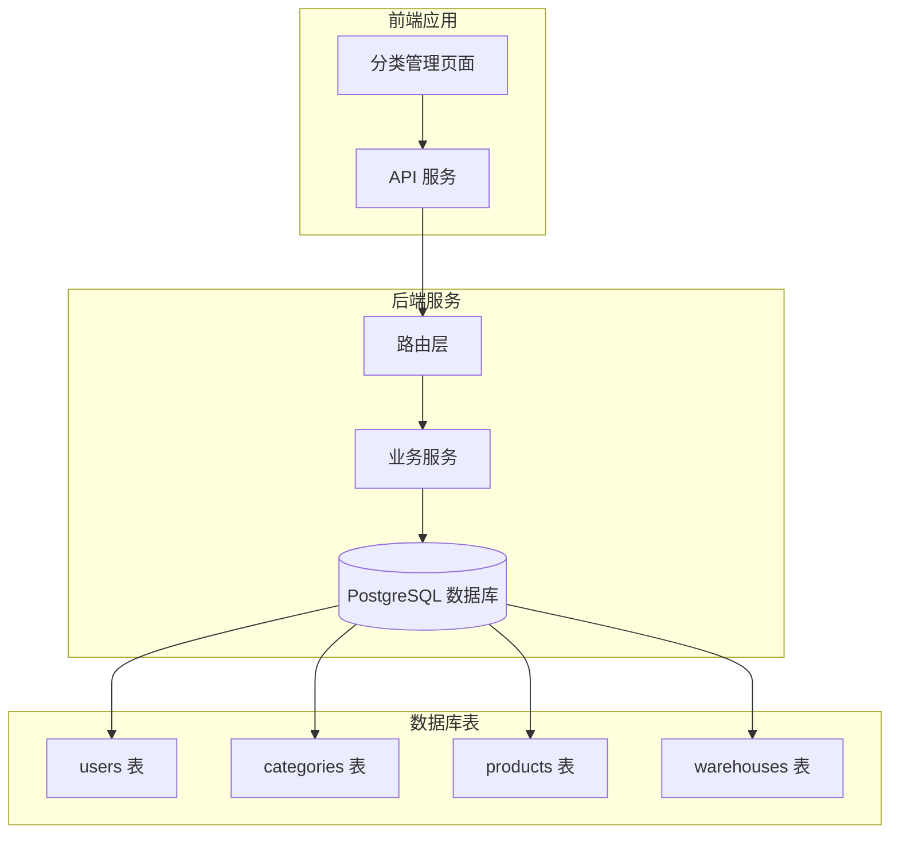
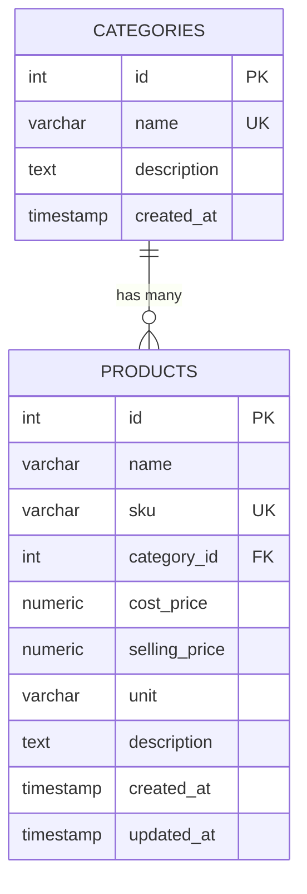
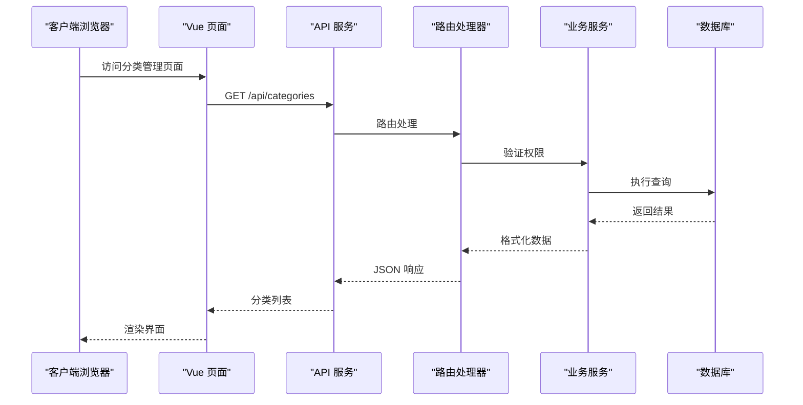
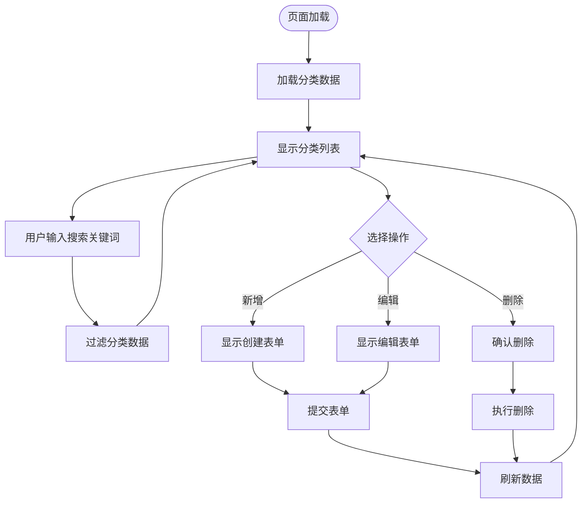
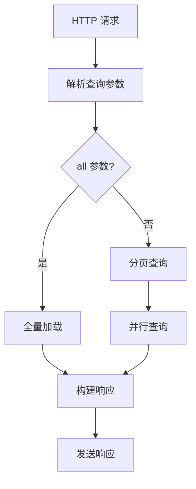
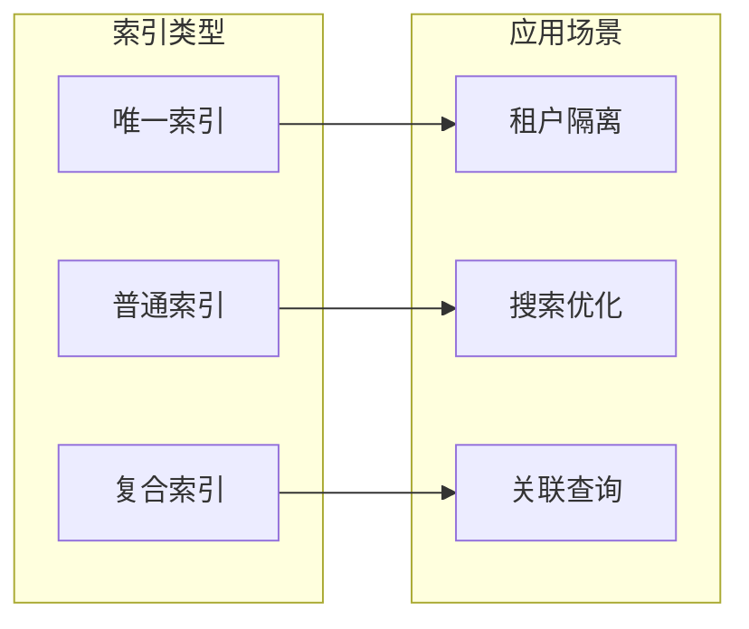
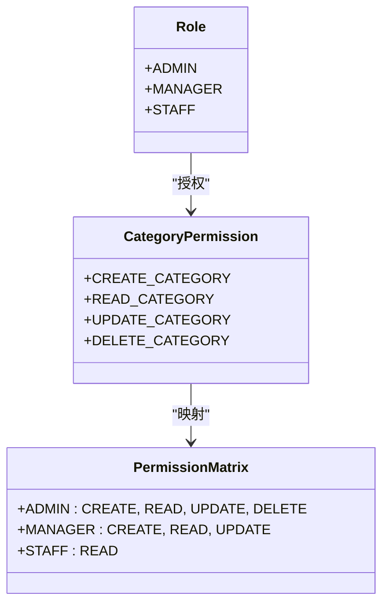
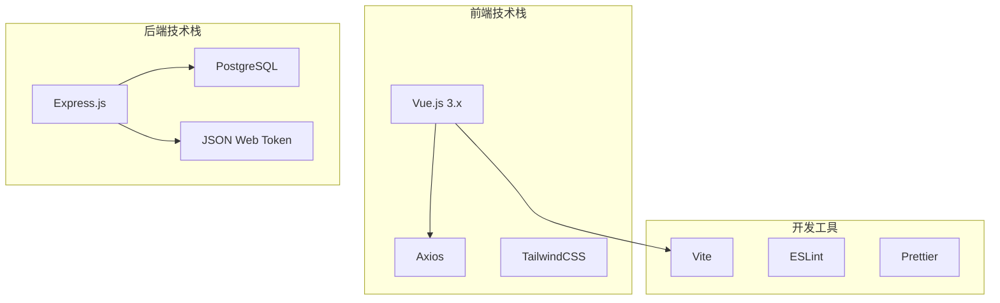
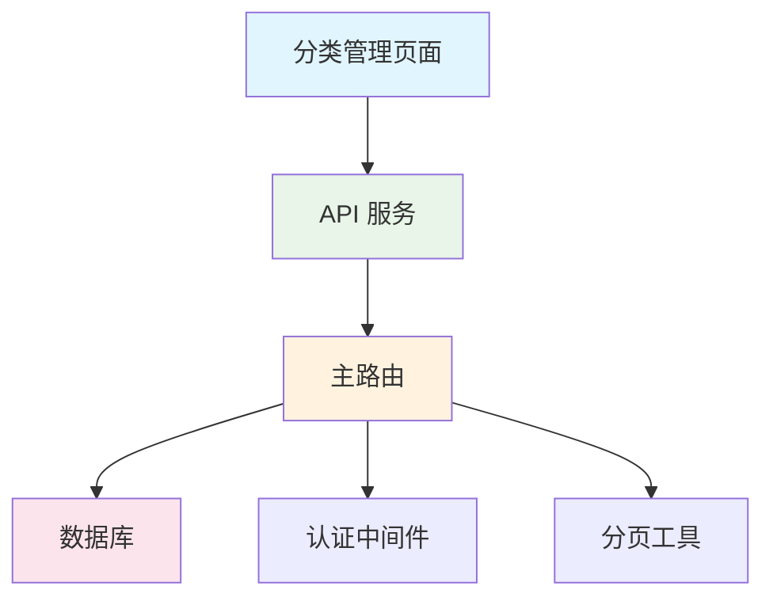
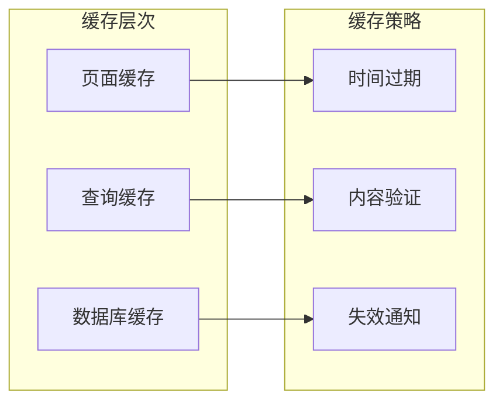

# 商品分类管理

<cite>
**本文档引用的文件**
- [masterRoutes.js](file://server/src/routes/masterRoutes.js)
- [CategoriesPage.vue](file://web/src/pages/CategoriesPage.vue)
- [schema.sql](file://server/database/schema.sql)
- [seed.sql](file://server/database/seed.sql)
- [pagination.js](file://server/src/utils/pagination.js)
- [api.js](file://web/src/services/api.js)
- [marketplaceSyncService.js](file://server/src/services/marketplaceSyncService.js)
- [accessGuide.js](file://web/src/constants/accessGuide.js)
</cite>

## 目录
1. [简介](#简介)
2. [项目结构](#项目结构)
3. [核心组件](#核心组件)
4. [架构概览](#架构概览)
5. [详细组件分析](#详细组件分析)
6. [依赖分析](#依赖分析)
7. [性能考虑](#性能考虑)
8. [故障排除指南](#故障排除指南)
9. [结论](#结论)

## 简介

本文件详细阐述了库存系统的商品分类管理体系，涵盖分类数据模型设计、层级结构实现、属性管理、搜索过滤功能以及权限控制机制。当前系统采用扁平化的分类结构（单层分类），通过外键关联实现与商品的绑定关系，并提供了完整的增删改查、搜索分页和权限控制功能。

## 项目结构

系统采用前后端分离架构：
- **后端**：基于 Express.js 的 Node.js 服务，使用 PostgreSQL 数据库
- **前端**：Vue.js 单页应用，提供分类管理界面
- **数据库**：PostgreSQL，包含用户、分类、仓库、商品等核心表

**图表来源**
- [CategoriesPage.vue:1-211](file://web/src/pages/CategoriesPage.vue#L1-L211)
- [masterRoutes.js:675-795](file://server/src/routes/masterRoutes.js#L675-L795)
- [schema.sql:15-54](file://server/database/schema.sql#L15-L54)

**章节来源**
- [CategoriesPage.vue:1-211](file://web/src/pages/CategoriesPage.vue#L1-L211)
- [masterRoutes.js:675-795](file://server/src/routes/masterRoutes.js#L675-L795)
- [schema.sql:15-54](file://server/database/schema.sql#L15-L54)

## 核心组件

### 数据模型设计

系统采用简洁的数据模型设计，主要包含以下核心表：

#### 分类表 (categories)
- **id**: 主键，自增整数
- **name**: 分类名称，唯一约束
- **description**: 分类描述，可选
- **created_at**: 创建时间戳，默认当前时间

#### 商品表 (products)
- **id**: 主键，自增整数
- **name**: 商品名称
- **sku**: SKU 编码，唯一约束
- **category_id**: 外键，关联分类表
- **其他字段**: 成本价、售价、单位、描述等

#### 关系映射

**图表来源**
- [schema.sql:15-54](file://server/database/schema.sql#L15-L54)

### 权限控制机制

系统实现了基于角色的权限控制（RBAC）：
- **ADMIN**: 系统管理员，拥有最高权限
- **MANAGER**: 仓库管理员，具备大部分操作权限
- **STAFF**: 前线员工，仅具备基础操作权限

分类管理接口的权限要求：
- 创建、更新、删除分类需要 ADMIN 或 MANAGER 角色
- 查询分类支持所有认证用户

**章节来源**
- [masterRoutes.js:734-795](file://server/src/routes/masterRoutes.js#L734-L795)
- [accessGuide.js:1-74](file://web/src/constants/accessGuide.js#L1-L74)

## 架构概览

系统采用分层架构模式：

**图表来源**
- [CategoriesPage.vue:25-43](file://web/src/pages/CategoriesPage.vue#L25-L43)
- [api.js:1-45](file://web/src/services/api.js#L1-L45)
- [masterRoutes.js:676-732](file://server/src/routes/masterRoutes.js#L676-L732)

## 详细组件分析

### 分类管理页面

#### 前端实现特点
- 支持搜索功能，实时过滤分类列表
- 提供分页显示，每页最多 8 条记录
- 支持新增、编辑、删除操作
- 响应式设计，适配移动端和桌面端

#### 页面交互流程

**图表来源**
- [CategoriesPage.vue:25-83](file://web/src/pages/CategoriesPage.vue#L25-L83)

**章节来源**
- [CategoriesPage.vue:1-211](file://web/src/pages/CategoriesPage.vue#L1-L211)

### 后端路由实现

#### 分类 CRUD 操作
系统提供了完整的分类管理 API：

| 操作 | 方法 | 路径 | 权限 | 功能 |
|------|------|------|------|------|
| 获取分类列表 | GET | `/api/categories` | 所有用户 | 支持搜索、分页、全量加载 |
| 创建分类 | POST | `/api/categories` | ADMIN/MANAGER | 新建分类 |
| 更新分类 | PUT | `/api/categories/:id` | ADMIN/MANAGER | 修改分类信息 |
| 删除分类 | DELETE | `/api/categories/:id` | ADMIN/MANAGER | 删除分类 |

#### 搜索和分页实现

**图表来源**
- [masterRoutes.js:676-732](file://server/src/routes/masterRoutes.js#L676-L732)
- [pagination.js:1-28](file://server/src/utils/pagination.js#L1-L28)

**章节来源**
- [masterRoutes.js:675-795](file://server/src/routes/masterRoutes.js#L675-L795)
- [pagination.js:1-28](file://server/src/utils/pagination.js#L1-L28)

### 数据库设计

#### 表结构特点
- **唯一性约束**: 通过 `(tenant_id, name)` 实现租户内唯一
- **外键关系**: 商品表通过 `category_id` 关联分类表
- **索引优化**: 为常用查询字段建立索引
- **软删除**: 使用 `ON DELETE SET NULL` 处理级联删除

#### 索引策略

**图表来源**
- [schema.sql:44-54](file://server/database/schema.sql#L44-L54)
- [schema.sql:410-447](file://server/database/schema.sql#L410-L447)

**章节来源**
- [schema.sql:15-54](file://server/database/schema.sql#L15-L54)
- [schema.sql:410-447](file://server/database/schema.sql#L410-L447)

### 权限控制实现

#### 角色权限矩阵

**图表来源**
- [accessGuide.js:1-74](file://web/src/constants/accessGuide.js#L1-L74)
- [masterRoutes.js:734-795](file://server/src/routes/masterRoutes.js#L734-L795)

**章节来源**
- [accessGuide.js:1-74](file://web/src/constants/accessGuide.js#L1-L74)
- [masterRoutes.js:734-795](file://server/src/routes/masterRoutes.js#L734-L795)

## 依赖分析

### 技术栈依赖

### 组件间依赖关系

**图表来源**
- [CategoriesPage.vue:1-211](file://web/src/pages/CategoriesPage.vue#L1-L211)
- [api.js:1-45](file://web/src/services/api.js#L1-L45)
- [masterRoutes.js:1-1571](file://server/src/routes/masterRoutes.js#L1-L1571)

**章节来源**
- [CategoriesPage.vue:1-211](file://web/src/pages/CategoriesPage.vue#L1-L211)
- [api.js:1-45](file://web/src/services/api.js#L1-L45)
- [masterRoutes.js:1-1571](file://server/src/routes/masterRoutes.js#L1-L1571)

## 性能考虑

### 查询优化策略

1. **索引优化**
   - 为 `categories.name` 建立唯一索引
   - 为 `products.category_id` 建立索引
   - 使用复合索引优化搜索查询

2. **分页策略**
   - 默认每页 8 条记录，避免大量数据传输
   - 支持 `all=true` 参数用于下拉框全量加载
   - 使用 `LIMIT` 和 `OFFSET` 控制查询范围

3. **并发处理**
   - 并行执行查询和计数操作
   - 使用事务保证数据一致性

### 缓存策略

## 故障排除指南

### 常见问题及解决方案

#### 1. 分类创建失败
**症状**: 创建分类时报错
**可能原因**:
- 分类名称重复
- 权限不足
- 数据库连接异常

**解决步骤**:
1. 检查分类名称是否已存在
2. 验证用户角色权限
3. 查看服务器日志

#### 2. 分类搜索无结果
**症状**: 搜索分类无匹配项
**可能原因**:
- 搜索关键词过短
- 数据库索引问题
- 查询参数错误

**解决步骤**:
1. 确认搜索关键词长度
2. 检查数据库索引状态
3. 验证查询参数格式

#### 3. 权限访问受限
**症状**: 无法执行分类管理操作
**可能原因**:
- 用户角色权限不足
- 会话过期
- 授权中间件异常

**解决步骤**:
1. 检查用户角色配置
2. 重新登录系统
3. 验证授权中间件状态

**章节来源**
- [masterRoutes.js:734-795](file://server/src/routes/masterRoutes.js#L734-L795)
- [CategoriesPage.vue:38-82](file://web/src/pages/CategoriesPage.vue#L38-L82)

## 结论

本商品分类管理系统实现了清晰的数据模型设计和完善的权限控制机制。当前版本采用扁平化分类结构，满足大多数中小企业的分类管理需求。系统具有以下优势：

1. **简洁高效**: 扁平化设计降低了复杂度，提高了查询效率
2. **权限明确**: 基于角色的权限控制确保了数据安全
3. **用户体验良好**: 响应式设计和分页功能提升了用户交互体验
4. **扩展性强**: 模块化设计便于后续功能扩展

未来可以考虑的功能增强：
- 支持多级分类层级结构
- 添加分类继承和属性管理功能
- 实现分类合并拆分操作
- 增强分类搜索和过滤能力