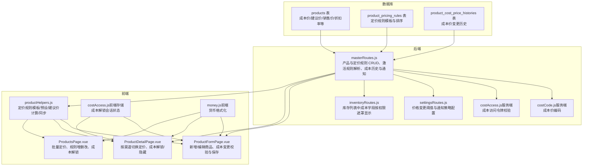
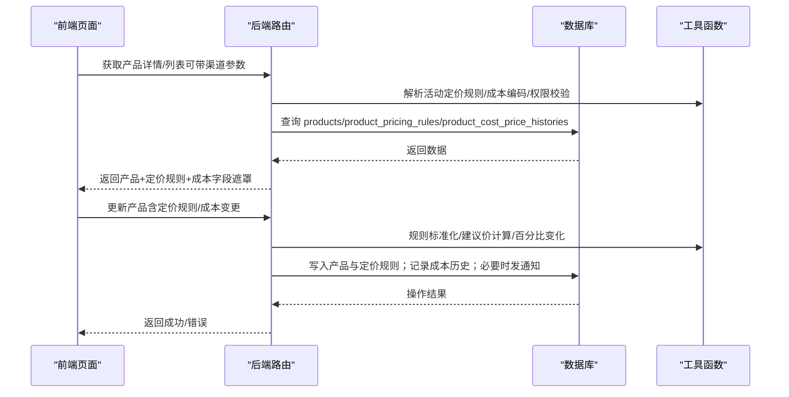
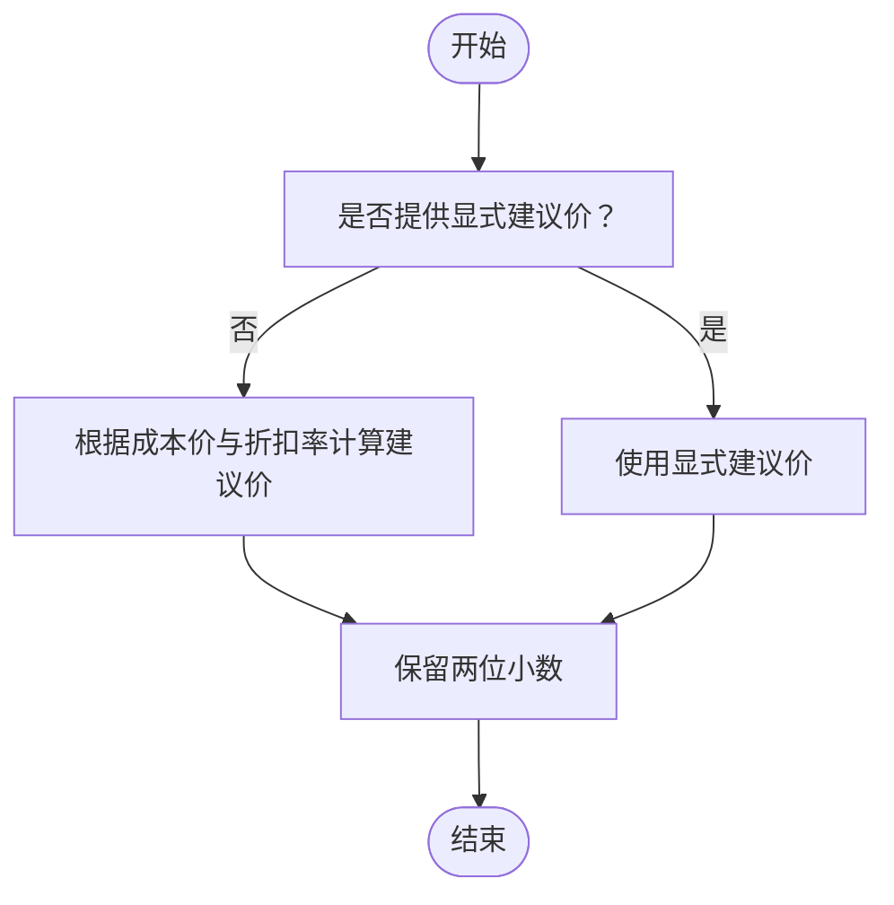
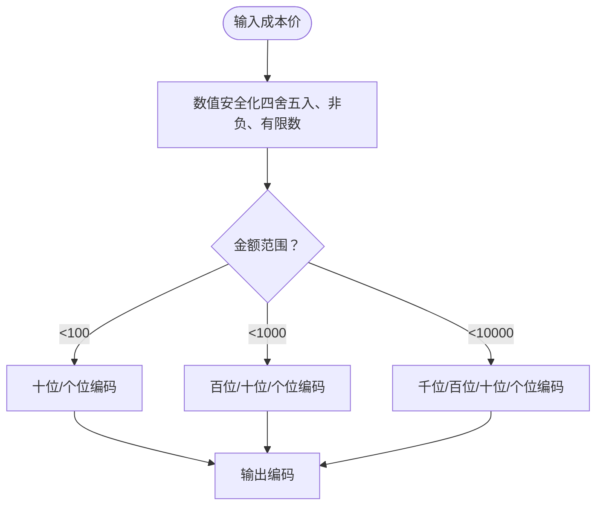
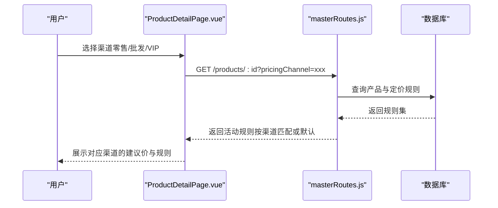
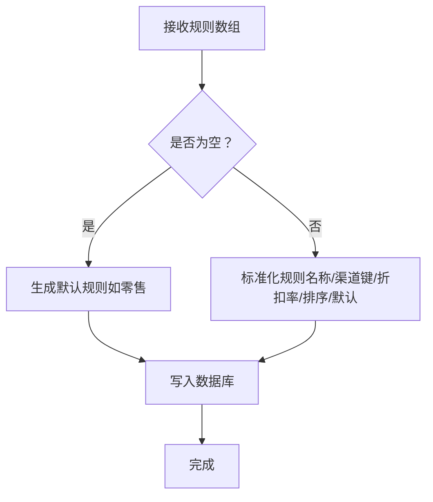
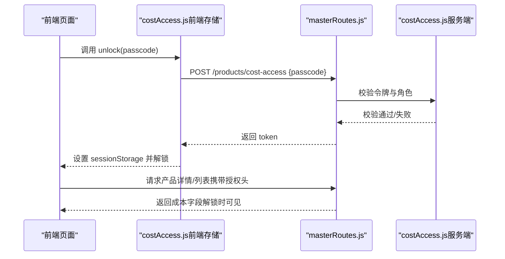
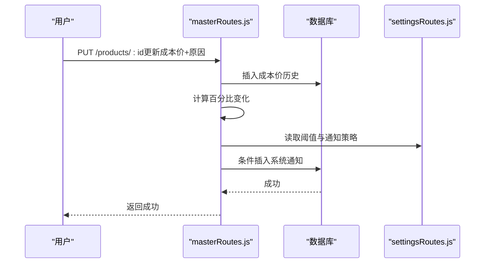
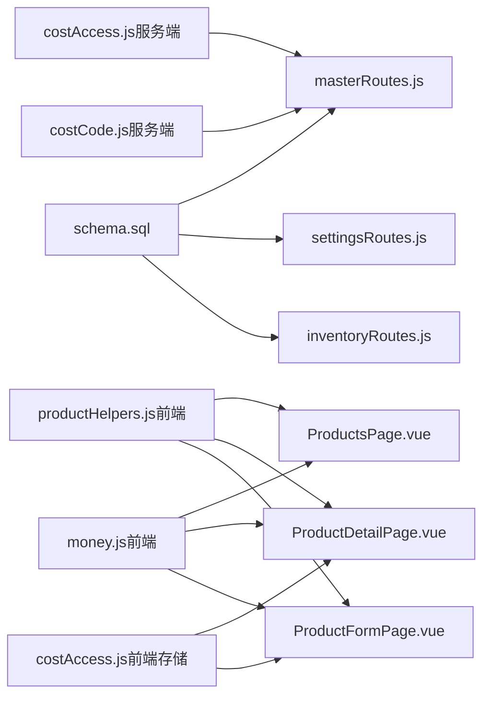

# 商品定价管理

<cite>
**本文引用的文件**
- [schema.sql](file://server/database/schema.sql)
- [masterRoutes.js](file://server/src/routes/masterRoutes.js)
- [settingsRoutes.js](file://server/src/routes/settingsRoutes.js)
- [inventoryRoutes.js](file://server/src/routes/inventoryRoutes.js)
- [costAccess.js（服务端）](file://server/src/utils/costAccess.js)
- [costCode.js（服务端）](file://server/src/utils/costCode.js)
- [money.js（前端）](file://web/src/utils/money.js)
- [costAccess.js（前端存储）](file://web/src/stores/costAccess.js)
- [productHelpers.js（前端工具）](file://web/src/utils/productHelpers.js)
- [ProductsPage.vue（前端页面）](file://web/src/pages/ProductsPage.vue)
- [ProductDetailPage.vue（前端页面）](file://web/src/pages/ProductDetailPage.vue)
- [ProductFormPage.vue（前端页面）](file://web/src/pages/ProductFormPage.vue)
</cite>

## 目录
1. [简介](#简介)
2. [项目结构](#项目结构)
3. [核心组件](#核心组件)
4. [架构总览](#架构总览)
5. [详细组件分析](#详细组件分析)
6. [依赖分析](#依赖分析)
7. [性能考虑](#性能考虑)
8. [故障排查指南](#故障排查指南)
9. [结论](#结论)
10. [附录](#附录)

## 简介
本文件系统化梳理商品定价管理模块，覆盖成本价、建议价、销售价的关系与计算逻辑，成本价编码系统，利润率与定价规则模板，多渠道定价（零售、批发、VIP），定价规则的动态切换与管理，成本保护机制（权限控制、临时解锁、成本编码转换），以及定价策略优化、价格调整历史、批量定价操作、价格数据校验与定价准确性保障等最佳实践。

## 项目结构
定价相关能力横跨数据库模式、后端路由与工具函数、前端页面与工具函数，形成“数据库模型 → 后端服务 → 前端交互”的完整闭环。

图表来源
- [schema.sql](file://server/database/schema.sql)
- [masterRoutes.js](file://server/src/routes/masterRoutes.js)
- [settingsRoutes.js](file://server/src/routes/settingsRoutes.js)
- [inventoryRoutes.js](file://server/src/routes/inventoryRoutes.js)
- [costAccess.js（服务端）](file://server/src/utils/costAccess.js)
- [costCode.js（服务端）](file://server/src/utils/costCode.js)
- [productHelpers.js（前端工具）](file://web/src/utils/productHelpers.js)
- [ProductsPage.vue（前端页面）](file://web/src/pages/ProductsPage.vue)
- [ProductDetailPage.vue（前端页面）](file://web/src/pages/ProductDetailPage.vue)
- [ProductFormPage.vue（前端页面）](file://web/src/pages/ProductFormPage.vue)
- [money.js（前端）](file://web/src/utils/money.js)
- [costAccess.js（前端存储）](file://web/src/stores/costAccess.js)

章节来源
- [schema.sql](file://server/database/schema.sql)
- [masterRoutes.js](file://server/src/routes/masterRoutes.js)
- [settingsRoutes.js](file://server/src/routes/settingsRoutes.js)
- [inventoryRoutes.js](file://server/src/routes/inventoryRoutes.js)
- [costAccess.js（服务端）](file://server/src/utils/costAccess.js)
- [costCode.js（服务端）](file://server/src/utils/costCode.js)
- [productHelpers.js（前端工具）](file://web/src/utils/productHelpers.js)
- [ProductsPage.vue（前端页面）](file://web/src/pages/ProductsPage.vue)
- [ProductDetailPage.vue（前端页面）](file://web/src/pages/ProductDetailPage.vue)
- [ProductFormPage.vue（前端页面）](file://web/src/pages/ProductFormPage.vue)
- [money.js（前端）](file://web/src/utils/money.js)
- [costAccess.js（前端存储）](file://web/src/stores/costAccess.js)

## 核心组件
- 数据模型：products 表承载成本价、建议价、销售价、折扣率等；product_pricing_rules 存储定价规则模板；product_cost_price_histories 记录成本价变更历史。
- 后端服务：masterRoutes 提供产品与定价规则的创建/更新/查询，解析活动定价规则，记录成本价历史与触发通知；settingsRoutes 提供价格变更阈值与通知策略配置；inventoryRoutes 在库存列表中按权限遮罩成本字段。
- 成本保护：服务端通过 JWT 令牌校验成本访问权限；前端通过会话存储成本解锁令牌，仅在解锁期间可见成本。
- 成本编码：服务端/前端均提供成本价到编码的转换，用于安全展示与审计。
- 建议价与规则：前端提供定价规则模板与预设，后端提供规则标准化与默认规则解析。

章节来源
- [schema.sql](file://server/database/schema.sql)
- [masterRoutes.js](file://server/src/routes/masterRoutes.js)
- [settingsRoutes.js](file://server/src/routes/settingsRoutes.js)
- [inventoryRoutes.js](file://server/src/routes/inventoryRoutes.js)
- [costAccess.js（服务端）](file://server/src/utils/costAccess.js)
- [costCode.js（服务端）](file://server/src/utils/costCode.js)
- [productHelpers.js（前端工具）](file://web/src/utils/productHelpers.js)

## 架构总览
后端以路由为中心，统一处理产品与定价规则的业务逻辑，并通过工具函数完成成本价编码、权限校验与规则标准化。前端页面负责交互与展示，结合工具函数进行定价规则的构建、同步与格式化。

图表来源
- [masterRoutes.js](file://server/src/routes/masterRoutes.js)
- [settingsRoutes.js](file://server/src/routes/settingsRoutes.js)
- [schema.sql](file://server/database/schema.sql)

## 详细组件分析

### 成本价、建议价、销售价的关系与计算
- 字段定义：products 表包含成本价、建议价、销售价、折扣率等字段，建议价与销售价在迁移脚本中保持一致性。
- 建议价计算：前端与后端均提供建议价计算方法，基于成本价与折扣率（百分比）计算，保留两位小数。
- 默认规则：若未显式提供建议价，系统根据成本价与折扣率推导默认建议价；若无任何定价规则，则生成默认“零售”规则。

图表来源
- [masterRoutes.js](file://server/src/routes/masterRoutes.js)
- [productHelpers.js（前端工具）](file://web/src/utils/productHelpers.js)

章节来源
- [schema.sql](file://server/database/schema.sql)
- [masterRoutes.js](file://server/src/routes/masterRoutes.js)
- [productHelpers.js（前端工具）](file://web/src/utils/productHelpers.js)

### 成本价编码系统
- 编码规则：将成本价数值映射为固定长度的字母编码，支持百位、千位、万位级别的编码，便于脱敏展示与审计追踪。
- 前后端一致：服务端与前端实现一致的成本价编码算法，确保前后端展示一致。
- 使用场景：在列表与详情中以编码替代真实金额显示，仅在授权时展示真实金额。

图表来源
- [costCode.js（服务端）](file://server/src/utils/costCode.js)
- [costCode.js（前端）](file://web/src/utils/costCode.js)

章节来源
- [costCode.js（服务端）](file://server/src/utils/costCode.js)
- [costCode.js（前端）](file://web/src/utils/costCode.js)

### 多渠道定价与动态切换
- 渠道键：定价规则包含 channel_key 字段，支持零售、批发、VIP 等渠道；系统根据传入的渠道键或默认规则解析活动规则。
- 前端切换：产品详情页与产品列表页支持通过下拉选择切换渠道，自动刷新建议价与活动规则。
- 规则模板：前端提供定价规则模板（如零售/批发/VIP），后端提供默认规则构建逻辑，保证首次即有可用规则。

图表来源
- [ProductDetailPage.vue（前端页面）](file://web/src/pages/ProductDetailPage.vue)
- [masterRoutes.js](file://server/src/routes/masterRoutes.js)

章节来源
- [ProductDetailPage.vue（前端页面）](file://web/src/pages/ProductDetailPage.vue)
- [masterRoutes.js](file://server/src/routes/masterRoutes.js)
- [schema.sql](file://server/database/schema.sql)

### 定价规则的创建与管理
- 规则标准化：后端对传入规则进行标准化（名称、渠道键、折扣率、排序、默认标记），若为空则生成默认规则。
- 默认规则：若未指定，默认规则为第一个规则或标记为默认的规则。
- 批量管理：前端提供添加、删除、设置默认、批量应用折扣率等操作，实时同步建议价与折扣率。

图表来源
- [masterRoutes.js](file://server/src/routes/masterRoutes.js)
- [ProductsPage.vue（前端页面）](file://web/src/pages/ProductsPage.vue)
- [productHelpers.js（前端工具）](file://web/src/utils/productHelpers.js)

章节来源
- [masterRoutes.js](file://server/src/routes/masterRoutes.js)
- [ProductsPage.vue（前端页面）](file://web/src/pages/ProductsPage.vue)
- [productHelpers.js（前端工具）](file://web/src/utils/productHelpers.js)

### 成本保护机制
- 令牌校验：服务端通过 JWT 校验 x-cost-access-token 请求头，要求角色为 ADMIN 或 MANAGER，且令牌目的为 cost-access，且与当前用户匹配。
- 前端解锁：前端通过 costAccess 存储管理解锁会话，提交解锁请求后将令牌存入 sessionStorage，解锁期间可见成本字段。
- 列表遮罩：库存列表在未授权时将成本字段置空，避免泄露敏感信息。

图表来源
- [costAccess.js（服务端）](file://server/src/utils/costAccess.js)
- [costAccess.js（前端存储）](file://web/src/stores/costAccess.js)
- [ProductFormPage.vue（前端页面）](file://web/src/pages/ProductFormPage.vue)
- [ProductDetailPage.vue（前端页面）](file://web/src/pages/ProductDetailPage.vue)
- [inventoryRoutes.js](file://server/src/routes/inventoryRoutes.js)

章节来源
- [costAccess.js（服务端）](file://server/src/utils/costAccess.js)
- [costAccess.js（前端存储）](file://web/src/stores/costAccess.js)
- [ProductFormPage.vue（前端页面）](file://web/src/pages/ProductFormPage.vue)
- [ProductDetailPage.vue（前端页面）](file://web/src/pages/ProductDetailPage.vue)
- [inventoryRoutes.js](file://server/src/routes/inventoryRoutes.js)

### 价格调整历史与通知策略
- 历史记录：每次成本价变更都会记录旧值、新值、百分比变化、变更原因与操作人，并限制历史记录数量。
- 阈值与通知：系统设置价格变更阈值百分比，超过阈值自动向目标角色发送系统通知。
- 配置接口：管理员可通过设置接口调整阈值、开关与通知角色。

图表来源
- [masterRoutes.js](file://server/src/routes/masterRoutes.js)
- [settingsRoutes.js](file://server/src/routes/settingsRoutes.js)
- [schema.sql](file://server/database/schema.sql)

章节来源
- [masterRoutes.js](file://server/src/routes/masterRoutes.js)
- [settingsRoutes.js](file://server/src/routes/settingsRoutes.js)
- [schema.sql](file://server/database/schema.sql)

### 批量定价操作与优化建议
- 批量应用折扣：前端提供批量应用折扣率功能，自动同步所有规则的建议价。
- 规则同步：当成本价变化时，前端会同步所有规则的建议价，确保一致性。
- 最佳实践：建议在批量修改前先锁定成本，确认原因与影响范围，完成后及时隐藏成本字段。

章节来源
- [ProductsPage.vue（前端页面）](file://web/src/pages/ProductsPage.vue)
- [productHelpers.js（前端工具）](file://web/src/utils/productHelpers.js)

### 价格数据验证与定价准确性
- 数值安全：前后端均对输入进行安全化处理（有限数、非负、四舍五入），避免异常值进入数据库。
- 货币格式化：前端使用本地化格式化货币，确保展示一致性。
- 百分比变化：计算百分比变化时处理除零与边界情况，保留四位小数以提高精度。

章节来源
- [masterRoutes.js](file://server/src/routes/masterRoutes.js)
- [money.js（前端）](file://web/src/utils/money.js)

## 依赖分析
- 数据层依赖：产品与定价规则依赖数据库表结构；成本价历史依赖独立表。
- 服务层依赖：masterRoutes 依赖 costAccess 与 costCode 工具；settingsRoutes 依赖系统设置表。
- 前端依赖：页面依赖工具函数与存储，实现交互与展示。

图表来源
- [schema.sql](file://server/database/schema.sql)
- [masterRoutes.js](file://server/src/routes/masterRoutes.js)
- [settingsRoutes.js](file://server/src/routes/settingsRoutes.js)
- [inventoryRoutes.js](file://server/src/routes/inventoryRoutes.js)
- [costAccess.js（服务端）](file://server/src/utils/costAccess.js)
- [costCode.js（服务端）](file://server/src/utils/costCode.js)
- [productHelpers.js（前端工具）](file://web/src/utils/productHelpers.js)
- [ProductsPage.vue（前端页面）](file://web/src/pages/ProductsPage.vue)
- [ProductDetailPage.vue（前端页面）](file://web/src/pages/ProductDetailPage.vue)
- [ProductFormPage.vue（前端页面）](file://web/src/pages/ProductFormPage.vue)
- [money.js（前端）](file://web/src/utils/money.js)
- [costAccess.js（前端存储）](file://web/src/stores/costAccess.js)

## 性能考虑
- 列表分页与搜索：库存列表支持分页与搜索，避免一次性加载大量数据。
- 条件查询：按渠道键或规则名匹配活动规则，减少前端复杂计算。
- 历史记录裁剪：成本价历史仅保留最近若干条，降低查询与存储压力。

章节来源
- [inventoryRoutes.js](file://server/src/routes/inventoryRoutes.js)
- [masterRoutes.js](file://server/src/routes/masterRoutes.js)

## 故障排查指南
- 成本字段不可见
  - 检查是否已解锁成本（前端存储是否存在令牌）。
  - 确认请求头是否携带有效的成本访问令牌（服务端校验）。
- 更新成本被拒绝
  - 确认当前用户角色为 ADMIN 或 MANAGER。
  - 若成本发生变更，需提供变更原因。
- 渠道规则不生效
  - 检查 channel_key 是否正确，或是否依赖默认规则。
- 价格变更通知未触发
  - 检查阈值设置与通知角色配置。

章节来源
- [costAccess.js（服务端）](file://server/src/utils/costAccess.js)
- [ProductFormPage.vue（前端页面）](file://web/src/pages/ProductFormPage.vue)
- [settingsRoutes.js](file://server/src/routes/settingsRoutes.js)

## 结论
该定价管理体系以数据库模型为基础，后端路由为核心，前后端工具函数协同，实现了从成本价编码、建议价计算、多渠道定价规则到成本保护与历史通知的完整闭环。通过标准化规则、权限控制与阈值通知，系统在保证定价准确性的同时，兼顾了安全性与可维护性。

## 附录
- 数据模型要点
  - products：成本价、建议价、销售价、折扣率、重购点等。
  - product_pricing_rules：规则名称、渠道键、折扣率、建议价、默认标记、排序。
  - product_cost_price_histories：成本价变更历史与阈值通知。
- 前端工具要点
  - 定价规则模板与预设、建议价计算、规则同步。
  - 成本解锁会话管理、货币格式化、成本价编码。

章节来源
- [schema.sql](file://server/database/schema.sql)
- [productHelpers.js（前端工具）](file://web/src/utils/productHelpers.js)
- [money.js（前端）](file://web/src/utils/money.js)