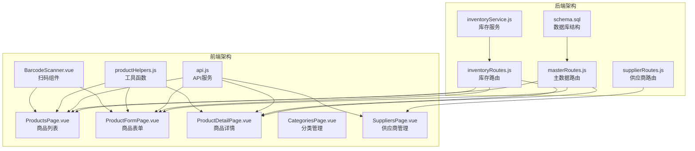
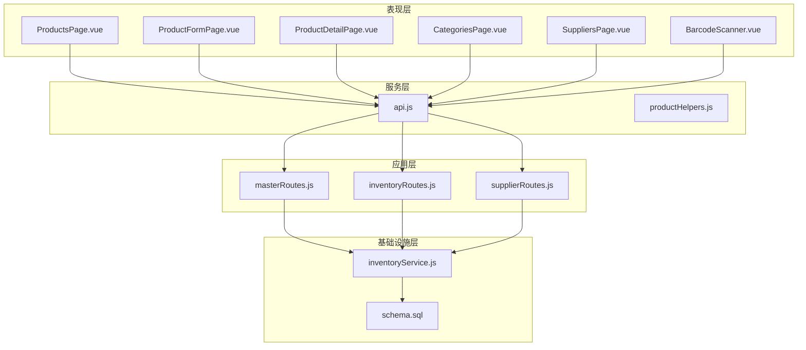
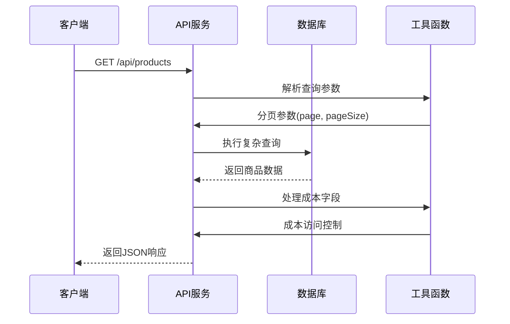
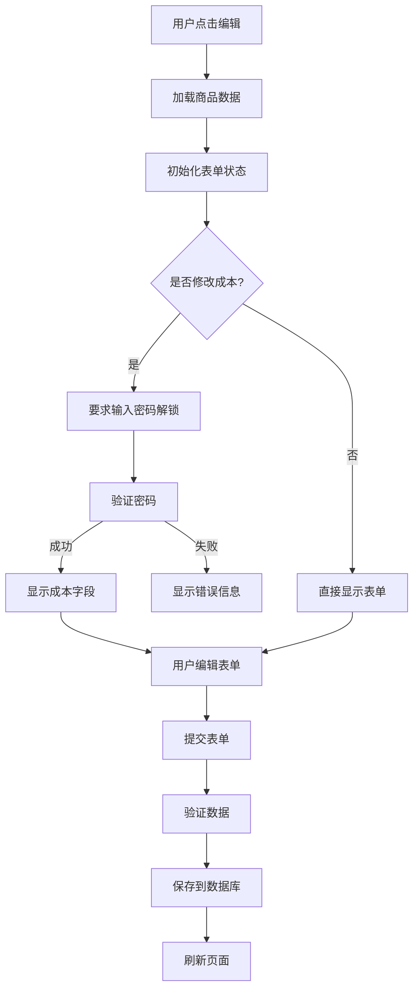
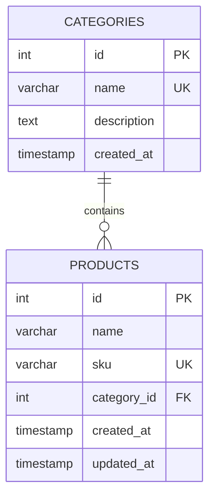
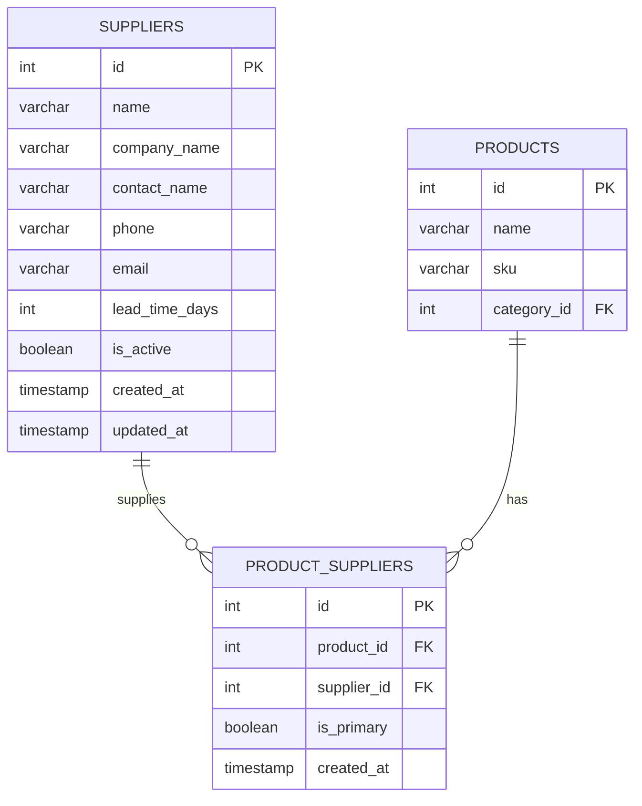
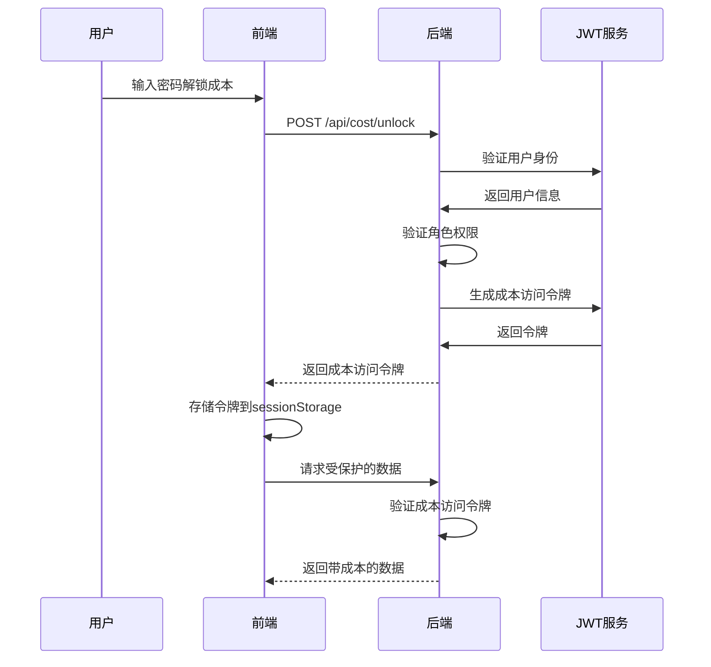
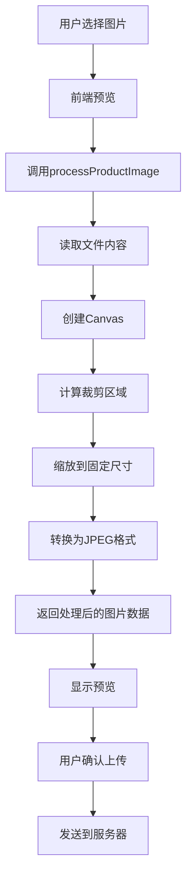
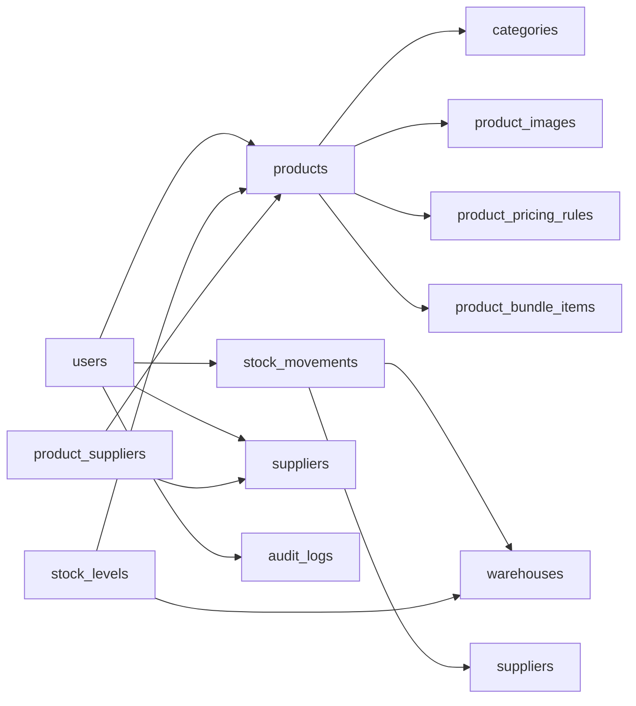
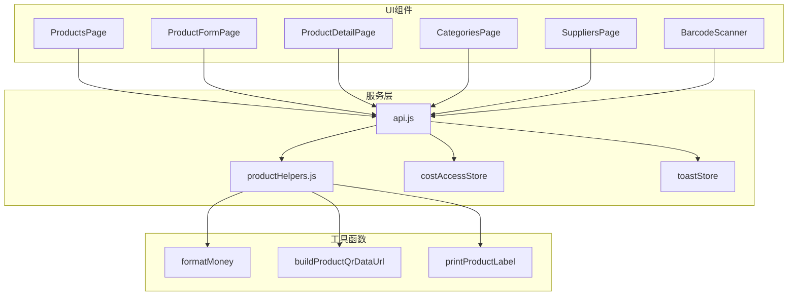

# 商品管理模块

<cite>
**本文档引用的文件**
- [schema.sql](file://server/database/schema.sql)
- [masterRoutes.js](file://server/src/routes/masterRoutes.js)
- [inventoryRoutes.js](file://server/src/routes/inventoryRoutes.js)
- [supplierRoutes.js](file://server/src/routes/supplierRoutes.js)
- [inventoryService.js](file://server/src/utils/inventoryService.js)
- [ProductsPage.vue](file://web/src/pages/ProductsPage.vue)
- [ProductFormPage.vue](file://web/src/pages/ProductFormPage.vue)
- [ProductDetailPage.vue](file://web/src/pages/ProductDetailPage.vue)
- [CategoriesPage.vue](file://web/src/pages/CategoriesPage.vue)
- [SuppliersPage.vue](file://web/src/pages/SuppliersPage.vue)
- [BarcodeScanner.vue](file://web/src/components/BarcodeScanner.vue)
- [api.js](file://web/src/services/api.js)
- [productHelpers.js](file://web/src/utils/productHelpers.js)
</cite>

## 目录
1. [简介](#简介)
2. [项目结构](#项目结构)
3. [核心组件](#核心组件)
4. [架构概览](#架构概览)
5. [详细组件分析](#详细组件分析)
6. [依赖关系分析](#依赖关系分析)
7. [性能考虑](#性能考虑)
8. [故障排除指南](#故障排除指南)
9. [结论](#结论)

## 简介

商品管理模块是库存管理系统的核心功能模块，负责商品信息的全生命周期管理。该模块实现了完整的商品数据模型、分类管理、供应商管理以及高级功能如批量操作、图片上传、Barcode扫描等。系统采用前后端分离架构，后端基于Node.js + Express，前端基于Vue.js，提供现代化的商品管理体验。

## 项目结构

商品管理模块主要分布在以下目录结构中：

**图表来源**
- [schema.sql:1-420](file://server/database/schema.sql#L1-L420)
- [masterRoutes.js:1-800](file://server/src/routes/masterRoutes.js#L1-L800)
- [ProductsPage.vue:1-800](file://web/src/pages/ProductsPage.vue#L1-L800)

**章节来源**
- [schema.sql:1-420](file://server/database/schema.sql#L1-L420)
- [masterRoutes.js:1-800](file://server/src/routes/masterRoutes.js#L1-L800)

## 核心组件

### 数据模型设计

系统采用关系型数据库设计，核心数据模型包括：

#### 商品表 (products)
- **主键**: id (自增)
- **唯一约束**: sku, product_code, barcode
- **核心字段**: 名称、SKU、产品编码、条形码、描述、规格、价格等
- **业务字段**: 成本价、销售价、加价率、建议价、重购线等

#### 库存表 (stock_levels)
- **复合主键**: (product_id, warehouse_id)
- **字段**: 在库数量、已分配数量、更新时间
- **约束**: 数量必须非负

#### 分类表 (categories)
- **唯一约束**: name
- **字段**: 名称、描述、创建时间

#### 供应商表 (suppliers)
- **字段**: 公司名称、联系人、电话、邮箱、地址、付款条件等
- **业务字段**: 交货周期、状态等

**章节来源**
- [schema.sql:32-133](file://server/database/schema.sql#L32-L133)

### 前端组件架构

#### 商品管理组件
- **ProductsPage.vue**: 商品列表展示，支持搜索、筛选、批量操作
- **ProductFormPage.vue**: 商品表单编辑，支持成本保护、图片处理
- **ProductDetailPage.vue**: 商品详情页面，展示完整信息和历史记录

#### 辅助组件
- **CategoriesPage.vue**: 商品分类管理
- **SuppliersPage.vue**: 供应商管理
- **BarcodeScanner.vue**: 条形码扫描功能

**章节来源**
- [ProductsPage.vue:1-800](file://web/src/pages/ProductsPage.vue#L1-L800)
- [ProductFormPage.vue:1-505](file://web/src/pages/ProductFormPage.vue#L1-L505)
- [ProductDetailPage.vue:1-486](file://web/src/pages/ProductDetailPage.vue#L1-L486)

## 架构概览

系统采用分层架构设计，确保职责清晰和可维护性：

**图表来源**
- [api.js:1-45](file://web/src/services/api.js#L1-L45)
- [masterRoutes.js:1-800](file://server/src/routes/masterRoutes.js#L1-L800)
- [inventoryRoutes.js:1-493](file://server/src/routes/inventoryRoutes.js#L1-L493)

## 详细组件分析

### 商品CRUD操作实现

#### 列表查询功能
商品列表查询支持多种筛选条件和分页机制：

**图表来源**
- [ProductsPage.vue:208-242](file://web/src/pages/ProductsPage.vue#L208-L242)
- [inventoryRoutes.js:17-151](file://server/src/routes/inventoryRoutes.js#L17-L151)

#### 表单编辑功能
商品表单支持完整的编辑流程，包括成本保护和图片处理：

**图表来源**
- [ProductFormPage.vue:87-124](file://web/src/pages/ProductFormPage.vue#L87-L124)
- [ProductFormPage.vue:126-171](file://web/src/pages/ProductFormPage.vue#L126-L171)

#### 详情展示功能
商品详情页面提供完整的信息展示和历史记录：

**章节来源**
- [ProductsPage.vue:244-297](file://web/src/pages/ProductsPage.vue#L244-L297)
- [ProductDetailPage.vue:57-81](file://web/src/pages/ProductDetailPage.vue#L57-L81)

### 商品分类体系

#### 分类数据模型
分类系统采用简单的层次结构设计：

**图表来源**
- [schema.sql:15-54](file://server/database/schema.sql#L15-L54)

#### 分类管理功能
分类管理支持CRUD操作，提供搜索和分页功能：

**章节来源**
- [CategoriesPage.vue:25-89](file://web/src/pages/CategoriesPage.vue#L25-L89)
- [masterRoutes.js:664-773](file://server/src/routes/masterRoutes.js#L664-L773)

### 供应商管理功能

#### 供应商数据模型
供应商系统支持多对多关系，通过中间表建立商品与供应商的关联：

**图表来源**
- [schema.sql:302-331](file://server/database/schema.sql#L302-L331)

#### 供应商管理功能
供应商管理提供完整的CRUD操作，支持状态管理和排序功能：

**章节来源**
- [SuppliersPage.vue:29-82](file://web/src/pages/SuppliersPage.vue#L29-L82)
- [supplierRoutes.js:23-92](file://server/src/routes/supplierRoutes.js#L23-L92)

### 高级功能实现

#### 成本保护机制
系统实现多层次的成本保护机制：

**图表来源**
- [masterRoutes.js:95-117](file://server/src/routes/masterRoutes.js#L95-L117)
- [ProductFormPage.vue:173-188](file://web/src/pages/ProductFormPage.vue#L173-L188)

#### 图片上传和处理
系统提供完整的图片处理功能：

**图表来源**
- [productHelpers.js:168-195](file://web/src/utils/productHelpers.js#L168-L195)
- [ProductsPage.vue:397-436](file://web/src/pages/ProductsPage.vue#L397-L436)

#### Barcode扫描功能
集成ZXing库实现扫码功能：

**章节来源**
- [BarcodeScanner.vue:13-38](file://web/src/components/BarcodeScanner.vue#L13-L38)
- [ProductsPage.vue:383-391](file://web/src/pages/ProductsPage.vue#L383-L391)

## 依赖关系分析

### 数据库依赖关系

**图表来源**
- [schema.sql:1-420](file://server/database/schema.sql#L1-L420)

### 前端依赖关系

**图表来源**
- [api.js:1-45](file://web/src/services/api.js#L1-L45)
- [productHelpers.js:1-196](file://web/src/utils/productHelpers.js#L1-L196)

**章节来源**
- [schema.sql:1-420](file://server/database/schema.sql#L1-L420)
- [api.js:1-45](file://web/src/services/api.js#L1-L45)

## 性能考虑

### 数据库性能优化

1. **索引策略**: 系统为常用查询字段建立了适当的索引
   - 商品: product_code, sku, barcode
   - 供应商: name, is_active
   - 库存: product_id, warehouse_id

2. **查询优化**: 使用EXPLAIN分析查询计划，避免N+1查询问题

3. **连接池管理**: 合理配置数据库连接池大小

### 前端性能优化

1. **懒加载**: 使用defineAsyncComponent实现组件懒加载
2. **虚拟滚动**: 对于大量数据使用虚拟滚动技术
3. **缓存策略**: 合理使用浏览器缓存和本地存储
4. **图片优化**: 自动压缩和裁剪图片，减少传输体积

### 后端性能优化

1. **批量操作**: 支持批量删除、批量更新等操作
2. **异步处理**: 使用Promise.all并行处理多个请求
3. **事务管理**: 合理使用数据库事务保证数据一致性

## 故障排除指南

### 常见问题及解决方案

#### 成本解锁失败
- **症状**: 成功解锁但无法看到成本数据
- **原因**: 会话过期或权限不足
- **解决**: 检查JWT令牌有效性，确认用户角色为ADMIN或MANAGER

#### 图片上传失败
- **症状**: 图片无法上传或显示错误
- **原因**: 文件格式不支持或文件过大
- **解决**: 确认图片格式为JPG/PNG，文件大小不超过限制

#### 库存操作异常
- **症状**: 库存数量显示不正确
- **原因**: 并发操作导致的数据不一致
- **解决**: 检查事务处理，确保使用正确的锁机制

#### Barcode扫描失败
- **症状**: 相机权限被拒绝或扫描不到条码
- **原因**: 浏览器兼容性或设备权限问题
- **解决**: 检查浏览器设置，确保相机权限已授权

**章节来源**
- [masterRoutes.js:95-117](file://server/src/routes/masterRoutes.js#L95-L117)
- [BarcodeScanner.vue:28-31](file://web/src/components/BarcodeScanner.vue#L28-L31)

## 结论

商品管理模块是一个功能完整、架构清晰的库存管理系统核心部分。系统通过合理的数据模型设计、完善的权限控制、丰富的前端交互和高效的后端处理，为用户提供了一站式的商品管理解决方案。

模块的主要优势包括：
- **完整的CRUD功能**: 支持商品信息的全生命周期管理
- **灵活的分类体系**: 支持多层级分类和属性管理
- **强大的供应商管理**: 提供完整的供应商信息和采购管理
- **高级功能丰富**: 包括成本保护、图片处理、Barcode扫描等
- **性能优化到位**: 通过索引、缓存和异步处理提升性能
- **用户体验优秀**: 现代化的界面设计和流畅的操作体验

未来可以考虑的功能扩展包括：
- 导入导出功能的增强
- 更复杂的定价策略
- 移动端应用支持
- 实时库存监控
- 集成第三方平台