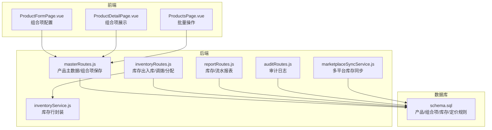
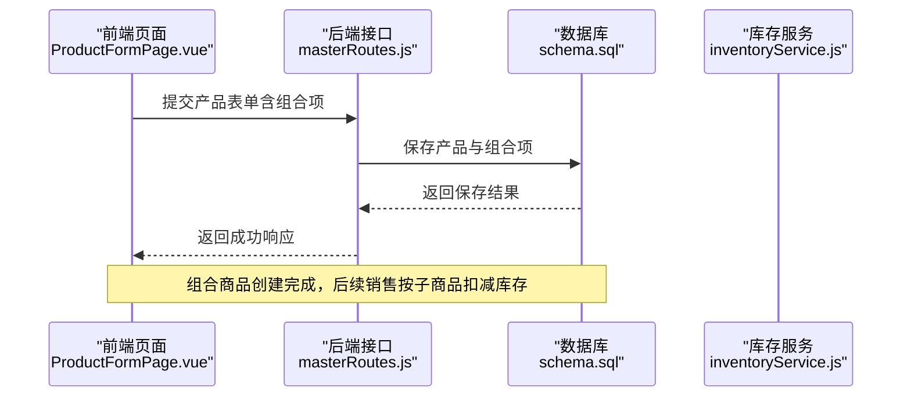
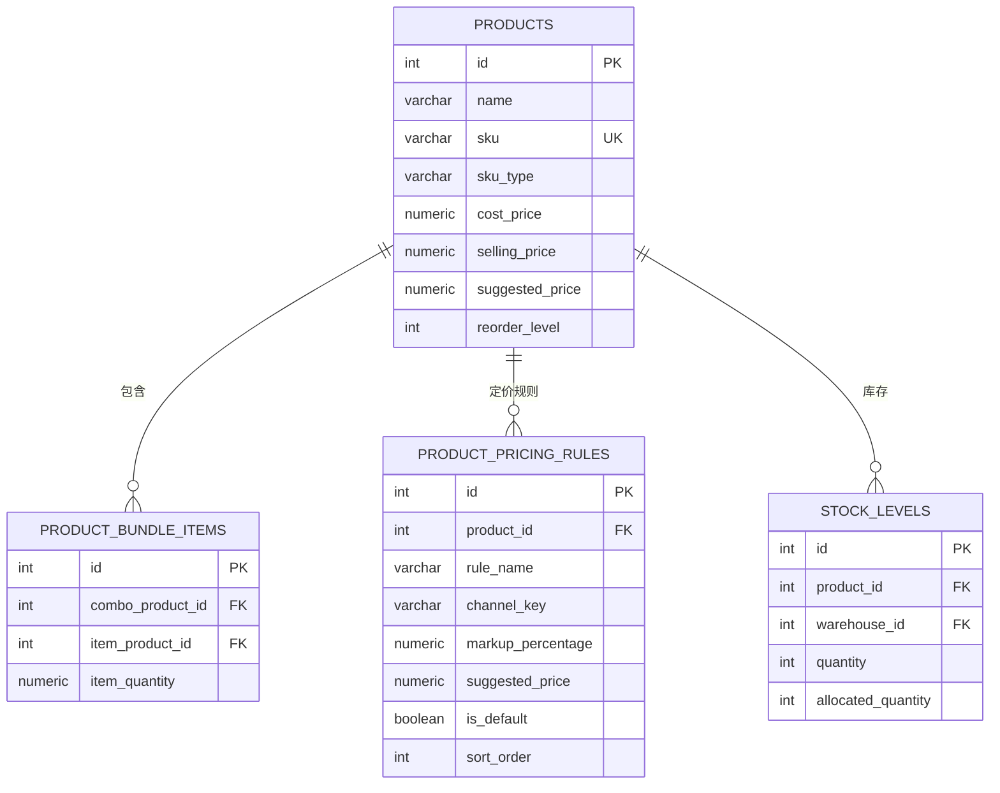
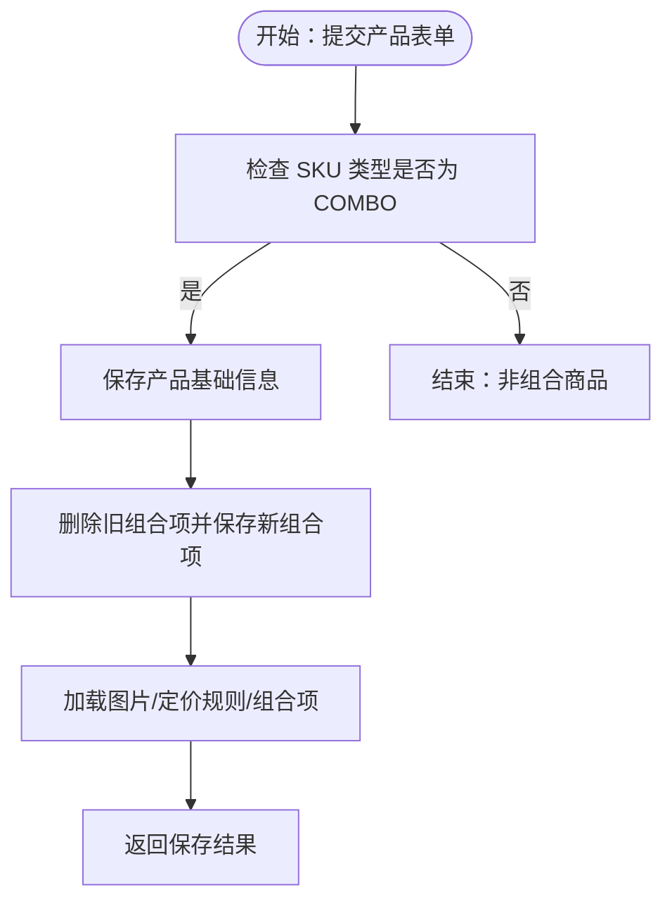
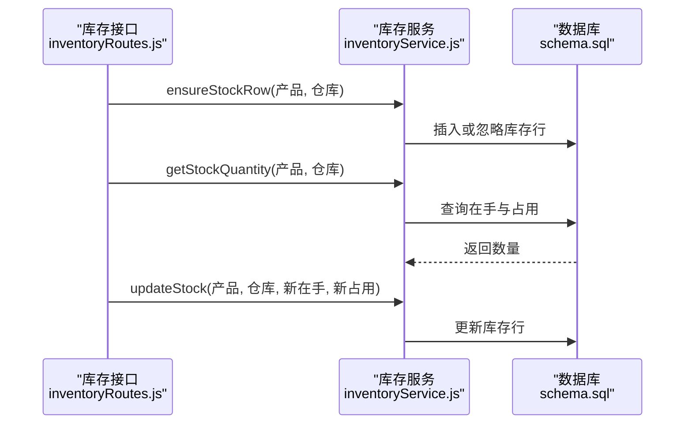
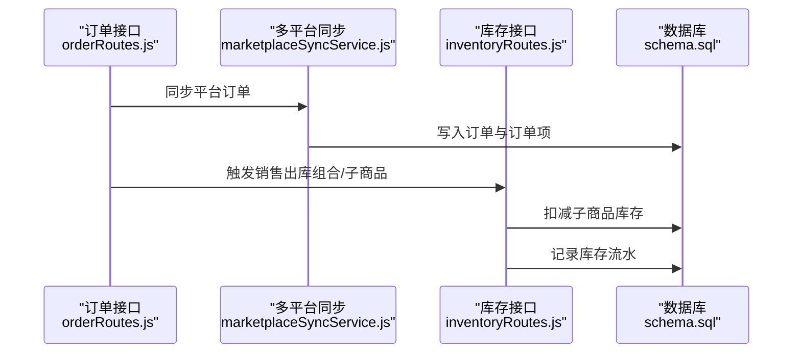
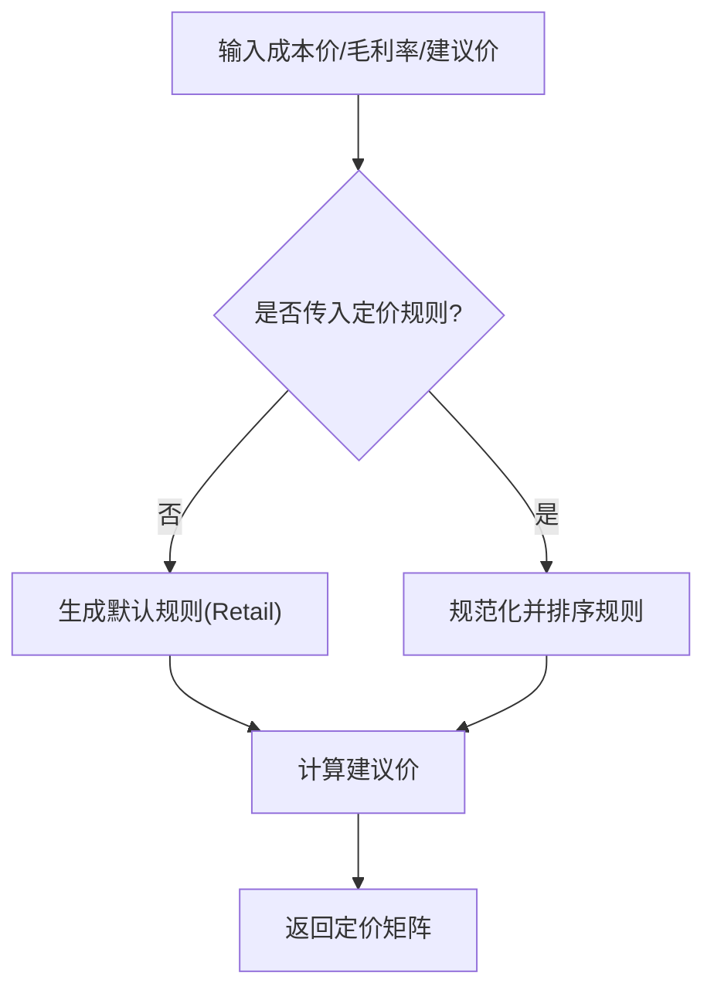
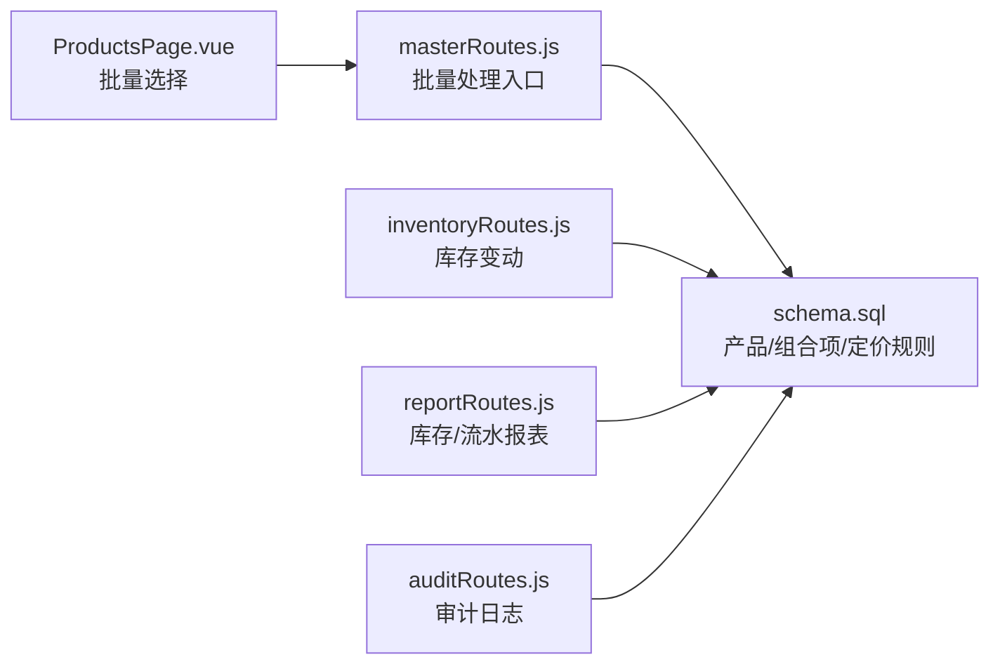
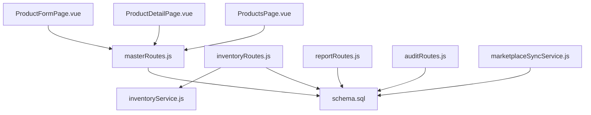

# 组合商品管理

<cite>
**本文档引用的文件**
- [schema.sql](file://server/database/schema.sql)
- [masterRoutes.js](file://server/src/routes/masterRoutes.js)
- [inventoryRoutes.js](file://server/src/routes/inventoryRoutes.js)
- [inventoryService.js](file://server/src/utils/inventoryService.js)
- [reportRoutes.js](file://server/src/routes/reportRoutes.js)
- [auditRoutes.js](file://server/src/routes/auditRoutes.js)
- [marketplaceSyncService.js](file://server/src/services/marketplaceSyncService.js)
- [ProductFormPage.vue](file://web/src/pages/ProductFormPage.vue)
- [ProductDetailPage.vue](file://web/src/pages/ProductDetailPage.vue)
- [ProductsPage.vue](file://web/src/pages/ProductsPage.vue)
- [orderRoutes.js](file://server/src/routes/orderRoutes.js)
</cite>

## 目录
1. [简介](#简介)
2. [项目结构](#项目结构)
3. [核心组件](#核心组件)
4. [架构概览](#架构概览)
5. [详细组件分析](#详细组件分析)
6. [依赖分析](#依赖分析)
7. [性能考虑](#性能考虑)
8. [故障排除指南](#故障排除指南)
9. [结论](#结论)
10. [附录](#附录)

## 简介
本文件面向组合商品管理场景，系统性梳理组合商品在本库存系统中的数据模型、创建流程、库存管理、销售功能、定价策略、批量操作与报表统计，并提供数据一致性保证、库存准确性验证与销售记录追踪的最佳实践。组合商品（COMBO）通过产品表的 SKU 类型标识，使用组合项表维护主商品与子商品的数量关系，并在库存与销售环节进行统一管理。

## 项目结构
后端采用 Express + PostgreSQL 架构，前端为 Vue 单页应用。组合商品相关能力由以下模块协同实现：
- 数据层：PostgreSQL 表结构定义（产品、组合项、定价规则、库存等）
- 业务层：主数据路由（产品、分类、仓库等）、库存路由（出入库、调拨、分配）、报表路由（库存、流水）、审计路由（审计日志）
- 工具层：库存服务封装（确保库存行、查询与更新）
- 前端页面：产品表单（组合项配置）、产品详情（组合项展示）、产品列表（批量操作）

**图表来源**
- [ProductFormPage.vue:440-461](file://web/src/pages/ProductFormPage.vue#L440-L461)
- [ProductDetailPage.vue:212-224](file://web/src/pages/ProductDetailPage.vue#L212-L224)
- [ProductsPage.vue:244-260](file://web/src/pages/ProductsPage.vue#L244-L260)
- [masterRoutes.js:437-467](file://server/src/routes/masterRoutes.js#L437-L467)
- [inventoryRoutes.js:237-449](file://server/src/routes/inventoryRoutes.js#L237-L449)
- [reportRoutes.js:17-132](file://server/src/routes/reportRoutes.js#L17-L132)
- [auditRoutes.js:16-110](file://server/src/routes/auditRoutes.js#L16-L110)
- [marketplaceSyncService.js:61-111](file://server/src/services/marketplaceSyncService.js#L61-L111)
- [inventoryService.js:1-46](file://server/src/utils/inventoryService.js#L1-L46)
- [schema.sql:32-87](file://server/database/schema.sql#L32-L87)

**章节来源**
- [schema.sql:32-87](file://server/database/schema.sql#L32-L87)
- [masterRoutes.js:437-467](file://server/src/routes/masterRoutes.js#L437-L467)
- [inventoryRoutes.js:237-449](file://server/src/routes/inventoryRoutes.js#L237-L449)
- [reportRoutes.js:17-132](file://server/src/routes/reportRoutes.js#L17-L132)
- [auditRoutes.js:16-110](file://server/src/routes/auditRoutes.js#L16-L110)
- [marketplaceSyncService.js:61-111](file://server/src/services/marketplaceSyncService.js#L61-L111)
- [ProductFormPage.vue:440-461](file://web/src/pages/ProductFormPage.vue#L440-L461)
- [ProductDetailPage.vue:212-224](file://web/src/pages/ProductDetailPage.vue#L212-L224)
- [ProductsPage.vue:244-260](file://web/src/pages/ProductsPage.vue#L244-L260)

## 核心组件
- 数据模型
  - 产品表：包含 SKU 类型（SINGLE/COMBO）、成本价、建议价、标价等字段
  - 组合项表：记录组合商品与其子商品及数量关系
  - 定价规则表：支持多渠道定价矩阵
  - 库存表：按产品+仓库维度维护可用量与占用量
- 创建流程
  - 前端在产品表单中设置 SKU 类型为 COMBO，并配置子商品与数量
  - 后端保存组合项并生成组合商品记录
- 库存管理
  - 出入库/调拨/分配均基于库存行进行原子化更新
  - 组合商品销售时按子商品数量扣减对应库存
- 销售功能
  - 支持组合商品整体销售与子商品单独销售
  - 多平台库存同步与订单对接
- 报表与审计
  - 提供库存报表、流水报表与审计日志，支撑数据一致性校验与追踪

**章节来源**
- [schema.sql:32-87](file://server/database/schema.sql#L32-L87)
- [schema.sql:125-133](file://server/database/schema.sql#L125-L133)
- [schema.sql:80-87](file://server/database/schema.sql#L80-L87)
- [schema.sql:99-109](file://server/database/schema.sql#L99-L109)
- [masterRoutes.js:437-467](file://server/src/routes/masterRoutes.js#L437-L467)
- [inventoryRoutes.js:237-449](file://server/src/routes/inventoryRoutes.js#L237-L449)
- [reportRoutes.js:17-132](file://server/src/routes/reportRoutes.js#L17-L132)
- [auditRoutes.js:16-110](file://server/src/routes/auditRoutes.js#L16-L110)

## 架构概览
组合商品贯穿“前端配置 → 后端持久化 → 库存扣减 → 销售与报表”的完整链路。前端负责交互与校验，后端负责业务规则与数据一致性，数据库提供强约束与索引优化。

**图表来源**
- [ProductFormPage.vue:440-461](file://web/src/pages/ProductFormPage.vue#L440-L461)
- [masterRoutes.js:437-467](file://server/src/routes/masterRoutes.js#L437-L467)
- [schema.sql:32-87](file://server/database/schema.sql#L32-L87)
- [schema.sql:80-87](file://server/database/schema.sql#L80-L87)

## 详细组件分析

### 数据模型与字段定义
- 产品表（products）
  - 关键字段：sku_type（SINGLE/COMBO）、cost_price、selling_price、markup_percentage、suggested_price、reorder_level
  - 作用：区分是否为组合商品；承载成本与定价信息
- 组合项表（product_bundle_items）
  - 关键字段：combo_product_id（组合主商品）、item_product_id（子商品）、item_quantity（数量）
  - 作用：建立主商品与子商品的组合关系与数量配比
- 定价规则表（product_pricing_rules）
  - 关键字段：rule_name、channel_key、markup_percentage、suggested_price、is_default、sort_order
  - 作用：支持多渠道定价矩阵，默认规则用于推荐售价
- 库存表（stock_levels）
  - 关键字段：quantity（在手数）、allocated_quantity（占用数）
  - 作用：按产品+仓库维度记录可用库存，支持占用与释放

**图表来源**
- [schema.sql:32-87](file://server/database/schema.sql#L32-L87)
- [schema.sql:80-87](file://server/database/schema.sql#L80-L87)
- [schema.sql:99-109](file://server/database/schema.sql#L99-L109)
- [schema.sql:125-133](file://server/database/schema.sql#L125-L133)

**章节来源**
- [schema.sql:32-87](file://server/database/schema.sql#L32-L87)
- [schema.sql:80-87](file://server/database/schema.sql#L80-L87)
- [schema.sql:99-109](file://server/database/schema.sql#L99-L109)
- [schema.sql:125-133](file://server/database/schema.sql#L125-L133)

### 组合商品创建流程
- 前端交互
  - 在产品表单中选择 SKU 类型为 COMBO
  - 添加子商品并配置数量（支持小数位）
- 后端保存
  - 保存产品基础信息
  - 保存组合项（删除旧组合项后重新插入）
  - 加载图片、定价规则、组合项并返回给前端
- 关键点
  - SKU 类型规范化为 COMBO
  - 组合项数量需大于 0
  - 通过事务保障一致性（保存组合项时使用相同租户隔离）

**图表来源**
- [ProductFormPage.vue:440-461](file://web/src/pages/ProductFormPage.vue#L440-L461)
- [masterRoutes.js:437-467](file://server/src/routes/masterRoutes.js#L437-L467)
- [masterRoutes.js:469-495](file://server/src/routes/masterRoutes.js#L469-L495)

**章节来源**
- [ProductFormPage.vue:440-461](file://web/src/pages/ProductFormPage.vue#L440-L461)
- [masterRoutes.js:437-467](file://server/src/routes/masterRoutes.js#L437-L467)
- [masterRoutes.js:469-495](file://server/src/routes/masterRoutes.js#L469-L495)

### 库存管理与扣减策略
- 库存行封装
  - 确保存在库存行（不存在则插入默认值）
  - 查询当前在手与占用数量
  - 更新在手与占用数量并记录更新时间
- 出入库/调拨/分配
  - 入库：校验仓库归属与租户，增加在手数并记录流水
  - 出库：校验可用库存（在手-占用），减少在手数并记录流水
  - 调拨：校验源仓与目的仓，源仓减少在手，目的仓增加在手
  - 分配：占用数增减，同时记录流水
- 组合商品销售
  - 按组合项数量乘以销售数量，逐个子商品扣减在手数
  - 若任一子商品可用不足，则拒绝销售

**图表来源**
- [inventoryRoutes.js:237-449](file://server/src/routes/inventoryRoutes.js#L237-L449)
- [inventoryService.js:1-46](file://server/src/utils/inventoryService.js#L1-L46)
- [schema.sql:125-133](file://server/database/schema.sql#L125-L133)

**章节来源**
- [inventoryRoutes.js:237-449](file://server/src/routes/inventoryRoutes.js#L237-L449)
- [inventoryService.js:1-46](file://server/src/utils/inventoryService.js#L1-L46)
- [schema.sql:125-133](file://server/database/schema.sql#L125-L133)

### 销售功能与拆分
- 组合商品打包销售
  - 作为单一 SKU 销售，内部按组合项比例扣减子商品库存
- 子商品单独销售
  - 作为独立 SKU 销售，直接扣减对应子商品库存
- 订单对接
  - 多平台订单同步后，可基于外部订单项映射到内部产品与仓库，驱动库存扣减与流水记录

**图表来源**
- [orderRoutes.js:14-31](file://server/src/routes/orderRoutes.js#L14-L31)
- [marketplaceSyncService.js:113-153](file://server/src/services/marketplaceSyncService.js#L113-L153)
- [inventoryRoutes.js:336-356](file://server/src/routes/inventoryRoutes.js#L336-L356)
- [schema.sql:196-219](file://server/database/schema.sql#L196-L219)

**章节来源**
- [orderRoutes.js:14-31](file://server/src/routes/orderRoutes.js#L14-L31)
- [marketplaceSyncService.js:113-153](file://server/src/services/marketplaceSyncService.js#L113-L153)
- [inventoryRoutes.js:336-356](file://server/src/routes/inventoryRoutes.js#L336-L356)

### 定价策略与建议价
- 默认定价规则
  - 未显式传入定价规则时，自动生成默认规则（如 Retail）
  - 建议价 = 成本价 × (1 + 毛利率/100)
- 多渠道定价
  - 支持为不同渠道设置不同毛利率与建议价
  - 可指定默认规则，或按渠道匹配规则
- 前端展示
  - 产品详情页展示定价矩阵与建议价/销售价对比

**图表来源**
- [masterRoutes.js:27-74](file://server/src/routes/masterRoutes.js#L27-L74)
- [masterRoutes.js:414-435](file://server/src/routes/masterRoutes.js#L414-L435)
- [ProductDetailPage.vue:327-346](file://web/src/pages/ProductDetailPage.vue#L327-L346)

**章节来源**
- [masterRoutes.js:27-74](file://server/src/routes/masterRoutes.js#L27-L74)
- [masterRoutes.js:414-435](file://server/src/routes/masterRoutes.js#L414-L435)
- [ProductDetailPage.vue:327-346](file://web/src/pages/ProductDetailPage.vue#L327-L346)

### 批量操作与报表统计
- 批量操作
  - 产品列表支持批量选择与操作（结合前端 ProductsPage.vue 的交互）
- 报表统计
  - 库存报表：按产品、SKU、条码、仓库、类别筛选，显示在手、占用、可用与库存价值
  - 流水报表：按时间范围与关键词筛选，支持导出
- 审计日志
  - 记录用户行为、实体类型、方法、路径与元数据，支持按时间段与动作筛选

**图表来源**
- [ProductsPage.vue:244-260](file://web/src/pages/ProductsPage.vue#L244-L260)
- [reportRoutes.js:17-132](file://server/src/routes/reportRoutes.js#L17-L132)
- [reportRoutes.js:135-258](file://server/src/routes/reportRoutes.js#L135-L258)
- [auditRoutes.js:16-110](file://server/src/routes/auditRoutes.js#L16-L110)
- [masterRoutes.js:437-467](file://server/src/routes/masterRoutes.js#L437-L467)
- [schema.sql:32-87](file://server/database/schema.sql#L32-L87)
- [schema.sql:80-87](file://server/database/schema.sql#L80-L87)
- [schema.sql:99-109](file://server/database/schema.sql#L99-L109)

**章节来源**
- [ProductsPage.vue:244-260](file://web/src/pages/ProductsPage.vue#L244-L260)
- [reportRoutes.js:17-132](file://server/src/routes/reportRoutes.js#L17-L132)
- [reportRoutes.js:135-258](file://server/src/routes/reportRoutes.js#L135-L258)
- [auditRoutes.js:16-110](file://server/src/routes/auditRoutes.js#L16-L110)
- [masterRoutes.js:437-467](file://server/src/routes/masterRoutes.js#L437-L467)

## 依赖分析
- 组件耦合
  - masterRoutes.js 依赖 schema.sql 中的产品与组合项表
  - inventoryRoutes.js 依赖 inventoryService.js 封装的库存行操作
  - reportRoutes.js 与 auditRoutes.js 依赖 schema.sql 中的报表与审计表
  - marketplaceSyncService.js 依赖 schema.sql 中的多平台订单与快照表
- 外部依赖
  - 前端 Vue 组件与后端路由通过 REST 接口交互
  - 多平台同步依赖环境变量中的渠道配置

**图表来源**
- [masterRoutes.js:437-467](file://server/src/routes/masterRoutes.js#L437-L467)
- [inventoryRoutes.js:237-449](file://server/src/routes/inventoryRoutes.js#L237-L449)
- [inventoryService.js:1-46](file://server/src/utils/inventoryService.js#L1-L46)
- [reportRoutes.js:17-132](file://server/src/routes/reportRoutes.js#L17-L132)
- [auditRoutes.js:16-110](file://server/src/routes/auditRoutes.js#L16-L110)
- [marketplaceSyncService.js:113-153](file://server/src/services/marketplaceSyncService.js#L113-L153)
- [ProductFormPage.vue:440-461](file://web/src/pages/ProductFormPage.vue#L440-L461)
- [ProductDetailPage.vue:212-224](file://web/src/pages/ProductDetailPage.vue#L212-L224)
- [ProductsPage.vue:244-260](file://web/src/pages/ProductsPage.vue#L244-L260)
- [schema.sql:32-87](file://server/database/schema.sql#L32-L87)

**章节来源**
- [masterRoutes.js:437-467](file://server/src/routes/masterRoutes.js#L437-L467)
- [inventoryRoutes.js:237-449](file://server/src/routes/inventoryRoutes.js#L237-L449)
- [inventoryService.js:1-46](file://server/src/utils/inventoryService.js#L1-L46)
- [reportRoutes.js:17-132](file://server/src/routes/reportRoutes.js#L17-L132)
- [auditRoutes.js:16-110](file://server/src/routes/auditRoutes.js#L16-L110)
- [marketplaceSyncService.js:113-153](file://server/src/services/marketplaceSyncService.js#L113-L153)
- [ProductFormPage.vue:440-461](file://web/src/pages/ProductFormPage.vue#L440-L461)
- [ProductDetailPage.vue:212-224](file://web/src/pages/ProductDetailPage.vue#L212-L224)
- [ProductsPage.vue:244-260](file://web/src/pages/ProductsPage.vue#L244-L260)
- [schema.sql:32-87](file://server/database/schema.sql#L32-L87)

## 性能考虑
- 分页与索引
  - 列表接口普遍支持分页参数，数据库为关键表建立索引（如产品、库存、订单、审计等）
- 并发与事务
  - 库存操作使用事务包裹，确保在高并发下的一致性
- 查询优化
  - 报表接口支持按关键词与筛选条件快速过滤，避免全表扫描

[本节为通用指导，不直接分析具体文件]

## 故障排除指南
- 组合商品创建失败
  - 检查 SKU 类型是否正确设置为 COMBO
  - 确认组合项数量大于 0，且子商品 ID 有效
- 库存不足
  - 出库/调拨前检查可用库存（在手-占用），必要时先补货
  - 查看库存流水与占用明细，定位占用原因
- 销售异常
  - 检查组合项数量与销售数量的乘积是否超过子商品可用量
  - 对接多平台订单时核对外部 SKU 与内部 SKU 的映射
- 审计与追溯
  - 通过审计日志查询用户操作轨迹，定位问题责任人与时间点

**章节来源**
- [inventoryRoutes.js:323-325](file://server/src/routes/inventoryRoutes.js#L323-L325)
- [auditRoutes.js:16-110](file://server/src/routes/auditRoutes.js#L16-L110)

## 结论
本系统通过明确的数据模型与严格的业务流程，实现了组合商品从创建到销售的全生命周期管理。借助库存行封装、事务控制与报表审计，确保了数据一致性与可追溯性。建议在实际部署中结合业务场景完善权限控制、告警阈值与批量操作策略，持续优化性能与用户体验。

## 附录
- 最佳实践清单
  - 数据一致性：所有库存变更使用事务，确保原子性
  - 库存准确性：定期盘点与报表核对，及时发现差异
  - 销售记录追踪：启用审计日志，保留操作轨迹
  - 定价策略：根据渠道与竞争情况动态调整毛利率与建议价
  - 批量操作：利用分页与筛选，避免一次性加载过多数据

[本节为通用指导，不直接分析具体文件]