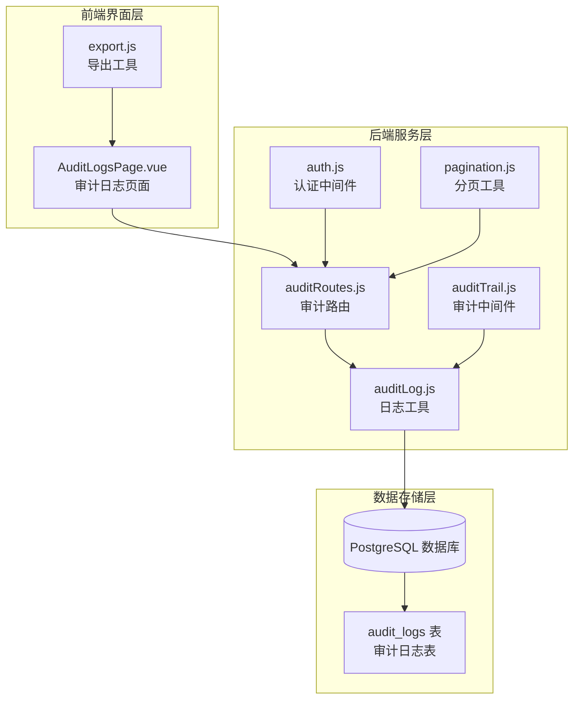
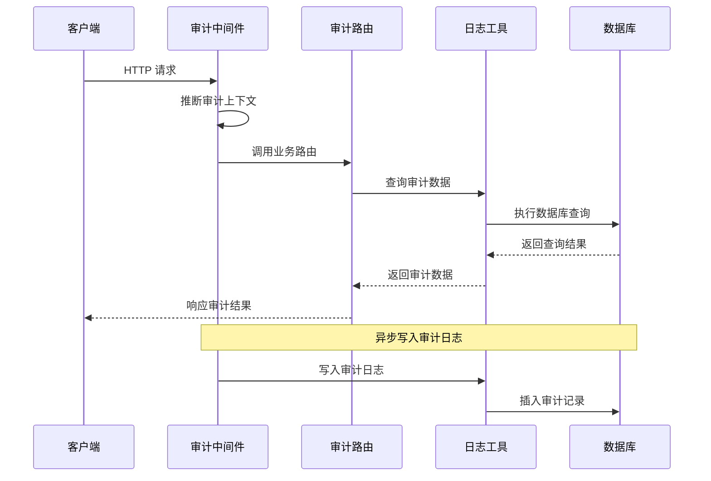
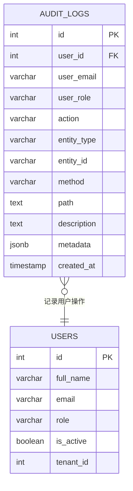
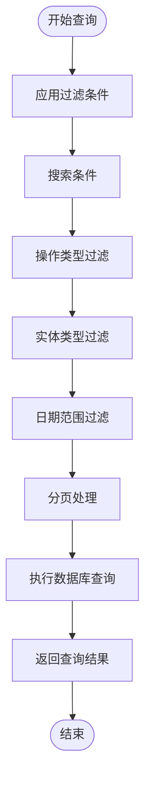
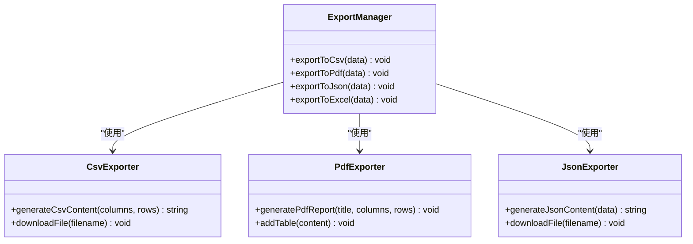
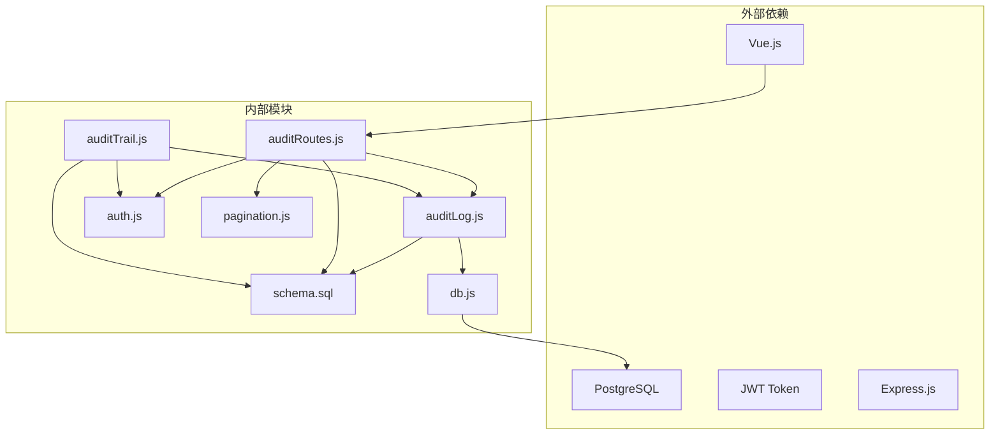
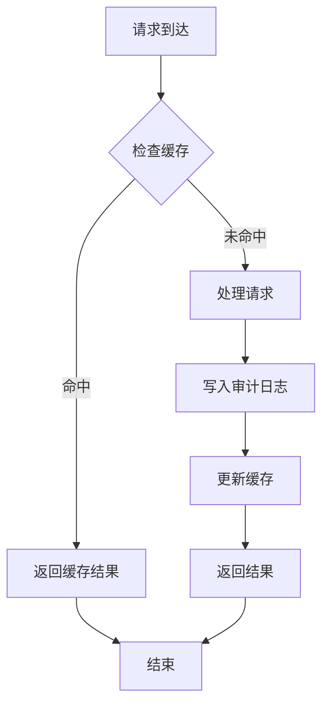

# 审计日志模块

<cite>
**本文档引用的文件**
- [auditTrail.js](file://server/src/middleware/auditTrail.js)
- [auditLog.js](file://server/src/utils/auditLog.js)
- [auditRoutes.js](file://server/src/routes/auditRoutes.js)
- [AuditLogsPage.vue](file://web/src/pages/AuditLogsPage.vue)
- [schema.sql](file://server/database/schema.sql)
- [db.js](file://server/src/config/db.js)
- [app.js](file://server/src/app.js)
- [pagination.js](file://server/src/utils/pagination.js)
- [auth.js](file://server/src/middleware/auth.js)
- [export.js](file://web/src/utils/export.js)
- [seed.sql](file://server/database/seed.sql)
- [integration.test.js](file://server/test/integration.test.js)
</cite>

## 目录
1. [简介](#简介)
2. [项目结构](#项目结构)
3. [核心组件](#核心组件)
4. [架构概览](#架构概览)
5. [详细组件分析](#详细组件分析)
6. [依赖关系分析](#依赖关系分析)
7. [性能考虑](#性能考虑)
8. [故障排除指南](#故障排除指南)
9. [结论](#结论)
10. [附录](#附录)

## 简介

审计日志模块是库存管理系统中的关键合规性组件，负责全面记录系统中的所有重要操作和数据变更。该模块实现了完整的操作追踪机制，确保满足企业级审计要求，提供数据完整性保护和不可篡改性保证。

本模块的核心目标是：
- 自动记录所有关键业务操作和系统管理功能
- 提供实时的操作追踪和历史查询能力
- 支持合规性管理和法定保存要求
- 实现高性能的日志存储和查询机制
- 保障日志数据的完整性和安全性

## 项目结构

审计日志模块采用前后端分离的架构设计，主要由以下组件构成：



**图表来源**
- [app.js:47-58](file://server/src/app.js#L47-L58)
- [auditTrail.js:1-86](file://server/src/middleware/auditTrail.js#L1-L86)
- [auditRoutes.js:1-113](file://server/src/routes/auditRoutes.js#L1-L113)

**章节来源**
- [app.js:1-91](file://server/src/app.js#L1-L91)
- [schema.sql:275-288](file://server/database/schema.sql#L275-L288)

## 核心组件

### 审计中间件 (auditTrail.js)

审计中间件是整个模块的核心组件，负责拦截所有HTTP请求并自动记录相关的操作信息。其主要功能包括：

- **请求拦截**: 在响应完成时触发审计逻辑
- **上下文推断**: 从URL路径和HTTP方法推断操作类型
- **数据脱敏**: 自动过滤敏感信息（如密码字段）
- **用户识别**: 提取当前登录用户的上下文信息
- **元数据收集**: 捕获请求和响应的详细信息

### 日志工具 (auditLog.js)

日志工具提供了标准化的日志写入接口，确保所有审计信息以统一格式存储：

- **JSONB存储**: 使用PostgreSQL的JSONB类型存储复杂元数据
- **事务安全**: 确保日志写入的原子性和一致性
- **性能优化**: 批量插入和异步处理机制

### 审计路由 (auditRoutes.js)

审计路由提供了完整的查询和管理接口：

- **多维查询**: 支持按时间、用户、操作类型等多维度过滤
- **分页支持**: 高效的大数据量查询和分页
- **权限控制**: 仅管理员和经理可访问审计日志
- **全文搜索**: 支持模糊匹配和精确查询

### 前端界面 (AuditLogsPage.vue)

前端界面提供了直观的审计日志查看和管理功能：

- **实时查询**: 支持复杂的过滤条件组合
- **数据导出**: 支持CSV、JSON、PDF等多种格式导出
- **预设管理**: 用户可保存常用的查询条件
- **详情展示**: 支持展开查看详细的元数据信息

**章节来源**
- [auditTrail.js:47-81](file://server/src/middleware/auditTrail.js#L47-L81)
- [auditLog.js:1-40](file://server/src/utils/auditLog.js#L1-L40)
- [auditRoutes.js:16-110](file://server/src/routes/auditRoutes.js#L16-L110)
- [AuditLogsPage.vue:10-457](file://web/src/pages/AuditLogsPage.vue#L10-L457)

## 架构概览

审计日志模块采用事件驱动的架构模式，实现了完整的操作追踪闭环：



**图表来源**
- [auditTrail.js:47-81](file://server/src/middleware/auditTrail.js#L47-L81)
- [auditRoutes.js:16-110](file://server/src/routes/auditRoutes.js#L16-L110)
- [auditLog.js:1-40](file://server/src/utils/auditLog.js#L1-L40)

### 数据流分析

审计日志的完整数据流包括以下几个关键阶段：

1. **请求拦截阶段**: 中间件捕获HTTP请求的所有相关信息
2. **上下文推断阶段**: 分析URL路径和HTTP方法确定操作类型
3. **数据收集阶段**: 收集用户信息、IP地址、请求体等元数据
4. **异步写入阶段**: 将审计信息异步写入数据库
5. **查询处理阶段**: 提供高效的查询接口支持审计分析

**章节来源**
- [auditTrail.js:14-45](file://server/src/middleware/auditTrail.js#L14-L45)
- [auditTrail.js:58-78](file://server/src/middleware/auditTrail.js#L58-L78)

## 详细组件分析

### 审计范围和记录策略

审计模块覆盖了系统中的所有关键操作，包括但不限于：

#### 关键业务操作
- **产品管理**: 创建、更新、删除产品信息
- **库存管理**: 库存调整、转移、盘点操作
- **供应商管理**: 供应商信息维护和关联
- **采购订单**: 采购流程跟踪
- **销售订单**: 销售流程监控

#### 系统管理功能
- **用户管理**: 用户创建、角色分配、权限变更
- **系统设置**: 配置参数修改和系统维护
- **报表生成**: 报表创建和下载操作
- **通知管理**: 系统通知的创建和管理

#### 数据修改事件
- **成本价格变更**: 成本价调整的历史记录
- **库存数量变更**: 库存水平的任何调整
- **价格策略变更**: 定价规则的修改
- **权限变更**: 用户角色和权限的调整

### 审计数据结构

审计日志采用标准化的数据结构，确保信息的完整性和一致性：



**图表来源**
- [schema.sql:275-288](file://server/database/schema.sql#L275-L288)

#### 字段详细说明

| 字段名 | 类型 | 必填 | 描述 | 示例值 |
|--------|------|------|------|--------|
| id | SERIAL | 是 | 主键标识符 | 12345 |
| user_id | INTEGER | 否 | 操作用户ID | 1001 |
| user_email | VARCHAR(150) | 否 | 操作用户邮箱 | admin@example.com |
| user_role | VARCHAR(20) | 否 | 用户角色 | ADMIN |
| action | VARCHAR(80) | 是 | 操作类型 | PRODUCTS_CREATE |
| entity_type | VARCHAR(80) | 是 | 实体类型 | PRODUCTS |
| entity_id | VARCHAR(120) | 否 | 实体标识符 | PRD-001 |
| method | VARCHAR(10) | 是 | HTTP方法 | POST |
| path | TEXT | 是 | 请求路径 | /api/products |
| description | TEXT | 否 | 操作描述 | Create new product |
| metadata | JSONB | 是 | 元数据信息 | {body: {...}, statusCode: 201} |
| created_at | TIMESTAMP | 是 | 创建时间 | 2024-01-15 14:30:00 |

### 日志查询和分析功能

#### 多维查询接口

审计模块提供了强大的查询能力，支持以下维度的组合查询：



**图表来源**
- [auditRoutes.js:16-110](file://server/src/routes/auditRoutes.js#L16-L110)

#### 查询参数详解

| 参数名 | 类型 | 默认值 | 描述 | 示例 |
|--------|------|--------|------|------|
| search | STRING | '' | 搜索关键词 | john@example.com |
| action | STRING | 'all' | 操作类型 | PRODUCTS_CREATE |
| entityType | STRING | 'all' | 实体类型 | PRODUCTS |
| startDate | DATE | '' | 开始日期 | 2024-01-01 |
| endDate | DATE | '' | 结束日期 | 2024-01-31 |
| page | INTEGER | 1 | 页码 | 1 |
| pageSize | INTEGER | 10 | 每页条数 | 10-100 |

#### 高级分析功能

- **趋势分析**: 支持按时间段统计操作频率
- **用户行为分析**: 追踪特定用户的操作模式
- **异常检测**: 识别异常或高风险操作
- **合规报告**: 生成符合法规要求的审计报告

**章节来源**
- [auditRoutes.js:16-110](file://server/src/routes/auditRoutes.js#L16-L110)
- [AuditLogsPage.vue:165-266](file://web/src/pages/AuditLogsPage.vue#L165-L266)

### 合规性要求和数据保留策略

#### 完整性保护

审计模块通过以下机制确保数据完整性：

- **不可篡改性**: 使用数据库约束和索引防止数据修改
- **时间戳精度**: 精确到秒的时间戳记录
- **事务日志**: 所有操作都在事务中执行
- **备份策略**: 定期备份审计数据

#### 法定保存期限

根据不同的合规要求，建议的保存期限如下：

| 合规类型 | 保存期限 | 存储策略 |
|----------|----------|----------|
| 一般商业审计 | 1-3年 | 标准存储 |
| 财务审计 | 5-7年 | 高可靠性存储 |
| 法律诉讼证据 | 7-10年 | 冷存储 |
| 特殊监管要求 | 根据法规 | 专用存储 |

#### 数据脱敏策略

敏感信息在日志中进行适当的脱敏处理：

- **密码字段**: 替换为"[REDACTED]"
- **个人身份信息**: 部分隐藏
- **财务数据**: 仅记录必要的摘要信息

### 日志导出和报告生成功能

#### 导出格式支持

审计模块支持多种标准格式的导出：



**图表来源**
- [export.js:1-91](file://web/src/utils/export.js#L1-L91)

#### 报告模板

系统提供多种预定义的报告模板：

- **合规审计报告**: 符合ISO 27001标准的格式
- **管理层报告**: 高层管理者关注的关键指标
- **技术审计报告**: 开发团队需要的技术细节
- **异常行为分析报告**: 识别潜在的安全威胁

**章节来源**
- [AuditLogsPage.vue:117-154](file://web/src/pages/AuditLogsPage.vue#L117-L154)
- [export.js:1-91](file://web/src/utils/export.js#L1-L91)

## 依赖关系分析

审计日志模块与其他系统组件的依赖关系如下：



**图表来源**
- [app.js:7-24](file://server/src/app.js#L7-L24)
- [auditTrail.js:1-2](file://server/src/middleware/auditTrail.js#L1-L2)
- [auditRoutes.js:2-5](file://server/src/routes/auditRoutes.js#L2-L5)

### 关键依赖关系

1. **数据库连接**: 通过连接池管理数据库连接
2. **认证集成**: 与JWT认证系统深度集成
3. **前端交互**: 通过RESTful API与前端通信
4. **中间件链**: 作为全局中间件处理所有请求

### 循环依赖检查

经过分析，审计模块没有发现循环依赖问题：
- 中间件不依赖路由
- 路由不依赖中间件
- 工具函数保持纯函数特性
- 数据库模式独立存在

**章节来源**
- [app.js:1-91](file://server/src/app.js#L1-L91)
- [db.js:17-28](file://server/src/config/db.js#L17-L28)

## 性能考虑

### 存储优化

审计模块采用了多项存储优化策略：

#### 索引优化
- **时间索引**: 对created_at字段建立降序索引
- **用户索引**: 对user_id和user_email建立索引
- **操作索引**: 对action和entity_type建立复合索引

#### 查询优化
- **延迟加载**: 大量数据时使用分页查询
- **条件过滤**: 优先使用索引字段进行过滤
- **结果缓存**: 对常用查询结果进行缓存

### 性能监控

系统提供了内置的性能监控机制：



### 扩展性设计

- **水平扩展**: 支持多实例部署
- **垂直扩展**: 可以增加数据库资源
- **异步处理**: 审计日志写入采用异步方式
- **队列机制**: 可以集成消息队列处理大量日志

## 故障排除指南

### 常见问题诊断

#### 审计日志缺失

**症状**: 某些操作没有被记录到审计日志中

**可能原因**:
1. 请求方法不是POST、PUT、PATCH、DELETE
2. HTTP状态码大于等于400
3. 请求路径不在受监控范围内
4. 中间件未正确配置

**解决方案**:
- 检查中间件是否正确加载
- 验证请求方法和状态码
- 确认URL路径格式
- 查看服务器日志

#### 查询性能问题

**症状**: 审计日志查询响应缓慢

**可能原因**:
1. 缺少必要的数据库索引
2. 查询条件过于宽泛
3. 数据量过大导致查询超时
4. 并发查询过多

**解决方案**:
- 添加适当的数据库索引
- 优化查询条件
- 实施分页查询
- 调整数据库连接池大小

#### 数据完整性问题

**症状**: 发现审计日志被篡改或损坏

**可能原因**:
1. 数据库权限配置不当
2. 缺少适当的约束
3. 外部攻击或恶意修改
4. 系统故障导致的数据损坏

**解决方案**:
- 加强数据库权限控制
- 实施数据完整性约束
- 启用数据库审计功能
- 建立定期数据验证机制

### 调试技巧

#### 开启调试模式

```javascript
// 在开发环境中启用详细日志
process.env.AUDIT_DEBUG = 'true'
```

#### 日志级别配置

- **ERROR**: 仅记录错误信息
- **WARN**: 记录警告和错误
- **INFO**: 记录基本信息和错误
- **DEBUG**: 记录详细调试信息

**章节来源**
- [auditTrail.js:75-77](file://server/src/middleware/auditTrail.js#L75-L77)
- [auditRoutes.js:107-109](file://server/src/routes/auditRoutes.js#L107-L109)

## 结论

审计日志模块为库存管理系统提供了全面的合规性保障和操作追踪能力。通过精心设计的架构和实现，该模块能够：

1. **全面覆盖**: 记录系统中的所有关键操作和数据变更
2. **高效查询**: 提供多维度过滤和快速检索能力
3. **合规保障**: 满足各种法规和标准的要求
4. **性能优化**: 通过多种技术手段确保系统性能
5. **易于使用**: 提供直观的前端界面和丰富的导出功能

该模块的成功实施将为企业提供强大的审计能力和合规保障，有助于提升系统的可信度和安全性。

## 附录

### 最佳实践建议

#### 审计配置最佳实践
- 为所有关键业务操作启用审计
- 定期审查和更新审计策略
- 建立审计数据的生命周期管理
- 实施定期的审计效果评估

#### 性能优化建议
- 根据实际使用情况调整索引策略
- 定期清理过期的审计数据
- 监控数据库性能指标
- 实施适当的备份和恢复策略

#### 安全加固措施
- 限制审计数据的访问权限
- 实施数据传输加密
- 定期进行安全漏洞扫描
- 建立应急响应机制

### 技术规格

#### 系统要求
- **数据库**: PostgreSQL 12+
- **内存**: 至少4GB RAM
- **存储**: 根据日志量需求预留空间
- **网络**: 支持HTTPS协议

#### 性能基准
- **查询响应时间**: < 500ms (单表查询)
- **并发处理能力**: > 100 QPS
- **存储容量**: 支持TB级数据增长
- **可用性**: 99.9%以上