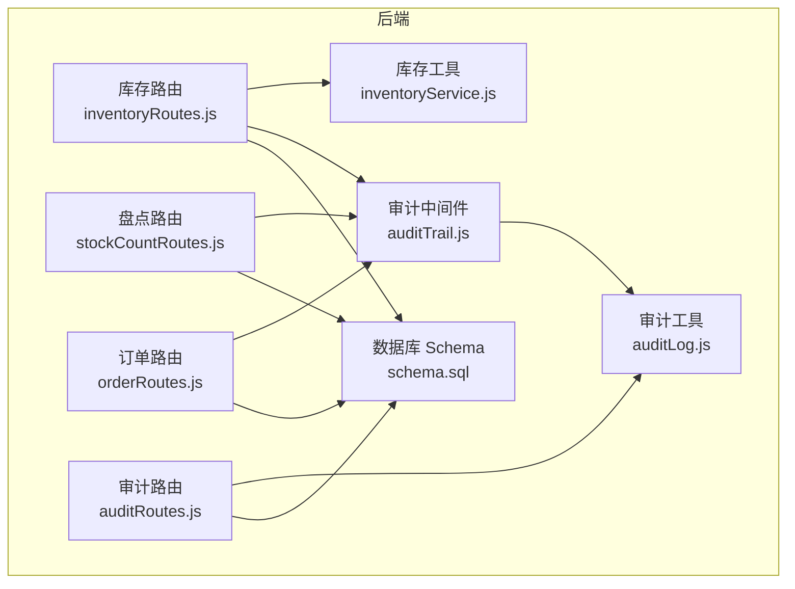
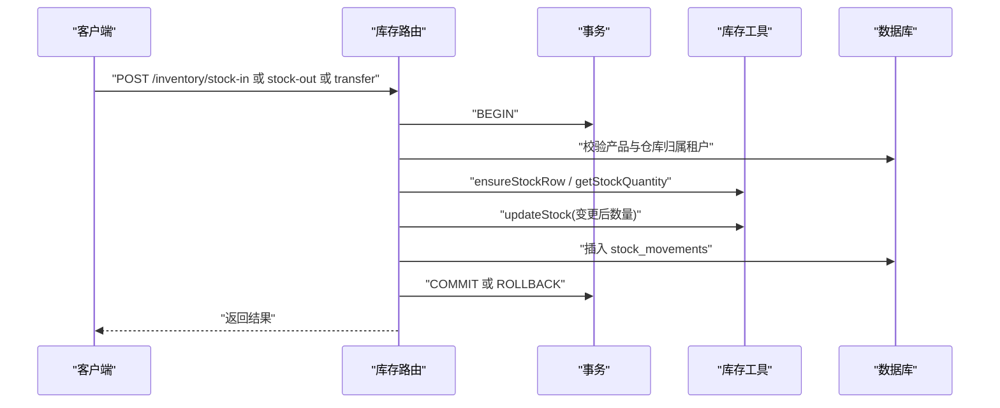
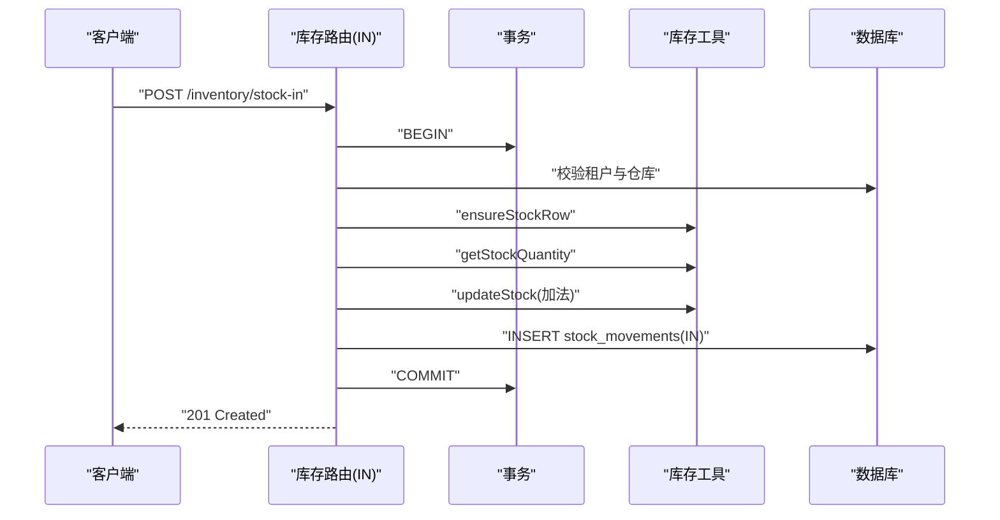
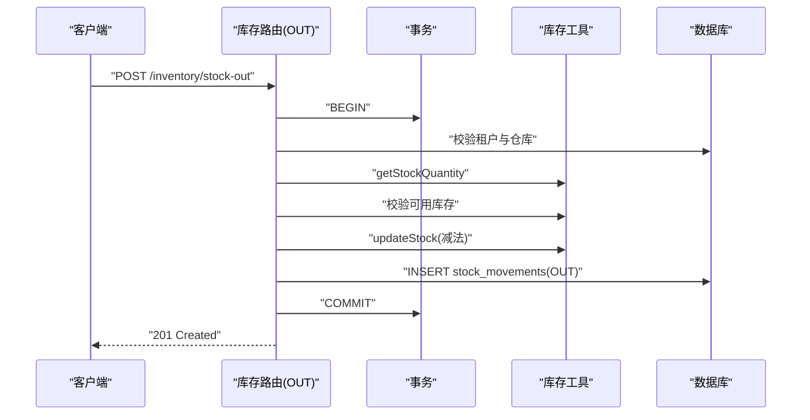
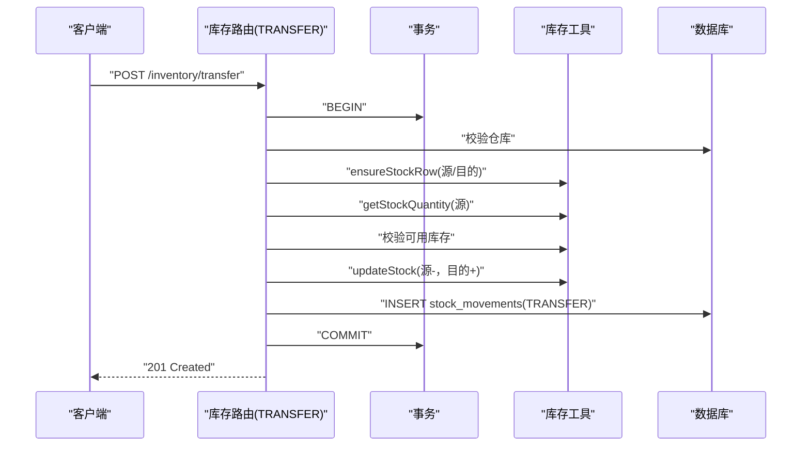
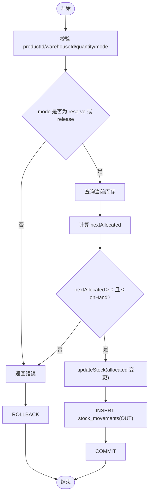
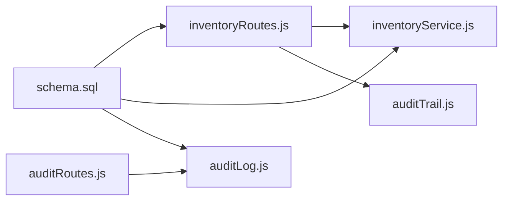

# 出入库操作

<cite>
**本文引用的文件**
- [server/src/routes/inventoryRoutes.js](file://server/src/routes/inventoryRoutes.js)
- [server/src/utils/inventoryService.js](file://server/src/utils/inventoryService.js)
- [server/src/middleware/auditTrail.js](file://server/src/middleware/auditTrail.js)
- [server/src/utils/auditLog.js](file://server/src/utils/auditLog.js)
- [server/database/schema.sql](file://server/database/schema.sql)
- [server/src/routes/orderRoutes.js](file://server/src/routes/orderRoutes.js)
- [server/src/routes/stockCountRoutes.js](file://server/src/routes/stockCountRoutes.js)
- [server/src/routes/auditRoutes.js](file://server/src/routes/auditRoutes.js)
- [server/src/utils/costAccess.js](file://server/src/utils/costAccess.js)
- [server/src/utils/tenant.js](file://server/src/utils/tenant.js)
- [POSTMAN 后端接口指南](file://POSTMAN_BACKEND_GUIDE.md)
- [README.md](file://README.md)
</cite>

## 目录
1. [简介](#简介)
2. [项目结构](#项目结构)
3. [核心组件](#核心组件)
4. [架构总览](#架构总览)
5. [详细组件分析](#详细组件分析)
6. [依赖关系分析](#依赖关系分析)
7. [性能考量](#性能考量)
8. [故障排查指南](#故障排查指南)
9. [结论](#结论)
10. [附录](#附录)

## 简介
本文件围绕库存系统的出入库操作进行全面说明，覆盖以下主题：
- 采购入库流程：入库单创建、商品验收、批次管理、库存更新与事务一致性
- 销售出库流程：订单处理、拣货打包、发货确认、库存扣减与可用库存校验
- 事务处理机制：基于数据库事务的原子性、一致性与并发安全
- 出入库类型规则：IN/OUT/TRANSFER 的业务约束与校验
- 批次与保质期：当前代码未实现批次字段与先进先出算法，需在后续版本扩展
- 审计日志：统一审计中间件记录操作人、时间、数量与原因
- 异常处理：库存不足、仓库不存在等常见问题的处理策略

## 项目结构
后端采用 Express + PostgreSQL，库存相关的核心逻辑集中在路由层与工具层：
- 路由层：提供库存查询、出入库与调拨接口
- 工具层：封装库存行确保、查询与更新的通用方法
- 中间件：统一审计日志记录
- 数据库：定义库存主数据、移动记录与审计日志表结构

**图示来源**
- [server/src/routes/inventoryRoutes.js:1-536](file://server/src/routes/inventoryRoutes.js#L1-L536)
- [server/src/routes/orderRoutes.js:1-124](file://server/src/routes/orderRoutes.js#L1-L124)
- [server/src/routes/stockCountRoutes.js:1-458](file://server/src/routes/stockCountRoutes.js#L1-L458)
- [server/src/routes/auditRoutes.js:1-113](file://server/src/routes/auditRoutes.js#L1-L113)
- [server/src/utils/inventoryService.js:1-46](file://server/src/utils/inventoryService.js#L1-L46)
- [server/src/middleware/auditTrail.js:1-86](file://server/src/middleware/auditTrail.js#L1-L86)
- [server/src/utils/auditLog.js:1-40](file://server/src/utils/auditLog.js#L1-L40)
- [server/database/schema.sql:1-447](file://server/database/schema.sql#L1-L447)

**章节来源**
- [README.md:1-105](file://README.md#L1-L105)

## 核心组件
- 库存路由（inventoryRoutes.js）
  - 提供库存总览、流水查询、入库/出库/调拨、预留/释放等接口
  - 使用数据库事务保证原子性，严格校验仓库与产品归属租户
- 库存工具（inventoryService.js）
  - 封装 ensureStockRow、getStockQuantity、updateStock，统一库存变更逻辑
- 审计中间件与工具（auditTrail.js、auditLog.js）
  - 在请求完成后异步写入审计日志，记录操作上下文、元数据与响应状态
- 数据库 Schema（schema.sql）
  - 定义 stock_levels、stock_movements、audit_logs 等核心表及索引

**章节来源**
- [server/src/routes/inventoryRoutes.js:1-536](file://server/src/routes/inventoryRoutes.js#L1-L536)
- [server/src/utils/inventoryService.js:1-46](file://server/src/utils/inventoryService.js#L1-L46)
- [server/src/middleware/auditTrail.js:1-86](file://server/src/middleware/auditTrail.js#L1-L86)
- [server/src/utils/auditLog.js:1-40](file://server/src/utils/auditLog.js#L1-L40)
- [server/database/schema.sql:125-288](file://server/database/schema.sql#L125-L288)

## 架构总览
出入库操作遵循“路由 → 事务 → 业务校验 → 库存更新 → 流水记录”的标准流程，同时通过审计中间件记录关键操作。

**图示来源**
- [server/src/routes/inventoryRoutes.js:237-437](file://server/src/routes/inventoryRoutes.js#L237-L437)
- [server/src/utils/inventoryService.js:3-39](file://server/src/utils/inventoryService.js#L3-L39)

## 详细组件分析

### 采购入库流程（IN）
- 接口路径与角色：/inventory/stock-in（管理员/经理/员工）
- 关键步骤
  - 校验 productId、quantity 与 warehouseId
  - 校验产品与仓库属于当前租户
  - 确保库存行存在（不存在则插入默认值）
  - 查询当前库存，计算变更后的库存并更新
  - 插入一条 stock_movements（movement_type=IN），记录供应商、单价、采购原因等
  - 事务提交成功后返回新建的移动记录
- 事务与并发
  - 使用 BEGIN/COMMIT/ROLLBACK 包裹整个流程
  - 通过 ensureStockRow 的唯一约束避免重复插入
- 审计
  - 通过审计中间件记录操作上下文与元数据

**图示来源**
- [server/src/routes/inventoryRoutes.js:237-310](file://server/src/routes/inventoryRoutes.js#L237-L310)
- [server/src/utils/inventoryService.js:3-39](file://server/src/utils/inventoryService.js#L3-L39)

**章节来源**
- [server/src/routes/inventoryRoutes.js:237-310](file://server/src/routes/inventoryRoutes.js#L237-L310)
- [POSTMAN 后端接口指南:179-188](file://POSTMAN_BACKEND_GUIDE.md#L179-L188)

### 销售出库流程（OUT）
- 接口路径与角色：/inventory/stock-out（管理员/经理/员工）
- 关键步骤
  - 校验 warehouseId 与可用库存（在库数量 - 预留数量）
  - 执行库存扣减并更新
  - 插入一条 stock_movements（movement_type=OUT）
- 业务规则
  - 只能出库到指定仓库
  - 可用库存不足时拒绝操作

**图示来源**
- [server/src/routes/inventoryRoutes.js:312-356](file://server/src/routes/inventoryRoutes.js#L312-L356)
- [server/src/utils/inventoryService.js:14-39](file://server/src/utils/inventoryService.js#L14-L39)

**章节来源**
- [server/src/routes/inventoryRoutes.js:312-356](file://server/src/routes/inventoryRoutes.js#L312-L356)

### 调拨流程（TRANSFER）
- 接口路径与角色：/inventory/transfer（管理员/经理）
- 关键步骤
  - 校验 sourceWarehouseId 与 destinationWarehouseId 存在且不相同
  - 分别确保源/目的仓库库存行存在
  - 校验源仓可用库存充足
  - 源仓扣减、目的仓加增
  - 插入一条 stock_movements（movement_type=TRANSFER）

**图示来源**
- [server/src/routes/inventoryRoutes.js:358-431](file://server/src/routes/inventoryRoutes.js#L358-L431)
- [server/src/utils/inventoryService.js:3-39](file://server/src/utils/inventoryService.js#L3-L39)

**章节来源**
- [server/src/routes/inventoryRoutes.js:358-431](file://server/src/routes/inventoryRoutes.js#L358-L431)

### 预留/释放（ALLOCATE）
- 接口路径与角色：/inventory/allocate（管理员/经理/员工）
- 关键步骤
  - 校验 mode 为 reserve 或 release
  - 校验 allocated 数量非负且不超过在库数量
  - 更新 allocated_quantity 并记录一条 OUT 类型的 stock_movements

**图示来源**
- [server/src/routes/inventoryRoutes.js:451-533](file://server/src/routes/inventoryRoutes.js#L451-L533)
- [server/src/utils/inventoryService.js:30-39](file://server/src/utils/inventoryService.js#L30-L39)

**章节来源**
- [server/src/routes/inventoryRoutes.js:451-533](file://server/src/routes/inventoryRoutes.js#L451-L533)

### 库存总览与流水查询
- 库存总览：支持搜索、分类筛选、仓库筛选、低库存筛选与分页
- 流水查询：支持按 movement_type 过滤、搜索与分页
- 成本字段访问控制：通过成本访问令牌控制是否返回成本价格

**章节来源**
- [server/src/routes/inventoryRoutes.js:18-156](file://server/src/routes/inventoryRoutes.js#L18-L156)
- [server/src/routes/inventoryRoutes.js:159-235](file://server/src/routes/inventoryRoutes.js#L159-L235)
- [server/src/utils/costAccess.js:1-32](file://server/src/utils/costAccess.js#L1-L32)

### 盘点与差异调整（补充）
- 盘点流程：创建盘点单、录入实盘数量、完成与应用差异
- 应用差异时，若差额不为 0，则生成 IN/OUT 对应的 stock_movements

**章节来源**
- [server/src/routes/stockCountRoutes.js:93-455](file://server/src/routes/stockCountRoutes.js#L93-L455)

### 订单与出库关联（概念说明）
- 订单路由提供拉取外部平台订单的能力，但未直接在库存路由中体现“订单 → 出库”的自动化流程
- 实际销售出库通常由业务流程触发，结合可用库存校验与库存扣减

**章节来源**
- [server/src/routes/orderRoutes.js:14-31](file://server/src/routes/orderRoutes.js#L14-L31)

## 依赖关系分析
- 路由层依赖工具层与中间件
- 工具层依赖数据库连接池与事务
- 审计中间件在请求完成后写入审计日志
- Schema 定义了库存与移动记录的结构与约束

**图示来源**
- [server/src/routes/inventoryRoutes.js:1-536](file://server/src/routes/inventoryRoutes.js#L1-L536)
- [server/src/utils/inventoryService.js:1-46](file://server/src/utils/inventoryService.js#L1-L46)
- [server/src/middleware/auditTrail.js:1-86](file://server/src/middleware/auditTrail.js#L1-L86)
- [server/src/utils/auditLog.js:1-40](file://server/src/utils/auditLog.js#L1-L40)
- [server/database/schema.sql:125-288](file://server/database/schema.sql#L125-L288)

**章节来源**
- [server/src/routes/inventoryRoutes.js:1-536](file://server/src/routes/inventoryRoutes.js#L1-L536)
- [server/src/utils/inventoryService.js:1-46](file://server/src/utils/inventoryService.js#L1-L46)
- [server/src/middleware/auditTrail.js:1-86](file://server/src/middleware/auditTrail.js#L1-L86)
- [server/src/utils/auditLog.js:1-40](file://server/src/utils/auditLog.js#L1-L40)
- [server/database/schema.sql:125-288](file://server/database/schema.sql#L125-L288)

## 性能考量
- 分页与索引
  - 库存总览与流水查询均支持分页，减少一次性传输数据量
  - Schema 中为关键字段建立索引（如 stock_movements.created_at、audit_logs.created_at 等）
- 并发与锁
  - 事务包裹库存更新，避免并发写导致的数据不一致
  - 盘点应用差异时使用 FOR UPDATE 保护库存行，确保差异应用的原子性
- 成本字段访问
  - 成本字段在未解锁时返回 null，降低敏感信息泄露风险

**章节来源**
- [server/src/routes/inventoryRoutes.js:18-156](file://server/src/routes/inventoryRoutes.js#L18-L156)
- [server/src/routes/inventoryRoutes.js:159-235](file://server/src/routes/inventoryRoutes.js#L159-L235)
- [server/database/schema.sql:417-447](file://server/database/schema.sql#L417-L447)
- [server/src/utils/costAccess.js:25-27](file://server/src/utils/costAccess.js#L25-L27)

## 故障排查指南
- 常见错误与处理
  - 产品或仓库不属于当前租户：请确认登录用户所属公司与传入的 productId/warehouseId
  - 仓库不存在：请先创建仓库并确保租户匹配
  - 可用库存不足：检查在库数量与预留数量之差是否满足出库/调拨需求
  - 事务回滚：当任一步骤失败时，系统会回滚并返回错误信息
- 审计与追溯
  - 通过审计路由查询操作日志，包含操作人、方法、路径、状态码与元数据
- 盘点差异
  - 若盘点应用后库存未更新，请检查差异是否为 0，以及对应仓库是否存在

**章节来源**
- [server/src/routes/inventoryRoutes.js:247-437](file://server/src/routes/inventoryRoutes.js#L247-L437)
- [server/src/routes/stockCountRoutes.js:290-455](file://server/src/routes/stockCountRoutes.js#L290-L455)
- [server/src/routes/auditRoutes.js:16-110](file://server/src/routes/auditRoutes.js#L16-L110)

## 结论
本系统通过严格的事务控制与统一的库存工具，实现了采购入库、销售出库与调拨的基础能力，并通过审计中间件提供了完整的操作审计。当前版本未实现批次与保质期管理，也未内置先进先出算法，建议在后续版本中扩展批次字段与 FIFO 策略，以满足更复杂的库存管理场景。

## 附录
- Postman 接口参考
  - 入库/出库/调拨请求体示例与参数说明
- 数据库表结构要点
  - stock_levels：库存主表，包含 quantity 与 allocated_quantity
  - stock_movements：出入库流水，记录 movement_type、数量、仓库与参考号
  - audit_logs：审计日志，记录操作上下文与元数据

**章节来源**
- [POSTMAN 后端接口指南:179-211](file://POSTMAN_BACKEND_GUIDE.md#L179-L211)
- [server/database/schema.sql:125-288](file://server/database/schema.sql#L125-L288)