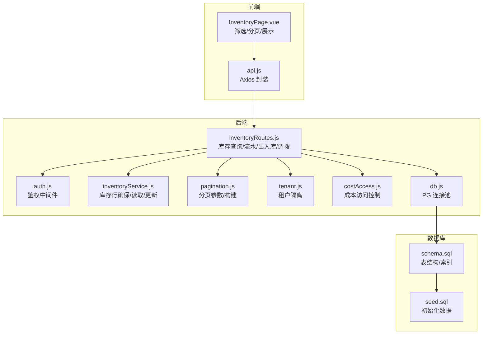
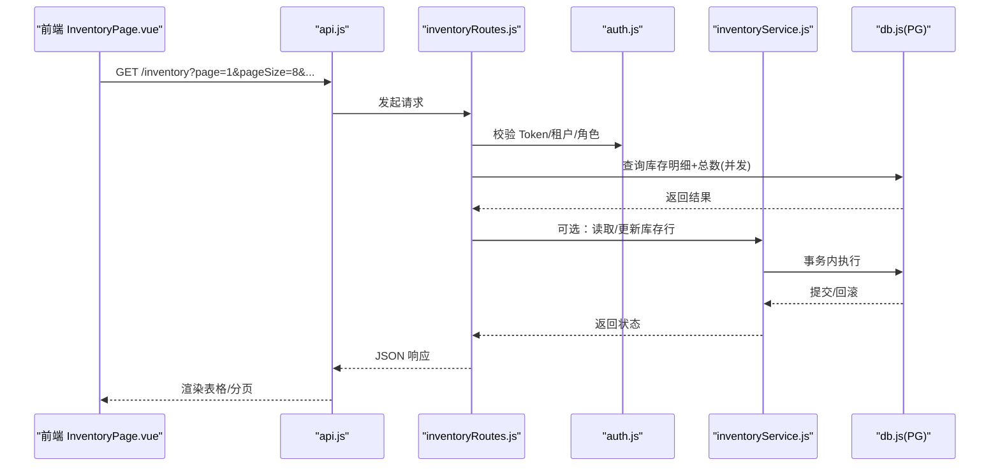
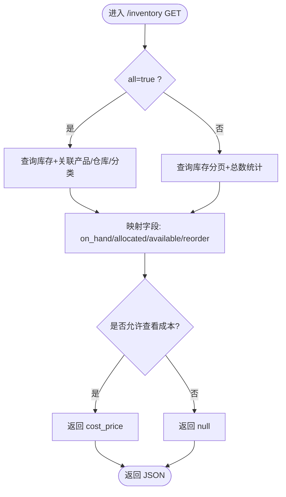
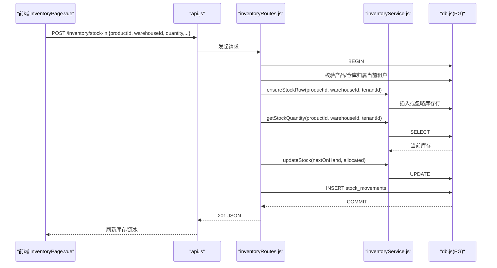
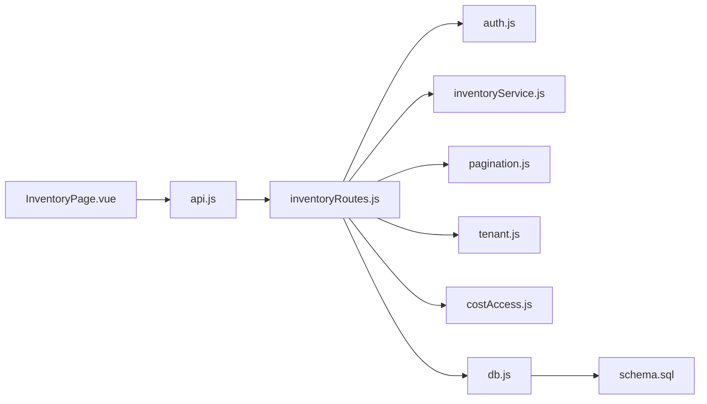
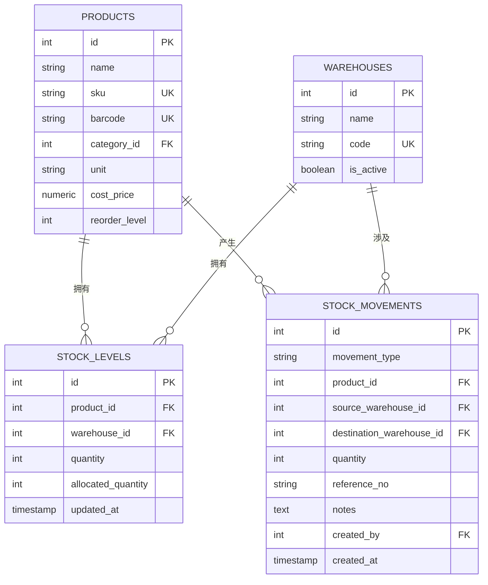

# 库存查询

<cite>
**本文引用的文件**
- [server/src/routes/inventoryRoutes.js](file://server/src/routes/inventoryRoutes.js)
- [server/src/utils/inventoryService.js](file://server/src/utils/inventoryService.js)
- [server/src/utils/pagination.js](file://server/src/utils/pagination.js)
- [server/src/middleware/auth.js](file://server/src/middleware/auth.js)
- [server/src/config/db.js](file://server/src/config/db.js)
- [server/src/utils/costAccess.js](file://server/src/utils/costAccess.js)
- [server/src/utils/tenant.js](file://server/src/utils/tenant.js)
- [web/src/pages/InventoryPage.vue](file://web/src/pages/InventoryPage.vue)
- [web/src/services/api.js](file://web/src/services/api.js)
- [server/database/schema.sql](file://server/database/schema.sql)
- [server/database/seed.sql](file://server/database/seed.sql)
- [postman/inventory_system_backend.postman_collection.json](file://postman/inventory_system_backend.postman_collection.json)
</cite>

## 目录
1. [简介](#简介)
2. [项目结构](#项目结构)
3. [核心组件](#核心组件)
4. [架构总览](#架构总览)
5. [详细组件分析](#详细组件分析)
6. [依赖关系分析](#依赖关系分析)
7. [性能考虑](#性能考虑)
8. [故障排查指南](#故障排查指南)
9. [结论](#结论)
10. [附录](#附录)

## 简介
本文件面向“库存查询”功能，系统性阐述以下内容：
- 库存查询的实现逻辑：支持按产品、仓库、分类、低库存等多条件组合查询。
- 实时库存显示机制：可用库存、已分配库存、在途库存的计算方式与展示策略。
- 性能优化策略：索引设计、查询缓存思路、分页处理与并发查询。
- 数据展示格式：表格视图、筛选排序能力与低库存状态标识。
- 库存查询 API 详解：请求参数、响应格式、错误处理与鉴权要求。
- 库存预警集成：安全库存提醒与缺货状态标识的前端呈现。

## 项目结构
后端采用 Express + PostgreSQL，前端为 Vue 3 单页应用。库存查询主要由后端路由与服务层配合完成，前端负责筛选、分页与展示。

**图表来源**
- [web/src/pages/InventoryPage.vue:113-150](file://web/src/pages/InventoryPage.vue#L113-L150)
- [web/src/services/api.js:1-45](file://web/src/services/api.js#L1-L45)
- [server/src/routes/inventoryRoutes.js:1-156](file://server/src/routes/inventoryRoutes.js#L1-L156)
- [server/src/utils/inventoryService.js:1-46](file://server/src/utils/inventoryService.js#L1-L46)
- [server/src/utils/pagination.js:1-28](file://server/src/utils/pagination.js#L1-L28)
- [server/src/middleware/auth.js:1-87](file://server/src/middleware/auth.js#L1-L87)
- [server/src/utils/costAccess.js:1-32](file://server/src/utils/costAccess.js#L1-L32)
- [server/src/utils/tenant.js:1-43](file://server/src/utils/tenant.js#L1-L43)
- [server/src/config/db.js:1-29](file://server/src/config/db.js#L1-L29)
- [server/database/schema.sql:125-133](file://server/database/schema.sql#L125-L133)
- [server/database/seed.sql:95-114](file://server/database/seed.sql#L95-L114)

**章节来源**
- [web/src/pages/InventoryPage.vue:1-567](file://web/src/pages/InventoryPage.vue#L1-L567)
- [server/src/routes/inventoryRoutes.js:1-536](file://server/src/routes/inventoryRoutes.js#L1-L536)
- [server/database/schema.sql:125-133](file://server/database/schema.sql#L125-L133)

## 核心组件
- 后端路由与控制器
  - 库存总览列表：支持搜索、分类过滤、仓库过滤、低库存筛选、分页与总数统计。
  - 最近流水列表：支持搜索、流水类型过滤、分页。
  - 库存操作：入库、出库、调拨、订单占用/释放。
- 服务层
  - 统一库存行确保、读取与更新，保证事务一致性。
- 工具与中间件
  - 分页参数标准化、构建统一分页结构。
  - 鉴权与角色授权、租户隔离、成本访问令牌校验。
- 前端页面与 API 封装
  - 并发加载库存与流水，统一处理筛选、分页与错误提示。

**章节来源**
- [server/src/routes/inventoryRoutes.js:17-156](file://server/src/routes/inventoryRoutes.js#L17-L156)
- [server/src/utils/inventoryService.js:1-46](file://server/src/utils/inventoryService.js#L1-L46)
- [server/src/utils/pagination.js:1-28](file://server/src/utils/pagination.js#L1-L28)
- [server/src/middleware/auth.js:1-87](file://server/src/middleware/auth.js#L1-L87)
- [server/src/utils/costAccess.js:1-32](file://server/src/utils/costAccess.js#L1-L32)
- [server/src/utils/tenant.js:1-43](file://server/src/utils/tenant.js#L1-L43)
- [web/src/pages/InventoryPage.vue:113-150](file://web/src/pages/InventoryPage.vue#L113-L150)
- [web/src/services/api.js:1-45](file://web/src/services/api.js#L1-L45)

## 架构总览
库存查询遵循“前端请求 -> 鉴权中间件 -> 路由处理 -> 服务层 -> 数据库”的标准流程。查询通过多表联结与条件过滤实现，同时利用索引与分页降低数据库压力。

**图表来源**
- [web/src/pages/InventoryPage.vue:113-150](file://web/src/pages/InventoryPage.vue#L113-L150)
- [web/src/services/api.js:1-45](file://web/src/services/api.js#L1-L45)
- [server/src/routes/inventoryRoutes.js:17-156](file://server/src/routes/inventoryRoutes.js#L17-L156)
- [server/src/utils/inventoryService.js:14-39](file://server/src/utils/inventoryService.js#L14-L39)
- [server/src/middleware/auth.js:5-61](file://server/src/middleware/auth.js#L5-L61)
- [server/src/config/db.js:17-28](file://server/src/config/db.js#L17-L28)

## 详细组件分析

### 组件A：库存查询与实时库存显示
- 查询入口与参数
  - 支持的查询参数：search、categoryId、warehouseId、lowStockOnly、page、pageSize、all。
  - all=true 时一次性返回全部数据；否则分页返回并返回总数。
- 实时库存字段
  - on_hand_quantity：实盘数量。
  - order_allocated_quantity：已占用数量（订单占用）。
  - warehouse_available_quantity：可用数量 = MAX(on_hand_quantity - order_allocated_quantity, 0)。
  - reorder_level：安全库存阈值。
- 低库存状态标识
  - 前端根据 warehouse_available_quantity 与 reorder_level 的比较，使用颜色区分“正常/预警”。

**图表来源**
- [server/src/routes/inventoryRoutes.js:17-156](file://server/src/routes/inventoryRoutes.js#L17-L156)
- [server/src/utils/costAccess.js:25-27](file://server/src/utils/costAccess.js#L25-L27)

**章节来源**
- [server/src/routes/inventoryRoutes.js:17-156](file://server/src/routes/inventoryRoutes.js#L17-L156)
- [web/src/pages/InventoryPage.vue:490-528](file://web/src/pages/InventoryPage.vue#L490-L528)

### 组件B：库存操作与实时库存更新
- 入库(IN)：校验产品与仓库归属当前租户，确保库存行存在，增加 on_hand_quantity，记录流水。
- 出库(OUT)：校验可用库存充足，减少 on_hand_quantity，记录流水。
- 调拨(TRANSFER)：校验源仓可用库存充足，源仓减少、目的仓增加，记录流水。
- 订单占用(ALLOCATION)：支持 reserve/release，调整 order_allocated_quantity，记录流水。

**图表来源**
- [server/src/routes/inventoryRoutes.js:237-449](file://server/src/routes/inventoryRoutes.js#L237-L449)
- [server/src/utils/inventoryService.js:3-39](file://server/src/utils/inventoryService.js#L3-L39)

**章节来源**
- [server/src/routes/inventoryRoutes.js:237-449](file://server/src/routes/inventoryRoutes.js#L237-L449)
- [server/src/utils/inventoryService.js:1-46](file://server/src/utils/inventoryService.js#L1-L46)

### 组件C：最近流水查询
- 支持的查询参数：search、movementType、page、pageSize。
- 支持的流水类型：IN、OUT、TRANSFER。
- 返回 items 与 pagination 结构，便于前端表格渲染与分页条联动。

**章节来源**
- [server/src/routes/inventoryRoutes.js:158-235](file://server/src/routes/inventoryRoutes.js#L158-L235)

### 组件D：前端交互与展示
- 并发加载：同时请求库存列表与最近流水，提升首屏速度。
- 筛选与分页：库存与流水分别维护分页状态，支持重置筛选。
- 展示格式：移动端卡片与桌面端表格两种视图；低库存以颜色高亮。
- 错误处理：捕获后端错误消息并提示。

**章节来源**
- [web/src/pages/InventoryPage.vue:113-150](file://web/src/pages/InventoryPage.vue#L113-L150)
- [web/src/pages/InventoryPage.vue:490-562](file://web/src/pages/InventoryPage.vue#L490-L562)
- [web/src/services/api.js:26-42](file://web/src/services/api.js#L26-L42)

## 依赖关系分析
- 路由依赖中间件：鉴权、租户隔离、成本访问控制。
- 服务层依赖数据库连接池与事务封装。
- 前端依赖统一 API 封装，自动注入鉴权与语言头。

**图表来源**
- [server/src/routes/inventoryRoutes.js:1-12](file://server/src/routes/inventoryRoutes.js#L1-L12)
- [server/src/middleware/auth.js:1-11](file://server/src/middleware/auth.js#L1-L11)
- [server/src/utils/inventoryService.js:1-4](file://server/src/utils/inventoryService.js#L1-L4)
- [server/src/utils/pagination.js:1-5](file://server/src/utils/pagination.js#L1-L5)
- [server/src/utils/costAccess.js:1-6](file://server/src/utils/costAccess.js#L1-L6)
- [server/src/utils/tenant.js:9-14](file://server/src/utils/tenant.js#L9-L14)
- [server/src/config/db.js:1-5](file://server/src/config/db.js#L1-L5)
- [web/src/pages/InventoryPage.vue:1-10](file://web/src/pages/InventoryPage.vue#L1-L10)
- [web/src/services/api.js:1-5](file://web/src/services/api.js#L1-L5)
- [server/database/schema.sql:125-133](file://server/database/schema.sql#L125-L133)

**章节来源**
- [server/src/routes/inventoryRoutes.js:1-12](file://server/src/routes/inventoryRoutes.js#L1-L12)
- [server/src/middleware/auth.js:1-11](file://server/src/middleware/auth.js#L1-L11)
- [server/src/utils/inventoryService.js:1-4](file://server/src/utils/inventoryService.js#L1-L4)
- [server/src/utils/pagination.js:1-5](file://server/src/utils/pagination.js#L1-L5)
- [server/src/utils/costAccess.js:1-6](file://server/src/utils/costAccess.js#L1-L6)
- [server/src/utils/tenant.js:9-14](file://server/src/utils/tenant.js#L9-L14)
- [server/src/config/db.js:1-5](file://server/src/config/db.js#L1-L5)
- [web/src/pages/InventoryPage.vue:1-10](file://web/src/pages/InventoryPage.vue#L1-L10)
- [web/src/services/api.js:1-5](file://web/src/services/api.js#L1-L5)
- [server/database/schema.sql:125-133](file://server/database/schema.sql#L125-L133)

## 性能考虑
- 索引设计
  - stock_levels：product_id、warehouse_id（唯一组合），支撑库存查询与占用/更新。
  - stock_movements：product_id、created_at（倒序），支撑流水查询与分页。
  - products：category_id、product_code（唯一），支撑搜索与分类过滤。
  - 其他常用过滤字段均有相应索引，降低 LIKE 与多表联结成本。
- 查询缓存
  - 建议：对高频查询（如“全量库存概览”）引入 Redis 缓存，设置合理过期时间；对“最近流水”可短期缓存热点时段数据。
- 分页处理
  - 使用 LIMIT/OFFSET 并行统计总数，避免全表扫描；pageSize 上限控制在 100 以内，防止超大数据集。
- 并发查询
  - 前端对库存与流水采用 Promise.all 并发请求，缩短首屏等待时间。
- 事务与锁
  - 入库/出库/调拨/占用均在单事务中执行，避免并发导致的库存不一致。

**章节来源**
- [server/database/schema.sql:410-447](file://server/database/schema.sql#L410-L447)
- [server/src/utils/pagination.js:2-12](file://server/src/utils/pagination.js#L2-L12)
- [web/src/pages/InventoryPage.vue:119-140](file://web/src/pages/InventoryPage.vue#L119-L140)

## 故障排查指南
- 常见错误与定位
  - 401 未认证/过期：检查 Authorization 头与 JWT 是否有效。
  - 403 权限不足：确认角色是否满足接口所需（如调拨需 ADMIN/MANAGER）。
  - 400 参数错误：检查 productId、quantity、仓库 ID 是否正确；调拨时源仓与目的仓不能相同。
  - 400 库存不足：出库或调拨时可用库存小于申请数量。
  - 500 数据库错误：检查连接串、SSL 设置与网络连通性。
- 日志与审计
  - 后端统一返回 { message, error } 结构，前端捕获并提示；可结合审计日志定位问题。
- 快速验证
  - 使用 Postman 集合中的健康检查、登录、库存查询与流水查询接口进行端到端验证。

**章节来源**
- [server/src/middleware/auth.js:5-61](file://server/src/middleware/auth.js#L5-L61)
- [server/src/routes/inventoryRoutes.js:243-434](file://server/src/routes/inventoryRoutes.js#L243-L434)
- [server/src/config/db.js:3-23](file://server/src/config/db.js#L3-L23)
- [postman/inventory_system_backend.postman_collection.json:12-78](file://postman/inventory_system_backend.postman_collection.json#L12-L78)
- [postman/inventory_system_backend.postman_collection.json:240-271](file://postman/inventory_system_backend.postman_collection.json#L240-L271)

## 结论
该库存查询系统通过清晰的前后端职责划分、完善的鉴权与租户隔离、合理的索引与分页策略，实现了高性能、可扩展的库存查询与实时库存展示。建议在生产环境中进一步引入缓存与监控告警，持续优化查询路径与前端渲染性能。

## 附录

### API 定义与示例

- 获取库存总览
  - 方法与路径：GET /api/inventory
  - 请求参数
    - search: 模糊搜索（名称/SKU/条码/分类/仓库）
    - categoryId: 分类 ID（可选）
    - warehouseId: 仓库 ID（可选）
    - lowStockOnly: 仅低库存（true/false）
    - page/pageSize: 分页
    - all: 是否全量返回（true/false）
  - 响应字段
    - items: 库存明细数组（包含 on_hand_quantity、order_allocated_quantity、warehouse_available_quantity、reorder_level、unit 等）
    - pagination: { total, page, pageSize, totalPages }
  - 鉴权：需要 Bearer Token；成本价格受 x-cost-access-token 控制
  - 示例请求
    - GET /api/inventory?page=1&pageSize=8&search=mouse&lowStockOnly=false

- 获取最近流水
  - 方法与路径：GET /api/inventory/transactions
  - 请求参数
    - search: 模糊搜索（产品/参考号/类型/仓库/用户）
    - movementType: IN/OUT/TRANSFER/all
    - page/pageSize
  - 响应字段
    - items: 流水明细数组（包含 movement_type、quantity、reference_no、created_at、产品与仓库信息）
    - pagination

- 创建入库
  - 方法与路径：POST /api/inventory/stock-in
  - 请求体字段
    - productId, warehouseId, quantity, referenceNo, notes, supplierId, unitCost, purchaseReason
  - 响应：创建的 stock_movements 记录

- 创建出库
  - 方法与路径：POST /api/inventory/stock-out
  - 请求体字段
    - productId, warehouseId, quantity, referenceNo, notes
  - 响应：创建的 stock_movements 记录

- 创建调拨
  - 方法与路径：POST /api/inventory/transfer
  - 请求体字段
    - productId, sourceWarehouseId, destinationWarehouseId, quantity, referenceNo, notes
  - 响应：创建的 stock_movements 记录

- 订单占用/释放
  - 方法与路径：POST /api/inventory/allocate
  - 请求体字段
    - productId, warehouseId, quantity, mode(reserve/release), referenceNo, notes
  - 响应：包含 movement 记录与 on_hand_quantity、order_allocated_quantity、warehouse_available_quantity

- 错误处理
  - 统一返回 { message, error }（500）或 { message }（4xx/400）

**章节来源**
- [server/src/routes/inventoryRoutes.js:17-156](file://server/src/routes/inventoryRoutes.js#L17-L156)
- [server/src/routes/inventoryRoutes.js:158-235](file://server/src/routes/inventoryRoutes.js#L158-L235)
- [server/src/routes/inventoryRoutes.js:439-533](file://server/src/routes/inventoryRoutes.js#L439-L533)
- [postman/inventory_system_backend.postman_collection.json:240-329](file://postman/inventory_system_backend.postman_collection.json#L240-L329)

### 数据模型与字段说明

**图表来源**
- [server/database/schema.sql:32-54](file://server/database/schema.sql#L32-L54)
- [server/database/schema.sql:22-30](file://server/database/schema.sql#L22-L30)
- [server/database/schema.sql:125-133](file://server/database/schema.sql#L125-L133)
- [server/database/schema.sql:237-248](file://server/database/schema.sql#L237-L248)

### 初始化数据与示例
- 示例种子数据包含基础用户、分类、仓库与两条商品，以及在主仓的初始库存行。

**章节来源**
- [server/database/seed.sql:1-114](file://server/database/seed.sql#L1-L114)