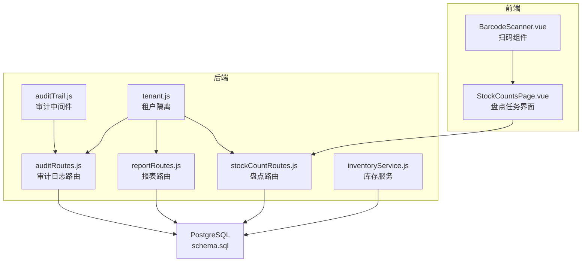
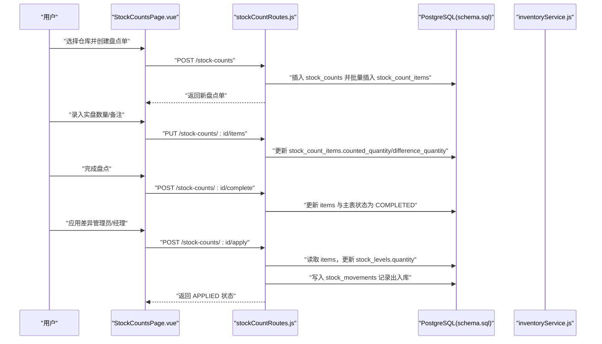
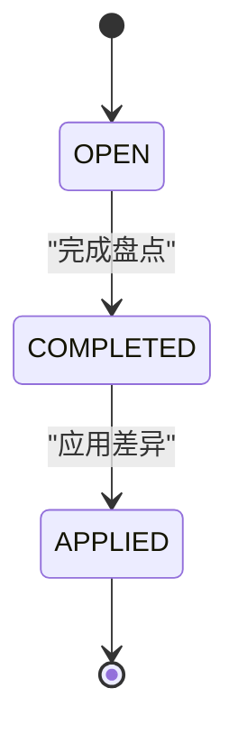
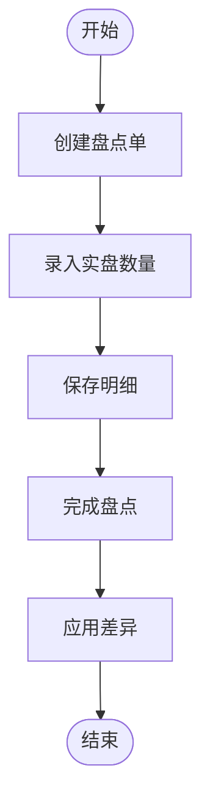
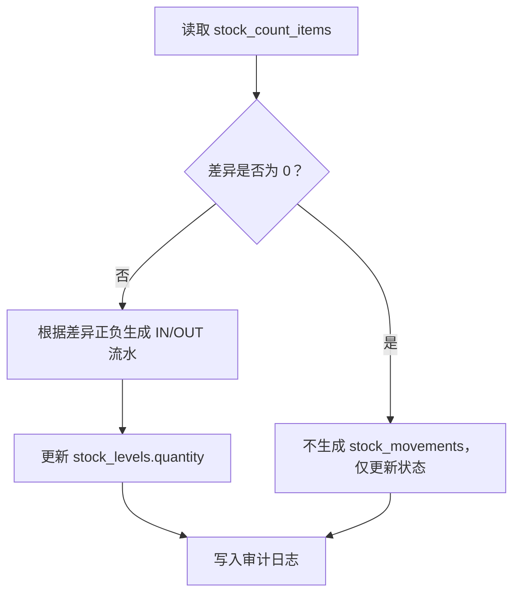
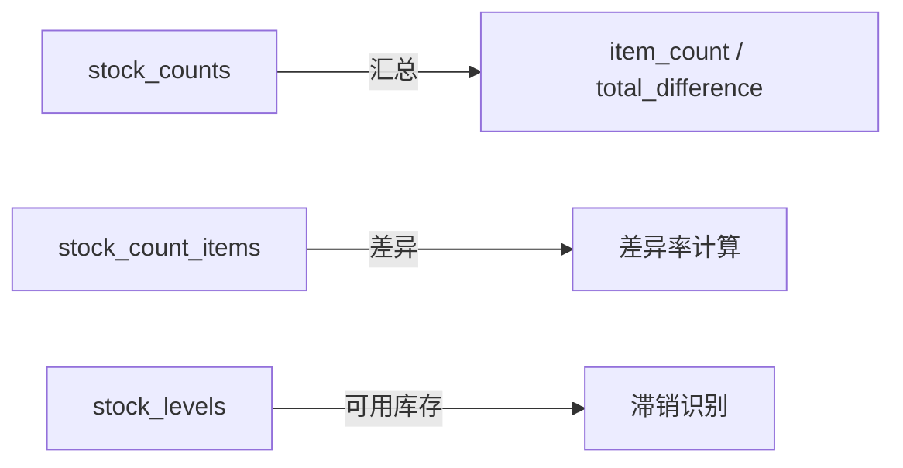
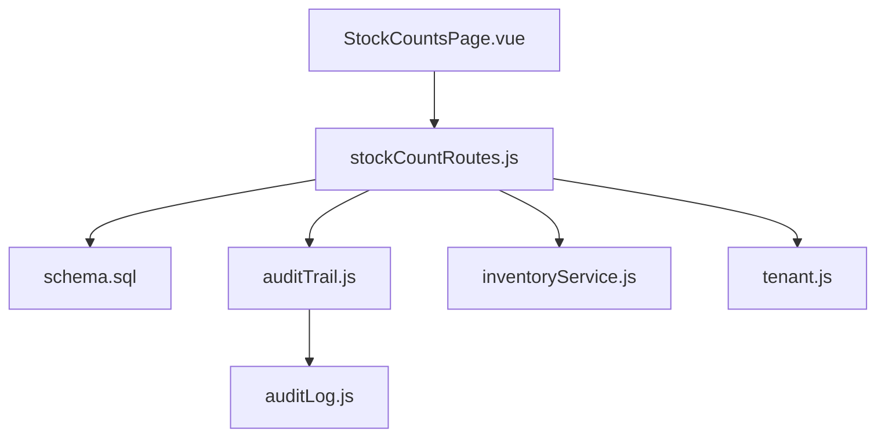
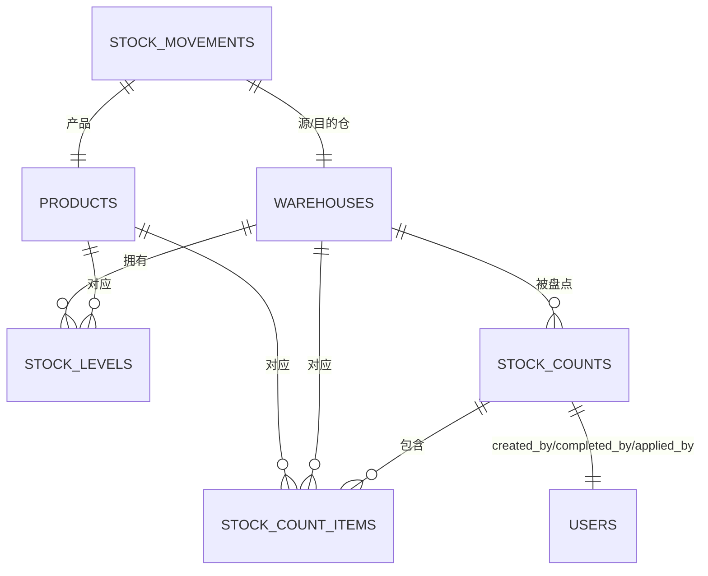

# 库存盘点

<cite>
**本文引用的文件**
- [server/src/routes/stockCountRoutes.js](file://server/src/routes/stockCountRoutes.js)
- [web/src/pages/StockCountsPage.vue](file://web/src/pages/StockCountsPage.vue)
- [server/database/schema.sql](file://server/database/schema.sql)
- [server/src/utils/inventoryService.js](file://server/src/utils/inventoryService.js)
- [server/src/middleware/auditTrail.js](file://server/src/middleware/auditTrail.js)
- [server/src/utils/auditLog.js](file://server/src/utils/auditLog.js)
- [server/src/routes/auditRoutes.js](file://server/src/routes/auditRoutes.js)
- [server/src/routes/reportRoutes.js](file://server/src/routes/reportRoutes.js)
- [web/src/components/BarcodeScanner.vue](file://web/src/components/BarcodeScanner.vue)
- [server/src/routes/settingsRoutes.js](file://server/src/routes/settingsRoutes.js)
- [server/src/utils/tenant.js](file://server/src/utils/tenant.js)
- [server/database/seed.sql](file://server/database/seed.sql)
</cite>

## 目录
1. [简介](#简介)
2. [项目结构](#项目结构)
3. [核心组件](#核心组件)
4. [架构总览](#架构总览)
5. [详细组件分析](#详细组件分析)
6. [依赖关系分析](#依赖关系分析)
7. [性能考量](#性能考量)
8. [故障排查指南](#故障排查指南)
9. [结论](#结论)
10. [附录](#附录)

## 简介
本文件面向“库存盘点”功能，系统化梳理从计划制定、任务创建、执行采集、差异处理到结果应用与审计的全流程。文档覆盖以下要点：
- 盘点策略与频率：周期盘点、循环盘点、专项盘点的策略设计与频率设置建议
- 盘点流程：任务创建、商品扫描、实盘录入、差异计算与处理
- 数据准确性保障：多人员复核、设备校准、数据验证
- 报表与分析：完成度统计、差异率分析、滞销品识别
- 异常处理：商品丢失、损坏、系统错误的处置流程
- 审核与确认：权限控制、审计追踪、可追溯性

## 项目结构
后端采用 Express + PostgreSQL，前端为 Vue 3 单页应用。库存盘点相关的核心模块分布如下：
- 后端路由：stockCountRoutes（盘点任务）、reportRoutes（报表）、auditRoutes（审计日志）
- 数据模型：schema.sql（stock_counts、stock_count_items、stock_levels、stock_movements）
- 工具与中间件：auditTrail（审计日志中间件）、inventoryService（库存增减封装）、tenant（租户隔离）
- 前端页面：StockCountsPage（盘点任务管理）、BarcodeScanner（扫码组件）

图表来源
- [server/src/routes/stockCountRoutes.js:1-458](file://server/src/routes/stockCountRoutes.js#L1-L458)
- [server/src/routes/reportRoutes.js:1-261](file://server/src/routes/reportRoutes.js#L1-L261)
- [server/src/routes/auditRoutes.js:1-113](file://server/src/routes/auditRoutes.js#L1-L113)
- [server/src/middleware/auditTrail.js:1-86](file://server/src/middleware/auditTrail.js#L1-L86)
- [server/src/utils/inventoryService.js:1-46](file://server/src/utils/inventoryService.js#L1-L46)
- [server/src/utils/tenant.js:1-42](file://server/src/utils/tenant.js#L1-L42)
- [server/database/schema.sql:250-288](file://server/database/schema.sql#L250-L288)
- [web/src/pages/StockCountsPage.vue:1-514](file://web/src/pages/StockCountsPage.vue#L1-L514)
- [web/src/components/BarcodeScanner.vue:1-68](file://web/src/components/BarcodeScanner.vue#L1-L68)

章节来源
- [server/src/routes/stockCountRoutes.js:1-458](file://server/src/routes/stockCountRoutes.js#L1-L458)
- [server/database/schema.sql:250-288](file://server/database/schema.sql#L250-L288)
- [web/src/pages/StockCountsPage.vue:1-514](file://web/src/pages/StockCountsPage.vue#L1-L514)

## 核心组件
- 盘点任务与明细
  - stock_counts：盘点任务主表，含状态、仓库、创建/完成/应用时间等
  - stock_count_items：盘点任务下的商品明细，含期望数量、实盘数量、差异数量
- 库存与移动
  - stock_levels：仓库-商品维度的实时库存
  - stock_movements：出入库/转移流水，用于记录盘点差异导致的库存调整
- 前端交互
  - StockCountsPage：创建盘点单、录入实盘数量、完成与应用
  - BarcodeScanner：扫码识别商品条码/二维码
- 审计与租户
  - auditTrail + auditLog：统一写入审计日志
  - tenant：按 tenant_id 隔离数据，确保多租户安全

章节来源
- [server/database/schema.sql:250-288](file://server/database/schema.sql#L250-L288)
- [server/src/routes/stockCountRoutes.js:1-458](file://server/src/routes/stockCountRoutes.js#L1-L458)
- [web/src/pages/StockCountsPage.vue:1-514](file://web/src/pages/StockCountsPage.vue#L1-L514)
- [web/src/components/BarcodeScanner.vue:1-68](file://web/src/components/BarcodeScanner.vue#L1-L68)
- [server/src/middleware/auditTrail.js:1-86](file://server/src/middleware/auditTrail.js#L1-L86)
- [server/src/utils/auditLog.js:1-40](file://server/src/utils/auditLog.js#L1-L40)
- [server/src/utils/tenant.js:1-42](file://server/src/utils/tenant.js#L1-L42)

## 架构总览
下图展示“创建盘点单 → 录入实盘 → 完成 → 应用差异”的端到端流程及数据库交互。

图表来源
- [server/src/routes/stockCountRoutes.js:93-455](file://server/src/routes/stockCountRoutes.js#L93-L455)
- [server/database/schema.sql:250-288](file://server/database/schema.sql#L250-L288)
- [server/src/utils/inventoryService.js:1-46](file://server/src/utils/inventoryService.js#L1-L46)
- [web/src/pages/StockCountsPage.vue:97-171](file://web/src/pages/StockCountsPage.vue#L97-L171)

## 详细组件分析

### 盘点任务生命周期与状态机
- 状态流转
  - OPEN：可编辑录入
  - COMPLETED：完成录入，等待审核应用
  - APPLIED：差异已应用到库存，不可再修改
- 关键接口
  - 创建：POST /stock-counts
  - 编辑明细：PUT /stock-counts/:id/items
  - 完成：POST /stock-counts/:id/complete
  - 应用：POST /stock-counts/:id/apply（需 ADMIN/MANAGER）

图表来源
- [server/src/routes/stockCountRoutes.js:290-345](file://server/src/routes/stockCountRoutes.js#L290-L345)
- [server/src/routes/stockCountRoutes.js:347-455](file://server/src/routes/stockCountRoutes.js#L347-L455)
- [server/database/schema.sql:250-261](file://server/database/schema.sql#L250-L261)

章节来源
- [server/src/routes/stockCountRoutes.js:93-178](file://server/src/routes/stockCountRoutes.js#L93-L178)
- [server/src/routes/stockCountRoutes.js:237-288](file://server/src/routes/stockCountRoutes.js#L237-L288)
- [server/src/routes/stockCountRoutes.js:290-345](file://server/src/routes/stockCountRoutes.js#L290-L345)
- [server/src/routes/stockCountRoutes.js:347-455](file://server/src/routes/stockCountRoutes.js#L347-L455)

### 盘点流程实现（前端到后端）
- 前端页面 StockCountsPage
  - 选择仓库 → 创建盘点单
  - 录入实盘数量 → 保存明细
  - 完成盘点 → 自动补齐未录入数量并置为 COMPLETED
  - 应用差异 → 写入 stock_levels 并生成 stock_movements
- 扫码录入
  - 使用 BarcodeScanner 组件调起摄像头，识别条码/二维码，回填商品

图表来源
- [web/src/pages/StockCountsPage.vue:97-171](file://web/src/pages/StockCountsPage.vue#L97-L171)
- [web/src/components/BarcodeScanner.vue:1-68](file://web/src/components/BarcodeScanner.vue#L1-L68)
- [server/src/routes/stockCountRoutes.js:237-345](file://server/src/routes/stockCountRoutes.js#L237-L345)

章节来源
- [web/src/pages/StockCountsPage.vue:1-514](file://web/src/pages/StockCountsPage.vue#L1-L514)
- [web/src/components/BarcodeScanner.vue:1-68](file://web/src/components/BarcodeScanner.vue#L1-L68)
- [server/src/routes/stockCountRoutes.js:237-345](file://server/src/routes/stockCountRoutes.js#L237-L345)

### 差异计算与应用
- 差异计算
  - 实盘数量与期望数量之差即为差异量；未录入时完成时自动以期望数量补齐
- 库存调整
  - 应用差异时，按差异方向写入 stock_movements（IN/OUT），并更新 stock_levels.quantity
- 审计追踪
  - 每个关键动作写入审计日志，包含操作人、实体类型、描述等

图表来源
- [server/src/routes/stockCountRoutes.js:347-455](file://server/src/routes/stockCountRoutes.js#L347-L455)
- [server/src/middleware/auditTrail.js:14-81](file://server/src/middleware/auditTrail.js#L14-L81)
- [server/src/utils/auditLog.js:1-40](file://server/src/utils/auditLog.js#L1-L40)

章节来源
- [server/src/routes/stockCountRoutes.js:347-455](file://server/src/routes/stockCountRoutes.js#L347-L455)
- [server/src/middleware/auditTrail.js:1-86](file://server/src/middleware/auditTrail.js#L1-L86)
- [server/src/utils/auditLog.js:1-40](file://server/src/utils/auditLog.js#L1-L40)

### 盘点报表与分析
- 盘点完成度统计
  - 前端聚合：每个盘点单的 item_count 与 total_difference
  - 后端接口：GET /stock-counts（支持搜索、状态过滤、分页）
- 差异率分析
  - 可基于差异绝对值与期望数量的比率进行统计（前端可自行计算）
- 滞销品识别
  - 结合库存报表与重购线（reorder_level）筛选低售罄/长期不动的商品

图表来源
- [server/src/routes/stockCountRoutes.js:15-91](file://server/src/routes/stockCountRoutes.js#L15-L91)
- [server/src/routes/reportRoutes.js:17-132](file://server/src/routes/reportRoutes.js#L17-L132)

章节来源
- [server/src/routes/stockCountRoutes.js:15-91](file://server/src/routes/stockCountRoutes.js#L15-L91)
- [server/src/routes/reportRoutes.js:17-132](file://server/src/routes/reportRoutes.js#L17-L132)

### 数据准确性保障机制
- 多人员复核
  - 应用差异需 ADMIN/MANAGER 权限，避免单人误操作
- 设备校准
  - 前端扫码组件依赖浏览器媒体能力，若摄像头不可用或权限拒绝，前端提示错误信息
- 数据验证
  - 后端对状态变更进行严格校验（仅 OPEN 可编辑，仅 COMPLETED 可应用）
  - 数值字段约束（非负整数）与唯一性约束（同一盘点单-商品-仓库唯一）

章节来源
- [server/src/routes/stockCountRoutes.js:237-288](file://server/src/routes/stockCountRoutes.js#L237-L288)
- [server/src/routes/stockCountRoutes.js:290-345](file://server/src/routes/stockCountRoutes.js#L290-L345)
- [server/src/routes/stockCountRoutes.js:347-455](file://server/src/routes/stockCountRoutes.js#L347-L455)
- [web/src/components/BarcodeScanner.vue:1-68](file://web/src/components/BarcodeScanner.vue#L1-L68)
- [server/database/schema.sql:250-288](file://server/database/schema.sql#L250-L288)

### 异常处理流程
- 商品丢失/损坏
  - 在 stock_count_items.notes 中登记原因，应用差异时仍按实盘数量调整库存
- 系统错误
  - 接口层捕获异常并回滚事务，返回错误信息；审计中间件记录失败上下文
- 权限不足
  - 应用差异接口仅 ADMIN/MANAGER 可用，其他角色调用将被拒绝

章节来源
- [server/src/routes/stockCountRoutes.js:347-455](file://server/src/routes/stockCountRoutes.js#L347-L455)
- [server/src/middleware/auditTrail.js:47-81](file://server/src/middleware/auditTrail.js#L47-L81)

### 审核与确认机制
- 审计日志
  - 审计中间件自动推断 action/entityType/entity_id，写入 audit_logs
  - 管理员可查询审计日志，按时间、动作、实体类型过滤
- 可追溯性
  - 每次关键操作（创建、保存、完成、应用）均记录元数据与描述

章节来源
- [server/src/middleware/auditTrail.js:14-81](file://server/src/middleware/auditTrail.js#L14-L81)
- [server/src/utils/auditLog.js:1-40](file://server/src/utils/auditLog.js#L1-L40)
- [server/src/routes/auditRoutes.js:16-110](file://server/src/routes/auditRoutes.js#L16-L110)

## 依赖关系分析
- 路由到模型
  - stockCountRoutes 依赖 schema.sql 中的 stock_counts、stock_count_items、stock_levels、stock_movements
- 前端到后端
  - StockCountsPage 通过 API 调用 stockCountRoutes；BarcodeScanner 提供扫码能力
- 审计链路
  - auditTrail 中间件贯穿各路由，统一写入 audit_logs

图表来源
- [server/src/routes/stockCountRoutes.js:1-458](file://server/src/routes/stockCountRoutes.js#L1-L458)
- [server/src/middleware/auditTrail.js:1-86](file://server/src/middleware/auditTrail.js#L1-L86)
- [server/src/utils/auditLog.js:1-40](file://server/src/utils/auditLog.js#L1-L40)
- [server/src/utils/inventoryService.js:1-46](file://server/src/utils/inventoryService.js#L1-L46)
- [server/src/utils/tenant.js:1-42](file://server/src/utils/tenant.js#L1-L42)
- [server/database/schema.sql:250-288](file://server/database/schema.sql#L250-L288)
- [web/src/pages/StockCountsPage.vue:1-514](file://web/src/pages/StockCountsPage.vue#L1-L514)

章节来源
- [server/src/routes/stockCountRoutes.js:1-458](file://server/src/routes/stockCountRoutes.js#L1-L458)
- [server/src/middleware/auditTrail.js:1-86](file://server/src/middleware/auditTrail.js#L1-L86)
- [server/src/utils/auditLog.js:1-40](file://server/src/utils/auditLog.js#L1-L40)
- [server/src/utils/inventoryService.js:1-46](file://server/src/utils/inventoryService.js#L1-L46)
- [server/src/utils/tenant.js:1-42](file://server/src/utils/tenant.js#L1-L42)
- [server/database/schema.sql:250-288](file://server/database/schema.sql#L250-L288)
- [web/src/pages/StockCountsPage.vue:1-514](file://web/src/pages/StockCountsPage.vue#L1-L514)

## 性能考量
- 查询优化
  - stock_counts、stock_count_items、audit_logs 等表具备相应索引，建议结合搜索条件与分页参数使用
- 事务与锁
  - 应用差异时对 stock_counts 与 stock_count_items 使用 FOR UPDATE，避免并发冲突
- 前端渲染
  - 大列表分页加载，减少一次性渲染压力

章节来源
- [server/database/schema.sql:428-432](file://server/database/schema.sql#L428-L432)
- [server/src/routes/stockCountRoutes.js:297-345](file://server/src/routes/stockCountRoutes.js#L297-L345)
- [server/src/routes/stockCountRoutes.js:354-439](file://server/src/routes/stockCountRoutes.js#L354-L439)

## 故障排查指南
- 创建盘点单失败
  - 检查仓库是否存在且属于当前租户；检查是否有活跃商品
- 编辑/完成/应用失败
  - 确认当前状态为 OPEN/COMPLETED；核对权限是否满足
- 审计日志缺失
  - 检查 auditTrail 中间件是否正确挂载；确认响应完成后触发 finish 事件
- 扫码无法使用
  - 检查浏览器摄像头权限与设备可用性；查看前端错误提示

章节来源
- [server/src/routes/stockCountRoutes.js:93-178](file://server/src/routes/stockCountRoutes.js#L93-L178)
- [server/src/routes/stockCountRoutes.js:237-345](file://server/src/routes/stockCountRoutes.js#L237-L345)
- [server/src/middleware/auditTrail.js:47-81](file://server/src/middleware/auditTrail.js#L47-L81)
- [web/src/components/BarcodeScanner.vue:13-38](file://web/src/components/BarcodeScanner.vue#L13-L38)

## 结论
该系统围绕“盘点任务-实盘录入-差异应用-审计追踪”形成闭环，具备明确的状态机与严格的权限控制。通过扫码、报表与审计日志，提升了盘点效率与数据可追溯性。建议在生产环境中结合业务需求完善策略与频率设置，并持续优化前端交互与后端事务一致性。

## 附录

### 盘点策略与频率设置建议
- 周期盘点
  - 频率：按月/季度/半年对高价值/高周转商品抽样
  - 策略：设定抽样比例与优先级（ABC 分类）
- 循环盘点
  - 频率：每日/每周对固定区域轮换
  - 策略：按 SKU 或仓区划分循环批次
- 专项盘点
  - 频率：针对滞销/临期/异常波动商品临时发起
  - 策略：结合报表与预警触发

[本节为通用实践建议，不直接分析具体文件]

### 数据模型概览（与盘点相关）

图表来源
- [server/database/schema.sql:250-288](file://server/database/schema.sql#L250-L288)