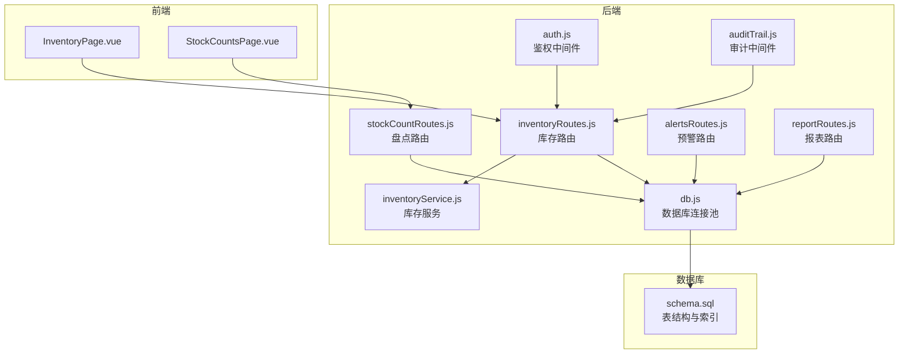
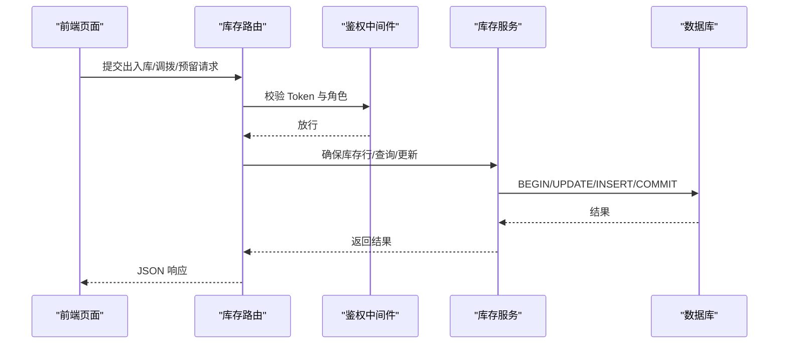
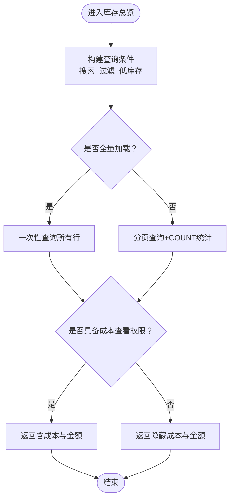
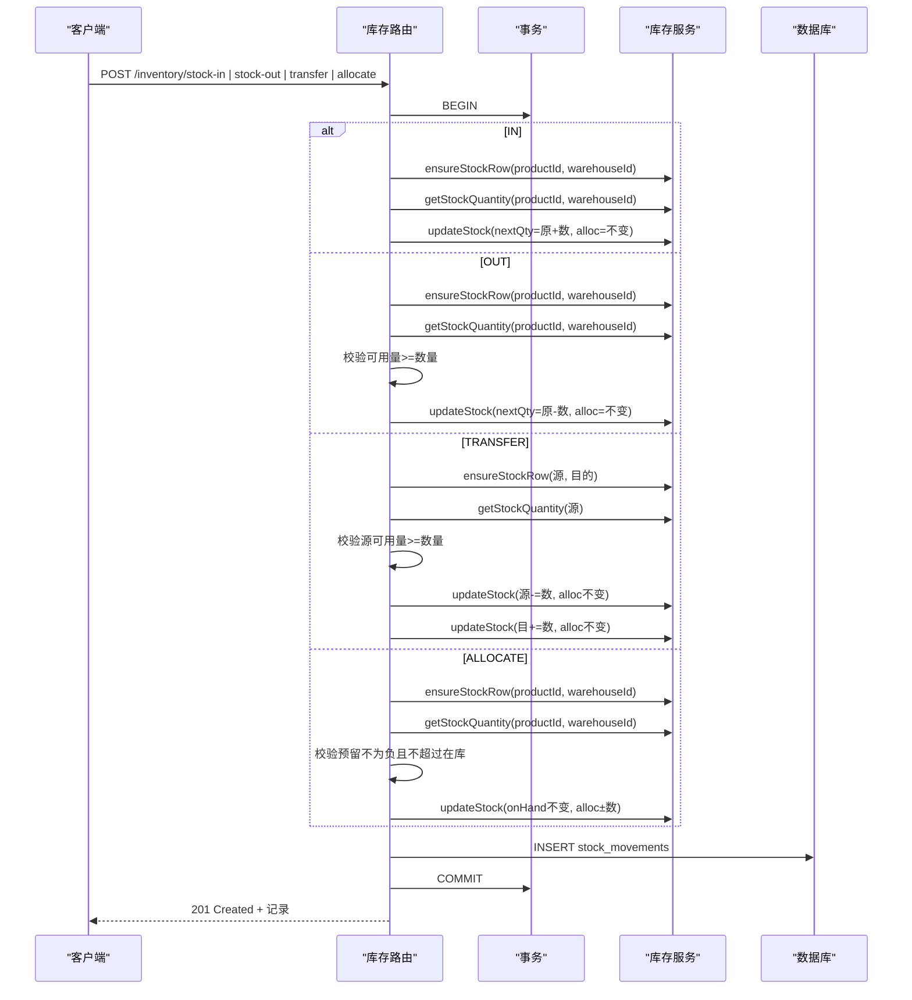
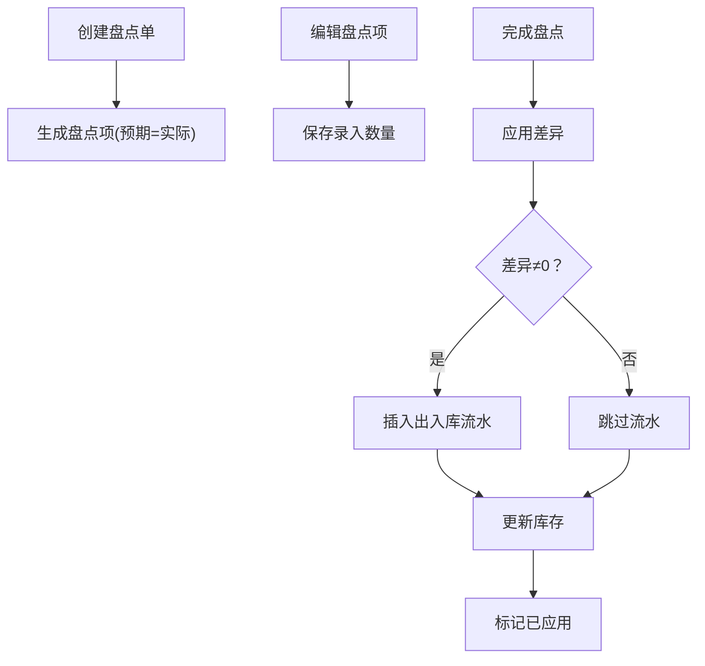
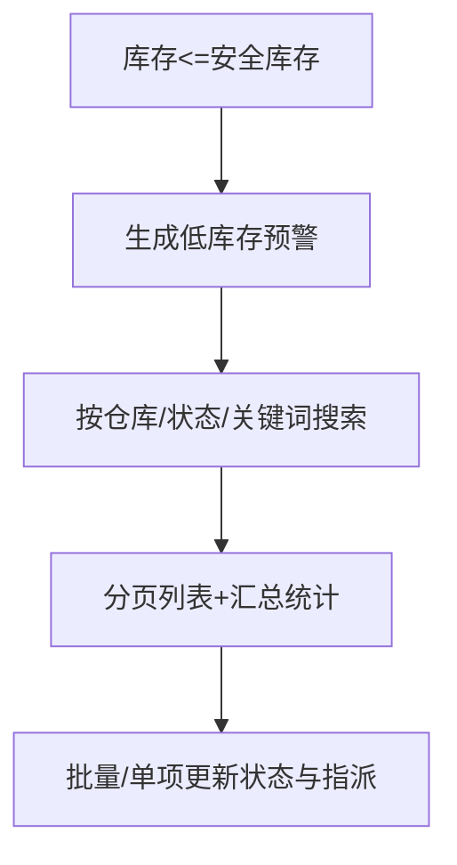
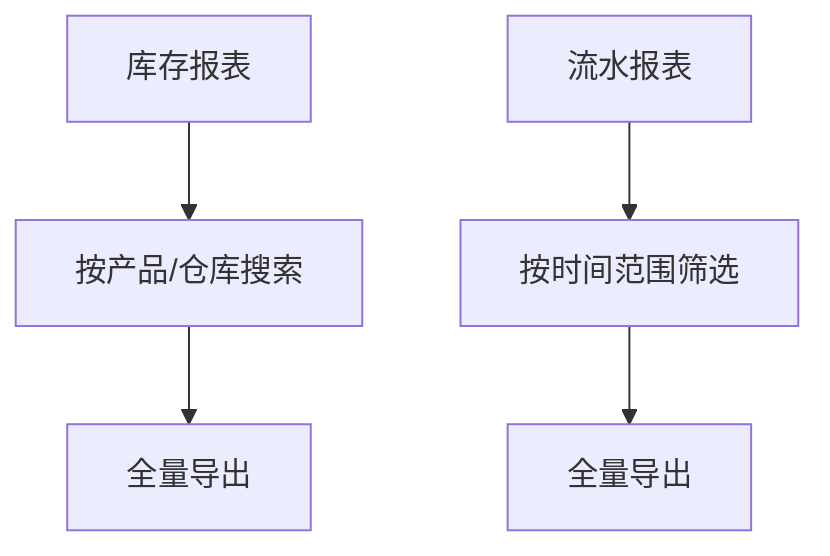
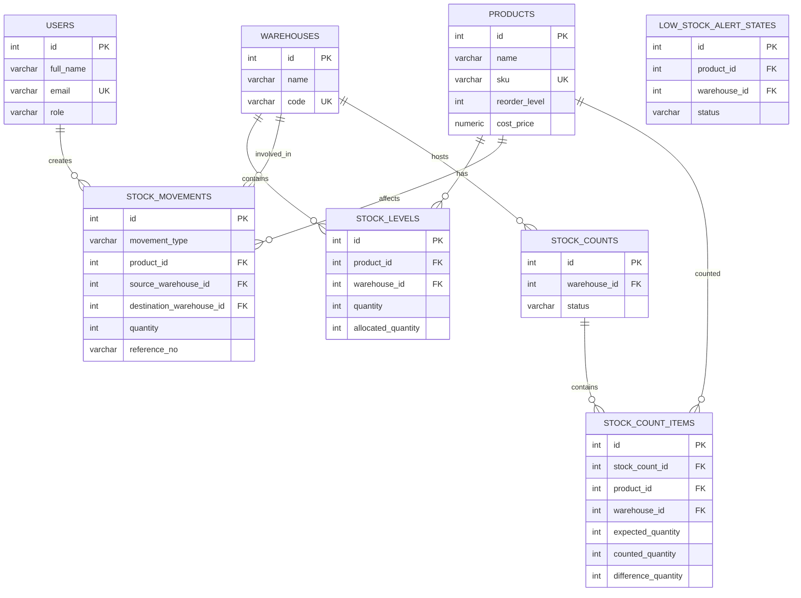
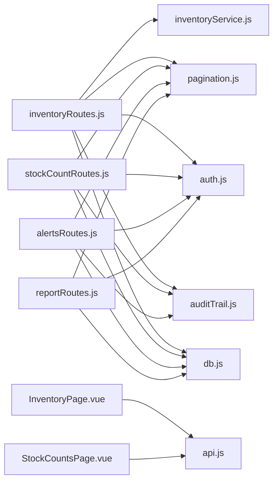

# 库存管理模块

<cite>
**本文档引用的文件**
- [server/src/routes/inventoryRoutes.js](file://server/src/routes/inventoryRoutes.js)
- [server/src/utils/inventoryService.js](file://server/src/utils/inventoryService.js)
- [server/src/routes/stockCountRoutes.js](file://server/src/routes/stockCountRoutes.js)
- [server/src/routes/alertsRoutes.js](file://server/src/routes/alertsRoutes.js)
- [server/src/routes/reportRoutes.js](file://server/src/routes/reportRoutes.js)
- [server/database/schema.sql](file://server/database/schema.sql)
- [server/src/middleware/auth.js](file://server/src/middleware/auth.js)
- [server/src/config/db.js](file://server/src/config/db.js)
- [web/src/pages/InventoryPage.vue](file://web/src/pages/InventoryPage.vue)
- [web/src/pages/StockCountsPage.vue](file://web/src/pages/StockCountsPage.vue)
- [server/src/middleware/auditTrail.js](file://server/src/middleware/auditTrail.js)
- [server/src/utils/costAccess.js](file://server/src/utils/costAccess.js)
- [server/src/utils/pagination.js](file://server/src/utils/pagination.js)
- [web/src/services/api.js](file://web/src/services/api.js)
- [server/database/seed.sql](file://server/database/seed.sql)
</cite>

## 目录
1. [简介](#简介)
2. [项目结构](#项目结构)
3. [核心组件](#核心组件)
4. [架构总览](#架构总览)
5. [详细组件分析](#详细组件分析)
6. [依赖关系分析](#依赖关系分析)
7. [性能考虑](#性能考虑)
8. [故障排查指南](#故障排查指南)
9. [结论](#结论)
10. [附录](#附录)

## 简介
本模块围绕库存管理的核心业务展开，覆盖库存查询、出入库操作、调拨流程、盘点管理、预警机制、报表分析以及事务与并发控制保障。系统通过统一的库存水平表记录每种产品在各仓库的实时可用数量，并以流水表追踪所有库存变动；同时提供多维度的报表与预警能力，支撑日常运营与决策。

## 项目结构
后端采用 Express + PostgreSQL 架构，前端为 Vue 单页应用。路由层负责暴露 REST 接口，服务层封装通用逻辑（如库存增减），中间件负责鉴权、审计与速率限制，数据库层定义核心表结构与索引。

**图表来源**
- [server/src/routes/inventoryRoutes.js:1-493](file://server/src/routes/inventoryRoutes.js#L1-L493)
- [server/src/utils/inventoryService.js:1-45](file://server/src/utils/inventoryService.js#L1-L45)
- [server/src/routes/stockCountRoutes.js:1-434](file://server/src/routes/stockCountRoutes.js#L1-L434)
- [server/src/routes/alertsRoutes.js:1-290](file://server/src/routes/alertsRoutes.js#L1-L290)
- [server/src/routes/reportRoutes.js:1-252](file://server/src/routes/reportRoutes.js#L1-L252)
- [server/src/middleware/auth.js:1-46](file://server/src/middleware/auth.js#L1-L46)
- [server/src/middleware/auditTrail.js:1-84](file://server/src/middleware/auditTrail.js#L1-L84)
- [server/src/config/db.js:1-25](file://server/src/config/db.js#L1-L25)
- [server/database/schema.sql:1-420](file://server/database/schema.sql#L1-L420)

**章节来源**
- [server/src/routes/inventoryRoutes.js:1-493](file://server/src/routes/inventoryRoutes.js#L1-L493)
- [server/src/routes/stockCountRoutes.js:1-434](file://server/src/routes/stockCountRoutes.js#L1-L434)
- [server/src/routes/alertsRoutes.js:1-290](file://server/src/routes/alertsRoutes.js#L1-L290)
- [server/src/routes/reportRoutes.js:1-252](file://server/src/routes/reportRoutes.js#L1-L252)
- [server/database/schema.sql:125-273](file://server/database/schema.sql#L125-L273)

## 核心组件
- 库存路由：提供库存总览、最近流水、出入库、调拨、订单预留/释放等接口，统一开启鉴权与分页。
- 库存服务：封装库存行确保、查询与更新逻辑，避免重复事务代码。
- 盘点路由：支持创建、编辑、完成、应用盘点单，自动回写库存并生成相应流水。
- 预警路由：基于安全库存阈值生成低库存预警，支持状态与指派管理。
- 报表路由：提供库存明细与流水报表，支持搜索与时间范围筛选。
- 中间件：鉴权、审计、成本访问令牌控制、分页工具。
- 数据库：定义库存水平、流水、盘点、预警、用户、产品、仓库等核心表及索引。

**章节来源**
- [server/src/routes/inventoryRoutes.js:17-151](file://server/src/routes/inventoryRoutes.js#L17-L151)
- [server/src/utils/inventoryService.js:1-45](file://server/src/utils/inventoryService.js#L1-L45)
- [server/src/routes/stockCountRoutes.js:87-164](file://server/src/routes/stockCountRoutes.js#L87-L164)
- [server/src/routes/alertsRoutes.js:80-197](file://server/src/routes/alertsRoutes.js#L80-L197)
- [server/src/routes/reportRoutes.js:16-127](file://server/src/routes/reportRoutes.js#L16-L127)
- [server/src/middleware/auth.js:5-29](file://server/src/middleware/auth.js#L5-L29)
- [server/src/middleware/auditTrail.js:47-79](file://server/src/middleware/auditTrail.js#L47-L79)
- [server/src/utils/costAccess.js:25-27](file://server/src/utils/costAccess.js#L25-L27)
- [server/src/utils/pagination.js:1-28](file://server/src/utils/pagination.js#L1-L28)
- [server/database/schema.sql:125-273](file://server/database/schema.sql#L125-L273)

## 架构总览
系统遵循“前端页面 -> 路由 -> 服务/中间件 -> 数据库”的分层设计。库存操作均在数据库事务内执行，确保一致性；审计中间件自动记录关键操作；成本访问通过独立令牌控制敏感字段可见性。

**图表来源**
- [server/src/routes/inventoryRoutes.js:229-403](file://server/src/routes/inventoryRoutes.js#L229-L403)
- [server/src/utils/inventoryService.js:2-38](file://server/src/utils/inventoryService.js#L2-L38)
- [server/src/middleware/auth.js:5-29](file://server/src/middleware/auth.js#L5-L29)

**章节来源**
- [server/src/routes/inventoryRoutes.js:229-403](file://server/src/routes/inventoryRoutes.js#L229-L403)
- [server/src/utils/inventoryService.js:2-38](file://server/src/utils/inventoryService.js#L2-L38)
- [server/src/middleware/auth.js:5-29](file://server/src/middleware/auth.js#L5-L29)

## 详细组件分析

### 库存查询与流水
- 库存总览：支持按产品名/SKU/条码/分类/仓库搜索，按类别与仓库过滤，低库存筛选，分页与总数统计。
- 最近流水：支持按类型（IN/OUT/TRANSFER）与关键词搜索，分页展示。
- 成本字段控制：根据成本访问令牌决定是否返回成本价与库存金额。

**图表来源**
- [server/src/routes/inventoryRoutes.js:17-151](file://server/src/routes/inventoryRoutes.js#L17-L151)
- [server/src/utils/costAccess.js:25-27](file://server/src/utils/costAccess.js#L25-L27)

**章节来源**
- [server/src/routes/inventoryRoutes.js:17-151](file://server/src/routes/inventoryRoutes.js#L17-L151)
- [server/src/utils/costAccess.js:25-27](file://server/src/utils/costAccess.js#L25-L27)

### 出入库与调拨流程
- 入库（IN）：必须指定仓库与数量，自动确保库存行存在，更新可用数量，插入流水记录。
- 出库（OUT）：必须指定仓库与数量，检查可用量（在库-预留），更新可用数量，插入流水记录。
- 调拨（TRANSFER）：必须指定源/目的仓库，检查源仓可用量，分别更新源仓扣减与目的仓增加，插入流水记录。
- 订单预留/释放：在指定仓库对预留数量进行增减，同时生成对应流水。

**图表来源**
- [server/src/routes/inventoryRoutes.js:229-490](file://server/src/routes/inventoryRoutes.js#L229-L490)
- [server/src/utils/inventoryService.js:2-38](file://server/src/utils/inventoryService.js#L2-L38)

**章节来源**
- [server/src/routes/inventoryRoutes.js:229-490](file://server/src/routes/inventoryRoutes.js#L229-L490)
- [server/src/utils/inventoryService.js:2-38](file://server/src/utils/inventoryService.js#L2-L38)

### 盘点管理流程
- 创建：选择仓库，校验仓库是否存在活动商品，批量写入盘点项（预期=实际）。
- 编辑：仅开放状态可修改，支持保存录入数量与备注。
- 完成：将未录入的数量补齐为预期数量，标记完成。
- 应用：仅完成状态可应用，逐项对比当前库存与目标数量，差额生成出入库流水并更新库存。

**图表来源**
- [server/src/routes/stockCountRoutes.js:87-164](file://server/src/routes/stockCountRoutes.js#L87-L164)
- [server/src/routes/stockCountRoutes.js:221-271](file://server/src/routes/stockCountRoutes.js#L221-L271)
- [server/src/routes/stockCountRoutes.js:273-324](file://server/src/routes/stockCountRoutes.js#L273-L324)
- [server/src/routes/stockCountRoutes.js:326-431](file://server/src/routes/stockCountRoutes.js#L326-L431)

**章节来源**
- [server/src/routes/stockCountRoutes.js:87-164](file://server/src/routes/stockCountRoutes.js#L87-L164)
- [server/src/routes/stockCountRoutes.js:221-271](file://server/src/routes/stockCountRoutes.js#L221-L271)
- [server/src/routes/stockCountRoutes.js:273-324](file://server/src/routes/stockCountRoutes.js#L273-L324)
- [server/src/routes/stockCountRoutes.js:326-431](file://server/src/routes/stockCountRoutes.js#L326-L431)

### 预警机制
- 触发条件：当库存小于等于安全库存时触发低库存预警。
- 查询维度：支持按仓库、状态、关键词搜索，分页与汇总统计（总预警数、缺货数、影响商品数）。
- 状态管理：支持 OPEN/READ/IGNORED 状态变更与指派，管理员/经理可指派处理人。

**图表来源**
- [server/src/routes/alertsRoutes.js:80-197](file://server/src/routes/alertsRoutes.js#L80-L197)
- [server/src/routes/alertsRoutes.js:199-232](file://server/src/routes/alertsRoutes.js#L199-L232)
- [server/src/routes/alertsRoutes.js:234-287](file://server/src/routes/alertsRoutes.js#L234-L287)

**章节来源**
- [server/src/routes/alertsRoutes.js:80-197](file://server/src/routes/alertsRoutes.js#L80-L197)
- [server/src/routes/alertsRoutes.js:199-232](file://server/src/routes/alertsRoutes.js#L199-L232)
- [server/src/routes/alertsRoutes.js:234-287](file://server/src/routes/alertsRoutes.js#L234-L287)

### 报表分析
- 库存报表：支持按产品/仓库搜索，导出时可全量拉取，包含可用数量与库存金额。
- 流水报表：支持时间范围与关键词搜索，按时间倒序分页展示。

**图表来源**
- [server/src/routes/reportRoutes.js:16-127](file://server/src/routes/reportRoutes.js#L16-L127)
- [server/src/routes/reportRoutes.js:129-249](file://server/src/routes/reportRoutes.js#L129-L249)

**章节来源**
- [server/src/routes/reportRoutes.js:16-127](file://server/src/routes/reportRoutes.js#L16-L127)
- [server/src/routes/reportRoutes.js:129-249](file://server/src/routes/reportRoutes.js#L129-L249)

### 数据模型与关系
库存系统的核心实体包括：用户、仓库、产品、库存水平、库存流水、盘点单、盘点项、低库存预警状态等。库存水平表通过唯一约束保证“产品+仓库”组合唯一；流水表记录每次变动的来源/去向与参考信息；盘点单与盘点项形成一对多关系，最终应用时回写库存并生成流水。

**图表来源**
- [server/database/schema.sql:125-300](file://server/database/schema.sql#L125-L300)

**章节来源**
- [server/database/schema.sql:125-300](file://server/database/schema.sql#L125-L300)

## 依赖关系分析
- 路由依赖：库存路由依赖库存服务与分页工具；盘点/预警/报表路由各自独立但共享数据库连接池。
- 中间件依赖：鉴权中间件在所有受保护路由前执行；审计中间件监听响应完成事件写入审计日志。
- 数据库依赖：所有写操作通过连接池执行，事务包裹关键路径，索引覆盖常用查询字段。

**图表来源**
- [server/src/routes/inventoryRoutes.js:1-10](file://server/src/routes/inventoryRoutes.js#L1-L10)
- [server/src/utils/inventoryService.js:1-11](file://server/src/utils/inventoryService.js#L1-L11)
- [server/src/utils/pagination.js:1-28](file://server/src/utils/pagination.js#L1-L28)
- [server/src/middleware/auth.js:1-46](file://server/src/middleware/auth.js#L1-L46)
- [server/src/middleware/auditTrail.js:1-84](file://server/src/middleware/auditTrail.js#L1-L84)
- [server/src/config/db.js:1-25](file://server/src/config/db.js#L1-L25)
- [web/src/pages/InventoryPage.vue:1-567](file://web/src/pages/InventoryPage.vue#L1-L567)
- [web/src/pages/StockCountsPage.vue:1-514](file://web/src/pages/StockCountsPage.vue#L1-L514)
- [web/src/services/api.js:1-45](file://web/src/services/api.js#L1-L45)

**章节来源**
- [server/src/routes/inventoryRoutes.js:1-10](file://server/src/routes/inventoryRoutes.js#L1-L10)
- [server/src/utils/inventoryService.js:1-11](file://server/src/utils/inventoryService.js#L1-L11)
- [server/src/utils/pagination.js:1-28](file://server/src/utils/pagination.js#L1-L28)
- [server/src/middleware/auth.js:1-46](file://server/src/middleware/auth.js#L1-L46)
- [server/src/middleware/auditTrail.js:1-84](file://server/src/middleware/auditTrail.js#L1-L84)
- [server/src/config/db.js:1-25](file://server/src/config/db.js#L1-L25)
- [web/src/pages/InventoryPage.vue:1-567](file://web/src/pages/InventoryPage.vue#L1-L567)
- [web/src/pages/StockCountsPage.vue:1-514](file://web/src/pages/StockCountsPage.vue#L1-L514)
- [web/src/services/api.js:1-45](file://web/src/services/api.js#L1-L45)

## 性能考虑
- 分页与总数分离：列表接口同时返回分页数据与总数，避免二次 COUNT 开销。
- 搜索与过滤：使用 ILIKE 与索引列组合，减少全表扫描；对高基数字段建立索引。
- 批量写入：盘点创建阶段一次性插入所有盘点项，降低往返次数。
- 事务边界：出入库/调拨/盘点应用均在单事务内完成，保证一致性与原子性。
- 成本字段延迟可见：通过成本访问令牌控制敏感字段返回，减少不必要的数据传输。

[本节为通用性能指导，无需特定文件来源]

## 故障排查指南
- 认证失败：检查请求头 Authorization 是否携带有效 JWT；确认用户状态为激活。
- 权限不足：确认角色满足接口授权要求（如调拨需 ADMIN/MANAGER）。
- 库存不足：出库/调拨前检查可用量（在库-预留），确保大于等于申请数量。
- 事务回滚：若出现错误，系统会回滚事务并返回错误信息；检查日志定位具体异常。
- 审计日志：所有受保护写操作均会被审计中间件记录，便于问题追溯。

**章节来源**
- [server/src/middleware/auth.js:5-29](file://server/src/middleware/auth.js#L5-L29)
- [server/src/middleware/auditTrail.js:47-79](file://server/src/middleware/auditTrail.js#L47-L79)
- [server/src/routes/inventoryRoutes.js:292-303](file://server/src/routes/inventoryRoutes.js#L292-L303)
- [server/src/routes/inventoryRoutes.js:334-350](file://server/src/routes/inventoryRoutes.js#L334-L350)

## 结论
该库存管理模块以清晰的分层架构与严格的事务控制为基础，覆盖了从库存查询、出入库、调拨到盘点与预警的完整业务闭环。通过统一的库存服务与中间件体系，系统在保证数据一致性的同时提供了良好的扩展性与可观测性。建议后续结合业务场景引入批次与保质期字段，以支持更精细的库存管理策略。

## 附录
- 前端页面：库存操作页面与盘点页面通过统一 API 适配器与鉴权拦截器进行交互。
- 初始化数据：种子脚本包含示例用户、分类、仓库与产品，便于快速验证库存流水与盘点流程。

**章节来源**
- [web/src/pages/InventoryPage.vue:1-567](file://web/src/pages/InventoryPage.vue#L1-L567)
- [web/src/pages/StockCountsPage.vue:1-514](file://web/src/pages/StockCountsPage.vue#L1-L514)
- [web/src/services/api.js:1-45](file://web/src/services/api.js#L1-L45)
- [server/database/seed.sql:1-114](file://server/database/seed.sql#L1-L114)